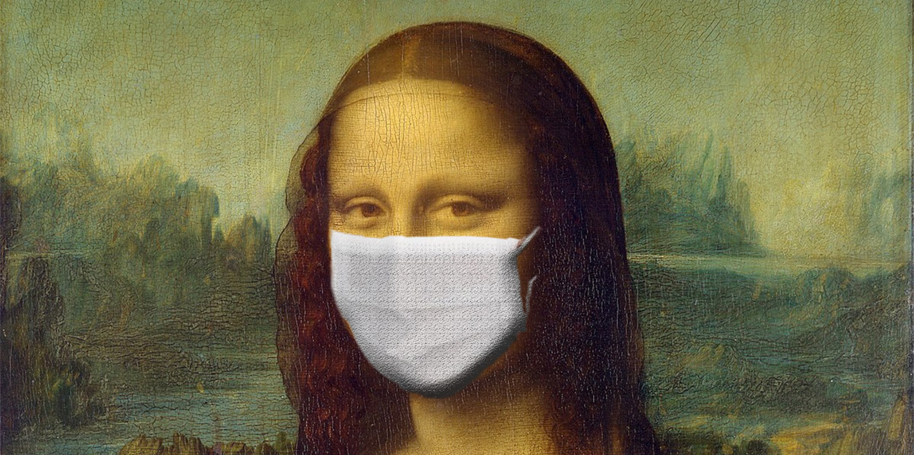
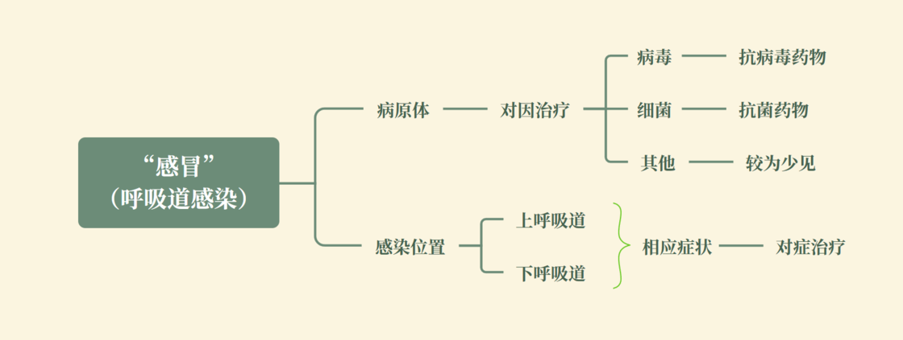
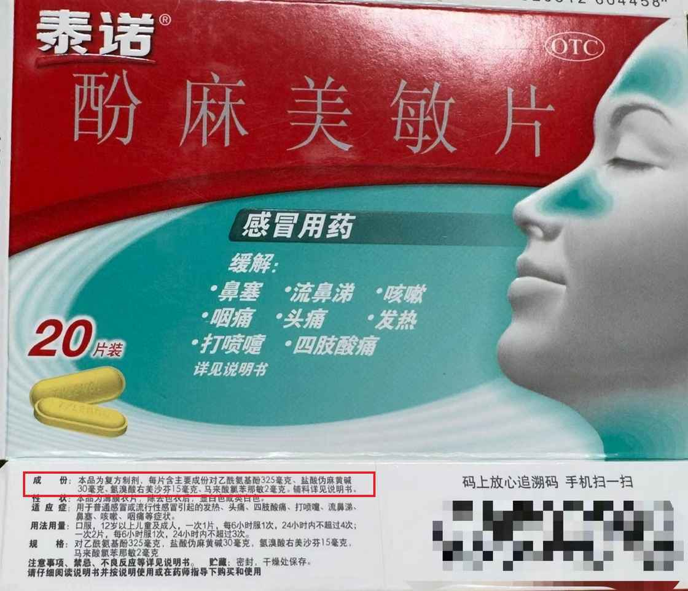
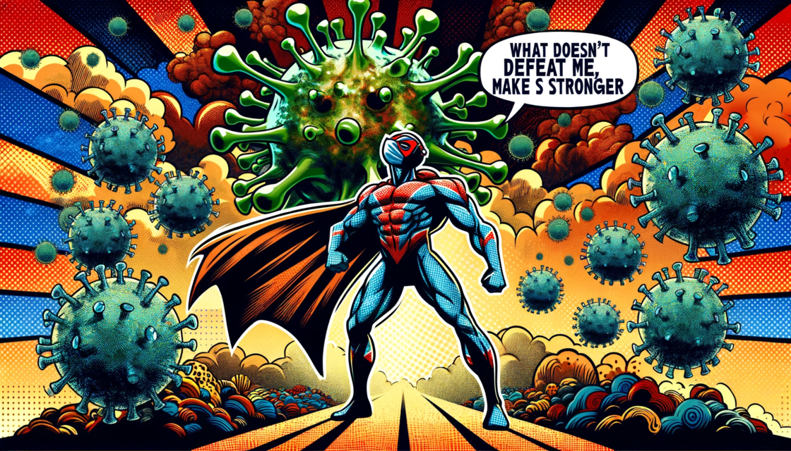

# 入门到精通：从今天开始成为感冒专家 - 少数派

入门到精通：从今天开始成为感冒专家

[EurekaLab](https://sspai.com/u/7w2qer6m/updates)

12 月 02 日

2023 年注定是不平静的一年。春天，人们才刚刚从新冠疫情中基本走出来，没想到，病菌们就在秋天合起伙来又给我们上了沉重的一课。在全球经济下滑的大背景下，可能只有医院的业绩还在稳步提升了。

一时间，风声鹤唳。在我的日常生活里，有一个叫「妈妈觉得你感冒」的场景时有发生。触发条件是我或者爸爸，在妈妈面前咳嗽或打喷嚏。此时，她就会投来审视的目光，然后质疑到：你是不是感冒了？

一语成谶——我、我爸和我妈三个人最后都中招了。

我相信，每个家庭都有自己应对感冒的方法和「神药」。但很快，我就被排除在家庭感冒对抗会议的讨论之外，因为我坚持只在症状最严重的几天服用「泰诺」缓解症状。这种行为无疑是和家庭的传统方式相违背的。

这并不奇怪，在目前的环境下，我们可以很轻松的在药店买到五花八门的治疗「感冒」的药物。同时，去一趟医院的时间和经济成本都很高。像感冒这种既「小」又常见的问题，每个人肯定都会有自己一套应对的经验，毕竟谁还没有得过几次感冒那。

但站在现代医学的角度上，很多人甚至都没有分清自己得的是哪种「感冒」。如果我们将很多种症状相近的情况混为一谈，使用一次或几次的经验去进行应对，就很有可能出现药物、治疗手段误用或者滥用的情况。

实际上，这样的情况并不少见。即使是我周围的很多医护人员，都没有分清楚其中的区别。一天早晚数种药物吃进肚子，服药的时候，有一种像是得了某种绝症的决绝感。结果到头来，不吃药 7 天好，吃药一周好。而碰巧某种药物在适当的时机出现在了你的服用列表上，于是立马升级成了「神药」。

> 「我上次感冒，吃了 xxx 一下子就好了。」
> 
> 「你要是听我的，吃两片 xxx 早就好了。」

事实真的如此吗？

## 感冒和「感冒们」有什么不同？

呼吸道感染简单分类

### 上呼吸道和下呼吸道感染

在日常的语境下，我们使用「感冒」这个词，一般是指代了出现发烧、流涕、打喷嚏、咳嗽等症状的一类疾病。而在医学专业语境下，更为准确的用词应该是呼吸道感染，而「感冒」一般只用来指普通感冒。

我们的呼吸道分为上呼吸道和下呼吸道。上呼吸道包括鼻腔、鼻窦、咽和喉，下呼吸道则包括气管、支气管和肺。这些部分共同协作，使得空气能够顺利地在肺部完成交换。上呼吸道感染指的是累及鼻腔、鼻窦、咽、喉部的感染，如普通感冒、流行性感冒、鼻炎、咽喉炎等，最常见的症状包括鼻塞、流涕、打喷嚏、喉咙痛等。而下呼吸道感染则是指累及气管、支气管和肺的感染，如各种支气管炎和肺炎，主要症状包括咳嗽、呼吸困难、胸痛等。1

虽然这两种感染在解剖位置上有所不同，但它们之间存在一定的关联，因为上呼吸道感染有时可以发展成下呼吸道感染，尤其是当你免疫力低下的情况下（儿童和老人）。值得注意的是，最近来势汹汹的支原体肺炎是一种特定的下呼吸道感染，与感冒在病原体和感染部位上都有所不同，因此将支原体肺炎视为感冒的一种类型是不准确的。

### 普通感冒和流行性感冒

|     |     |     |
| --- | --- | --- |
| 特征  | 普通感冒 | 流行性感冒 |
| 病原体 | 冠状病毒、鼻病毒等 | 流感病毒（A、B、C型） |
| 传播方式 | 空气飞沫、接触传播 | 空气飞沫、接触传播 |
| 主要症状 | 较轻  | 较重  |
| 发病速度 | 逐渐发病 | 迅速发病 |
| 发烧程度 | 轻微或无 | 通常高烧 |

流行性感冒（流感）和普通感冒都是传染性呼吸道疾病，但它们是由不同的病毒引起的。流感仅由流感病毒引起，而普通感冒可由许多不同的病毒引起，包括鼻病毒、副流感病毒和季节性冠状病毒。季节性冠状病毒不应与 SARS-CoV-2（导致 COVID-19 的病毒）混淆。

由于流感和普通感冒具有相似的症状，因此仅根据症状很难区分的。一般来说，流感比普通感冒更严重，症状通常更强烈，开始的更加突然。同时，可能会伴有严重的并发症，例如肺炎、高热等。感冒通常比流感轻，但普通感冒患者比流感患者更容易流鼻涕或鼻塞。2

### 合理的区分公式

于是，我们就得到两个在感染性疾病中非常关键的点：**病原体和感染位置**。所有的感染性疾病应该都围绕这两个关键点进行合理的区分。

例如：

-   普通感冒 = 冠状病毒或鼻病毒 + 上呼吸道
-   流行性感冒 = 流感病毒 + 上呼吸道
-   支原体肺炎 = 支原体 + 下呼吸道
-   肺结核 = 结核杆菌 + 下呼吸道
-   COVID-19 = SARS-CoV-2 + 上下呼吸道

应当注意的是，疾病并不是非此即彼的，很多情况下可能会有混合感染的形式出现。3

例如，很多去医院就诊的患者，可能会接触到一个叫做「六项呼吸道病原体核酸检测」的检查。其中就包括了：甲型流感病毒、乙型流感病毒（最常见的两种流感病毒）、呼吸道合胞病毒（病毒性肺炎最常见病毒）、腺病毒、肺炎支原体（支原体肺炎）、人鼻病毒（普通感冒）。

这样的检查，实际上就是用穷举法来检测常见的病原体，以确定你本次疾病是哪一种病原体导致的。我就见到过有 3 种病原体同时阳性的情况（鼻病毒+甲流+支原体）。

当然，这样的检查并不是每个医院都是一样的，可能这六项中会包含不同的内容，也有的医院会有八项、十项，但检查目的是一致的。医生也会根据你的症状和实际需求去进行检查。

当一种病毒在你的免疫系统中撕开缺口的时候，不正好是其他病毒乘虚而入的最好时机吗。

## 治疗「感冒」的基本原则

铺垫了这么多，终于讲到了重点，我们区分一个疾病的最终目的还是会落到应对和治疗上。

基本原则的示意图

### 针对病原体的对因治疗

对因治疗，顾名思义，就是解决导致这个疾病的根本原因。既然是感染，那么杀灭侵入机体的病原体，就是最简单直接的选择。

是病毒就杀病毒，是细菌就杀细菌。本来非常简单的一件事情，却难以具体实施。

因为，人类尚无直接在体内彻底杀灭病毒的手段。4

#### 病毒

其一，细胞结构的差异：

-   细菌是单细胞生物，具有完整的细胞结构，包括细胞壁、细胞膜、核糖体等。抗生素能够通过破坏细菌的细胞壁、抑制蛋白质合成、干扰核酸复制等方式来杀死细菌或抑制其生长。
-   病毒不是完整的细胞，而是由遗传物质（DNA 或 RNA）包裹在蛋白质壳中的微小粒子。它们依赖宿主细胞的机制进行复制，没有自己的代谢系统和生命活动。因此，抗病毒药物无法像抗生素那样直接攻击病毒的「细胞结构」。

其二，复制机制的差异：

-   细菌通过分裂自己的细胞来繁殖，这个过程是独立的，不依赖宿主细胞的机制。
-   病毒必须侵入宿主细胞并利用宿主细胞的机制来复制自己。抗病毒药物主要是通过干扰病毒的复制过程来工作，如阻断病毒的遗传物质复制、抑制病毒蛋白的合成等，但这些药物很难彻底清除体内所有的病毒。

服用抗病毒药物能够一定程度**缩短**病毒感染的**发作时间**和**降低**其**严重程度**。但由于 RNA 病毒易变异的特性（具体见第三节），很难开发广谱的抗病毒药物5。再加上经济成本（现在抗病毒药物都是新药，比较贵）及可能存在的副作用，除非是比较严重的情况，否则抗病毒药物使用的机会也比较少。

拿最为常见的流行性感冒为例。抗病毒药物对流感最有效的时间窗口是感染后的 48 小时内6。许多人在这个时间窗口内可能没有诊断出流感，错过了最佳治疗时机。当你开始出现明显症状的时候，病毒已经在你的体内大量的复制和肆虐了。再加上流感本身有自限性（即无需特别治疗，病情会随着时间的推移而自然好转或消失），这个时候再服用抗病毒药物的作用就非常有限了。

新冠病毒导致的症状较为强烈，本来应该是抗病毒药物的适应症。但人类研制药物的速度总是慢于病毒变异的速度。其高昂的售价、较低的产能加上有限的效果，使其注定只能成为「摆在橱窗里的精致玩具」。

#### 细菌

而面对细菌感染，例如支原体（一种特殊的细菌）等，一句话：上抗生素。遇到耐药的就进行药敏实验后，使用敏感的抗生素或者升级使用更加高级的抗生素进行治疗。

这里请注意，我们常听说的头孢、阿莫西林、罗红霉素、左氧氟沙星等全部都是抗菌药物，对病毒引起的感冒，没有一丝一毫的作用7。

### 针对感染位置的对症治疗

我们虽然没有办法直接消灭病毒，但是我们可以通过药物来缓解它们导致的症状。

我们来解构一下常用的治疗普通感冒和流感的药物「泰诺」——它的化学名叫**酚麻美敏片**，包含四种成分：对乙酰氨基**酚**、盐酸伪**麻**黄碱、右**美**沙芬以及马来酸氯苯那**敏**。

对乙酰氨基酚：解热镇痛药，主要作用是**止痛和退烧**；

盐酸伪麻黄碱：*β*2 受体激动药，作用是收缩鼻腔的血管，对抗鼻腔充血的症状。简单来说，就是**缓解鼻塞**；

右美沙芬：中枢性镇咳药，抑制咳嗽中枢而发挥作用，作用就是**止咳**；

马来酸氯苯那敏：抗组胺药，可以**缓解流泪、打喷嚏、流涕**等症状。

可以看到，「泰诺」的药物成分基本涵盖了常见的症状。但其没有一丝一毫的杀灭病原体的作用。所以如果你没有以上症状，或者症状并不是很严重的时候，服用「泰诺」是没有任何益处的。**它并不会让你好得更快一些，而是帮助你在整个过程中更好受一些**。

泰诺的包装盒

我们再来看看另外一个「神药」，xxx 感冒灵。其中除了几味中药之外，还有三个「西药」成分，分别是：马来酸氯苯那敏、对乙酰氨基酚、咖啡因。前两者我们已经介绍过了，咖啡因可以增强对乙酰氨基酚的吸收率和效果。至于其他的中药成分，因为我本身并不了解，所以不做过多解释了。

其实我们常见的治疗普通感冒和流感的药物，不过就是上面几种成分（及他们的替代药物）的排列组合罢了。

这里我整理了一些常用的药物成分和其效果，如果你碰巧感冒了，可以参考这份说明选购药物。

-   解热镇痛：对乙酰氨基酚、布洛芬；
-   缓解鼻塞、流涕、打喷嚏：氯苯那敏、苯海拉明；
-   缓解鼻塞：伪麻黄碱；
-   镇咳：右美沙芬、布桂嗪。

注 1：XX 酸等前缀不影响药物的效果和使用。

注 2：我列举的都是相对安全的成分，可能还有类似的药物，需要使用请咨询医生。

注 3：我的建议不能代替医生诊断和治疗。遇事不决，请即就医。

### 遇事不决，还请就医

由于临床上绝大多数发烧、鼻塞、流涕、咳嗽的患者都是普通感冒和流感，所以，我们使用抗生素（抗菌药物）一般是没意义的。这两种疾病都具有自限性，通常**高烧不会超过 3 天，并且整个临床过程不会超过 14 天**。

如果你出现了**高烧不退，症状长时间无法缓解（甚至加重），或者你是本身抵抗力较低的孩子和老人**，还请及时就医。

医生不光可以通过现代医学的检测手段，判断你的病原体究竟是什么，从而制定更有针对性的治疗方案。同时还有我上述所说的那些药物的「升级版」，能够更加有效、快速地对抗严重的症状。

此外，医生手上还有超级「救火队员」——糖皮质激素**。**它可以快速有效地扑灭大火，但灾后重建就要靠你自己的身体了**。**（这里就不展开了，如果想要说清楚糖皮质激素的重要性和作用，都值得开一篇新的文章了。）

## 为什么我们会反复地感冒？

最后，我们来聊聊，为什么我们已经反复感冒这么多次了，每次感冒都还是能够「虽迟但到」。

### 「同样的招式无法起作用两次」失效了吗？

高中生物课上，我们就学过一个过程，叫「免疫应答」8（很重要，后面要考）：

当病原体（比如细菌或病毒）进入我们的身体时，它们带有一些特殊的标记，就像是它们的「身份证」，我们称这些标记为「抗原」。我们的免疫系统就像一个非常聪明的安保系统，能够识别并对付这些不请自来的「客人」。

**识别和呈递**：首先，我们身体中的一些守门员细胞（这些是先天免疫细胞，比如树突细胞和巨噬细胞）会发现这些不速之客。它们会吞噬这些病原体，并把它们的「身份证」（也就是抗原的一部分）展示在自己的表面。

**报告和动员**：接着，这些展示了抗原的守门员细胞会去找我们的特种部队（T 细胞）。这些 T 细胞有一种特殊的能力，可以通过它们的「感应器」（T 细胞受体）识别这些抗原。当找到匹配的 T 细胞后，这些 T 细胞就会被激活，并开始制造一些信号物质（细胞因子）来调动更多的免疫力量。

**生产抗体**：激活的 T 细胞还会去激活另一支队伍——B 细胞。它们通过自己的「感应器」（B 细胞受体）识别特定的抗原。一旦找到匹配的抗原，B 细胞就会被激活，并转变成浆细胞。这些浆细胞是专门生产抗体的工厂，能够大量制造与病原体抗原完全匹配的抗体。

**记忆和快速反应**：在这个过程中，一些 B 细胞会变成记忆细胞，它们有很长的寿命，并且「记住」了这次遇到的病原体。所以，下次当同样的病原体再次入侵时，这些记忆 B 细胞能够迅速识别它们，并快速转变成浆细胞，生产大量匹配的抗体。

所以，同样的招式，无法对免疫系统使用两次。

——那么，如果每次来的都不是不同的病原体呢？

### 「疯狂」的 RNA 病毒

不知道大家有没有思考过几个问题：

-   为什么流感病毒的疫苗需要每年都打？
-   HIV（艾滋病病毒）这么厉害，为什么我们不开发一种疫苗来对付它？
-   为什么乙肝有疫苗可以打，但是丙肝没有？

解题的关键点就在于病毒的类型上。

病毒按遗传物质可以分为 DNA 病毒和 RNA 病毒。相较于 DNA 病毒，**RNA 病毒有极大的突变率**。9

|     |     |     |
| --- | --- | --- |
| **特性** | **DNA病毒** | **RNA病毒** |
| 遗传物质 | 脱氧核糖核酸（DNA） | 核糖核酸（RNA） |
| 遗传物质形式 | 通常为双链，部分为单链 | 可以是单链或双链，变异性较大 |
| 复制地点 | 细胞核内 | 细胞质中 |
| 稳定性 | 由于DNA复制校对机制，通常更稳定 | 由于校对机制较差，突变率较高 |
| 常见疾病 | 乙肝、水痘、带状疱疹 | 流感、艾滋病、新冠肺炎、丙肝 |

流行性感冒的病毒虽然都是流感病毒，但由于其属于 RNA 病毒，实际上每次来的可能都是不同的亚型。例如大家熟知的甲型流感病毒，其根据表面的两种蛋白质—血凝素（H）和神经氨酸酶（N）的不同组合来分类。甲型 H1N1 病毒就在 2009-2010 年的时候大流行过，而根据疾控中心的报道，最近市面上流行的主要是甲型 H3N2 病毒。

你体内针对 H1N1 的免疫应答机制，是没有办法识别 H3N2 的。所以，当你面对新一轮的流感的时候，实际上相当于面对一个新的疾病，自然无法做到快速识别和抵抗。

> **抗原漂移（Antigenic Drift）**：这是一种逐渐累积的小变化过程，随着时间的推移，病毒的遗传物质会逐渐发生微小的突变。这些小的变化足够改变病毒的抗原特性，使得人体的免疫系统难以识别，从而导致病毒逃避之前的免疫应答。
> 
> **抗原转移（Antigenic Shift）**：这是一种更为剧烈的变化，通常发生在甲型流感中。当两种不同亚型的流感病毒同时感染一个宿主（如猪或人类），它们可以交换遗传物质，产生一个具有全新表面蛋白的病毒株。这种显著变化可能导致大规模流感大流行，因为人群中几乎没有人对这种新病毒有免疫力。

疫苗的基本原理就是「模拟感染」。人们将病原体的一部分或者是灭活过的病原体注射到你的体内，来激活免疫应答，产生相应的记忆 B 细胞和抗体。当这种病原体真的入侵你体内的时候，免疫系统就可以快速反应，并且产生抗体抵抗。

由此可见，你注射了 H1N1 的疫苗，是没有办法完全抵抗 H3N2 的。所以当 H3N2 流行的时候，你需要再次注射 H3N2 的相应疫苗才有效。而流感的亚型远不止这两种。所以，疾控中心会监测流感病毒的流行趋势，分析哪些亚型最有可能在即将到来的季节中流行。基于这些信息，每年的流感疫苗都会更新（通常会包括三到四种不同的亚型）。

而作为 RNA 病毒的一种，新冠病毒的变异也是非常迅速的。从 Alpha (B.1.1.7)、Beta (B.1.351)、Gamma (P.1)、Delta (B.1.617.2) 到后来的 Omicron，也不过才短短 2-3 年的时间，至今仍在不断变异。这就不难理解，为什么我们不停地加种加强针都无法完全避免感染，只能够减轻相应的症状。

HIV 病毒是一个更为极端的例子，简直就是套娃。我犹记得本科时期的老师告诉我们，一个人体内可能会有几十甚至几百种不同的 HIV 病毒。

> HIV 分为两种主要类型：HIV-1 和 HIV-2。其中 HIV-1 最为常见。它可以进一步分为几个主要的群组（Group M, N, O, P），其中群组 M 最为常见。群组 M 又可以分为多个亚型（A、B、C、D、F、G、H、J 和 K），以及多种重组形式。

所以，目前针对 HIV 的治疗主要是抗逆转录病毒治疗。这可以有效地控制 HIV 病毒的复制，保持病毒载量在非常低的水平，从而抑制病情发展和降低传播风险。然而，这种治疗需要终身进行，一旦停止，病毒可能迅速反弹。

所以，我们为什么会反复感冒，根本原因就是，我们每次「感的都是不同的冒」。当你好不容易建立起来对抗感冒 1 的「城堡」，还有 2、3、4、5 以及正在变异的 6、7、8、9……在排队等着你。同时，免疫记忆的机制并不是终身的，如果一段时间不接触相应的病原体，你就可能会失去对这种病原体的抵抗。所以，得过感冒 1，不代表以后不会再得感冒 1。

也许，只有当人类不再需要呼吸的时候，才能够完全避免感冒了。

最后的最后，我的中二病又犯了。

by ChatGPT

感冒，这个看似微不足道的小病，似乎却成了人类和疾病斗争的缩影。尽管我们一次又一次的摆脱它，却始终无法彻底战胜它。只要给它一段时间，它必定会以更强大的姿态卷土重来，把我们弄得灰头土脸，狼狈不堪。直到有一天，当你的免疫系统随着年华老去而变得不再坚韧的时候，它就会尝试给你致命的一击。它一直都在提醒着我们，即便在现代医学的辉煌成就面前，人类依然是脆弱的。

内科学的厚重，不仅记录了无数疾病的知识和研究，也见证了人类对于健康与疾病理解的演进。在数万种疾病中，只有寥寥几个是能够完全治愈的，这一事实告诉我们一个深刻而沉重的真理：人类与自然界的关系是复杂而微妙的。我们在尽可能地探索和理解这个世界的同时，也在不断地认识到自己的局限性。

人类的死活，地球妈妈并不在乎，她平等爱着这个世界上的所有生物。

\> 关注 [少数派公众号](https://sspai.com/s/J71e)，解锁全新阅读体验 📰

\> 实用、好用的 [正版软件](https://sspai.com/mall)，少数派为你呈现 🚀

-   1Respiratory tract - Wikipedia
-   2Cold Versus Flu - CDC
-   3Antalis E, Oikonomopoulou Z, Kottaridi C, et al. Mixed viral infections of the respiratory tract; an epidemiological study during consecutive winter seasons. J Med Virol. 2018;90(4):663-670. doi:10.1002/jmv.25006
-   4Kausar S, Said Khan F, Ishaq Mujeeb Ur Rehman M, et al. A review: Mechanism of action of antiviral drugs. Int J Immunopathol Pharmacol. 2021;35:20587384211002621. doi:10.1177/20587384211002621
-   5Vigant, F., Santos, N. & Lee, B. Broad-spectrum antivirals against viral fusion. Nat Rev Microbiol 13, 426–437 (2015). https://doi.org/10.1038/nrmicro3475
-   6流行性感冒诊疗方案（2020年版）
-   7Why antibiotics aren't always the answer for an illness - Mayo Clinic
-   8Chaplin DD. Overview of the immune response. J Allergy Clin Immunol. 2010;125(2 Suppl 2):S3-S23. doi:10.1016/j.jaci.2009.12.980
-   9Payne S. Introduction to RNA Viruses. Viruses. 2017;97-105. doi:10.1016/B978-0-12-803109-4.00010-6

感冒和「感冒们」有什么不同？

上呼吸道和下呼吸道感染

普通感冒和流行性感冒

合理的区分公式

治疗「感冒」的基本原则

针对病原体的对因治疗

针对感染位置的对症治疗

遇事不决，还请就医

为什么我们会反复地感冒？

「同样的招式无法起作用两次」失效了吗？

「疯狂」的 RNA 病毒

© 本文著作权归作者所有，并授权少数派独家使用，未经少数派许可，不得转载使用。

全部评论(29)

热门排序

写下尊重、理性、友好的评论，有助于彼此更好地交流～

[linos](https://sspai.com/u/linos/updates)

12 月 02 日

久病成医 的最佳案例~😅😅

014

[梁某银](https://sspai.com/u/6p3otsnd/updates)

2 天前

好文章！本人是鼻窦炎，经常受鼻塞、流鼻涕困扰，虽然已经习惯了。但有时候会转化成比较严重的感冒（可能是受凉、换季引起），鼻涕量加大，每隔一会儿就擤鼻涕，非常难受，后面看了千古壹号的文章，尝试着去药店买了马来酸氯苯那敏片，小小一瓶，才几块钱。却异常管用，每次感觉要感冒，刚流鼻涕严重那一天，就立马吃药，于是后面也就没变严重（...展开

29

[梁某银](https://sspai.com/u/6p3otsnd/updates)

2 天前

附上千古壹号制作的【感冒药的有效成份及商品推荐】表格

6

[DrLouie](https://sspai.com/u/4okvb4jg/updates)

1 天前

一下子感同身受了，本人也是鼻窦炎患者，25岁以前一到换季就鼻塞、流鼻涕，长达半个月的那种完全堵死甚至还带有轻微的缺氧头晕，但是神奇的是大学毕业2年后再也没有犯过鼻炎，因为随着年龄增加免疫系统开始走下坡路了吗😂

0

[sgricky](https://sspai.com/u/uhi1ev0n/updates)

12 月 02 日

上半年，很多人知道了灭活每次只能够针对一个版本的RNA。下半年，很多人通过阿奇霉素，知道了某区的药有多少垃圾。

07

[Mu青蛙](https://sspai.com/u/4upzcfz0/updates)

12 月 02 日

好文！ 尤其是对于中医药的审慎态度，值得尊敬🫡

06

[seekay](https://sspai.com/u/m6romva7/updates)

1 天前

非常清晰明了，感谢作者！

01

[少数派98253209](https://sspai.com/u/xzorebku/updates)

12 月 02 日

扁桃体发炎怎么办

51

[EurekaLab](https://sspai.com/u/7w2qer6m/updates)

12 月 02 日

扁桃体发炎也是病毒性的居多，也只能服药控制症状，然后等它自己好。如果是细菌性的可以用点抗生素。

1

[12ben](https://sspai.com/u/km5rs9i4/updates)

回复

[EurekaLab](https://sspai.com/u/7w2qer6m/updates)

2 天前

扁桃体炎通常是细菌导致的，去丁香医生确认了一下。之前流感的体感也是初期并没有嗓子疼，上来就发烧了。

1

[EurekaLab](https://sspai.com/u/7w2qer6m/updates)

回复

[12ben](https://sspai.com/u/km5rs9i4/updates)

2 天前

我去看了你说的内容，你应该说的是丁香医生小程序上医典里的内容。它应该是直接复制《耳鼻咽喉头颈外科学》这本教材里面的内容的。这本书是教材，我无法反驳。但我也不是无的放矢。\[Windfuhr JP, Toepfner N, Steffen G, Waldfahrer F, Berner R. Clinical practi...展开

2

[EurekaLab](https://sspai.com/u/7w2qer6m/updates)

回复

[12ben](https://sspai.com/u/km5rs9i4/updates)

2 天前

此外，丁香医生公众号上另外一篇推文中，也有提到“一半以上的扁桃体炎都是病毒性的”。腾讯医典、梅奥诊所的医典、默沙东诊疗手册中也有相似的描述。当然，具体相信哪个是个人的判断。

1

[12ben](https://sspai.com/u/km5rs9i4/updates)

回复

[EurekaLab](https://sspai.com/u/7w2qer6m/updates)

2 天前

确实，在这上面细扣也远离本文的主旨

1

[RyanT](https://sspai.com/u/oj6q7g1v/updates)

12 月 02 日

批判性的看，还是有收获，可以信，但不能全信。

01

[卫书有道](https://sspai.com/u/xiaocun/updates)

12 月 02 日

几个图表做的既清晰又简单，感谢~

01

[Starkay](https://sspai.com/u/sebvmq80/updates)

22 小时前

非常棒的科普文章，求更“糖皮质激素”篇～（鼻窦炎患者应该都不陌生

00

[ccilsb](https://sspai.com/u/sk9a4xro/updates)

1 天前

我的感冒通常是冬天在特别热特别干燥的空调房间，长时间没喝水，突然就会感觉到鼻腔里边比较深的位置有些干疼，如果再不及时补水或换到湿润的环境，那就会诱发感冒，从鼻腔深处干疼开始，发展到嗓子疼，咳嗽，咳痰，病程10-14天。一个冬季最少两次，很痛苦。这算哪种感冒？

10

[啦啦啦巴卡](https://sspai.com/u/5sqc9g0e/updates)

16 小时前

我上2个礼拜经历了一次，嗓子疼、咳嗽、咳痰，病程10-14天。 但是很奇怪的就是前期没发烧，鼻子也算通畅。

0

[嗨盐](https://sspai.com/u/r247n053/updates)

1 天前

生活中注意饮食营养，注意优质蛋白质摄入，日常保持锻炼和有氧能力，这类提升代谢和免疫力的手段对感冒也是实用的。当然真的感冒了还是别锻炼了，个人经验是进行泡脚、舒缓运动、推拿之类理疗活动，帮助身体促进代谢和调节体温，让免疫系统更好发挥，对度过感冒病程也是有效的。

00

[木灬唯紫](https://sspai.com/u/3gm4z8bi/updates)

1 天前

后面咽喉炎怎么没有了/(ㄒoㄒ)/~~

00

[ggsl](https://sspai.com/u/5likx92s/updates)

1 天前

强！学习了

00

[少数派20719007](https://sspai.com/u/hr3orjq8/updates)

2 天前

很棒

00

[readerpi](https://sspai.com/u/olo426uf/updates)

2 天前

很用心的文章，感谢作者辛苦奉献

00

[冷薄荷](https://sspai.com/u/z5m709jf/updates)

12 月 02 日

复方氨酚烷胺、对乙酰氨基酚，普通感冒发烧症状基本都能对付。

00

[RayX](https://sspai.com/u/ljdff99u/updates)

12 月 02 日

好文我喜

00

[Tyrael](https://sspai.com/u/llcfngdw/updates)

12 月 02 日

有点“神农尝百草”那味道了～

00

[谨记少杲](https://sspai.com/u/3bt9rihi/updates)

12 月 02 日

该条评论已被隐藏显示点击查看

23

[EurekaLab](https://sspai.com/u/7w2qer6m/updates)

12 月 02 日

首先我确实是医生，但不是呼吸内科的医生。其次，如果有任何不对的地方，欢迎指正。

9

[imo](https://sspai.com/u/jpudy6eb/updates)

1 天前

哪里误导可以细说讨论

0

没有更多评论了哦
