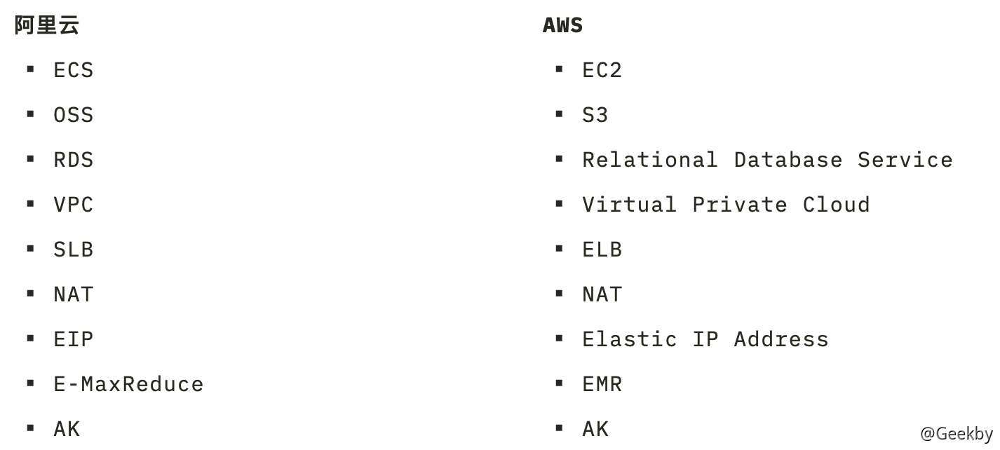
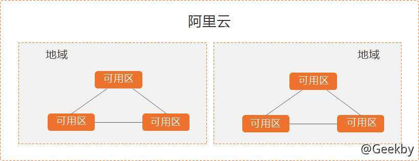

# 公有云安全

## 1 前言

Tips

1.  云租户安全不在讨论范围内
2.  云原生应用漏洞略有涉及
3.  微服务不在讨论范围内
4.  云安全配置错误以及不正确的「案例」示范是导致安全问题频发的重要原因

### 1.1 为什么要上云

-   安全传统边界模糊
-   all in cloud
-   公司越来越多

### 1.2 相关资料

[https://aws.amazon.com/n/training/](https://aws.amazon.com/n/training/)

[https://edu.aliyun.com](https://edu.aliyun.com/)

[https://cloud.tencent.com/edu/training](https://cloud.tencent.com/edu/training)

[https://cloud.google.com/certification/](https://cloud.google.com/certification/)

[https://www.microsoft.com/zh-cn/learning/azure-training.aspx](https://www.microsoft.com/zh-cn/learning/azure-training.aspx)

### 1.3 常见的云产品

## 2 常见概念

### 2.1 元数据 - metadata

在云计算中，Metadata 并不是一个陌生的概念。从字面上看，Metadata 是元数据的意思。而在云计算中，Metadata 服务能够向虚机注入一些额外的信息，这样虚机在创建之后可以有一些定制化的配置。在 OpenStack 中，Metadata 服务能够向虚机提供主机名，ssh 公钥，用户传入的一些定制数据等其他信息。这些数据被分为两类：metadata 和 user data，metadata 主要包括虚机自身的一些数据比如 hostname、ssh 秘钥、网络配置等，而 user data 主要包括一些定制的脚本、命令等。但是不管是哪一种数据，openstack 向虚机提供数据的方式是一致的。

Tips

可以类比 **docker file**

### 2.2 可用区 - Available Zone 和区域 - Region

先来看一下区域（Region）概念。AWS 云服务在全球不同的地方都有数据中心，比如北美、南美、欧洲和亚洲等。与此对应，根据地理位置我们把某个地区的基础设施服务集合称为一个区域。通过 AWS 的区域，一方面可以使得 AWS 云服务在地理位置上更加靠近我们的用户，另一方面使得用户可以选择不同的区域存储他们的数据以满足法规遵循方面的要求

以阿里云为例：

### 2.3 IAM - Identify and Access Management

可帮助你安全地控制用户对 AWS 资源的访问权限。通过 IAM 可以控制哪些人可以使用你的 AWS 资源(身份验证)以及他们可以使用的资源和采用的方式(授权)。

-   IAM-AWS
-   RAM-阿里云
-   CAM-腾讯云
-   IAM-华为云

#### 2.3.1 用户

如果您购买了多台云服务器 ECS 实例，您的组织里有多个用户（如员工、系统或应用程序）需要使用这些实例，您可以创建一个策略允许部分用户使用这些实例。避免了将同一个 AccessKey 泄露给多人的风险。

#### 2.3.2 用户组

您可以创建多个用户组，并授予不同权限策略，起到批量管理的效果。例如：

-   为了加强网络安全控制，您可以给某个用户组授权一个权限策略，该策略可以规定：如果用户的 IP 地址不是来自企业网络，则拒绝此类用户请求访问相关 ECS 资源。
-   您可以创建以下两个用户组管理不同工作职责的人员，如果某开发人员的工作职责发生转变，成为一名系统管理人员，您可以将其从 Developers 用户组移到 SysAdmins 用户组。
    -   SysAdmins：该用户组需要创建和管理的权限。您可以给 SysAdmins 组授予一个权限策略，该策略授予用户组成员执行所有 ECS 操作的权限，包括 ECS 实例、镜像、快照和安全组等。
    -   Developers：该用户组需要使用实例的权限。您可以给 Developers 组授予一个权限策略，该策略授予用户组成员调用 DescribeInstances、StartInstance、StopInstance、RunInstance 和 DeleteInstance 等权限。

#### 2.3.3 角色

实例 RAM 角色允许您将一个角色关联到 ECS 实例，在实例内部基于STS（Security Token Service）临时凭证访问其他云产品的 API，临时凭证将周期性更新。即可以保证云账号 AccessKey 安全，还可以借助访问控制 RAM 实现精细化控制和权限管理。

### 2.4 VPC - Virtual Private Cloud

专有网络 VPC 允许用户在云上构建出一个逻辑隔离分区，让用户在自己定义的虚拟网络中创建并运行新网的资源。用户可以完全掌控您的虚拟网络环境，包括选择 IP 地址范围，创建子网和配置路由表等。

### 2.5 ARN - Aliyun Resource Name

资源 ARN 的格式为:

arn:acs:${Service}:${Region}:${Account}:${ResourceType}/${ResourceId}

各字段含义如下：

-   Service：云产品code。
-   Region：地域ID。
-   Account：阿里云账号ID。
-   ResourceType：资源类型。
-   ResourceId：资源ID。

`arn:acs:ecs:cn-hangzhou:123456789\*\*\*\*:instance/i-xxxxxxxxxxxxxx`

参考：

[https://help.aliyun.com/document\_detail/172061.html?spm=5176.10695662.1996646101.searchclickresult.b8ae1b9ejjB6pU](https://help.aliyun.com/document_detail/172061.html?spm=5176.10695662.1996646101.searchclickresult.b8ae1b9ejjB6pU)

### 2.6 Access Key & Access Secret Key

访问密钥 AccessKey（AK）相当于登录密码，只是使用场景不同。AccessKey 用于程序方式调用云服务 API，而登录密码用于登录控制台。

### 2.7 架构图

## 3 公有云信息收集

### 3.1 识别和发现云产品

1.  产品的关键字 识别产品区域
    
2.  主动 FUZZ / 被动发现相辅相成
    
3.  甲方视角发现
    
    原生漏洞还是存在，比如 Hadoop 漏洞还是存在，RDS 弱口令还是有
