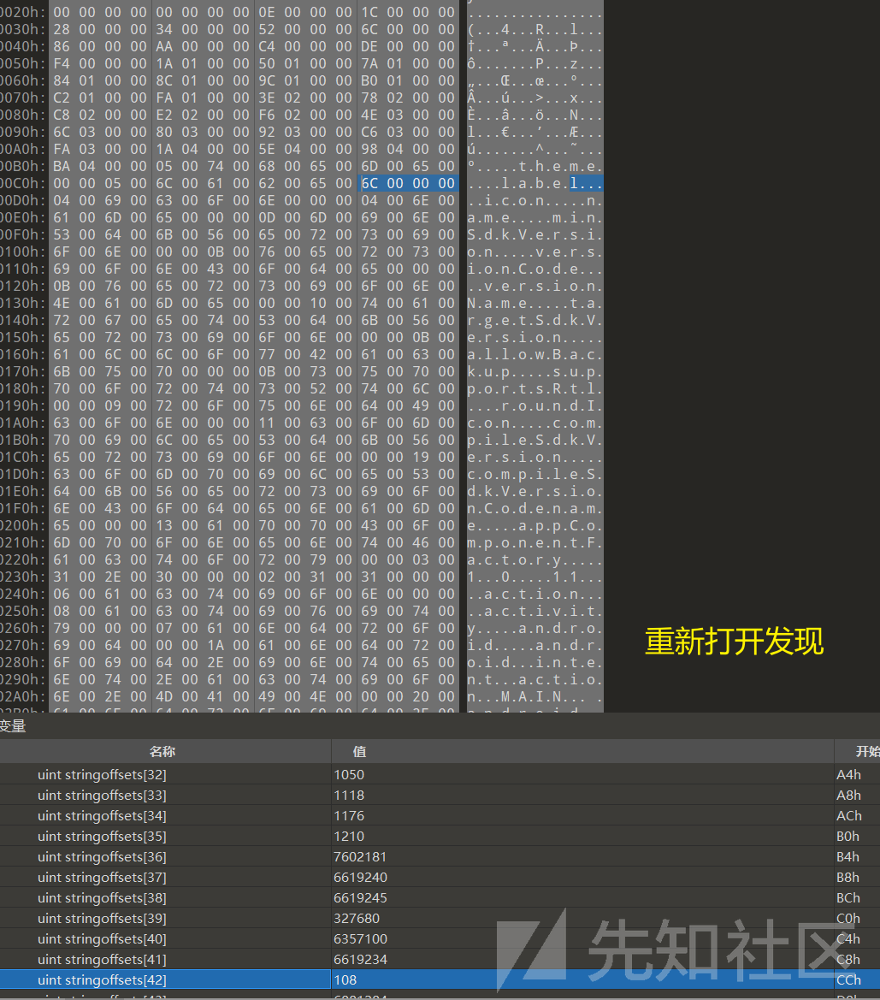

# 关于Androidmanifest文件加固探索 - 先知社区

关于Androidmanifest文件加固探索

- - -

恶意软件为了不让我们很容易反编译一个apk，会对androidmanifest文件进行魔改加固，本文探索androidmanifest加固的常见手法以及对抗方法。这里提供一个恶意样本的androidmanifest.xml文件，我们学完之后可以动手实践。

## 1、Androidmanifest文件组成

这里贴一张经典图，主要描述了androidmanifest的组成

[](https://xzfile.aliyuncs.com/media/upload/picture/20231101213011-c842581a-78ba-1.png)

androidmanifest文件头部仅仅占了8个字节，紧跟其后的是StringPoolType字符串常量池

（为了方便我们观察分析，可以先安装一下010editor的模板，详细见2、010editor模板）

### Magic Number

这个值作为头部，是经常会被魔改的，需要重点关注

[](https://xzfile.aliyuncs.com/media/upload/picture/20231101213036-d7154532-78ba-1.png)

### StylesStart

该值一般为0，也是经常会发现魔改

[](https://xzfile.aliyuncs.com/media/upload/picture/20231101213041-da6dff4e-78ba-1.png)

### StringPool

[](https://xzfile.aliyuncs.com/media/upload/picture/20231101213051-e05240e6-78ba-1.png)

寻找一个字符串，如何计算？

1、获得字符串存放开放位置：0xac（172），此时的0xac是不带开头的8个字节

所以需要我们加上8，最终字符串在文件中的开始位置是：0xb4

2、获取第一个字符串的偏移，可以看到，偏移为0

[](https://xzfile.aliyuncs.com/media/upload/picture/20231101213058-e438731a-78ba-1.png)

3、计算字符串最终存储的地方： 0xb4 = 0xb4 + 0

读取字符串，以字节00结束

[](https://xzfile.aliyuncs.com/media/upload/picture/20231101213103-e7047bd4-78ba-1.png)

读取到的字符为：theme

总结：

stringpool是紧跟在文件头后面的一块区域，用于存储文件所有用到的字符串

这个地方呢，也是经常发生魔改加固的，比如：将StringCount修改为0xFFFFFF无穷大

在经过我们的手动计算和分析后，我们对该区域有了更深的了解。

## 2、010editor模板

使用010editor工具打开，安装模板库

[](https://xzfile.aliyuncs.com/media/upload/picture/20231101213108-ea6d8018-78ba-1.png)

搜索：androidmanifest.bt

[](https://xzfile.aliyuncs.com/media/upload/picture/20231101213113-ed4f98ac-78ba-1.png)

安装完成且运行之后：

[](https://xzfile.aliyuncs.com/media/upload/picture/20231101213118-f0639656-78ba-1.png)

会发现完整的结构，帮助我们分析

## 3、使用**AXMLPrinter2进行的排错和修复**

用法十分简单：

```plain
java -jar AXMLPrinter2.jar AndroidManifest_origin.xml
```

会有一系列的报错，但是不要慌张，根据这些报错来对原androidmanifest.xml进行修复

[](https://xzfile.aliyuncs.com/media/upload/picture/20231101213125-f4902442-78ba-1.png)

意思是：出乎意料的0x80003（正常读取的数据），此时却读取到：0x80000

按照小端序，正常的数据应该是： 03 00 08

使用 010editor 打开

[](https://xzfile.aliyuncs.com/media/upload/picture/20231101213130-f75cf650-78ba-1.png)

将其修复

[](https://xzfile.aliyuncs.com/media/upload/picture/20231101213136-fadd0df6-78ba-1.png)

保存，再次尝试运行AXMLPrinter2

[](https://xzfile.aliyuncs.com/media/upload/picture/20231101213141-fdc98c88-78ba-1.png)

好家伙还有错误，这个-71304363，不方便我们分析，将其转换为python的hex数据

NegativeArraySizeException 表示在创建数组的时候，数组的大小出现了负数。

androidmanifest加固后文件与正常的androidmanifest文件对比之后就可以发现魔改的地方。

[](https://xzfile.aliyuncs.com/media/upload/picture/20231101213146-00a69770-78bb-1.png)

将其修改回去

[](https://xzfile.aliyuncs.com/media/upload/picture/20231101213150-0328cdec-78bb-1.png)

运行仍然报错，是个新错误：

[](https://xzfile.aliyuncs.com/media/upload/picture/20231101213154-05c5f02a-78bb-1.png)

再次去分析：

[](https://xzfile.aliyuncs.com/media/upload/picture/20231101213158-07cbf2d4-78bb-1.png)

stringoffsets如此离谱，并且数组的大小变为了0xff

[](https://xzfile.aliyuncs.com/media/upload/picture/20231101213203-0b392e8c-78bb-1.png)

[](https://xzfile.aliyuncs.com/media/upload/picture/20231101213207-0d82522c-78bb-1.png)

根据报错的信息，尝试把FF修改为24

[](https://xzfile.aliyuncs.com/media/upload/picture/20231101213211-0ffcd98c-78bb-1.png)

[](https://xzfile.aliyuncs.com/media/upload/picture/20231101213216-128c8d32-78bb-1.png)

再次运行

[](https://xzfile.aliyuncs.com/media/upload/picture/20231101213221-15efaeaa-78bb-1.png)

成功拿到反编译后的androidmanifest.xml文件

### 总结：

这个例子有三个魔改点经常出现在androidmanifest.xml加固

恶意软件通过修改这些魔改点来对抗反编译

感兴趣的小伙伴可以对附件自己动手实战一下。

附件.zip (0.001 MB) [下载附件](https://xzfile.aliyuncs.com/upload/affix/20231101213643-b1f0adfe-78bb-1.zip)
