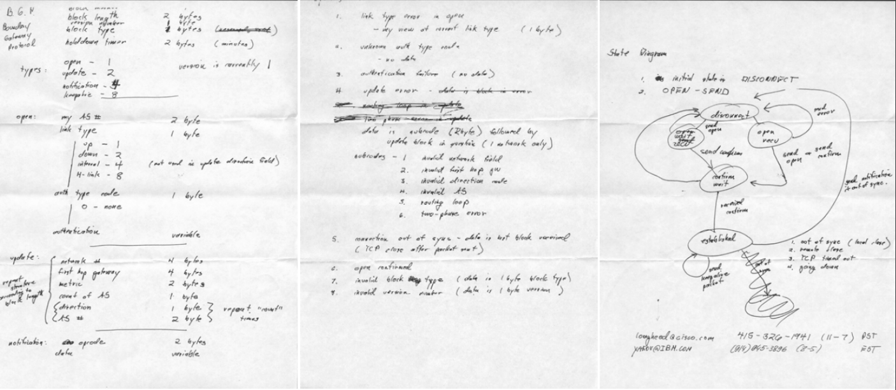
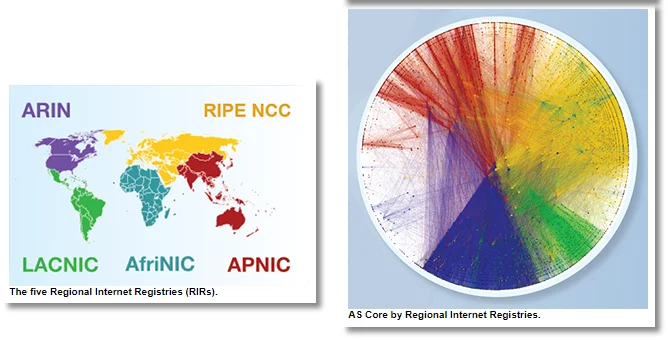
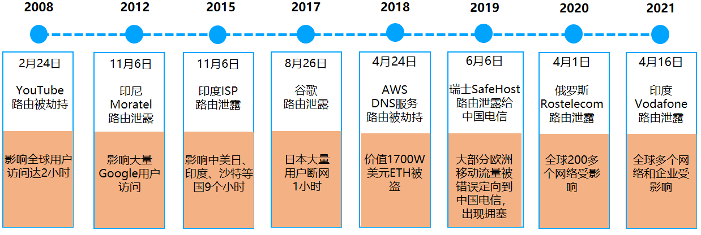
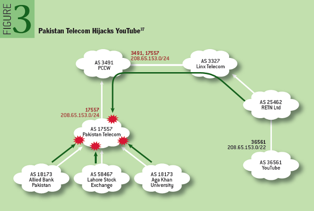
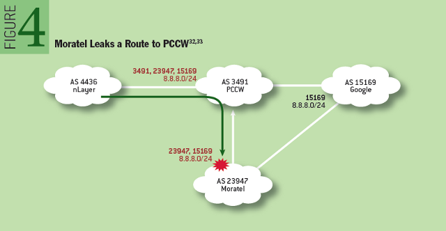
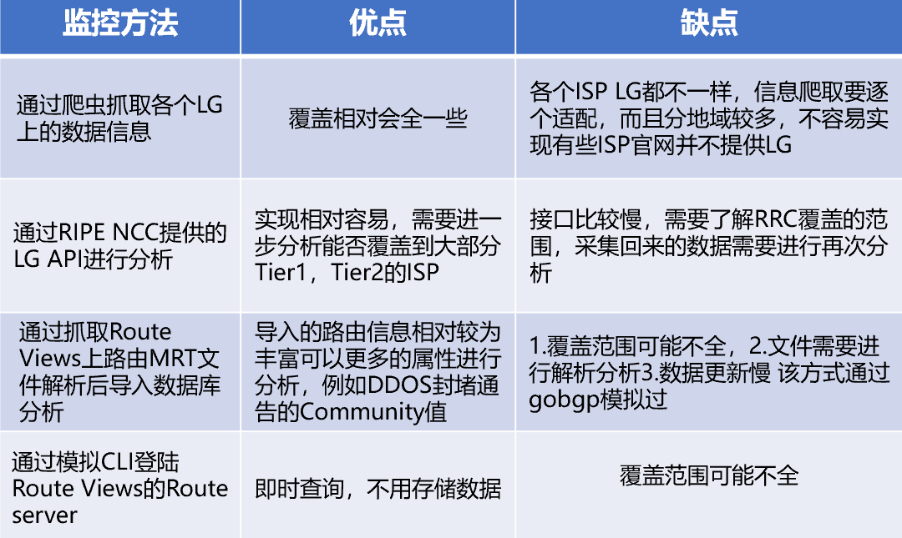

# 关于BGP那些事儿

**文｜**宙斯盾DDoS防护团队 rocky

# 导语

美国时间10月4日中午，Facebook公司网络出现重大故障，故障持续了6个小时后才恢复。官方给出的故障原因，简单来说是一次误操作引发了连锁反应（复杂点就是：在例行网络维护中，发送的一条命令无意中关闭了其全球骨干网的所有BGP连接，在其DNS服务器与内部网络不通后触发了内部机制，自动禁止DNS服务所在网段的BGP路由播布，而这又导致故障范围进一步加剧，并对故障恢复带来极大困难）。

这是Facebook创立以来最严重的一次网络访问事故，在这起故障中，我们又看到了BGP的身影（我为什么又要说“又”）。

# BGP是什么？

BGP协议，全称Border Gateway Protocol（边界网关协议），是组成我们当今Internet的一种去中心化的自治系统间的动态路由协议，它允许Internet上不同AS（自治系统）之间自动交换IP路由信息和可达信息，最主要功能在于控制路由的传播和选择最好的路由，并且还具备冗余备份、消除环路的特点。

该协议，最初是在1989年1月第12次IETF会议的午餐期间，Yakov Rekhter、 Kurt Lougheed 在 Len Bosak 的帮助下设计的，并写在了三张餐巾纸上（【图1】），后来于1989年6月份正式发布了RFC1105（BGP-1），之后升级到了RFC1163（BGP-2）、RFC1267（BGP-3）和RFC1771（BGP- 4），并一直沿用至今当（BGP- 4）。

  
图1

目前全球有18W+多个AS，通过BGP协议连接构建成了我们整体的互联网，这些AS号的使用者包括有各大ISP和内容提供商、云服务提供商、互联网企业、教育机构等等。

  
图2

# BGP安全问题有哪些？

虽然BGP协议在互联网中起着至关重要的作用，但是其安全性却很脆弱，一般BGP互联的2个AS之间，对于接收的IP前缀路由缺乏有效的认证机制（国内个别运营商会基于白名单做限制），导致无条件地接收或传播邻居AS的路由。

BGP的这种脆弱性，在遭受恶意攻击或人为变更配置错误时将会变得很突显，会对国家、运营商和企业对来极大威胁。BGP路由的安全威胁，可以大致分为两大类：BGP路由劫持（包括IP前缀劫持、IP子前缀劫持、AS路径篡改）、BGP路由泄露。前者更多是有目的性、恶意的攻击行为，后者多数发生在网络变更时的配置错误。【图3】列出了近10多年来的一些BGP重要安全事件。

  
图3

## 1、BGP路由劫持

首先讲讲IP前缀劫持，攻击者向外宣告自己拥有受害者的IP前缀路由（前缀与受害者AS号通告的一样），该路由通过全球网络传播，其他 AS 将使用其本地策略选择合法源 AS 的路由还是攻击者AS 发起的虚假路由。这种劫持方式，攻击者一般只能劫持到该IP前缀的部分流量。

更进一步地，攻击者可以将劫持的IP前缀改成比受害者AS宣告的更明细（即IP子前缀劫持），最终其它AS将根据BGP最长匹配原则，优先选择攻击者宣告的虚假路由。这种方式，攻击者正常可以劫持绝大部分该子前缀的流量。如【图4】，2008年2月24日，巴基斯坦为了国内言论管制封杀YouTube网站，电信局劫持了国内到YouTube对应IP子前缀208.65.153.0/24的访问（比YouTube全球宣告的208.65.153.0/22粒度更细），但由于电信局上游运营商PCCW将该劫持路由也通告了到全球，导致YouTube有至少2/3的互联网流量被劫持到巴基斯坦，致使其全球用户访问中断了2小时。  
  
图4（截图来自外部）

## 2、BGP路由泄露

路由泄漏是一种在现网中比较常见的路由事件，一般出现于ISP的错误配置，对外宣告了本不应该由该AS宣告的IP前缀路由，它能够造成 BGP 路由发生严重错误、进而导致互联网部分中断或拥塞。路由泄露，并不涉及虚假的IP前缀路由宣告，肇事者向其它AS泄露出去的路由是“合法”存在的，只是它违反了AS之间的路由策略，结果导致泄露出去的路由涉及IP的流量被重定向。

如【图5】，2012年11月6日，因印尼运营商Moratel在其路由器的错误配置，导致Google的8.8.8.0/24的BGP网段路由被泄露到了Moratel上游运营商PCCW，并且被PCCW扩散了错误的BGP路由（由于PCCW的本地路由策略）到其网内和互联AS，结果导致大量访问Google的互联网流量经过PCCW后先绕行到Moratel以至于无法处理，其中香港是影响重灾区，因为PCCW是香港的主要电信服务商。

  
图5（截图来自外部）

这里也总结罗列了下BGP安全问题可能造成的影响：

### （1）BGP路由劫持：

a. 流量被“黑洞”，正常访问中断  
b. 流量被中间人监听或攻击，或重定向到虚假网站以窃取数据  
c. IP被用于进行垃圾邮件活动  
d. 正常用户访问路径变长，网络延迟增加

### （2） BGP路由泄露

a. 泄露者AS网络流量拥塞，引发网络丢包

b. 造成互联网局部链路拥塞，引发网络丢包

c. 泄露者AS无下一跳路径，导致流经该AS的流量中断

### （3）其它：

拒绝服务攻击（DoS）：恶意或无意导致的配置错误的BGP表内容，将流经该AS的流量错误地指向其它AS网络，可能引发受害者AS网内拥塞或流量中断

# 如何监控和防范

目前业界提出的解决方案主要有两类：一是采集现网数据进行分析、网络主动探测等方式，对IP前缀劫持进行检测、定位和缓解，虽然检测与缓解技术目前具有较高的实用性，但现网数据仍存在区域和时间维度的局限性，漏报与误报依然无法避免，且难以预防安全事件的发生。二是通过基于数字签名、安全证书和加密技术等路由认证的安全机制，弥补BGP协议认证缺失的缺陷。

## 1、IP前缀检测

企业可自建监测平台，通过获取全球BGP路由更新信息，然后选取本企业的IP前缀路由与自己AS网络路由发布情况进行对比，主动监控感知BGP路由异常情况。包括监控BGP路由劫持（判断BGP路由信息中AS\_PATH的起源AS是否正确）、BGP路由健康度（比如判断单位周期内的路由更新类型、数量）。

监控方案，涉及到的全球BGP路由更新数据源，可通过多种方式获取，【图6】罗列了几种从外界拉取的方式，这些方案均存在一些缺陷，最明显的就是实时性和覆盖率问题。

  
图6

若无自建监测平台能力，可以使用商业的BGP路由监控平台，比如BGPMon。

企业在监测到BGP路由被劫持后，可反制的手段目前比较有限，包括向ISP宣告更明细的IP子前缀BGP路由，或者联系相关涉及ISP协助处置。此外，作为用户、企业、教育机构等组织网络接入的提供商（ISP），也有义务针对接入到其网络的AS设置路由宣告规则，限制其宣告的IP前缀，避免恶意或错误配置导致的错误IP前缀BGP路由被宣告ISP网内，并传播到全球。

## 2、全路由认证安全机制

近年来，比较推广的方案是RPKI &ROV、 BGPsec。

2017年10月，国际互联网工程任务组（IETF）和美国国家标准与技术研究院（NIST）、美国国土安全部（DHS）等机构共同启动了一个名为安全域间路由（SIDR）的联合项目，明确提出应对 BGP 协议进行保护以抵御BGP路由攻击威胁。“SIDR ”项目主要分为三个基本组成部分：资源公钥基础设施 (RPKI)、BGP 源路由验证（ROV）和 BGP 路径验证 (BGPSec)。

RPKI是一个分级的认证系统，RPKI存储有路由来源授权（Route Origin Authorization，ROA），它是一个IP地址前缀与BGP起源AS绑定签名的记录。互联网中的路由器可以利用ROA来执行路由来与验证（ROV），识别并丢弃来自未授权AS的“无效的”BGP路由宣告，以此防止IP前缀劫持攻击。

不过RPKI&ROV，只能防范如BGP路由劫持中 IP前缀、子前缀劫持这2种起源AS欺骗的简单攻击，像AS路径篡改、BGP路由泄露等场景，则需要采用BGPSec方案。BGPsec旨在补充BGP源路由验证的不足，当它与ROV结合使用时，可以防范各种针对BGP的路由劫持攻击。原理是路由宣告过程中，路由器从它的邻居AS收到的IP前缀路由宣告消息进行签名，签名内容作为路由消息的BGPsec\_Path属性传播给其它邻居AS，当路由器接收到带有BGPsec\_Path属性的IP前缀更新路由时通过检查签名判断该路由的AS\_Path路径是否正确，若错误的话直接丢弃，并不广播给其邻居AS。

# 我们的一些实践

针对外界BGP路由劫持的潜在风险，腾讯安全平台部宙斯盾团队联合网络平台部运营团队，搭建了腾讯BGP路由劫持监测平台。

在方案设计上，考虑到监控准确率、时效性以及后续的扩展能力，源数据采集基于网平团队在现网机房的部署BMP（BGP Monitoring Protocol ，BGP监控协议），通过获取对应的BGP路由更新信息进行路由劫持监控。

监测平台上线至今，已在现网多次监控到局部发生的腾讯网段被异常劫持或运营商侧异常变更问题。2021年4月16日晚上，Vodafone在印度的AS（55410）出现BGP路由泄露事件，错误地宣告了30000多个BGP网段路由，导致全球多个网络和企业受影响，腾讯BGP路由劫持监测平台，也及时感知发现了异常，有部分腾讯BGP网段被AS 55410劫持，并及时进行了处置，最终未影响到业务。

# 写在最后

其实在导语所述故障中除了BGP之外，还有另外一个基础协议的身影—DNS，作为互联网的基础设施，BGP和DNS的安全理应得到更多的重视。这类故障不是第一次出现，也必然不会是最后一次出现。希望从顶层设计到底层实现，从业界到厂商，能共同携手更好的提升这里的安全能力。如同这个文章也许受众会很窄、浏览量会很低，但是我们仍然希望更多的朋友能看到。

### 参考资料：

[https://queue.acm.org/detail.cfm?id=2668966](https://queue.acm.org/detail.cfm?id=2668966)

# 团队介绍

宙斯盾DDoS防护团队基于十余年的DDoS防护技术积累，持续为QQ、微信、王者荣耀、英雄联盟等自研业务提供专业、可靠的DDoS攻击防护解决方案。与腾讯云安全团队合作推出高防产品为云上客户提供专业、可靠的DDoS解决方案。
