# 关于File Upload的一些思考 - FreeBuf网络安全行业门户

**在web渗透中，文件上传是最简单直接的方式之一。****但是碰到完全不做校验的代码直接上传getshell，很难有这样的运气；大部分时候都有检测，甚至多处设卡。**

若按设卡点的顺序来说可大致分为：前端js检验、防护检测（waf）、服务端检测。

这里就讲如何绕过服务端代码的检测，服务端会出现文件上传的什么安全配置。

## 一、文件上传安全配置

一图顶千言，请看下图：

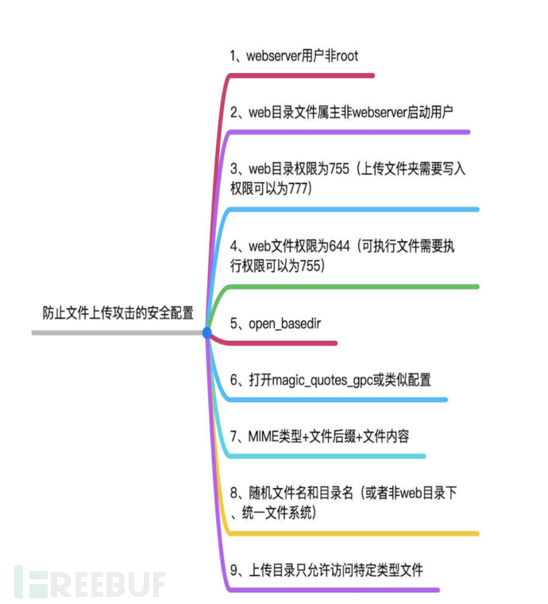

## 二、绕过服务端的代码检测

服务端的代码常检测request包中的三个点：

> 1）MIME类型 
> 
> 2）文件后缀
> 
> 3）文件内容

如下图所示：

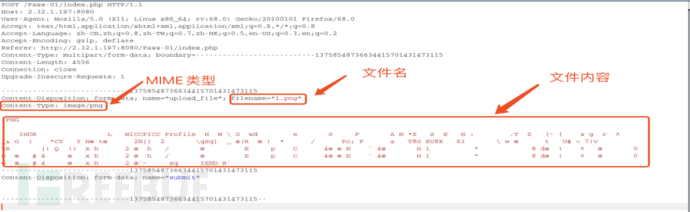

理论上请求包的任何参数都可以作为检测点，但是对于文件上传功能来说，用户提交的请求包中这三个地方，是辨别是否为恶意文件的重要的三个点，所以大部份后端程序的都是检测这么三个地方。

这三个检测点详细的检测方式，如下图所示:

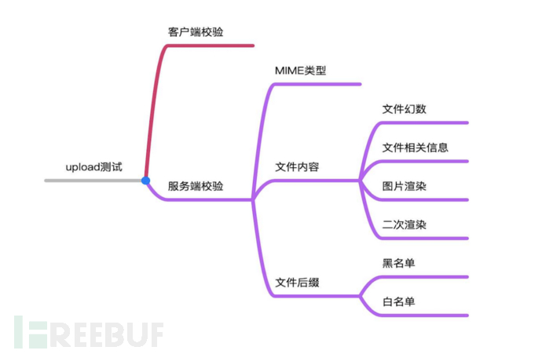

讲了这么多，那么该怎进行绕过呢？

话不多说，开始吧！

### 1）MIME类型检测

我们先来看一段在w3c上的，检验MIME类型的一段php代码，如下图所示:

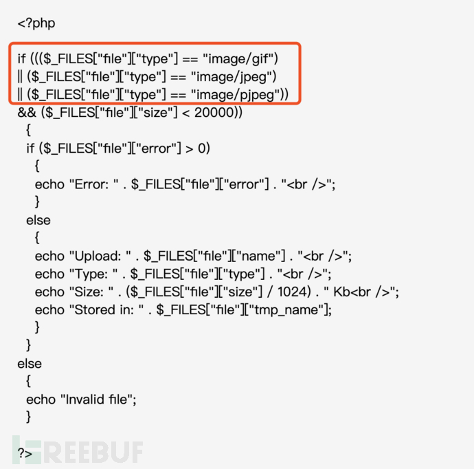

可以看见上面代码中只校验了http头中的MIME类型。

这MIME类型的校验啊，就好比：

城门守卫问你：“你是不是好人？”（php代码中的if判断）

你只需回答：“我是好人！”（request包中content-type字段改为image/jpeg）

然后，城门守卫就放行了。

至于你到底是不是好人，和你如何回答的是没有丝毫关系的。

这个逻辑适用于很多情况，这也是安全的基础：不信任任何客户端提交的数据。

### 2）文件后缀检测

文件后缀检测分两种情况：白名单和黑名单。

绕过白名单或黑名单有诸多姿势：“服务器解析漏洞” 、 “文件命名规则”、“00截断”、“长度截断”、“竞争上传”、“双上传”、“可解析后缀”、“.htacees和user.ini”、“误用函数”等等。

废话不多说，请看下图：

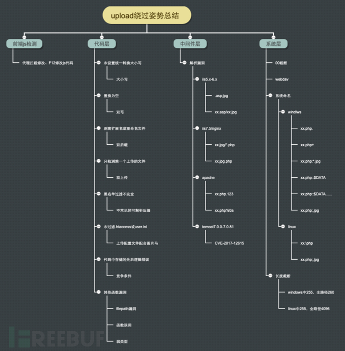

1、服务器解析漏洞

1.1、apache解析漏洞

首先，对于Apache服务器来说，哪些后缀可以被解析是由什么决定呢？

apache中有一个关于php的默认配置文件，其中用正则指定了哪些后缀使用哪些解析器。如图：

apache解析又一个特点，解析文件时是从右往左判断，遇到不认识的后缀时，就跳过，于是就有了类似于“.php.123”这种绕过方式。

但是从上图可以看到，这种方式在这种配置情况下是行不通的，但是在“CVE-2017-15715”中提到了可以使用%0a绕过，因为在上面正则中“.php$”代表以“.php”结尾或者“以.php”结尾加换行，可是一般情况下程序员获取文件后缀时会使用“$\_FILES\[‘file’\]\[‘name’\]”，它会自动过滤掉换行，这就让这个漏洞显得有些尴尬了。

大多情况下，我们遇到apache解析漏洞的是配置错误导致的，比如下面这条语句。

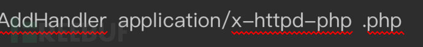

这种情况下，只要文件后缀包含“php”关键字，文件就会被作为php来解析。

1.2、nginx和iis7.5/7.0解析漏洞

此解析漏洞其实是php的配置错误导致。

php为了支持path info模式创造了fix\_pathinfo这个选项，当它被打开时，fpm就会判断请求的文件是否存在，如果不存在就去掉最后一个\\开始的内容，再次查看文件是否存在，不存在再去掉从\\开的内容，循环往复。所以当请求[http://192.168.1.100/admin/upload/shell.jpg/.php](http://192.168.1.100/admin/upload/shell.jpg/.php)这么个文件时，fpm会把/.php去掉把shell.jpg当作php执行。

后来出现了seccurity.limit\_extensions选项，这个选项默认配置.php文件才能被fpm执行。

利用条件：

> 1、fast-cgi模式运行
> 
> 2、Fix\_pathinfo为1 （默认为1）
> 
> 3、seccurity.limit\_extensions选项允许。（默认只解析.php）

1.3、Iis5.x-6.x解析漏洞

使用iis5-6的基本都是Windows server 2003这种老服务器了。

这种老服务器默认一般只解析asp。

这个解析漏洞很简单，就两条：

> 1、以\*.asp命名的文件夹下所有文件都以asp文件执行
> 
> 2、\*.asp;\*.jpg这种形式的命名方式会自动会忽略掉;后的内容。

2、文件命名规则

2.1、windows命名规则

> 1、文件名长度最大为255个英文字符。（或者是127个中文字符+1个英文字符）
> 
> 2、全路径最大长度最大为260个字符。
> 
> 3、访问文件不区分大小写（部分应用程序使用时除外），显示文件时有大小写。
> 
> 4、开头不能使用空格，其他地方可以。
> 
> 5、文件名不能包含： < > | / \\ \* ? :

我在freebuf上看见过这篇文章：

[↓↓↓](https://www.freebuf.com/column/196404.html)  
  
https://www.freebuf.com/column/196404.html  
  
[↑↑↑](https://www.freebuf.com/column/196404.html)

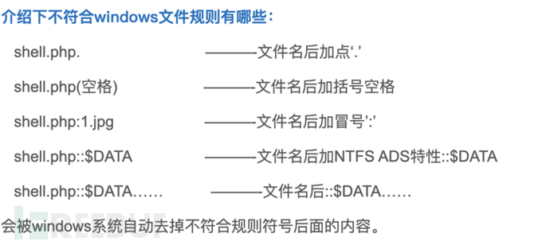

总结的很好，此处就直接引用了。

其实分号;也符合。大家自己寻找应该还有一些符号也符合。

2.2、linux命名规则

> 1、文件名最大长度为255
> 
> 2、全路径长度最大为4096（16级最大文件长度）
> 
> 3、区分大小写
> 
> 4、除“/”之外所有字符都可以使用
> 
> 5、linux不以文件扩展名区分文件类型，对linux来说一切皆文件。

linux下通过命名规则绕过的话，可以尝试 \\ 或者 && ; 等命令分割符号绕过

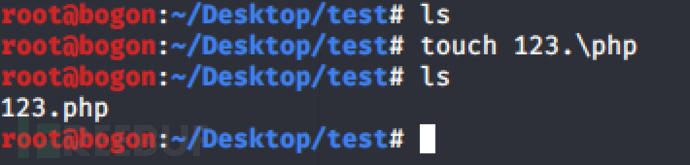

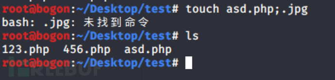

3、00截断

00截断常见的有%00、0x00等，他们都是表示ascii字符表中的保留字符chr(0)。

不管表示编码方式有啥区别，只要能让服务器正确解析为chr(0)就行。

00截断的原理：chr(0)表示结束。

限制条件：

小于php5.3.4 小于jdk1.7.0\_40

未过滤chr(0)，例如magic\_quoes\_gpc为off

4、长度截断

当文件名的长度超过系统允许的最大长度时，会将超出部分进行截断。

（部分系统不会进行截断，无法创建）

测试中可以使用二分法，不断尝试最大长度，然后进行截断。

5、竞争上传

当代码中的逻辑是先保存上传的文件，然后再判断上传文件是否合法时，便存在时间竞争条件漏洞。

首先写个生成马儿的马儿。

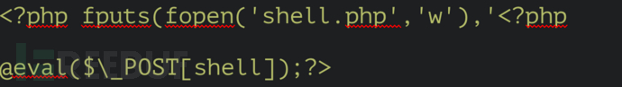

上传马儿，同时使用burpsuit不断请求马儿，或者写个脚本跑，

6、双上传

当代码中只对一处文件名做校验时，便存在双上传的漏洞。

使用burpsuit抓包改包或者F12修改前端代码都可以。

7、可解析后缀

不常见的可解析后缀：

> 1、ph(p\[1-7\]?|t(ml)?) \\ shtml \\ pwml
> 
> 2、asa\\asax\\cer\\cdx\\aspx\\ascx\\ashx\\asmx\\asp{80-90}
> 
> 3、jspx\\jspf\\jspa\\jsw\\jsv\\jtml
> 
> 8、.htacces和user.ini

首先先了解一下这俩文件，如下图：

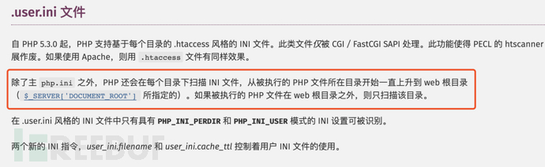

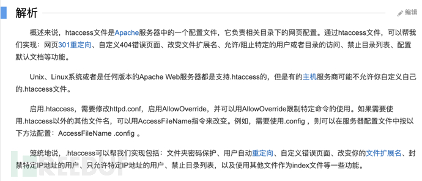

这两种利用方式差不多，都是先上传配置文件，然后上传图片马之类的。

唯一不同是，user.ini是把图片内容附加在php脚本前面或者后面，类似于require()函数;

.htaccess是把图片内容用php来解析。

9、误用函数

> empty()、isset()、strpos()、rename()、iconv()、copy()

参考

[↓↓↓](http://drops.wooyun.org/papers/1957)  
  
http://drops.wooyun.org/papers/1957  
  
[↑↑↑](http://drops.wooyun.org/papers/1957)

### 3）文件内容检测

1、图片马

一般情况下检测文件幻数、文件相关信息、文件渲染都可以通过制作的图片马进行绕过。

这里只讲文件渲染，因为能过文件渲染的图片马完全可以过上面那两种。

文件渲染顾名思义，就是对上传的文件进行加载渲染，例如加载图片检测是否能正常使用。

绕过方式：burpsuit改包 或者 copy 1.jpg /b + 2.php /a 3.jpg 生成图片马

2、二次渲染

二次渲染就不好过了，因为它会把图片中多余的语句去除，包括你的代码。

关于怎么制作过二次渲染的图片马，此处参考

> [↓↓↓](https://xz.aliyun.com/t/2657)  
>   
> https://xz.aliyun.com/t/2657  
>   
> [↑↑↑](https://xz.aliyun.com/t/2657)
> 
> [↓↓↓](https://secgeek.net/bookfresh-vulnerability/)  
>   
> https://secgeek.net/bookfresh-vulnerability/  
>   
> [↑↑↑](https://secgeek.net/bookfresh-vulnerability/)

或者，直接用别人做好的图片马

> [↓↓↓](https://github.com/Yang1k/upload-labs-Pass16)  
>   
> https://github.com/Yang1k/upload-labs-Pass16  
>   
> [↑↑↑](https://github.com/Yang1k/upload-labs-Pass16)

**\*本文原创作者：灭迹下的荒诞，本文属于FreeBuf原创奖励计划，未经许可禁止转载**
