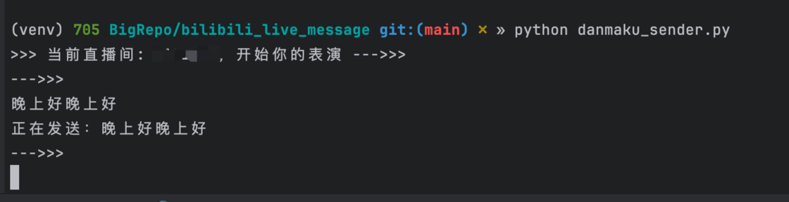

# 关于使用 MacOS 在 bilibili 虚拟区直播的记录 - 少数派

关于使用 MacOS 在 bilibili 虚拟区直播的记录

[](https://sspai.com/u/pk9zcv0n/updates)

[菜菜狗子](https://sspai.com/u/pk9zcv0n/updates)

2 天前

2023 年的最后几天了，我做了一点奇妙的尝试，在 bilibili 虚拟区开了一个直播间。过程中遇到了一些问题，在此记录一下。

### 设备和环境

-   电脑：Macbook pro (M2 Max)
-   摄像头：Redmi Note 12 Turbo

### 软件准备

-   OBS（屏幕采集、直播推流）：https://obsproject.com/
-   VTubeStudio（面捕、虚拟形象）: [https://denchisoft.com/](https://sspai.com/link?target=https%3A%2F%2Fdenchisoft.com%2F)
-   blivechat（弹幕机）: [https://github.com/xfgryujk/blivechat](https://sspai.com/link?target=https%3A%2F%2Fgithub.com%2Fxfgryujk%2Fblivechat)

OBS 的下载也可以使用 Homebrew，安装之后会有图标，也能通过终端的\`obs\`命令启动（命令启动更方便查看日志）。

VTubeStudio 用来加载 live2d 虚拟形象，官网可能打不开，可以去 Steam 搜索安装。VTubeStudio 本体是免费的，DLC 可选择购买，效果是消除水印。

blivechat 是用来在屏幕上显示观众弹幕和礼物的，MacOS 的版本需要自行编译一下，没有安装包。我的编译过程没有遇到问题，之后为了启动方便，加了一个 shell 脚本到系统环境里，内容可以参考一下：

```shell
#!/bin/bash

cd /Users/caigou/Dev/github/blivechat
python3 ./main.py
```

### 开播准备

#### OBS 相关的配置

OBS 基本上是开箱即用的，按照需求添加来源就行了，然后调整一下图层顺序和位置。

有坑的地方是混音。首先，MacOS 系统不支持音频的路由功能，无法将本机播放的声音捕捉到 OBS，这里需要安装个提供音频路由功能的软件。在互联网上能搜到 sunflower 和 blackhole 两个软件，其中 sunflower 暂未支持 Apple 的芯片，只能选择 blackhole。

blackhole 获取地址：https://existential.audio/blackhole/

下载方式是填写邮箱获取链接，应该是自动回复的，我这里瞬间就收到了，如果觉得麻烦也可以搜一搜其他人上传的版本，软件本身不大，即使是百度网盘也可以试试。

> 之前没换电脑的时候为了录屏有声音，用过 sunflower，所以没仔细查就先下载了，安装的时候才遇到问题。现在直接搜索应该已经是推荐 blackhole 更多一些了。

混音遇到的第二个问题是音量增幅。混音器的页面长这样：


拖动调节的时候只能从 -inf 调整到 0dB，但我使用的耳机的麦克风本身收音效果很差，需要进行一个增幅（比如绿框将上限调整到了 +5dB），扩大范围的修改可以点击更多（右侧的三个点）在「高级音频设置」里找到。

另外如果跟我一样用耳机或者环境有风扇空调之类的声音，记得给麦克风加一个降噪的滤镜。

#### VTubeStudio 相关的配置

先叠个甲，我没有在做正式的虚拟主播，对皮套 live2d 的配置没有深入研究，基本都是默认生成的然后开了同步眨眼。这里主要讲一下使用 Android 机的摄像头和 OBS 捕捉窗口的方式。

VTubeStudio 本身带了几个默认的模型，可以先体验一下，获取到更多模型放到指定文件夹内就能加载了。找模型的时候记得找 VTubeStudio 格式的下载，live2d 的标准并不是统一的。

导入模型并选择之后，应该又弹窗提示生成默认配置，生成之后打开面捕试一下，应该就能动了。模型的参数可以根据面捕的效果修改，找到适合自己的那个，一般默认参数都有些不够匹配的地方。

说到面捕，默认使用 Macbook 的摄像头肯定是可以的，但笔记本电脑的摄像头位置不好控制，可能会影响面捕的效果（尤其是恰好眼镜反光，会严重影响睁眼和眨眼的判断，观感很差），还是外置的摄像头好调整位置。VTubeStudio 选择摄像头的时候，如果有同账号的 iPhone 的话会出现 iPhone 的设备名，可以直接选择。如果要用 Android 设备的摄像头的话，就需要额外安装软件了。我选择的是 IriunWebCam: [https://iriun.com/](https://sspai.com/link?target=https%3A%2F%2Firiun.com%2F) 。使用起来非常简单，在手机和电脑上分别安装客户端，然后让手机电脑连接同一 wifi，打开软件就行了。

一切调整完毕之后还需要让 OBS 捕捉 VTubeStudio 的窗口，并且使用透明背景。透明背景是比较麻烦的一件事，VTubeStudio 修改背景时有一个透明窗口的提示，勾选之后在 MacOS 下是不生效的。MacOS 要实现透明背景有几种不同的方案，我最终选择的是使用单颜色背景再加色值 Filter 的方式（就像绿幕抠图一样），据说比较消耗资源，但直播也没有卡，应该还好。

具体的操作方法是：

1.  选择一个跟模型相差很大的颜色，我选了明亮的绿色
2.  OBS 添加窗口捕捉，选择 VTubeStudio 窗口
3.  给捕捉到的窗口添加滤镜，选择色度键（Chroma Key），调整一下参数直到背景消失

### 开播后的调整

按这个配置开播之后，我又遇到两个问题。因为 blivechat 的功能比较单一，无法查看进房提醒和发送弹幕，只能通过打开直播间的方式，无论是在电脑再开一个窗口还是使用手机都比较别扭。好在 blivechat 是开源的，可以去看看能不能自己动手。

然后看了，不太方便，作者也说确定不会增加这些额外功能，要保持小而美。看的过程中找到了 blivechat 使用的另一个库：[https://github.com/Nemo2011/bilibili-api](https://sspai.com/link?target=https%3A%2F%2Fgithub.com%2FNemo2011%2Fbilibili-api) 。有 api 的话，自己写一个就好了，还方便以后定制其他的功能。

代码需要用到 Python，bilibili-api 给的示例代码和文档都很详细了，基本简单拼装一下就行，不确定的地方就把例子喂给 GPT 然后获得输出。我最终使用的代码如下，仅供参考。

-   进房提醒，文字输出到终端+调用系统的 TTS 读出来

```python
@room.on('INTERACT_WORD')
async def on_enter_room(event):
    xlog(event)
    # parse fans model
    fans_medal_data = event['data']['data']['fans_medal']
    fans_medal = lm.FansMedal(fans_medal_data['medal_name'], fans_medal_data['medal_level'])

    # parse enter room notification
    enter_room_notification = lm.EnterRoomNotification(event['data']['data']['uname'], fans_medal)
    print(enter_room_notification)

    if len(enter_room_notification.name) < 10:
        pass
        os.system(f'say -v Han "欢迎 {enter_room_notification.name} 进入直播间"')
```

-   发送弹幕

```python
def check_message_valid(message):
    # trim message first
    message = message.strip()
    # check message length
    if len(message) > 30 or len(message) < 1:
        return False
    # if message is encoded in utf-8, then it's valid
    try:
        message.encode('utf-8')
        return True
    except UnicodeEncodeError:
        return False


def send_danmaku(_room, message):
    asyncio.run(_room.send_danmaku(Danmaku(message)))


def link_start():
    print(f'>>> 当前直播间: {CURRENT_ROOM_ID}，开始你的表演 --->>>')
    while True:
        user_input = input(f'--->>>\n')
        if user_input == '.exit':
            break
        else:
            if not check_message_valid(user_input):
                print(f'发送失败：消息不合法')
            else:
                print(f'正在发送：{user_input}')
                send_danmaku(room, user_input)


link_start()
```

发送弹幕的效果是这样的：



先凑合着用。

### 最后

有了 api 之后我还在陆续研究一些弹幕互动的玩法和数据记录相关的能力，有什么想法欢迎评论呀，其他问题也欢迎～

第一次在这边发文章，今后打算也多做一些程序员视角下的各种事情，或者用程序员的思路解决其他问题的内容，我是已经没人要了的 Android 开发工程师菜狗，下次一定！

[](https://sspai.com/u/kgguxr0e/updates)

[广陵止息](https://sspai.com/u/kgguxr0e/updates)

1 天前

文章里有几个地方不知道能不能改进一下，一个是 OBS 新版本支持了macOS Audio Capture Source，可以不需要 blackhole 之类的绕一圈了。一个是，Android 也可以直接用 VTubeStudio 来捕捉，不太清楚为什么要从 IriunWebCam 在绕一圈。最后一个就是文章里可以提一下 VTubeStudio 在 FaceID 模组的加持下会比纯 2D 的摄像头获得更好的效果。收起

00
