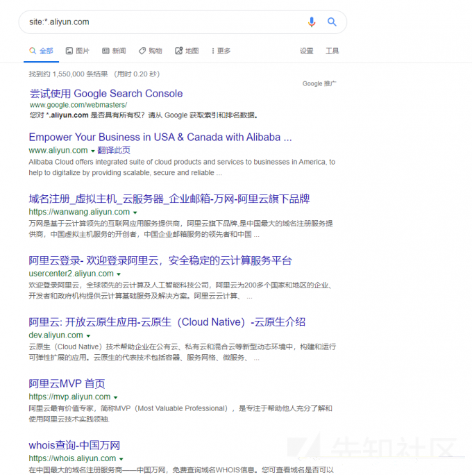
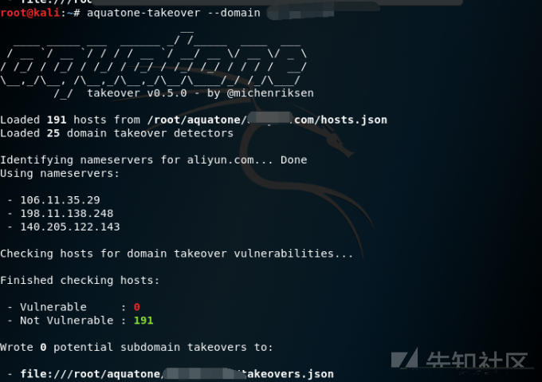
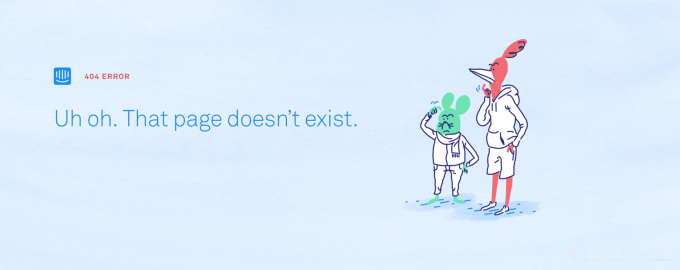

# 关于子域名劫持的一些总结 - 先知社区

关于子域名劫持的一些总结

- - -

\[TOC\]

# 0x000前言

最近和表哥学挖洞，表哥教了我一手子域名劫持，感觉很简单而且知识点很少，但是前几天真的遇到了一个反而发现无法劫持，到最后一步cname解析的时候出了错误，于是恶补了一下相关知识，写下这个文章。文章内可能会有一些理解错误，欢迎各位大佬指出，谢谢。

# 0x001相关知识

## 1 CNAME DNS记录

别名记录，将域名解析到另外一个域名。不过这个解释对于我们劫持似乎没有帮助，我们需要的是cname在cdn中的应用

### CNAME在CDN中的应用

在CDN服务中储存了对于站点的cname后，如果一个用户向浏览器提供访问域名，cdn参与后，不再是域名->ip解析而是域名->cname解析，这样就导致了如果cname的指定域名如果有误的话，会跳转到错误地址。

## 2 CloudFront

[AWS CloudFront](https://aws.amazon.com/cloudfront/ "AWS CloudFront") 是一项快速内容分发网络 (CDN) 服务。可以通过将SSL证书和私钥上载到个人的CloudFront发行版，CloudFront就可以充当SSL代理。这意味着只要有人通过CloudFront请求个人的域，CloudFront就会提供个人的SSL证书。

创建一个cloudfront服务后，aws会生成一个随机域名，而用户可以访问该域名中的文件。看上去可以成功防护一些子域名劫持。但是cloudfront并不是一一映射，分配的随机域名并无专用的ipv4地址。它是多对多映射。这也就导致了其他客户也可以使用，配置对应域名的cname

# 0x002关于子域名劫持

## 导致子域名劫持的原因

以AWS cloudfront为例，为了可以使客户可以跟快地访问网站，厂商在cloudfront生成了一个子域并对其管理。某天因为开销，关闭对于功能等中止了该服务，但是在中止服务的时候没有删除AWS cloudfront上的cname记录，这些cname记录就会继续保留在AWS cloudfront中，若此时有攻击者申请cname服务并且将厂商遗留下的子域名cname解析到自己的服务器，AWS cloudfront便会直接调用厂商遗留的cname给攻击者。这样，攻击者便获得了对应子域，达到了子域劫持的目的。

## 发现子域名劫持

### 发现子域名

发现子域名的方法，我用的主要是两种：  
一、Google Hacking语法  
`site:*.target.com site:*.*.target.com site:*.*.*.target.com`  
如图情况

二、脚本检测  
比较推荐的脚本有  
1.[aquatone](https://github.com/michenriksen/aquatone "aquatone")

2.[JSFinder](https://github.com/Threezh1/JSFinder "JSFinder")  
三、一些别的方法  
这个在先知上有一些文章说了，我就不献丑了。  
[如何高效的查询子域名？请使用这几个好方法](https://xz.aliyun.com/t/1168 "如何高效的查询子域名？请使用这几个好方法")  
[深入了解子域名挖掘tricks](https://xz.aliyun.com/t/6617 "深入了解子域名挖掘tricks")

### 检验子域名劫持的可能

一般在发现子域名后，我是是直接写成json数据后放入aquatone里面跑，使用命令  
`aquatone-takeover --domain example.com`  
  
来进行初步验证，如果现实有vulnerable的值，也就是可能可劫持的域名后访问页面，来确认是否是一个已被放弃的域名，如显示  
  
这里有一个github上的项目，上面集成了一些国外大厂域名的劫持可能性，案例以及各种讨论。  
[can-i-take-over-xyz](https://github.com/EdOverflow/can-i-take-over-xyz "can-i-take-over-xyz")

### 一个骚操作，利用网站自身的功能劫持子域名

有些网站对于子域名的防护做的很好，哪怕是已经放弃了也会禁止其他人对该域名声明，但是不代表他们自己无法声明。  
比如intercom.  
如果发现intercom上存在了上述案例，我们则可以去创建一个intercom用户并可以试用服务一段时间，接着在服务设置里面的自定义域字段中添加给出错误信息的子域，打开帮助中心并发布测试文章。  
之后便可以成功成为该子域的帮助中心管理员。

# 总结

这里也就大致明白为什么之前我的劫持会失败了，对应厂商是否使用了cdn，使用的是何平台的cdn我都不知道，当时的我只是单纯的去github上尝试用cname来劫持对应子域，自然是解析不了的，因为github可能根本没有对应的cname纪录。

其实子域名劫持相比于其他的漏洞，技术要求相对低（虽然在h1上面的评分与赏金挺高的）。如果说sql注入、xss等漏洞的挖掘是技高一筹这种漏洞更像是投机取巧，它就是利用厂商在挖坑后没填的情况下快速占坑来达成目的。这种洞想要预防也很简单，只要工作人员细心一些，关服务前清一下cdn上面的cname记录就可以解决。  
不过每年还是能看到一些该洞的报告。国内的站情况如何，我不清楚，因为也看不到报告。但是国外的站，查一查还能发现在几个月前星巴克才爆了几下。

我也想挖几个啊，这种洞感觉就是白拿钱orz（话说我买一个xxx.xxx.target.com的域名算不算子域名劫持啊hhh）。

参考链接  
[https://0xpatrik.com/subdomain-takeover-basics/](https://0xpatrik.com/subdomain-takeover-basics/)  
[https://github.com/EdOverflow/can-i-take-over-xyz](https://github.com/EdOverflow/can-i-take-over-xyz)  
[https://blog.zsec.uk/subdomainhijack/](https://blog.zsec.uk/subdomainhijack/)\[[https://blog.sweepatic.com/subdomain-takeover-principles/](https://blog.sweepatic.com/subdomain-takeover-principles/)\]  
([https://blog.sweepatic.com/subdomain-takeover-principles/)\[https://labs.detectify.com/2016/10/05/the-story-of-ev-ssl-aws-and-trailing-dot-domains/\](https://labs.detectify.com/2016/10/05/the-story-of-ev-ssl-aws-and-trailing-dot-domains/](https://blog.sweepatic.com/subdomain-takeover-principles/)[https://labs.detectify.com/2016/10/05/the-story-of-ev-ssl-aws-and-trailing-dot-domains/](https://labs.detectify.com/2016/10/05/the-story-of-ev-ssl-aws-and-trailing-dot-domains/))
