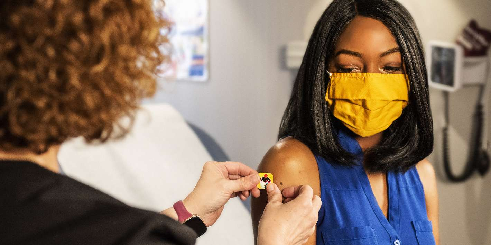
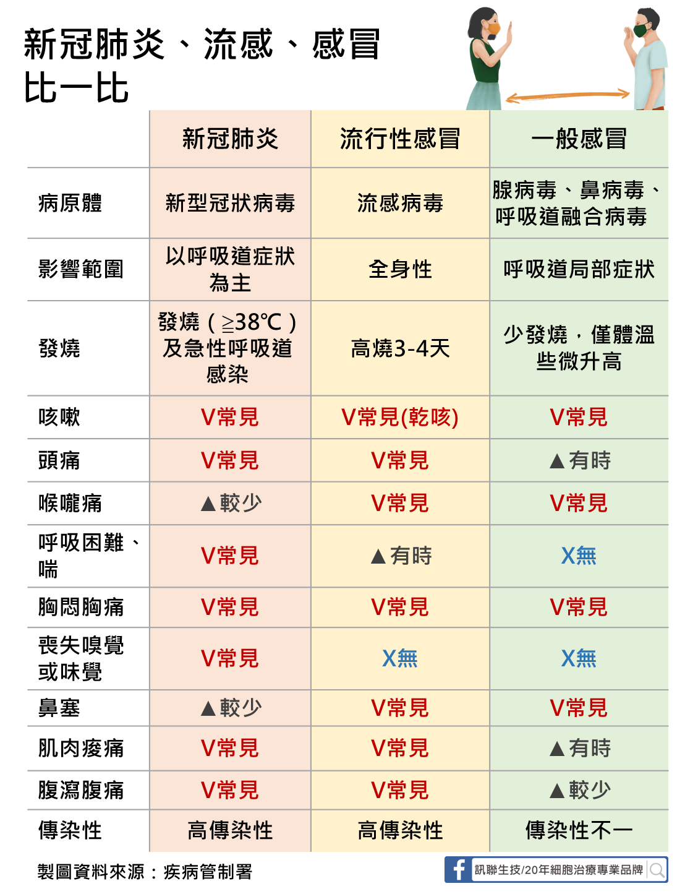
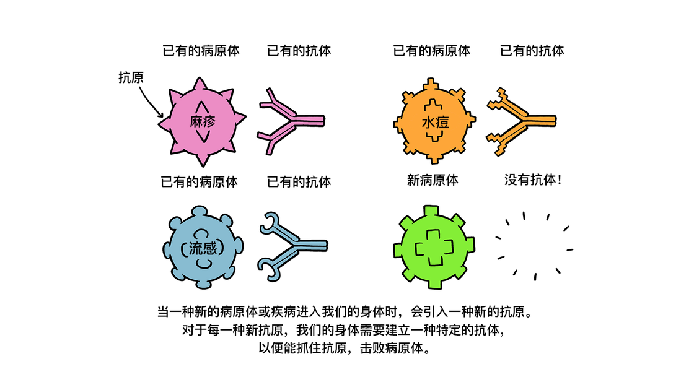
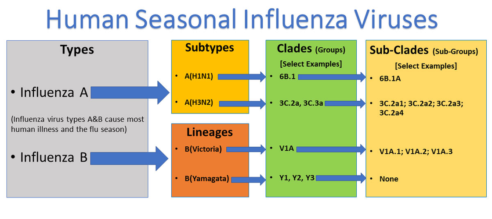
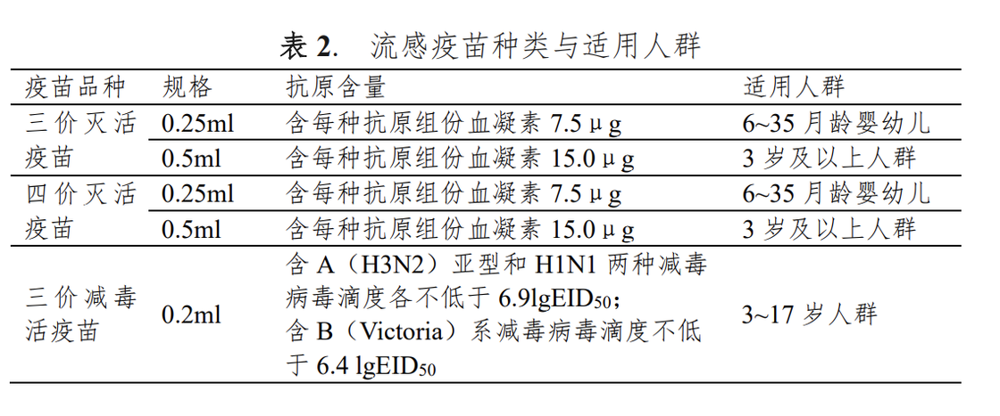
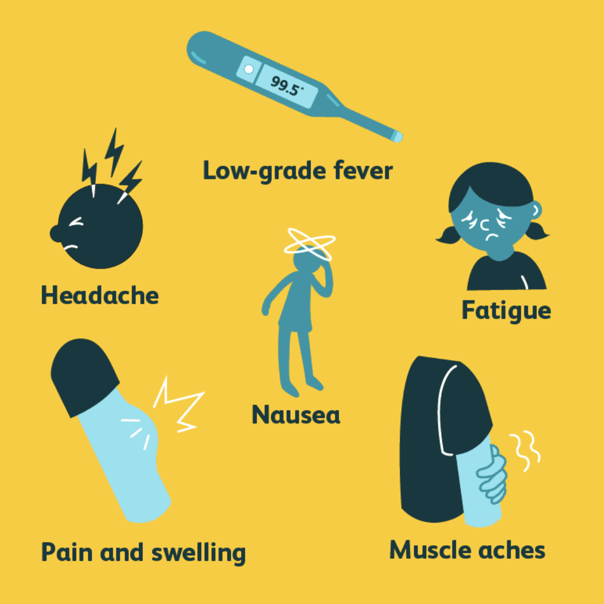
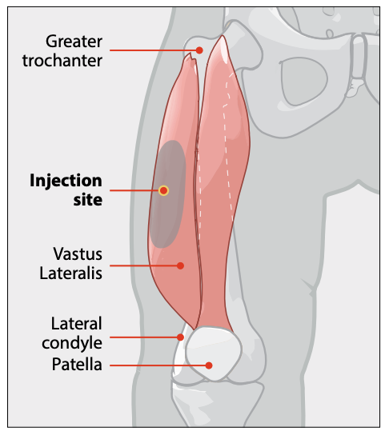
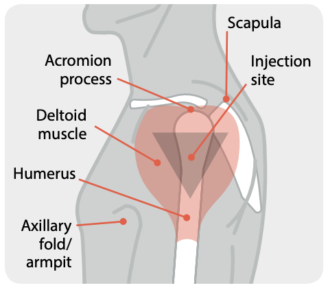
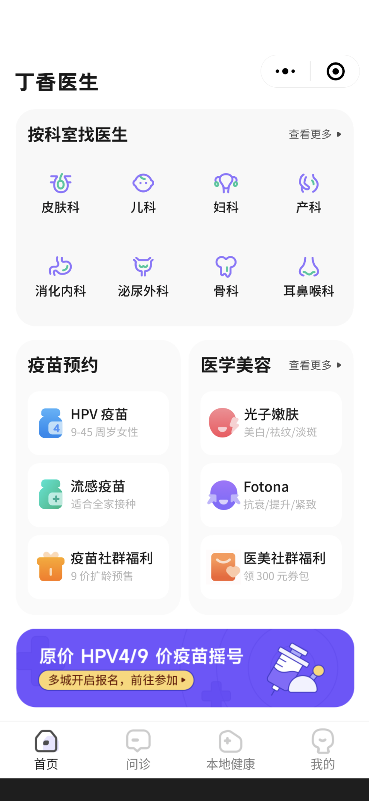
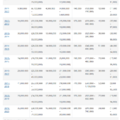

# 关于流感和疫苗，你需要知道哪些信息？ - 少数派

关于流感和疫苗，你需要知道哪些信息？

[一柳繁](https://sspai.com/u/tgwbddu0/updates)

2022 年 11 月 23 日

[11 月 28 日更新：2023 年流感季重推](#update-0)

据国家流感流感中心 11 月 23 日发布的 2023 年[第 46 周流感监测周报](https://sspai.com/link?target=https%3A%2F%2Fivdc.chinacdc.cn%2Fcnic%2Fzyzx%2Flgzb%2F202311%2FP020231123356102747665.pdf)，目前南、北方省份流感病毒检测阳性率持续上升，最新一周的检测结果以 A（H3N2）亚型为主，这也是造成季节性流感的病毒中，相当常见的一类甲流亚型。

冬天往往是传染病肆虐的季节。季节性流感是一种由甲型或乙型流感病毒引起的急性呼吸道疾病。病毒侵入人体后，会影响人体的上呼吸道甚至肺部，引发一系列症状，甚至可能导致死亡。统计数据称，在全球范围内，流感每年可以导致 300-500 万例重症与 29-65 万例相关死亡，其中老人、小孩、孕妇，和有慢性疾病的人群更容易受到流感的影响。1

想要预防流感带来的后果，最简单的方法就是接种流感疫苗。本文就将介绍在打流感疫苗之前，关于流感和疫苗，你需要知道什么。

## 流感的症状有哪些？

最初，流感的症状可能非常轻微，比如发烧、干咳、肌肉痛、头痛、疲劳等。这些症状如果出现在健康的成年人身上，则通常可以在几天内消失；但对于一些易感人群来说，感染流感可能会导致一些危及生命的并发症，如肺炎、心肌炎等，甚至死亡。据统计，每年全球估计有 10 亿例流感病例，其中 300-500 万例为重症病例，导致 29-65 万例流感相关呼吸道疾病死亡。2

不过，这些症状也是其他上呼吸道感染常见的症状，它往往不易与普通感冒或新冠区分。简单来说，感冒的鼻部症状更多（如流鼻涕、打喷嚏等），而流感和新冠有更多身体上的反应，最明显的就是肌肉痛和头痛。除了用核酸检测区分流感和新冠，味觉和嗅觉丧失也在感染后更常见。更详细的症状对比可以参照下图：

图源：[https://www.bionetcorp.com/article?ac\_id=33&ac\_sub\_id=60&a\_id=162](https://sspai.com/link?target=https%3A%2F%2Fwww.bionetcorp.com%2Farticle%3Fac_id%3D33%26ac_sub_id%3D60%26a_id%3D162)

## 流感疫苗是如何起效的？

人体在面临外来病原体时，会调用自身免疫系统产生抗体，击退病毒。如果遇到了之前遇见过的病原体，那么免疫系统就会更迅速地做出反击。如果想在不感染的前提下就能有「更快、更多、更强」的免疫反应，就只有伪造一个看似有害、实则无害的病原体，送给免疫系统「认认门」，就不用在接触真·病毒的时候提心吊胆了。

疫苗正是如此起效的，流感疫苗也不例外。它里面通常包含了与病原体结构相似、又易被免疫系统识别的「抗原」，就已经足够让免疫系统认识到它的存在，并产生相应的抗体。等遇到了有活性的流感病毒，就能立刻产生出与他相对应的、最有效的抗体，将病毒消灭。

图源：[https://www.who.int/zh/emergencies/diseases/novel-coronavirus-2019/covid-19-vaccines/how-do-vaccines-work](https://sspai.com/link?target=https%3A%2F%2Fwww.who.int%2Fzh%2Femergencies%2Fdiseases%2Fnovel-coronavirus-2019%2Fcovid-19-vaccines%2Fhow-do-vaccines-work)

目前已知的流感病毒分为甲、乙、丙、丁四类，其中丁类不会感染人类，丙类通常不会在人群内流行，仅剩的甲类和乙类，就是流感疫苗主要的保护对象。每年，WHO 会从去年的流行病学数据中预测在下一年冬春季会流行的甲乙类病毒亚型各两种，并针对这个预测制造相应的疫苗。

你或许已经从新冠病毒相关的新闻里读到，病毒极易变异，变异之后的症状可能有所不同。但这并不能代表如果 WHO 预测错误，打的疫苗就完全没效果。疫苗中能被人体识别的部分，只是它特有的「抗原」。病毒变异的部分有一定可能并不会影响它所携带的抗原，因此经常可以为同族、或同种病毒的不同亚种也能起到防护作用。这就是疫苗的「交叉保护作用」。3

不过，流感病毒仍然有可能在一年时间内变异得妈都不认，或者开始流行差异比较大的几种亚型。并且随着时间流逝，免疫系统对病毒的防御效果也会慢慢下降。因此，现在还是建议每年接种一次流感疫苗，并且及时更新。

图源：[https://www.cdc.gov/flu/about/viruses/types.htm](https://sspai.com/link?target=https%3A%2F%2Fwww.cdc.gov%2Fflu%2Fabout%2Fviruses%2Ftypes.htm)

根据目前的数据，接种流感疫苗后有 60% 的几率预防流感，即使对产生抗体相对较低的幼童和老年人来说，也有 50% 以上的防护效率。同时，疫苗还可以降低流感相关并发症发生率，减少流感相关住院及死亡。

孕妇接种疫苗后，不仅可以保护自身降低孕期患流感、孕期发热、子痫前期、胎盘早破的风险，也可通过胎传抗体保护，让 6 月龄内无法接种流感疫苗的新生儿免于罹患流感。

因此，除了 6 个月以下的婴儿因自身免疫力尚未发育完全，不建议接种外，其他人群都有接种流感疫苗的必要。

## 流感疫苗有哪些种类？

在 2022-2023 这个流感季，国内一共上市了 13 种不同类别的流感疫苗。它们除了生产厂家不同，还有「三价与四价」「灭活与减毒」这些区别。

### 三价和四价

三价与四价流感疫苗的区别，就和 HPV 疫苗一样，代表了这个疫苗可以防护多少种流感病毒亚型。正如前文所说，四价疫苗可以提供对两种甲型、两种乙型流感病毒的防护，三价则少提供对一种乙型病毒的防护。

今年的三价流感疫苗组份为一个 H1N1 类似株、一个 H3N2 类似株，和一个 Victoria 系类似株。四价流感疫苗组份则上述三个毒株，以及 Yamagata 系类似株。与上一年度相比，甲类 H3N2 亚型和乙类 Victoria 系病毒更换了毒株。

### 灭活疫苗和减毒疫苗

另一个区别就是疫苗作用的原理。今年的流感疫苗有灭活和减毒两种，分别由肌肉注射和鼻腔吸入。

灭活疫苗的原理，简单来说就是在保留病毒特异性抗原的同时，把病毒「杀死」，使其不能在人体内复制。这样一来，免疫系统可以识别抗原，人体却不会因接种病毒而感染。

减毒疫苗中则包含了「活」的病毒，只是经过改造，保留病毒结构的同时，不至于使人染病。对于经鼻腔吸入的疫苗，改造的部分就包括了让其能在相对寒冷的环境（如鼻腔中）复制，而不能在肺部这些更温暖的地方复制，使其更加安全。4

相比之下，减毒疫苗的效果更好。它能提供肌肉注射可以提供的系统免疫，就是由免疫系统负责的那一部分；也能提供肌注疫苗无法提供的鼻腔黏膜免疫，这个人体面对呼吸道传染病的第一条防线，能有效防止病毒传染至上呼吸道和肺部。也有研究显示，接种减毒疫苗后能产生更强效、更足量的病毒抗体。不过，减毒疫苗的副作用往往也比灭活疫苗更加强烈。

## 打流感疫苗前后，还有什么需要知道的？

### 什么时候打疫苗最好？

北半球的流感季是冬春两季，即今年十一月到次年三月。疫苗最长数周时间起效，所以最好在九、十月份打，这样在流感季到来时就可以有效预防。如果没来得及打没问题，**早打早防护**。

孕妇在孕期的任一阶段均可接种流感疫苗，建议只要本年度的流感疫苗开始供应，可尽早接种。

如果今年春天已经打过流感疫苗，也建议现在尽快接种。今年早些时候接种的疫苗是用来对抗 2021-2022 流感季的，经过半年多的时间，流感病毒也经过了几轮变异和进化。因此上一针提供的保护，对现在正在流行的流感病毒未必奏效。并且灭活流感疫苗对抗原类似毒株的保护作用可维持只能维持 6-8 个月，接种一年后血清中的抗体水平显著降低，因此无论上个流感季是否接种疫苗、在什么时候接种了疫苗，都建议在当年流感季节来临前接种。

### 打哪种疫苗更好？

国内上市的流感疫苗，三价和四价灭活疫苗都可以提供给 6 个月以上的婴幼儿。

对成年人来说，如果有得选，那么多覆盖一个病毒亚型的四价疫苗会是更好的选择。如果没有四价可打，打一支三价的效果也比不打疫苗要好。

图源：[https://www.chinacdc.cn/yyrdgz/202208/P020220825503464006546.pdf](https://sspai.com/link?target=https%3A%2F%2Fwww.chinacdc.cn%2Fyyrdgz%2F202208%2FP020220825503464006546.pdf)

### 流感疫苗一共要打几针？

对 6 个月以上、8 岁以下首次接种流感疫苗的儿童，需要接种两针，两针之间间隔四周以上。如果之前已经接种过流感疫苗，那么打一针就足够了。这是因为一剂疫苗无法在这些人中产生足够的抗体，因此需要接种第二剂，以确保拥有完整的疫苗保护力。

### 什么人不建议打流感疫苗？

《中国流感疫苗预防接种技术指南（2022-2023）》中，建议以下人群不要接种流感疫苗：

-   对疫苗中所含任何成分（包括辅料、甲醛、裂解剂及抗生素）过敏者；5
-   有过任何一种流感疫苗接种严重过敏史者。

患有急性疾病、严重慢性疾病，或慢性疾病的急性发作期，以及发热患者，建议痊愈或者病情稳定控制后接种。疫苗的副作用有可能会与疾病的症状相互混淆，对健康是个不小的风险。

既往接种流感疫苗后 6 周内出现吉兰-巴雷综合征6的患者，建议由医生评估后考虑是否接种。

经鼻腔吸入的三价减毒活疫苗并不适宜以下人群接种：

-   2-4 岁患有哮喘的儿童；7
-   因使用药物、HIV 感染等任何原因造成免疫功能低下者；
-   有吉兰-巴雷综合征（Guillain-Barre syndrome，GBS）病史者；
-   孕妇；
-   长期服用含有阿司匹林或水杨酸成分药物；
-   在接种前服用过抗病毒药物（接种前 48h 使用过奥司他韦、扎那米韦等抗病毒药物者，或接种前 5 天使用过帕拉米韦，或接种前 17 天使用过巴洛沙韦者）。

如果对接种流感疫苗有所疑虑，或者有正在服用的药物而不确定疫苗是否会影响药效，建议在接种前向熟悉您身体状况的医生咨询，确认安全后再接种。

### 可以和其他疫苗一起接种吗？

对成年人来说，通过肌肉注射的灭活疫苗可以与其他疫苗（包括新冠疫苗）在同一时间接种，只需要更换接种位置即可。

在接种鼻腔减毒活疫苗的四周内，不建议接种其他减毒活疫苗，如麻疹、腮腺炎、风疹（MMR）、水痘、黄热病、和口服脊髓灰质炎疫苗。

对接种减毒活疫苗者与 18 岁以下的未成年人，流感疫苗与新冠疫苗的相互作用尚不明确，因此建议间隔 14 天以上接种。

### 副作用会有哪些？

如果在接种后出现呼吸困难、严重的头晕、脸唇肿胀、皮疹，这有可能是对疫苗出现了急性过敏症状。这个情况应及时向医疗人员寻求帮助，接种肾上腺素，防止造成不必要的后果。

接种肌注流感疫苗后，最常出现的副作用有：

-   接种部位红晕、肿胀、硬结、疼痛、烧灼感；
-   轻度发热、头痛、头晕、嗜睡、乏力、肌痛。

这些反应通常比较轻微，1-2 天后即可自愈。可以多多活动手臂缓解疼痛，或者服用止痛药。

图源：[https://www.verywellfamily.com/flu-shot-side-effects-2634615](https://sspai.com/link?target=https%3A%2F%2Fwww.verywellfamily.com%2Fflu-shot-side-effects-2634615)

通过鼻腔接种的减毒疫苗可能会比肌肉注射的副作用更大，通常表现为更严重的发烧和乏力。除此之外，还有可能出现流鼻涕、鼻塞、咽痛等症状。

### 晕针怎么办？

如果满足了接种减毒活疫苗的条件，那么最好的方法就是**放弃打针**，使用接种方式更温和的**鼻腔疫苗**，能减轻许多压力。

如果只有肌注疫苗可选，则不妨试试在接种疫苗前放松心情，通过听音乐、深呼吸、与他人聊天的方式转移注意力。如果看到针头、听到「打针」这类词汇让你开始紧张，那么在开始前告诉医疗人员，看是否能避开让你接触这些东西。

紧张通常会让疼痛更剧烈，在接种疫苗的地方预先涂好**止痛膏**，就能暂时麻痹接种处的神经，减轻疼痛。对接种处事先施加微小震动或冰镇也可以在不用药的情况下骗过大脑，减轻对该处疼痛的感知。

3 岁以下的儿童接种流感疫苗的地方通常是大腿的股内侧肌，在大腿的前外侧，中间的那三分之一（如左下图）。3 岁以上的未成年人及成年人，疫苗则都打在手臂的三角肌，大概位置是从肩膀尽头最突出的那块骨头向下约 3-5 厘米的位置（如右下图）。接种疫苗的具体位置根据个人体型有所不同，如果担心止痛膏抹错了地方，可以在接种前询问医疗人员获得更准确的信息。

## 该去哪里打疫苗？

目前全国没有一个统一的流感疫苗预约系统，每个地区的预约方式和疫苗价格都不太一样。总体而言，有这三种方式：

1.  腾讯健康、丁香医生等全国通用的小程序；
2.  本地医疗卫健委或疾控中心的服务公众号；
3.  社区医院、社区医疗中心。

一般来说，肌注灭活流感疫苗的价格在 150-300 元左右，鼻喷式减毒活疫苗的价格在 300-500 元不等，根据疫苗种类、生产厂家、所在地区和接种地点上下浮动。因此在动身去接种前，建议致电相关机构，了解接种时间和疫苗价格。

## 总结

每年 11 月至次年 3 月都会在全世界肆虐的流感病毒对人们的身体健康有一定危害，在孕妇、婴幼儿、老年人和慢性基础疾病患者等高危人群中，患流感后出现严重疾病和死亡的风险较高。

疫苗是现今预防流感及后遗症最有效的方法。四价疫苗可以预防甲型和乙型流感的各两个亚型，三价则少一个乙型流感的亚型。通过手臂或大腿肌肉注射的是灭活疫苗，适合 6 个月以上的婴幼童和成年人接种；从鼻腔吸入的则是减毒疫苗，能提供更好的保护效果。

建议每年都要接种流感疫苗，在 10 月最好，如果错过了，那么接种时间越早越好。在今年春天接种的是去年流感季的疫苗，不一定能完美对应今年的流感毒株，加上抗体水平减弱，因此建议今年尽早接种，不要等满一年再补种。

目前全国没有统一的疫苗预约平台，可以在微信中搜索「流感疫苗」，或打电话到社区医院，寻找最合适的接种渠道。

下表是已上市的三种流感疫苗的建议总结：

|     |     |     |     |     |     |     |
| --- | --- | --- | --- | --- | --- | --- |
| **疫苗类型** | **适用人群** | **防护效果** | **接种方式** | **副作用** | **其他疫苗** | **价格** |
| 三价灭活 | 6 个月及以上 | 3 种病毒亚型 | 肌肉注射 | 较小  | 可以同时接种\* | 150-300 元 |
| 四价灭活 | 6 个月及以上 | 4 种病毒亚型 | 肌肉注射 | 较小  | 可以同时接种\* | 150-300 元 |
| 三价减毒 | 3-17 岁 | 3 种病毒亚型 | 鼻腔吸入 | 相对较大 | 与其他活疫苗及新冠疫苗需间隔 14 天以上接种 | 300-500 元 |

\*未成年人需间隔 14 天再接种新冠疫苗。

参考文献见评论区。

\> 下载[少数派 2.0 客户端](https://sspai.com/page/client) 、关注[少数派公众号](https://sspai.com/s/J71e)，解锁全新阅读体验 📰 

\> 实用、好用的[正版软件](https://sspai.com/mall)，少数派为你呈现 🚀

以下内容于 11 月 28 日更新

2023 年流感季重推

2023 年 11 月 28 日，本文根据最新流感监测情况作小幅修订。

有关同期流行的支原体肺炎相关内容，可参看《[来势汹汹的支原体肺炎究竟是什么？我们又该如何应对？](https://sspai.com/post/84473)》。

-   1https://www.chinacdc.cn/yyrdgz/202208/P020220825503464006546.pdf
-   2http://www.nhc.gov.cn/jkj/s3578/202204/4fd88a291d914abf8f7a91f6333567e1.shtml
-   3即「交叉免疫」。Vojtek, I., Buchy, P., Doherty, T., & Hoet, B. (2019). Would immunization be the same without cross-reactivity?. Vaccine, 37(4), 539-549. doi: 10.1016/j.vaccine.2018.12.005
-   4https://www.cdc.gov/flu/prevent/nasalspray.htm
-   5根据《技术指南》，鸡蛋过敏者接种流感疫苗是安全的。
-   6吉兰-巴雷综合征是一种罕见的急性神经病变，由免疫系统攻击部分外周神经系统导致。最先出现的症状往往是四肢无力和麻刺感，这种感觉会慢慢扩散直至遍布全身。大多数人在出现症状后可以康复，但仍有一定的死亡率。出现这种症状的尚不明确，但有三分之二的人在此前六周有感染症状，包括各种呼吸道和肠道感染。https://www.mayoclinic.org/zh-hans/diseases-conditions/guillain-barre-syndrome/symptoms-causes/syc-20362793
-   7哮喘患者（任何年龄）、活动性喘息或反复喘息发作的儿童（5 岁以下）接种 LAIV 后喘息发作的风险增高，建议慎用。

流感的症状有哪些？

流感疫苗是如何起效的？

流感疫苗有哪些种类？

三价和四价

灭活疫苗和减毒疫苗

打流感疫苗前后，还有什么需要知道的？

什么时候打疫苗最好？

打哪种疫苗更好？

流感疫苗一共要打几针？

什么人不建议打流感疫苗？

可以和其他疫苗一起接种吗？

副作用会有哪些？

晕针怎么办？

该去哪里打疫苗？

总结

© 本文著作权归作者所有，并授权少数派独家使用，未经少数派许可，不得转载使用。

全部评论(21)

热门排序

写下尊重、理性、友好的评论，有助于彼此更好地交流～

[北鸮](https://sspai.com/u/thebaldingken/updates)

2022 年 11 月 23 日

参考文献：CDC (2022a). Influenza (Flu). Available at: [https://www.cdc.gov/flu/index.htm](https://www.cdc.gov/flu/index.htm) \[Accessed: 20 Nov. 2022\]Oxford Vaccine Group. (2021). Types of Vaccine. Avail...展开

05

[欧阳致和榴莲腐乳](https://sspai.com/u/wy6xuigh/updates)

2022 年 11 月 23 日

放肆，怎么能把新冠和流感对比！新冠会死人的、有后遗症的！如果哪位读者有上述想法，建议重修九年义务教育。

238

[ensilage](https://sspai.com/u/y7ge43kw/updates)

2022 年 11 月 24 日

原来是友军

5

[转进神速](https://sspai.com/u/g118rdob/updates)

11 月 28 日

从CDC disease burden数据看，把omicron看成大号流感也并无不妥。来源：[https://www.cdc.gov/flu/about/burden/past-seasons.html](https://sspai.com/link?target=https%3A%2F%2Fwww.cdc.gov%2Fflu%2Fabout%2Fburden%2Fpast-seasons.html)

2

[Sephith](https://sspai.com/u/wyp8a7kt/updates)

2022 年 11 月 24 日

这类科普非常必需，很多家长和孩子都怕新冠不怕流感，流感才是现阶段对婴幼儿威胁更大的传染病。

08

[东墙](https://sspai.com/u/yh1wcvep/updates)

11 月 28 日

现在可怕的是网上的风气，动不动就阴谋论，建议大家打疫苗跟要害他一样。新冠那会“假自愿”你骂也就骂了，现在流感疫苗你要不要打完完全全就是自愿的，自己不打也就算了，到处说疫苗不好就是在坑人。科技领域成天“遥遥领先”，关乎公共卫生问题上又在那拖后腿，也不知道是不是同一帮人。

06

[不吃西红柿](https://sspai.com/u/bv5mt9an/updates)

2022 年 11 月 23 日

多谢科普！上周刚和COVID奥米克隆加强针一起打了

53

[欧阳致和榴莲腐乳](https://sspai.com/u/wy6xuigh/updates)

2022 年 11 月 24 日

21、22 年打了太多疫苗（三针乙肝、三针 HPV，三针 Covid-19），我明年可能会考虑接种流感疫苗，但是 11 月底前绝对不再接种新冠疫苗了。别的疫苗从无不良反应，到肌肉酸痛、轻微疲劳，只是给自己不做家务的借口。新冠疫苗第一针没什么感觉（辉瑞），第二针（辉瑞）和第三针（莫德纳）都高烧三天（高烧第二天开始服用扑热...展开

1

[欧阳致和榴莲腐乳](https://sspai.com/u/wy6xuigh/updates)

回复

[欧阳致和榴莲腐乳](https://sspai.com/u/wy6xuigh/updates)

2022 年 11 月 24 日

注：上面说的“11 月底前”是指 2024 年 11 月底前。

0

[Vincent\_Asobi](https://sspai.com/u/4pxqr71e/updates)

回复

[欧阳致和榴莲腐乳](https://sspai.com/u/wy6xuigh/updates)

11 月 29 日

哈哈哈，我是一针没打没阳过，身边一群人阳了。打疫苗这事说自愿的都是没在这片土地生活过的。

1

[笑咳咳咳咳咳咳咳丶](https://sspai.com/u/yuezy/updates)

回复

[Vincent\_Asobi](https://sspai.com/u/4pxqr71e/updates)

11 月 30 日

打疫苗是自愿的呀，没人强迫呀

0

[Vincent\_Asobi](https://sspai.com/u/4pxqr71e/updates)

回复

[笑咳咳咳咳咳咳咳丶](https://sspai.com/u/yuezy/updates)

11 月 30 日

要求证这事你可以去问问在编的朋友，说太多不可描述的怕没了😗

1

[中阳](https://sspai.com/u/mountainwolf/updates)

2022 年 11 月 25 日

流感疫苗虽然贵点，但还是值得打的，尤其是北方冬天容易感冒的。

01

[克里斯同学](https://sspai.com/u/windarthas/updates)

11 月 29 日

三月不幸中招，病程大概4-5天，非常难受。九月去接种了四价，安心多了，应该会变成每年惯例了。

00

[nuomi](https://sspai.com/u/jylqbt2h/updates)

11 月 28 日

提供两份数据，深圳社康：1\. 4 价流感疫苗，北京科兴，疫苗自费 143，接种自费 21；2\. 23 价肺炎疫苗，默沙东，疫苗自付(医保余额) 260，接种自费 21。

00

[女口田木](https://sspai.com/u/q5dz9qti/updates)

11 月 29 日

理论分析的没有问题，有理有据，做科普文很好。但要考虑我们环境下的ym情况，所以实际应用在特定条件下，请自行斟酌

10

[女口田木](https://sspai.com/u/q5dz9qti/updates)

11 月 29 日

ymiao

0

[Vincent\_Asobi](https://sspai.com/u/4pxqr71e/updates)

11 月 29 日

该条评论已被隐藏显示点击查看

01

[少数派oDoo](https://sspai.com/u/a46x677x/updates)

11 月 28 日

该条评论已被隐藏显示点击查看

00

[露总](https://sspai.com/u/guanglu/updates)

2022 年 11 月 25 日

该条评论已被隐藏显示点击查看

02

[少数派65163076](https://sspai.com/u/ak3q7pml/updates)

2022 年 11 月 24 日

该条评论已被隐藏显示点击查看

02

没有更多评论了哦
