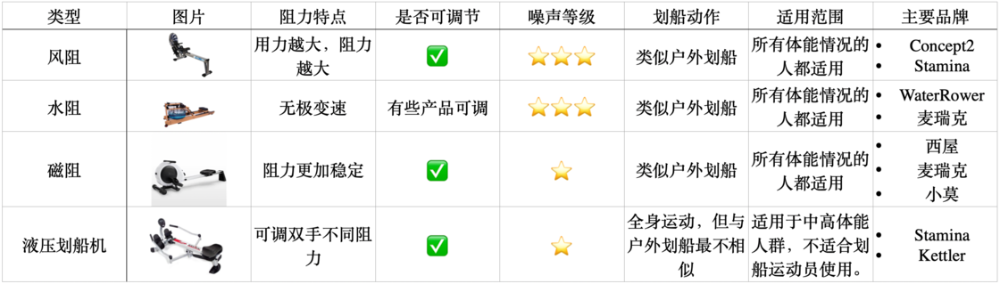

# 「划水」也能锻炼全身：划船机的科普与选购 - 少数派

多年前，划船机在有氧器械小队中只能是跟在跑步机、单车身后的替补队员，而如今，划船机一跃成为家庭健身器材中的当红小生。划船机的「逆袭」除了人们对健康更加关注之外，还有影视剧的推波助澜。2016 年，划船机作为《纸牌屋》主角总统的健身器材，一炮而红；2017 年划船机又在《欢乐颂》中成为精英老板的健身器材。每次在影视剧中的亮相，都会吸引更多观众的视线，同时就会有更多的划船机走进观众们的客厅。

影视剧中的精英人士们偏爱的划船机，到底有什么魔力？当划船机褪去「精英光环」后是否还值得购买？与单车和跑步机相比，划船机又有哪些优点？我们该如何正确使用划船机？购买划船机又有哪些需要注意的呢？本篇文章将为您一一回答上述问题。

## 为什么购买划船机

### **更安全**

**与常见的跑步机相比，划船机更安全。**首先，划船机的运动轨迹被限制在轨道上，我们不必担心失去平衡，从器械上跌落。其次，与跑步机相比，划船机也没有双脚腾空离地的阶段，不会对膝盖产生大的冲击，尤其是对于大体重人群来讲，对膝盖的压力更小。

在流行病学的调查结果中，通常以每 1000 小时损伤人数来反映运动的危险性。跑步每 1000 小时损伤人数为 2.5～33 人。长距离越野跑者损伤人数最少，为 2.5 人，业余跑者的损伤风险为 6.9～8.7 人，入门级跑者损伤人数最多，为 33 人1。

目前没有针对划船机的损伤风险调查，但有针对划船这项运动的调查。划船机和划船的运动形式十分相似，因而划船运动的损伤风险，对于判断划船机的损伤风险就有了较大的借鉴意义。根据研究数据推测，划船运动每 1000 小时的损伤人数为 3～8 人2。损伤人群以精英运动员为主，普通人参加划船运动的损伤风险则更低。流行病学的调查结果也证实划船机更安全。

尽管如此，世界上也没有绝对安全的运动，如果你有孕在身，或是患有骨骼肌肉疾病，比如腰椎间盘突出、髋关节撞击综合症等疾病，还是要遵循医生的建议，并在专业人士的指导下运动。

虽然单车和椭圆机也比跑步机安全，但与这两者相比，划船机更高效。

### 更高效

精英人士偏爱划船机，应该也是看中了划船机的高效。**划船机有「瑞士军刀」以及「肺部体操」的美称**。相较于单车只能锻炼到全身 44% 的肌肉，划船机能锻炼到全身 88% 的肌肉。骑单车时，我们动用的主要是腿，而划船则同时动用了腿、腰背以及手臂。

划船机不同动作阶段用到的肌肉

**划船机这种全身性的运动，尤其适合久坐人群。**信息社会，我们每天被监禁在座椅上的时间超过 12 小时。上班时，我们坐在电脑前办公；回家路上，我们坐在地铁或者出租车上；回家后，我们坐在椅子上或躺在床上玩手机。久坐的危害多多，最常见的就是腰酸背痛小腿肿。想要医治久坐慢性病，就要服用运动这方良药。

良药的服用有两个时间点，一个时间点是在日常生活中，每一小时就起身活动下，中断久坐；另一个时间点是下班后进行专项的动作训练，强化我们薄弱的肌肉。这些薄弱的肌肉多数分布在我们身体的后侧，比如臀部肌肉、背部肌肉。划船机正好可以激活我们**大腿后侧、臀部、背部以及腹部的薄弱肌肉**，可以很好的激活我们「自身的背背佳」，让体态更挺拔、身体更健康。

但需要注意的是，我们需要有足够的能力，才能发挥划船机的高效。划船机在动用更多肌肉的同时，也更容易让人感觉到疲劳。儿童以及缺乏锻炼的人群上肢力量比较薄弱，使用划船机时更容易疲劳，很可能练不到五分钟就累的无法继续。训练前期如果动作技术掌握不正确，过多地依靠手臂发力来完成动作，也很容易造成手臂先力竭了，无法很好地锻炼到背部和臀部的肌肉。因此，学习正确的划船动作对于我们来说就变得尤为重要。

## 如何正确使用划船机

### 调整脚踏位置

在动作开始前，我们应该先调整脚踏板的位置，保证在划船时背部处于平整的状态。合适的脚踏位置，不会让膝盖超过腋窝。左侧图中脚踏位置较高，背部拱起，右侧图片踏板降低，背部就可以保持中立位了。

### 划船动作组成

一次完整的划船动作可以拆分为四部分：分别为抓握（The Catch）、拉浆（The Drive）、结束（The Finish）、回浆（The Recovery）。

#### 抓握

-   手臂伸直，头部处于中立位置。
-   上半身微微向前倾，肩膀位于臀部前方。
-   小腿几乎垂直地面。
-   脚后跟可以微微抬起。

#### 拉浆

-   双腿推蹬，带动身体向后移动。
-   注意不要耸肩，保持手臂伸直。

#### 结束

-   核心收紧，躯干微向后仰。
-   保持两腿伸直，拉浆柄贴向胸肋处。
-   沉肩，手腕处于中立位。

初学者，经常会没有结束这一阶段。在拉浆的末端，腿部伸直，身体后仰，进一步增加动作幅度。专业运动员划船动作结束时，身体后仰幅度会非常大，大约有 120°。

同时，与力量训练中的划船动作不同，在划船机动作的结束阶段，手臂不应紧贴身体，而是呈倒 W 形，手肘与身体保持一定距离。同时注意肩胛骨不要过度回缩「即夹背」，否则肋骨容易外翻，且容易耸肩。浆柄接触的区域为胸下部肋骨下缘处。

#### 还原

-   依次伸直手臂，躯干前倾，双腿屈曲。
-   当手臂越过膝盖时屈曲双腿。
-   还原至抓握起始位置。

还原时，不要被划船机阻力带回去，而是要用手臂后侧（肱三头肌）和大腿后侧（腘绳肌）的肌肉群主动发力，回到起始位置。注意：还原时先松手臂，再屈膝。

### 划船机常见错误

正确的动作千篇一律，错误的动作则各有各的不同。在这些错误动作中，我们先来关注损伤风险比较大，而新手又经常容易犯的错误。

#### 过度弓背

腰部疼痛是划船时最常见的损伤，在所有划船损伤中占比 53%。在划船运动时，腰椎的活动幅度比较大，承受负荷也较大。运动时划船动作技术不正确，则更容易导致腰椎受伤。划船最常见的错误动作就是过度弓背。

下腰背疼痛是划船时最常见的疼痛，在所有损伤中占比 53%，每 1000 h 损伤人数为 1.5-3.7 人（an incidence of 1.5-3.7 per 1000h）；非特异性腰痛占比 25%～30%。

成年运动员患脊椎滑脱（Spondyloysis）的比例比青少年更高，成年运动员为 17% ，青少年运动员则为 11.5%。

一项为期 12 个月的跟踪调查显示，下腰背损伤发生率占比为 31.8～51%。腰部常见的疼痛区域为下图中的黄色区域：腰背下缘和接近骨盆的 L4/L5 以及 L5/S1，此区域关节运动范围更大，承受更大的负荷。

腰椎曲屈是影响压缩负荷的最主要因素，如果划船时动作技术不正确，腰背过度屈曲，则更容易导致腰椎受伤。

**如何解决？**

改变握法，找到挺胸姿势。平常含胸驼背久了，很难找到含胸拔背的感觉。改变握法可以很好的找到发力的感觉。

常规划船握柄姿势为掌心向下，为了背部发力感觉更强，我们可以掌心向上握柄。双手之间的距离也比普通握法宽一拳距离。当手臂处于外旋状态时，更容易感受到背部发力的感觉。

#### 发力模式错误

保证不过度弓背，便能够减少背部损伤的风险。划船时正确的发力模式是在拉浆阶段先腿部蹬伸发力，身体后移；接着是在结束阶段背部轻微后仰，同时伴随主动拉浆贴近身体。专业运动员的发力顺序主要遵循**大肌肉群带动小肌肉群**的协调用力原理，**下肢带动上肢依次用力**。

普通人的发力顺序则恰恰相反，是上肢带动下肢，甚至更多的人划船时，是只有手臂发力。进阶一点的是背部发力，缺乏腿部的发力参与3。俗话说：「胳膊掰不过大腿」，单纯用手臂、背部发力很难有更快的速度，也就更容易疲劳。

**如何解决？**

分解练习可以帮助我们更好的掌握划船动作。澳大利亚体育学院的划船教练有一个[详细的分解动作教学](https://www.bilibili.com/video/BV1ZM4y1z76b/?spm_id_from=888.80997.embed_other.whitelist)，我将它搬运到了 B 站，并上传了机器翻译的中文字幕。我也在视频下方添加了笔记，将每个分解动作开始的时间标记放在了笔记当中。

为了方便大家详细的了解每个动作，我将分解动作开始和结束截图放在下方，并附上文字说明。（原视频当中教练是先讲解的还原阶段分解练习，本文为和前文叙述保持一致，按照划船的动作顺序来讲解。）

**抓握：**抓握阶段更多的是静态姿势，在此不做过多赘述。

**划桨：**划桨又可以分为 1/4 划桨，此阶段，我们只是蹬伸腿部，臀部微微向后移动一个脚掌的距离，主要掌握腿部发力的感觉。

动作熟练之后，过渡到整个拉浆的阶段。此时蹬腿向后，大腿几乎完全伸直。

**结束：**在拉浆的动作基础上，身体后仰，**手臂仍然保持伸直**。

在前面拉浆结束的动作基础上同时屈肘。屈肘的时机为当手柄越过膝盖后，手臂开始屈曲。

**恢复：**恢复阶段第一部分只恢复手臂，此时只是伸直手臂，上半身和腿部没有动作。

恢复阶段第二部分为恢复手臂和上半身，在手臂完全伸直之后，躯干向前。

恢复完整动作为伸直手臂，同时躯干前倾。在手越过膝盖后开始屈曲大腿。

为了方便掌握动作顺序，可以牢记视频中的口令：hands body legs，legs body arm，即划船还原阶段为手、身体、腿，腿、身体、手。

## 如何衡量自己的划船水平

中国赛艇协会和中国皮划艇协会的[官网](https://sspai.com/link?target=http%3A%2F%2Fwww.rowing.org.cn%2Fbulletin%2F2022%2F0923%2F416270.html)上，有给出区分不同运动水平的考核标准，大家可以在划船机上设定距离目标为 2000 米，开始计时，得到结果之后与下表进行对照，就可以得出自己目前的运动水平等级。

其中，19 岁以下年龄组不再区分轻量级和公开级，统一称为公开级。19 岁及以上年龄组，分别为男子公开级 （体重 ≥72.5 公斤）、女子公开级（体重 ≥59 公斤）、男子轻量级 （< 72.5 公斤 ） 、 女子轻量级（<59 公斤） 。

另外， [Conecept2 官网](https://sspai.com/link?target=http%3A%2F%2Fwww.concept2.cn%2Fzh%2Findoor-rowers%2Fracing%2Frecords)上还列出来不同比赛形式、不同年龄段人的最佳成绩，也可以做参考。下图是机器翻译后的网站截图。

## 如何选购划船机

### 划船机的种类

常见的划船机根据阻力来源，可以分为风阻、水阻、磁力、液压划船机，以及最近 Keep 推出的电机系统阻力划船机 A1。不同种类的划船机阻力特点不同，噪音大小也不同。风阻划船机力量不断平稳加大，而水阻划船机整个拉浆周期阻力均不变，阻力特点与水上划船运动的阻力特点更为相似。

从声音大小来看，风阻式划船机的声音最大，之后是水阻式划船机，磁阻和液压划船机声音大小类似。详细对比可以参见下述表格。

### 不同价位推荐产品

**声明**：以下推荐根据公开信息梳理，不含任何软广。

影响划船机价格的主要因素为硬件，不同的木料、轨道和阻力来源都是影响定价的因素。其中**木料和轨道影响划船机的耐用程度，而阻力来源还会影响使用体验。**国内品牌目前已经非常「卷」了，3000 元以内就能买到很实用美观的产品，而且各有各的优势。因此，推荐的产品主要从 3000 元以内，以及 8000 元以上两档进行推荐（8000 元以上主要是买品牌文化）。

划船机的介绍里经常提到所使用的的木料，最常见的材料是松木、白蜡木，较好的划船机会使用红橡木和榉木，这两种木质更结实，更加耐用。高端的划船机会使用更加珍贵的樱桃木和胡桃，增加品牌溢价。

硬件决定了使用的寿命，而软件则影响我们的使用频率。如果配套软件不好用，使用体验就会大打折扣。丰富的配套课程则可能让我们划船的时候更起劲。目前国内的莫比和麦瑞特都有 app，莫比所有课程免费，麦瑞特部分课程免费。

#### 3000 元以内

**麦瑞克：水磁双阻**

麦瑞克是一家成立于 2017 年的国产健身器材公司，其入门级的水阻划船机为 1899 元，入门级的磁阻划船机为 1299 元。使用专利水磁双阻的型号 950 价格为 2399 元。如果上海鲜市场，有时还能以 1000 元左右的价格捡漏。

麦瑞特的优势一方面来自其专利「水磁双阻技术」，使得划船机既可以有水阻的「划船感」也可以手动调控阻力，另一方面的优势来自智能变阻与 app 的联动，配合 app 上的课程，划船机可以自动跟课程里的教练同步调阻，不用自己动手调阻就可以达到比较好的运动效果。需要提醒的是麦瑞克健身 app 需要付费，买完划船机之后可以根据订单码领取 3 张月卡，之后就得另外付费了，连续包月 9.9 元，连续包季 25 元，连续包年 90 元。

**莫比——高颜值**

莫比主打水阻划船机，但在旗舰店中卖的最好的，却是下图中这款价格较低且颜值较高的一款**磁阻划船机**。售价为 1599 元，可与配套 app 一起使用。购买前还可以去海鲜市场看看，能以更低的价格入手。磁阻划船机的优势就是噪声小，莫比这款则加了皮肤好看这个 buff。莫比自家的莫比健身 app 完全免费，也有多种课程可选。

之前莫比是想对标 Waterrower 的，于是也和 Waterrower 一样在影视剧中出场，产品名中甚至直接写了「总监同款」，经典款 7080 元，粉色款 2799 元。

#### 8000 元以上

风阻划船机鼻祖 Concept2 以及水阻划船机鼻祖 WaterRower 都是走的高端路线，价钱都在 8000 元以上。两者主打内容又各有侧重：Concept2 更像是理工男，追求准确的数据。因而很多室内划船机比赛都会使用 Concept2，比如 Crossfit 的大赛中就是使用的它。Concept2 在国内有旗舰店，他们家的经典产品 RowErg 价格为 8500元。除了价格昂贵，风阻划船机用起来，像是家里开了工业电风扇，太吵，不推荐家用。

反观 WaterRower 则是走的文化路线，在《纸牌屋》中频繁亮相，加上其创始时就宣扬的赛艇文化，又给这个品牌「镀了一层金」。赛艇运动起源于英国，1829 年，英国牛津大学和剑桥大学在泰晤士河上举行了首次校际赛艇比赛，这被视为现代赛艇运动的起源。

产品上设计上，WaterRower 用原木结构和涡轮推动水的声音模拟真实的赛艇体验，通过木料的材质区分不同的产品档次。WaterRower 采用纯手工打造，价格不菲，纸牌屋「总统同款」售价 1.9 万元。

## 结语

当划船机褪去头上的「精英光环」，安全、高效依然可以让它熠熠生辉。相较于跑步机，划船机没有腾空过程，减少了对膝盖的冲击，对于大体重的人也友好。对于久坐的上班一族，划船机可以更好的锻炼到臀、腿，腹部、背部的肌肉，帮助我们维持良好的体态。

正确的技术是安全使用划船机的基础。初次使用划船机时，我们会主要使用手臂发力划船。我们可以借助动作分解练习，逐步掌握正确的划船动作，学会用大腿带动背部再带动上肢完成整个划船动作。

距离划船机的发明已经超过 100 多年，其制作工艺已经非常成熟，知名品牌的划船机都能满足基本需求。大家可以根据自己的需求进行购买。如果是入门使用，那么麦瑞克、小莫等入门级的水阻、磁阻划船机已经能够满足需求，如果追求数据的准确性可以购买 Concept2，如果追求品味可以购买 WaterRower 。

-   1Arumugam, S., Prakash Ayyadurai, Suresh Perumal, G. Janani, Sidak Dhillon和K. A. Thiagarajan. 《Rowing Injuries in Elite Athletes: A Review of Incidence with Risk Factors and the Role of Biomechanics in Its Management》. Indian Journal of Orthopaedics 54, 期 3 (2020年5月): 246–55.
-   2Videbæk, Solvej, Andreas Moeballe Bueno, Rasmus Oestergaard Nielsen和Sten Rasmussen. 《Incidence of Running-Related Injuries Per 1000 h of Running in Different Types of Runners: A Systematic Review and Meta-Analysis》. Sports Medicine 45, 期 7 (2015年7月): 1017–26.
-   3蒋成涛. 《水阻划船器拉桨技术的运动特征研究》. 硕士, 武汉体育学院, 2017.
