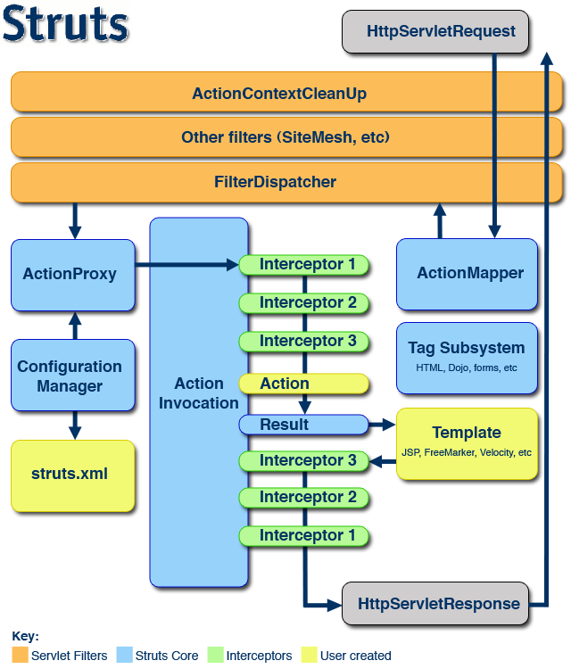

# 初探 Struts2 框架安全

[evilpan](https://evilpan.com/ "Author")  收录于  类别 [Security](https://evilpan.com/categories/security/)

 2023-11-01  2023-11-01  约 9012 字   预计阅读 18 分钟   64 次阅读  

最近分析 confluence 的漏洞，发现是基于 Struts 框架的，其中有很多相关知识点并不了解，因此专门来学习一下 Struts 2。

# [](#%e8%83%8c%e6%99%af)背景

在网上一搜 Struts 2 资料发现介绍漏洞的文章比介绍开发的还多，少数开发者的声音也是 “Struts 过时了吗？” 之类的疑问，事实上这个框架也确实是过时了，现在Java Web 开发早已是 Spring 全家桶一统江山的局面。但我们也不能不承认曾经 Struts 的地位。Struts2 + Spring + Hibernate 三大框架在当年组合号称 `SSH`，对 Java Web 应用生态产生了深远的影响，以至于现在有许多知名应用中还有 Struts 的影子。

因此，即便 Struts 已经日薄西山，对于 Java 安全研究者而言也是需要深入了解的目标，就像二进制研究员需要理解 “过时” 的 `jmp esp` 栈溢出利用方法一样。

# [](#struts-101)Struts 101

分析 Struts 内部细节之前我们先从开发的角度看 Struts 应用的基本构建和使用过程。

在 Struts 官网中提供了对应的开发文档，如 [Getting Start](https://struts.apache.org/getting-started/index.html)。同时也提供了具体的[代码示例](https://github.com/apache/struts-examples)。

值得一提的是 Struts 的文档还提供了针对开发者的一些预备知识，见 [Key Technologies Primer](https://struts.apache.org/primer)。其中包括了许多 JavaEE 的基本知识，想当初刚出门 Java 的时候要是能看到这份文档估计能少走不少弯路。

## [](#%e5%9f%ba%e6%9c%ac%e7%bb%93%e6%9e%84)基本结构

Struts 应用也是一个 JavaEE 应用，因此同样基于 Servlet API。有趣的是它不像 Spring 等其他 Web 框架将功能插入到 Servlet 中(DispatchServlet)，而是插入到 Filter 中，如下所示:

```xml
<?xml version="1.0" encoding="UTF-8"?>
<web-app id="WebApp_ID" version="2.4"
	xmlns="http://java.sun.com/xml/ns/j2ee"
	xmlns:xsi="http://www.w3.org/2001/XMLSchema-instance"
	xsi:schemaLocation="http://java.sun.com/xml/ns/j2ee http://java.sun.com/xml/ns/j2ee/web-app_2_4.xsd">
	<display-name>Basic Struts2</display-name>
	<filter>
		<filter-name>struts2</filter-name>
		<filter-class>org.apache.struts2.dispatcher.filter.StrutsPrepareAndExecuteFilter</filter-class>
	</filter>

	<filter-mapping>
		<filter-name>struts2</filter-name>
		<url-pattern>/*</url-pattern>
	</filter-mapping>

	<welcome-file-list>
		<welcome-file>index</welcome-file>
	</welcome-file-list>
</web-app>
```

插入的 `StrutsPrepareAndExecuteFilter` 同样也可以实现接管所有请求的目的。在接管所有请求后，使用 `struts.xml` 作为 Struts 自身的路由映射配置，一个简单的示例如下:

```xml
<?xml version="1.0" encoding="UTF-8"?>
<!DOCTYPE struts PUBLIC
    "-//Apache Software Foundation//DTD Struts Configuration 2.5//EN"
    "http://struts.apache.org/dtds/struts-2.5.dtd">

<struts>

    <constant name="struts.devMode" value="true" />

    <package name="basicstruts2" extends="struts-default">
        <action name="index">
            <result>/index.jsp</result>
        </action>
    </package>

</struts>
```

注意该文件保存在 `src/main/resources` 中，类似于 `log4j2.xml`。上述配置指定 `/index`、`/index.action` 都会被路由到 `index.jsp` 上。

## [](#%e8%ae%be%e8%ae%a1%e6%a8%a1%e5%bc%8f)设计模式

看 Struts 的示例代码可以很明显的 MVC 设计风格，以 helloworld 为例，其中包含一个 Controller，又称为 `Action`:

```java
import com.opensymphony.xwork2.ActionSupport;

public class HelloWorldAction extends ActionSupport {

    private MessageStore messageStore;

    public String execute() {
        messageStore = new MessageStore() ;

        return SUCCESS;
    }

    public MessageStore getMessageStore() {
        return messageStore;
}
```

Action 中通常包含具体的数据源，比如上面的 MessageStore (POJO)，这个数据源即是 `Model`。在 `struts.xml` 中指定 Action 的路由，并链接到具体的 JSP 上，此为 `View` 部分:

```xml
<action name="hello" class="org.apache.struts.helloworld.action.HelloWorldAction" method="execute">
    <result name="success">/HelloWorld.jsp</result>
</action>
```

> 如果没有指定，会默认访问 execute 返回值对应的 JSP，如 `WEB-INF/content/hello-success.jsp`。

`<result>` 标签表示如果 `HelloWorldAction.execute` 返回 “success” (即 `Action.SUCCESS`)，就将结果映射到 HelloWorld.jsp 上。

至此，Model-View-Controller 三要素都全了，访问 `/hello` 后即可进入到 Action 准备好数据，绑定到 JSP 的上下文中并根据需要渲染出来，`HelloWorld.jsp` 如下:

```jsp
<!DOCTYPE html>
<%@ page language="java" contentType="text/html; charset=UTF-8" pageEncoding="UTF-8" %>
<%@ taglib prefix="s" uri="/struts-tags" %>
<html>
  <head>
    <meta http-equiv="Content-Type" content="text/html; charset=UTF-8">
    <title>Hello World!</title>
  </head>
  <body>
    <h2><s:property value="messageStore.message" /></h2>
  </body>
</html>
```

其中使用 JavaBean 风格的表达式获取获取具体的属性 `messageStore.message`，其背后访问的是 Java 对象的 getter 方法。

# [](#%e5%86%85%e9%83%a8%e5%ae%9e%e7%8e%b0)内部实现

接下来我们深入到 Struts 的内部实现中。先粘贴一个经典的图片:

[↓↓↓](https://evilpan.com/img/2023-11-01-struts2-internal/0.png "img")  
  
  
  
[↑↑↑](https://evilpan.com/img/2023-11-01-struts2-internal/0.png "img")

前面我们说过，Struts 应用的 `web.xml` 会添加一个 Filter `StrutsPrepareAndExecuteFilter`，因此用户请求进来的时候是依照 FilterChain 的顺序依次调用注册的 Filter，直到 Struts 的 Filter。随后从左边开始，Struts 会将请求的 URL 转换为对应的 `ActionProxy` 去进行调用，这里有一步使用 `ConfiguarationManager` 去加载我们的配置 `struts.xml`，这里可能意味着一次懒加载，我们后文再根据实际的代码去分析。

调用 ActionProxy 的时候，会在开发者实际定义的 Action 前后依次调用 Interceptor，实现诸如过滤参数、打印日志、记录请求时间等操作。可以看到这里的架构设计还是很优雅的，开发者也可以定义和注册自己的 Interceptor 去实现鉴权等业务逻辑。

大致的调用流程就是这样，接下来我们通过代码去分析具体的调用逻辑。由于代码比较多，我们需要有的放矢，因此主要聚焦于 Struts 的调用逻辑实现、路由查找等关键功能。

> 如无特别说明，本文所涉及代码都基于 `struts2-core-6.2.0` 版本。

## [](#filter)Filter

首先看详细的调用流程。我们可以从 `StrutsPrepareAndExecuteFilter` 的 `doFilter` 开始，也可以直接在 Controller 打个断点去至顶向下分析。不过我们这里用另一个方法, 在设置应用 `struts.devMode=true` 的情况下，访问一个不存在的 URL 会返回带调用栈的出错信息，如下所示:

```java
com.opensymphony.xwork2.DefaultActionProxy.prepare(DefaultActionProxy.java:183)
org.apache.struts2.factory.StrutsActionProxy.prepare(StrutsActionProxy.java:57)
org.apache.struts2.factory.StrutsActionProxyFactory.createActionProxy(StrutsActionProxyFactory.java:32)
com.opensymphony.xwork2.DefaultActionProxyFactory.createActionProxy(DefaultActionProxyFactory.java:60)
org.apache.struts2.dispatcher.Dispatcher.createActionProxy(Dispatcher.java:694)
org.apache.struts2.dispatcher.Dispatcher.prepareActionProxy(Dispatcher.java:679)
org.apache.struts2.dispatcher.Dispatcher.serviceAction(Dispatcher.java:642)
org.apache.struts2.dispatcher.ExecuteOperations.executeAction(ExecuteOperations.java:79)
org.apache.struts2.dispatcher.filter.StrutsPrepareAndExecuteFilter.handleRequest(StrutsPrepareAndExecuteFilter.java:157)
org.apache.struts2.dispatcher.filter.StrutsPrepareAndExecuteFilter.tryHandleRequest(StrutsPrepareAndExecuteFilter.java:140)
org.apache.struts2.dispatcher.filter.StrutsPrepareAndExecuteFilter.doFilter(StrutsPrepareAndExecuteFilter.java:128)
org.apache.catalina.core.ApplicationFilterChain.internalDoFilter(ApplicationFilterChain.java:178)
org.apache.catalina.core.ApplicationFilterChain.doFilter(ApplicationFilterChain.java:153)
...
```

可以看到末尾如我们所料，从 Tomcat 调用到了 `StrutsPrepareAndExecuteFilter.doFilter`，虽然这是一个 Filter 但却做的是 Servlet 的事情。顾名思义，其作用主要是准备和执行，准备和执行什么呢？当然是 `Action`，即 Controller。

```java
public void doFilter(ServletRequest req, ServletResponse res, FilterChain chain) throws IOException, ServletException {

    HttpServletRequest request = (HttpServletRequest) req;
    HttpServletResponse response = (HttpServletResponse) res;

    try {
        prepare.trackRecursion(request);
        String uri = RequestUtils.getUri(request);
        if (prepare.isUrlExcluded(request, excludedPatterns)) {
            LOG.trace("Request: {} is excluded from handling by Struts, passing request to other filters", uri);
            chain.doFilter(request, response);
        } else {
            tryHandleRequest(chain, request, response, uri);
        }
    } finally {
        prepare.cleanupRequest(request);
    }
}
```

`excludedPatterns` 是 `java.util.regex.Pattern` 的列表，在此列表中的路径不会被 Struts 接管，而是直接放行到后续的 Filter 和 Servlet 处理。这里获取请求 URI 是通过 `RequestUtils.getUri`，并且以此 Uri 作为后续路由的重要依据。

## [](#geturi)getUri

`org.apache.struts2.RequestUtils#getUri` 的主要实现如下:

```java
public static String getUri(HttpServletRequest request) {
    // handle http dispatcher includes.
    String uri = (String) request.getAttribute("javax.servlet.include.servlet_path");
    if (uri != null) {
        return uri;
    }

    uri = getServletPath(request);
    if (StringUtils.isNotEmpty(uri)) {
        return uri;
    }

    uri = request.getRequestURI();
    return uri.substring(request.getContextPath().length());
}

public static String getServletPath(HttpServletRequest request) {
    String servletPath = request.getServletPath();

    String requestUri = request.getRequestURI();
    // Detecting other characters that the servlet container cut off (like anything after ';')
    if (requestUri != null && servletPath != null && !requestUri.endsWith(servletPath)) {
        int pos = requestUri.indexOf(servletPath);
        if (pos > -1) {
            servletPath = requestUri.substring(requestUri.indexOf(servletPath));
        }
    }

    if (StringUtils.isNotEmpty(servletPath)) {
        return servletPath;
    }

    int startIndex = request.getContextPath().equals("") ? 0 : request.getContextPath().length();
    int endIndex = request.getPathInfo() == null ? requestUri.length() : requestUri.lastIndexOf(request.getPathInfo());

    if (startIndex > endIndex) { // this should not happen
        endIndex = startIndex;
    }

    return requestUri.substring(startIndex, endIndex);
}
```

按顺序看，其获取 URI 的优先级如下:

1.  request.getAttribute(“javax.servlet.include.servlet\_path”);
2.  request.getServletPath();
3.  request.getRequestURI() 通过 request.getServletPath() 计算的子字符串；
4.  request.getRequestURI() 通过 request.getContextPath() 和 request.getPathInfo() 计算的子字符串；
5.  request.getRequestURI() 通过 request.getContextPath() 计算的子字符串；

其中大部分情况下会落到 2 或者 3 的返回结果上。`getServletPath` 是容器最终用于寻址 Servlet 的路径，即经过 normalize 和删除路径参数等操作的结果，在 Tomcat 中还进行了 URL 解码，可以认为是相对安全的。但 Struts 拓展了 getServletPath 方法，还是从 requestURI 进行了一次判断并执行 substring 操作，因此我们可以很大程度上控制 `getUri` 的返回结果，至于有什么影响要看后面具体的路由逻辑。

## [](#%e8%af%b7%e6%b1%82%e5%a4%84%e7%90%86)请求处理

handleRequest 主要分成两个阶段，先是处理静态资源文件，然后才是对于动态路由的处理，如下所示:

```java
private void tryHandleRequest(FilterChain chain, HttpServletRequest request, HttpServletResponse response, String uri) throws IOException, ServletException {
    LOG.trace("Checking if: {} is a static resource", uri);
    boolean handled = execute.executeStaticResourceRequest(request, response);
    if (!handled) {
        LOG.trace("Uri: {} is not a static resource, assuming action", uri);
        handleRequest(chain, request, response, uri);
    }
}
```

我们分别对二者进行分析。

### [](#%e9%9d%99%e6%80%81%e8%b5%84%e6%ba%90)静态资源

静态资源的处理逻辑主要是 `executeStaticResourceRequest`:

```java
public boolean executeStaticResourceRequest(HttpServletRequest request, HttpServletResponse response) throws IOException, ServletException {
    // there is no action in this request, should we look for a static resource?
    String resourcePath = RequestUtils.getServletPath(request);

    if ("".equals(resourcePath) && null != request.getPathInfo()) {
        resourcePath = request.getPathInfo();
    }

    StaticContentLoader staticResourceLoader = dispatcher.getContainer().getInstance(StaticContentLoader.class);
    if (staticResourceLoader.canHandle(resourcePath)) {
        staticResourceLoader.findStaticResource(resourcePath, request, response);
        // The framework did its job here
        return true;

    } else {
        // this is a normal request, let it pass through
        return false;
    }
}
```

其中值得关注的点是对于静态资源路径，这里使用的是没有经过其他处理的 `getServletPath`。通过 `StaticContentLoader` 先判断是否可以处理对应路径:

```java
// org.apache.struts2.dispatcher.DefaultStaticContentLoader#canHandle
public boolean canHandle(String resourcePath) {
    return serveStatic && resourcePath.startsWith(uiStaticContentPath + "/");
}
```

`uiStaticContentPath` 默认是 `/static`，可以由开发者自行配置。因此这里仅判断请求路径是否以 `/static/` 开头，而没有判断文件是否存在。注意一旦 canHandle 返回 true，那么后续即便找不到资源也不会继续后续的动态路由查找，而是直接返回 404 结束请求。

`DefaultStaticContentLoader#findStaticResource` 基本上是使用 ClassLoader.getResource，但有一些特殊的处理:

```java
public void findStaticResource(String path, HttpServletRequest request, HttpServletResponse response)
    throws IOException {
    String name = cleanupPath(path);
    for (String pathPrefix : pathPrefixes) {
        URL resourceUrl = findResource(buildPath(name, pathPrefix));
        if (resourceUrl != null) {
            InputStream is = null;
            try {
                //check that the resource path is under the pathPrefix path
                String pathEnding = buildPath(name, pathPrefix);
                if (resourceUrl.getFile().endsWith(pathEnding))
                    is = resourceUrl.openStream();
            } catch (IOException ex) {
                // just ignore it
                continue;
            }

            //not inside the try block, as this could throw IOExceptions also
            if (is != null) {
                process(is, path, request, response);
                return;
            }
        }
    }
    response.sendError(HttpServletResponse.SC_NOT_FOUND);
}
```

首先是 `cleanupPath` 对路径又做了一次清理，作用是删除 `/static` 前缀:

```java
protected String cleanupPath(String path) {
    if (path.startsWith(uiStaticContentPath)) {
        return path.substring(uiStaticContentPath.length());
    } else {
        return path;
    }
}
```

然后是通过 `pathPrefixes` 数组去构建实际的资源路径去循环进行查找，动态调试 `pathPrefixes` 的值有:

-   org/apache/struts2/static/
-   template/
-   static/
-   org/apache/struts2/interceptor/debugging/

`buildPath` 的实现比较有意思:

```java
protected String buildPath(String name, String packagePrefix) throws UnsupportedEncodingException {
    String resourcePath;
    if (packagePrefix.endsWith("/") && name.startsWith("/")) {
        resourcePath = packagePrefix + name.substring(1);
    } else {
        resourcePath = packagePrefix + name;
    }

    return URLDecoder.decode(resourcePath, encoding);
}
```

其中对组合的 URL 路径又进行了一次 URL 解码。根据我们之前的文章可知，HttpServletRequest.getServletPath 已经是经过一次 URL 解码的了，因此这里实际上进行了二次解码！

因此这里可能会出现路径穿越的问题，不过这里已经进行了额外的判断:

```java
String pathEnding = buildPath(name, pathPrefix);
if (resourceUrl.getFile().endsWith(pathEnding))
    is = resourceUrl.openStream();
```

根据 commit 日志，发现这个修改确实也是为了修复路径穿越的问题，详见 [WW-2779 Directory traversal vulnerability while serving static content](https://svn.apache.org/repos/asf/struts/struts2/trunk@687425)。

不过，即便能绕过这里的检查，在 Servlet 容器层还有一层校验，以 Tomcat 为例，其会对超出根路径的静态资源请求抛出异常:

```plain
java.lang.IllegalArgumentException: 资源路径[/WEB-INF/classes/static/../../../../../etc/hosts]已规范化为无效的[null]
org.apache.catalina.webresources.StandardRoot.validate(StandardRoot.java:258)
org.apache.catalina.webresources.StandardRoot.getResource(StandardRoot.java:207)
org.apache.catalina.webresources.StandardRoot.getClassLoaderResource(StandardRoot.java:220)
org.apache.catalina.loader.WebappClassLoaderBase.findResource(WebappClassLoaderBase.java:954)
org.apache.catalina.loader.WebappClassLoaderBase.getResource(WebappClassLoaderBase.java:1078)
com.opensymphony.xwork2.util.ClassLoaderUtil.getResource(ClassLoaderUtil.java:108)
org.apache.struts2.dispatcher.DefaultStaticContentLoader.findResource(DefaultStaticContentLoader.java:305)
org.apache.struts2.dispatcher.DefaultStaticContentLoader.findStaticResource(DefaultStaticContentLoader.java:213)
org.apache.struts2.dispatcher.ExecuteOperations.executeStaticResourceRequest(ExecuteOperations.java:59)
org.apache.struts2.dispatcher.filter.StrutsPrepareAndExecuteFilter.tryHandleRequest(StrutsPrepareAndExecuteFilter.java:137)
org.apache.struts2.dispatcher.filter.StrutsPrepareAndExecuteFilter.doFilter(StrutsPrepareAndExecuteFilter.java:128)
```

从中也可以看到 getResource 确实是通过 Tomcat 的 ClassLoader 实现的。

### [](#%e8%b7%af%e7%94%b1%e6%9f%a5%e6%89%be)路由查找

如果前面判断目标路由不是静态资源，那么就会进行实际的路由查找和调用:

```java
private void handleRequest(FilterChain chain, HttpServletRequest request, HttpServletResponse response, String uri) throws ServletException, IOException {
    prepare.setEncodingAndLocale(request, response);
    prepare.createActionContext(request, response);
    prepare.assignDispatcherToThread();

    HttpServletRequest wrappedRequest = prepare.wrapRequest(request);
    try {
        ActionMapping mapping = prepare.findActionMapping(wrappedRequest, response, true);
        if (mapping == null) {
            LOG.trace("Cannot find mapping for: {}, passing to other filters", uri);
            chain.doFilter(request, response);
        } else {
            LOG.trace("Found mapping: {} for: {}", mapping, uri);
            execute.executeAction(wrappedRequest, response, mapping);
        }
    } finally {
        prepare.cleanupWrappedRequest(wrappedRequest);
    }
}
```

这里看似分成了两步，`findActionMapping` 查找路由，`executeAction` 执行路由。但实际上 `ActionMapping` 只是一个简单的封装类，保存请求的路由(action)、命名空间(namespace)、后缀、请求参数等数据。实际从 URI 到 `Action` 的映射还是在 `executeAction` 中实现。

### [](#actionmapping)ActionMapping

`findActionMapping` 核心实现为 `org.apache.struts2.dispatcher.mapper.DefaultActionMapper#getMapping`:

```java
public ActionMapping getMapping(HttpServletRequest request, ConfigurationManager configManager) {
    ActionMapping mapping = new ActionMapping();
    String uri = RequestUtils.getUri(request);

    int indexOfSemicolon = uri.indexOf(';');
    uri = (indexOfSemicolon > -1) ? uri.substring(0, indexOfSemicolon) : uri;

    uri = dropExtension(uri, mapping);
    if (uri == null) {
        return null;
    }

    parseNameAndNamespace(uri, mapping, configManager);
    handleSpecialParameters(request, mapping);
    extractMethodName(mapping, configManager);
    return parseActionName(mapping);
}
```

关键点如下:

1.  使用 RequestUtils.getUri 获取 URI，前面介绍过这个方法，存在一定的可利用性；
2.  手动删除分号，即删除最后一个分号及其之后的所有内容；
3.  dropExtension 删除 URI 中的后缀，并设置 mapping.extension；
4.  parseNameAndNamespace 负责设置设置 mapping.name 和 mapping.namespace；

`parseNameAndNamespace` 中通过遍历 `Configuration#getPackageConfigs` 里所有的 `PackageConfig` 配置，查找 URI 可能匹配的目标，然后获取其 namespace；而获取 actionName 的时候，是通过获取最后一个 `/` 之后的字符串作为名称，也就是说 URI `/` 之前的内容是不影响路由结果的:

```java
// ...
if (!allowSlashesInActionNames) {
    int pos = actionName.lastIndexOf('/');
    if (pos > -1 && pos < actionName.length() - 1) {
        actionName = actionName.substring(pos + 1);
    }
}
mapping.setNamespace(cleanupNamespaceName(actionNamespace));
mapping.setName(cleanupActionName(actionName));
```

最后调用 setter 之前还调用了以下 cleanup 方法，这其中对名称进行了正则检查，以 cleanupActionName 为例:

```java
protected String cleanupActionName(final String rawActionName) {
    if (allowedActionNames.matcher(rawActionName).matches()) {
        return rawActionName;
    } else {
        LOG.warn("{} did not match allowed action names {} - default action {} will be used!", rawActionName, allowedActionNames, defaultActionName);
        return defaultActionName;
    }
}
```

`allowedActionNames` 是 `[a-zA-Z0-9._!/\-]*`，对于不匹配的字符串，会直接返回默认的 `defaultActionName`，即 `index`。

`handleSpecialParameters` 使用前缀匹配请求参数的方式对一些特殊参数进行处理，主要是 org.apache.struts2.dispatcher.mapper.DefaultActionMapper 默认构造函数中注册的 `action:*` 以及 `method:*` 参数，用于调用自定义的 action 和方法。但是这两个默认配置都是不启用的，即便开启了动态调用，也需要开发者手动在 `<allowed-methods>` 中指定允许调用的方法名称。

`parseActionName` 中也有类似处理，如果支持动态方法(allowDynamicMethodCalls)，那么 actionName 可以是 `foo!method` 格式，通过感叹号指定要调用的方法。同时方法名通过 mapping.setMethod 进行设置。

### [](#actionproxy)ActionProxy

`findActionMapping` 提取出对应的 ActionMapping 信息之后，开始通过 `executeAction` 进行调用。回顾我们开头 404 页面返回的堆栈信息，可知在 `ActionProxy.prepare` 时进行实际 Controller(Action) 的查找。所谓 ActionProxy 实际是我们定义的 Action 的封装。

实际路由查找通过 `DefaultConfiguration.RuntimeConfigurationImpl#getActionConfig` 实现:

```java
public ActionConfig getActionConfig(String namespace, String name) {
    ActionConfig config = findActionConfigInNamespace(namespace, name);

    // try wildcarded namespaces
    if (config == null) {
        NamespaceMatch match = namespaceMatcher.match(namespace);
        if (match != null) {
            config = findActionConfigInNamespace(match.getPattern(), name);

            // If config found, place all the matches found in the namespace processing in the action's parameters
            if (config != null) {
                config = new ActionConfig.Builder(config)
                        .addParams(match.getVariables())
                        .build();
            }
        }
    }

    // fail over to empty namespace
    if (config == null && StringUtils.isNotBlank(namespace)) {
        config = findActionConfigInNamespace("", name);
    }

    return config;
}
```

其中执行最终查找 ActionConfig 的方法是 `findActionConfigInNamespace`。注意上面的代码中依次有三种查找策略:

1.  直接在 `namespace` 中精确查找 `name`；
2.  如果没有找到，则判断是否定义正则匹配 `patternMatcher`，如果存在则使用模糊(正则)查找；
3.  如果还没找到，则会在默认的空命名空间中查找。

在 Struts 官方文档中也有提及，见 [Namespace Configuration](https://struts.staged.apache.org/core-developers/namespace-configuration) 一节:

> The default namespace is `""` - an empty string. The default namespace is used as a “catch-all” namespace. If an action configuration is not found in a specified namespace, the default namespace is also be searched.

这个特性的目的是为了实现 local/global 的设计模式，即先查找局部路由实现，如果找不到就使用全局实现。注意这只是二阶段的查找，如果存在多级的命名空间如 `/foo/bar/demo.action`，在 `/foo/bar` 中查找不到 `demo.action` 后会直接跳到默认命名空间去查找，而不是跳到命名空间 `/foo` 进行查找。

```java
private ActionConfig findActionConfigInNamespace(String namespace, String name) {
    ActionConfig config = null;
    if (namespace == null) {
        namespace = "";
    }
    Map<String, ActionConfig> actions = namespaceActionConfigs.get(namespace);
    if (actions != null) {
        config = actions.get(name);
        // Check wildcards
        if (config == null) {
            config = namespaceActionConfigMatchers.get(namespace).match(name);
            // fail over to default action
            if (config == null) {
                String defaultActionRef = namespaceConfigs.get(namespace);
                if (defaultActionRef != null) {
                    config = actions.get(defaultActionRef);
                }
            }
        }
    }
    return config;
}
```

这里主要是使用一个二级哈希表(`namespaceActionConfigs`)进行查找，其中第一级的 key 为 namespace，第二级的 key 则是实际路由的路径。

注意 `namespaceActionConfigs` 这个哈希表中包含 namespace 对应的所有 action，除了包含当前 `<package>` 中定义的 action，还包括通过 `extends` 属性继承的父 package 中的所有 action。这也是一个路由的变异特性，后面我们介绍 Confluence 的 CVE-2023-22518 时会详细分析。

当然也不仅仅是哈希表的精确匹配，二级的 action 查找也支持使用 ActionConfigMatchers 去进行通配符匹配。`ActionConfig` 中包含了执行 action 所需要的所有信息，包括 Action 的类名、方法名、结果映射、拦截器列表等。

`org.apache.struts2.dispatcher.Dispatcher#serviceAction` 可以理解为分发请求的枢纽，获取到 ActionProxy 后负责进行调用并处理可能的异常结果:

```java
    public void serviceAction(HttpServletRequest request, HttpServletResponse response, ActionMapping mapping)
        throws ServletException {
// ...
try {
    ActionProxy proxy = prepareActionProxy(extraContext, actionNamespace, actionName, actionMethod);
    if (mapping.getResult() != null) {
        Result result = mapping.getResult();
        result.execute(proxy.getInvocation());
    } else {
        proxy.execute();
    }

    } catch (ConfigurationException e) {
        logConfigurationException(request, e);
        sendError(request, response, HttpServletResponse.SC_NOT_FOUND, e);
    } catch (Exception e) {
        if (handleException || devMode) {
            if (devMode) {
                LOG.debug("Dispatcher serviceAction failed", e);
            }
            sendError(request, response, HttpServletResponse.SC_INTERNAL_SERVER_ERROR, e);
        } else {
            throw new ServletException(e);
        }
    }
}
```

在 `DefaultActionInvocation#invoke` 中进行了拦截器和 Action 的调用:

```java
public String invoke() throws Exception {
    // ...
    if (interceptors.hasNext()) {
        // 见下节 ...
    } else {
        resultCode = invokeActionOnly();
    }
}
```

Interceptors 依次调用完后，后续会调用 invokeActionOnly 去调用我们实际的 Action，这里贴一下后续的调用栈，`Register` 为我们定义的 `ActionSupport` 示例:

```java
execute:26, Register (org.apache.struts.register.action)
invoke0:-1, NativeMethodAccessorImpl (jdk.internal.reflect)
invoke:62, NativeMethodAccessorImpl (jdk.internal.reflect)
invoke:43, DelegatingMethodAccessorImpl (jdk.internal.reflect)
invoke:566, Method (java.lang.reflect)
invokeMethodInsideSandbox:1245, OgnlRuntime (ognl)
invokeMethod:1230, OgnlRuntime (ognl)
callAppropriateMethod:1958, OgnlRuntime (ognl)
callMethod:68, ObjectMethodAccessor (ognl)
callMethodWithDebugInfo:98, XWorkMethodAccessor (com.opensymphony.xwork2.ognl.accessor)
callMethod:90, XWorkMethodAccessor (com.opensymphony.xwork2.ognl.accessor)
callMethod:2034, OgnlRuntime (ognl)
getValueBody:97, ASTMethod (ognl)
evaluateGetValueBody:212, SimpleNode (ognl)
getValue:258, SimpleNode (ognl)
getValue:586, Ognl (ognl)
getValue:550, Ognl (ognl)
lambda$callMethod$2:593, OgnlUtil (com.opensymphony.xwork2.ognl)
execute:-1, 1400623756 (com.opensymphony.xwork2.ognl.OgnlUtil$$Lambda$300)
compileAndExecuteMethod:636, OgnlUtil (com.opensymphony.xwork2.ognl)
callMethod:593, OgnlUtil (com.opensymphony.xwork2.ognl)
invokeAction:434, DefaultActionInvocation (com.opensymphony.xwork2)
invokeActionOnly:307, DefaultActionInvocation (com.opensymphony.xwork2)
invoke:259, DefaultActionInvocation (com.opensymphony.xwork2)
// ...
```

值得一提的是，对于 Action 的调用，实际也是通过 OGNL 执行的:

```java
protected String invokeAction(Object action, ActionConfig actionConfig) throws Exception {
    String methodName = proxy.getMethod();

    LOG.debug("Executing action method = {}", methodName);
    Object methodResult;
    methodResult = ognlUtil.callMethod(methodName + "()", getStack().getContext(), action);
    // ...
}
```

这样的好处是提供一定的灵活性，可以在配置文件中或者动态指定所要调用的 Action 方法，但同时也引入了一定的安全隐患。最初这里是使用 `OgnlUtil::getValue()` 来进行调用，在 S2-032、S2-033 和 S2-037 这几个漏洞之后才使用 `callMethod` 进行替换。`callMethod` 内部会执行 `checkSimpleMethod` 检查从而防止 OGNL 注入攻击，详见 [CVE-2018-11776: How to find 5 RCEs in Apache Struts with CodeQL](https://securitylab.github.com/research/apache-struts-CVE-2018-11776/)。

### [](#interceptors)Interceptors

回顾本节开头的大图，在 ActionProxy 调用过程中，Interceptors(拦截器) 起到了重要的作用，关于拦截器的实现和作用可以参考官方的资料:

-   [Introducing Interceptors](https://struts.apache.org/getting-started/introducing-interceptors)
-   [Understanding Interceptors](https://struts.apache.org/core-developers/interceptors)
-   [Writing Interceptors](https://struts.apache.org/core-developers/writing-interceptors)

前文说过在 `DefaultActionInvocation#invoke` 中进行了拦截器和 Action 的调用:

```java
public String invoke() throws Exception {
    // ...
    if (interceptors.hasNext()) {
        final InterceptorMapping interceptorMapping = interceptors.next();
        Interceptor interceptor = interceptorMapping.getInterceptor();
        if (interceptor instanceof WithLazyParams) {
            interceptor = lazyParamInjector.injectParams(interceptor, interceptorMapping.getParams(), invocationContext);
        }
        if (interceptor instanceof ConditionalInterceptor) {
            resultCode = executeConditional((ConditionalInterceptor) interceptor);
        } else {
            LOG.debug("Executing normal interceptor: {}", interceptorMapping.getName());
            resultCode = interceptor.intercept(this);
        }
    } else {
        resultCode = invokeActionOnly();
    }
}
```

Interceptors 依次调用完后，后续会调用 invokeActionOnly 去调用我们实际的 Action。

这里 `interceptors` 属性是个 InterceptorMapping 数组，只有三个关键属性:

```java
public class InterceptorMapping implements Serializable {
    private String name;
    private Interceptor interceptor;
    private final Map<String, String> params;
}
```

一部分拦截器是开发者注册的，另外一部分则是 Struts 框架默认加入的，定义在 `struts-default.xml` 中。name 为拦截器的友好名称，params 则提供了一定程度上针对该拦截器的配置能力。

上述调用看似是循环，但实际上却使用的是递归，因为在 Interceptor 中为了实现分别在 action 之前和之后执行代码，会调用 `ActionInvocation.invoke()`，即 `intercept()` 的第一个参数，用于调用下一个拦截器或者是 Action。

以我们最常见的 `ParametersInterceptor` 为例，其继承自 `MethodFilterInterceptor`，最终会调用到下述 doIntercept 方法:

```java
public String doIntercept(ActionInvocation invocation) throws Exception {
    // ...
    ActionContext ac = invocation.getInvocationContext();
    HttpParameters parameters = retrieveParameters(ac);
    if (parameters != null) {
        Map<String, Object> contextMap = ac.getContextMap();
        try {
            ReflectionContextState.setCreatingNullObjects(contextMap, true);
            ReflectionContextState.setDenyMethodExecution(contextMap, true);
            ReflectionContextState.setReportingConversionErrors(contextMap, true);

            ValueStack stack = ac.getValueStack();
            setParameters(action, stack, parameters);
        } finally {
            ReflectionContextState.setCreatingNullObjects(contextMap, false);
            ReflectionContextState.setDenyMethodExecution(contextMap, false);
            ReflectionContextState.setReportingConversionErrors(contextMap, false);
        }
    }
    return invocation.invoke();
}
```

`setParameters` 经过一系列调用，最终使用 `ognl.Ognl#setValue` 对请求上下文进行赋值，即通过请求参数实现调用 Action 中定义的 setter 设置对应 POJO 对象的值，从而完成从 HTTP 到 Java 的参数绑定。

```java
// com.opensymphony.xwork2.ognl.OgnlUtil#setValue
public void setValue(final String name, final Map<String, Object> context, final Object root, final Object value) throws OgnlException {
    compileAndExecute(name, context, (OgnlTask<Void>) tree -> {
        if (isEvalExpression(tree, context)) {
            throw new OgnlException("Eval expression/chained expressions cannot be used as parameter name");
        }
        if (isArithmeticExpression(tree, context)) {
            throw new OgnlException("Arithmetic expressions cannot be used as parameter name");
        }
        Ognl.setValue(tree, context, root, value);
        return null;
    });
}
```

注意其中使用了 OGNL 作为参数绑定的实现，因此在参数名、参数值中都可能出现 OGNL 注入。相较之下 Spring Framework 则是通过反射来实现参数绑定，虽然代码实现更繁琐，但也确实更安全一些。

# [](#ognl)OGNL

Struts 在许多地方都用到了 OGNL 作为表达式去实现功能，历史上也出现过许多 OGNL 注入相关的漏洞。

除了修复漏洞点本身，Strtus 也对 OGNL 引擎做了一些拓展，比如实现 `ognl.MemberAccess` 为 `SecurityMemberAccess` 来管理 OGNL 的一些敏感操作。

关于 Struts OGNL 相关漏洞以及修复历史，已经有很多优秀的介绍文章了，感兴趣可以参考:

-   [Apache Struts 2 Wiki - OGNL](https://cwiki.apache.org/confluence/display/WW/OGNL)
-   [浅析 OGNL 的攻防史](https://paper.seebug.org/794/)
-   [Bypassing OGNL sandboxes for fun and charities](https://github.blog/2023-01-27-bypassing-ognl-sandboxes-for-fun-and-charities/)
-   [Exploiting OGNL Injection in Apache Struts](https://pentest-tools.com/blog/exploiting-ognl-injection-in-apache-struts)
-   [OGNL Apache Struts exploit: Weaponizing a sandbox bypass (CVE-2018-11776)](https://securitylab.github.com/research/ognl-apache-struts-exploit-CVE-2018-11776/)

我们直接说现状，在当前版本中，SecurityMemberAccess 包含一系列黑名单来防止敏感类、包名的访问，同时配置禁止访问静态变量:

```java
public class SecurityMemberAccess implements MemberAccess {
    private final boolean allowStaticFieldAccess;
    private Set<Pattern> excludeProperties = Collections.emptySet();
    private Set<Pattern> acceptProperties = Collections.emptySet();
    private Set<Class<?>> excludedClasses = Collections.emptySet();
    private Set<Pattern> excludedPackageNamePatterns = Collections.emptySet();
    private Set<String> excludedPackageNames = Collections.emptySet();
    private Set<Class<?>> excludedPackageExemptClasses = Collections.emptySet();
    private boolean disallowProxyMemberAccess;
    // ...
}
```

`SecurityMemberAccess#isAccessible` 中指定了访问的 member(Method) 限制:

1.  禁止访问非 public 的 member；
2.  禁止访问静态 field member，即静态属性，可通过 `disallowProxyMemberAccess` 配置；
3.  禁止访问静态 method member，即静态方法；
4.  检查 isClassExcluded 黑名单；
5.  检查 isPackageExcluded 黑名单；
6.  禁止访问 ProxyMember，可通过 `disallowProxyMemberAccess` 配置；

这些名单的设置是在 `OgnlUtil#createDefaultContext` 中:

```java
protected Map<String, Object> createDefaultContext(Object root, ClassResolver classResolver) {
    ClassResolver resolver = classResolver;
    if (resolver == null) {
        resolver = container.getInstance(CompoundRootAccessor.class);
    }

    SecurityMemberAccess memberAccess = new SecurityMemberAccess(allowStaticFieldAccess);
    memberAccess.setDisallowProxyMemberAccess(disallowProxyMemberAccess);

    if (devMode) {
        if (!warnReported.get()) {
            warnReported.set(true);
            LOG.warn("Working in devMode, using devMode excluded classes and packages!");
        }
        memberAccess.setExcludedClasses(devModeExcludedClasses);
        memberAccess.setExcludedPackageNamePatterns(devModeExcludedPackageNamePatterns);
        memberAccess.setExcludedPackageNames(devModeExcludedPackageNames);
        memberAccess.setExcludedPackageExemptClasses(devModeExcludedPackageExemptClasses);
    } else {
        memberAccess.setExcludedClasses(excludedClasses);
        memberAccess.setExcludedPackageNamePatterns(excludedPackageNamePatterns);
        memberAccess.setExcludedPackageNames(excludedPackageNames);
        memberAccess.setExcludedPackageExemptClasses(excludedPackageExemptClasses);
    }

    return Ognl.createDefaultContext(root, memberAccess, resolver, defaultConverter);
}
```

调用时机是第一次使用 OgnlUtil 设置属性即应用启动并载入 `struts.xml` 中的 interceptors 的时候。这些列表的值通过属性定义在 struts 源码的配置文件中: [core/src/main/resources/struts-excluded-classes.xml](https://github.com/apache/struts/blob/master/core/src/main/resources/struts-excluded-classes.xml)。例如 `excludedClasses`:

```xml
<constant name="struts.excludedClasses"
            value="
            java.lang.Object,
            java.lang.Runtime,
            java.lang.System,
            java.lang.Class,
            java.lang.ClassLoader,
            java.lang.Shutdown,
            java.lang.ProcessBuilder,
            java.lang.Thread,
            sun.misc.Unsafe,
            com.opensymphony.xwork2.ActionContext"/>
```

当然更严格的限制还是 `excludedPackageNames`，通过包名前缀去限制 OGNL 的访问。注意 `excludedPackageNamePatterns` 目前实际上是无用的，属于是历史遗留产物，因为前者现在已经替代了正则表达式的黑名单。

历史上的 OGNL 攻防花样百出，有尝试通过调用构造函数执行命令的，有尝试通过 OGNL 修改配置开启静态方法的，也有通过配置修改黑名单的，本质上还是想绕过上述 isAccessible 的限制。从目前的情况来看，Struts 对于 OGNL 的防御还是基于黑名单，那么是否能够完全防御代码注入攻击呢？这个就见仁见智了。

如果想要测试 Struts 的 OGNL 沙箱，可以在 `struts.devMode` 为 `true` 的情况下，直接通过请求任意路由加 `debug` 参数去执行 OGNL 代码:

```sh
curl 'http://localhost:8888/basic_struts_war/index.action' --data-raw 'debug=command&expression=3*4'
```

# [](#cve-2023-22515)CVE-2023-22515

文章开头的时候说了，笔者研究 Struts 主要是因为最近碰到了 confluence 的这个漏洞。`confluence` 由 Atlassian 开发是一个知识库管理服务，支持本地部署，其 Web 框架主要基于 Struts 2。

关于该漏洞的详细分析可以参考下面的文章:

-   [CVE-2023-22515 - rapid7-analysis](https://attackerkb.com/topics/Q5f0ItSzw5/cve-2023-22515/rapid7-analysis)
-   [对 Confluence CVE-2023-22515 的一点分析](https://mp.weixin.qq.com/s/rIfYrO1i4LPpgCGyxSLHUg)

这里笔者对其中的细节就不过多复述了，而是结合 Struts 的特性来补充一些前置知识。

前面说过，Struts 中有许多 Interceptors 在 Action 前后会被进行调用，其中 `ParametersInterceptor` 尤为特殊，因为其会自动将 HTTP 的请求参数绑定到 Java bean 上，这是 XWork 框架的一大特性，但同时也带来了潜在的安全问题。因为这种情况下用户定义的 Action 中只要有 public getter 的属性都可能被 HTTP 请求进行访问和修改，甚至支持多级复杂的操作。

Confluence 的开发者作为 Struts 资深用户，自然早已知道这个问题，因此特地引入了 `SafeParametersInterceptor` 用于替换原始的 `ParametersInterceptor`。按照其设想，只有主动添加了 `@ParameterSafe` 的参数才能进行复杂操作，这个 annotation 可以加在 POJO 类的定义上，也可以加到 Action 中的 getter 上，比如:

```java
@ParameterSafe
public FormData getFormData() {
   return formData;
}
```

或者:

```java
@ParameterSafe
public class FormData {
   // ...
}
```

详见 [XWork Plugin Complex Parameters and Security - Atlassian Developer](https://developer.atlassian.com/server/confluence/xwork-plugin-complex-parameters-and-security/)。

只可惜，在近期的某个版本更新中，`SafeParametersInterceptor` 的实现出现了逻辑错误，导致参数过滤实际并不生效。因此攻击者通过查找合适的 Action，并且通过其中的 getter/setter 逐级访问，最终修改了重要的内存设置，使得攻击者可以成功发起添加管理员的请求。

虽然漏洞已经修复，但从中我们依然可以学习到一些重要的经验:

1.  对于 Struts Action 公开 getter 属性所返回的对象要重点关注，尤其注意这些对象中带有的 setter 方法；
2.  有些对象可能带有隐含的 getter 和 setter 方法，比如 Lombok 修饰的对象或者 Spring Bean 等，这类属性可能会被开发者忽略；
3.  单元测试/回归测试很重要，如果 `SafeParametersInterceptor` 带有正确的单元测试，那将可以将这类严重的逻辑问题扼杀在摇篮中；

# [](#cve-2023-22518)CVE-2023-22518

我们在前面分析 ActionProxy 查找时说到 `namespaceActionConfigs` 哈希表中包含 namespace 对应的所有 action，除了包含当前 `<package>` 中定义的 action，还包括通过 `extends` 属性继承的父 package 中的所有 action。

例如，对于 CVE-2023-22518 漏洞而言，在 `struts.xml` 中有以下配置:

```xml
<package name="default"></pacakge>
<package name="setup" extends="default" namespace="/setup">
    <action name="setup-restore" class="com.atlassian.confluence.importexport.actions.SetupRestoreAction">
    </action>
</package>
<package name="admin" extends="setup" namespace="/admin">
    <action name="console" class="com.atlassian.confluence.admin.actions.AdministrationConsoleAction" method="doDefault">
    </action>
</pacakge>
<package name="json" extends="admin" namespace="/json"></pacakge>
```

那么请求 `/json/console` 实际上可以路由到 `/admin/console`，而请求 `/json/setup-restore` 也可以路由到 `/setup/setup-restore`! 这显然不是开发者所预期的 URI 路径，因此如果鉴权时没有考虑这个场景，就有可能造成漏洞。

在本次更新中，对于这类问题的修复是增加了两个注解 `@SystemAdminOnly` 和 `@WebSudoRequired`，例如对于 `SetupRestoreAction` 的更新如下:

```diff
diff --git a/com/atlassian/confluence/importexport/actions/SetupRestoreAction.java b/com/atlassian/confluence/importexport/actions/SetupRestoreAction.java
index 8b64751..6c307ce 100644
--- a/com/atlassian/confluence/importexport/actions/SetupRestoreAction.java
+++ b/com/atlassian/confluence/importexport/actions/SetupRestoreAction.java
@@ -1,5 +1,6 @@
 package com.atlassian.confluence.importexport.actions;

+import com.atlassian.confluence.impl.security.SystemAdminOnly;
 import com.atlassian.confluence.importexport.DefaultImportContext;
 import com.atlassian.confluence.importexport.ImportExportException;
 import com.atlassian.confluence.importexport.impl.ExportDescriptor;
@@ -8,6 +9,7 @@ import com.atlassian.confluence.importexport.impl.UnexpectedImportZipFileContent
 import com.atlassian.confluence.tenant.OpenTenantGateLongRunningTask;
 import com.atlassian.confluence.util.HtmlUtil;
 import com.atlassian.core.task.longrunning.LongRunningTask;
+import com.atlassian.sal.api.websudo.WebSudoRequired;
 import com.atlassian.xwork.HttpMethod;
 import com.atlassian.xwork.PermittedMethods;
 import com.atlassian.xwork.RequireSecurityToken;
@@ -16,6 +18,8 @@ import org.slf4j.Logger;
 import org.slf4j.LoggerFactory;

 @Deprecated
+@WebSudoRequired
+@SystemAdminOnly
 public class SetupRestoreAction extends RestoreAction {
    private static final Logger log = LoggerFactory.getLogger(SetupRestoreAction.class);
```

当然还有很多其他的 Action 也做了修复，关于该漏洞的细节比如 Confluence 的鉴权实现和漏洞利用流程，可以参考其他的文章，本文仅讨论 Struts 本身。除了上面这类继承导致的路由错配，还有前面说过的默认命名空间作为兜底也会匹配其他命名空间找不到的 action，这对自己实现 URI 鉴权的开发者而言是一个需要注意的陷阱。

相关参考:

-   [Struts - Package Configuration](https://struts.staged.apache.org/core-developers/package-configuration)
-   [Struts - Namespace Configuration](https://struts.staged.apache.org/core-developers/namespace-configuration)
-   [CVE-2023-22518 - Improper Authorization Vulnerability In Confluence Data Center and Server](https://confluence.atlassian.com/security/cve-2023-22518-improper-authorization-vulnerability-in-confluence-data-center-and-server-1311473907.html)
-   [Atlassian Confluence 远程代码执行漏洞（CVE-2023-22518）](https://mp.weixin.qq.com/s/Yh92tfQRgKXP0_K4foWcfw)

# [](#debugging-tips)Debugging Tips

前面大致介绍了 Struts 的内部实现，从中我们可以通过对框架的深入理解来给日常的工作进行提效。例如在对基于 Struts 的应用进行安全审计时，一个常见的任务是获取所有路由列表。根据前面的分析，我们有两个地方可以选择，一是在 `PrepareOperations.findActionMapping` 初步查找映射时，二是在 `Dispatcher.prepareActionProxy` 实际获取 ActionProxy 的时候。

这二者本质上都是从 ConfigurationManager 获取到实际的配置:

```java
configManager.getConfiguration().getPackageConfigs()
```

getPackageConfigs 返回的 `Map<String, PackageConfig>` 对应每个 PackageConfig 及其名称。`PackageConfig` 表示的是 XML 配置中 `<package>` 标签内的所有内容，其中就包括路由映射和拦截器配置等信息。其中一些 getter 定义如下:

-   **getActionConfigs()** - 返回 `ActionConfig` 列表即所有的路由信息；
-   **getAllActionConfigs()** - 同上，但同时包含父结点的路由信息；
-   **getInterceptorConfigs()**、**getAllInterceptorConfigs()** - 返回所有拦截器信息；
-   **getNamespace()** - 返回命名空间，在路由 URI 的前半部分，以最后一个 `/` 分隔，为空表示默认命名空间；
-   …

因此，只要能够获得 `com.opensymphony.xwork2.config.Configuration` 实例就能获取所有的 PackageConfig 信息，从而获得所有路由和拦截器信息。

Struts2 实际查找路由的实现是在下面的方法中:

```java
com.opensymphony.xwork2.config.impl.DefaultConfiguration.RuntimeConfigurationImpl#getActionConfig
```

因此调试时候如果不确定请求的路由对应哪个 Action，可以在这里进行动态分析。

# [](#%e5%90%8e%e8%ae%b0)后记

一开始只是想要分析一下近期出现的 Confluence 漏洞 `CVE-2023-22515` 和 `CVE-2023-22518`，但分析过程中发现有许多 Struts 相关的知识点并不了解，因此就从头开始学习了一遍 Struts 的文档和部分源码实现。虽然现在该框架在新项目中使用不多，但也有一些亮眼的地方，比如拦截器的架构和参数绑定的功能，这些设计思想在许多后继者如 SpringMVC 中也继续发扬光大；但也有一些弊病比如强依赖 OGNL 和迷之路由查找也导致了许多安全问题，也许这就是其日渐衰落的原因吧。

# [](#reference)Reference

-   [Struts2 系列漏洞调试总结](https://su18.org/post/struts2-5/)
-   [Security - Struts Document](https://struts.apache.org/security/)
-   [Getting Start - Struts Document](https://struts.apache.org/getting-started/index.html)
-   [Apache Struts 2 Wiki - OGNL](https://cwiki.apache.org/confluence/display/WW/OGNL)
-   [浅析 OGNL 的攻防史](https://paper.seebug.org/794/)
-   [Bypassing OGNL sandboxes for fun and charities](https://github.blog/2023-01-27-bypassing-ognl-sandboxes-for-fun-and-charities/)
-   [Exploiting OGNL Injection in Apache Struts](https://pentest-tools.com/blog/exploiting-ognl-injection-in-apache-struts)
-   [CVE-2018-11776: How to find 5 RCEs in Apache Struts with CodeQL](https://securitylab.github.com/research/apache-struts-CVE-2018-11776/)
-   [OGNL Apache Struts exploit: Weaponizing a sandbox bypass (CVE-2018-11776)](https://securitylab.github.com/research/ognl-apache-struts-exploit-CVE-2018-11776/)

# [](#eof)EoF

- - -

> **版权声明**: 自由转载-非商用-非衍生-保持署名 ([CC 4.0 BY-SA](https://creativecommons.org/licenses/by-nc/4.0/))  
> **原文地址**: [https://evilpan.com/2023/11/01/struts2-internal/](https://evilpan.com/2023/11/01/struts2-internal/)  
> **微信订阅**: **『[有价值炮灰](http://t.evilpan.com/qrcode.jpg)』**  
> – *TO BE CONTINUED*.

- - -

更新于 2023-11-01

[](# "分享到 Twitter")[](# "分享到 Facebook")[](# "分享到 Hacker News")

[↓↓↓](# "分享到 Line")  
  
  
  
[↑↑↑](# "分享到 Line")

[](# "分享到 微博")

 [Java](https://evilpan.com/tags/java/), [Struts](https://evilpan.com/tags/struts/), [web](https://evilpan.com/tags/web/)

[返回](javascript:) | [主页](https://evilpan.com/)

[Fuzzing 在 Java 漏洞挖掘中的应用](https://evilpan.com/2023/09/09/java-fuzzing/ "Fuzzing 在 Java 漏洞挖掘中的应用")

[↓↓↓](https://guides.github.com/features/mastering-markdown/)  
  
  
  
[↑↑↑](https://guides.github.com/features/mastering-markdown/)

提交

来发评论吧~

Powered By [Valine](https://valine.js.org/)  
v1.4.16
