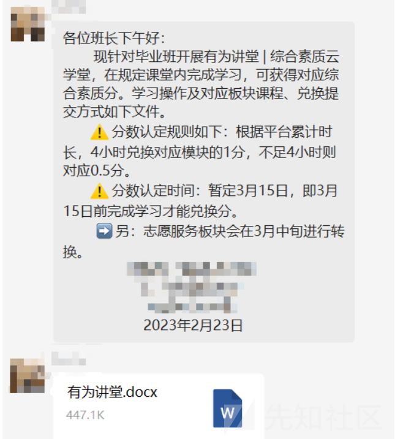
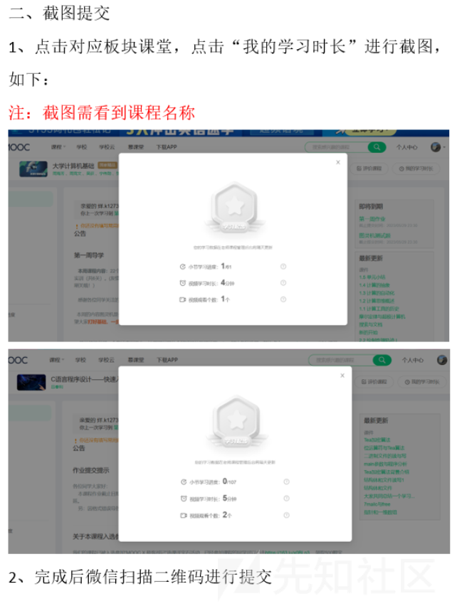
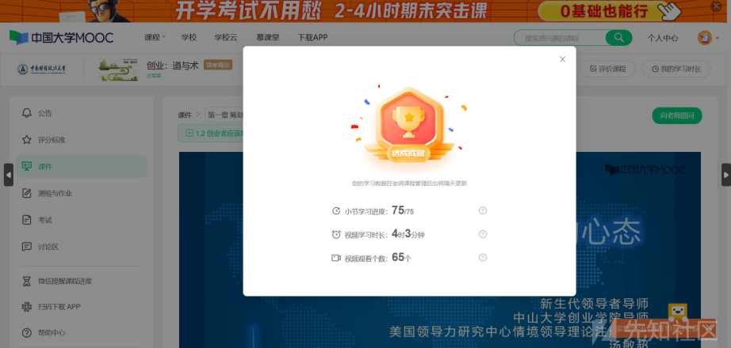
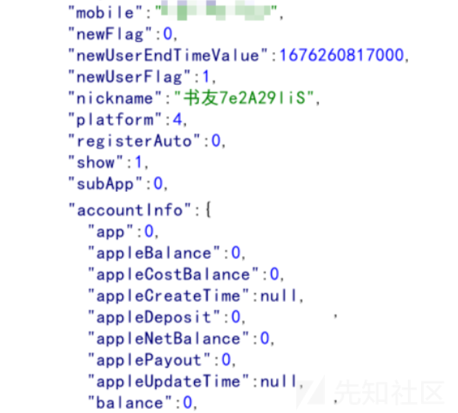
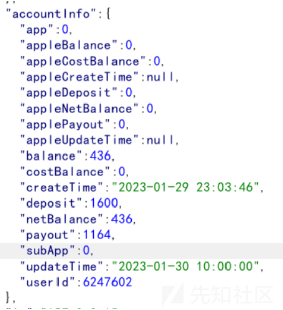
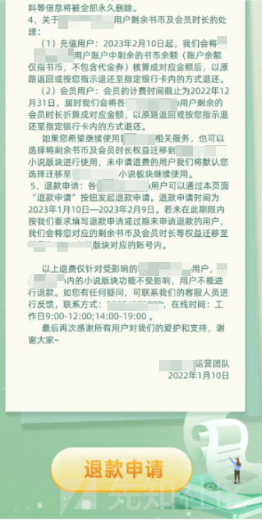
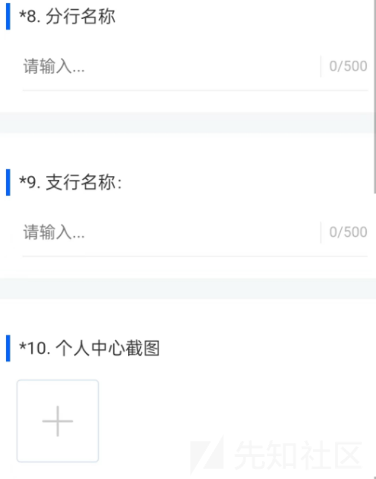
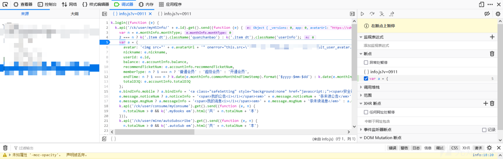

# 前端篡改伪造数据+不严谨的认证流程缺陷 - 先知社区

前端篡改伪造数据+不严谨的认证流程缺陷

- - -

### 一种简单但独特的思路

核心就是：抓响应包改数据骗前端页面，然后企图获利

例如这种

前端伪造数据实现的效果：

针对的就是不严谨地证明过程导致的身份/数据伪造或者篡改

啥意思呢？

就是当某项业务

需要你提供一些可被篡改/容易被篡改的身份凭证

且没有严谨的身份认证流程时

就可能会导致基于人或流程缺陷的身份伪造或数据伪造

### 举个例子

#### 场景一

某平台要停止业务了，对于已充值的用户开放退款服务，需要用户填问卷，提供个人中心的截  
图即可。

怎么利用？

我们可以通过篡改响应更改前端内容，然后再截图申请退款，从而获得其他用户的退款金额，影响用户体验和公司形象。

【PS：实战中遇到过该场景，漏洞是通过审核的，给的高危...虽然最后由于厂商认为该业务要停止运营了，所以不收纳，但这并不影响这个漏洞的危害性，该漏洞最大的缺陷就是具有一定时效性...】

> 下面是真实的情景

首先是一个鸡肋的水平越权，只能查看到其他人的用户名和余额

但是这些信息并不够隐私，而且该业务会在 2 月 9 号停服

所以危害有限，但他们在停服前开放了退款服务

只要账上有剩余书币的，只需要一张个人中心的截图，即可退款到指定银行账户

而想要继续使用账上书币/会员的，系统将自动将剩余书币迁移到新系统

我们针对的对象是那些想要继续使用新系统看小说的和来不及退款的用户

由于水平越权，我们知道哪些是有余额的高价值目标

例如 Id 为 6247602 的用户，他的账户上还有不少余额（可以对比下我自己号的）

这个是退款服务的公告

最后再通过前端设断点更改为前端有钱的用户

这里要先水平越权拿到有余额用户的 id、nickname 和它们的余额 balance

控制台输入：

e.avatarUrl="[https://xxxx/user/avatar/02/02/76/6247602.jpg-88x88?v=1674999055000](https://xxxx/user/avatar/02/02/76/6247602.jpg-88x88?v=1674999055000)";

e.nickname="xxx";

e.id=6247602;

e.accountInfo.balance=436;

然后上传图片，申请退款即可

具体流程：

1.  水平越权到其他账户上获取有余额的用户
2.  前端设断点，更改为有余额用户的id、nickname 和 balance，放开断点截图
3.  到APP里通过退款渠道去获取其他用户的退款金

（PS：退款是以问卷的形式进行的，要求上传个人中心截图意味着不会检测是哪个账户发起的。）

#### 场景二

某平台提供一个注销用户的业务，但该业务需要联系客服进行注销，在注销账户过程中，客服  
需要用户提供用户的用户名、绑定手机号和个人中心主页截图即可销户。

怎么利用？

通过信息泄露、越权、xss...方法获取到用户的用户名和手机号

根据获得的信息对个人中心的数据进行篡改伪造、截图，最后联系客服走一遍销户的流程，成功注销掉账户即可证明危害。

【PS：这种很敏感的操作一定要拿自己的测试账号来做测试，不然很容易出事的！！！】
