# 动态代理实现原理分析 - 先知社区

动态代理实现原理分析

- - -

## 代理

代理是一种常用的设计模式，其目的就是为其他对象提供一个代理以控制对某个对象的访问。代理类负责为委托类预处理消息，过滤消息并转发消息，以及进行消息被委托类执行后的后续处理。

代理可以理解为我们朋友圈中的代购,在买家与卖家间进行协调。

## 静态代理

要求被代理类和代理类同时实现相应的一套接口，通过代理类调用重写接口的方法，实际上调用的是原始对象的同样的方法。

### 实例

电影是电影公司委托给影院进行播放的，但是影院可以在播放电影时，产生一些自己的经济收益，比如卖爆米花、饮料等。

首先定义一个接口(Movie)

```plain
public interface Movie  {
    public void show();
}
```

其次，定义一个真正的实现这个 Movie接口的类(Real)

```plain
//委托类
class Real implements Movie{
    public void show(){
        System.out.println("您正在观看电影");
    }
}
```

代理类StaticPoxy,在同样调用show()方法后会进行处理(加上广告)

```plain
//代理类
public class StaticPoxy implements Movie{
    private Movie movie;
    public StaticPoxy(Movie movie) {
        this.movie=movie;
    }

    @Override
    public void show() {
        System.out.println("电影马上开始了，爆米花、饮料快来买啊");
        movie.show();
        System.out.println("电影已经结束了，爆米花、饮料买回家吧");
    }
}
```

测试类Test

```plain
public class Test {
    public static void main(String[] args){
        Movie test = new Real();
        System.out.println("-----无代理-----");
        test.show();
        System.out.println("-----静态代理-----");
        StaticPoxy staticPoxy = new StaticPoxy(test);
        staticPoxy.show();
    }
}
```

结果  
[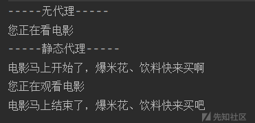](https://xzfile.aliyuncs.com/media/upload/picture/20231108105001-8345ea34-7de1-1.png)可以看到，代理可以在不修改被代理对象的基础上，进行一些功能的扩展。但代理类和委托类类应共同实现一个接口，或者是共同继承某个类。

### 静态代理的优点

我们可以在不改变Real委托类源代码的情况下 ,通过StaticPoxy代理类来扩展Real委托类的功能，从而实现`代理`操作。

### 静态代理的缺点

代理类和委托类都实现了一个接口，会有很多的代码重复；除此外，当我们需要添加一个其他接口时，代理类和委托类都需要修改代码实现接口，可以说会产生很多的冗余并且需要一定的运维成本。这时就出现了一种更为方便、高效的代理方式——动态代理

## 动态代理

　动态代理是指动态的在内存中构建代理对象（需要我们制定要代理的目标对象实现的接口类型），即利用JDK的API生成指定接口的对象，也称之为JDK代理或者接口代理。

动态代理主要涉及java.lang.reflect包下的Proxy类和InvocationHandler接口。

### java.lang.reflect.Proxy

先看下`java.lang.reflect.Proxy`类

Proxy类继承了`java.io.Serializable`接口，此外其中有一个`newProxyInstance`方法(还有很多方法，由于暂时不会用到所以没有列举)，动态代理就是由该静态方法来实现的

```plain
package java.lang.reflect;

import java.lang.reflect.InvocationHandler;

public class Proxy implements java.io.Serializable {

    public static Object newProxyInstance(ClassLoader loader,
                                            Class<?>[] interfaces,
                                            InvocationHandler h)

        ..........

}
```

看下参数作用

-   loader 类加载器
-   interfaces 代码要用来代理的接口
-   h 一个 InvocationHandler 对象

### InvocationHandler

刚才有提到`InvocationHandler`接口,并且在`newProxyInstance`方法中也有用到，下面来看下该接口

InvocationHandler接口是proxy代理实例的调用处理程序实现的一个接口，每一个proxy代理实例都有一个关联的调用处理程序；在代理实例调用方法时，方法调用被编码分派到调用处理程序的`invoke`方法。

而该类只有一个方法也就是`invoke`方法，也正是这个方法决定了怎么样处理代理传递过来的方法调用。

```plain
public interface InvocationHandler {

    public Object invoke(Object proxy, Method method, Object[] args)
        throws Throwable;
}
```

还是看一下参数作用

-   proxy 代理对象
-   method 要调用的代理对象方法
-   args 要调用方法的参数

### 实例

假如进入一个商场后肯定会有很多卖酒卖烟的代理，本次就用这种方式进行实例分析

还是先定义个接口`SellWine`，意为卖酒

```plain
public interface SellWine {
    public void sell();
}
```

实现类`Wine`

```plain
public class Wine implements SellWine{
    public void sell(){
        System.out.println("卖酒");
    }
}
```

代理类`DynamicPoxy`

```plain
import java.lang.reflect.InvocationHandler;
import java.lang.reflect.Method;

public class DynamicPoxy implements InvocationHandler {
    private Object agent;

    public DynamicPoxy(Object poxy) {
        this.agent = poxy;
    }

    @Override
    public Object invoke(Object proxy, Method method, Object[] args) throws Throwable {
        System.out.println("销售开始 代理商是："+this.getClass().getSimpleName());
        method.invoke(agent,args);
        System.out.println("销售结束");
        return null;
    }
}
```

测试类`Test`

```plain
import java.lang.reflect.InvocationHandler;
import java.lang.reflect.Proxy;

public class Test {
    public static void main(String[] args) {
        Wine wine = new Wine();
        InvocationHandler invocationHandler = new DynamicPoxy(wine);
        SellWine dynamicPoxy1 = (SellWine) Proxy.newProxyInstance(wine.getClass().getClassLoader(), wine.getClass().getInterfaces(), invocationHandler);
        dynamicPoxy1.sell();

    }
}
```

运行结果  
[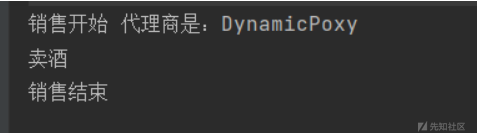](https://xzfile.aliyuncs.com/media/upload/picture/20231108105033-960d105c-7de1-1.png)

#### 分析

##### 代理文件生成

在Test类中最后调用了`dynamicPoxy1.sell();`，按正常思路来说，他应该跳到`sell()`方法才对，但这里却直接跳到了`DynamicPoxy`类的`invoke`方法，所以进行了一下分析。

在分析前在Test类中加上这段话，这样在运行后就会在`com.sun.proxy`生成动态代理文件

```plain
System.getProperties().put("sun.misc.ProxyGenerator.saveGeneratedFiles","true");
```

[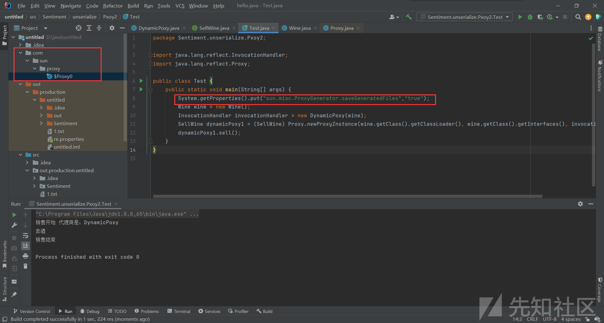](https://xzfile.aliyuncs.com/media/upload/picture/20231108105045-9d063082-7de1-1.png)  
先看下这个代理文件怎么生成的，代码量比较大看些关键代码，跟进11行的`newProxyInstance()`

跟进`getProxyClass0()`

[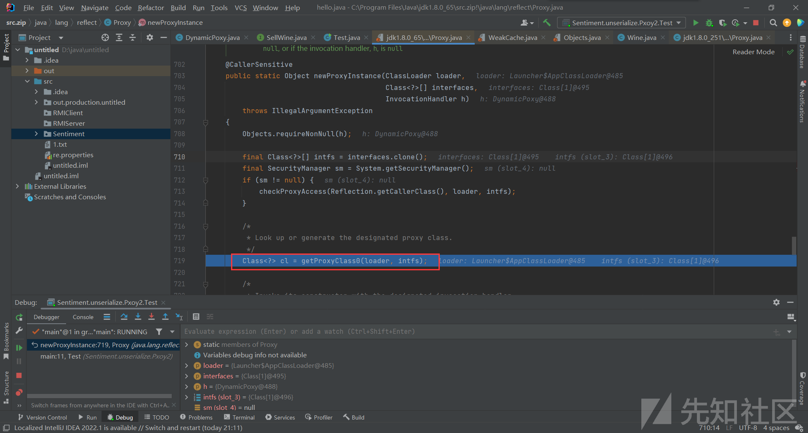](https://xzfile.aliyuncs.com/media/upload/picture/20231108105056-a390d2e0-7de1-1.png)  
之后又执行了

```plain
return proxyClassCache.get(loader, interfaces);
```

跟进`get()`

while循环的第二轮会进入`get()`

[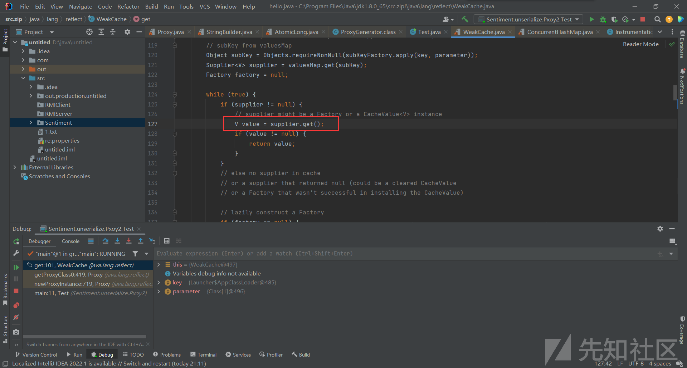](https://xzfile.aliyuncs.com/media/upload/picture/20231108105106-a9f9817c-7de1-1.png)  
会调用ProxyClassFactory的apply方法，这里看下`ProxyClassFactory`作用(通过`apply()->defineClass0()`生成class对象)

> 目的：生成新的代理类的class对象。  
> 原理：ProxyClassFactory是BiFunction接口的实现类，泛型参数为BiFunction<ClassLoader, Class<?>\[\], Class<?>>，表示可以传入一个类加载器和一个接口class对象的数组，通过apply方法生成一个代理类的class对象，并返回。之所以它可以生成代理类的class对象，也是因为在apply方法中调用了native的defineClass0方法。apply方法中包括了生成代理类class对象的一些预处理，如检查传入的class对象数组中的class对象是否被类加载器可见、是否是接口、生成新的代理类的类名proxyName等，最后调用了defineClass0方法来生成新的代理类的class对象，该class对象随后用于生成代理类实例。ProxyClassFactory的apply方法在proxyClassCache的二级缓存的value——工厂对象调用get方法时调用，表示通过该工厂对象返回代理类的class对象。

[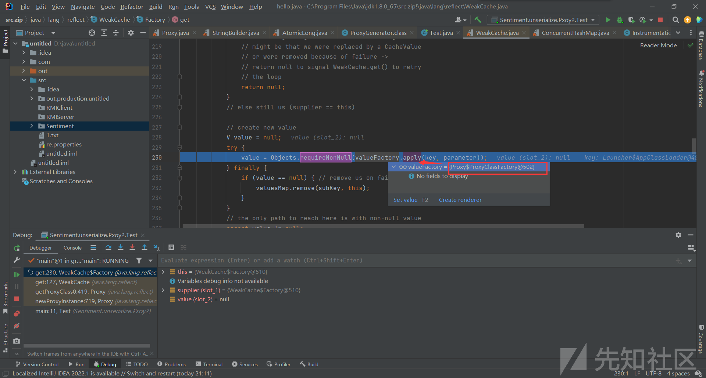](https://xzfile.aliyuncs.com/media/upload/picture/20231108105118-b10a9104-7de1-1.png)  
跟进`apply()`通过627行和634行生成路径和文件，最后通过`defineClass0`生成代理文件

[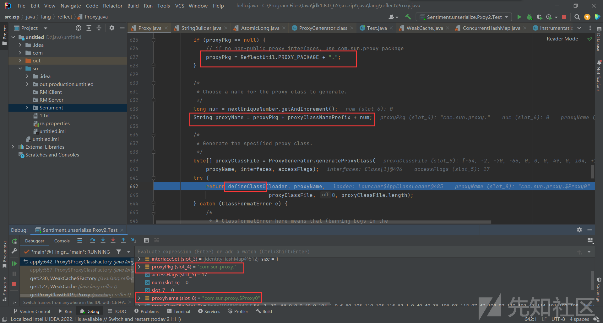](https://xzfile.aliyuncs.com/media/upload/picture/20231108105126-b5eb1374-7de1-1.png)

##### 流程分析

调用`dynamicPoxy1.sell();`时，会调用`$Proxy0.class`中的sell()，其中会调用`h.invoke()`

[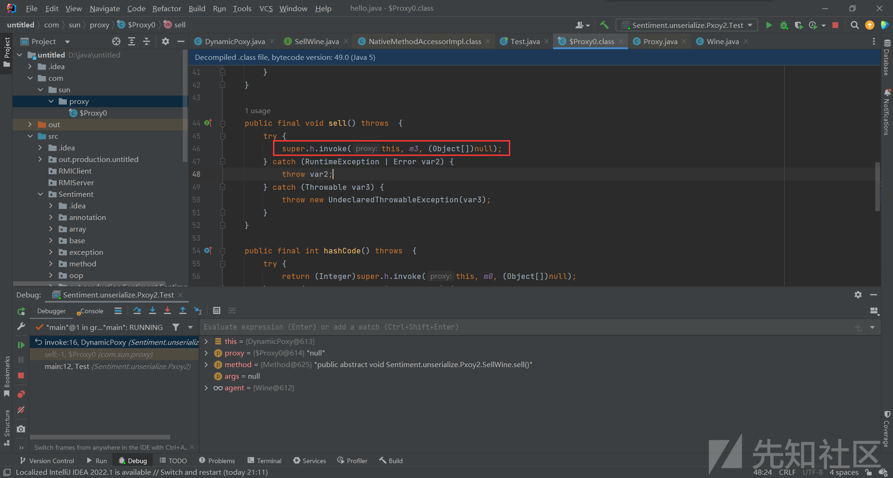](https://xzfile.aliyuncs.com/media/upload/picture/20231108105133-b9f63d04-7de1-1.png)  
而h，在动态代理最开始部分说过就是一个`InvocationHandler 对象`，而我们在Test类中对该对象赋过值即：new DynamicPoxy(wine)

[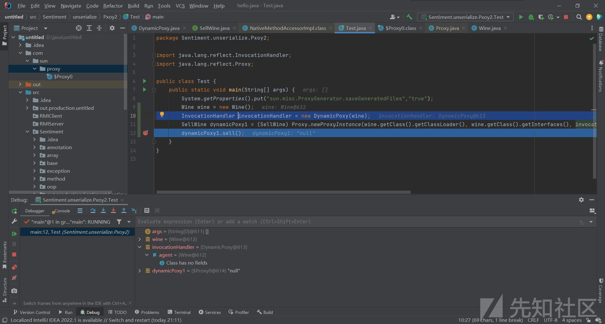](https://xzfile.aliyuncs.com/media/upload/picture/20231108105143-c021c50e-7de1-1.png)  
所以h.invoke就相当于时调用了`DynamicPoxy`类中的invoke

之后再看下method和agent的值，所以经过method.invoke(agent,args)后就调用了Wine类中的sell()方法

[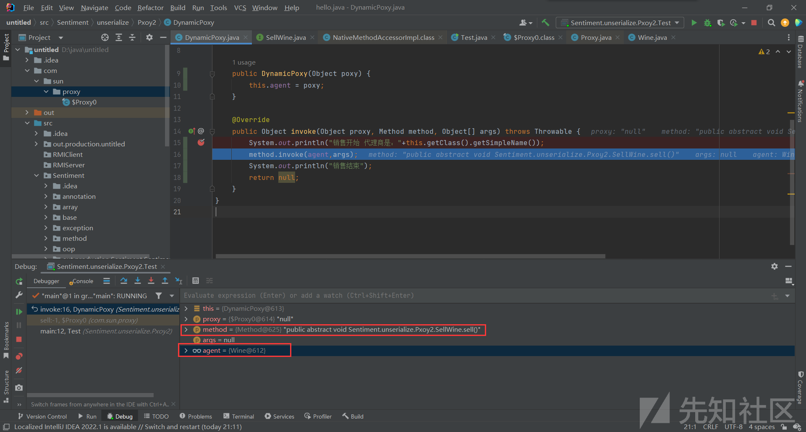](https://xzfile.aliyuncs.com/media/upload/picture/20231108105205-ccce321a-7de1-1.png)

#### 扩展

此时若我们我们想再增加一个卖酒功能，若用静态代理则需要添加接口，并修改委托类、代理类、测试类等；但动态代理则可跳过修改代理类的过程，通过添加接口来实现需求

再定义一个卖烟接口`SellCigarette`

```plain
public interface SellCigarette {
    public void sell();
}
```

实现类`Cigarette`

```plain
public class Cigarette implements SellCigarette{
    public void sell(){
        System.out.println("卖烟");
    }
}
```

此时我们的代理类已经不需要更改了,只需要在实现类`Test`类中加上我们要实现的功能即可

```plain
Cigarette cigarette = new Cigarette();
InvocationHandler invocationHandler2 = new DynamicPoxy(cigarette);

SellCigarette dynamicPoxy2 = (SellCigarette) Proxy.newProxyInstance(cigarette.getClass().getClassLoader(), cigarette.getClass().getInterfaces(), invocationHandler2);

dynamicPoxy2.sell();
```

最终`Test`类

```plain
import Sentiment.unserialize.Poxy.Cigarette;
import Sentiment.unserialize.Poxy.SellCigarette;

import java.lang.reflect.InvocationHandler;
import java.lang.reflect.Proxy;

public class Test {
    public static void main(String[] args) {
        Wine wine = new Wine();
        Cigarette cigarette = new Cigarette();
        InvocationHandler invocationHandler1 = new DynamicPoxy(wine);
        InvocationHandler invocationHandler2 = new DynamicPoxy(cigarette);
        SellWine dynamicPoxy1 = (SellWine) Proxy.newProxyInstance(wine.getClass().getClassLoader(), wine.getClass().getInterfaces(), invocationHandler1);
        SellCigarette dynamicPoxy2 = (SellCigarette) Proxy.newProxyInstance(cigarette.getClass().getClassLoader(), cigarette.getClass().getInterfaces(), invocationHandler2);
        dynamicPoxy1.sell();
        System.out.println("-------------------");
        dynamicPoxy2.sell();

    }
}
```

运行结果

[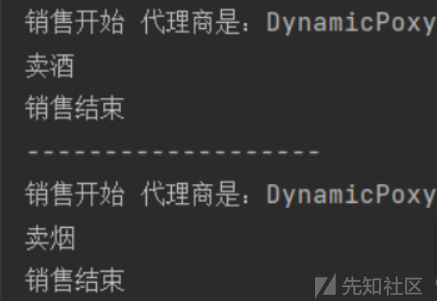](https://xzfile.aliyuncs.com/media/upload/picture/20231108105152-c53f7ebe-7de1-1.png)
