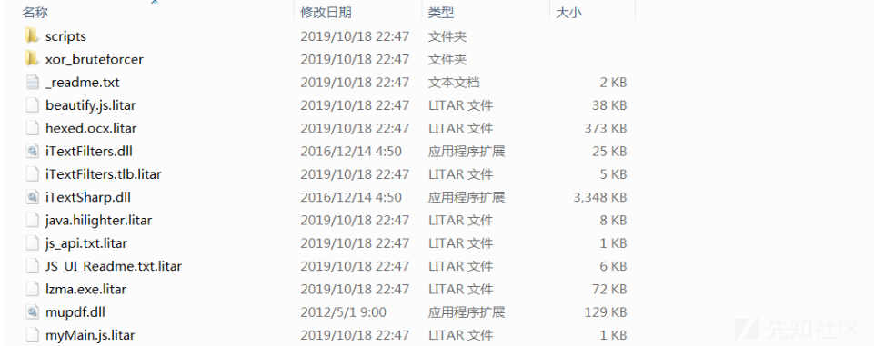
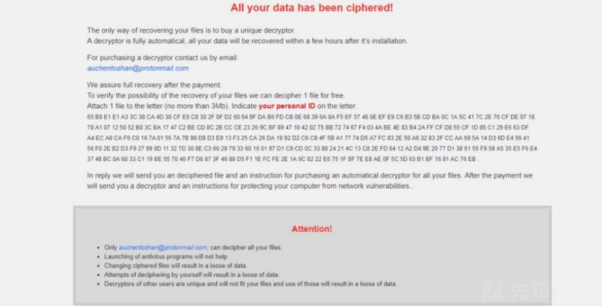
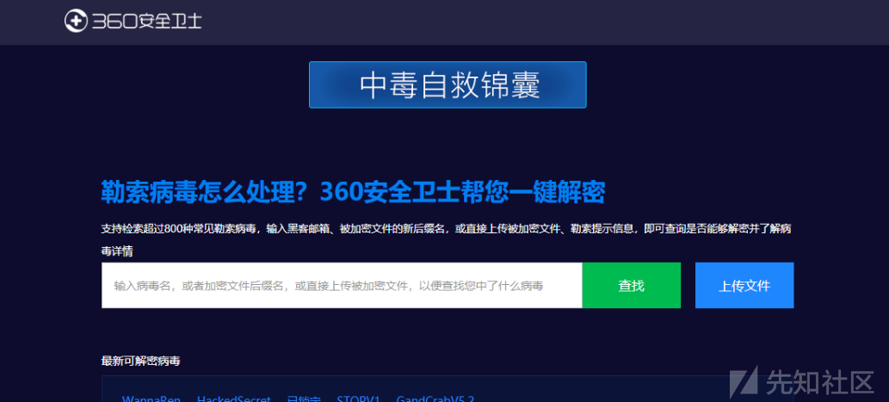
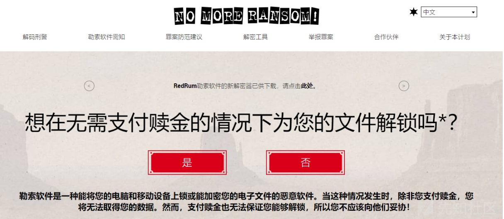

# 勒索病毒简易浅析 - 先知社区

勒索病毒简易浅析

- - -

## 文章前言

时至年末，勒索事件爆发的频次越来越高，重大安全事件也层出不穷，给个人和组织都带来了重大的安全威胁，本篇文章将基于此背景一步步揭开勒索病毒的神秘面纱并给出一些列的处置建议和防护措置以供个人或企业作为参考

## 基本介绍

勒索病毒是一种极具破坏性、传播性的恶意软件，主要利用多种加密算法加密用户数据，之后勒索用户高额赎金，故而勒索病毒也被称为是当前黑客最有效的"变现"方式  
勒索病毒文件在本地运行后会利用本地的互联网访问权限连接至黑客的C2服务器，进而上传本机信息并下载加密公钥，之后利用加密公钥对当前主机中的重要文件进行加密，由于勒索病毒大多使用的加密算法属于非对称加密算法，所以除非是拥有解密私钥的攻击者本人，其他人是几乎不可能解密，加密完成后通常还会修改壁纸，在桌面等明显位置生成勒索提示文件，指导用户去缴纳赎金，勒索病毒变种类型非常快，对常规的杀毒软件都具有免疫性，攻击样本以exe、js、wsf、vbe等类型为主，勒索病毒的勒索过程如下：  

## 发展历程

-   1989年：第一个已知的勒索软件名AIDS(PC Cyborg)由哈佛大学毕业的Joseph Popp创建，这是一种替换AUTOEXEC.BAT文件的特洛伊木马程序，当潜伏AIDS的计算机启动次数到达第90次时就会隐藏目录并加密驱动器C:上的所有文件的名称(使系统无法使用)，随后会要求用户"更新许可证"并联系PC Cyborg Corporation付款(将189美元寄到巴拿马的一个邮政信箱内)，作者称其非法所得费用用于艾滋病研究
-   2005年：出现了一种加密用户文件的木马(Trojan/Win32.GPcode)，该木马在被加密文件的目录下生成具有警告性质的txt文件并要求用户购买解密程序，所加密的文件类型包 括.doc、.html、.jpg、.xls、.zip及.rar
-   2006年：首次出现使用RSA加密算法的勒索软件Archievus，同年国内出现首个勒索木马Redplus，该木马会隐藏用户文档和包裹文件然后弹出窗口要求用户将赎金汇入指定银行账号
-   2011年：出现模仿Windows产品激活通知的勒索软件蠕虫
-   2013年：广为人知的勒索软件CryptoLocker出现，其通过受感染的电子邮件附件分发， 受害者可以通过比特币或GreenDot MoneyPak支付赎金，黑客威胁受害者如果未能在 72小时内付款将删除私钥无法进行解密
-   2015年：勒索即服务(RaaS)出现，这种商业模式使得勒索攻击的发起者无需任何专业技术知识就可以轻易地发起网络敲诈活动，勒索开发团队在这种模式下坐享其成且不需要直接对受害者发起攻击，而在RaaS中扮演服务供应商，提供客户需要的定制化攻击方案，为客户提供有限的攻击技术支持从而赚取一部分佣金或分成，勒索即服务(RaaS)模式时至今日仍被推崇，这种低门槛的运作方式时常活跃在互联网背后的暗网交易平台里
-   2016年：国际网络范围中勒索软件活跃的首个鼎盛时期，也被称为勒索软件元年，据业内数据表明同比增长达752%，Locky、Goldeneye、Crysis、CryLocker等勒索软件所造成的损失超过10亿美元
-   2017年：全球爆发著名的电脑勒索软件WannaCry，涉及多达150个国家7.5万多台的电脑被感染，有99个国家遭受到直接攻击，其中包括英国、美国、中国、俄罗斯、西班牙和意大利等
-   2020年以后的双重勒索攻击：近年来，勒索病毒的演变趋势是采用双重勒索攻击。这种攻击方式不仅加密受害者的文件，还威胁将泄露或公开敏感数据，以增加受害者支付赎金的动力。这种策略在一些大规模的勒索事件中被广泛使用，对组织和个人造成了更大的威胁

## 软件分类

### 加密勒索软件

加密勒索软件主要以加密个人文件和文件夹(文档、电子表格、图片和视频)为主，受影响的文件一旦加密就会被删除，用户通常会在与现在无法访问的文件同名的文件夹中遇到带有付款说明的文本文件，当文件扩展名被自动更改时用户可能会察觉到勒索软件所带来的影响  

### 锁定屏幕勒索软件

锁定屏幕类勒索软件会锁定计算机屏幕并要求付款，同时它会显示一个全屏图像阻止所有其他窗口，有一个特点就是它不会加密任何个人文件  

### 主引导记录勒索软件

主启动记录(MBR)是计算机硬盘驱动器中允许操作系统启动的部分，MBR通过更改计算机的MBR以便中断正常的启动过程，赎金要求显示在屏幕上并且防止操作系统的启动  

### Web服务器加密勒索

Web服务器加密勒索以Web服务器为目标并加密其上的许多文件，它通过利用内容管理系统中的已知漏洞在Web服务上部署勒索软件  

## 加密技术

在计算机上广泛应用于文件加密的技术可分为以下四种类型：

### 基础加密

基础加密是指以一种极其简单的运算方式来修改原始文件的数据，而没有特定数学算法参与，比较典型的方式比如异或运算、加法运算、减法运算或者结合起来使用，最初的勒索软件由于技术水平不成熟，加密算法技术未普及等诸多原因会使用这种运算符操作数据的方式修改文件的数据，解密这样的文件只需要进行运算符暴力枚举，文件数据碰撞或者逆向勒索软件运算时使用的密钥就能直接对数据内容进行还原

### 对称加密

随着技术的更新和发展勒索软件开始重视加密算法的应用，早期勒索软件开始使用一些对称式的加密算法，对称式加密算法其特点是有一个密钥，由于加密和解密使用相同的密钥且加密和解密的运算逻辑往往相同，对称加密算法的密钥十分容易泄露，文件或HASH碰撞的方式仍然有机会解密以反推正确的密钥或者通过逆向勒索软件运行时密钥的来源以此获得密钥就能够解密被对称算法加密的文件  
稍微聪明的攻击者会将对称密钥通过网络传输的方式发送回攻击者的服务器，然后销毁本地密钥痕迹，这样一来如果不能从攻击者服务器获取到算法密钥那么解密文件的过程必然会非常繁琐困难，但是这样一来攻击者的服务器就会暴露在大众视野之下对他们来说这是很不安全的，被勒索软件广泛应用的对称加密算法有：AES，DES，3DES，RC4，Salsa20，TEA

### 非对称加密

非对称加密算法也称为开放密钥算法或称为公钥加密算法，与对称算法不同的是它需要两个密钥：一个是公有密钥，另一个是私有密钥，顾名思义公有密钥公开公布主要作为加密信息时使用的加密密钥，而私有密钥并不能随意公布且仅用来解密与之对应公钥加密的信息时才能使用的，攻击者仅需要将公钥嵌入到勒索软件代码中并在适当的时机通过导入公钥来加密那些文件信息，而私钥被攻击者严加保管，在这样的情况下加密的文件信息如果没有攻击者的私钥，往往难以被解密  
对称加密算法的特点是加密速度快而非对称算法加密速度慢，因此黑客在勒索软件中会采用两种算法相结合的方式来锁定用户文件，他们使用对称算法快速地加密文件，仅仅使用非对称算法去加密对称算法的密钥，这样一来整个加密逻辑能够做到既安全又高效，是当今勒索软件彼此心照不宣的加密方案，目前被勒索软件广泛应用的非对称加密算法有：RSA，ECC

### 混合加密类

现代勒索软件不会使用单一加密手段对文件进行直接加密，那样的方式要么是效率十分低下，要么是安全性不足，在这种情况下混合加密成为了勒索软件主流的运用手法，以GandCrab的RSA+Salsa20为例，RSA公钥用于加密第一个salsa20的Key和Iv ，之后使用第一个salsa20加密程序生成的RSA私钥  
  
使用程序RSA公钥加密第二个salsa20的Key和Iv，之后使用第二个Salsa20算法来加密磁盘文件  
  
被加密的文件隐藏着能够解密文件的salsa20密钥，但是这将需要作者的RSA私钥才能够进行解密，使用两次RSA的好处是作者不需要暴露自己的私钥，交给用户一个程序生成的RSA私钥来针对不同的受害机器执行单独解密的操作  

## 勒索家族

### STOP

STOP勒索病毒最早出现在2018年2月份左右，从2018年8月份开始在全球范围内活跃，主要通过捆绑其它破解软件、广告类软件包等渠道进行感染传播，最近一两年STOP勒索病毒捆绑过KMS激活工具进行传播，甚至还捆绑过其他防毒软件，到目前为止此勒索病毒一共有160多个变种，虽然此前Emsisoft公司已经发布过它的解密工具可以解密140多个变种，但最新的一批STOP勒索病毒仍然无法解密  
常见后缀：.TRO .djvu .puma .pumas .pumax .djvuq .litrar…  
勒索特征：样本释放在%appdata%\\local\\<随机名称>  

### Satan

撒旦(Satan)勒索病毒首次出现2017年1月份，最新版本攻击成功后会加密文件并修改文件后缀为"evopro"，除了通过RDP爆 破外还通过多个漏洞传播  
常见后缀：evopro sick …  
传播方式：永恒之蓝漏洞、RDP爆破、JBOSS系列漏洞、Tomcat系列漏洞、Weblogic组件漏洞等  
勒索特征：最新变种evopro暂时无法解密，老的变种可解密  

### RYUK

Ryuk勒索病毒最早在2018年8月由国外某安全公司发现并报道，此勒索病毒多根据企业规模进行定制性攻击，攻击目标多为大型企业与政府机构，攻击成功后索要赎金数额巨大，该勒索使用RSA+AES算法对文件进行加密，在没有相应RSA私钥的情况下无法解密  
传播方式：垃圾邮件或漏洞利用工具包、Trickbot银行木马  
勒索特征：勒索信名称多为"RyukReadMe.html"或"RyukReadMe.txt"  
常见后缀：.ryk  

### MAZE

Maze(迷宫)勒索病毒又称Chacha勒索病毒，最早于2019年5月份由Malwarebytes安全研究员首次发现，此勒索病毒主要使用各种漏洞利用工具包Fallout、Spelevo，伪装成合法加密货币交换应用程序的假冒站点或挂马网站等方式进行分发传播，最近的一段时间里，Proofpoint的安全研究人员发现一个新型的黑客组织TA2101，通过垃圾邮件的方式对德国、意大利、美国发起网络攻击，传播Maze(迷宫)勒索病毒  
传播方式：垃圾邮件、网站挂马等  
勒索特征：勒索信中的关键字"maze"  
常见后缀：不规则  

### Buran

2019年5月Buran勒索病毒首次出现，该勒索病毒是一款新型的基于RaaS模式进行传播的新型勒索病毒，在一个著名的俄罗斯论坛中进行销售与其他基于RaaS勒索病毒(如GandCrab)获得30%-40%的收入不同，Buran勒索病毒的作者仅占感染产生的25%的收入，安全研究人员认为Buran是Jumper勒索病毒的变种样本，同时VegaLocker勒索病毒是该家族最初的起源，由于其丰厚的利润使其迅速开始在全球范围内传播感染，Buran勒索病毒此前使用RIG Exploit Kit漏洞利用工具包进行传播，其利用了Internet Explorer的一个比较严重的漏洞CVE-2018-8174  
传播方式：漏洞利用工具包 WEB类安全漏洞  
勒索特征：勒索信"!!!ALL YOUR FILES ARE ENCRYPTED !!!"  
常见后缀：不规则  

### Sacrab

Scarab(圣甲虫)恶意软件于2017年6月首次发现，此后有多个版本的变种陆续产生并被发现，最流行的一个版本是通过Necurs僵尸网络进行分发，使用Visual C语言编写而成  
常见后缀：.krab .Sacrab .bomber .Crash ……  
传播方式：Necurs僵尸网络RDP爆破 垃圾邮件 ……  
勒索特征：样本释放%appdata%\\Roaming  

### Matrix

目前为止变种较多的一种勒索，该勒索病毒主要通过入侵远程桌面进行感染安装，黑客通过暴力枚举直接连入公网的远程桌面服务从而入侵服务器，获取权限后便会上传该勒索病毒进行感染，勒索病毒启动后会显示感染进度等信息，在过滤部分系统可执行文件类型和系统关键目录后对其余文件进行加密，加密后的文件会被修改后缀名为其邮箱  
常见后缀：.GRHAN .PRCP .SPCT .PEDANT …  
传播方式：RDP爆破  
勒索特征：  

### Paradise

Paradise勒索病毒翻译成中文是"天堂勒索"，最早出现在2018年7月，最初版本会附加一个超长后缀如(*V.0. 0.0.1{yourencrypter@protonmail.ch}.dp)到原文件名末尾，在每个包含加密文件的文件夹都会生成一个勒索信  
常见后缀：文件名*%ID 字符串%\_{勒索邮箱}.特定后缀  
勒索特征：将勒索弹窗和自身释放到 Startup 启动目录

### Phobos

Phobos勒索病毒复用了Crysis的部分代码，与Crysis高度相似(文件后缀与勒索信)，该勒索病毒多通过RDP弱口令进行传播，使用RSA+AES算法加密文件，在没有相应RSA私 钥的情况下无法解密  
传播方式：RDP弱口令  
勒索特征：勒索信名称为"info.txt"、"info.hta"  
常见后缀：.Banta、.phobos、.actin、.PISCA、. caleb…

### WannaCry

2017年5月12日，WannaCry勒索病毒全球大爆发，至少有150个国家、30万名用户中招，造成损失达80亿美元。WannaCry蠕虫主要通过MS17-010漏洞在全球范围传播，该蠕虫感染计算机后会向计算机中植入敲诈者病毒，导致电脑大量文件被加密，受害者电脑被黑客锁定后病毒会提示需要支付相应赎金方可解密  
常见后缀：wncry  
传播方式：永恒之蓝漏洞  
勒索特征：

-   启动时会连接一个不存在url
-   创建系统服务mssecsvc2.0
-   释放路径为Windows目录

### GlobeImposter

GlobeImposter最早是在2017年出现，在2018年8月21日起多地发生GlobeImposter勒索病毒事件，攻击目标主要是开始远程桌面服务的服务器，攻击者通过暴力破解服务器密码对内网服务器发起扫描并人工投放勒索病毒，导致文件被加密多个版本更新，并常通过爆破RDP后手工投毒传播  
常见后缀：auchentoshan、十二生肖英文名称+4444  
传播方式：RDP爆破 垃圾邮件 捆绑软件  
勒索特征：释放在%appdata%或%localappdata%

### MedusaLocker

MedusaLocker勒索早期勒索信与GlobeImposter非常相似，曾被认为是GlobeImposter的变种，该勒索病毒使用RSA+AES算法对文件进行加密，在没有相应RSA私钥的情况下 无法解密  
传播方式：RDP 弱口令  
勒索特征：勒索信名称为"RECOVER\_INSTRUCTIONS.html"、"INSTRUCTIONS.html"  
常见后缀：".ReadTheInstructions"，".READINSTRUCTIONS"

### LockBit

发现日期：2019 年  
简要描述：LockBit于19年出现至今共诞生出三个版本，在2.0增加了StealBit窃密木马，而最新的LockBit 3.0提升了安全软件对抗能力  
入侵手法：通常利用RDP弱口令爆破的方式渗透到目标计算机中  
加密方式：RSA+AES  
赎金类型：虚拟货币(比特币)  

### BlackBasta

发现日期：2022年  
简要描述：作为新兴勒索软件针对企业用户的Windows系统以及Linux服务器运行的VMware ESXi虚拟机  
入侵手法：通过僵尸网络传播  
加密方式：RSA+ChaCha20  
赎金类型：虚拟货币（比特币）

### lockbit3.0

简要描述：lockbit3.0时lockbit的第三个版本，它主要采用强大的AES-256和RSA-2048两种复杂算法加密用户数据并尝试使用PSExec在受害者网络环境中执行横向移动和远程执行，加密强度极高，攻击范围广泛  
加密方式：AES-256+RSA-2048两种复杂算法加密用户数据  
主要特征：

-   开机主界面弹出多个网页形式的勒索信
-   所有文件扩展名都被修改为.AGRHETCUE(9个随机字母)
-   被加密的文件夹中有一个aGrhEtcUe.README.txt勒索信文档

### xollam

简要描述：Xollam是Mallox勒索病毒家族的8月份新变种，名称颠倒，它会对系统中的文件进行加密操作，主要特征是将".xollam"扩展名附加到文件名，.xollam勒索病毒以其先进的加密技术而著称。一旦成功感染计算机系统，它会迅速搜寻用户的数据文件，如文档、照片、视频等，然后使用强大的加密算法将这些文件锁定。加密后，用户无法访问这些文件，而.xollam勒索病毒会弹出勒索信息，要求用户支付一定数量的加密货币以获取解密密钥。这种敲诈手段使受害者在经济和隐私层面双重受创  
传播方式：.xollam勒索病毒采用多种方式进行传播，其中包括远程桌面爆破、弱口令攻击、恶意电子邮件、恶意下载链接、漏洞利用等。恶意电子邮件可能伪装成合法的通知、发票或文件分享，引诱用户点击附件或链接。一旦用户中招，病毒便能迅速感染系统并展开加密攻击。此外，.xollam勒索病毒还可能利用系统和应用程序的漏洞，通过网络攻击渗透进入目标系统  
主要特征：

-   开机主界面弹出多个网页形式的勒索信
-   所有文件扩展名都被修改为.xollam
-   被加密的文件夹中有一个FILE RECOVERY.txt勒索信文档

### babyk

简要描述：.babyk是勒索病毒家族中的一员，它以其狡猾和具有挑战性的加密算法而著称，一旦感染了受害者的计算机系统，.babyk会在其文件中施加强大的加密，将它们变成一堆看似毫无规律的字符，只有支付赎金才能解开这个谜题  
传播方式：通过社交工程、恶意电子邮件附件或伪装成合法软件的下载链接来传播  
主要特征：

-   开机主界面弹出多个网页形式的勒索信
-   所有文件扩展名都被修改为.babyk
-   被加密的文件夹中有一个How To Restore Your Files.txt勒索信文档

## 攻击手法

目前勒索病毒常见的攻击手法主要有以下几种：

-   文件感染
-   钓鱼邮件
-   网站挂马
-   服务器入侵
-   操作系统漏洞
-   网络共享文件

## 勒索检测

用户被勒索病毒勒索时可以根据勒索病毒的特征(例如;加密文件的后缀、勒索信中的关键词等)检测合识别勒索病毒，当然这些必须基于对勒索病毒的特征和家族特别熟悉的基础之上，本篇文章将介绍几种通过勒索病毒搜索引擎快速查找勒索病毒相关信息的方法  
**【360】 勒索病毒搜索引擎**：[https://lesuobingdu.360.cn/](https://lesuobingdu.360.cn/)

**【腾讯】 勒索病毒搜索引擎**：[https://guanjia.qq.com/pr/ls/](https://guanjia.qq.com/pr/ls/)

**【奇安信】勒索病毒搜索引擎**：[https://lesuobingdu.qianxin.com/](https://lesuobingdu.qianxin.com/)  

**【ransomware】勒索病毒识别**：[https://id-ransomware.malwarehunterteam.com/](https://id-ransomware.malwarehunterteam.com/)

## 勒索解密

目前勒索病毒领域甚至兴起了一种RaaS模式(勒索即软件服务)，与此同时也出现了多家安全企业专门研究并提供勒索软件解密服务，常见的解密渠道有以下三种：

-   免费解密：主要针对一些被已知的历史勒索软件加密后的文件进行解密
-   支付解密：主要针对一些近期互联网上出现的新型勒索软件加密后的文件进行解密
-   勒索解密：主要是指受害者通过勒索信息联系攻击者并支付高额的资金获取解密服务

### 免费解密

【腾讯哈勃】勒索软件专杀工具：[https://habo.qq.com/tool/index](https://habo.qq.com/tool/index)  
  
【nomoreransom】勒索软件解密工具集：[https://www.nomoreransom.org/zh/index.html](https://www.nomoreransom.org/zh/index.html)

【瑞星】解密工具下载：[http://it.rising.com.cn/fanglesuo/index.html](http://it.rising.com.cn/fanglesuo/index.html)

【卡巴斯基】免费勒索解密器：[https://noransom.kaspersky.com/](https://noransom.kaspersky.com/)

【Avast】免费勒索软件解密工具：[https://www.avast.com/zh-cn/ransomware-decryption-tools](https://www.avast.com/zh-cn/ransomware-decryption-tools)

  
【Emsisoft】免费勒索软件解密工具：[https://www.emsisoft.com/ransomware-decryption-tools/free-download](https://www.emsisoft.com/ransomware-decryption-tools/free-download)

### 支付解密

目前有很多的安全厂商提供了勒索解密服务，在解密时只需要提供一定的解密服务费用即可，这里不做任何推广，有兴趣的可以自行百度即可，但是这种解密可能并不彻底也难以规避数据全部丢失，需要多方面考虑

### 支付赎金

勒索解密主要是指受害者通过勒索信息联系攻击者并支付高额的资金获取解密服务，根据以往案例依旧有部分受害者在支付完后并未获得完全解密，更有甚者被进行二次勒索导致高额损失，勒索解密发生在一些重要的基础设施场景(例如:医院、银行等)且勒索病毒为新型勒索病毒时可以采用以快速恢复业务，当然具体情况还得具体分析

## 解决方案

### 事前防御

#### 操作系统

-   服务器需使用正版操作系统，开启系统自动更新补丁功能
-   服务器需定期修改操作系统的用户名和密码并使用复杂密码
-   服务器需安装杀毒软件，定期更新杀毒软件特征库并进行查杀

#### 网络服务

-   服务器禁止部署其他不必要、不安全的WEB应用服务
-   服务器需关闭非必要服务，例如：135、139、445、3389等服务
-   尽量将重要应用系统部署在企业内网环境并设立一个DMZ网络隔离区
-   部署安全防护设备对应用进行防护和监测，例如:基于应用的WAF、基于主机的EDR、入侵监测、入侵防护等

#### 应用系统

-   关注应用系统官方安全补丁的更新动态，及时打补丁以提升应用系统安全
-   使用正版应用系统，加强密码的安全性管理，对管理员等高权限账号进行密码的修改，设置高复杂度密码策略、要求用户定期更换密码(不可超过3个月)
-   定期完整备份应用系统数据库和系统安装目录下的所有文件，必须进行异地、异介质备份，同时根据实际情况测试备份数据的可用性和完整性(特别注意：备份一定不要放在原服务器上，建议使用移动硬盘定期进行重要数据异地备份)

### 用户个人

-   个人电脑使用正版操作系统并设置复杂密码，定期修改(不超过90天)
-   个人电脑必须安装杀毒软件并定期更新杀毒软件特征库，定期进行查杀
-   个人电脑关闭非必要服务和端口，例如：135、139、445、3389等高危端口
-   提高安全意识不浏览非法恶意网站，不随意插入不明来历的U盘等网络设备
-   提高安全意识不随意点击陌生链接、来源不明的邮件附件和陌生人通过即时通讯软件发送的文件

### 事中处置

#### 隔离中毒主机

-   物理隔离：主机断网处置，拔掉网线或禁用网卡，笔记本也要禁用无线网络
-   逻辑隔离：修改被感染主机与同一局域网内的其他主机的密码，尤其是管理员密码且密码长度不少于8个字符，至少包含大小写字母、数字、 特殊符号中的三类且不能是人名、计算机名、用户名等

#### 排查其他主机

隔离已感染主机后应尽快排查业务系统与备份系统是否受到影响，确定病毒影响范围，如果存在备份系统且备份系统是安全的就可以将损失降到最低也可以最快的恢复业务

#### 病毒清除查杀

勒索病毒清除查杀比较常见的方法有两种：

-   杀软查杀：目前部分杀软可以做到勒索病毒的查杀和清除，但是更多的是一些比较新颖或者变种的木马，此类木马被查杀和清除的概率较小
-   重装系统：重装系统是比较常见的一种较为有效的彻底清除勒索病毒木马的方式，但是在此之前需要确保上面的1、2两点已完成排查，规避重装系统会被局域网内的其他感染勒索病毒的主机再次传播

#### 加固感染主机

主机感染病毒一般都是由未修复的系统漏洞、未修复的应用漏洞或者弱口令导致的，所以在已知局域网内已有主机感染并将之隔离后应检测其他主机是否有上述的问题存在

-   系统漏洞可以使用免费的安全软件检测并打补丁
-   应用漏洞可以使用免费的漏扫产品(AWVS、APPScan等)检测并升级或采用 其他方式修复
-   弱口令应立即修改，密码长度不少于 8 个字符，至少包含以下四类字符中 的三类：大小写字母、数字、特殊符号，不能是人名、计算机名、用户名等

#### 数据备份还原

数据备份还原的前提是有做数据的备份，同时数据备份必须是异地、异介质备份，本地备份无效(因为勒索病毒同样会加密此类文件)，同时在进行备份还原前要确保原主机上病毒已彻底清除，日常进行合理的数据备份是最有效的灾难恢复方法

#### 数据解密处理

数据解密处理是一个可选项，如果在上面的第三步是采用了重装系统的方法，那么此步骤是多余的，如果采用了杀软进行查杀或者通过分析手法对病毒进行了清除，那么此时可以尝试对关键数据进行解密处理，主要的方式如下：

-   免费解密：部分已知的勒索病毒已经可以找寻到对应的解密工具对其进行解密，例如:瑞星、腾讯哈勃
-   支付解密：目前有很多的安全厂商提供了勒索解密服务，在解密时只需要提供一定的解密服务费用即可
-   勒索解密：由于目前勒索病毒已呈现产业化，同时在大量的实例表明现阶段存在大量的变种病毒，支付赎金后并不提供真实有效的密钥，实际解密成功率极低，同时存在人为投毒后冒以专家身份主动联系代付解密的情况，故不建议直接支付解密

### 事后分析

勒索攻击事件发生之后我们需要针对事件进行详细的分析，比如对感染的深度和广度进行调查，更重要的是要分析受感染用户是通过什么方式感染的，以确定应该从哪些方面入手对问题进行解决，防止类似的事件再次发生，另外也要对勒索软件行为进行分析，确定勒索软件攻击的指示器并将这些分析结果用于改进检测防范和防御方法，提升整体安全防护能力

## 文末小结

目前勒索病毒领域甚至兴起了一种RaaS(Ransomware as a Service，勒索即软件服务)的模式，在RaaS模式下恶意软件开发者或犯罪团伙将勒索病毒作为一项服务提供给其他恶意用户，这些用户通常被称为"合作伙伴"或"分销商"，RaaS模式的运作方式通常如下：

1.  开发者创建勒索病毒：RaaS的开发者负责创建和开发勒索病毒的核心代码，包括加密算法、传播方式和勒索界面等
2.  提供定制化服务：开发者将勒索病毒进行定制，使其适应不同的攻击需求，合作伙伴可以根据自己的目标和受害者群体选择不同的设置，例如指定特定国家或行业作为攻击目标
3.  分销给合作伙伴：开发者将勒索病毒提供给合作伙伴使用，合作伙伴通常需要支付一定的费用作为使用许可或分成，这使得即使没有专业技能的黑客也可以轻松获取勒索病毒并进行攻击
4.  攻击和感染：合作伙伴使用各种传播方式（如垃圾邮件、漏洞利用或恶意广告）将勒索病毒传播给受害者，一旦受害者的计算机被感染，勒索病毒会加密其文件并显示勒索信息
5.  赎金支付和收益分成：受害者被要求支付赎金以恢复其文件。赎金通常要求以加密货币（如比特币）支付，并通过匿名通道进行交易。支付后，收益将根据事先约定的分成规则分配给开发者和合作伙伴

故强烈建议个人、企业做好事前防范准备，并时常开展内部资产排查梳理与内部应急拉练~
