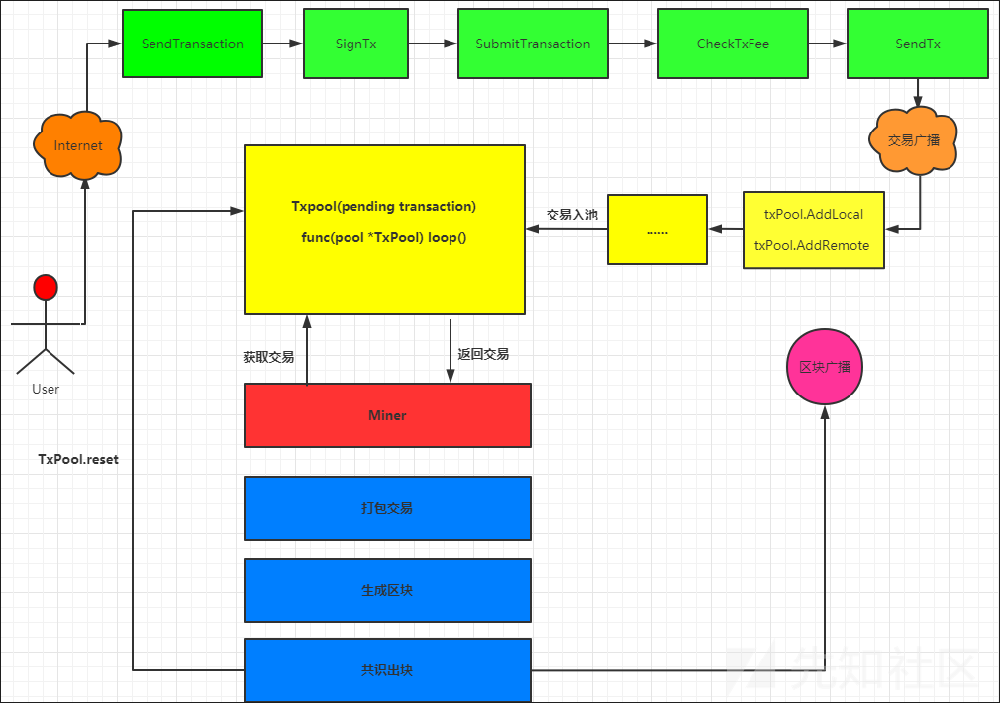

# 区块链交易机制刨析 - 先知社区

区块链交易机制刨析

- - -

## 文章前言

随着区块链技术的不断发展，人们对于它的认识也越来越深刻，而区块链交易机制作为区块链技术的重要组成部分其对于区块链技术的应用和发展具有重要意义，本文将详细介绍区块链交易机制的概念、特点以及其在实际应用中的作用，同时将用以太坊的交易机制为例对区块链交易机制进行刨析，希望能够为读者深入了解区块链技术提供帮助。

## 基本介绍

交易的本质是数据结构，这些数据结构中含有交易参与者价值转移的相关信息，区块链本身是一条全球复式记账总账簿，每个交易都是区块链上的一个公开记录，区块链的每笔交易都需要一定的费用，用于支付交易执行所需要的计算开销，计算开销通常使用Gas作为基本的计价单位，通过GasPrice与其他货币进行换算

## 交易成员

区块链中的交易参与者包括交易发起者、交易接收者、矿工和节点：

-   交易发起者：交易发起者是指发起交易的参与者，通常是需要转移数字资产的一方，交易发起者需要指定交易接收者、交易金额、交易手续费等信息并将交易信息广播到区块链网络中，交易发起者通常需要拥有足够的数字资产或代币来完成交易
-   交易接收者：交易接收者是指接收交易的参与者，通常是需要获得数字资产的一方，交易接收者需要在交易信息中确认自己的身份和接收的数字资产数量并等待交易被打包进区块中，交易接收者可以随时查询自己的数字资产余额以及交易历史记录
-   矿工：矿工是指在区块链网络中负责验证交易和打包交易的参与者。矿工通过解决密码学难题来获得打包交易的权利并获得一定数量的数字资产或代币作为奖励，矿工需要验证交易的有效性和真实性并确保交易没有双重支付的风险，矿工还需要遵守共识机制和网络协议以维护区块链网络的稳定运行和安全
-   节点：节点是指在区块链网络中维护网络运行和安全的参与者。节点可以是全节点或轻节点，全节点需要下载并存储完整的区块链数据，轻节点只需要下载部分区块链数据。节点需要验证交易的有效性和真实性并将交易信息广播到其他节点中以便其他节点进行验证和确认，同时节点还需要遵守共识机制和网络协议以维护区块链网络的稳定运行和安全

## 交易流程

区块链的交易流程包括交易生成、交易广播、交易验证和交易确认

-   交易生成：交易生成是指交易发起者向交易接收者发起交易并将交易信息写入区块链网络中，交易信息包括交易发起者、交易接收者、交易金额、交易手续费和交易时间戳等信息，交易发起者需要在交易信息中指定交易接收者、交易金额和交易手续费等信息，交易发起者使用自己的私钥对交易信息进行签名以便后续进行交易验证和交易确认，签名后的交易信息会被广播到区块链网络中
-   交易广播：交易广播是指交易信息会通过P2P网络广播到其他节点以便其他节点进行交易验证和确认，广播的过程中节点会将交易信息传递给相邻的节点直到交易信息被所有节点接收
    
-   交易验证：交易验证是指节点对交易信息进行验证，包括验证交易的有效性和真实性以及验证交易发起者是否拥有足够的资金进行交易，交易验证通常需要使用公钥对交易信息进行解密并检查交易发起者是否有足够的数字资产来完成交易，同时节点还需要验证交易是否符合共识机制和网络协议的要求
    
-   交易确认：交易确认是指交易信息经过验证后会被矿工打包进区块中并通过共识机制得到确认，一旦区块被加入到区块链中，其中包含的交易就变得不可篡改。交易确认的速度取决于交易的手续费和网络拥堵情况，交易手续费越高，交易确认的速度越快，在网络拥堵的情况下交易确认时间可能会延长

下图展示了区块链交易流程的示意图，其中展示了区块链交易流程的各个步骤，包括交易生成、交易广播、交易验证和交易确认，交易发起者生成交易信息并写入区块链网络中，交易信息会被广播到节点和矿工中进行交易验证和交易确认，节点对交易信息进行验证，矿工负责打包交易信息并进行交易确认，确认后的交易信息会被写入区块链中

```plain
[ 交易发起者 ]  -- 生成交易信息 -->    [ 区块链网络 ]
        |                                       |
        |                                       |
        |                                       |
    广播交易信息                           广播交易信息
        |                                       |
        v                                       v
    [ 节点 ]    -- 验证交易信息  -->        [ 矿工 ]
        |                                       |
        |                                       |
        |                                       |
        v                                       v
    [ 节点 ]   <-- 交易确认消息 --         [ 矿工 ]
```

## 身份验证

区块链中的交易身份验证机制主要通过公钥加密和数字签名来实现

-   公钥加密：公钥加密是指在区块链中使用公钥对交易信息进行加密以确保交易信息的安全性，公钥加密需要使用接收者的公钥对交易信息进行加密只有拥有私钥的接收者才能解密并获取交易信息，公钥加密可以保证在交易过程中交易信息不会被篡改或窃取
-   数字签名：数字签名是指在区块链中使用私钥对交易信息进行签名以确保交易信息的真实性和完整性，数字签名需要使用发起者的私钥对交易信息进行签名，交易接收者可以使用公钥进行验证，只有拥有私钥的发起者才能对交易信息进行签名，确保交易信息不会被篡改或伪造

交易身份验证流程通常包括以下步骤：

-   交易发起者使用私钥对交易信息进行签名并将签名后的交易信息广播到区块链网络中
-   节点使用公钥对交易信息进行解密并验证交易信息的有效性和真实性
-   如果交易信息有效则节点将交易信息广播到相邻节点中以便进行交易验证和确认
-   矿工对交易信息进行验证并将交易信息打包进区块中
-   区块链网络中的其他节点对交易信息进行确认并将区块链数据更新到本地数据库中

以下是区块链交易身份验证机制的示意图，其中交易发起者使用私钥对交易信息进行签名，节点使用公钥对交易信息进行解密和验证，矿工对交易信息进行验证和打包，交易信息最终被写入区块链中，其他节点从区块链中获取交易确认消息和区块链数据

```plain
[ 交易发起者 ]  --   使用私钥对交易信息进行签名    -->      [ 区块链网络 ]
        |                                                           |
        |                                                           |
        |                                                           |
 广播签名后的交易信息                                     广播签名后的交易信息
        |                                                           |
        v                                                           v
    [ 节点 ]    -- 使用公钥对交易信息进行解密和验证  -->         [ 矿工 ]
        |                                                           |
        |                                                           |
        |                                                           |
        v                                                           v
    [ 节点 ]    --      广播交易信息到相邻节点中    -->          [ 节点 ]
        |                                                           |
        |                                                           |
        |                                                           |
        v                                                           v
    [ 矿工 ]    --    验证交易信息并打包进区块中    -->       [ 区块链网络 ]
        |                                                           |
        |                                                           |
        |                                                           |
        v                                                           v
    [ 节点 ]  <--     交易确认消息和区块链数据      --        [ 区块链网络 ]
```

## 交易费用

区块链中的交易费用是指矿工在打包交易时获得的报酬，通常由交易发起者支付，故而交易费用的设置也是由交易发起者自行决定的，交易发起者可以根据自己的需求和情况，自行设定交易费用的金额，交易费用的金额通常和交易的优先级、交易时的网络拥堵情况以及矿工的报酬等因素有关，交易费用的金额越高，交易优先级越高，矿工打包交易的速度也越快。  
在区块链中的交易费用计算方法通常是根据交易数据大小和当前矿工费用等因素来确定，交易数据大小通常是以字节为单位来计算，矿工费用则是由矿工自行设定的，交易费用通常是交易数据大小乘以矿工费用得出的结果，假设Alice想向Bob转账1个比特币，当前网络上的矿工费用为0.0001BTC/字节，假设Alice的交易数据大小为1000字节，则交易费用为：

```plain
交易费用 = 1000字节 * 0.0001 BTC/字节 = 0.1 BTC
```

因此Alice需要支付0.1个比特币的交易费用以确保她的交易能够被矿工打包进区块中，下面是使用Go语言计算交易费用的示例代码：

```plain
package main

import (
    "fmt"
)

func main() {
    // 交易数据大小为1000字节
    txSize := 1000

    // 矿工费用为0.0001 BTC/字节
    minerFee := 0.0001

    // 计算交易费用
    txFee := float64(txSize) * minerFee

    fmt.Printf("交易费用为: %f BTC\n", txFee)
}
```

以上代码中我们定义了交易数据大小和矿工费用，然后通过计算得到交易费用并输出结果，运行以上代码，输出结果为：

```plain
交易费用为: 0.100000 BTC
```

## 以太坊类

### 流程视图

首先我们来看一下交易流程，示意图大致如下所示：  
[](https://xzfile.aliyuncs.com/media/upload/picture/20240121204939-8a18fd60-b85b-1.png)  
简单描述：首先由用户通过网络发起交易请求，并使用自己的私钥对交易进行签名，之后进行将交易添加到交易池中，之后矿工从交易池中获取交易信息并将其进行打包，之后生成区块，进行共识出块，之后向全网广播交易和区块  
数据流向：

-   交易池的数据来源：  
    本地提交，第三方应用通过调用本地以太坊节点的RPC服务提交交易  
    远程同步，通过广播同步的形式，将其他以太坊节点的交易数据同步至本地节点
-   交易池的数据去向：由miner(矿工)获取并验证，用于挖矿，挖矿成功后写进区块被广播，交易被写入规范链后会从交易池中进行删除，如果交易被写进分叉则交易池中的交易不会减少，之后等待重新打包

### 数据结构

首先来看一下TxPoolConfig的配置信息：

```plain
// filedir:go-ethereum-1.10.2\core\tx_pool.go   L139
// TxPoolConfig are the configuration parameters of the transaction pool.
type TxPoolConfig struct {
    Locals    []common.Address //本地账户地址存放
    NoLocals  bool             // 是否开启本地交易机制
    Journal   string           // 本地交易存放路径
    Rejournal time.Duration    // 持久化本地交易的间隔

    PriceLimit uint64 // 价格超出比例，若想覆盖一笔交易的时候，若价格上涨比例达不到要求，那么不能覆盖
    PriceBump  uint64 // 替换现有交易的最低价格涨幅百分比（一次）

    AccountSlots uint64 // 每个账户的可执行交易限制
    GlobalSlots  uint64 // 全部账户最大可执行交易
    AccountQueue uint64 // 单个账户不可执行的交易限制
    GlobalQueue  uint64 // 全部账户最大非执行交易限制

    Lifetime time.Duration // 一个账户在queue中的交易可以存活的时间
}
```

默认配置如下：

```plain
// DefaultTxPoolConfig contains the default configurations for the transaction
// pool.
var DefaultTxPoolConfig = TxPoolConfig{
    Journal:   "transactions.rlp",
    Rejournal: time.Hour,

    PriceLimit: 1,
    PriceBump:  10,

    AccountSlots: 16,
    GlobalSlots:  4096,
    AccountQueue: 64,
    GlobalQueue:  1024,

    Lifetime: 3 * time.Hour,
}
```

TxPool数据结构如下所示：

```plain
// TxPool contains all currently known transactions. Transactions
// enter the pool when they are received from the network or submitted
// locally. They exit the pool when they are included in the blockchain.
//
// The pool separates processable transactions (which can be applied to the
// current state) and future transactions. Transactions move between those
// two states over time as they are received and processed.
type TxPool struct {
    config      TxPoolConfig            // 交易池配置
    chainconfig *params.ChainConfig     // 区块链配置
    chain       blockChain              // blockchain接口
    gasPrice    *big.Int
    txFeed      event.Feed              // 时间流
    scope       event.SubscriptionScope // 订阅范围
    signer      types.Signer            // 签名
    mu          sync.RWMutex            

    istanbul bool // Fork indicator whether we are in the istanbul stage.
    eip2718  bool // Fork indicator whether we are using EIP-2718 type transactions.

    currentState  *state.StateDB // 当前区块头对应的状态
    pendingNonces *txNoncer      // Pending state tracking virtual nonces
    currentMaxGas uint64         // Current gas limit for transaction caps

    locals  *accountSet // Set of local transaction to exempt from eviction rules
    journal *txJournal  // Journal of local transaction to back up to disk

    pending map[common.Address]*txList   //所有当前可处理的transactions
    queue   map[common.Address]*txList   //虽然位于队列中但是不可处理的transaction
    beats   map[common.Address]time.Time // 每个已知帐户的最后心跳
    all     *txLookup                    // 允许查找的所有transactions
    priced  *txPricedList                // 根据price排序transactions

    chainHeadCh     chan ChainHeadEvent
    chainHeadSub    event.Subscription
    reqResetCh      chan *txpoolResetRequest
    reqPromoteCh    chan *accountSet
    queueTxEventCh  chan *types.Transaction
    reorgDoneCh     chan chan struct{}
    reorgShutdownCh chan struct{}  // requests shutdown of scheduleReorgLoop
    wg              sync.WaitGroup // tracks loop, scheduleReorgLoop
}
```

### 基础配置

在分析交易执行我们首先需要来看一些基本的配置，例如：交易手续费是有有最大的上限/下限、交易池配置、交易最大信息检索数量等，在这里我们仅对一些关键的点进行查看：  
No.1——交易手续费

```plain
// filedir:go-ethereum-1.10.2\eth\ethconfig\config.go   L42
// FullNodeGPO contains default gasprice oracle settings for full node.
var FullNodeGPO = gasprice.Config{
    Blocks:     20,
    Percentile: 60,
    MaxPrice:   gasprice.DefaultMaxPrice,
}

// LightClientGPO contains default gasprice oracle settings for light client.
var LightClientGPO = gasprice.Config{
    Blocks:     2,
    Percentile: 60,
    MaxPrice:   gasprice.DefaultMaxPrice,
}
// filedir:go-ethereum-1.10.2\eth\gasprice\gasprice.go  L34
var DefaultMaxPrice = big.NewInt(500 * params.GWei)
```

No.2——交易池配置

```plain
// filedir:go-ethereum-1.10.2\core\tx_pool.go   L160
// DefaultTxPoolConfig contains the default configurations for the transaction
// pool.
var DefaultTxPoolConfig = TxPoolConfig{
    Journal:   "transactions.rlp",
    Rejournal: time.Hour,

    PriceLimit: 1,
    PriceBump:  10,

    AccountSlots: 16,
    GlobalSlots:  4096,
    AccountQueue: 64,
    GlobalQueue:  1024,

    Lifetime: 3 * time.Hour,
}
```

No3.交易检索数量

```plain
TxLookupLimit:           2350000,
```

### 初始化池

交易池的初始化通过NewTxPool来实现，具体代码如下所示：

```plain
// filedir:go-ethereum-1.10.2\core\tx_pool.go   L262
// NewTxPool creates a new transaction pool to gather, sort and filter inbound
// transactions from the network.
func NewTxPool(config TxPoolConfig, chainconfig *params.ChainConfig, chain blockChain) *TxPool {
    // Sanitize the input to ensure no vulnerable gas prices are set
    config = (&config).sanitize()

    // Create the transaction pool with its initial settings
    pool := &TxPool{
        config:          config,
        chainconfig:     chainconfig,
        chain:           chain,
        signer:          types.LatestSigner(chainconfig),
        pending:         make(map[common.Address]*txList),
        queue:           make(map[common.Address]*txList),
        beats:           make(map[common.Address]time.Time),
        all:             newTxLookup(),
        chainHeadCh:     make(chan ChainHeadEvent, chainHeadChanSize),
        reqResetCh:      make(chan *txpoolResetRequest),
        reqPromoteCh:    make(chan *accountSet),
        queueTxEventCh:  make(chan *types.Transaction),
        reorgDoneCh:     make(chan chan struct{}),
        reorgShutdownCh: make(chan struct{}),
        gasPrice:        new(big.Int).SetUint64(config.PriceLimit),
    }
    pool.locals = newAccountSet(pool.signer)
    for _, addr := range config.Locals {
        log.Info("Setting new local account", "address", addr)
        pool.locals.add(addr)
    }
    pool.priced = newTxPricedList(pool.all)
    pool.reset(nil, chain.CurrentBlock().Header())

    // Start the reorg loop early so it can handle requests generated during journal loading.
    pool.wg.Add(1)
    go pool.scheduleReorgLoop()

    // If local transactions and journaling is enabled, load from disk
    if !config.NoLocals && config.Journal != "" {
        pool.journal = newTxJournal(config.Journal)

        if err := pool.journal.load(pool.AddLocals); err != nil {
            log.Warn("Failed to load transaction journal", "err", err)
        }
        if err := pool.journal.rotate(pool.local()); err != nil {
            log.Warn("Failed to rotate transaction journal", "err", err)
        }
    }

    // Subscribe events from blockchain and start the main event loop.
    pool.chainHeadSub = pool.chain.SubscribeChainHeadEvent(pool.chainHeadCh)
    pool.wg.Add(1)
    go pool.loop()

    return pool
}
```

在这里首先调用sanitize函数对配置参数进行校验，以规避设置不合理的gas prices

```plain
// filedir:go-ethereum-1.10.2\core\tx_pool.go   L177
// sanitize checks the provided user configurations and changes anything that's
// unreasonable or unworkable.
func (config *TxPoolConfig) sanitize() TxPoolConfig {
    conf := *config
    if conf.Rejournal < time.Second {
        log.Warn("Sanitizing invalid txpool journal time", "provided", conf.Rejournal, "updated", time.Second)
        conf.Rejournal = time.Second
    }
    if conf.PriceLimit < 1 {
        log.Warn("Sanitizing invalid txpool price limit", "provided", conf.PriceLimit, "updated", DefaultTxPoolConfig.PriceLimit)
        conf.PriceLimit = DefaultTxPoolConfig.PriceLimit
    }
    if conf.PriceBump < 1 {
        log.Warn("Sanitizing invalid txpool price bump", "provided", conf.PriceBump, "updated", DefaultTxPoolConfig.PriceBump)
        conf.PriceBump = DefaultTxPoolConfig.PriceBump
    }
    if conf.AccountSlots < 1 {
        log.Warn("Sanitizing invalid txpool account slots", "provided", conf.AccountSlots, "updated", DefaultTxPoolConfig.AccountSlots)
        conf.AccountSlots = DefaultTxPoolConfig.AccountSlots
    }
    if conf.GlobalSlots < 1 {
        log.Warn("Sanitizing invalid txpool global slots", "provided", conf.GlobalSlots, "updated", DefaultTxPoolConfig.GlobalSlots)
        conf.GlobalSlots = DefaultTxPoolConfig.GlobalSlots
    }
    if conf.AccountQueue < 1 {
        log.Warn("Sanitizing invalid txpool account queue", "provided", conf.AccountQueue, "updated", DefaultTxPoolConfig.AccountQueue)
        conf.AccountQueue = DefaultTxPoolConfig.AccountQueue
    }
    if conf.GlobalQueue < 1 {
        log.Warn("Sanitizing invalid txpool global queue", "provided", conf.GlobalQueue, "updated", DefaultTxPoolConfig.GlobalQueue)
        conf.GlobalQueue = DefaultTxPoolConfig.GlobalQueue
    }
    if conf.Lifetime < 1 {
        log.Warn("Sanitizing invalid txpool lifetime", "provided", conf.Lifetime, "updated", DefaultTxPoolConfig.Lifetime)
        conf.Lifetime = DefaultTxPoolConfig.Lifetime
    }
    return conf
}
```

之后使用默认配置初始化一个交易池(txpool):

```plain
// Create the transaction pool with its initial settings
    pool := &TxPool{
        config:          config,
        chainconfig:     chainconfig,
        chain:           chain,
        signer:          types.LatestSigner(chainconfig),
        pending:         make(map[common.Address]*txList),
        queue:           make(map[common.Address]*txList),
        beats:           make(map[common.Address]time.Time),
        all:             newTxLookup(),
        chainHeadCh:     make(chan ChainHeadEvent, chainHeadChanSize),
        reqResetCh:      make(chan *txpoolResetRequest),
        reqPromoteCh:    make(chan *accountSet),
        queueTxEventCh:  make(chan *types.Transaction),
        reorgDoneCh:     make(chan chan struct{}),
        reorgShutdownCh: make(chan struct{}),
        gasPrice:        new(big.Int).SetUint64(config.PriceLimit),
    }
```

之后初始化本地账户并将配置的本地账户地址加到交易池：

```plain
pool.locals = newAccountSet(pool.signer)
    for _, addr := range config.Locals {
        log.Info("Setting new local account", "address", addr)
        pool.locals.add(addr)
    }
```

之后创建更加gasprices排序的交易：

```plain
pool.priced = newTxPricedList(pool.all)
```

具体实现代码如下所示：

```plain
// filedir:go-ethereum-1.10.2\core\tx_list.go   L450
// newTxPricedList creates a new price-sorted transaction heap.
func newTxPricedList(all *txLookup) *txPricedList {
    return &txPricedList{
        all:     all,
        remotes: new(priceHeap),
    }
}
```

之后调用reset更新交易池：

```plain
pool.reset(nil, chain.CurrentBlock().Header())
```

reset具体实现如下：

```plain
// reset retrieves the current state of the blockchain and ensures the content
// of the transaction pool is valid with regard to the chain state.
func (pool *TxPool) reset(oldHead, newHead *types.Header) {
    // If we're reorging an old state, reinject all dropped transactions
    var reinject types.Transactions

    if oldHead != nil && oldHead.Hash() != newHead.ParentHash {
        // If the reorg is too deep, avoid doing it (will happen during fast sync)
        oldNum := oldHead.Number.Uint64()
        newNum := newHead.Number.Uint64()

        if depth := uint64(math.Abs(float64(oldNum) - float64(newNum))); depth > 64 {
            log.Debug("Skipping deep transaction reorg", "depth", depth)
        } else {
            // Reorg seems shallow enough to pull in all transactions into memory
            var discarded, included types.Transactions
            var (
                rem = pool.chain.GetBlock(oldHead.Hash(), oldHead.Number.Uint64())
                add = pool.chain.GetBlock(newHead.Hash(), newHead.Number.Uint64())
            )
            if rem == nil {
                // This can happen if a setHead is performed, where we simply discard the old
                // head from the chain.
                // If that is the case, we don't have the lost transactions any more, and
                // there's nothing to add
                if newNum >= oldNum {
                    // If we reorged to a same or higher number, then it's not a case of setHead
                    log.Warn("Transaction pool reset with missing oldhead",
                        "old", oldHead.Hash(), "oldnum", oldNum, "new", newHead.Hash(), "newnum", newNum)
                    return
                }
                // If the reorg ended up on a lower number, it's indicative of setHead being the cause
                log.Debug("Skipping transaction reset caused by setHead",
                    "old", oldHead.Hash(), "oldnum", oldNum, "new", newHead.Hash(), "newnum", newNum)
                // We still need to update the current state s.th. the lost transactions can be readded by the user
            } else {
                for rem.NumberU64() > add.NumberU64() {
                    discarded = append(discarded, rem.Transactions()...)
                    if rem = pool.chain.GetBlock(rem.ParentHash(), rem.NumberU64()-1); rem == nil {
                        log.Error("Unrooted old chain seen by tx pool", "block", oldHead.Number, "hash", oldHead.Hash())
                        return
                    }
                }
                for add.NumberU64() > rem.NumberU64() {
                    included = append(included, add.Transactions()...)
                    if add = pool.chain.GetBlock(add.ParentHash(), add.NumberU64()-1); add == nil {
                        log.Error("Unrooted new chain seen by tx pool", "block", newHead.Number, "hash", newHead.Hash())
                        return
                    }
                }
                for rem.Hash() != add.Hash() {
                    discarded = append(discarded, rem.Transactions()...)
                    if rem = pool.chain.GetBlock(rem.ParentHash(), rem.NumberU64()-1); rem == nil {
                        log.Error("Unrooted old chain seen by tx pool", "block", oldHead.Number, "hash", oldHead.Hash())
                        return
                    }
                    included = append(included, add.Transactions()...)
                    if add = pool.chain.GetBlock(add.ParentHash(), add.NumberU64()-1); add == nil {
                        log.Error("Unrooted new chain seen by tx pool", "block", newHead.Number, "hash", newHead.Hash())
                        return
                    }
                }
                reinject = types.TxDifference(discarded, included)
            }
        }
    }
    // Initialize the internal state to the current head
    if newHead == nil {
        newHead = pool.chain.CurrentBlock().Header() // Special case during testing
    }
    statedb, err := pool.chain.StateAt(newHead.Root)
    if err != nil {
        log.Error("Failed to reset txpool state", "err", err)
        return
    }
    pool.currentState = statedb
    pool.pendingNonces = newTxNoncer(statedb)
    pool.currentMaxGas = newHead.GasLimit

    // Inject any transactions discarded due to reorgs
    log.Debug("Reinjecting stale transactions", "count", len(reinject))
    senderCacher.recover(pool.signer, reinject)
    pool.addTxsLocked(reinject, false)

    // Update all fork indicator by next pending block number.
    next := new(big.Int).Add(newHead.Number, big.NewInt(1))
    pool.istanbul = pool.chainconfig.IsIstanbul(next)
    pool.eip2718 = pool.chainconfig.IsBerlin(next)
}
```

之后启动reorg循环，使其能够处理日志加载期间生成的请求：

```plain
pool.wg.Add(1)
    go pool.scheduleReorgLoop()
```

scheduleReorgLoop具体实现如下所示，该函数主要用于安全reset和promoteExecutable的执行计划

```plain
// scheduleReorgLoop schedules runs of reset and promoteExecutables. Code above should not
// call those methods directly, but request them being run using requestReset and
// requestPromoteExecutables instead.
func (pool *TxPool) scheduleReorgLoop() {
    defer pool.wg.Done()

    var (
        curDone       chan struct{} // non-nil while runReorg is active
        nextDone      = make(chan struct{})
        launchNextRun bool
        reset         *txpoolResetRequest
        dirtyAccounts *accountSet
        queuedEvents  = make(map[common.Address]*txSortedMap)
    )
    for {
        // Launch next background reorg if needed
        if curDone == nil && launchNextRun {
            // Run the background reorg and announcements
            go pool.runReorg(nextDone, reset, dirtyAccounts, queuedEvents)

            // Prepare everything for the next round of reorg
            curDone, nextDone = nextDone, make(chan struct{})
            launchNextRun = false

            reset, dirtyAccounts = nil, nil
            queuedEvents = make(map[common.Address]*txSortedMap)
        }

        select {
        case req := <-pool.reqResetCh:
            // Reset request: update head if request is already pending.
            if reset == nil {
                reset = req
            } else {
                reset.newHead = req.newHead
            }
            launchNextRun = true
            pool.reorgDoneCh <- nextDone

        case req := <-pool.reqPromoteCh:
            // Promote request: update address set if request is already pending.
            if dirtyAccounts == nil {
                dirtyAccounts = req
            } else {
                dirtyAccounts.merge(req)
            }
            launchNextRun = true
            pool.reorgDoneCh <- nextDone

        case tx := <-pool.queueTxEventCh:
            // Queue up the event, but don't schedule a reorg. It's up to the caller to
            // request one later if they want the events sent.
            addr, _ := types.Sender(pool.signer, tx)
            if _, ok := queuedEvents[addr]; !ok {
                queuedEvents[addr] = newTxSortedMap()
            }
            queuedEvents[addr].Put(tx)

        case <-curDone:
            curDone = nil

        case <-pool.reorgShutdownCh:
            // Wait for current run to finish.
            if curDone != nil {
                <-curDone
            }
            close(nextDone)
            return
        }
    }
}
```

此时如果本地交易开启那么从本地磁盘加载本地交易

```plain
// If local transactions and journaling is enabled, load from disk
    if !config.NoLocals && config.Journal != "" {
        pool.journal = newTxJournal(config.Journal)

        if err := pool.journal.load(pool.AddLocals); err != nil {
            log.Warn("Failed to load transaction journal", "err", err)
        }
        if err := pool.journal.rotate(pool.local()); err != nil {
            log.Warn("Failed to rotate transaction journal", "err", err)
        }
    }
```

之后订阅相关交易事件并开启主循环：

```plain
// Subscribe events from blockchain and start the main event loop.
    pool.chainHeadSub = pool.chain.SubscribeChainHeadEvent(pool.chainHeadCh)
    pool.wg.Add(1)
    go pool.loop()

    return pool
```

主循环loop具体实现代码如下，它是txPool的一个goroutine，也是主要的事件循环，它主要用于等待和响应外部区块链事件以及各种报告和交易驱逐事件

```plain
// loop is the transaction pool's main event loop, waiting for and reacting to
// outside blockchain events as well as for various reporting and transaction
// eviction events.
func (pool *TxPool) loop() {
    defer pool.wg.Done()

    var (
        prevPending, prevQueued, prevStales int
        // Start the stats reporting and transaction eviction tickers
        report  = time.NewTicker(statsReportInterval)
        evict   = time.NewTicker(evictionInterval)
        journal = time.NewTicker(pool.config.Rejournal)
        // Track the previous head headers for transaction reorgs
        head = pool.chain.CurrentBlock()
    )
    defer report.Stop()
    defer evict.Stop()
    defer journal.Stop()

    for {
        select {
        // Handle ChainHeadEvent
        case ev := <-pool.chainHeadCh:
            if ev.Block != nil {
                pool.requestReset(head.Header(), ev.Block.Header())
                head = ev.Block
            }

        // System shutdown.
        case <-pool.chainHeadSub.Err():
            close(pool.reorgShutdownCh)
            return

        // Handle stats reporting ticks
        case <-report.C:
            pool.mu.RLock()
            pending, queued := pool.stats()
            stales := pool.priced.stales
            pool.mu.RUnlock()

            if pending != prevPending || queued != prevQueued || stales != prevStales {
                log.Debug("Transaction pool status report", "executable", pending, "queued", queued, "stales", stales)
                prevPending, prevQueued, prevStales = pending, queued, stales
            }

        // Handle inactive account transaction eviction
        case <-evict.C:
            pool.mu.Lock()
            for addr := range pool.queue {
                // Skip local transactions from the eviction mechanism
                if pool.locals.contains(addr) {
                    continue
                }
                // Any non-locals old enough should be removed
                if time.Since(pool.beats[addr]) > pool.config.Lifetime {
                    list := pool.queue[addr].Flatten()
                    for _, tx := range list {
                        pool.removeTx(tx.Hash(), true)
                    }
                    queuedEvictionMeter.Mark(int64(len(list)))
                }
            }
            pool.mu.Unlock()

        // Handle local transaction journal rotation
        case <-journal.C:
            if pool.journal != nil {
                pool.mu.Lock()
                if err := pool.journal.rotate(pool.local()); err != nil {
                    log.Warn("Failed to rotate local tx journal", "err", err)
                }
                pool.mu.Unlock()
            }
        }
    }
}
```

### 构建交易

交易有用户发起，使得资产从一方转移至另一方，即所谓的价值转移，我们最直观的交易构建就是通过钱包来进行转账，在这里我们直接以eth\_sendTransaction这一个RPC为例进行分析交易的构建流程，eth\_sendTransaction请求示例如下：

```plain
curl -X POST --data '{"jsonrpc":"2.0","method":"eth_sendTransaction","params":[{see below}],"id":1}'
```

参数示例：

-   from: DATA，20字节 - 发送交易的源地址
-   to: DATA，20字节 - 交易的目标地址，当创建新合约时可选
-   gas: QUANTITY - 交易执行可用gas量，可选整数，默认值90000，未用gas将返还
-   gasPrice: QUANTITY - gas价格，可选，默认值：待定(To-Be-Determined)
-   value: QUANTITY - 交易发送的金额，可选整数
-   data: DATA - 合约的编译带啊或被调用方法的签名及编码参数
-   nonce: QUANTITY - nonce，可选，可以使用同一个nonce来实现挂起的交易的重写

```plain
params: [{
  "from": "0xb60e8dd61c5d32be8058bb8eb970870f07233155",
  "to": "0xd46e8dd67c5d32be8058bb8eb970870f07244567",
  "gas": "0x76c0", // 30400
  "gasPrice": "0x9184e72a000", // 10000000000000
  "value": "0x9184e72a", // 2441406250
  "data": "0xd46e8dd67c5d32be8d46e8dd67c5d32be8058bb8eb970870f072445675058bb8eb970870f072445675"
}]
```

响应示例：

```plain
{
  "id":1,
  "jsonrpc": "2.0",
  "result": "0xe670ec64341771606e55d6b4ca35a1a6b75ee3d5145a99d05921026d1527331"
}
```

下面我们来跟踪一下eth\_sendTransaction这一个RPC的执行过程，在这里首先检索账户是否存在，之后检查Nonce是否为空，紧接着调用SingTx进行签名操作，之后调用SubmitTransaction来提交交易：

```plain
// filedir：go-ethereum-1.10.2\internal\ethapi\api.go L1736
// SendTransaction creates a transaction for the given argument, sign it and submit it to the
// transaction pool.
func (s *PublicTransactionPoolAPI) SendTransaction(ctx context.Context, args SendTxArgs) (common.Hash, error) {
    // Look up the wallet containing the requested signer
    account := accounts.Account{Address: args.From}

    wallet, err := s.b.AccountManager().Find(account)
    if err != nil {
        return common.Hash{}, err
    }

    if args.Nonce == nil {
        // Hold the addresse's mutex around signing to prevent concurrent assignment of
        // the same nonce to multiple accounts.
        s.nonceLock.LockAddr(args.From)
        defer s.nonceLock.UnlockAddr(args.From)
    }

    // Set some sanity defaults and terminate on failure
    if err := args.setDefaults(ctx, s.b); err != nil {
        return common.Hash{}, err
    }
    // Assemble the transaction and sign with the wallet
    tx := args.toTransaction()

    signed, err := wallet.SignTx(account, tx, s.b.ChainConfig().ChainID)
    if err != nil {
        return common.Hash{}, err
    }
    return SubmitTransaction(ctx, s.b, signed)
}
```

SignTx实现代码如下所示，在这里会继续调用SignTx进行签名操作，这里不再深入，后续的"交易签名"会进行纤细分析：

```plain
// filedir:go-ethereum-1.10.2\accounts\usbwallet\wallet.go  L581
// SignTx implements accounts.Wallet. It sends the transaction over to the Ledger
// wallet to request a confirmation from the user. It returns either the signed
// transaction or a failure if the user denied the transaction.
//
// Note, if the version of the Ethereum application running on the Ledger wallet is
// too old to sign EIP-155 transactions, but such is requested nonetheless, an error
// will be returned opposed to silently signing in Homestead mode.
func (w *wallet) SignTx(account accounts.Account, tx *types.Transaction, chainID *big.Int) (*types.Transaction, error) {
    w.stateLock.RLock() // Comms have own mutex, this is for the state fields
    defer w.stateLock.RUnlock()

    // If the wallet is closed, abort
    if w.device == nil {
        return nil, accounts.ErrWalletClosed
    }
    // Make sure the requested account is contained within
    path, ok := w.paths[account.Address]
    if !ok {
        return nil, accounts.ErrUnknownAccount
    }
    // All infos gathered and metadata checks out, request signing
    <-w.commsLock
    defer func() { w.commsLock <- struct{}{} }()

    // Ensure the device isn't screwed with while user confirmation is pending
    // TODO(karalabe): remove if hotplug lands on Windows
    w.hub.commsLock.Lock()
    w.hub.commsPend++
    w.hub.commsLock.Unlock()

    defer func() {
        w.hub.commsLock.Lock()
        w.hub.commsPend--
        w.hub.commsLock.Unlock()
    }()
    // Sign the transaction and verify the sender to avoid hardware fault surprises
    sender, signed, err := w.driver.SignTx(path, tx, chainID)
    if err != nil {
        return nil, err
    }
    if sender != account.Address {
        return nil, fmt.Errorf("signer mismatch: expected %s, got %s", account.Address.Hex(), sender.Hex())
    }
    return signed, nil
}
```

签名之后返回SendTransaction中去调用SubmitTransaction来提交签名，在这里会首先检查交易费用是否足够，之后调用SendTx来发送交易：

```plain
// SubmitTransaction is a helper function that submits tx to txPool and logs a message.
func SubmitTransaction(ctx context.Context, b Backend, tx *types.Transaction) (common.Hash, error) {
    // If the transaction fee cap is already specified, ensure the
    // fee of the given transaction is _reasonable_.
    if err := checkTxFee(tx.GasPrice(), tx.Gas(), b.RPCTxFeeCap()); err != nil {
        return common.Hash{}, err
    }
    if !b.UnprotectedAllowed() && !tx.Protected() {
        // Ensure only eip155 signed transactions are submitted if EIP155Required is set.
        return common.Hash{}, errors.New("only replay-protected (EIP-155) transactions allowed over RPC")
    }
    if err := b.SendTx(ctx, tx); err != nil {
        return common.Hash{}, err
    }
    // Print a log with full tx details for manual investigations and interventions
    signer := types.MakeSigner(b.ChainConfig(), b.CurrentBlock().Number())
    from, err := types.Sender(signer, tx)
    if err != nil {
        return common.Hash{}, err
    }

    if tx.To() == nil {
        addr := crypto.CreateAddress(from, tx.Nonce())
        log.Info("Submitted contract creation", "hash", tx.Hash().Hex(), "from", from, "nonce", tx.Nonce(), "contract", addr.Hex(), "value", tx.Value())
    } else {
        log.Info("Submitted transaction", "hash", tx.Hash().Hex(), "from", from, "nonce", tx.Nonce(), "recipient", tx.To(), "value", tx.Value())
    }
    return tx.Hash(), nil
}
```

SendTx的具体实现如下，在这里会调用AddLocal来添加交易到交易池中去，这里不再深入后续会有"添加交易"这一个分析单元模块：

```plain
func (b *EthAPIBackend) SendTx(ctx context.Context, signedTx *types.Transaction) error {
    return b.eth.txPool.AddLocal(signedTx)
}
```

之后检查接受地址是否为空，如果为空则创建一个地址(一般在合约创建时出现)，之后打印一份完整的TX详细信息的日志便于后续手动调查分析，之后返回交易的hash值：

```plain
if tx.To() == nil {
        addr := crypto.CreateAddress(from, tx.Nonce())
        log.Info("Submitted contract creation", "hash", tx.Hash().Hex(), "from", from, "nonce", tx.Nonce(), "contract", addr.Hex(), "value", tx.Value())
    } else {
        log.Info("Submitted transaction", "hash", tx.Hash().Hex(), "from", from, "nonce", tx.Nonce(), "recipient", tx.To(), "value", tx.Value())
    }
    return tx.Hash(), nil
```

### 交易入池

我们知道交易的来源有两个方面：一个方面是本地提交的，另一个方面是远程提交的，这两个的具体实现代码分别为AddLocals和AddRemotes，这两个函数在添加交易到交易池时都是通过调用addTxs来实现的：

```plain
// filedir:go-ethereum-1.10.2\core\tx_pool.go   L755
// AddLocals enqueues a batch of transactions into the pool if they are valid, marking the
// senders as a local ones, ensuring they go around the local pricing constraints.
//
// This method is used to add transactions from the RPC API and performs synchronous pool
// reorganization and event propagation.
func (pool *TxPool) AddLocals(txs []*types.Transaction) []error {
    return pool.addTxs(txs, !pool.config.NoLocals, true)
}

// AddLocal enqueues a single local transaction into the pool if it is valid. This is
// a convenience wrapper aroundd AddLocals.
func (pool *TxPool) AddLocal(tx *types.Transaction) error {
    errs := pool.AddLocals([]*types.Transaction{tx})
    return errs[0]
}

// AddRemotes enqueues a batch of transactions into the pool if they are valid. If the
// senders are not among the locally tracked ones, full pricing constraints will apply.
//
// This method is used to add transactions from the p2p network and does not wait for pool
// reorganization and internal event propagation.
func (pool *TxPool) AddRemotes(txs []*types.Transaction) []error {
    return pool.addTxs(txs, false, false)
}

// This is like AddRemotes, but waits for pool reorganization. Tests use this method.
func (pool *TxPool) AddRemotesSync(txs []*types.Transaction) []error {
    return pool.addTxs(txs, false, true)
}
```

addTxs代码如下所示：

```plain
// addTxs attempts to queue a batch of transactions if they are valid.
func (pool *TxPool) addTxs(txs []*types.Transaction, local, sync bool) []error {
    // Filter out known ones without obtaining the pool lock or recovering signatures
    var (
        errs = make([]error, len(txs))
        news = make([]*types.Transaction, 0, len(txs))
    )
    for i, tx := range txs {
        // If the transaction is known, pre-set the error slot
        if pool.all.Get(tx.Hash()) != nil {
            errs[i] = ErrAlreadyKnown
            knownTxMeter.Mark(1)
            continue
        }
        // Exclude transactions with invalid signatures as soon as
        // possible and cache senders in transactions before
        // obtaining lock
        _, err := types.Sender(pool.signer, tx)
        if err != nil {
            errs[i] = ErrInvalidSender
            invalidTxMeter.Mark(1)
            continue
        }
        // Accumulate all unknown transactions for deeper processing
        news = append(news, tx)
    }
    if len(news) == 0 {
        return errs
    }

    // Process all the new transaction and merge any errors into the original slice
    pool.mu.Lock()
    newErrs, dirtyAddrs := pool.addTxsLocked(news, local)
    pool.mu.Unlock()

    var nilSlot = 0
    for _, err := range newErrs {
        for errs[nilSlot] != nil {
            nilSlot++
        }
        errs[nilSlot] = err
        nilSlot++
    }
    // Reorg the pool internals if needed and return
    done := pool.requestPromoteExecutables(dirtyAddrs)
    if sync {
        <-done
    }
    return errs
}
```

首先会对交易进行过滤，检查是否是一个已知的交易(即添加过或广播过的)，之后调用send函数校验通过secp256k1椭圆曲线从签名(v,r,s)派生的地址，如果派生失败或签名不正确，则返回错误

```plain
var (
        errs = make([]error, len(txs))
        news = make([]*types.Transaction, 0, len(txs))
    )
    for i, tx := range txs {
        // If the transaction is known, pre-set the error slot
        if pool.all.Get(tx.Hash()) != nil {
            errs[i] = ErrAlreadyKnown
            knownTxMeter.Mark(1)
            continue
        }
        // Exclude transactions with invalid signatures as soon as
        // possible and cache senders in transactions before
        // obtaining lock
        _, err := types.Sender(pool.signer, tx)
        if err != nil {
            errs[i] = ErrInvalidSender
            invalidTxMeter.Mark(1)
            continue
        }
        // Accumulate all unknown transactions for deeper processing
        news = append(news, tx)
    }
    if len(news) == 0 {
        return errs
    }
```

之后将交易添加到交易池中去(有事务锁哦~)

```plain
// Process all the new transaction and merge any errors into the original slice
    pool.mu.Lock()
    newErrs, dirtyAddrs := pool.addTxsLocked(news, local)
    pool.mu.Unlock()
```

addTxsLocked的具体实现如下所示，它会将有效的交易进行排队处理，同时调用pool.add函数将交易添加到交易队列中去：

```plain
// addTxsLocked attempts to queue a batch of transactions if they are valid.
// The transaction pool lock must be held.
func (pool *TxPool) addTxsLocked(txs []*types.Transaction, local bool) ([]error, *accountSet) {
    dirty := newAccountSet(pool.signer)
    errs := make([]error, len(txs))
    for i, tx := range txs {
        replaced, err := pool.add(tx, local)
        errs[i] = err
        if err == nil && !replaced {
            dirty.addTx(tx)
        }
    }
    validTxMeter.Mark(int64(len(dirty.accounts)))
    return errs, dirty
}
```

add函数的具体实现如下所示：

```plain
// add validates a transaction and inserts it into the non-executable queue for later
// pending promotion and execution. If the transaction is a replacement for an already
// pending or queued one, it overwrites the previous transaction if its price is higher.
//
// If a newly added transaction is marked as local, its sending account will be
// whitelisted, preventing any associated transaction from being dropped out of the pool
// due to pricing constraints.
func (pool *TxPool) add(tx *types.Transaction, local bool) (replaced bool, err error) {
    // If the transaction is already known, discard it
    hash := tx.Hash()
    if pool.all.Get(hash) != nil {
        log.Trace("Discarding already known transaction", "hash", hash)
        knownTxMeter.Mark(1)
        return false, ErrAlreadyKnown
    }
    // Make the local flag. If it's from local source or it's from the network but
    // the sender is marked as local previously, treat it as the local transaction.
    isLocal := local || pool.locals.containsTx(tx)

    // If the transaction fails basic validation, discard it
    if err := pool.validateTx(tx, isLocal); err != nil {
        log.Trace("Discarding invalid transaction", "hash", hash, "err", err)
        invalidTxMeter.Mark(1)
        return false, err
    }
    // If the transaction pool is full, discard underpriced transactions
    if uint64(pool.all.Count()+numSlots(tx)) > pool.config.GlobalSlots+pool.config.GlobalQueue {
        // If the new transaction is underpriced, don't accept it
        if !isLocal && pool.priced.Underpriced(tx) {
            log.Trace("Discarding underpriced transaction", "hash", hash, "price", tx.GasPrice())
            underpricedTxMeter.Mark(1)
            return false, ErrUnderpriced
        }
        // New transaction is better than our worse ones, make room for it.
        // If it's a local transaction, forcibly discard all available transactions.
        // Otherwise if we can't make enough room for new one, abort the operation.
        drop, success := pool.priced.Discard(pool.all.Slots()-int(pool.config.GlobalSlots+pool.config.GlobalQueue)+numSlots(tx), isLocal)

        // Special case, we still can't make the room for the new remote one.
        if !isLocal && !success {
            log.Trace("Discarding overflown transaction", "hash", hash)
            overflowedTxMeter.Mark(1)
            return false, ErrTxPoolOverflow
        }
        // Kick out the underpriced remote transactions.
        for _, tx := range drop {
            log.Trace("Discarding freshly underpriced transaction", "hash", tx.Hash(), "price", tx.GasPrice())
            underpricedTxMeter.Mark(1)
            pool.removeTx(tx.Hash(), false)
        }
    }
    // Try to replace an existing transaction in the pending pool
    from, _ := types.Sender(pool.signer, tx) // already validated
    if list := pool.pending[from]; list != nil && list.Overlaps(tx) {
        // Nonce already pending, check if required price bump is met
        inserted, old := list.Add(tx, pool.config.PriceBump)
        if !inserted {
            pendingDiscardMeter.Mark(1)
            return false, ErrReplaceUnderpriced
        }
        // New transaction is better, replace old one
        if old != nil {
            pool.all.Remove(old.Hash())
            pool.priced.Removed(1)
            pendingReplaceMeter.Mark(1)
        }
        pool.all.Add(tx, isLocal)
        pool.priced.Put(tx, isLocal)
        pool.journalTx(from, tx)
        pool.queueTxEvent(tx)
        log.Trace("Pooled new executable transaction", "hash", hash, "from", from, "to", tx.To())

        // Successful promotion, bump the heartbeat
        pool.beats[from] = time.Now()
        return old != nil, nil
    }
    // New transaction isn't replacing a pending one, push into queue
    replaced, err = pool.enqueueTx(hash, tx, isLocal, true)
    if err != nil {
        return false, err
    }
    // Mark local addresses and journal local transactions
    if local && !pool.locals.contains(from) {
        log.Info("Setting new local account", "address", from)
        pool.locals.add(from)
        pool.priced.Removed(pool.all.RemoteToLocals(pool.locals)) // Migrate the remotes if it's marked as local first time.
    }
    if isLocal {
        localGauge.Inc(1)
    }
    pool.journalTx(from, tx)

    log.Trace("Pooled new future transaction", "hash", hash, "from", from, "to", tx.To())
    return replaced, nil
}
```

在这里会首先检查当前的交易是否已经知晓(即被广播过或者添加到池子里过)，如果已知晓则丢弃：

```plain
hash := tx.Hash()
    if pool.all.Get(hash) != nil {
        log.Trace("Discarding already known transaction", "hash", hash)
        knownTxMeter.Mark(1)
        return false, ErrAlreadyKnown
    }
```

之后鉴别交易是本地提交还是远程提交，并调用函数validateTx来验证交易，如果验证不通过则丢弃：

```plain
// Make the local flag. If it's from local source or it's from the network but
    // the sender is marked as local previously, treat it as the local transaction.
    isLocal := local || pool.locals.containsTx(tx)

    // If the transaction fails basic validation, discard it
    if err := pool.validateTx(tx, isLocal); err != nil {
        log.Trace("Discarding invalid transaction", "hash", hash, "err", err)
        invalidTxMeter.Mark(1)
        return false, err
    }
```

之后检查交易池是否满了，如果满了则放弃交易队列中定价过低的交易，GlobalSlots和GlobalQueue为pending和queue的最大容量：

```plain
// If the transaction pool is full, discard underpriced transactions
    if uint64(pool.all.Count()+numSlots(tx)) > pool.config.GlobalSlots+pool.config.GlobalQueue {
        // If the new transaction is underpriced, don't accept it
        if !isLocal && pool.priced.Underpriced(tx) {
            log.Trace("Discarding underpriced transaction", "hash", hash, "price", tx.GasPrice())
            underpricedTxMeter.Mark(1)
            return false, ErrUnderpriced
        }
        // New transaction is better than our worse ones, make room for it.
        // If it's a local transaction, forcibly discard all available transactions.
        // Otherwise if we can't make enough room for new one, abort the operation.
        drop, success := pool.priced.Discard(pool.all.Slots()-int(pool.config.GlobalSlots+pool.config.GlobalQueue)+numSlots(tx), isLocal)

        // Special case, we still can't make the room for the new remote one.
        if !isLocal && !success {
            log.Trace("Discarding overflown transaction", "hash", hash)
            overflowedTxMeter.Mark(1)
            return false, ErrTxPoolOverflow
        }
        // Kick out the underpriced remote transactions.
        for _, tx := range drop {
            log.Trace("Discarding freshly underpriced transaction", "hash", tx.Hash(), "price", tx.GasPrice())
            underpricedTxMeter.Mark(1)
            pool.removeTx(tx.Hash(), false)
        }
    }
```

之后判断当前交易在pending队列中是否存在nonce值相同的交易，如果存在则判断当前交易所设置的gasprice是否超过设置的PriceBump百分比，超过则替换覆盖已存在的交易，否则报错返回替换交易Gasprice过低，并且把它扔到queue队列中(enqueueTx):

```plain
// Try to replace an existing transaction in the pending pool
    from, _ := types.Sender(pool.signer, tx) // already validated
    if list := pool.pending[from]; list != nil && list.Overlaps(tx) {
        // Nonce already pending, check if required price bump is met
        inserted, old := list.Add(tx, pool.config.PriceBump)
        if !inserted {
            pendingDiscardMeter.Mark(1)
            return false, ErrReplaceUnderpriced
        }
        // New transaction is better, replace old one
        if old != nil {
            pool.all.Remove(old.Hash())
            pool.priced.Removed(1)
            pendingReplaceMeter.Mark(1)
        }
        pool.all.Add(tx, isLocal)
        pool.priced.Put(tx, isLocal)
        pool.journalTx(from, tx)
        pool.queueTxEvent(tx)
        log.Trace("Pooled new executable transaction", "hash", hash, "from", from, "to", tx.To())

        // Successful promotion, bump the heartbeat
        pool.beats[from] = time.Now()
        return old != nil, nil
    }
```

之后调用enqueueTx将添加到交易队列中去，同时检查from账户是否为本地地址，如果是则添加到交易池本地地址中去：

```plain
// New transaction isn't replacing a pending one, push into queue
    replaced, err = pool.enqueueTx(hash, tx, isLocal, true)
    if err != nil {
        return false, err
    }
    // Mark local addresses and journal local transactions
    if local && !pool.locals.contains(from) {
        log.Info("Setting new local account", "address", from)
        pool.locals.add(from)
        pool.priced.Removed(pool.all.RemoteToLocals(pool.locals)) // Migrate the remotes if it's marked as local first time.
    }
    if isLocal {
        localGauge.Inc(1)
    }
    pool.journalTx(from, tx)

    log.Trace("Pooled new future transaction", "hash", hash, "from", from, "to", tx.To())
    return replaced, nil
```

enqueueTx代码如下所示，该函数主要将新的交易插入到交易队列中去：

```plain
// enqueueTx inserts a new transaction into the non-executable transaction queue.
//
// Note, this method assumes the pool lock is held!
func (pool *TxPool) enqueueTx(hash common.Hash, tx *types.Transaction, local bool, addAll bool) (bool, error) {
    // Try to insert the transaction into the future queue
    from, _ := types.Sender(pool.signer, tx) // already validated
    if pool.queue[from] == nil {
        pool.queue[from] = newTxList(false)
    }
    inserted, old := pool.queue[from].Add(tx, pool.config.PriceBump)
    if !inserted {
        // An older transaction was better, discard this
        queuedDiscardMeter.Mark(1)
        return false, ErrReplaceUnderpriced
    }
    // Discard any previous transaction and mark this
    if old != nil {
        pool.all.Remove(old.Hash())
        pool.priced.Removed(1)
        queuedReplaceMeter.Mark(1)
    } else {
        // Nothing was replaced, bump the queued counter
        queuedGauge.Inc(1)
    }
    // If the transaction isn't in lookup set but it's expected to be there,
    // show the error log.
    if pool.all.Get(hash) == nil && !addAll {
        log.Error("Missing transaction in lookup set, please report the issue", "hash", hash)
    }
    if addAll {
        pool.all.Add(tx, local)
        pool.priced.Put(tx, local)
    }
    // If we never record the heartbeat, do it right now.
    if _, exist := pool.beats[from]; !exist {
        pool.beats[from] = time.Now()
    }
    return old != nil, nil
}
```

最后会到addTx函数中在这里会调用requestPromoteExecutables函数进行一次交易提升请求操作，它主要将交易从queue投放到pending中去

```plain
// Reorg the pool internals if needed and return
    done := pool.requestPromoteExecutables(dirtyAddrs)
    if sync {
        <-done
    }
```

### 交易签名

交易签名主要通过函数SignTx来实现，首先检查钱包是否关闭，之后检查钱包账户中是否包含发情交易请求的账户，之后调用SignTx进行签名处理：

```plain
// filedir:go-ethereum-1.10.2\accounts\usbwallet\wallet.go  L582
// SignTx implements accounts.Wallet. It sends the transaction over to the Ledger
// wallet to request a confirmation from the user. It returns either the signed
// transaction or a failure if the user denied the transaction.
//
// Note, if the version of the Ethereum application running on the Ledger wallet is
// too old to sign EIP-155 transactions, but such is requested nonetheless, an error
// will be returned opposed to silently signing in Homestead mode.
func (w *wallet) SignTx(account accounts.Account, tx *types.Transaction, chainID *big.Int) (*types.Transaction, error) {
    w.stateLock.RLock() // Comms have own mutex, this is for the state fields
    defer w.stateLock.RUnlock()

    // If the wallet is closed, abort
    if w.device == nil {
        return nil, accounts.ErrWalletClosed
    }
    // Make sure the requested account is contained within
    path, ok := w.paths[account.Address]
    if !ok {
        return nil, accounts.ErrUnknownAccount
    }
    // All infos gathered and metadata checks out, request signing
    <-w.commsLock
    defer func() { w.commsLock <- struct{}{} }()

    // Ensure the device isn't screwed with while user confirmation is pending
    // TODO(karalabe): remove if hotplug lands on Windows
    w.hub.commsLock.Lock()
    w.hub.commsPend++
    w.hub.commsLock.Unlock()

    defer func() {
        w.hub.commsLock.Lock()
        w.hub.commsPend--
        w.hub.commsLock.Unlock()
    }()
    // Sign the transaction and verify the sender to avoid hardware fault surprises
    sender, signed, err := w.driver.SignTx(path, tx, chainID)
    if err != nil {
        return nil, err
    }
    if sender != account.Address {
        return nil, fmt.Errorf("signer mismatch: expected %s, got %s", account.Address.Hex(), sender.Hex())
    }
    return signed, nil
}
```

SignTx的具体实现代码如下所示：

```plain
// SignTx implements accounts.Wallet, attempting to sign the given transaction
// with the given account. If the wallet does not wrap this particular account,
// an error is returned to avoid account leakage (even though in theory we may
// be able to sign via our shared keystore backend).
func (w *keystoreWallet) SignTx(account accounts.Account, tx *types.Transaction, chainID *big.Int) (*types.Transaction, error) {
    // Make sure the requested account is contained within
    if !w.Contains(account) {
        return nil, accounts.ErrUnknownAccount
    }
    // Account seems valid, request the keystore to sign
    return w.keystore.SignTx(account, tx, chainID)
}
```

校验过账户的有效性后我们可以通过SignTx来使用keystore进行签名处理，在这里紧接着调用LatestSignerForChainID进行签名：

```plain
// SignTx signs the given transaction with the requested account.
func (ks *KeyStore) SignTx(a accounts.Account, tx *types.Transaction, chainID *big.Int) (*types.Transaction, error) {
    // Look up the key to sign with and abort if it cannot be found
    ks.mu.RLock()
    defer ks.mu.RUnlock()

    unlockedKey, found := ks.unlocked[a.Address]
    if !found {
        return nil, ErrLocked
    }
    // Depending on the presence of the chain ID, sign with 2718 or homestead
    signer := types.LatestSignerForChainID(chainID)
    return types.SignTx(tx, signer, unlockedKey.PrivateKey)
}
```

之后再SignTx函数中使用私钥进行签名：

```plain
// SignTx signs the transaction using the given signer and private key.
func SignTx(tx *Transaction, s Signer, prv *ecdsa.PrivateKey) (*Transaction, error) {
    h := s.Hash(tx)
    sig, err := crypto.Sign(h[:], prv)
    if err != nil {
        return nil, err
    }
    return tx.WithSignature(s, sig)
}
```

在sign中使用ECDSA(椭圆曲线加密算法)进行签名，之后返回签名的结果：

```plain
// Sign calculates an ECDSA signature.
//
// This function is susceptible to chosen plaintext attacks that can leak
// information about the private key that is used for signing. Callers must
// be aware that the given digest cannot be chosen by an adversery. Common
// solution is to hash any input before calculating the signature.
//
// The produced signature is in the [R || S || V] format where V is 0 or 1.
func Sign(digestHash []byte, prv *ecdsa.PrivateKey) (sig []byte, err error) {
    if len(digestHash) != DigestLength {
        return nil, fmt.Errorf("hash is required to be exactly %d bytes (%d)", DigestLength, len(digestHash))
    }
    seckey := math.PaddedBigBytes(prv.D, prv.Params().BitSize/8)
    defer zeroBytes(seckey)
    return secp256k1.Sign(digestHash, seckey)
}
```

### 交易验证

交易验证时整个交易环节最重要的一环，对于用户来说，交易验证时保证用户财产安全的重要手段，而对于整个以太坊来说，交易验证时保证以太坊稳定运行和持续发展的重要方式，交易验证主要出现在以下几个场景中：

-   用户完成一笔交易的签名时，需要将交易提交到区块链网络中，是交易能够尽快确认，节点在提交交易之前需要先验证交易，确认交易的合法性
-   节点收到其他节点广播的交易时，节点需要先验证交易是否合法，合法的交易才会加入节点的交易池
-   当一个挖矿节点成功计算出符合要求的哈希值后，节点会将交易池中的交易打包到区块中，接地那在打包交易的时候需要验证交易的合法性
-   节点收到其他节点同步到的区块是，也需要验证区块中包含的交易

交易验证由validateTx函数来完成，其逻辑代码如下所示，在这里会检查eip2718是否开启以及交易的类型，之后检查交易的size、交易转账的额度、交易的gas、交易签名的正确性、确保交易遵循Nonce顺序、交易人资产是否足够、确保交易的gas price币基本的交易费用要高：

```plain
// validateTx checks whether a transaction is valid according to the consensus
// rules and adheres to some heuristic limits of the local node (price and size).
func (pool *TxPool) validateTx(tx *types.Transaction, local bool) error {
    // Accept only legacy transactions until EIP-2718/2930 activates.
    if !pool.eip2718 && tx.Type() != types.LegacyTxType {
        return ErrTxTypeNotSupported
    }
    // Reject transactions over defined size to prevent DOS attacks
    if uint64(tx.Size()) > txMaxSize {
        return ErrOversizedData
    }
    // Transactions can't be negative. This may never happen using RLP decoded
    // transactions but may occur if you create a transaction using the RPC.
    if tx.Value().Sign() < 0 {
        return ErrNegativeValue
    }
    // Ensure the transaction doesn't exceed the current block limit gas.
    if pool.currentMaxGas < tx.Gas() {
        return ErrGasLimit
    }
    // Make sure the transaction is signed properly.
    from, err := types.Sender(pool.signer, tx)
    if err != nil {
        return ErrInvalidSender
    }
    // Drop non-local transactions under our own minimal accepted gas price
    if !local && tx.GasPriceIntCmp(pool.gasPrice) < 0 {
        return ErrUnderpriced
    }
    // Ensure the transaction adheres to nonce ordering
    if pool.currentState.GetNonce(from) > tx.Nonce() {
        return ErrNonceTooLow
    }
    // Transactor should have enough funds to cover the costs
    // cost == V + GP * GL
    if pool.currentState.GetBalance(from).Cmp(tx.Cost()) < 0 {
        return ErrInsufficientFunds
    }
    // Ensure the transaction has more gas than the basic tx fee.
    intrGas, err := IntrinsicGas(tx.Data(), tx.AccessList(), tx.To() == nil, true, pool.istanbul)
    if err != nil {
        return err
    }
    if tx.Gas() < intrGas {
        return ErrIntrinsicGas
    }
    return nil
}
```

### 池子重置

我们可以通过reset来重置交易池，该方法具体代码如下所示：

```plain
// filedir:go-ethereum-1.10.2\core\tx_pool.go   L1120
// reset retrieves the current state of the blockchain and ensures the content
// of the transaction pool is valid with regard to the chain state.
func (pool *TxPool) reset(oldHead, newHead *types.Header) {
    // If we're reorging an old state, reinject all dropped transactions
    var reinject types.Transactions

    if oldHead != nil && oldHead.Hash() != newHead.ParentHash {
        // If the reorg is too deep, avoid doing it (will happen during fast sync)
        oldNum := oldHead.Number.Uint64()
        newNum := newHead.Number.Uint64()

        if depth := uint64(math.Abs(float64(oldNum) - float64(newNum))); depth > 64 {
            log.Debug("Skipping deep transaction reorg", "depth", depth)
        } else {
            // Reorg seems shallow enough to pull in all transactions into memory
            var discarded, included types.Transactions
            var (
                rem = pool.chain.GetBlock(oldHead.Hash(), oldHead.Number.Uint64())
                add = pool.chain.GetBlock(newHead.Hash(), newHead.Number.Uint64())
            )
            if rem == nil {
                // This can happen if a setHead is performed, where we simply discard the old
                // head from the chain.
                // If that is the case, we don't have the lost transactions any more, and
                // there's nothing to add
                if newNum >= oldNum {
                    // If we reorged to a same or higher number, then it's not a case of setHead
                    log.Warn("Transaction pool reset with missing oldhead",
                        "old", oldHead.Hash(), "oldnum", oldNum, "new", newHead.Hash(), "newnum", newNum)
                    return
                }
                // If the reorg ended up on a lower number, it's indicative of setHead being the cause
                log.Debug("Skipping transaction reset caused by setHead",
                    "old", oldHead.Hash(), "oldnum", oldNum, "new", newHead.Hash(), "newnum", newNum)
                // We still need to update the current state s.th. the lost transactions can be readded by the user
            } else {
                for rem.NumberU64() > add.NumberU64() {
                    discarded = append(discarded, rem.Transactions()...)
                    if rem = pool.chain.GetBlock(rem.ParentHash(), rem.NumberU64()-1); rem == nil {
                        log.Error("Unrooted old chain seen by tx pool", "block", oldHead.Number, "hash", oldHead.Hash())
                        return
                    }
                }
                for add.NumberU64() > rem.NumberU64() {
                    included = append(included, add.Transactions()...)
                    if add = pool.chain.GetBlock(add.ParentHash(), add.NumberU64()-1); add == nil {
                        log.Error("Unrooted new chain seen by tx pool", "block", newHead.Number, "hash", newHead.Hash())
                        return
                    }
                }
                for rem.Hash() != add.Hash() {
                    discarded = append(discarded, rem.Transactions()...)
                    if rem = pool.chain.GetBlock(rem.ParentHash(), rem.NumberU64()-1); rem == nil {
                        log.Error("Unrooted old chain seen by tx pool", "block", oldHead.Number, "hash", oldHead.Hash())
                        return
                    }
                    included = append(included, add.Transactions()...)
                    if add = pool.chain.GetBlock(add.ParentHash(), add.NumberU64()-1); add == nil {
                        log.Error("Unrooted new chain seen by tx pool", "block", newHead.Number, "hash", newHead.Hash())
                        return
                    }
                }
                reinject = types.TxDifference(discarded, included)
            }
        }
    }
    // Initialize the internal state to the current head
    if newHead == nil {
        newHead = pool.chain.CurrentBlock().Header() // Special case during testing
    }
    statedb, err := pool.chain.StateAt(newHead.Root)
    if err != nil {
        log.Error("Failed to reset txpool state", "err", err)
        return
    }
    pool.currentState = statedb
    pool.pendingNonces = newTxNoncer(statedb)
    pool.currentMaxGas = newHead.GasLimit

    // Inject any transactions discarded due to reorgs
    log.Debug("Reinjecting stale transactions", "count", len(reinject))
    senderCacher.recover(pool.signer, reinject)
    pool.addTxsLocked(reinject, false)

    // Update all fork indicator by next pending block number.
    next := new(big.Int).Add(newHead.Number, big.NewInt(1))
    pool.istanbul = pool.chainconfig.IsIstanbul(next)
    pool.eip2718 = pool.chainconfig.IsBerlin(next)
}
```

如果老区块不为空且老区块不是新区块的父区块是检查老区块和新区块之间的差值是否大于64，如果超过64则不进行重组，否则获取旧头和新头的最新区块，如果旧头为null则检查心头的高度是否小于旧头的高度，则打印日志并直接return，如果不满足则继续向下执行；如果旧头不为null则开始进行重组，此时如果旧链的头区块大于新链的头区块高度时则旧链先后回退并回收所有回退的交易，如果新链的头区块大于旧链的头区块则新链后退并回收交易，当新链和旧链的到达同一高度时则同时回退直到找到共同的父节点，之后找出所有存储在discard里面但是不在included里面的值，之后将这些交易重新插入到pool里面：

```plain
// If we're reorging an old state, reinject all dropped transactions
    var reinject types.Transactions

    if oldHead != nil && oldHead.Hash() != newHead.ParentHash {
        // If the reorg is too deep, avoid doing it (will happen during fast sync)
        oldNum := oldHead.Number.Uint64()
        newNum := newHead.Number.Uint64()

        if depth := uint64(math.Abs(float64(oldNum) - float64(newNum))); depth > 64 {
            log.Debug("Skipping deep transaction reorg", "depth", depth)
        } else {
            // Reorg seems shallow enough to pull in all transactions into memory
            var discarded, included types.Transactions
            var (
                rem = pool.chain.GetBlock(oldHead.Hash(), oldHead.Number.Uint64())
                add = pool.chain.GetBlock(newHead.Hash(), newHead.Number.Uint64())
            )
            if rem == nil {
                // This can happen if a setHead is performed, where we simply discard the old
                // head from the chain.
                // If that is the case, we don't have the lost transactions any more, and
                // there's nothing to add
                if newNum >= oldNum {
                    // If we reorged to a same or higher number, then it's not a case of setHead
                    log.Warn("Transaction pool reset with missing oldhead",
                        "old", oldHead.Hash(), "oldnum", oldNum, "new", newHead.Hash(), "newnum", newNum)
                    return
                }
                // If the reorg ended up on a lower number, it's indicative of setHead being the cause
                log.Debug("Skipping transaction reset caused by setHead",
                    "old", oldHead.Hash(), "oldnum", oldNum, "new", newHead.Hash(), "newnum", newNum)
                // We still need to update the current state s.th. the lost transactions can be readded by the user
            } else {
                for rem.NumberU64() > add.NumberU64() {
                    discarded = append(discarded, rem.Transactions()...)
                    if rem = pool.chain.GetBlock(rem.ParentHash(), rem.NumberU64()-1); rem == nil {
                        log.Error("Unrooted old chain seen by tx pool", "block", oldHead.Number, "hash", oldHead.Hash())
                        return
                    }
                }
                for add.NumberU64() > rem.NumberU64() {
                    included = append(included, add.Transactions()...)
                    if add = pool.chain.GetBlock(add.ParentHash(), add.NumberU64()-1); add == nil {
                        log.Error("Unrooted new chain seen by tx pool", "block", newHead.Number, "hash", newHead.Hash())
                        return
                    }
                }
                for rem.Hash() != add.Hash() {
                    discarded = append(discarded, rem.Transactions()...)
                    if rem = pool.chain.GetBlock(rem.ParentHash(), rem.NumberU64()-1); rem == nil {
                        log.Error("Unrooted old chain seen by tx pool", "block", oldHead.Number, "hash", oldHead.Hash())
                        return
                    }
                    included = append(included, add.Transactions()...)
                    if add = pool.chain.GetBlock(add.ParentHash(), add.NumberU64()-1); add == nil {
                        log.Error("Unrooted new chain seen by tx pool", "block", newHead.Number, "hash", newHead.Hash())
                        return
                    }
                }
                reinject = types.TxDifference(discarded, included)
            }
        }
    }
```

之后设置最新的世界状态、设置新链头区块的状态，然后把旧链回退的交易放入交易池：

```plain
// Initialize the internal state to the current head
    if newHead == nil {
        newHead = pool.chain.CurrentBlock().Header() // Special case during testing
    }
    statedb, err := pool.chain.StateAt(newHead.Root)
    if err != nil {
        log.Error("Failed to reset txpool state", "err", err)
        return
    }
    pool.currentState = statedb
    pool.pendingNonces = newTxNoncer(statedb)
    pool.currentMaxGas = newHead.GasLimit

    // Inject any transactions discarded due to reorgs
    log.Debug("Reinjecting stale transactions", "count", len(reinject))
    senderCacher.recover(pool.signer, reinject)
    pool.addTxsLocked(reinject, false)

    // Update all fork indicator by next pending block number.
    next := new(big.Int).Add(newHead.Number, big.NewInt(1))
    pool.istanbul = pool.chainconfig.IsIstanbul(next)
    pool.eip2718 = pool.chainconfig.IsBerlin(next)
```

## 文末小结

区块链交易机制是一种去中心化、透明且安全的交易方式，通过共识算法确保交易的有效性和网络的一致性，尽管交易确认时间可能较长，区块链技术的应用为各行业带来了新的可能性，但在实际应用中仍需解决可扩展性和能源效率等挑战，随着不断的创新和改进，区块链交易机制有望进一步改善并为未来的数字经济提供可靠的基础设施

## 参考连接

[https://www.jianshu.com/p/3c42e91f8aef](https://www.jianshu.com/p/3c42e91f8aef)  
[https://blog.csdn.net/lj900911/article/details/84825739](https://blog.csdn.net/lj900911/article/details/84825739)  
[https://blog.csdn.net/pulong0748/article/details/109103562](https://blog.csdn.net/pulong0748/article/details/109103562)
