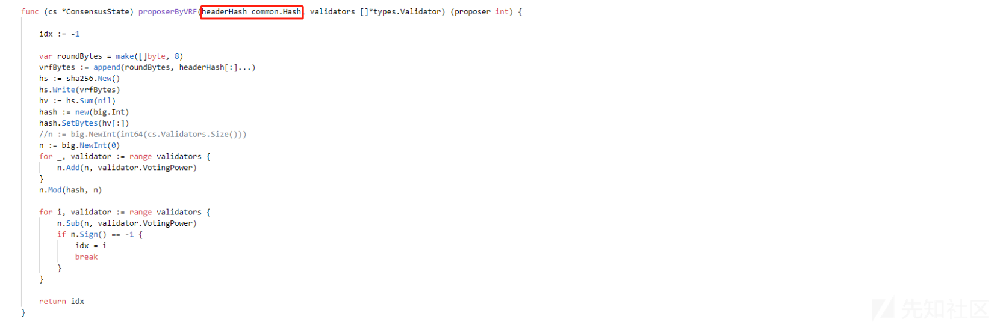

# 区块链共识机制深入刨析(下) - 先知社区

区块链共识机制深入刨析(下)

- - -

## 文章前言

本篇文章主要围绕上篇文章《区块链共识机制深入刨析》中的共识机制内容继续进行分析介绍，上篇我们对ethash下的共识算法进行了介绍，下面我们对clique共识算法进行刨析，同时将介绍几个关于区块链共识算法的共识安全漏洞

## 源码分析

clique目录结构如下所示：

```plain
├─clique
│      api.go               // RPC方法
│      clique.go            // 共识设计
│      snapshot.go          // 快照处理
```

### 基本常量

```plain
const (
    checkpointInterval = 1024 // Number of blocks after which to save the vote snapshot to the database
    inmemorySnapshots  = 128  // Number of recent vote snapshots to keep in memory
    inmemorySignatures = 4096 // Number of recent block signatures to keep in memory

    wiggleTime = 500 * time.Millisecond // Random delay (per signer) to allow concurrent signers
)

const (
    checkpointInterval = 1024 // Number of blocks after which to save the vote snapshot to the database
    inmemorySnapshots  = 128  // Number of recent vote snapshots to keep in memory
    inmemorySignatures = 4096 // Number of recent block signatures to keep in memory

    wiggleTime = 500 * time.Millisecond // Random delay (per signer) to allow concurrent signers
)

// Clique proof-of-authority protocol constants.
var (
    epochLength = uint64(30000) // Default number of blocks after which to checkpoint and reset the pending votes

    extraVanity = 32                     // Fixed number of extra-data prefix bytes reserved for signer vanity
    extraSeal   = crypto.SignatureLength // Fixed number of extra-data suffix bytes reserved for signer seal

    nonceAuthVote = hexutil.MustDecode("0xffffffffffffffff") // Magic nonce number to vote on adding a new signer
    nonceDropVote = hexutil.MustDecode("0x0000000000000000") // Magic nonce number to vote on removing a signer.

    uncleHash = types.CalcUncleHash(nil) // Always Keccak256(RLP([])) as uncles are meaningless outside of PoW.

    diffInTurn = big.NewInt(2) // Block difficulty for in-turn signatures
    diffNoTurn = big.NewInt(1) // Block difficulty for out-of-turn signatures
)
```

错误类型：

```plain
// Various error messages to mark blocks invalid. These should be private to
// prevent engine specific errors from being referenced in the remainder of the
// codebase, inherently breaking if the engine is swapped out. Please put common
// error types into the consensus package.
var (
    // errUnknownBlock is returned when the list of signers is requested for a block
    // that is not part of the local blockchain.
    errUnknownBlock = errors.New("unknown block")

    // errInvalidCheckpointBeneficiary is returned if a checkpoint/epoch transition
    // block has a beneficiary set to non-zeroes.
    errInvalidCheckpointBeneficiary = errors.New("beneficiary in checkpoint block non-zero")

    // errInvalidVote is returned if a nonce value is something else that the two
    // allowed constants of 0x00..0 or 0xff..f.
    errInvalidVote = errors.New("vote nonce not 0x00..0 or 0xff..f")

    // errInvalidCheckpointVote is returned if a checkpoint/epoch transition block
    // has a vote nonce set to non-zeroes.
    errInvalidCheckpointVote = errors.New("vote nonce in checkpoint block non-zero")

    // errMissingVanity is returned if a block's extra-data section is shorter than
    // 32 bytes, which is required to store the signer vanity.
    errMissingVanity = errors.New("extra-data 32 byte vanity prefix missing")

    // errMissingSignature is returned if a block's extra-data section doesn't seem
    // to contain a 65 byte secp256k1 signature.
    errMissingSignature = errors.New("extra-data 65 byte signature suffix missing")

    // errExtraSigners is returned if non-checkpoint block contain signer data in
    // their extra-data fields.
    errExtraSigners = errors.New("non-checkpoint block contains extra signer list")

    // errInvalidCheckpointSigners is returned if a checkpoint block contains an
    // invalid list of signers (i.e. non divisible by 20 bytes).
    errInvalidCheckpointSigners = errors.New("invalid signer list on checkpoint block")

    // errMismatchingCheckpointSigners is returned if a checkpoint block contains a
    // list of signers different than the one the local node calculated.
    errMismatchingCheckpointSigners = errors.New("mismatching signer list on checkpoint block")

    // errInvalidMixDigest is returned if a block's mix digest is non-zero.
    errInvalidMixDigest = errors.New("non-zero mix digest")

    // errInvalidUncleHash is returned if a block contains an non-empty uncle list.
    errInvalidUncleHash = errors.New("non empty uncle hash")

    // errInvalidDifficulty is returned if the difficulty of a block neither 1 or 2.
    errInvalidDifficulty = errors.New("invalid difficulty")

    // errWrongDifficulty is returned if the difficulty of a block doesn't match the
    // turn of the signer.
    errWrongDifficulty = errors.New("wrong difficulty")

    // errInvalidTimestamp is returned if the timestamp of a block is lower than
    // the previous block's timestamp + the minimum block period.
    errInvalidTimestamp = errors.New("invalid timestamp")

    // errInvalidVotingChain is returned if an authorization list is attempted to
    // be modified via out-of-range or non-contiguous headers.
    errInvalidVotingChain = errors.New("invalid voting chain")

    // errUnauthorizedSigner is returned if a header is signed by a non-authorized entity.
    errUnauthorizedSigner = errors.New("unauthorized signer")

    // errRecentlySigned is returned if a header is signed by an authorized entity
    // that already signed a header recently, thus is temporarily not allowed to.
    errRecentlySigned = errors.New("recently signed")
)
```

### 地址提取

ecrecover函数用于从签名头中提取以太坊账户地址信息：

```plain
// ecrecover extracts the Ethereum account address from a signed header.
func ecrecover(header *types.Header, sigcache *lru.ARCCache) (common.Address, error) {
    // If the signature's already cached, return that
    hash := header.Hash()
    if address, known := sigcache.Get(hash); known {
        return address.(common.Address), nil
    }
    // Retrieve the signature from the header extra-data
    if len(header.Extra) < extraSeal {
        return common.Address{}, errMissingSignature
    }
    signature := header.Extra[len(header.Extra)-extraSeal:]

    // Recover the public key and the Ethereum address
    pubkey, err := crypto.Ecrecover(SealHash(header).Bytes(), signature)
    if err != nil {
        return common.Address{}, err
    }
    var signer common.Address
    copy(signer[:], crypto.Keccak256(pubkey[1:])[12:])

    sigcache.Add(hash, signer)
    return signer, nil
}
```

### 构造引擎

new用于初始化一个共识引擎对象：

```plain
// New creates a Clique proof-of-authority consensus engine with the initial
// signers set to the ones provided by the user.
func New(config *params.CliqueConfig, db ethdb.Database) *Clique {
    // Set any missing consensus parameters to their defaults
    conf := *config
    if conf.Epoch == 0 {
        conf.Epoch = epochLength
    }
    // Allocate the snapshot caches and create the engine
    recents, _ := lru.NewARC(inmemorySnapshots)
    signatures, _ := lru.NewARC(inmemorySignatures)

    return &Clique{
        config:     &conf,
        db:         db,
        recents:    recents,
        signatures: signatures,
        proposals:  make(map[common.Address]bool),
    }
}
```

### 矿工地址

Author函数通过调用ecrecover函数来检索区块奖励地址，也就是coinbase：

```plain
// Author implements consensus.Engine, returning the Ethereum address recovered
// from the signature in the header's extra-data section.
func (c *Clique) Author(header *types.Header) (common.Address, error) {
    return ecrecover(header, c.signatures)
}
```

### 验区块头

VerifyHeader函数用于验证区块头：

```plain
// VerifyHeader checks whether a header conforms to the consensus rules.
func (c *Clique) VerifyHeader(chain consensus.ChainHeaderReader, header *types.Header, seal bool) error {
    return c.verifyHeader(chain, header, nil)
}
```

从上述代码中可以看到这里又调用了重载的VerifyHeaders函数，该函数用于批量验证区块头信息：

```plain
// VerifyHeaders is similar to VerifyHeader, but verifies a batch of headers. The
// method returns a quit channel to abort the operations and a results channel to
// retrieve the async verifications (the order is that of the input slice).
func (c *Clique) VerifyHeaders(chain consensus.ChainHeaderReader, headers []*types.Header, seals []bool) (chan<- struct{}, <-chan error) {
    abort := make(chan struct{})
    results := make(chan error, len(headers))

    go func() {
        for i, header := range headers {
            err := c.verifyHeader(chain, header, headers[:i])

            select {
            case <-abort:
                return
            case results <- err:
            }
        }
    }()
    return abort, results
}
```

c.verifyHeader的具体实现如下所示，该方法主要验证区块头是否遵循共识规则，在这主要做了以下检测：

-   区块编号是否为nil
-   区块头部时间戳是否大于当前时间戳
-   checkpoint(检测点)是否为true，Coinbase是否等于common.Address{}
-   检测Nonce值是否合法
-   检测extra-data是否包含vanity和signature两部分数据
-   检测区块头部的MixDigest
-   检测区块的UncleHash
-   检查区块的难度
-   检查硬分叉的部分字段信息
-   检查关联字段
    
    ```plain
    // verifyHeader checks whether a header conforms to the consensus rules.The
    // caller may optionally pass in a batch of parents (ascending order) to avoid
    // looking those up from the database. This is useful for concurrently verifying
    // a batch of new headers.
    func (c *Clique) verifyHeader(chain consensus.ChainHeaderReader, header *types.Header, parents []*types.Header) error {
      if header.Number == nil {
          return errUnknownBlock
      }
      number := header.Number.Uint64()
    
      // Don't waste time checking blocks from the future
      if header.Time > uint64(time.Now().Unix()) {
          return consensus.ErrFutureBlock
      }
      // Checkpoint blocks need to enforce zero beneficiary
      checkpoint := (number % c.config.Epoch) == 0
      if checkpoint && header.Coinbase != (common.Address{}) {
          return errInvalidCheckpointBeneficiary
      }
      // Nonces must be 0x00..0 or 0xff..f, zeroes enforced on checkpoints
      if !bytes.Equal(header.Nonce[:], nonceAuthVote) && !bytes.Equal(header.Nonce[:], nonceDropVote) {
          return errInvalidVote
      }
      if checkpoint && !bytes.Equal(header.Nonce[:], nonceDropVote) {
          return errInvalidCheckpointVote
      }
      // Check that the extra-data contains both the vanity and signature
      if len(header.Extra) < extraVanity {
          return errMissingVanity
      }
      if len(header.Extra) < extraVanity+extraSeal {
          return errMissingSignature
      }
      // Ensure that the extra-data contains a signer list on checkpoint, but none otherwise
      signersBytes := len(header.Extra) - extraVanity - extraSeal
      if !checkpoint && signersBytes != 0 {
          return errExtraSigners
      }
      if checkpoint && signersBytes%common.AddressLength != 0 {
          return errInvalidCheckpointSigners
      }
      // Ensure that the mix digest is zero as we don't have fork protection currently
      if header.MixDigest != (common.Hash{}) {
          return errInvalidMixDigest
      }
      // Ensure that the block doesn't contain any uncles which are meaningless in PoA
      if header.UncleHash != uncleHash {
          return errInvalidUncleHash
      }
      // Ensure that the block's difficulty is meaningful (may not be correct at this point)
      if number > 0 {
          if header.Difficulty == nil || (header.Difficulty.Cmp(diffInTurn) != 0 && header.Difficulty.Cmp(diffNoTurn) != 0) {
              return errInvalidDifficulty
          }
      }
      // If all checks passed, validate any special fields for hard forks
      if err := misc.VerifyForkHashes(chain.Config(), header, false); err != nil {
          return err
      }
      // All basic checks passed, verify cascading fields
      return c.verifyCascadingFields(chain, header, parents)
    }
    ```
    
    当以上检查通过后继续检查所有不独立的头部字段：
    
    ```plain
    // filedir:go-ethereum-1.10.2\consensus\clique\clique.go  L304
    // verifyCascadingFields verifies all the header fields that are not standalone,
    // rather depend on a batch of previous headers. The caller may optionally pass
    // in a batch of parents (ascending order) to avoid looking those up from the
    // database. This is useful for concurrently verifying a batch of new headers.
    func (c *Clique) verifyCascadingFields(chain consensus.ChainHeaderReader, header *types.Header, parents []*types.Header) error {
      // The genesis block is the always valid dead-end
      number := header.Number.Uint64()
      if number == 0 {
          return nil
      }
      // Ensure that the block's timestamp isn't too close to its parent
      var parent *types.Header
      if len(parents) > 0 {
          parent = parents[len(parents)-1]
      } else {
          parent = chain.GetHeader(header.ParentHash, number-1)
      }
      if parent == nil || parent.Number.Uint64() != number-1 || parent.Hash() != header.ParentHash {
          return consensus.ErrUnknownAncestor
      }
      if parent.Time+c.config.Period > header.Time {
          return errInvalidTimestamp
      }
      // Retrieve the snapshot needed to verify this header and cache it
      snap, err := c.snapshot(chain, number-1, header.ParentHash, parents)
      if err != nil {
          return err
      }
      // If the block is a checkpoint block, verify the signer list
      if number%c.config.Epoch == 0 {
          signers := make([]byte, len(snap.Signers)*common.AddressLength)
          for i, signer := range snap.signers() {
              copy(signers[i*common.AddressLength:], signer[:])
          }
          extraSuffix := len(header.Extra) - extraSeal
          if !bytes.Equal(header.Extra[extraVanity:extraSuffix], signers) {
              return errMismatchingCheckpointSigners
          }
      }
      // All basic checks passed, verify the seal and return
      return c.verifySeal(chain, header, parents)
    }
    ```
    
    \### 快照检索  
    snapshot函数的主要作用是统计并保存链的某段高度区间的投票信息和签名者列表，统计区间从某个checkpoint开始(包括genesis block)，到某个更高高度的block，在snapshot有两个中特殊的结构体：
    
-   Vote——代表的一次投票的详细信息，包括谁给谁投的票、投的加入票还是踢出票等
    
    ```plain
    // Vote represents a single vote that an authorized signer made to modify the
    // list of authorizations.
    type Vote struct {
      Signer    common.Address `json:"signer"`    // Authorized signer that cast this vote
      Block     uint64         `json:"block"`     // Block number the vote was cast in (expire old votes)
      Address   common.Address `json:"address"`   // Account being voted on to change its authorization
      Authorize bool           `json:"authorize"` // Whether to authorize or deauthorize the voted account
    }
    ```
    
-   Tally——投票结果统计
    

```plain
// Tally is a simple vote tally to keep the current score of votes. Votes that
// go against the proposal aren't counted since it's equivalent to not voting.
type Tally struct {
    Authorize bool `json:"authorize"` // Whether the vote is about authorizing or kicking someone
    Votes     int  `json:"votes"`     // Number of votes until now wanting to pass the proposal
}
```

snapshot的数据结构如下

```plain
// Snapshot is the state of the authorization voting at a given point in time.
type Snapshot struct {
    config   *params.CliqueConfig // Consensus engine parameters to fine tune behavior
    sigcache *lru.ARCCache        // Cache of recent block signatures to speed up ecrecover

    Number  uint64                      `json:"number"`  // Block number where the snapshot was created
    Hash    common.Hash                 `json:"hash"`    // Block hash where the snapshot was created
    Signers map[common.Address]struct{} `json:"signers"` // Set of authorized signers at this moment
    Recents map[uint64]common.Address   `json:"recents"` // Set of recent signers for spam protections
    Votes   []*Vote                     `json:"votes"`   // List of votes cast in chronological order
    Tally   map[common.Address]Tally    `json:"tally"`   // Current vote tally to avoid recalculating
}
```

snapshot函数的实现如下所示：

```plain
// snapshot retrieves the authorization snapshot at a given point in time.
func (c *Clique) snapshot(chain consensus.ChainHeaderReader, number uint64, hash common.Hash, parents []*types.Header) (*Snapshot, error) {
    // Search for a snapshot in memory or on disk for checkpoints
    var (
        headers []*types.Header
        snap    *Snapshot
    )
    for snap == nil {
        // If an in-memory snapshot was found, use that    // 如果在内存中找到可用快照则加载
        if s, ok := c.recents.Get(hash); ok {
            snap = s.(*Snapshot)
            break
        }
        // If an on-disk checkpoint snapshot can be found, use that   // 如果可以找到磁盘上的检查点快照则使用该快照
        if number%checkpointInterval == 0 {
            if s, err := loadSnapshot(c.config, c.signatures, c.db, hash); err == nil {
                log.Trace("Loaded voting snapshot from disk", "number", number, "hash", hash)
                snap = s
                break
            }
        }  // 如果是创世区块则创建初始快照
        // If we're at the genesis, snapshot the initial state. Alternatively if we're
        // at a checkpoint block without a parent (light client CHT), or we have piled
        // up more headers than allowed to be reorged (chain reinit from a freezer),
        // consider the checkpoint trusted and snapshot it.
        if number == 0 || (number%c.config.Epoch == 0 && (len(headers) > params.FullImmutabilityThreshold || chain.GetHeaderByNumber(number-1) == nil)) {
            checkpoint := chain.GetHeaderByNumber(number)
            if checkpoint != nil {
                hash := checkpoint.Hash()

                signers := make([]common.Address, (len(checkpoint.Extra)-extraVanity-extraSeal)/common.AddressLength)
                for i := 0; i < len(signers); i++ {
                    copy(signers[i][:], checkpoint.Extra[extraVanity+i*common.AddressLength:])
                }
                snap = newSnapshot(c.config, c.signatures, number, hash, signers)   // 新建快照
                if err := snap.store(c.db); err != nil {    // 存储快照
                    return nil, err
                }
                log.Info("Stored checkpoint snapshot to disk", "number", number, "hash", hash)
                break
            }
        }
        // No snapshot for this header, gather the header and move backward // 如果当前区块头没有快照则收集区块头信息同时先后移动
        var header *types.Header
        if len(parents) > 0 {
            // If we have explicit parents, pick from there (enforced)
            header = parents[len(parents)-1]
            if header.Hash() != hash || header.Number.Uint64() != number {
                return nil, consensus.ErrUnknownAncestor
            }
            parents = parents[:len(parents)-1]
        } else {
            // No explicit parents (or no more left), reach out to the database  // 如果没有父区块则从数据库中查询
            header = chain.GetHeader(hash, number)
            if header == nil {
                return nil, consensus.ErrUnknownAncestor
            }
        }
        headers = append(headers, header)
        number, hash = number-1, header.ParentHash
    }
    // Previous snapshot found, apply any pending headers on top of it
    for i := 0; i < len(headers)/2; i++ {
        headers[i], headers[len(headers)-1-i] = headers[len(headers)-1-i], headers[i]
    }
    snap, err := snap.apply(headers)    // 避免没有尽头的投票窗口，周期性的清除除旧的投票提案  
    if err != nil {
        return nil, err
    }
    c.recents.Add(snap.Hash, snap)

    // If we've generated a new checkpoint snapshot, save to disk
    if snap.Number%checkpointInterval == 0 && len(headers) > 0 {
        if err = snap.store(c.db); err != nil {
            return nil, err
        }
        log.Trace("Stored voting snapshot to disk", "number", snap.Number, "hash", snap.Hash)
    }
    return snap, err
}
```

### 构造快照

newSnapshot函数用于初始化一个快照，具体实现代码如下所示：

```plain
// newSnapshot creates a new snapshot with the specified startup parameters. This
// method does not initialize the set of recent signers, so only ever use if for
// the genesis block.
func newSnapshot(config *params.CliqueConfig, sigcache *lru.ARCCache, number uint64, hash common.Hash, signers []common.Address) *Snapshot {
    snap := &Snapshot{
        config:   config,
        sigcache: sigcache,
        Number:   number,
        Hash:     hash,
        Signers:  make(map[common.Address]struct{}),
        Recents:  make(map[uint64]common.Address),
        Tally:    make(map[common.Address]Tally),
    }
    for _, signer := range signers {
        snap.Signers[signer] = struct{}{}
    }
    return snap
}
```

### 加载快照

loadSnapshot函数用于从数据库中加载一个已经存在的快照，具体实现代码如下所示：

```plain
// loadSnapshot loads an existing snapshot from the database.
func loadSnapshot(config *params.CliqueConfig, sigcache *lru.ARCCache, db ethdb.Database, hash common.Hash) (*Snapshot, error) {
    blob, err := db.Get(append([]byte("clique-"), hash[:]...))
    if err != nil {
        return nil, err
    }
    snap := new(Snapshot)
    if err := json.Unmarshal(blob, snap); err != nil {
        return nil, err
    }
    snap.config = config
    snap.sigcache = sigcache

    return snap, nil
}
```

### 快照存储

store函数用于存储快照到数据库中：

```plain
// store inserts the snapshot into the database.
func (s *Snapshot) store(db ethdb.Database) error {
    blob, err := json.Marshal(s)
    if err != nil {
        return err
    }
    return db.Put(append([]byte("clique-"), s.Hash[:]...), blob)
}
```

### 快照复制

以太坊通过copy函数来复制快照：

```plain
// copy creates a deep copy of the snapshot, though not the individual votes.
func (s *Snapshot) copy() *Snapshot {
    cpy := &Snapshot{
        config:   s.config,
        sigcache: s.sigcache,
        Number:   s.Number,
        Hash:     s.Hash,
        Signers:  make(map[common.Address]struct{}),
        Recents:  make(map[uint64]common.Address),
        Votes:    make([]*Vote, len(s.Votes)),
        Tally:    make(map[common.Address]Tally),
    }
    for signer := range s.Signers {
        cpy.Signers[signer] = struct{}{}
    }
    for block, signer := range s.Recents {
        cpy.Recents[block] = signer
    }
    for address, tally := range s.Tally {
        cpy.Tally[address] = tally
    }
    copy(cpy.Votes, s.Votes)

    return cpy
}
```

### 验证投票

```plain
// validVote returns whether it makes sense to cast the specified vote in the
// given snapshot context (e.g. don't try to add an already authorized signer).
func (s *Snapshot) validVote(address common.Address, authorize bool) bool {
    _, signer := s.Signers[address]
    return (signer && !authorize) || (!signer && authorize)
}
```

### 新增投票

```plain
// cast adds a new vote into the tally.
func (s *Snapshot) cast(address common.Address, authorize bool) bool {
    // Ensure the vote is meaningful
    if !s.validVote(address, authorize) {
        return false
    }
    // Cast the vote into an existing or new tally
    if old, ok := s.Tally[address]; ok {
        old.Votes++
        s.Tally[address] = old
    } else {
        s.Tally[address] = Tally{Authorize: authorize, Votes: 1}
    }
    return true
}
```

### 授权创建

apply通过接受一个给定区块头创建了一个新的授权(注意看代码中的注释哦)

```plain
// filedir:go-ethereum-1.10.2\consensus\clique\snapshot.go  L182
// apply creates a new authorization snapshot by applying the given headers to
// the original one.
func (s *Snapshot) apply(headers []*types.Header) (*Snapshot, error) {
    // Allow passing in no headers for cleaner code
    if len(headers) == 0 {
        return s, nil
    }
    // Sanity check that the headers can be applied
    for i := 0; i < len(headers)-1; i++ {
        if headers[i+1].Number.Uint64() != headers[i].Number.Uint64()+1 {
            return nil, errInvalidVotingChain
        }
    }
    if headers[0].Number.Uint64() != s.Number+1 {
        return nil, errInvalidVotingChain
    }
    // Iterate through the headers and create a new snapshot
    snap := s.copy()

    var (
        start  = time.Now()
        logged = time.Now()
    )
    for i, header := range headers {                
        // Remove any votes on checkpoint blocks
        number := header.Number.Uint64()
        if number%s.config.Epoch == 0 {     // 如果区块高度正好在Epoch结束，则清空投票和计分器
            snap.Votes = nil
            snap.Tally = make(map[common.Address]Tally)
        }
        // Delete the oldest signer from the recent list to allow it signing again
        if limit := uint64(len(snap.Signers)/2 + 1); number >= limit {
            delete(snap.Recents, number-limit)
        }
        // Resolve the authorization key and check against signers
        signer, err := ecrecover(header, s.sigcache)    // 从区块头中解密出来签名者地址
        if err != nil {
            return nil, err
        }
        if _, ok := snap.Signers[signer]; !ok {
            return nil, errUnauthorizedSigner
        }
        for _, recent := range snap.Recents {
            if recent == signer {
                return nil, errRecentlySigned
            }
        }
        snap.Recents[number] = signer

        // Header authorized, discard any previous votes from the signer   区块头认证，不管该签名者之前的任何投票
        for i, vote := range snap.Votes {    
            if vote.Signer == signer && vote.Address == header.Coinbase {
                // Uncast the vote from the cached tally
                snap.uncast(vote.Address, vote.Authorize)                 // 从缓存计数器中移除该投票

                // Uncast the vote from the chronological list
                snap.Votes = append(snap.Votes[:i], snap.Votes[i+1:]...)   // 从按时间排序的列表中移除投票
                break // only one vote allowed
            }
        }
        // Tally up the new vote from the signer   从签名者中计数新的投票
        var authorize bool
        switch {
        case bytes.Equal(header.Nonce[:], nonceAuthVote):
            authorize = true
        case bytes.Equal(header.Nonce[:], nonceDropVote):
            authorize = false
        default:
            return nil, errInvalidVote
        }
        if snap.cast(header.Coinbase, authorize) {
            snap.Votes = append(snap.Votes, &Vote{
                Signer:    signer,
                Block:     number,
                Address:   header.Coinbase,
                Authorize: authorize,
            })
        }
        // If the vote passed, update the list of signers   判断票数是否超过一半的投票者，如果投票通过，更新签名者列表
        if tally := snap.Tally[header.Coinbase]; tally.Votes > len(snap.Signers)/2 {
            if tally.Authorize {
                snap.Signers[header.Coinbase] = struct{}{}
            } else {
                delete(snap.Signers, header.Coinbase)

                // Signer list shrunk, delete any leftover recent caches
                if limit := uint64(len(snap.Signers)/2 + 1); number >= limit {
                    delete(snap.Recents, number-limit)
                }
                // Discard any previous votes the deauthorized signer cast
                for i := 0; i < len(snap.Votes); i++ {
                    if snap.Votes[i].Signer == header.Coinbase {
                        // Uncast the vote from the cached tally
                        snap.uncast(snap.Votes[i].Address, snap.Votes[i].Authorize)

                        // Uncast the vote from the chronological list
                        snap.Votes = append(snap.Votes[:i], snap.Votes[i+1:]...)

                        i--
                    }
                }
            }
            // Discard any previous votes around the just changed account   不管之前的任何投票，直接改变账户
            for i := 0; i < len(snap.Votes); i++ {
                if snap.Votes[i].Address == header.Coinbase {
                    snap.Votes = append(snap.Votes[:i], snap.Votes[i+1:]...)
                    i--
                }
            }
            delete(snap.Tally, header.Coinbase)
        }
        // If we're taking too much time (ecrecover), notify the user once a while
        if time.Since(logged) > 8*time.Second {
            log.Info("Reconstructing voting history", "processed", i, "total", len(headers), "elapsed", common.PrettyDuration(time.Since(start)))
            logged = time.Now()
        }
    }
    if time.Since(start) > 8*time.Second {
        log.Info("Reconstructed voting history", "processed", len(headers), "elapsed", common.PrettyDuration(time.Since(start)))
    }
    snap.Number += uint64(len(headers))
    snap.Hash = headers[len(headers)-1].Hash()

    return snap, nil
}
```

### 出块机制

intrun函数用于处理出块机制，判断方法是看当前块的高度是否和自己在签名者列表中的顺序一致：

```plain
// inturn returns if a signer at a given block height is in-turn or not.
func (s *Snapshot) inturn(number uint64, signer common.Address) bool {
    signers, offset := s.signers(), 0
    for offset < len(signers) && signers[offset] != signer {
        offset++
    }
    return (number % uint64(len(signers))) == uint64(offset)
}
```

### 签名列表

签名者以升序检索授权签名者列表：

```plain
// signers retrieves the list of authorized signers in ascending order.
func (s *Snapshot) signers() []common.Address {
    sigs := make([]common.Address, 0, len(s.Signers))
    for sig := range s.Signers {
        sigs = append(sigs, sig)
    }
    sort.Sort(signersAscending(sigs))
    return sigs
}
```

### 验叔区块

```plain
// VerifyUncles implements consensus.Engine, always returning an error for any
// uncles as this consensus mechanism doesn't permit uncles.
func (c *Clique) VerifyUncles(chain consensus.ChainReader, block *types.Block) error {
    if len(block.Uncles()) > 0 {
        return errors.New("uncles not allowed")
    }
    return nil
}
```

### 签名验证

verifySeal函数用于验证区块头部的签名是否满足协议一致性要求：

```plain
// filedir: go-ethereum-1.10.2\consensus\clique\clique.go L436
// verifySeal checks whether the signature contained in the header satisfies the
// consensus protocol requirements. The method accepts an optional list of parent
// headers that aren't yet part of the local blockchain to generate the snapshots
// from.
func (c *Clique) verifySeal(chain consensus.ChainHeaderReader, header *types.Header, parents []*types.Header) error {
    // Verifying the genesis block is not supported   不支持创世区块
    number := header.Number.Uint64()
    if number == 0 {
        return errUnknownBlock
    }
    // Retrieve the snapshot needed to verify this header and cache it  检索验证该区块的快照并缓存它
    snap, err := c.snapshot(chain, number-1, header.ParentHash, parents)
    if err != nil {
        return err
    }

    // Resolve the authorization key and check against signers
    signer, err := ecrecover(header, c.signatures)
    if err != nil {
        return err
    }
    if _, ok := snap.Signers[signer]; !ok {
        return errUnauthorizedSigner
    }
    for seen, recent := range snap.Recents {
        if recent == signer {
            // Signer is among recents, only fail if the current block doesn't shift it out
            if limit := uint64(len(snap.Signers)/2 + 1); seen > number-limit {  
                return errRecentlySigned
            }
        }
    }
    // Ensure that the difficulty corresponds to the turn-ness of the signer
    if !c.fakeDiff {
        inturn := snap.inturn(header.Number.Uint64(), signer)
        if inturn && header.Difficulty.Cmp(diffInTurn) != 0 {
            return errWrongDifficulty
        }
        if !inturn && header.Difficulty.Cmp(diffNoTurn) != 0 {
            return errWrongDifficulty
        }
    }
    return nil
}
```

### 前期准备

Prepare用于实现共识引擎，它提供了所有共识字段以便运行事务：

```plain
// Prepare implements consensus.Engine, preparing all the consensus fields of the
// header for running the transactions on top.
func (c *Clique) Prepare(chain consensus.ChainHeaderReader, header *types.Header) error {
    // If the block isn't a checkpoint, cast a random vote (good enough for now)
    header.Coinbase = common.Address{}
    header.Nonce = types.BlockNonce{}

    number := header.Number.Uint64()
    // Assemble the voting snapshot to check which votes make sense
    snap, err := c.snapshot(chain, number-1, header.ParentHash, nil)
    if err != nil {
        return err
    }
    if number%c.config.Epoch != 0 { //如果number不是epoch的整数倍(不是checkpoint)，则进行投票信息的填充
        c.lock.RLock()

        // Gather all the proposals that make sense voting on
        addresses := make([]common.Address, 0, len(c.proposals))
        for address, authorize := range c.proposals {
            if snap.validVote(address, authorize) {
                addresses = append(addresses, address)
            }
        }
        // If there's pending proposals, cast a vote on them  填写投票信息(投票信息存储在Coinbase和Nonce字段中)
        if len(addresses) > 0 {
            header.Coinbase = addresses[rand.Intn(len(addresses))]
            if c.proposals[header.Coinbase] {
                copy(header.Nonce[:], nonceAuthVote)
            } else {
                copy(header.Nonce[:], nonceDropVote)
            }
        }
        c.lock.RUnlock()
    }
    // Set the correct difficulty
    header.Difficulty = calcDifficulty(snap, c.signer)

    // Ensure the extra data has all its components
    if len(header.Extra) < extraVanity {
        header.Extra = append(header.Extra, bytes.Repeat([]byte{0x00}, extraVanity-len(header.Extra))...)
    }
    header.Extra = header.Extra[:extraVanity]

    if number%c.config.Epoch == 0 {   // 如果number是epoch的整数倍（将要生成一个checkpoint），则填充签名者列表
        for _, signer := range snap.signers() {
            header.Extra = append(header.Extra, signer[:]...)
        }
    }
    header.Extra = append(header.Extra, make([]byte, extraSeal)...)

    // Mix digest is reserved for now, set to empty
    header.MixDigest = common.Hash{}

    // Ensure the timestamp has the correct delay
    parent := chain.GetHeader(header.ParentHash, number-1)
    if parent == nil {
        return consensus.ErrUnknownAncestor
    }
    header.Time = parent.Time + c.config.Period
    if header.Time < uint64(time.Now().Unix()) {
        header.Time = uint64(time.Now().Unix())
    }
    return nil
}
```

### 奖励计算

FinalizeAndAssemble函数用于计算MTP的Merkle ROOT并计算叔区块的hash(POA共识中默认没有叔区块)

```plain
// FinalizeAndAssemble implements consensus.Engine, ensuring no uncles are set,
// nor block rewards given, and returns the final block.
func (c *Clique) FinalizeAndAssemble(chain consensus.ChainHeaderReader, header *types.Header, state *state.StateDB, txs []*types.Transaction, uncles []*types.Header, receipts []*types.Receipt) (*types.Block, error) {
    // Finalize block
    c.Finalize(chain, header, state, txs, uncles)

    // Assemble and return the final block for sealing
    return types.NewBlock(header, txs, nil, receipts, trie.NewStackTrie(nil)), nil
}
```

Finalize函数如下所示：

```plain
// Finalize implements consensus.Engine, ensuring no uncles are set, nor block
// rewards given.
func (c *Clique) Finalize(chain consensus.ChainHeaderReader, header *types.Header, state *state.StateDB, txs []*types.Transaction, uncles []*types.Header) {
    // No block rewards in PoA, so the state remains as is and uncles are dropped
    header.Root = state.IntermediateRoot(chain.Config().IsEIP158(header.Number))
    header.UncleHash = types.CalcUncleHash(nil)
}
```

### 私钥注入

Authorize向一致性引擎中注入私钥，以创建新的块：

```plain
// Authorize injects a private key into the consensus engine to mint new blocks
// with.
func (c *Clique) Authorize(signer common.Address, signFn SignerFn) {
    c.lock.Lock()
    defer c.lock.Unlock()

    c.signer = signer
    c.signFn = signFn
}
```

### 共识验证

Seal函数尝试使用本地签名凭据创建一个验证区块：

```plain
// filedir：go-ethereum-1.10.2\consensus\clique\clique.go  L574
// Seal implements consensus.Engine, attempting to create a sealed block using
// the local signing credentials.
func (c *Clique) Seal(chain consensus.ChainHeaderReader, block *types.Block, results chan<- *types.Block, stop <-chan struct{}) error {
    header := block.Header()

    // Sealing the genesis block is not supported
    number := header.Number.Uint64()
    if number == 0 {
        return errUnknownBlock
    }
    // For 0-period chains, refuse to seal empty blocks (no reward but would spin sealing)
    if c.config.Period == 0 && len(block.Transactions()) == 0 {
        log.Info("Sealing paused, waiting for transactions")
        return nil
    }
    // Don't hold the signer fields for the entire sealing procedure
    c.lock.RLock()
    signer, signFn := c.signer, c.signFn
    c.lock.RUnlock()

    // Bail out if we're unauthorized to sign a block
    snap, err := c.snapshot(chain, number-1, header.ParentHash, nil)
    if err != nil {
        return err
    }
    if _, authorized := snap.Signers[signer]; !authorized {
        return errUnauthorizedSigner
    }
    // If we're amongst the recent signers, wait for the next block
    for seen, recent := range snap.Recents {
        if recent == signer {
            // Signer is among recents, only wait if the current block doesn't shift it out
            if limit := uint64(len(snap.Signers)/2 + 1); number < limit || seen > number-limit {
                log.Info("Signed recently, must wait for others")
                return nil
            }
        }
    }
    // Sweet, the protocol permits us to sign the block, wait for our time   
    delay := time.Unix(int64(header.Time), 0).Sub(time.Now()) // nolint: gosimple
    if header.Difficulty.Cmp(diffNoTurn) == 0 {
        // It's not our turn explicitly to sign, delay it a bit
        wiggle := time.Duration(len(snap.Signers)/2+1) * wiggleTime
        delay += time.Duration(rand.Int63n(int64(wiggle)))

        log.Trace("Out-of-turn signing requested", "wiggle", common.PrettyDuration(wiggle))
    }
    // Sign all the things!
    sighash, err := signFn(accounts.Account{Address: signer}, accounts.MimetypeClique, CliqueRLP(header))
    if err != nil {
        return err
    }
    copy(header.Extra[len(header.Extra)-extraSeal:], sighash)
    // Wait until sealing is terminated or delay timeout.
    log.Trace("Waiting for slot to sign and propagate", "delay", common.PrettyDuration(delay))
    go func() {
        select {
        case <-stop:
            return
        case <-time.After(delay):
        }

        select {
        case results <- block.WithSeal(header):
        default:
            log.Warn("Sealing result is not read by miner", "sealhash", SealHash(header))
        }
    }()

    return nil
}
```

## 安全漏洞

这里我们介绍几种关于共识机制的安全问题以供大家参考：

### 共识压迫攻击

#### 基本介绍

共识压迫攻击(Consensus Jamming Attack)是一种针对区块链网络中的共识机制的攻击方式。在区块链中共识机制用于确保网络中的节点就交易、区块验证和链的更新达成一致,共识压迫攻击旨在干扰或破坏网络中的共识过程以削弱或破坏区块链的正常运行

#### 攻击手法

共识压迫攻击的一般特征和工作原理如下：

-   攻击目标：共识压迫攻击的目标通常是具有共识权力的节点，例如:在基于权益证明(Proof-of-Stake)的区块链中，攻击者可能针对持有大量代币的验证节点进行攻击
-   拒绝服务攻击：共识压迫攻击通常采用拒绝服务(Denial-of-Service，DoS)的手段，攻击者会通过向目标节点发送大量无效或欺骗性的共识消息或者通过占用大量网络带宽等方式，使目标节点无法正常参与共识过程
-   延迟攻击：攻击者可能会故意延迟共识消息的传播以阻碍网络中的共识过程，通过延迟广播或阻塞其他节点的消息，攻击者可以导致共识过程的停滞或延迟
-   双重投票攻击：在某些共识机制中攻击者可能尝试进行双重投票攻击，这意味着攻击者试图在同一个时间段内将其验证权力分配给两个(或多个)不同的分支或链，以便产生分叉并削弱网络的一致性
-   合谋攻击：共识压迫攻击可能涉及多个攻击者之间的合谋，攻击者可以协同工作，分布式地发起攻击以增加攻击的规模和影响力

#### 简易示例

攻击者在获得记账权的时候利用手中的部分权利实施一些操作让系统的随机数产生偏移用以增加自己下一次获得记账权力的可能性：

-   方式一：验证者通过一些参数的组合找到一些特殊参数用以增加自己被选择的可能性
-   方式二：利用对当前区块的控制力来影响下一个区块

假设N+1个区块的随机性依赖于区块N的签名，那么如果攻击者在当前区块中始终指向自己，那么他将永远获得记账权  
[](https://xzfile.aliyuncs.com/media/upload/picture/20240120174709-e0e191e0-b778-1.png)  
[](https://xzfile.aliyuncs.com/media/upload/picture/20240120174716-e4f6cb42-b778-1.png)

#### 防御措施

让验证者抵押自己的资产以避免作恶并且避免使用那些容易被操控的信息来产生随机数~

### 共识罚没

#### 罚没机制

ConsensusSlash是filecoin的一种共识罚没机制，有三种情形：  
a、double-fork mining fault：同一个miner在相同高度产生了两个cid不同的blocks

```plain
# file:lotus-1.0.0\chain\vm\syscalls.go 
# Coding:

    if blockA.Height == blockB.Height {
        consensusFault = &runtime2.ConsensusFault{
            Target: blockA.Miner,
            Epoch:  blockB.Height,
            Type:   runtime2.ConsensusFaultDoubleForkMining,
        }
    }
```

b、time-offset mining fault：某个矿工在不同高度的两个 blocks，却有相同的parent tipset

```plain
# file:lotus-1.0.0\chain\vm\syscalls.go 
# Coding:
    // (b) time-offset mining fault
    // strictly speaking no need to compare heights based on double fork mining check above,
    // but at same height this would be a different fault.
    if types.CidArrsEqual(blockA.Parents, blockB.Parents) && blockA.Height != blockB.Height {
        consensusFault = &runtime2.ConsensusFault{
            Target: blockA.Miner,
            Epoch:  blockB.Height,
            Type:   runtime2.ConsensusFaultTimeOffsetMining,
        }
    }
```

c、parent-grinding fault：A, C 高度相同，并且有相同的parents，其中B的parents包含A，不包含C

```plain
# file:lotus-1.0.0\chain\vm\syscalls.go 
# Coding:
    // (c) parent-grinding fault
    // Here extra is the "witness", a third block that shows the connection between A and B as
    // A's sibling and B's parent.
    // Specifically, since A is of lower height, it must be that B was mined omitting A from its tipset
    //
    //      B
    //      |
    //  [A, C]
    var blockC types.BlockHeader
    if len(extra) > 0 {
        if decodeErr := blockC.UnmarshalCBOR(bytes.NewReader(extra)); decodeErr != nil {
            return nil, xerrors.Errorf("cannot decode extra: %w", decodeErr)
        }

        if types.CidArrsEqual(blockA.Parents, blockC.Parents) && blockA.Height == blockC.Height &&
            types.CidArrsContains(blockB.Parents, blockC.Cid()) && !types.CidArrsContains(blockB.Parents, blockA.Cid()) {
            consensusFault = &runtime2.ConsensusFault{
                Target: blockA.Miner,
                Epoch:  blockB.Height,
                Type:   runtime2.ConsensusFaultParentGrinding,
            }
        }
    }
```

#### 漏洞示例

在filecoin v1.3.0中修复了一处共识罚没机制设计错误：  
[](https://xzfile.aliyuncs.com/media/upload/picture/20240120174859-22b7e452-b779-1.png)  
从左侧可以看到这里的条件判断存在设计错误，如果一个矿工挖到了两次矿那么会直接被罚没，具体的逻辑见下面：

```plain
if !types.CidArrsEqual(blockA.Parents, blockB.Parents) && blockA.Height != blockB.Height {
    consensusFault = &runtime.ConsensusFault{
        Target: blockA.Miner,
        Epoch:  blockB.Height,
        Type:   runtime.ConsensusFaultTimeOffsetMining,
    }
}

func CidArrsEqual(a, b []cid.Cid) bool {
    if len(a) != len(b) {
        return false
    }

    // order ignoring compare...
    s := make(map[cid.Cid]bool)
    for _, c := range a {
        s[c] = true
    }

    for _, c := range b {
        if !s[c] {
            return false
        }
    }
    return true
}
```

### 比特币双花

#### 基本介绍

比特币双花(CVE-2018-17144)是一个事务验证的漏洞，它允许恶意挖矿者在区块链上创建无效的交易并获得比特币奖励,该漏洞是由于比特币核心软件中的一个错误而导致的

#### 漏洞代码

存在漏洞代码位于src/validation.cpp中的CheckBlock()函数，该函数在节点接收到新的区块时被调用，CheckTransaction()函数对于传入的交易消息(CTransaction& tx)进行检测，检查交易是否发生双花，检测方案非常简单，把交易中所涉及到的coin(即代码中的txin.prevout，代表比特币交易中的UTXO)记入std::set中，如果发现记录了俩次，就会返回处理失败的信息(state.DoS)，最终消息会通过P2P信道，反馈给该区块的发送者，基于代码段中的备注部分，可以看出，这段检测代码在被CheckBlock()函数的调用过程中被认为是冗余和费时的，并通过将函数的第三个参数设置为False的方式，使其跳过，CheckBlock()执行选择跳过双花检查，是由于其后续会对于整个区块中的交易进行更为复杂而全面的检查，然而，这些检查代码未能像预期的那样对某些异常情况进行检测和处置，导致了漏洞的存在  
[](https://xzfile.aliyuncs.com/media/upload/picture/20240120181643-02bf5da2-b77d-1.png)

#### 后续防御

将下面的代码：

```plain
if (!CheckTransaction(*tx, state, false))
```

修改为以下代码：

```plain
if (!CheckTransaction(*tx, state, true))
```

### DPOS漏洞

#### 基本介绍

区块链中的共识算法核心就是解决三个问题：

-   谁来产生block
-   何时产生block
-   如何验证block的合法性

DPOS是这样回答的：

-   由当前的排名靠前的委托人列表和当前的时间偏移共同决定
-   按照固定的时间间隔定期产生
-   因为可以通过block的时间戳确定合法锻造者，所以可以通过block附带的签名和委托人的公钥验证其合法性，区块中交易的验证以及与上一块的衔接这里就略去不说了。

用伪代码表示如下：

```plain
for round i
    dlist_i = get N delegates sort by votes
    dlist_i = shuffle(dlist_i)
    loop
        slot = global_time_offset / block_interval
        pos = slot % N
        if delegates[pos] exists in this node
            generateBlock(keypair of delegates[pos])
        else
            skip
```

DPOS算法的缺点主要有两个：

-   其一是使用时间戳对委托人个数取余的方式，确定当前时间片的锻造者，这增大了出错的可能，如果委托人服务器的时间出现漂移（比如可能是网络问题或者没有正确配置ntp服务)，就会造成网络的分叉，具体可以参考这里\[[https://github.com/LiskHQ/lisk/issues/82](https://github.com/LiskHQ/lisk/issues/82)\]
-   其二是委托人的权利过高，可能会被滥用，因DPOS不像POW那样对算力有要求，DPOS的委托人锻造区块不需要算力，他们可以在瞬间锻造出无数区块， 并发往不同的网络节点，导致网络分叉

对于第一个问题，DPOS没有很好的应对方案，只能寄希望于委托人拥有良好的服务器运维经验，如果他们稍微粗心，就会出现卡块、分叉的危险。对于第二个问题，DPOS主要采取的应对方案是对委托人随机排序和最长链同步的方法，最长链同步是最基本的技术，这里就不谈了，我们分析下随机排序  
以crypti为例，crypti中委托人有101个，锻造速率是10s一块，每一轮竞选周期大概16.8分钟，每个期间内排序算法的种子是不变的，具体可参考如下代码：

```plain
function shuffle(height) {
  var truncDelegateList = [];
  for (var i = 0; i < 101; i++) {
    truncDelegateList.push(i);
  }
  var seedSource = String(Math.floor(height / 101) + (height % 101 > 0 ? 1 : 0));
  console.log(seedSource);
  var currentSeed = crypto.createHash('sha256').update(seedSource, 'utf8').digest();
  for (var i = 0, delCount = truncDelegateList.length; i < delCount; i++) {
    for (var x = 0; x < 4 && i < delCount; i++, x++) {
      var newIndex = currentSeed[x] % delCount;
      var b = truncDelegateList[newIndex];
      truncDelegateList[newIndex] = truncDelegateList[i];
      truncDelegateList[i] = b;
    }
    currentSeed = crypto.createHash('sha256').update(currentSeed).digest();
  }
  return truncDelegateList;
}
```

也就是说在这16.8分钟内101个委托人锻造区块的顺序是确定的，这就给了黑客很大的操作空间，举个例子，排序后的委托人列表如下：

```plain
1,6,9,10,50,70,31,22,13,25
```

黑客实际控制的节点为

```plain
1,10,70,31,13,25
```

黑客在1号节点造成网络分叉后，由于中间隔着几个忠诚的节点，分叉很快被最长链同步机制消除，但是如果黑客此时对这些间隔内的忠诚节点发起 DDOS攻击，那么他就可以使他们入侵的本来不连续的恶意节点连续地产生区块了，也就是说分叉将持续到6个区块后，这时两个分叉网络中的所有交易都将被确认6次以上，这些交易中可能会包括相互冲突的交易，也就是说黑客只需要控制6个节点，配合DDOS就可以100%造成双重支付

#### 分叉演示

这里借助GitHub中的一个项目来实现：[https://github.com/sqfasd/dpos-pbft](https://github.com/sqfasd/dpos-pbft)  
示例安装

```plain
npm install
```

[](https://xzfile.aliyuncs.com/media/upload/picture/20240120175135-7fbf6792-b779-1.png)

首先我们使用默认的dpos算法，模拟一个分叉攻击

```plain
node main.js -b 10
```

等到第10个节点锻造区块时，它会制造两个fork，并发往不同的节点，可以看出在高度为4的时候，就开始分叉了  
[](https://xzfile.aliyuncs.com/media/upload/picture/20240120175200-8eb128d0-b779-1.png)

```plain
ubuntu@ubuntu:~/dpos-pbft-master$ node main.js -b 10
step 1 init nodes ...
node 0 ready to accept
node 1 ready to accept
node 2 ready to accept
node 3 ready to accept
node 4 ready to accept
node 5 ready to accept
node 6 ready to accept
node 7 ready to accept
node 8 ready to accept
node 9 ready to accept
node 10 ready to accept
node 11 ready to accept
node 12 ready to accept
node 13 ready to accept
node 14 ready to accept
node 15 ready to accept
node 16 ready to accept
node 17 ready to accept
node 18 ready to accept
node 19 ready to accept
step 2 init p2p network ...
peer 4 connected with 0
peer 4 connected with 1
peer 8 connected with 1
peer 6 connected with 1
peer 0 connected with 2
peer 9 connected with 2
peer 7 connected with 2
peer 5 connected with 2
peer 4 connected with 2
peer 0 connected with 3
peer 2 connected with 3
peer 8 connected with 3
peer 3 connected with 4
peer 9 connected with 4
peer 5 connected with 4
peer 3 connected with 5
peer 8 connected with 5
peer 6 connected with 5
peer 3 connected with 6
peer 9 connected with 6
peer 2 connected with 6
peer 5 connected with 6
peer 7 connected with 6
peer 7 connected with 0
peer 5 connected with 7
peer 9 connected with 7
peer 6 connected with 8
peer 1 connected with 8
peer 3 connected with 8
peer 3 connected with 9
peer 5 connected with 9
peer 6 connected with 9
peer 5 connected with 10
peer 7 connected with 10
peer 0 connected with 10
peer 8 connected with 10
peer 9 connected with 11
peer 4 connected with 11
peer 3 connected with 11
peer 5 connected with 11
peer 6 connected with 11
peer 4 connected with 12
peer 1 connected with 12
peer 3 connected with 12
peer 8 connected with 12
peer 7 connected with 13
peer 9 connected with 13
peer 2 connected with 13
peer 0 connected with 13
peer 3 connected with 14
peer 7 connected with 14
peer 2 connected with 14
peer 4 connected with 14
peer 2 connected with 15
peer 9 connected with 15
peer 4 connected with 15
peer 7 connected with 15
peer 5 connected with 16
peer 7 connected with 16
peer 2 connected with 16
peer 6 connected with 17
peer 8 connected with 17
peer 5 connected with 17
peer 2 connected with 17
peer 9 connected with 17
peer 9 connected with 18
peer 3 connected with 18
peer 1 connected with 18
peer 5 connected with 1
peer 0 connected with 18
peer 8 connected with 19
peer 2 connected with 19
peer 6 connected with 19
peer 3 connected with 19
peer 6 connected with 7
peer 5 connected with 18
peer 3 connected with 7
peer 0 accpeted on 4
peer 1 accpeted on 4
peer 2 accpeted on 4
peer 1 accpeted on 8
peer 3 accpeted on 8
peer 5 accpeted on 8
peer 1 accpeted on 6
peer 5 accpeted on 6
peer 2 accpeted on 0
peer 3 accpeted on 0
peer 2 accpeted on 9
peer 4 accpeted on 9
peer 6 accpeted on 9
peer 2 accpeted on 7
peer 6 accpeted on 7
peer 2 accpeted on 5
peer 4 accpeted on 5
peer 6 accpeted on 5
peer 3 accpeted on 2
peer 6 accpeted on 2
peer 4 accpeted on 3
peer 5 accpeted on 3
peer 6 accpeted on 3
peer 0 accpeted on 7
peer 7 accpeted on 5
peer 7 accpeted on 9
peer 8 accpeted on 6
peer 8 accpeted on 3
peer 9 accpeted on 3
peer 9 accpeted on 5
peer 9 accpeted on 6
peer 10 accpeted on 5
peer 10 accpeted on 7
peer 10 accpeted on 0
peer 10 accpeted on 8
peer 11 accpeted on 9
peer 11 accpeted on 4
peer 11 accpeted on 3
peer 11 accpeted on 5
peer 11 accpeted on 6
peer 12 accpeted on 4
peer 12 accpeted on 3
peer 12 accpeted on 8
peer 13 accpeted on 7
peer 13 accpeted on 9
peer 13 accpeted on 2
peer 13 accpeted on 0
peer 14 accpeted on 3
peer 14 accpeted on 7
peer 14 accpeted on 2
peer 14 accpeted on 4
peer 15 accpeted on 2
peer 15 accpeted on 9
peer 15 accpeted on 4
peer 15 accpeted on 7
peer 16 accpeted on 5
peer 16 accpeted on 7
peer 16 accpeted on 2
peer 17 accpeted on 6
peer 17 accpeted on 8
peer 17 accpeted on 5
peer 17 accpeted on 2
peer 17 accpeted on 9
peer 18 accpeted on 9
peer 18 accpeted on 3
peer 1 accpeted on 5
peer 18 accpeted on 0
peer 19 accpeted on 8
peer 19 accpeted on 2
peer 19 accpeted on 6
peer 19 accpeted on 3
peer 7 accpeted on 6
peer 18 accpeted on 5
peer 7 accpeted on 3
peer 8 accpeted on 1
peer 12 accpeted on 1
peer 18 accpeted on 1
step 3 start forging
slot: 11769547, height: 1, nodeId: 7
node 0 (0:713304:0) -> (1:a405dd:7) -> 
node 1 (0:713304:0) -> (1:a405dd:7) -> 
node 2 (0:713304:0) -> (1:a405dd:7) -> 
node 3 (0:713304:0) -> (1:a405dd:7) -> 
node 4 (0:713304:0) -> (1:a405dd:7) -> 
node 5 (0:713304:0) -> (1:a405dd:7) -> 
node 6 (0:713304:0) -> (1:a405dd:7) -> 
node 7 (0:713304:0) -> (1:a405dd:7) -> 
node 8 (0:713304:0) -> (1:a405dd:7) -> 
node 9 (0:713304:0) -> (1:a405dd:7) -> 
node 10 (0:713304:0) -> (1:a405dd:7) -> 
node 11 (0:713304:0) -> (1:a405dd:7) -> 
node 12 (0:713304:0) -> (1:a405dd:7) -> 
node 13 (0:713304:0) -> (1:a405dd:7) -> 
node 14 (0:713304:0) -> (1:a405dd:7) -> 
node 15 (0:713304:0) -> (1:a405dd:7) -> 
node 16 (0:713304:0) -> (1:a405dd:7) -> 
node 17 (0:713304:0) -> (1:a405dd:7) -> 
node 18 (0:713304:0) -> (1:a405dd:7) -> 
node 19 (0:713304:0) -> (1:a405dd:7) -> 
node 0 (0:713304:0) -> (1:a405dd:7) -> 
node 1 (0:713304:0) -> (1:a405dd:7) -> 
node 2 (0:713304:0) -> (1:a405dd:7) -> 
node 3 (0:713304:0) -> (1:a405dd:7) -> 
node 4 (0:713304:0) -> (1:a405dd:7) -> 
node 5 (0:713304:0) -> (1:a405dd:7) -> 
node 6 (0:713304:0) -> (1:a405dd:7) -> 
node 7 (0:713304:0) -> (1:a405dd:7) -> 
node 8 (0:713304:0) -> (1:a405dd:7) -> 
node 9 (0:713304:0) -> (1:a405dd:7) -> 
node 10 (0:713304:0) -> (1:a405dd:7) -> 
node 11 (0:713304:0) -> (1:a405dd:7) -> 
node 12 (0:713304:0) -> (1:a405dd:7) -> 
node 13 (0:713304:0) -> (1:a405dd:7) -> 
node 14 (0:713304:0) -> (1:a405dd:7) -> 
node 15 (0:713304:0) -> (1:a405dd:7) -> 
node 16 (0:713304:0) -> (1:a405dd:7) -> 
node 17 (0:713304:0) -> (1:a405dd:7) -> 
node 18 (0:713304:0) -> (1:a405dd:7) -> 
node 19 (0:713304:0) -> (1:a405dd:7) -> 
slot: 11769548, height: 2, nodeId: 8
node 0 (0:713304:0) -> (1:a405dd:7) -> (2:ea2821:8) -> 
node 1 (0:713304:0) -> (1:a405dd:7) -> (2:ea2821:8) -> 
node 2 (0:713304:0) -> (1:a405dd:7) -> (2:ea2821:8) -> 
node 3 (0:713304:0) -> (1:a405dd:7) -> (2:ea2821:8) -> 
node 4 (0:713304:0) -> (1:a405dd:7) -> (2:ea2821:8) -> 
node 5 (0:713304:0) -> (1:a405dd:7) -> (2:ea2821:8) -> 
node 6 (0:713304:0) -> (1:a405dd:7) -> (2:ea2821:8) -> 
node 7 (0:713304:0) -> (1:a405dd:7) -> (2:ea2821:8) -> 
node 8 (0:713304:0) -> (1:a405dd:7) -> (2:ea2821:8) -> 
node 9 (0:713304:0) -> (1:a405dd:7) -> (2:ea2821:8) -> 
node 10 (0:713304:0) -> (1:a405dd:7) -> (2:ea2821:8) -> 
node 11 (0:713304:0) -> (1:a405dd:7) -> (2:ea2821:8) -> 
node 12 (0:713304:0) -> (1:a405dd:7) -> (2:ea2821:8) -> 
node 13 (0:713304:0) -> (1:a405dd:7) -> (2:ea2821:8) -> 
node 14 (0:713304:0) -> (1:a405dd:7) -> (2:ea2821:8) -> 
node 15 (0:713304:0) -> (1:a405dd:7) -> (2:ea2821:8) -> 
node 16 (0:713304:0) -> (1:a405dd:7) -> (2:ea2821:8) -> 
node 17 (0:713304:0) -> (1:a405dd:7) -> (2:ea2821:8) -> 
node 18 (0:713304:0) -> (1:a405dd:7) -> (2:ea2821:8) -> 
node 19 (0:713304:0) -> (1:a405dd:7) -> (2:ea2821:8) -> 
node 0 (0:713304:0) -> (1:a405dd:7) -> (2:ea2821:8) -> 
node 1 (0:713304:0) -> (1:a405dd:7) -> (2:ea2821:8) -> 
node 2 (0:713304:0) -> (1:a405dd:7) -> (2:ea2821:8) -> 
node 3 (0:713304:0) -> (1:a405dd:7) -> (2:ea2821:8) -> 
node 4 (0:713304:0) -> (1:a405dd:7) -> (2:ea2821:8) -> 
node 5 (0:713304:0) -> (1:a405dd:7) -> (2:ea2821:8) -> 
node 6 (0:713304:0) -> (1:a405dd:7) -> (2:ea2821:8) -> 
node 7 (0:713304:0) -> (1:a405dd:7) -> (2:ea2821:8) -> 
node 8 (0:713304:0) -> (1:a405dd:7) -> (2:ea2821:8) -> 
node 9 (0:713304:0) -> (1:a405dd:7) -> (2:ea2821:8) -> 
node 10 (0:713304:0) -> (1:a405dd:7) -> (2:ea2821:8) -> 
node 11 (0:713304:0) -> (1:a405dd:7) -> (2:ea2821:8) -> 
node 12 (0:713304:0) -> (1:a405dd:7) -> (2:ea2821:8) -> 
node 13 (0:713304:0) -> (1:a405dd:7) -> (2:ea2821:8) -> 
node 14 (0:713304:0) -> (1:a405dd:7) -> (2:ea2821:8) -> 
node 15 (0:713304:0) -> (1:a405dd:7) -> (2:ea2821:8) -> 
node 16 (0:713304:0) -> (1:a405dd:7) -> (2:ea2821:8) -> 
node 17 (0:713304:0) -> (1:a405dd:7) -> (2:ea2821:8) -> 
node 18 (0:713304:0) -> (1:a405dd:7) -> (2:ea2821:8) -> 
node 19 (0:713304:0) -> (1:a405dd:7) -> (2:ea2821:8) -> 
slot: 11769549, height: 3, nodeId: 9
node 0 (0:713304:0) -> (1:a405dd:7) -> (2:ea2821:8) -> (3:a30cec:9) -> 
node 1 (0:713304:0) -> (1:a405dd:7) -> (2:ea2821:8) -> (3:a30cec:9) -> 
node 2 (0:713304:0) -> (1:a405dd:7) -> (2:ea2821:8) -> (3:a30cec:9) -> 
node 3 (0:713304:0) -> (1:a405dd:7) -> (2:ea2821:8) -> (3:a30cec:9) -> 
node 4 (0:713304:0) -> (1:a405dd:7) -> (2:ea2821:8) -> (3:a30cec:9) -> 
node 5 (0:713304:0) -> (1:a405dd:7) -> (2:ea2821:8) -> (3:a30cec:9) -> 
node 6 (0:713304:0) -> (1:a405dd:7) -> (2:ea2821:8) -> (3:a30cec:9) -> 
node 7 (0:713304:0) -> (1:a405dd:7) -> (2:ea2821:8) -> (3:a30cec:9) -> 
node 8 (0:713304:0) -> (1:a405dd:7) -> (2:ea2821:8) -> (3:a30cec:9) -> 
node 9 (0:713304:0) -> (1:a405dd:7) -> (2:ea2821:8) -> (3:a30cec:9) -> 
node 10 (0:713304:0) -> (1:a405dd:7) -> (2:ea2821:8) -> (3:a30cec:9) -> 
node 11 (0:713304:0) -> (1:a405dd:7) -> (2:ea2821:8) -> (3:a30cec:9) -> 
node 12 (0:713304:0) -> (1:a405dd:7) -> (2:ea2821:8) -> (3:a30cec:9) -> 
node 13 (0:713304:0) -> (1:a405dd:7) -> (2:ea2821:8) -> (3:a30cec:9) -> 
node 14 (0:713304:0) -> (1:a405dd:7) -> (2:ea2821:8) -> (3:a30cec:9) -> 
node 15 (0:713304:0) -> (1:a405dd:7) -> (2:ea2821:8) -> (3:a30cec:9) -> 
node 16 (0:713304:0) -> (1:a405dd:7) -> (2:ea2821:8) -> (3:a30cec:9) -> 
node 17 (0:713304:0) -> (1:a405dd:7) -> (2:ea2821:8) -> (3:a30cec:9) -> 
node 18 (0:713304:0) -> (1:a405dd:7) -> (2:ea2821:8) -> (3:a30cec:9) -> 
node 19 (0:713304:0) -> (1:a405dd:7) -> (2:ea2821:8) -> (3:a30cec:9) -> 
node 0 (0:713304:0) -> (1:a405dd:7) -> (2:ea2821:8) -> (3:a30cec:9) -> 
node 1 (0:713304:0) -> (1:a405dd:7) -> (2:ea2821:8) -> (3:a30cec:9) -> 
node 2 (0:713304:0) -> (1:a405dd:7) -> (2:ea2821:8) -> (3:a30cec:9) -> 
node 3 (0:713304:0) -> (1:a405dd:7) -> (2:ea2821:8) -> (3:a30cec:9) -> 
node 4 (0:713304:0) -> (1:a405dd:7) -> (2:ea2821:8) -> (3:a30cec:9) -> 
node 5 (0:713304:0) -> (1:a405dd:7) -> (2:ea2821:8) -> (3:a30cec:9) -> 
node 6 (0:713304:0) -> (1:a405dd:7) -> (2:ea2821:8) -> (3:a30cec:9) -> 
node 7 (0:713304:0) -> (1:a405dd:7) -> (2:ea2821:8) -> (3:a30cec:9) -> 
node 8 (0:713304:0) -> (1:a405dd:7) -> (2:ea2821:8) -> (3:a30cec:9) -> 
node 9 (0:713304:0) -> (1:a405dd:7) -> (2:ea2821:8) -> (3:a30cec:9) -> 
node 10 (0:713304:0) -> (1:a405dd:7) -> (2:ea2821:8) -> (3:a30cec:9) -> 
node 11 (0:713304:0) -> (1:a405dd:7) -> (2:ea2821:8) -> (3:a30cec:9) -> 
node 12 (0:713304:0) -> (1:a405dd:7) -> (2:ea2821:8) -> (3:a30cec:9) -> 
node 13 (0:713304:0) -> (1:a405dd:7) -> (2:ea2821:8) -> (3:a30cec:9) -> 
node 14 (0:713304:0) -> (1:a405dd:7) -> (2:ea2821:8) -> (3:a30cec:9) -> 
node 15 (0:713304:0) -> (1:a405dd:7) -> (2:ea2821:8) -> (3:a30cec:9) -> 
node 16 (0:713304:0) -> (1:a405dd:7) -> (2:ea2821:8) -> (3:a30cec:9) -> 
node 17 (0:713304:0) -> (1:a405dd:7) -> (2:ea2821:8) -> (3:a30cec:9) -> 
node 18 (0:713304:0) -> (1:a405dd:7) -> (2:ea2821:8) -> (3:a30cec:9) -> 
node 19 (0:713304:0) -> (1:a405dd:7) -> (2:ea2821:8) -> (3:a30cec:9) -> 
fork on node: 10, height: 4, fork1: c364b1d02a455b6bb02e1f6e87631d40564b5a4b591be71693574d5b086e316c, fork2: ad52413c950b4ecd9efcce3d71a5e153bd13b69261bf3824ebc607b637389f5f
send fork1 to 0
send fork2 to 5
send fork1 to 7
send fork2 to 8
node 0 (0:713304:0) -> (1:a405dd:7) -> (2:ea2821:8) -> (3:a30cec:9) -> (4:c364b1:10) -> 
node 1 (0:713304:0) -> (1:a405dd:7) -> (2:ea2821:8) -> (3:a30cec:9) -> (4:ad5241:10) -> 
node 2 (0:713304:0) -> (1:a405dd:7) -> (2:ea2821:8) -> (3:a30cec:9) -> (4:c364b1:10) -> 
node 3 (0:713304:0) -> (1:a405dd:7) -> (2:ea2821:8) -> (3:a30cec:9) -> (4:c364b1:10) -> 
node 4 (0:713304:0) -> (1:a405dd:7) -> (2:ea2821:8) -> (3:a30cec:9) -> (4:c364b1:10) -> 
node 5 (0:713304:0) -> (1:a405dd:7) -> (2:ea2821:8) -> (3:a30cec:9) -> (4:ad5241:10) -> 
node 6 (0:713304:0) -> (1:a405dd:7) -> (2:ea2821:8) -> (3:a30cec:9) -> (4:ad5241:10) -> 
node 7 (0:713304:0) -> (1:a405dd:7) -> (2:ea2821:8) -> (3:a30cec:9) -> (4:c364b1:10) -> 
node 8 (0:713304:0) -> (1:a405dd:7) -> (2:ea2821:8) -> (3:a30cec:9) -> (4:ad5241:10) -> 
node 9 (0:713304:0) -> (1:a405dd:7) -> (2:ea2821:8) -> (3:a30cec:9) -> (4:ad5241:10) -> 
node 10 (0:713304:0) -> (1:a405dd:7) -> (2:ea2821:8) -> (3:a30cec:9) -> (4:c364b1:10) -> 
node 11 (0:713304:0) -> (1:a405dd:7) -> (2:ea2821:8) -> (3:a30cec:9) -> (4:ad5241:10) -> 
node 12 (0:713304:0) -> (1:a405dd:7) -> (2:ea2821:8) -> (3:a30cec:9) -> (4:ad5241:10) -> 
node 13 (0:713304:0) -> (1:a405dd:7) -> (2:ea2821:8) -> (3:a30cec:9) -> (4:c364b1:10) -> 
node 14 (0:713304:0) -> (1:a405dd:7) -> (2:ea2821:8) -> (3:a30cec:9) -> (4:c364b1:10) -> 
node 15 (0:713304:0) -> (1:a405dd:7) -> (2:ea2821:8) -> (3:a30cec:9) -> (4:c364b1:10) -> 
node 16 (0:713304:0) -> (1:a405dd:7) -> (2:ea2821:8) -> (3:a30cec:9) -> (4:c364b1:10) -> 
node 17 (0:713304:0) -> (1:a405dd:7) -> (2:ea2821:8) -> (3:a30cec:9) -> (4:ad5241:10) -> 
node 18 (0:713304:0) -> (1:a405dd:7) -> (2:ea2821:8) -> (3:a30cec:9) -> (4:c364b1:10) -> 
node 19 (0:713304:0) -> (1:a405dd:7) -> (2:ea2821:8) -> (3:a30cec:9) -> (4:ad5241:10) -> 
slot: 11769551, height: 5, nodeId: 11
node 0 (0:713304:0) -> (1:a405dd:7) -> (2:ea2821:8) -> (3:a30cec:9) -> (4:c364b1:10) -> 
node 1 (0:713304:0) -> (1:a405dd:7) -> (2:ea2821:8) -> (3:a30cec:9) -> (4:ad5241:10) -> (5:06f42a:11) -> 
node 2 (0:713304:0) -> (1:a405dd:7) -> (2:ea2821:8) -> (3:a30cec:9) -> (4:c364b1:10) -> 
node 3 (0:713304:0) -> (1:a405dd:7) -> (2:ea2821:8) -> (3:a30cec:9) -> (4:c364b1:10) -> 
node 4 (0:713304:0) -> (1:a405dd:7) -> (2:ea2821:8) -> (3:a30cec:9) -> (4:c364b1:10) -> 
node 5 (0:713304:0) -> (1:a405dd:7) -> (2:ea2821:8) -> (3:a30cec:9) -> (4:ad5241:10) -> (5:06f42a:11) -> 
node 6 (0:713304:0) -> (1:a405dd:7) -> (2:ea2821:8) -> (3:a30cec:9) -> (4:ad5241:10) -> (5:06f42a:11) -> 
node 7 (0:713304:0) -> (1:a405dd:7) -> (2:ea2821:8) -> (3:a30cec:9) -> (4:c364b1:10) -> 
node 8 (0:713304:0) -> (1:a405dd:7) -> (2:ea2821:8) -> (3:a30cec:9) -> (4:ad5241:10) -> (5:06f42a:11) -> 
node 9 (0:713304:0) -> (1:a405dd:7) -> (2:ea2821:8) -> (3:a30cec:9) -> (4:ad5241:10) -> (5:06f42a:11) -> 
node 10 (0:713304:0) -> (1:a405dd:7) -> (2:ea2821:8) -> (3:a30cec:9) -> (4:c364b1:10) -> 
node 11 (0:713304:0) -> (1:a405dd:7) -> (2:ea2821:8) -> (3:a30cec:9) -> (4:ad5241:10) -> (5:06f42a:11) -> 
node 12 (0:713304:0) -> (1:a405dd:7) -> (2:ea2821:8) -> (3:a30cec:9) -> (4:ad5241:10) -> (5:06f42a:11) -> 
node 13 (0:713304:0) -> (1:a405dd:7) -> (2:ea2821:8) -> (3:a30cec:9) -> (4:c364b1:10) -> 
node 14 (0:713304:0) -> (1:a405dd:7) -> (2:ea2821:8) -> (3:a30cec:9) -> (4:c364b1:10) -> 
node 15 (0:713304:0) -> (1:a405dd:7) -> (2:ea2821:8) -> (3:a30cec:9) -> (4:c364b1:10) -> 
node 16 (0:713304:0) -> (1:a405dd:7) -> (2:ea2821:8) -> (3:a30cec:9) -> (4:c364b1:10) -> 
node 17 (0:713304:0) -> (1:a405dd:7) -> (2:ea2821:8) -> (3:a30cec:9) -> (4:ad5241:10) -> (5:06f42a:11) -> 
node 18 (0:713304:0) -> (1:a405dd:7) -> (2:ea2821:8) -> (3:a30cec:9) -> (4:c364b1:10) -> 
node 19 (0:713304:0) -> (1:a405dd:7) -> (2:ea2821:8) -> (3:a30cec:9) -> (4:ad5241:10) -> (5:06f42a:11) -> 
node 0 (0:713304:0) -> (1:a405dd:7) -> (2:ea2821:8) -> (3:a30cec:9) -> (4:c364b1:10) -> 
node 1 (0:713304:0) -> (1:a405dd:7) -> (2:ea2821:8) -> (3:a30cec:9) -> (4:ad5241:10) -> (5:06f42a:11) -> 
node 2 (0:713304:0) -> (1:a405dd:7) -> (2:ea2821:8) -> (3:a30cec:9) -> (4:c364b1:10) -> 
node 3 (0:713304:0) -> (1:a405dd:7) -> (2:ea2821:8) -> (3:a30cec:9) -> (4:c364b1:10) -> 
node 4 (0:713304:0) -> (1:a405dd:7) -> (2:ea2821:8) -> (3:a30cec:9) -> (4:c364b1:10) -> 
node 5 (0:713304:0) -> (1:a405dd:7) -> (2:ea2821:8) -> (3:a30cec:9) -> (4:ad5241:10) -> (5:06f42a:11) -> 
node 6 (0:713304:0) -> (1:a405dd:7) -> (2:ea2821:8) -> (3:a30cec:9) -> (4:ad5241:10) -> (5:06f42a:11) -> 
node 7 (0:713304:0) -> (1:a405dd:7) -> (2:ea2821:8) -> (3:a30cec:9) -> (4:c364b1:10) -> 
node 8 (0:713304:0) -> (1:a405dd:7) -> (2:ea2821:8) -> (3:a30cec:9) -> (4:ad5241:10) -> (5:06f42a:11) -> 
node 9 (0:713304:0) -> (1:a405dd:7) -> (2:ea2821:8) -> (3:a30cec:9) -> (4:ad5241:10) -> (5:06f42a:11) -> 
node 10 (0:713304:0) -> (1:a405dd:7) -> (2:ea2821:8) -> (3:a30cec:9) -> (4:c364b1:10) -> 
node 11 (0:713304:0) -> (1:a405dd:7) -> (2:ea2821:8) -> (3:a30cec:9) -> (4:ad5241:10) -> (5:06f42a:11) -> 
node 12 (0:713304:0) -> (1:a405dd:7) -> (2:ea2821:8) -> (3:a30cec:9) -> (4:ad5241:10) -> (5:06f42a:11) ->
```

## 文末小结

本篇文章续接上篇《区块链共识机制深入刨析》对区块链的共识机制进行了深入刨析介绍，同时补充了关于区块链共识机制的几个安全性问题作为示例说明，共识机制是区块链的核心中的核心，正如我们所说的共识机制主要决策谁来产生block、何时产生block、如何验证block的合法性等

## 参考链接

[https://github.com/ethereum/EIPs/issues/225](https://github.com/ethereum/EIPs/issues/225)  
[https://blog.csdn.net/TurkeyCock/article/details/80659040](https://blog.csdn.net/TurkeyCock/article/details/80659040)
