# 区块链共识机制深入刨析 - 先知社区

区块链共识机制深入刨析

- - -

## 文章前言

区块链是一种分布式数据库技术，已经在金融、物流、医疗等领域得到广泛应用，其中共识机制是确保区块链安全性和可靠性的关键机制之一，共识机制可以确保所有节点对于区块链上的数据和交易的一致性，从而防止双重支付和其他恶意行为，本文将详细介绍区块链共识机制的原理、分类和应用并探讨当前共识机制面临的挑战和未来的发展方向。

## 基本介绍

区块链共识机制是确保区块链安全性和可靠性的重要机制之一，它通过算法和网络节点之间的协议来实现，确保所有节点对于区块链上的数据和交易的一致性，从而防止双重支付和其他恶意行为，共识机制能够防止网络中的节点篡改数据或进行其他恶意行为，从而使得区块链更加安全和可靠，共识机制的实现需要多个节点之间的协作，从而提高了区块链的去中心化程度，在共识机制的作用下节点之间不需要信任任何中心化机构，这使得区块链更加去中心化和民主化，共识机制可以应用于数字货币、智能合约、供应链管理、医疗记录管理等领域，为这些领域的发展和应用提供了可靠的技术支持，共识机制的实现需要借助计算机和网络等数字技术，因此共识机制的发展和应用推动了数字化经济的发展，共识机制的不断优化和创新将为数字经济的发展提供更加可靠和安全的技术支持

## 工作流程

共识机制是区块链技术中确保交易安全和可靠性的关键机制之一，它通过算法和网络节点之间的协议来实现对于数据和交易的共识，确保所有节点对于区块链上的数据和交易达成一致，从而防止双重支付和其他恶意行为，共识机制的工作流程包括以下几个步骤：

-   提交交易：用户在区块链网络中提交交易请求，包括交易金额、转账方地址、收款方地址等信息
-   验证交易：节点对交易进行验证，包括验证交易的合法性、余额是否充足等，如果验证成功，节点会将交易广播到整个网络中
-   选择记账节点：不同的共识机制会采用不同的方式来选择记账节点，例如:工作量证明(PoW)算法中需要节点通过计算复杂的哈希函数来竞争记账权，而权益证明(PoS)算法中则根据持有数字货币的数量来选择记账节点
-   生成新区块：记账节点会对交易进行确认并将其打包成一个新的区块，之后将新区块广播到整个网络中
-   验证新区块：其他节点会对新区块进行验证，包括验证新区块的合法性、数据是否一致等，如果验证成功，节点会将新区块添加到自己的区块链中
-   更新区块链：一旦新区块被验证和确认，区块链就会被更新，所有节点都会拥有相同的区块链，确保数据的一致性和可靠性

## 拜占庭类

### 基本介绍

拜占庭将军问题(The Byzantine Generals Problem)提供了对分布式共识问题的一种情景化描述，由Leslie Lamport等人在1982年首次发表，论文《The Byzantine Generals Problem》同时提供了两种解决拜占庭将军问题的算法：

-   口信消息型解决方案(A solution with oral message);
-   签名消息型解决方案(A solution with signed message).

拜占庭将军问题是分布式系统领域最复杂的容错模型， 它描述了如何在存在恶意行为(如消息篡改或伪造)的情况下使分布式系统达成一致，是我们理解分布式一致性协议和算法的重要基础，在分布式系统中拜占庭容错问题的解决需要满足以下条件：

-   容错性：系统需要具有一定的容错能力，即使部分节点出现故障或者恶意行为，仍然可以达成共识，保证系统的安全性和可靠性
-   去中心化：系统需要具有一定的去中心化程度，避免单点故障和中心化控制的风险
-   公正性：系统需要具有一定的公正性和公正分配机制，避免少数节点垄断系统的控制权和利益分配

### 问题描述

拜占庭将军问题描述了这样一个场景：  
[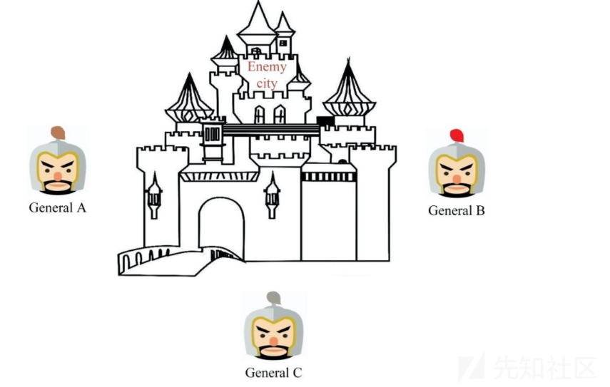](https://xzfile.aliyuncs.com/media/upload/picture/20240120122127-613028a8-b74b-1.png)  
拜占庭帝国(Byzantine Empire)军队的几个师驻扎在敌城外，每个师都由各自的将军指挥，将军们只能通过信使相互沟通，在观察敌情之后他们必须制定一个共同的行动计划，例如:进攻(Attack)或者撤退(Retreat)，且只有当半数以上的将军共同发起进攻时才能取得胜利，然而,其中一些将军可能是叛徒，试图阻止忠诚的将军达成一致的行动计划，更糟糕的是负责消息传递的信使也可能是叛徒，他们可能篡改或伪造消息，也可能使得消息丢失  
为了更加深入的理解拜占庭将军问题，我们以三将军问题为例进行说明，当三个将军都忠诚时，可以通过投票确定一致的行动方案，图2展示了一种场景， 即General A，B通过观察敌军军情并结合自身情况判断可以发起攻击，而General C通过观察敌军军情并结合自身情况判断应当撤退，最终三个将军经过投票表决得到结果为"进攻:撤退 = 2:1 "， 所以将一同发起进攻取得胜利，对于三个将军而言每个将军都能执行两种决策(进攻或撤退)的情况下, 共存在6中不同的场景，下图是其中一种，对于其他5种场景可简单地推得，通过投票三个将军都将达成一致的行动计划  
[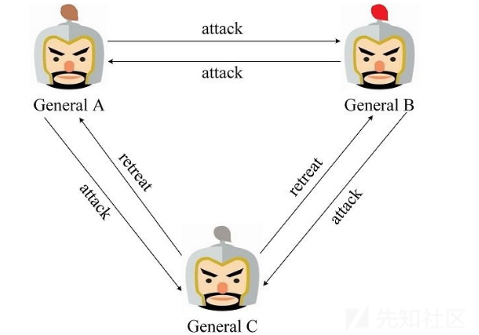](https://xzfile.aliyuncs.com/media/upload/picture/20240120122144-6b783c92-b74b-1.png)  
当三个将军中存在一个叛徒时，将可能扰乱正常的作战计划，图3展示了General C为叛徒的一种场景，他给General A和General B发送了不同的消息，在这种场景下General A通过投票得到"进攻 ：撤退=1:2"，最终将作出撤退的行动计划，General B通过投票得到"进攻：撤退=2:1"，最终将作出进攻的行动计划，结果只有General B发起了进攻并战败  
[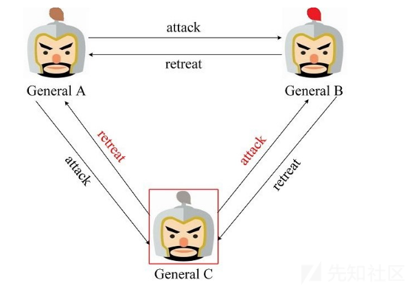](https://xzfile.aliyuncs.com/media/upload/picture/20240120122204-7719edc0-b74b-1.png)  
事实上，对于三个将军中存在一个叛徒的场景，想要总能达到一致的行动方案是不可能的，详细的证明可参看Leslie Lamport的论文，此外论文中给出了一个更加普适的结论：如果存在m个叛将，那么至少需要3m+1个将军，才能最终达到一致的行动方案

### 解决方案

Leslie Lamport在论文中给出了两种拜占庭将军问题的解决方案，即口信消息型解决方案(A solution with oral message)和签名消息型解决方案(A solution with signed message)

#### 口信消息型解决方案

首先,对于口信消息(Oral message)的定义如下：

-   A1. 任何已经发送的消息都将被正确传达
-   A2. 消息的接收者知道是谁发送了消息
-   A3. 消息的缺席可以被检测

基于口信消息的定义，我们可知口信消息不能被篡改但是可以被伪造，基于对图3场景的推导，我们知道存在一个叛将时，必须再增加3个忠将才能达到最终的行动一致，为加深理解，我们将利用3个忠将1个叛将的场景对口信消息型解决方案进行推导，在口信消息型解决方案中首先发送消息的将军称为指挥官，其余将军称为副官，对于3忠1叛的场景需要进行两轮作战信息协商，如果没有收到作战信息那么默认撤退，图4是指挥官为忠将的场景，在第一轮作战信息协商中，指挥官向3位副官发送了进攻的消息，在第二轮中，三位副官再次进行作战信息协商，由于General A、B为忠将，因此他们根据指挥官的消息向另外两位副官发送了进攻的消息，而General C为叛将，为了扰乱作战计划，他向另外两位副官发送了撤退的消息，最终Commanding General, General A和B达成了一致的进攻计划，可以取得胜利  
[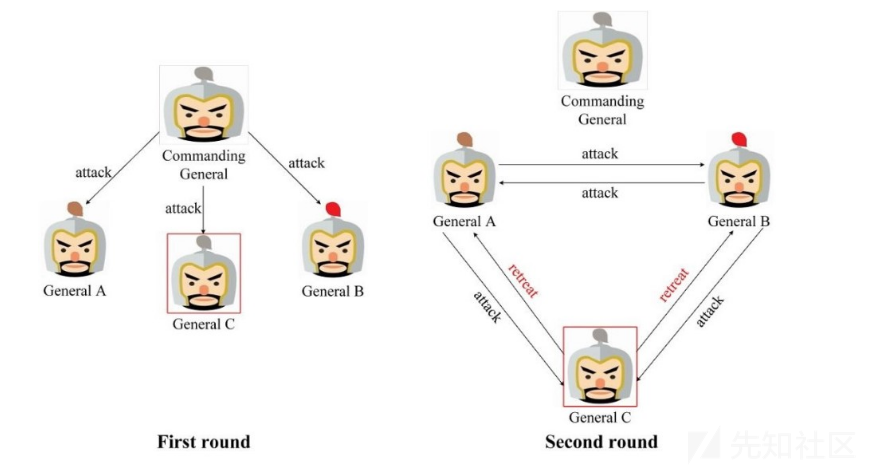](https://xzfile.aliyuncs.com/media/upload/picture/20240120122244-8ef47da2-b74b-1.png)  
下图是指挥官为叛将的场景，第一轮作战信息协商中，指挥官向General A、B发送了撤退的消息，但是为了扰乱General C的决定向其发送了进攻的消息，在第二轮中由于所有副官均为忠将，因此都将来自指挥官的消息正确地发送给其余两位副官，最终所有忠将都能达成一致撤退的计划  
[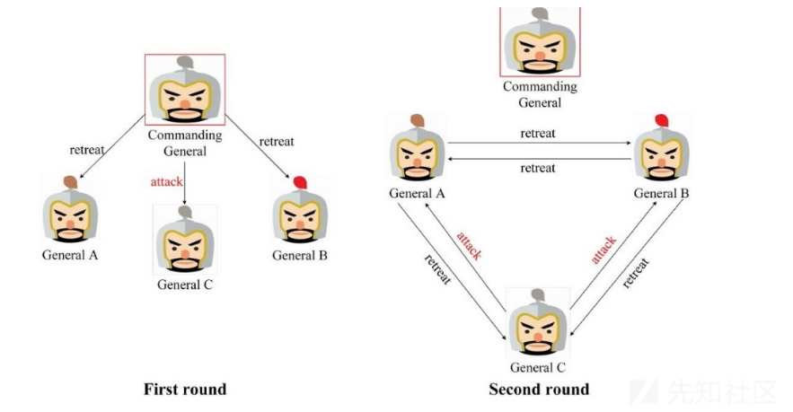](https://xzfile.aliyuncs.com/media/upload/picture/20240120122256-96182f52-b74b-1.png)  
如上所述，对于口信消息型拜占庭将军问题，如果叛将人数为m，将军人数不少于3m+1，那么最终能达成一致的行动计划，值的注意的是在这个算法中叛将人数m是已知的，且叛将人数m决定了递归的次数，即叛将数m决定了进行作战信息协商的轮数，如果存在m个叛将，则需要进行m+1轮作战信息协商，这也是上述存在1个叛将时需要进行两轮作战信息协商的原因

#### 签名消息型解决方案

对签名消息的定义是在口信消息定义的基础上增加了如下两条：

-   A4. 忠诚将军的签名无法伪造，而且对他签名消息的内容进行任何更改都会被发现
-   A5. 任何人都能验证将军签名的真伪

基于签名消息的定义，我们可以知道签名消息无法被伪造或者篡改，为了深入理解签名消息型解决方案，我们同样以3三将军问题为例进行推导，下图是忠将率先发起作战协商的场景，General A率先向General B、C发送了进攻消息，一旦叛将General C篡改了来自General A的消息，那么General B将将发现作战信息被General C篡改，General B将执行General A发送的消息  
[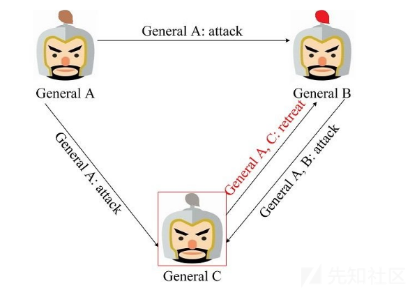](https://xzfile.aliyuncs.com/media/upload/picture/20240120122321-a500916c-b74b-1.png)  
下图是叛将率先发起作战协商的场景，叛将General C率先发送了误导的作战信息，那么General A、B将发现General C发送的作战信息不一致，因此判定其为叛将，可对其进行处理后再进行作战信息协商，签名消息型解决方案可以处理任何数量叛将的场景  
[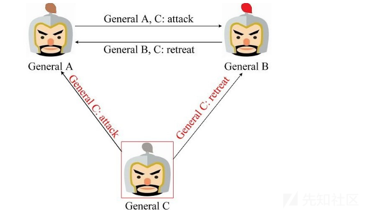](https://xzfile.aliyuncs.com/media/upload/picture/20240120123123-c478a218-b74c-1.png)

## 共识分类

共识机制是区块链技术中确保交易安全和可靠性的关键机制之一，不同的共识机制采用不同的算法和协议来实现对于数据和交易的共识，以下是常见的共识机制分类：

### POW共识机制

工作量证明机制(PoW)是最早的共识机制之一，也是比特币等许多区块链系统采用的共识机制，其核心思想是通过计算复杂的哈希函数来竞争记账权

#### 区块结构

我们以比特币为例来详细介绍POW共识机制，首先来看一下比特币区块的结构图：  
[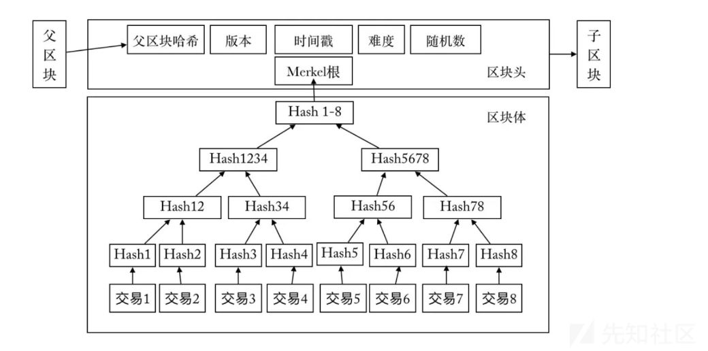](https://xzfile.aliyuncs.com/media/upload/picture/20240120140523-e65194aa-b759-1.png)  
区块由区块头(Block Header)和区块体(Block Body)两部分组成，其中区块头主要包含以下信息：

-   版本号(Version)：占4字节，表示区块的版本号，用于区分不同版本的区块
-   父区块哈希值(Previous Block Hash)：占32字节，表示上一个区块的哈希值，将当前区块与之前的区块连接起来
-   时间戳(Timestamp)：占4字节，表示当前区块的创建时间
-   梅克尔根(Merkle Root)：占32字节，表示当前区块中所有交易的哈希值的Merkle树根节点哈希值，用于验证区块中的所有交易是否有效
-   难度目标(Difficulty Target)：占4字节，表示当前区块的工作量证明难度目标，用于限制区块的生成速度
-   随机数(Nonce)：占4字节，矿工通过改变这个值并不断尝试计算出符合工作量证明难度目标的哈希值从而获得记账权

区块体是比特币区块的另一个重要组成部分，包含了当前区块中的所有交易信息，区块体主要包括以下几个部分：

-   交易计数器(Transaction Count)：表示当前区块中的交易数量
-   交易列表(Transaction List)：表示当前区块中所有交易的列表，每个交易包含输入和输出等信息，用于记录比特币的转移和所有权变更

#### 证明要素

POW(工作量证明)机制需要满足以下三个要素：  
**A、区块构造**  
区块结构介绍如上所示，这里我们主要关注以下区块体的Merkle树算法，下图是一个Merkle树的示例，该图中会首先会对4个交易记录L1--L4分别计算hash(L1)--hash(L4)，然后计算hash0=hash0-0+hash0-1和hash1=hash1-0+hash1-1，最后计算得出根节点的hash值  
[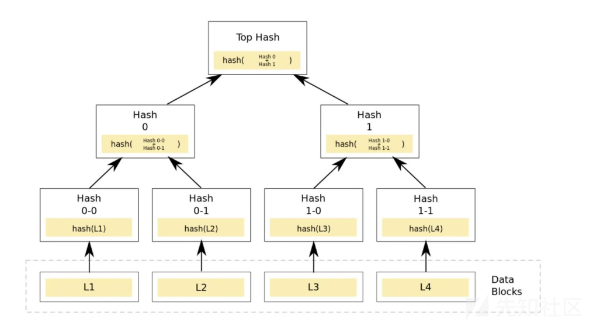](https://xzfile.aliyuncs.com/media/upload/picture/20240120140559-fba58334-b759-1.png)

**B、POW函数**  
比特币采用的工作量证明函数是SHA-256，该函数常用于数字签名、消息认证等领域，SHA-256函数是从输入数据中生成固定长度的消息摘要，以下是一个使用 Go 实现比特币工作量证明函数的简单示例代码，这里定义了Block结构体和ProofOfWork结构体，ProofOfWork结构体包含了比特币工作量证明算法的实现，在NewBlock()函数中我们调用NewProofOfWork()函数创建一个ProofOfWork对象并调用它的Run()方法来计算符合难度要求的哈希值，在Run()方法中，我们使用SHA-256哈希函数来计算哈希值并不断尝试不同的随机数，直到找到符合难度要求的哈希值，在main()函数中我们创建了一个新的区块并计算了它的哈希值，在实际应用中我们需要将新的区块广播到网络中等待其他节点的验证和确认然后将其添加到自己的区块链上

```plain
package main

import (
    "bytes"
    "crypto/sha256"
    "encoding/binary"
    "fmt"
    "math"
    "math/big"
    "time"
)

const maxNonce = math.MaxInt64 // 随机数的最大值

type Block struct {
    Timestamp     int64
    Data          []byte
    PrevBlockHash []byte
    Hash          []byte
    Nonce         int
}

func NewBlock(data string, prevBlockHash []byte) *Block {
    block := &Block{time.Now().Unix(), []byte(data), prevBlockHash, []byte{}, 0}
    pow := NewProofOfWork(block)
    nonce, hash := pow.Run()
    block.Hash = hash[:]
    block.Nonce = nonce
    return block
}

type ProofOfWork struct {
    block  *Block
    target *big.Int
}

func NewProofOfWork(b *Block) *ProofOfWork {
    target := big.NewInt(1)
    target.Lsh(target, uint(256-bits))
    pow := &ProofOfWork{b, target}
    return pow
}

func (pow *ProofOfWork) prepareData(nonce int) []byte {
    data := bytes.Join(
        [][]byte{
            pow.block.PrevBlockHash,
            pow.block.Data,
            IntToHex(pow.block.Timestamp),
            IntToHex(int64(bits)),
            IntToHex(int64(nonce)),
        },
        []byte{},
    )
    return data
}

func (pow *ProofOfWork) Run() (int, []byte) {
    var hashInt big.Int
    var hash [32]byte
    nonce := 0
    fmt.Printf("挖矿开始，目标哈希值：%x\n", pow.target.Bytes())
    for nonce < maxNonce {
        data := pow.prepareData(nonce)
        hash = sha256.Sum256(data)
        fmt.Printf("\r%x", hash)
        hashInt.SetBytes(hash[:])
        if hashInt.Cmp(pow.target) == -1 {
            fmt.Printf("\n")
            break
        } else {
            nonce++
        }
    }
    return nonce, hash[:]
}

func (pow *ProofOfWork) Validate() bool {
    var hashInt big.Int
    hash := sha256.Sum256(pow.prepareData(pow.block.Nonce))
    hashInt.SetBytes(hash[:])
    return hashInt.Cmp(pow.target) == -1
}

func IntToHex(n int64) []byte {
    buf := new(bytes.Buffer)
    err := binary.Write(buf, binary.BigEndian, n)
    if err != nil {
        fmt.Println("IntToHex error:", err)
    }
    return buf.Bytes()
}

func main() {
    prevBlockHash := []byte("prevBlockHash")
    data := "Hello, World!"
    block := NewBlock(data, prevBlockHash)
    fmt.Printf("挖矿完成，区块哈希值：%x\n", block.Hash)
}
```

**C、难度值计算**  
比特币的难度值计算公式是一个动态调整的算法，旨在保持比特币网络的区块产出速度稳定在每10分钟产生一个区块左右，比特币的难度值计算公式如下：

```plain
new_target = old_target * (actual_time / target_time)
```

参数说明：

-   old\_target：前2016个区块的难度目标值
-   actual\_time：前2016个区块实际产出的时间总和
-   target\_time：理论上应该产生这些区块所需的时间总和

在比特币中target\_time固定为2016个区块产生的总时间，即14天(10分钟x2016)，实际上比特币网络的区块产出速度并不总是稳定的，因此需要根据实际情况动态调整难度目标值，而为了保持区块产出速度稳定在每10分钟一个区块左右，比特币网络会根据前2016个区块的实际产出时间来计算新的难度目标值，如果实际产出时间比理论上的目标时间短，即区块产出速度过快，那么新的难度目标值将会增加，使得下一个难度周期中的区块难度增加，如果实际产出时间比理论上的目标时间长，即区块产出速度过慢，那么新的难度目标值将会减少，使得下一个难度周期中的区块难度降低，以下是一个根据前2016个区块实际产出时间计算新难度目标值的示例：  
假设前2016个区块总共产出的时间为14天2小时30分钟(即1201500秒)，而理论上应该产生这些区块的时间为14天(即1209600秒)，则根据难度计算公式，新的难度目标值应该为

```plain
new_target = old_target * (actual_time / target_time)
           = old_target * (1201500 / 1209600)
```

这里的old\_target是上一个难度周期的难度目标值，如果上一个难度周期的难度目标值为1000000000000(即一个十六进制数，大约是2的40 次方)，则新的难度目标值应该为：

```plain
new_target = 1000000000000 * (1201500 / 1209600)
           = 986408071.869
```

备注：在实际应用中新的难度目标值会取整到最接近的整数并转换为一个十六进制数，作为下一个难度周期的难度目标值。

#### 证明原理

工作量证明机制的主要特征是请求方需要做一定难度的工作计算出一个结果，验证方却很容易通过验证结果是否满足要求来确认客户端是不是做了相应的工作，这种方案的一个核心特征是不对称性，即工作对于请求方而言是有一定难度的，对于验证方而言则是易于验证的。  
假如对一个给定的字符串"Hello world~"，系统设定的工作量要求是在这个字符串后面添加一个叫作Nonce的随机整数值，对变更后(添加了Nonce)的字符串进行SHA256哈希运算，如果得到的哈希结果(以十六进制的形式表示)是以"0000"开头的则完成了工作量，可以通过验证，而在验证开始之前，请求方并不知道到底哪个数值添加后可以达到前4位为"0000"的工作量证明目标，所以只有采用笨办法即从0开始不断地递增变动Nonce值并对每个变动后的新字符串进行SHA256哈希运算，再对照哈希运算结果与目标要求，直到找到那个随机数(Nonce)为止，粗略估计大概需要经过4251次计算才能找到恰好前4位为0的哈希散列，而当这个结果被计算出来后，请求方向验证方告知结果：在"Hello world~"后面附加上4250可以使SHA256的前4位为"0000"，验证方无须再从0开始验证，它可以直接应用"Hello world！4250"进行SHA256计算，发现请求方的计算结果确实满足了要求，于是验证得以通过

#### 证明流程

POW(Proof of Work)工作量证明是一种常用于区块链技术中的共识算法，它的主要流程可以分为以下几步：  
构造候选区块：矿工需要从当前的交易池中选择一些交易记录，然后将这些交易记录打包成一个新的区块，在比特币中每个区块包含了前一个区块的哈希值、时间戳、随机数(Nonce)和一些其他的元数据

-   计算哈希值：矿工需要不断尝试不同的随机数并将其添加到区块中，然后使用哈希函数(例如:SHA-256)计算区块的哈希值，由于哈希函数的单向性，矿工只能通过不断尝试不同的随机数来寻找符合要求的哈希值，在比特币中符合要求的哈希值必须满足一定的难度要求，即哈希值的前若干位必须为0
-   验证哈希值：矿工找到了符合要求的哈希值后就可以将这个区块广播到网络中并让其他节点进行验证，其他节点会验证这个区块是否合法，即它是否包含合法的交易记录，以及它的哈希值是否符合难度要求，如果验证通过，那么这个区块将被添加到区块链上并成为新的最长区块链的一部分
-   调整难度：为了保持比特币网络的区块产出速度稳定在每10分钟产生一个区块左右，比特币网络会根据前2016个区块的实际产出时间来计算新的难度目标值，如果实际产出时间比理论上的目标时间短，即区块产出速度过快，那么新的难度目标值将会增加，使得下一个难度周期中的区块难度增加，如果实际产出时间比理论上的目标时间长，即区块产出速度过慢，那么新的难度目标值将会减少，使得下一个难度周期中的区块难度降低
-   奖励矿工：矿工在挖矿过程中可以获得一定数量的比特币作为奖励，这个奖励会随着时间的推移而减少，直到比特币总量达到2100万枚为止

[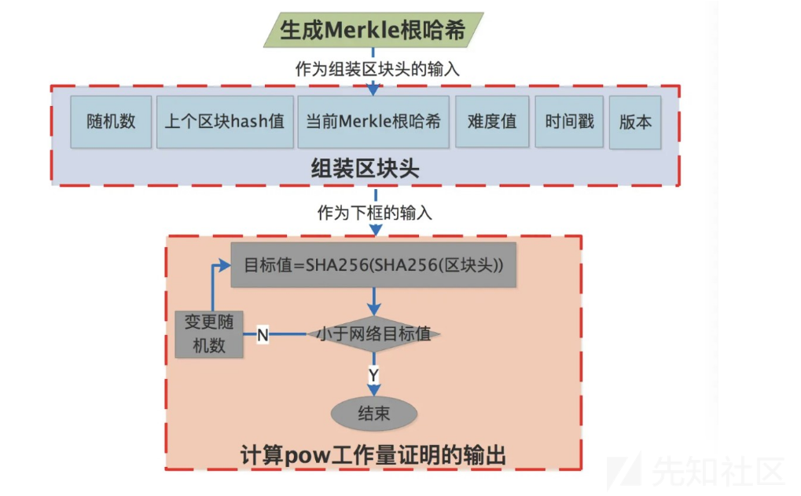](https://xzfile.aliyuncs.com/media/upload/picture/20240120140757-41f25222-b75a-1.png)

#### 共识记账

POW工作量证明共识记账流程如下：

-   客户端产生新的交易，向全网广播
-   每个节点收到请求，将交易纳入区块中
-   每个节点通过POW工作量证明寻找证明
-   当某一个节点找到了证明便向全网进行广播
-   当且仅当该区块的交易是有效的且在之前中未存在的，其他节点才认同该区块的有效性
-   接受该区块且在该区块的末尾制造新的区块

大概时序图如下所示：  
[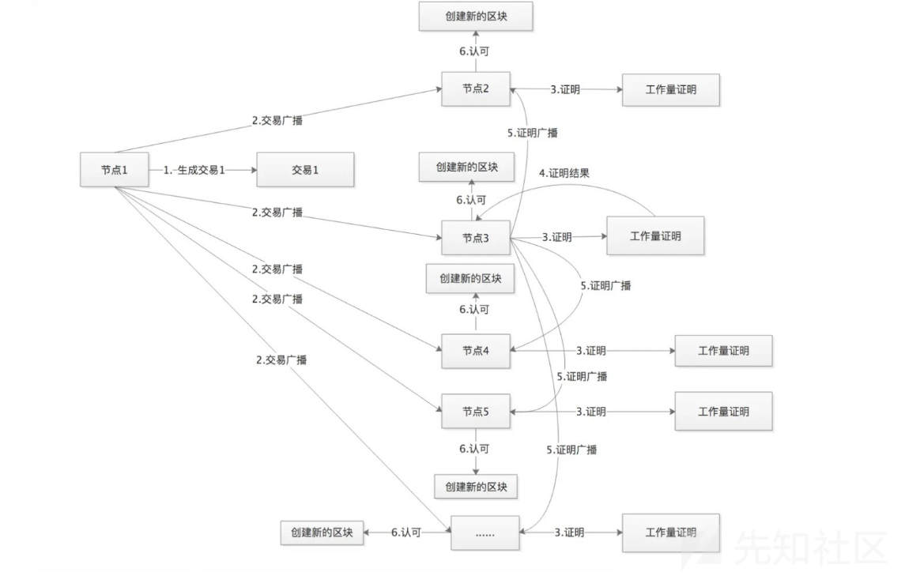](https://xzfile.aliyuncs.com/media/upload/picture/20240120140821-500808ca-b75a-1.png)

### POS共识机制

#### 基本介绍

POS(Proof of Stake)共识机制是一种区块链网络中的共识算法，它与POW(Proof of Work)共识机制不同，POW需要矿工进行计算，消耗大量的能源，而POS则是根据持有的数字货币数量来决定下一个区块的生成权，具体来说就是POS共识机制会选出一定数量的验证者，这些验证者需要在网络中拥有一定数量的数字货币，这些数字货币可以作为抵押品，确保验证者不会恶意行为，验证者将自己的数字货币抵押到网络中然后获得产生新区块的权利，在选出验证者之后，他们会轮流产生新的区块，每个验证者的权利是根据他们持有的数字货币数量来决定的，如果验证者违反规则，他们的数字货币会被没收

#### 版本介绍

PoS机制自创立以来，已经经历了3个版本的修订：

-   PoS 1.0版：在PeerCoin中得到应用，采用了币龄(CoinAge，持有数字货币的时间)的概念，币龄越大则挖矿难度越低。这导致用户会选择间隔很长的时间(比如一个月或更长时间)上线连接钱包，这样钱包中的币龄都会比较大，用户可以很快地挖到新区块，由此影响到用户节点的参与程度较低，对网络的安全性不利，容易导致攻击产生
-   PoS 2.0版：在共识机制中移除了币龄并采用了和PoS1.0版完全不同的锚定修饰符(Stake Modifier)，其他数字货币如BlackCoin使用了PoS 2.0版
-   PoS 3.0版：在锚定修饰符中移除了前一区块的币龄，可以防止"短距攻击(Short-range Attack)"，在PoS 3.0中UTXO年龄进一步简化，只由区块高度决定，可以避免"时间穿越(Timewarp)"攻击，在PoS3.0中还增加了对锚定交易的OP\_RETURN的支持，使交易输出中只包含公钥，而并不需要完整的pay-to-pubkey脚本，更重要的是PoS3.0版要求挖矿节点持续在线并积极参与权益交易，因此增加了在线节点共同维护网络交易的数量，提高了网络的安全性

另外持币少的人与持币多的人相比，只要全部时间在线参与权益交易就可以得到比例更高的区块创建利息奖励，比如:持币多的人可能得到1%的利息奖励，而持币少的人由于参与的时间长，可能得到2%甚至更高比例的利息，从而激励人们多多在线，这种机制也使得交易费用的分配更加分散化，避免"富者更富，穷者更穷"的中心化趋势

#### 工作流程

POS(Proof of Stake)共识机制是一种区块链技术中的共识算法，它的工作流程可以分为以下几步：

-   抵押加密货币：节点需要抵押一定数量的加密货币作为权益，这些加密货币将会被锁定在一个专门的地址中，抵押的数量越多，节点的权益也就越大，获得出块的概率也就越高
-   随机选择权益地址：每个区块的出块权利将会随机分配给一个权益地址，这个随机性通常基于节点的权益数量和时间戳等因素，获得出块权利的节点将会成为出块者
-   出块和验证：出块者需要验证交易记录的合法性并将这些交易记录打包成一个新的区块，其他节点会对这个区块进行验证，如果验证通过这个区块将会被添加到区块链上
-   奖励和手续费：出块者可以获得一定数量的加密货币作为奖励，这个奖励与节点的权益数量成正比，在一些 POS 系统中节点还可以获得一定数量的交易手续费作为奖励
-   惩罚机制：如果节点发布了不合法的交易记录或区块或者没有及时参与网络的验证和管理，它的权益将会被扣除一定数量的加密货币，在一些POS系统中被扣除的加密货币还会被销毁，从而降低了通胀率

下面是一个简单的示意图，展示了POS共识机制的工作流程：

```plain
+-----------------+           +----------------+
|   抵押加密货币  | --------->| 随机选择权益地址|
+-----------------+           +----------------+
                                      |
                                      |
                                      v
+-----------------+           +----------------+
|     出块和验证  |<--------- | 奖励和手续费    |
+-----------------+           +----------------+
         |          -                   
         |           -                  
         v              -               
+-----------------+         > +----------------+
|  下一个区块     |           |    惩罚机制     |
+-----------------+           +----------------+
```

在这个示意图中节点需要先抵押一定数量的加密货币作为权益，然后等待随机选择的权益地址。如果节点被选中成为出块者，它需要验证交易记录的合法性，然后将这些交易记录打包成一个新的区块,其他节点会对这个区块进行验证，如果验证通过，这个区块将会被添加到区块链上并且出块者可以获得一定数量的加密货币作为奖励，如果节点发布了不合法的交易记录或区块或者没有及时参与网络的验证和管理，它的权益将会被扣除一定数量的加密货币，最后系统会选择一个新的权益地址，继续下一个区块的出块和验证过程

### DPOS共识机制

#### 基本介绍

DPOS(Delegated Proof of Stake)共识机制是一种基于POS共识机制的改进版，它最早出现在BitShares中，相比于传统的POS共识机制，DPOS 共识机制具有以下优势：

-   更高的效率：DPOS共识机制使用了委托权益和见证人轮流出块的机制，可以大大提高网络的效率和吞吐量
-   更高的安全性：DPOS共识机制使用了委托权益和轮值委员会的机制，可以保证网络的安全性和可靠性，如果某个见证人出现问题，委托者可以及时更换，从而避免了51%攻击等安全问题
-   更低的参与门槛：DPOS共识机制可以让普通用户通过委托权益来参与网络的验证和管理，降低了节点的参与门槛

DPOS共识机制是一种基于POS共识机制的改进版，它在效率、安全性和可参与性等方面都有很大的优势，目前许多区块链项目都采用了DPOS共识机制，例如:BitShares、EOS、TRON等

#### 委托选择

在DPOS(Delegated Proof of Stake)共识机制中，委托者可以通过以下方式来选择和更换见证人：

-   投票机制：在一些DPOS系统中，委托者可以通过投票来选择和更换见证人，每个委托者可以投票给多个见证人，投票的数量和委托者的权益成正比，投票的结果将会决定轮值委员会的成员，从而影响出块的概率和奖励
-   自主选择：在一些DPOS系统中，委托者可以自主选择见证人而不是通过投票，委托者可以根据见证人的表现和声誉来选择和更换见证人，从而保证网络的安全性和可靠性

在选择和更换见证人的过程中，委托者需要考虑以下因素：

-   可靠性和表现：委托者需要选择那些表现良好、可靠性高的见证人，从而保证交易记录和区块链的安全性和可靠性
-   奖励和手续费：委托者需要选择那些给出块奖励和手续费比较高的见证人，从而获得更多的收益
-   社区声誉：委托者需要选择那些受到社区认可和支持的见证人，从而提高网络的信誉和声誉

在更换见证人的过程中，委托者需要注意以下事项：

-   避免频繁更换：频繁更换见证人可能会影响网络的稳定性和可靠性，委托者应该尽量避免频繁更换见证人
-   考虑成本和时间：更换见证人可能需要一定的成本和时间，委托者需要考虑这些因素，从而避免不必要的损失和浪费

#### 工作流程

DPOS(Delegated Proof of Stake)共识机制的工作流程如下：

-   抵押加密货币：节点需要抵押一定数量的加密货币作为权益，这些加密货币将会被锁定在一个专门的地址中，抵押的数量越多，节点的权益也就越大，获得出块的概率也就越高
-   委托权益：节点可以将它们的权益委托给其他节点，这些被委托的节点被称为"见证"，委托者可以根据见证人的表现来选择和更换见证人，从而保证网络的安全性和可靠性，委托者还可以获得一定的收益，这个收益通常来自于见证人的手续费和奖励
-   见证人轮流出块：每个区块的出块权利将会轮流分配给一组见证人，这个组被称为"轮值委员会"，轮值委员会中的每个见证人都需要验证交易记录的合法性并将这些交易记录打包成一个新的区块，其他节点会对这个区块进行验证，如果验证通过，则这个区块将会被添加到区块链上
-   奖励和手续费：见证人可以获得一定数量的加密货币作为奖励，这个奖励与节点的权益数量和参与度成正比，在一些DPOS系统中，见证人还可以获得一定数量的交易手续费作为奖励
-   惩罚机制：如果见证人发布了不合法的交易记录或区块或者没有及时参与网络的验证和管理，它们的权益将会被扣除一定数量的加密货币，在一些DPOS系统中被扣除的加密货币还会被销毁，从而降低了通胀

下面是一个简单的示意图，展示了DPOS共识机制的工作流程：

```plain
+---------------------+
                   | 委托者(抵押加密货币) |
                   +----------+----------+
                              |
                              V
                   +----------+----------+
                   |     见证人（出块）  |
                   +----------+----------+
                              |
                              V
                 +--------------------------+
                 | 其他节点（验证和同步区块）|
                 +--------------------------+
```

在这个示意图中，委托者首先需要抵押一定数量的加密货币作为权益，然后可以将它们的权益委托给其他节点，这些被委托的节点即为"见证人"，见证人需要验证交易记录的合法性并将这些交易记录打包成一个新的区块，然后将这个区块广播给其他节点，其他节点会对这个区块进行验证和同步，如果验证通过则这个区块将会被添加到区块链上，见证人可以获得一定数量的加密货币作为奖励，同时也需要承担一定的责任和风险

## 以太坊类

共识算法是区块链项目的核心之一，每一个运行着的区块链都需要一个共识算法来保证出块的有效性和有序性，在以太坊的官方源码中，有两个共识算法—clique和ethash，它们位于以太坊项目的consensus目录下，其中clique是PoA(权威证明，Proof of Authority)共识，它主要用于测试网络，ethash是目前以太坊主网Homestead版本的PoW(工作量证明，Proof of Work)共识算法，用于正式网络，下面我们主要对以太坊的共识算法进行介绍

### 共识引擎

Engine接口定义了共识引擎需要实现的所有函数，实际上按功能可以划分为2类：

-   区块验证类：以Verify开头，当收到新区块时，需要先验证区块的有效性
-   区块盖章类：包括Prepare/Finalize/Seal等，用于最终生成有效区块(比如:添加工作量证明）

下图是以太坊共识引擎组件关系图：  
[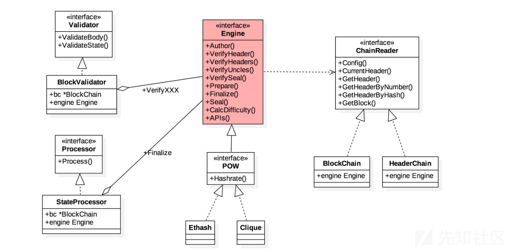](https://xzfile.aliyuncs.com/media/upload/picture/20240120141248-ef4a60a4-b75a-1.png)  
在这里引申出了与区块验证相关联的两个外部接口——processor(执行交易)和Validator(验证区块内容和状态)，同时由于需要访问之前的区块链上的数据，抽象出了一个ChainReader接口，从上图中可以看到这里的BlockChain和HeaderChain都实现了该接口，所以可以访问链上数据

### v区块验证

区块验证过程如下图所示，可以看到当downloader收到新的区块时会直接调用BlockChain.insertChain()函数将新的区块插入区块链，不过在插入之前会优先对区块的有效性和合法性进行验证处理，主要涉及以下四个步骤：

-   验证区块头：Ethash.VerifyHeaders()
-   验证区块内容：BlockValidator.VerifyBody()(内部还会调用Ethash.VerifyUncles())
-   执行区块交易：BlockProcessor.Process()(基于其父块的世界状态）
-   验证状态转换：BlockValidator.ValidateState()  
    [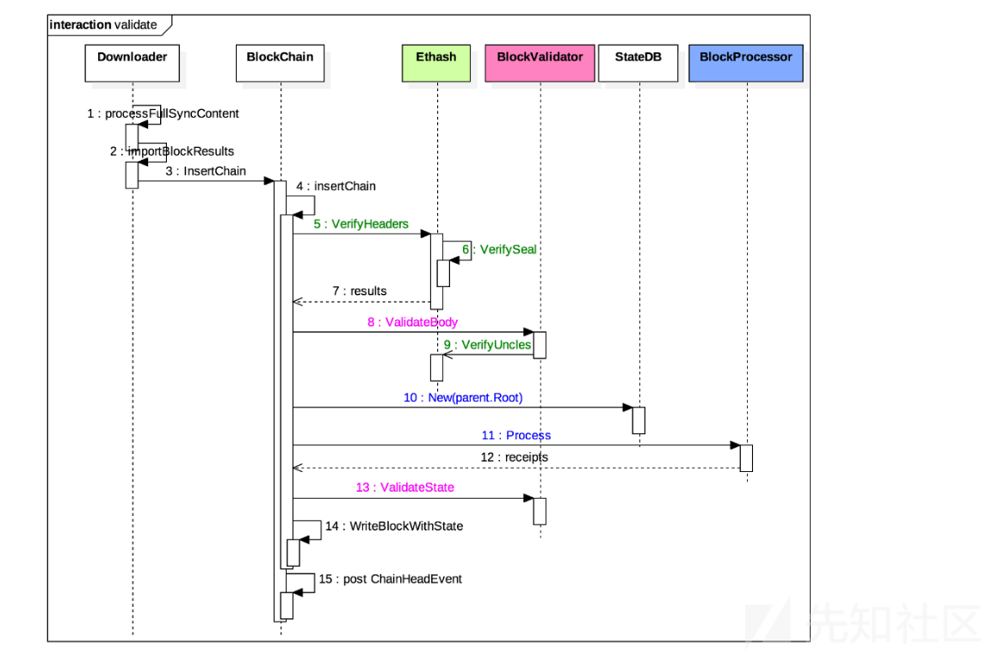](https://xzfile.aliyuncs.com/media/upload/picture/20240120141312-fd52468a-b75a-1.png)  
    \### 区块盖章  
    新产生的区块必须经过"盖章(seal)"才能成为有效区块，具体到Ethash来说就是要执行POW计算以获得低于设定难度的nonce值，整个过程主要分为3个步骤：
    
-   准备工作：调用Ethash.Prepare()计算难度值
    
-   生成区块：调用Ethash.Finalize()打包新区块
-   区块盖章：调用Ethash.Seal()进行POW计算，填充nonce值  
    [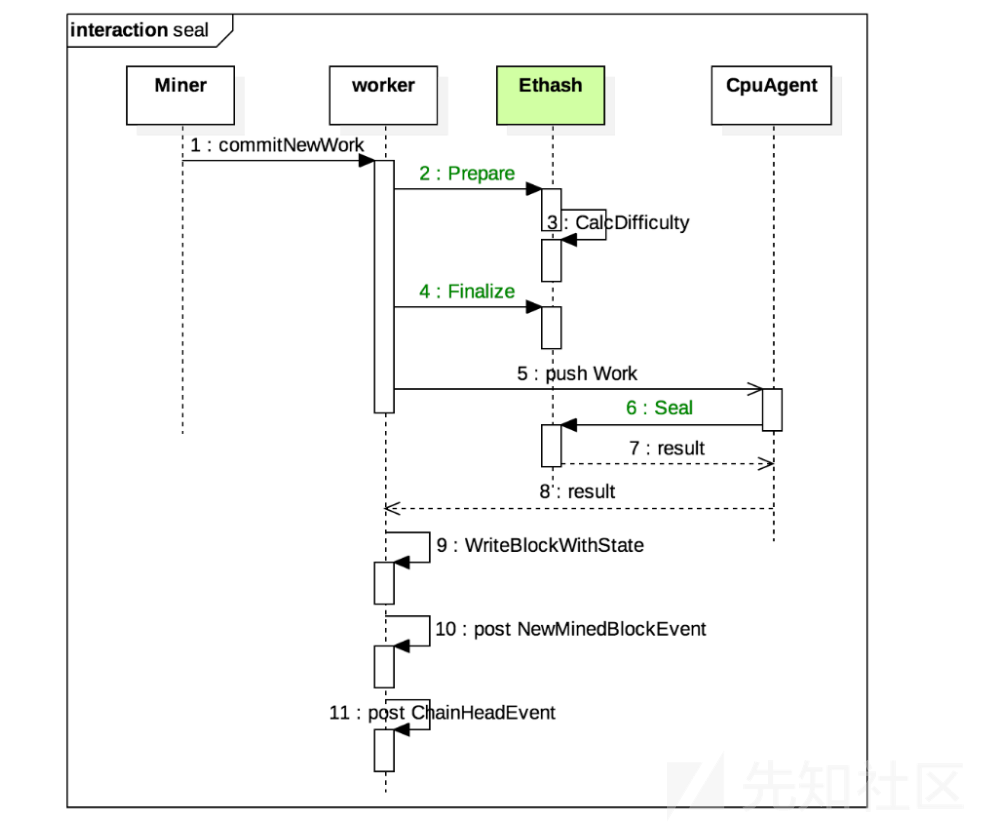](https://xzfile.aliyuncs.com/media/upload/picture/20240120141329-07dd09aa-b75b-1.png)

### 源码分析

#### ethash

ethash目录结构如下所示：

```plain
├─ethash
│      algorithm.go         // Dagger-Hashimoto算法实现
│      api.go               // RPC方法
│      consensus.go         // 共识设计
│      difficulty.go        // 难度设计
│      ethash.go            // cache结构体和dataset结构体实现
│      sealer.go            // 共识接口Seal实现
```

##### 基本常量

文件go-ethereum-1.10.2\\consensus\\ethash\\consensus.go的开头处定义了POW协议的常量(区块奖励、区块难度、错误信息等)：

```plain
// filedir:go-ethereum-1.10.2\consensus\ethash\consensus.go L40
// Ethash proof-of-work protocol constants.
var (
    FrontierBlockReward           = big.NewInt(5e+18) // Block reward in wei for successfully mining a block
    ByzantiumBlockReward          = big.NewInt(3e+18) // Block reward in wei for successfully mining a block upward from Byzantium
    ConstantinopleBlockReward     = big.NewInt(2e+18) // Block reward in wei for successfully mining a block upward from Constantinople
    maxUncles                     = 2                 // Maximum number of uncles allowed in a single block
    allowedFutureBlockTimeSeconds = int64(15)         // Max seconds from current time allowed for blocks, before they're considered future blocks

    // calcDifficultyEip2384 is the difficulty adjustment algorithm as specified by EIP 2384.
    // It offsets the bomb 4M blocks from Constantinople, so in total 9M blocks.
    // Specification EIP-2384: https://eips.ethereum.org/EIPS/eip-2384
    calcDifficultyEip2384 = makeDifficultyCalculator(big.NewInt(9000000))

    // calcDifficultyConstantinople is the difficulty adjustment algorithm for Constantinople.
    // It returns the difficulty that a new block should have when created at time given the
    // parent block's time and difficulty. The calculation uses the Byzantium rules, but with
    // bomb offset 5M.
    // Specification EIP-1234: https://eips.ethereum.org/EIPS/eip-1234
    calcDifficultyConstantinople = makeDifficultyCalculator(big.NewInt(5000000))

    // calcDifficultyByzantium is the difficulty adjustment algorithm. It returns
    // the difficulty that a new block should have when created at time given the
    // parent block's time and difficulty. The calculation uses the Byzantium rules.
    // Specification EIP-649: https://eips.ethereum.org/EIPS/eip-649
    calcDifficultyByzantium = makeDifficultyCalculator(big.NewInt(3000000))
)

// Various error messages to mark blocks invalid. These should be private to
// prevent engine specific errors from being referenced in the remainder of the
// codebase, inherently breaking if the engine is swapped out. Please put common
// error types into the consensus package.
var (
    errOlderBlockTime    = errors.New("timestamp older than parent")
    errTooManyUncles     = errors.New("too many uncles")
    errDuplicateUncle    = errors.New("duplicate uncle")
    errUncleIsAncestor   = errors.New("uncle is ancestor")
    errDanglingUncle     = errors.New("uncle's parent is not ancestor")
    errInvalidDifficulty = errors.New("non-positive difficulty")
    errInvalidMixDigest  = errors.New("invalid mix digest")
    errInvalidPoW        = errors.New("invalid proof-of-work")
)
```

##### 矿工地址

Author用于返回第一笔交易的目的地址(币基交易的奖励地址，也是矿工的地址)：

```plain
// filedir:go-ethereum-1.10.2\consensus\ethash\consensus.go L82
// Author implements consensus.Engine, returning the header's coinbase as the
// proof-of-work verified author of the block.
func (ethash *Ethash) Author(header *types.Header) (common.Address, error) {
    return header.Coinbase, nil
}
```

##### 验区块头

VerifyHeader函数用于校验区块头，这里首先检查当前的共识模式是否是ModeFullFake，如果是则直接返回nil，否则检查区块头是否已经存在以及是否无父区块，如果以上校验全部通过则调用verifyHeader函数进行适当验证：

```plain
// filedir:go-ethereum-1.10.2\consensus\ethash\consensus.go L88
// VerifyHeader checks whether a header conforms to the consensus rules of the
// stock Ethereum ethash engine.
func (ethash *Ethash) VerifyHeader(chain consensus.ChainHeaderReader, header *types.Header, seal bool) error {
    // If we're running a full engine faking, accept any input as valid
    if ethash.config.PowMode == ModeFullFake {
        return nil
    }
    // Short circuit if the header is known, or its parent not
    number := header.Number.Uint64()
    if chain.GetHeader(header.Hash(), number) != nil {
        return nil
    }
    parent := chain.GetHeader(header.ParentHash, number-1)
    if parent == nil {
        return consensus.ErrUnknownAncestor
    }
    // Sanity checks passed, do a proper verification
    return ethash.verifyHeader(chain, header, parent, false, seal, time.Now().Unix())
}
```

在verifyHeader方法中同样检查运行模式是否是ModeFullFake，如果是则认为所有的输入皆未有效，如果不是则尽可能生成过个线程，之后通过一个for循环来进行批量验证，在验证过程中进而调用了verifyHeaderWorker方法验证区块，验证完后向done信道发送区块索引号：

```plain
// filedir:go-ethereum-1.10.2\consensus\ethash\consensus.go  L108
// VerifyHeaders is similar to VerifyHeader, but verifies a batch of headers
// concurrently. The method returns a quit channel to abort the operations and
// a results channel to retrieve the async verifications.
func (ethash *Ethash) VerifyHeaders(chain consensus.ChainHeaderReader, headers []*types.Header, seals []bool) (chan<- struct{}, <-chan error) {
    // If we're running a full engine faking, accept any input as valid
    if ethash.config.PowMode == ModeFullFake || len(headers) == 0 {
        abort, results := make(chan struct{}), make(chan error, len(headers))
        for i := 0; i < len(headers); i++ {
            results <- nil
        }
        return abort, results
    }

    // Spawn as many workers as allowed threads
    workers := runtime.GOMAXPROCS(0)
    if len(headers) < workers {
        workers = len(headers)
    }

    // Create a task channel and spawn the verifiers
    var (
        inputs  = make(chan int)
        done    = make(chan int, workers)
        errors  = make([]error, len(headers))
        abort   = make(chan struct{})
        unixNow = time.Now().Unix()
    )
    for i := 0; i < workers; i++ {
        go func() {
            for index := range inputs {
                errors[index] = ethash.verifyHeaderWorker(chain, headers, seals, index, unixNow)
                done <- index
            }
        }()
    }

    errorsOut := make(chan error, len(headers))
    go func() {
        defer close(inputs)
        var (
            in, out = 0, 0
            checked = make([]bool, len(headers))
            inputs  = inputs
        )
        for {
            select {
            case inputs <- in:
                if in++; in == len(headers) {
                    // Reached end of headers. Stop sending to workers.
                    inputs = nil
                }
            case index := <-done:
                for checked[index] = true; checked[out]; out++ {
                    errorsOut <- errors[out]
                    if out == len(headers)-1 {
                        return
                    }
                }
            case <-abort:
                return
            }
        }
    }()
    return abort, errorsOut
}
```

verifyHeaderWorker方法如下所示，在这里首先获取父区块的header之后调用ethash.verifyHeader进行区块验证：

```plain
func (ethash *Ethash) verifyHeaderWorker(chain consensus.ChainHeaderReader, headers []*types.Header, seals []bool, index int, unixNow int64) error {
    var parent *types.Header
    if index == 0 {
        parent = chain.GetHeader(headers[0].ParentHash, headers[0].Number.Uint64()-1)
    } else if headers[index-1].Hash() == headers[index].ParentHash {
        parent = headers[index-1]
    }
    if parent == nil {
        return consensus.ErrUnknownAncestor
    }
    return ethash.verifyHeader(chain, headers[index], parent, false, seals[index], unixNow)
}
```

ethash.verifyHeader如下所示，主要做了以下几件事情：

-   检查header.Extra 是否超过32字节
-   检查时间戳是否超过15秒，15秒以后就被认为是未来区块
-   检查当前header的时间戳是否小于父区块的时间戳
-   检查区块难度，在检查前会根据时间戳和父块难度计算区块难度
-   检查Gas limit是否小于2^63-1
-   检查gasUsed为<= gasLimit
-   检查验证当前区块号是父块加1
-   检查给定的块是否满足pow难度要求
-   检查硬分叉的特殊字段
    
    ```plain
    // fileidr:go-ethereum-1.10.2\consensus\ethash\consensus.go  L242
    // verifyHeader checks whether a header conforms to the consensus rules of the
    // stock Ethereum ethash engine.
    // See YP section 4.3.4. "Block Header Validity"
    func (ethash *Ethash) verifyHeader(chain consensus.ChainHeaderReader, header, parent *types.Header, uncle bool, seal bool, unixNow int64) error {
      // Ensure that the header's extra-data section is of a reasonable size
      if uint64(len(header.Extra)) > params.MaximumExtraDataSize {
          return fmt.Errorf("extra-data too long: %d > %d", len(header.Extra), params.MaximumExtraDataSize)
      }
      // Verify the header's timestamp
      if !uncle {
          if header.Time > uint64(unixNow+allowedFutureBlockTimeSeconds) {
              return consensus.ErrFutureBlock
          }
      }
      if header.Time <= parent.Time {
          return errOlderBlockTime
      }
      // Verify the block's difficulty based on its timestamp and parent's difficulty
      expected := ethash.CalcDifficulty(chain, header.Time, parent)
    
      if expected.Cmp(header.Difficulty) != 0 {
          return fmt.Errorf("invalid difficulty: have %v, want %v", header.Difficulty, expected)
      }
      // Verify that the gas limit is <= 2^63-1
      cap := uint64(0x7fffffffffffffff)
      if header.GasLimit > cap {
          return fmt.Errorf("invalid gasLimit: have %v, max %v", header.GasLimit, cap)
      }
      // Verify that the gasUsed is <= gasLimit
      if header.GasUsed > header.GasLimit {
          return fmt.Errorf("invalid gasUsed: have %d, gasLimit %d", header.GasUsed, header.GasLimit)
      }
    
      // Verify that the gas limit remains within allowed bounds
      diff := int64(parent.GasLimit) - int64(header.GasLimit)
      if diff < 0 {
          diff *= -1
      }
      limit := parent.GasLimit / params.GasLimitBoundDivisor
    
      if uint64(diff) >= limit || header.GasLimit < params.MinGasLimit {
          return fmt.Errorf("invalid gas limit: have %d, want %d += %d", header.GasLimit, parent.GasLimit, limit)
      }
      // Verify that the block number is parent's +1
      if diff := new(big.Int).Sub(header.Number, parent.Number); diff.Cmp(big.NewInt(1)) != 0 {
          return consensus.ErrInvalidNumber
      }
      // Verify the engine specific seal securing the block
      if seal {
          if err := ethash.verifySeal(chain, header, false); err != nil {
              return err
          }
      }
      // If all checks passed, validate any special fields for hard forks
      if err := misc.VerifyDAOHeaderExtraData(chain.Config(), header); err != nil {
          return err
      }
      if err := misc.VerifyForkHashes(chain.Config(), header, uncle); err != nil {
          return err
      }
      return nil
    }
    ```
    
    验叔区块  
    VerifyUncles函数用于验证区块的叔区块是否符合以太坊ethash引擎一致性规则，主要检查以下几个内容：
    
-   检查当前引擎的运行模式是否是ModeFullFake，如果是则直接返回nil，否则对叔区块进行进一步校验
    
-   检查叔区块的数量是否大于最大叔区块数量设置(2个)，如果叔区块为0则直接返回nil
-   收集叔区块与祖先区块
-   确认叔块只被奖励一次且叔块有个有效的祖先
    
    ```plain
    // filedir: go-ethereum-1.10.2\consensus\ethash\consensus.go L186
    // VerifyUncles verifies that the given block's uncles conform to the consensus
    // rules of the stock Ethereum ethash engine.
    func (ethash *Ethash) VerifyUncles(chain consensus.ChainReader, block *types.Block) error {
      // If we're running a full engine faking, accept any input as valid
      if ethash.config.PowMode == ModeFullFake {
          return nil
      }
      // Verify that there are at most 2 uncles included in this block
      if len(block.Uncles()) > maxUncles {
          return errTooManyUncles
      }
      if len(block.Uncles()) == 0 {
          return nil
      }
      // Gather the set of past uncles and ancestors
      uncles, ancestors := mapset.NewSet(), make(map[common.Hash]*types.Header)
    
      number, parent := block.NumberU64()-1, block.ParentHash()
      for i := 0; i < 7; i++ {
          ancestor := chain.GetBlock(parent, number)
          if ancestor == nil {
              break
          }
          ancestors[ancestor.Hash()] = ancestor.Header()
          for _, uncle := range ancestor.Uncles() {
              uncles.Add(uncle.Hash())
          }
          parent, number = ancestor.ParentHash(), number-1
      }
      ancestors[block.Hash()] = block.Header()
      uncles.Add(block.Hash())
    
      // Verify each of the uncles that it's recent, but not an ancestor
      for _, uncle := range block.Uncles() {
          // Make sure every uncle is rewarded only once
          hash := uncle.Hash()
          if uncles.Contains(hash) {
              return errDuplicateUncle
          }
          uncles.Add(hash)
    
          // Make sure the uncle has a valid ancestry
          if ancestors[hash] != nil {
              return errUncleIsAncestor
          }
          if ancestors[uncle.ParentHash] == nil || uncle.ParentHash == block.ParentHash() {
              return errDanglingUncle
          }
          if err := ethash.verifyHeader(chain, uncle, ancestors[uncle.ParentHash], true, true, time.Now().Unix()); err != nil {
              return err
          }
      }
      return nil
    }
    ```
    
    \##### 验区块体  
    ValidateBody函数用于验证区块体，在这里手续检查当前数据库中是否已经包含了该区块，如果有的化则直接返回错误信息，之后检查当前数据库中是否包含该区块的父区块，如果没有则直接返回错误，之后验证叔区块的有效性以及其Hash值，最后计算块中交易的hash值并验证是否和区块头中的hash值一致：
    
    ```plain
    // filedir:go-ethereum-1.10.2\core\block_validator.go L48
    // ValidateBody validates the given block's uncles and verifies the block
    // header's transaction and uncle roots. The headers are assumed to be already
    // validated at this point.
    func (v *BlockValidator) ValidateBody(block *types.Block) error {
      // Check whether the block's known, and if not, that it's linkable
      if v.bc.HasBlockAndState(block.Hash(), block.NumberU64()) {
          return ErrKnownBlock
      }
      // Header validity is known at this point, check the uncles and transactions
      header := block.Header()
      if err := v.engine.VerifyUncles(v.bc, block); err != nil {
          return err
      }
      if hash := types.CalcUncleHash(block.Uncles()); hash != header.UncleHash {
          return fmt.Errorf("uncle root hash mismatch: have %x, want %x", hash, header.UncleHash)
      }
      if hash := types.DeriveSha(block.Transactions(), trie.NewStackTrie(nil)); hash != header.TxHash {
          return fmt.Errorf("transaction root hash mismatch: have %x, want %x", hash, header.TxHash)
      }
      if !v.bc.HasBlockAndState(block.ParentHash(), block.NumberU64()-1) {
          if !v.bc.HasBlock(block.ParentHash(), block.NumberU64()-1) {
              return consensus.ErrUnknownAncestor
          }
          return consensus.ErrPrunedAncestor
      }
      return nil
    }
    ```
    
    \##### 难度调整  
    Prepare函数是共识引擎的实现，它初始化了区块头部的难度字段：
    
    ```plain
    // Prepare implements consensus.Engine, initializing the difficulty field of a
    // header to conform to the ethash protocol. The changes are done inline.
    func (ethash *Ethash) Prepare(chain consensus.ChainHeaderReader, header *types.Header) error {
      parent := chain.GetHeader(header.ParentHash, header.Number.Uint64()-1)
      if parent == nil {
          return consensus.ErrUnknownAncestor
      }
      header.Difficulty = ethash.CalcDifficulty(chain, header.Time, parent)
      return nil
    }
    ```
    
    CalcDifficulty函数用于实现区块难度调整，在这里进而去调用了重载的CalcDifficulty函数：
    
    ```plain
    // fileidir:go-ethereum-1.10.2\consensus\ethash\consensus.go  L304
    // CalcDifficulty is the difficulty adjustment algorithm. It returns
    // the difficulty that a new block should have when created at time
    // given the parent block's time and difficulty.
    func (ethash *Ethash) CalcDifficulty(chain consensus.ChainHeaderReader, time uint64, parent *types.Header) *big.Int {
      return CalcDifficulty(chain.Config(), time, parent)
    }
    ```
    
    CalcDifficulty函数会根据不同的以太坊版本来计算区块难度，当前处于Homestead版本，所以进入到calcDifficultyHomestead函数：
    
    ```plain
    // filedir:go-ethereum-1.10.2\consensus\ethash\consensus.go  L312
    // CalcDifficulty is the difficulty adjustment algorithm. It returns
    // the difficulty that a new block should have when created at time
    // given the parent block's time and difficulty.
    func CalcDifficulty(config *params.ChainConfig, time uint64, parent *types.Header) *big.Int {
      next := new(big.Int).Add(parent.Number, big1)
      switch {
      case config.IsMuirGlacier(next):
          return calcDifficultyEip2384(time, parent)
      case config.IsConstantinople(next):
          return calcDifficultyConstantinople(time, parent)
      case config.IsByzantium(next):
          return calcDifficultyByzantium(time, parent)
      case config.IsHomestead(next):
          return calcDifficultyHomestead(time, parent)
      default:
          return calcDifficultyFrontier(time, parent)
      }
    }
    ```
    
    calcDifficultyHomestead实现代码如下所示，这里的算式为：diff = (parent\_diff + (parent\_diff / 2048 \* max(1 - (block\_timestamp - parent\_timestamp) // 10, -99))) + 2^(periodCount - 2)：
    
    ```plain
    // filedir:go-ethereum-1.10.2\consensus\ethash\consensus.go  L404
    // calcDifficultyHomestead is the difficulty adjustment algorithm. It returns
    // the difficulty that a new block should have when created at time given the
    // parent block's time and difficulty. The calculation uses the Homestead rules.
    func calcDifficultyHomestead(time uint64, parent *types.Header) *big.Int {
      // https://github.com/ethereum/EIPs/blob/master/EIPS/eip-2.md
      // algorithm:
      // diff = (parent_diff +
      //         (parent_diff / 2048 * max(1 - (block_timestamp - parent_timestamp) // 10, -99))
      //        ) + 2^(periodCount - 2)
    
      bigTime := new(big.Int).SetUint64(time)
      bigParentTime := new(big.Int).SetUint64(parent.Time)
    
      // holds intermediate values to make the algo easier to read & audit
      x := new(big.Int)
      y := new(big.Int)
    
      // 1 - (block_timestamp - parent_timestamp) // 10
      x.Sub(bigTime, bigParentTime)
      x.Div(x, big10)
      x.Sub(big1, x)
    
      // max(1 - (block_timestamp - parent_timestamp) // 10, -99)
      if x.Cmp(bigMinus99) < 0 {
          x.Set(bigMinus99)
      }
      // (parent_diff + parent_diff // 2048 * max(1 - (block_timestamp - parent_timestamp) // 10, -99))
      y.Div(parent.Difficulty, params.DifficultyBoundDivisor)
      x.Mul(y, x)
      x.Add(parent.Difficulty, x)
    
      // minimum difficulty can ever be (before exponential factor)
      if x.Cmp(params.MinimumDifficulty) < 0 {
          x.Set(params.MinimumDifficulty)
      }
      // for the exponential factor
      periodCount := new(big.Int).Add(parent.Number, big1)
      periodCount.Div(periodCount, expDiffPeriod)
    
      // the exponential factor, commonly referred to as "the bomb"
      // diff = diff + 2^(periodCount - 2)
      if periodCount.Cmp(big1) > 0 {
          y.Sub(periodCount, big2)
          y.Exp(big2, y, nil)
          x.Add(x, y)
      }
      return x
    }
    ```
    
    \##### 难度检查  
    verifySeal函数用于检查一个区块是否满足POW难度要求，在下述代码中首先对当前引擎运行模式进行了检查，如果是Fake模式则直接返回nil，如果不是则检查，如果我们运行的是一个共享POW，如果是则将验证委托转交给它(例如:矿池)，之后检查区块难度是否满足要求，之后跟进fulldag来决定究竟是采用普通的ethash缓存还是使用完整的DAG来快速进行远程挖掘，之后验证区块头中提供的难度值是否有效：
    
    ```plain
    // filedir:go-ethereum-1.10.2\consensus\ethash\consensus.go  L490
    // verifySeal checks whether a block satisfies the PoW difficulty requirements,
    // either using the usual ethash cache for it, or alternatively using a full DAG
    // to make remote mining fast.
    func (ethash *Ethash) verifySeal(chain consensus.ChainHeaderReader, header *types.Header, fulldag bool) error {
      // If we're running a fake PoW, accept any seal as valid
      if ethash.config.PowMode == ModeFake || ethash.config.PowMode == ModeFullFake {
          time.Sleep(ethash.fakeDelay)
          if ethash.fakeFail == header.Number.Uint64() {
              return errInvalidPoW
          }
          return nil
      }
      // If we're running a shared PoW, delegate verification to it
      if ethash.shared != nil {
          return ethash.shared.verifySeal(chain, header, fulldag)
      }
      // Ensure that we have a valid difficulty for the block
      if header.Difficulty.Sign() <= 0 {
          return errInvalidDifficulty
      }
      // Recompute the digest and PoW values
      number := header.Number.Uint64()
    
      var (
          digest []byte
          result []byte
      )
      // If fast-but-heavy PoW verification was requested, use an ethash dataset
      if fulldag {
          dataset := ethash.dataset(number, true)
          if dataset.generated() {
              digest, result = hashimotoFull(dataset.dataset, ethash.SealHash(header).Bytes(), header.Nonce.Uint64())
    
              // Datasets are unmapped in a finalizer. Ensure that the dataset stays alive
              // until after the call to hashimotoFull so it's not unmapped while being used.
              runtime.KeepAlive(dataset)
          } else {
              // Dataset not yet generated, don't hang, use a cache instead
              fulldag = false
          }
      }
      // If slow-but-light PoW verification was requested (or DAG not yet ready), use an ethash cache
      if !fulldag {
          cache := ethash.cache(number)
    
          size := datasetSize(number)
          if ethash.config.PowMode == ModeTest {
              size = 32 * 1024
          }
          digest, result = hashimotoLight(size, cache.cache, ethash.SealHash(header).Bytes(), header.Nonce.Uint64())
    
          // Caches are unmapped in a finalizer. Ensure that the cache stays alive
          // until after the call to hashimotoLight so it's not unmapped while being used.
          runtime.KeepAlive(cache)
      }
      // Verify the calculated values against the ones provided in the header
      if !bytes.Equal(header.MixDigest[:], digest) {
          return errInvalidMixDigest
      }
      target := new(big.Int).Div(two256, header.Difficulty)
      if new(big.Int).SetBytes(result).Cmp(target) > 0 {
          return errInvalidPoW
      }
      return nil
    }
    ```
    
    \##### 奖励计算  
    Finalize函数是consenses.Engine的实现，它会先计算收益，然后生成MPT的Merkle Root，最后创建一个新的区块：
    
    ```plain
    // FinalizeAndAssemble implements consensus.Engine, accumulating the block and
    // uncle rewards, setting the final state and assembling the block.
    func (ethash *Ethash) FinalizeAndAssemble(chain consensus.ChainHeaderReader, header *types.Header, state *state.StateDB, txs []*types.Transaction, uncles []*types.Header, receipts []*types.Receipt) (*types.Block, error) {
      // Finalize block
      ethash.Finalize(chain, header, state, txs, uncles)
    
      // Header seems complete, assemble into a block and return
      return types.NewBlock(header, txs, uncles, receipts, trie.NewStackTrie(nil)), nil
    }
    ```
    
    在这里调用Finalize函数，该函数用于计算收益以及MerKle Root:
    
    ```plain
    // filedir：go-ethereum-1.10.2\consensus\ethash\consensus.go  L568
    // Finalize implements consensus.Engine, accumulating the block and uncle rewards,
    // setting the final state on the header
    func (ethash *Ethash) Finalize(chain consensus.ChainHeaderReader, header *types.Header, state *state.StateDB, txs []*types.Transaction, uncles []*types.Header) {
      // Accumulate any block and uncle rewards and commit the final state root
      accumulateRewards(chain.Config(), state, header, uncles)
      header.Root = state.IntermediateRoot(chain.Config().IsEIP158(header.Number))
    }
    ```
    
    accumulateRewards实现如下所示，该函数会计算挖矿奖励，这里的总奖励包括静态区块奖励和叔区块奖励，每个叔区块的coinbase也会得到奖励：
    
    ```plain
    // filedir:go-ethereum-1.10.2\consensus\ethash\consensus.go  L614
    // AccumulateRewards credits the coinbase of the given block with the mining
    // reward. The total reward consists of the static block reward and rewards for
    // included uncles. The coinbase of each uncle block is also rewarded.
    func accumulateRewards(config *params.ChainConfig, state *state.StateDB, header *types.Header, uncles []*types.Header) {
      // Select the correct block reward based on chain progression
      blockReward := FrontierBlockReward
      if config.IsByzantium(header.Number) {
          blockReward = ByzantiumBlockReward
      }
      if config.IsConstantinople(header.Number) {
          blockReward = ConstantinopleBlockReward
      }
      // Accumulate the rewards for the miner and any included uncles
      reward := new(big.Int).Set(blockReward)
      r := new(big.Int)
      for _, uncle := range uncles {
          r.Add(uncle.Number, big8)
          r.Sub(r, header.Number)
          r.Mul(r, blockReward)
          r.Div(r, big8)
          state.AddBalance(uncle.Coinbase, r)
    
          r.Div(blockReward, big32)
          reward.Add(reward, r)
      }
      state.AddBalance(header.Coinbase, reward)
    }
    ```
    
    之后通过IntermediateRoot来计算当前MTP树的Merkle Root：
    
    ```plain
    // filedir:go-ethereum-1.10.2\core\state\statedb.go  L834
    // IntermediateRoot computes the current root hash of the state trie.
    // It is called in between transactions to get the root hash that
    // goes into transaction receipts.
    func (s *StateDB) IntermediateRoot(deleteEmptyObjects bool) common.Hash {
      // Finalise all the dirty storage states and write them into the tries
      s.Finalise(deleteEmptyObjects)
    
      // If there was a trie prefetcher operating, it gets aborted and irrevocably
      // modified after we start retrieving tries. Remove it from the statedb after
      // this round of use.
      //
      // This is weird pre-byzantium since the first tx runs with a prefetcher and
      // the remainder without, but pre-byzantium even the initial prefetcher is
      // useless, so no sleep lost.
      prefetcher := s.prefetcher
      if s.prefetcher != nil {
          defer func() {
              s.prefetcher.close()
              s.prefetcher = nil
          }()
      }
      // Although naively it makes sense to retrieve the account trie and then do
      // the contract storage and account updates sequentially, that short circuits
      // the account prefetcher. Instead, let's process all the storage updates
      // first, giving the account prefeches just a few more milliseconds of time
      // to pull useful data from disk.
      for addr := range s.stateObjectsPending {
          if obj := s.stateObjects[addr]; !obj.deleted {
              obj.updateRoot(s.db)
          }
      }
      // Now we're about to start to write changes to the trie. The trie is so far
      // _untouched_. We can check with the prefetcher, if it can give us a trie
      // which has the same root, but also has some content loaded into it.
      if prefetcher != nil {
          if trie := prefetcher.trie(s.originalRoot); trie != nil {
              s.trie = trie
          }
      }
      usedAddrs := make([][]byte, 0, len(s.stateObjectsPending))
      for addr := range s.stateObjectsPending {
          if obj := s.stateObjects[addr]; obj.deleted {
              s.deleteStateObject(obj)
          } else {
              s.updateStateObject(obj)
          }
          usedAddrs = append(usedAddrs, common.CopyBytes(addr[:])) // Copy needed for closure
      }
      if prefetcher != nil {
          prefetcher.used(s.originalRoot, usedAddrs)
      }
      if len(s.stateObjectsPending) > 0 {
          s.stateObjectsPending = make(map[common.Address]struct{})
      }
      // Track the amount of time wasted on hashing the account trie
      if metrics.EnabledExpensive {
          defer func(start time.Time) { s.AccountHashes += time.Since(start) }(time.Now())
      }
      return s.trie.Hash()
    }
    ```
    
    之后创建区块：
    
    ```plain
    // filedir:go-ethereum-1.10.2\core\types\block.go L197
    // NewBlock creates a new block. The input data is copied,
    // changes to header and to the field values will not affect the
    // block.
    //
    // The values of TxHash, UncleHash, ReceiptHash and Bloom in header
    // are ignored and set to values derived from the given txs, uncles
    // and receipts.
    func NewBlock(header *Header, txs []*Transaction, uncles []*Header, receipts []*Receipt, hasher TrieHasher) *Block {
      b := &Block{header: CopyHeader(header), td: new(big.Int)}
    
      // TODO: panic if len(txs) != len(receipts)
      if len(txs) == 0 {
          b.header.TxHash = EmptyRootHash
      } else {
          b.header.TxHash = DeriveSha(Transactions(txs), hasher)
          b.transactions = make(Transactions, len(txs))
          copy(b.transactions, txs)
      }
    
      if len(receipts) == 0 {
          b.header.ReceiptHash = EmptyRootHash
      } else {
          b.header.ReceiptHash = DeriveSha(Receipts(receipts), hasher)
          b.header.Bloom = CreateBloom(receipts)
      }
    
      if len(uncles) == 0 {
          b.header.UncleHash = EmptyUncleHash
      } else {
          b.header.UncleHash = CalcUncleHash(uncles)
          b.uncles = make([]*Header, len(uncles))
          for i := range uncles {
              b.uncles[i] = CopyHeader(uncles[i])
          }
      }
    
      return b
    }
    ```
    
    \##### Nonce值  
    Seal函数尝试找到一个能够满足区块难度需求的nonce值，在这里首先检查是否是fake模式，如果是则直接返回0 nonce，如果是共享pow则转到共享对象执行Seal操作，之后创建一个runner以及多重搜索线程，之后给线程上锁，保证内存的缓存，之后检查rand是否为空，如果为空则为ethash的字段rand进行赋值操作，之后线程解锁，如果挖矿线程编号为0，则返回当前物理上可用CPU编号，如果threads小于0(非法结果)则直接置为0，之后创建一个倒计时锁对象，之后调用mine函数进行挖矿，之后一直等待，直到操作被终止或者找到一个Nonce值：
    
    ```plain
    // filedir:go-ethereum-1.10.2\consensus\ethash\sealer.go L48
    // Seal implements consensus.Engine, attempting to find a nonce that satisfies
    // the block's difficulty requirements.
    func (ethash *Ethash) Seal(chain consensus.ChainHeaderReader, block *types.Block, results chan<- *types.Block, stop <-chan struct{}) error {
      // If we're running a fake PoW, simply return a 0 nonce immediately
      if ethash.config.PowMode == ModeFake || ethash.config.PowMode == ModeFullFake {
          header := block.Header()
          header.Nonce, header.MixDigest = types.BlockNonce{}, common.Hash{}
          select {
          case results <- block.WithSeal(header):
          default:
              ethash.config.Log.Warn("Sealing result is not read by miner", "mode", "fake", "sealhash", ethash.SealHash(block.Header()))
          }
          return nil
      }
      // If we're running a shared PoW, delegate sealing to it
      if ethash.shared != nil {
          return ethash.shared.Seal(chain, block, results, stop)
      }
      // Create a runner and the multiple search threads it directs
      abort := make(chan struct{})
    
      ethash.lock.Lock()
      threads := ethash.threads
      if ethash.rand == nil {
          seed, err := crand.Int(crand.Reader, big.NewInt(math.MaxInt64))
          if err != nil {
              ethash.lock.Unlock()
              return err
          }
          ethash.rand = rand.New(rand.NewSource(seed.Int64()))
      }
      ethash.lock.Unlock()
      if threads == 0 {
          threads = runtime.NumCPU()
      }
      if threads < 0 {
          threads = 0 // Allows disabling local mining without extra logic around local/remote
      }
      // Push new work to remote sealer
      if ethash.remote != nil {
          ethash.remote.workCh <- &sealTask{block: block, results: results}
      }
      var (
          pend   sync.WaitGroup
          locals = make(chan *types.Block)
      )
      for i := 0; i < threads; i++ {
          pend.Add(1)
          go func(id int, nonce uint64) {
              defer pend.Done()
              ethash.mine(block, id, nonce, abort, locals)    // 调用mine函数
          }(i, uint64(ethash.rand.Int63()))
      }
      // Wait until sealing is terminated or a nonce is found
      go func() {
          var result *types.Block
          select {
          case <-stop:
              // Outside abort, stop all miner threads
              close(abort)
          case result = <-locals:
              // One of the threads found a block, abort all others
              select {
              case results <- result:
              default:
                  ethash.config.Log.Warn("Sealing result is not read by miner", "mode", "local", "sealhash", ethash.SealHash(block.Header()))
              }
              close(abort)
          case <-ethash.update:
              // Thread count was changed on user request, restart
              close(abort)
              if err := ethash.Seal(chain, block, results, stop); err != nil {
                  ethash.config.Log.Error("Failed to restart sealing after update", "err", err)
              }
          }
          // Wait for all miners to terminate and return the block
          pend.Wait()
      }()
      return nil
    }
    ```
    
    \##### 找Nonce  
    mine函数是真正的pow矿工，它用来检索一个nonce值，nonce值开始于seed值，seed值是能最终产生正确的可匹配可验证的区块难度，mine方法主要就是对nonce的操作，以及对区块头的重建操作：
    
    ```plain
    // filedir:go-ethereum-1.10.2\consensus\ethash\sealer.go  L30
    // mine is the actual proof-of-work miner that searches for a nonce starting from
    // seed that results in correct final block difficulty.
    func (ethash *Ethash) mine(block *types.Block, id int, seed uint64, abort chan struct{}, found chan *types.Block) {
      // Extract some data from the header 从区块头中提取出一些数据
      var (
          header  = block.Header()
          hash    = ethash.SealHash(header).Bytes()
          target  = new(big.Int).Div(two256, header.Difficulty)
          number  = header.Number.Uint64()
          dataset = ethash.dataset(number, false)
      )
      // Start generating random nonces until we abort or find a good one  
      var (
          attempts = int64(0)
          nonce    = seed
      )
      logger := ethash.config.Log.New("miner", id)
      logger.Trace("Started ethash search for new nonces", "seed", seed)
    search:
      for {
          select {
          case <-abort:    // 挖矿中止，更新状态，中止当前操作
              // Mining terminated, update stats and abort
              logger.Trace("Ethash nonce search aborted", "attempts", nonce-seed)
              ethash.hashrate.Mark(attempts)
              break search
    
          default:      // 默认执行逻辑
              // We don't have to update hash rate on every nonce, so update after after 2^X nonces
              attempts++
              if (attempts % (1 << 15)) == 0 {
                  ethash.hashrate.Mark(attempts)
                  attempts = 0
              }
              // Compute the PoW value of this nonce   // 计算nonce的pow值
              digest, result := hashimotoFull(dataset.dataset, hash, nonce)
              if new(big.Int).SetBytes(result).Cmp(target) <= 0 {
                  // Correct nonce found, create a new header with it  找到正确nonce值，创建一个基于它的新的区块头
                  header = types.CopyHeader(header)
                  header.Nonce = types.EncodeNonce(nonce)
                  header.MixDigest = common.BytesToHash(digest)
    
                  // Seal and return a block (if still needed)   封装并返回一个区块
                  select {
                  case found <- block.WithSeal(header):
                      logger.Trace("Ethash nonce found and reported", "attempts", nonce-seed, "nonce", nonce)
                  case <-abort:
                      logger.Trace("Ethash nonce found but discarded", "attempts", nonce-seed, "nonce", nonce)
                  }
                  break search
              }
              nonce++
          }
      }
      // Datasets are unmapped in a finalizer. Ensure that the dataset stays live
      // during sealing so it's not unmapped while being read.
      runtime.KeepAlive(dataset)
    }
    ```
    
    \##### 远程验证  
    startRemoteSealer函数用于开启远程验证，在这里首先初始化了一个remoteSealer对象，之后调用loop开启主循环：
    
    ```plain
    func startRemoteSealer(ethash *Ethash, urls []string, noverify bool) *remoteSealer {
      ctx, cancel := context.WithCancel(context.Background())
      s := &remoteSealer{
          ethash:       ethash,
          noverify:     noverify,
          notifyURLs:   urls,
          notifyCtx:    ctx,
          cancelNotify: cancel,
          works:        make(map[common.Hash]*types.Block),
          rates:        make(map[common.Hash]hashrate),
          workCh:       make(chan *sealTask),
          fetchWorkCh:  make(chan *sealWork),
          submitWorkCh: make(chan *mineResult),
          fetchRateCh:  make(chan chan uint64),
          submitRateCh: make(chan *hashrate),
          requestExit:  make(chan struct{}),
          exitCh:       make(chan struct{}),
      }
      go s.loop()
      return s
    }
    ```
    
    loop主循环函数如下所示：
    
    ```plain
    func (s *remoteSealer) loop() {
      defer func() {
          s.ethash.config.Log.Trace("Ethash remote sealer is exiting")
          s.cancelNotify()
          s.reqWG.Wait()
          close(s.exitCh)
      }()
    
      ticker := time.NewTicker(5 * time.Second)
      defer ticker.Stop()
    
      for {
          select {
          case work := <-s.workCh:      
              // Update current work with new received block.    
              // Note same work can be past twice, happens when changing CPU threads.
              s.results = work.results
              s.makeWork(work.block)
              s.notifyWork()
    
          case work := <-s.fetchWorkCh:
              // Return current mining work to remote miner.
              if s.currentBlock == nil {
                  work.errc <- errNoMiningWork
              } else {
                  work.res <- s.currentWork
              }
    
          case result := <-s.submitWorkCh:
              // Verify submitted PoW solution based on maintained mining blocks.
              if s.submitWork(result.nonce, result.mixDigest, result.hash) {
                  result.errc <- nil
              } else {
                  result.errc <- errInvalidSealResult
              }
    
          case result := <-s.submitRateCh:
              // Trace remote sealer's hash rate by submitted value.
              s.rates[result.id] = hashrate{rate: result.rate, ping: time.Now()}
              close(result.done)
    
          case req := <-s.fetchRateCh:
              // Gather all hash rate submitted by remote sealer.
              var total uint64
              for _, rate := range s.rates {
                  // this could overflow
                  total += rate.rate
              }
              req <- total
    
          case <-ticker.C:
              // Clear stale submitted hash rate.
              for id, rate := range s.rates {
                  if time.Since(rate.ping) > 10*time.Second {
                      delete(s.rates, id)
                  }
              }
              // Clear stale pending blocks
              if s.currentBlock != nil {
                  for hash, block := range s.works {
                      if block.NumberU64()+staleThreshold <= s.currentBlock.NumberU64() {
                          delete(s.works, hash)
                      }
                  }
              }
    
          case <-s.requestExit:
              return
          }
      }
    }
    ```
    
    当收到新推送的work通知时，首先暂存当前结果s.results = work.results，之后调用make函数给外部矿工创建一个work package，work package包含以下四个方面的信息：
    
-   result\[0\]：32 bytes十六进制编码的当前区块的头部pow-hash值
    
-   result\[1\]：32 bytes十六进制编码的提供给DAG的seed hash值
-   result\[2\]：32 bytes十六进制编码的边界条件(挖矿难度)
-   result\[3\]：十六进制编码的区块编号
    
    ```plain
    // filedir:go-ethereum-1.10.2\consensus\ethash\sealer.go  L338
    // makeWork creates a work package for external miner.
    //
    // The work package consists of 3 strings:
    //   result[0], 32 bytes hex encoded current block header pow-hash
    //   result[1], 32 bytes hex encoded seed hash used for DAG
    //   result[2], 32 bytes hex encoded boundary condition ("target"), 2^256/difficulty
    //   result[3], hex encoded block number
    func (s *remoteSealer) makeWork(block *types.Block) {
      hash := s.ethash.SealHash(block.Header())
      s.currentWork[0] = hash.Hex()
      s.currentWork[1] = common.BytesToHash(SeedHash(block.NumberU64())).Hex()
      s.currentWork[2] = common.BytesToHash(new(big.Int).Div(two256, block.Difficulty()).Bytes()).Hex()
      s.currentWork[3] = hexutil.EncodeBig(block.Number())
    
      // Trace the seal work fetched by remote sealer.
      s.currentBlock = block
      s.works[hash] = block
    }
    ```
    
    之后通过notifyWork函数将新的要处理的work通知给所有指定的挖矿节点：
    

```plain
// filedir:go-ethereum-1.10.2\consensus\ethash\sealer.go  L356
// notifyWork notifies all the specified mining endpoints of the availability of
// new work to be processed.
func (s *remoteSealer) notifyWork() {
    work := s.currentWork

    // Encode the JSON payload of the notification. When NotifyFull is set,
    // this is the complete block header, otherwise it is a JSON array.
    var blob []byte
    if s.ethash.config.NotifyFull {
        blob, _ = json.Marshal(s.currentBlock.Header())
    } else {
        blob, _ = json.Marshal(work)
    }

    s.reqWG.Add(len(s.notifyURLs))
    for _, url := range s.notifyURLs {
        go s.sendNotification(s.notifyCtx, url, blob, work)
    }
}

func (s *remoteSealer) sendNotification(ctx context.Context, url string, json []byte, work [4]string) {
    defer s.reqWG.Done()

    req, err := http.NewRequest("POST", url, bytes.NewReader(json))
    if err != nil {
        s.ethash.config.Log.Warn("Can't create remote miner notification", "err", err)
        return
    }
    ctx, cancel := context.WithTimeout(ctx, remoteSealerTimeout)
    defer cancel()
    req = req.WithContext(ctx)
    req.Header.Set("Content-Type", "application/json")

    resp, err := http.DefaultClient.Do(req)
    if err != nil {
        s.ethash.config.Log.Warn("Failed to notify remote miner", "err", err)
    } else {
        s.ethash.config.Log.Trace("Notified remote miner", "miner", url, "hash", work[0], "target", work[2])
        resp.Body.Close()
    }
}
```

当收到获取mining work指令时则将当前mining work返回给远程矿工：

```plain
case work := <-s.fetchWorkCh:
            // Return current mining work to remote miner.
            if s.currentBlock == nil {
                work.errc <- errNoMiningWork
            } else {
                work.res <- s.currentWork
            }
```

submitWork函数如下所示，在这里首先检查当前block是否为nil，之后检查当前矿工提交的work是当前pending状态，之后通过verifySeal来验证区块

```plain
// filedir:go-ethereum-1.10.2\consensus\ethash\sealer.go  L398
// submitWork verifies the submitted pow solution, returning
// whether the solution was accepted or not (not can be both a bad pow as well as
// any other error, like no pending work or stale mining result).
func (s *remoteSealer) submitWork(nonce types.BlockNonce, mixDigest common.Hash, sealhash common.Hash) bool {
    if s.currentBlock == nil {
        s.ethash.config.Log.Error("Pending work without block", "sealhash", sealhash)
        return false
    }
    // Make sure the work submitted is present
    block := s.works[sealhash]
    if block == nil {
        s.ethash.config.Log.Warn("Work submitted but none pending", "sealhash", sealhash, "curnumber", s.currentBlock.NumberU64())
        return false
    }
    // Verify the correctness of submitted result.
    header := block.Header()
    header.Nonce = nonce
    header.MixDigest = mixDigest

    start := time.Now()
    if !s.noverify {
        if err := s.ethash.verifySeal(nil, header, true); err != nil {
            s.ethash.config.Log.Warn("Invalid proof-of-work submitted", "sealhash", sealhash, "elapsed", common.PrettyDuration(time.Since(start)), "err", err)
            return false
        }
    }
    // Make sure the result channel is assigned.
    if s.results == nil {
        s.ethash.config.Log.Warn("Ethash result channel is empty, submitted mining result is rejected")
        return false
    }
    s.ethash.config.Log.Trace("Verified correct proof-of-work", "sealhash", sealhash, "elapsed", common.PrettyDuration(time.Since(start)))

    // Solutions seems to be valid, return to the miner and notify acceptance.
    solution := block.WithSeal(header)

    // The submitted solution is within the scope of acceptance.
    if solution.NumberU64()+staleThreshold > s.currentBlock.NumberU64() {
        select {
        case s.results <- solution:
            s.ethash.config.Log.Debug("Work submitted is acceptable", "number", solution.NumberU64(), "sealhash", sealhash, "hash", solution.Hash())
            return true
        default:
            s.ethash.config.Log.Warn("Sealing result is not read by miner", "mode", "remote", "sealhash", sealhash)
            return false
        }
    }
    // The submitted block is too old to accept, drop it.
    s.ethash.config.Log.Warn("Work submitted is too old", "number", solution.NumberU64(), "sealhash", sealhash, "hash", solution.Hash())
    return false
}
```

当收到submitRateCh请求时则通过提交的value来跟踪远程验证者的哈希速率

```plain
case result := <-s.submitRateCh:
            // Trace remote sealer's hash rate by submitted value.
            s.rates[result.id] = hashrate{rate: result.rate, ping: time.Now()}
            close(result.done)
```

当收到fetchRateCh请求时，则计算远程验证者的所有哈希比率：

```plain
case req := <-s.fetchRateCh:
            // Gather all hash rate submitted by remote sealer.
            var total uint64
            for _, rate := range s.rates {
                // this could overflow
                total += rate.rate
            }
            req <- total
```

当收到ticker.C请时，则清空hash Rate：

```plain
case <-ticker.C:
            // Clear stale submitted hash rate.
            for id, rate := range s.rates {
                if time.Since(rate.ping) > 10*time.Second {
                    delete(s.rates, id)
                }
            }
            // Clear stale pending blocks
            if s.currentBlock != nil {
                for hash, block := range s.works {
                    if block.NumberU64()+staleThreshold <= s.currentBlock.NumberU64() {
                        delete(s.works, hash)
                    }
                }
            }
```

当收到requestExit请求时则直接退出：

```plain
case <-s.requestExit:
            return
        }
```

## 文末小结

本篇文章主要介绍了区块链的共识算法的工作流程、拜占庭协议、共识算法的分类并基于此对以太坊的共识算法进行了刨析，由于内容较多，篇幅过长，剩下的部分将在下一篇文章中进行收尾，做全面的总结
