# 单/多因子身份验证机制安全刨析 - 先知社区

单/多因子身份验证机制安全刨析

- - -

## 文章前言

身份验证是网站必不可少的一项业务功能设计，而身份验证机制的选择和设计也会带来诸多的安全问题，在本篇文章中我们将介绍网站使用的身份验证机制以及这些验证机制中存在的安全漏洞并对一些安全防护机制和设计中存在的缺陷和绕过方式进行简易的刨析和演示，同时会对不同身份验证机制中存在的固有安全漏洞进行分析，最后我们会介绍如何使身份验证机制尽可能安全的方法

## 身份验证

身份验证是验证用户或客户端身份的过程，网站可能会暴露给任何连接到互联网的人，这使得身份验证机制成为有效的网络安全不可或缺的一部分，身份验证使系统能够验证用户是否具有访问特定资源或者执行敏感操作的权限，在认证过程中用户需要提供身份因子来进行认证，常见的身份认证因子有以下几种：

-   知识因素： 用户知道的信息，比如：常见的密码、个人识别码(PIN))或密码、预先设定的安全问题答案
-   持有因素： 用户拥有的事物，比如：硬件令牌、智能卡、手机、USB密钥，通过设备上的特定代码、令牌或证书来证明身份
-   生物因素： 用户个人特质或特征，比如：指纹识别、面部识别、语音识别，以及诸如击键特征和语言模式等行为生物识别特征
-   时间因素： 用户在特定时间内的请求，比如：在限定时间内用户才能登录到服务，此时间之外的所有访问尝试将被阻止或限制
-   位置因素：用户个人所处的位置，比如：组织可以限制位于特定位置的特定设备进行身份验证尝试，具体取决于员工登录到其系统的方式和位置

## 认证授权

身份认证(Authentication)和授权(Authorization)是信息安全领域中两个重要的概念，它们主要用于管理对系统资源的访问权限，尽管在实践中经常联系在一起，但它们代表了不同的概念和功能：

-   身份认证是确认用户或实体的标识是否有效和合法的过程，它验证用户所声称的身份是否与其实际身份相匹配，身份认证通常基于用户提供的凭据(例如:用户名和密码、生物特征、数字证书等)来验证用户的身份，通过身份认证系统可以确定用户是谁并为其提供相应的权限
-   授权是在身份认证的基础上确定用户或实体是否被授予访问资源的权限，一旦用户的身份得到验证，授权机制将根据用户的角色、组织结构或特定的访问策略来确定用户对系统资源的访问权限，授权决策通常基于用户的身份和相应的权限策略以确保用户只能访问其被授权的资源

假设有一个在线银行系统，Al1ex是一个注册用户，他想查看自己的账户余额，那么身份认证和授权的过程如下：

-   身份认证：Al1ex在系统登录页面输入他的用户名(Al1ex)和密码进行身份认证，系统将验证提供的凭据是否与存储的用户凭据匹配以确认Al1ex的身份是否有效，如果提供的凭据与记录中的凭据匹配，那么系统将成功进行身份认证并确认Al1ex是合法用户
-   授权操作：Al1ex的身份得到确认后系统将根据他的角色和权限策略来授权他的访问权限，在这个示例中Al1ex的角色是普通用户，他被授予查看账户余额的权限，因此一旦Al1ex通过身份认证，系统将授予他访问账户余额的权限并显示相应的页面来满足他的请求

需要注意的是虽然身份认证和授权是紧密相关的概念，但是在实践中需要区分它们的功能和实施方法，身份认证验证用户的身份，确保其所声称的身份是合法的，而授权确定用户被授予的访问权限以便系统可以限制用户对资源的访问，通过合理地结合身份认证和授权机制，系统可以提供安全的访问控制，确保只有合法用户可以访问其被授权的资源

## 单因子类

### 基本介绍

单因子认证多数以密码认证为主，而对于采用基于密码的登录过程的网站，用户要么自己注册帐户，要么由管理员分配帐户，该帐户与一个唯一的用户名和一个密码相关联，用户在登录表单中输入该用户名和密码以进行身份验证，在这种情况下，知道密码这一事实就被视为用户身份的充分证明，因此如果攻击者能够获取或猜测另一用户的登录凭据，则网站的安全性将受到损害。

### 暴力猜解

暴力猜解攻击(Brute Force Attack)是一种常见的密码猜解技术，攻击者通过尝试所有可能的密码组合来获取合法用户的凭据或访问权限，它是一种基于穷举的攻击方法，依赖于计算机的高速处理能力和自动化工具的辅助，例如：Burpsuite中的intruder模块。在进行暴力猜解时还需要根据系统反馈的模糊提示信息对我们猜解的内容的正确性与否进行判断，例如：用户名不存在，密码错误等明确提示信息来得知当前的猜测内容是否正确，而在暴力猜解的过程中则需要配合强大的字典进行测试

### 简易示例

密码登录类的身份验证问题主要涉及用户名枚举、账户密码暴力猜解等问题，而导致此类问题的关键原因主要是后端对用户身份认证时的业务逻辑存在设计缺陷，给出了错误的用户明不存在、密码不存在等明确提示并且没有类似图片验证码、短信验证码、登录尝试次数、IP限制等防护措施进行保护导致注入，由于本部分非我们本篇文章的核心内容，这里将进行一个简单的示例和几个绕过的示例的介绍，不进行过多的展开  
登录系统时直接给出用户名不存在的明确提示信息  
[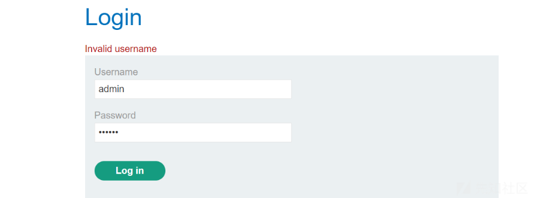](https://xzfile.aliyuncs.com/media/upload/picture/20240121191853-dc2d4cf8-b84e-1.png)  
随后直接使用抓取登录的数据报文并设置用户名为变量加载字典进行暴力猜解  
[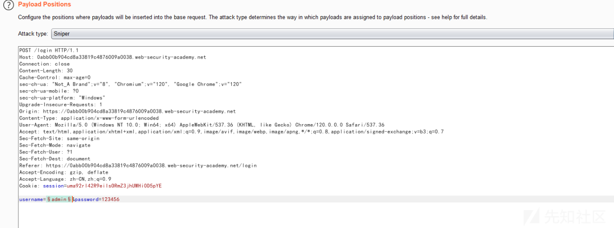](https://xzfile.aliyuncs.com/media/upload/picture/20240121191905-e3116946-b84e-1.png)  
此时的我们主要根据响应报文的长度来确定是否猜解成功——用户名puppet  
[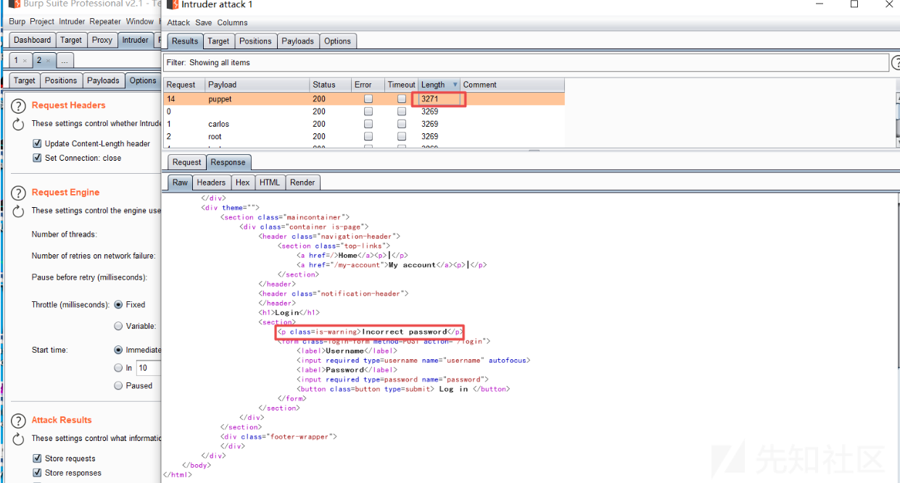](https://xzfile.aliyuncs.com/media/upload/picture/20240121191917-ea579536-b84e-1.png)  
使用上面猜解到的正确的用户名，构造一个密码变量并通过BP对密码进行猜解，根据回显的状态来判断是否成功猜解到密码——302登录后跳转，密码为monitor  
[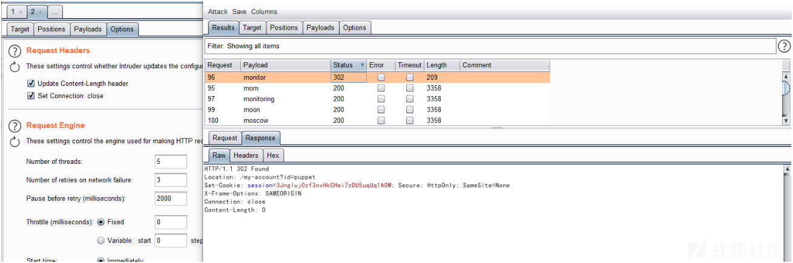](https://xzfile.aliyuncs.com/media/upload/picture/20240121191928-f12ac630-b84e-1.png)

### 地址绕过(思路)

在攻击者成功猜解到帐户之前往往会涉及许多失败的猜测，从逻辑上讲暴力保护需要围绕着尽可能巧妙地实现过程自动化并降低攻击者尝试登录的速度，防止暴力攻击的两种最常见的方法是账户锁定和IP地址锁定，这两种方法都提供了不同程度的保护，但是都不是无懈可击的，尤其是在使用有缺陷的逻辑实现的情况下，例如：如果您多次登录失败，有时可能会发现您的IP被阻止，在某些系统中你会发现如果IP所有者成功登录，那么失败尝试次数的计数器将重置，这意味着攻击者只需每隔几次尝试就登录一次自己的帐户就可以防止达到此限制，从而实现绕过，下面我们通过要给示例来进行简单的介绍  
在我们登录WEB系统时，我们发现密码尝试3失败之后会被锁定IP地址  
[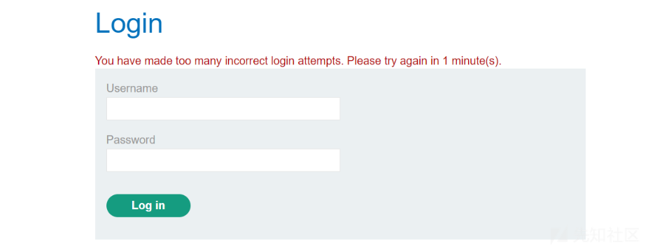](https://xzfile.aliyuncs.com/media/upload/picture/20240121191946-fbf44212-b84e-1.png)  
但是当我们使用正确的自己的账户登录一次后锁定的IP计数器会被重置，也就是说此时的我们自己的账户密码就相当于一个解锁的Key  
[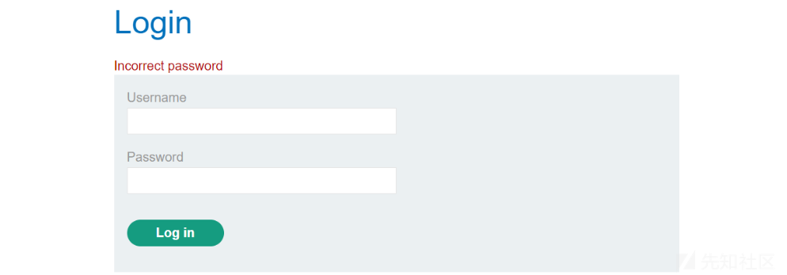](https://xzfile.aliyuncs.com/media/upload/picture/20240121191958-02ab4bb4-b84f-1.png)  
基于以上测试我们可以在构造如下字典进行暴力猜解：

```plain
#用户名字典
自己的用户名
受害者用户名
自己的用户名
受害者用户名
.......

#密码字典
自己的密码
待猜解的密码1
自己的密码
待猜解的密码2
自己的密码
待猜解的密码3
自己的密码
待猜解的密码4
......
```

上述的字典其实就是一个解锁、猜解、解锁IP、猜解....的循环反复的一个过程，在burpsuite中设置变量并选择"Pitchfork"模式  
[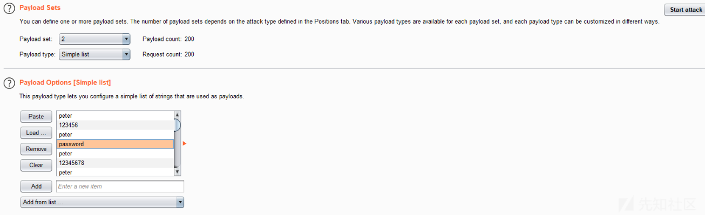](https://xzfile.aliyuncs.com/media/upload/picture/20240121192118-32b8249e-b84f-1.png)  
随后我们选择status为302的我们的目标用户的条目即可获取对应的密码，当然这还是得基于密码字典的强大的基础之上，同时需要注意的一个点时在这里我们需要按序进行发送，所以需要将线程设置成为1，使其按照我们给定的字典中的次序依次进行，规避被封IP的风险  
[](https://xzfile.aliyuncs.com/media/upload/picture/20240121192130-3966cbec-b84f-1.png)

### 账户锁定

网站试图防止暴力猜解的一种方法是如果满足某些可疑标准(通常是一组失败的登录尝试)则锁定帐户，虽然有时候前端会给出一些模糊提示，但是这种锁定机制往往可能会导致用户模糊提示变得不再模糊，这么说可能大家有点不太理解，下面我们通过一个示例来进行介绍

尝试登陆时提示用户名或密码错误  
[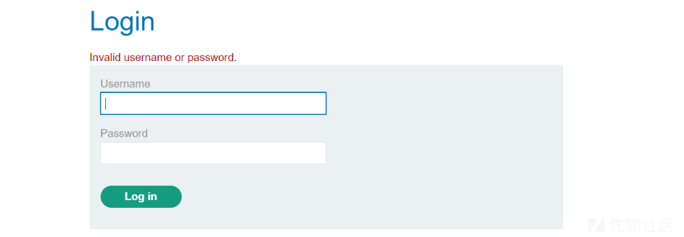](https://xzfile.aliyuncs.com/media/upload/picture/20240121192147-43ad1444-b84f-1.png)  
随后我们捕获登录认证数据包并设置用户名变量和密码变量，这里的密码变量我们选择Null有效载荷类型，然后选择生成5个有效载荷的选项  
[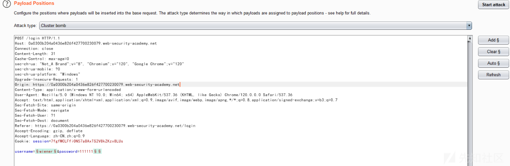](https://xzfile.aliyuncs.com/media/upload/picture/20240121192158-4a471278-b84f-1.png)  
这将有效地导致每个用户名重复5次  
[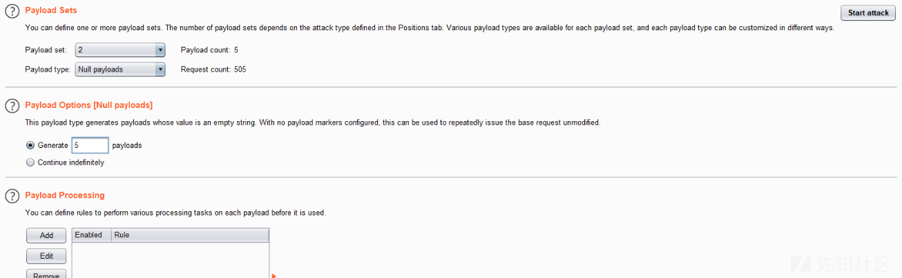](https://xzfile.aliyuncs.com/media/upload/picture/20240121192207-50072dba-b84f-1.png)  
在结果中我们可以看到这里有一个用户名的响应比使用其他用户名时的响应长，仔细研究响应会注意到其中包含一条不同的错误消息  
[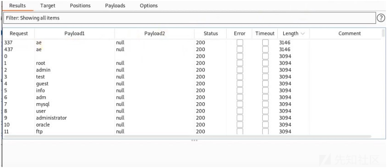](https://xzfile.aliyuncs.com/media/upload/picture/20240121192218-560958b4-b84f-1.png)  
由此我们可以确定此用户存在，随后我们便可以对密码进行猜解了，同样的道理，我们可以在错误的提示信息中发现有一个不一样的信息，从而得到最终的密码  
[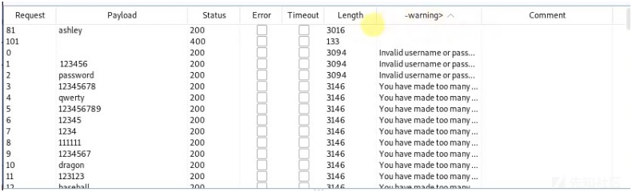](https://xzfile.aliyuncs.com/media/upload/picture/20240121192227-5b87edbe-b84f-1.png)

### 频次限制(思路)

网站试图防止暴力猜解攻击的另一种方法是对用户速率进行限制，在这种情况下短时间内发出过多的登录请求会导致您的IP地址被阻止，通常IP只能通过以下方式之一解除阻止：

-   经过一定时间后自动解封
-   通过后台的管理员手动解封
-   成功完成验证码后由用户手动操作

用户速率限制有时比帐户锁定更可取，因为它不太容易受到用户名枚举和拒绝服务攻击，然而它仍然不是完全安全的，攻击者可以通过多种方式操纵其明显的IP以绕过块，由于限制是基于从用户IP地址发送的HTTP请求的速率，因此如果您能够通过一个请求猜出多个密码，那么有时也可以绕过这种防御，下面我们通过一个示例进行说明：

在Burpsuite的捕获到的用户登录账户密码请求报文发送到Repeater中，然后将密码的单个字符串值替换为包含所有候选密码的字符串数组

```plain
"username" : "carlos",
"password" : [
    "123456",
    "password",
    "qwerty"
    ...
]
```

发送请求这将返回302响应

[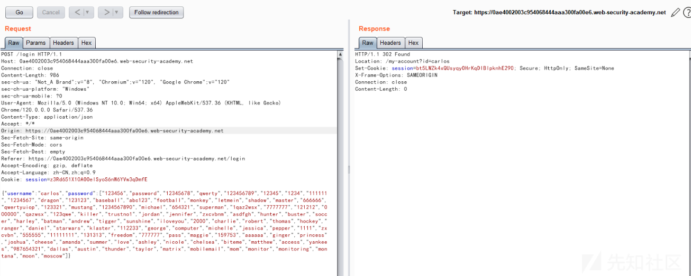](https://xzfile.aliyuncs.com/media/upload/picture/20240121192309-74964058-b84f-1.png)  
右键单击此请求，然后选择"在浏览器中显示响应"，复制URL并将其加载到浏览器中

[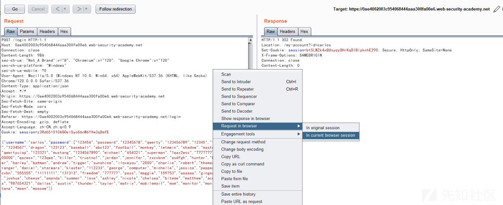](https://xzfile.aliyuncs.com/media/upload/picture/20240121192321-7bc12dfc-b84f-1.png)  
页面加载后您将以carlos身份登录  
[](https://xzfile.aliyuncs.com/media/upload/picture/20240121192330-815840ca-b84f-1.png)

## 多因子类

### 基本介绍

双因子认证(Two-Factor Authentication，2FA)是一种身份验证方法，要求用户提供两个独立的身份验证因素来确认其身份，其中的第一个身份因素即为"What you know(你知道的东西)"，第二个身份因素即为"What youhave(你所拥有的东西)"或者"What you are(你所具有的特征)"，双因子认证与传统的用户名和密码认证相比提供了更高的安全性，因为攻击者需要同时获取两个因素才能成功通过身份验证

### 认证流程

双因子身份认证的工作流程大致如下：

-   用户发起登录或敏感操作：用户在登录网站、应用程序或进行敏感操作时触发身份验证过程
-   用户提供第一个身份因素：用户提供第一个身份验证因素，通常是用户名和密码
-   第一个身份因素验证操作：系统接收到用户名和密码后，验证这些凭据是否正确。如果验证成功，将继续进行下一步
-   用户提供第二个身份因素：用户需要提供第二个身份验证因素，通常是物理设备上的代码、令牌或证书
-   第二个身份因素验证操作：系统接收到第二个因素后，验证其与用户账户关联的信息是否匹配
-   用户双因子身份验证通过：如果第一因素和第二因素均验证通过，则用户的身份得到确认，可以继续访问账户或执行敏感操作

### OPT技术

OTP(One-Time Password，一次性密码)技术是一种常见的身份验证方法，用于在每次身份验证过程中生成一次性的、临时的密码，该密码只能在特定时间段内使用并且在使用后立即失效，提供了额外的安全性保护

OTP的工作流程如下：

-   用户在进行身份验证时，系统会生成一个基于OTP算法的一次性密码
-   系统将该密码发送给用户通过预先配置的通信渠道(例如:短信、电子邮件、身份验证应用程序等)
-   用户在身份验证过程中输入所接收到的一次性密码
-   系统验证用户输入的密码是否与生成的密码匹配，从而验证用户的身份

OTP的实现方式主要有以下几种：

-   时间同步OTP(Time-based OTP，TOTP)：基于时间的OTP使用时钟同步机制生成一次性密码，用户和系统之间共享一个密钥，结合当前时间生成密码，常见的实现包括Google Authenticator和Microsoft Authenticator等应用程序
-   基于计数器的OTP(HMAC-based OTP，HOTP)：基于计数器的OTP，使用哈希算法生成一次性密码，用户和系统之间共享一个密钥和计数器，每次使用时计数器增加，常见的实现包括YubiKey硬件令牌

### 认证实现

下面是几种常见的双因子认证实现技术：

#### 软件令牌

实现方式：用户在登录时会收到一条包含验证码的短信，系统会将用户输入的验证码与发送到用户手机的验证码进行比对，如果验证成功则允许进行下一步操作  
简易示例：当用户登录谷歌账户时谷歌身份验证器应用程序会生成一个动态验证码，用户需要在登录过程中输入正确的验证码以完成身份验证

[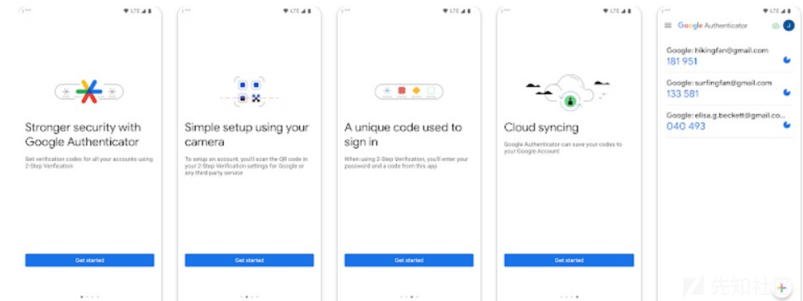](https://xzfile.aliyuncs.com/media/upload/picture/20240121192436-a851c1ba-b84f-1.png)

#### 硬件令牌

实现方式：硬件令牌通常是一个小型的物理设备，用户需要按下按钮或通过其他方式激活令牌，生成一次性的动态验证码  
简易示例：中国银行的U盾身份认证

[](https://xzfile.aliyuncs.com/media/upload/picture/20240121192450-b10f13ac-b84f-1.png)

#### SMS 2FA

实现方式：用户尝试登录应用程序或服务时会用到短消息服务(SMS)和文本消息2FA因素，SMS消息将被发送到用户的移动设备，其中包含用户随后输入到应用程序或服务的唯一代码，银行和金融服务部门曾使用这类2FA因素，用于验证客户在线银行账户的购买和变更情况，但是考虑到文本消息容易被拦截，他们通常会放弃此选项，同时等保测评中也不建议使用此类方法  
简易示例：用户登录时第二部要求用户输入短信验证码

[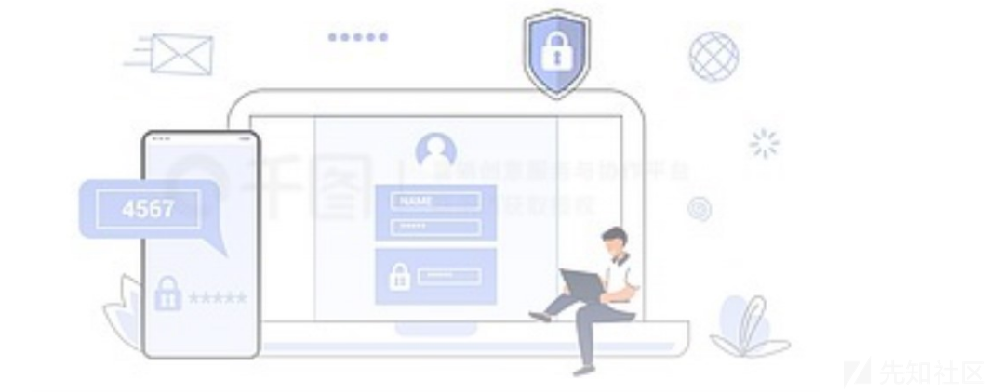](https://xzfile.aliyuncs.com/media/upload/picture/20240121192503-b8a3e0d4-b84f-1.png)

#### 推送认证

实现方式：用户在进行登录或者敏感操作时进行消息的推送并要求用户进行授权操作  
简易案例：用户操作认证授权操作

[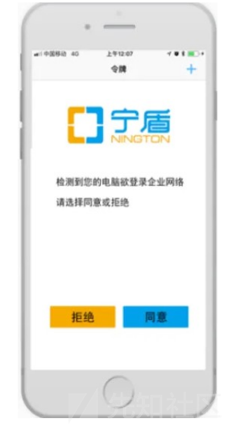](https://xzfile.aliyuncs.com/media/upload/picture/20240121192516-c04bcc34-b84f-1.png)

### 安全风险

验证码通常由用户从某种物理设备上读取，许多高安全性网站现在为用户提供了专用设备，例如：RSA Token或键盘设备，您可以使用这些设备访问网上银行或工作笔记本电脑，除了专门为安全性而构建之外这些专用设备还具有直接生成验证码的优点，出于同样的原因，网站使用专用的移动应用程序(例如:谷歌验证器)也很常见，另一方面一些网站将验证码作为短信发送到用户的手机。虽然这在技术上仍在验证"你拥有的东西"的因素，但它很容易被滥用，首先代码是通过短信发送的，而不是由设备本身生成的，这就产生了代码被截获的可能性，还有SIM卡交换的风险，攻击者通过欺诈获得带有受害者电话号码的SIM卡，然后攻击者将接收发送给受害者的所有短信，包括包含其验证码的短信

### 认证绕过

双因子身份验证的实现有时候也会存在缺陷，甚至可以完全绕过它，如果首先提示用户输入密码，然后在单独的页面上提示用户输入验证码，则用户在输入验证码之前实际上处于"已登录"状态，在这种情况下我们需要留意的是，在完成第一个身份验证步骤后是否可以直接跳到"仅登录"页面，有时候你会发现网站在加载页面之前并没有真正检查你是否完成了第二步，下面我们通过环境进行一个简单演示

首先我们登录自己的账户  
[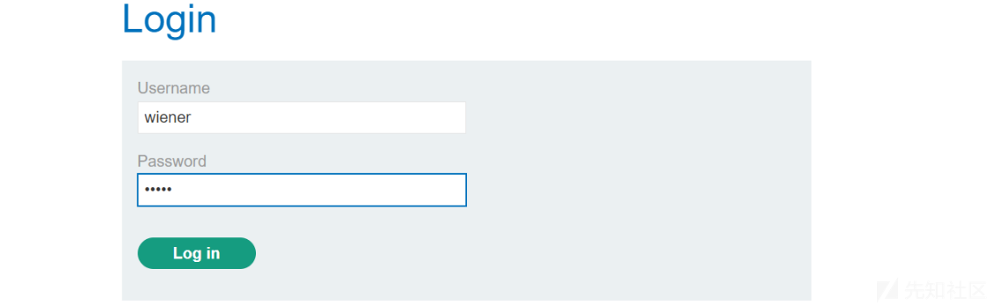](https://xzfile.aliyuncs.com/media/upload/picture/20240121192600-dabd7f7c-b84f-1.png)  
此时会出现一个验证码验证的提示框，

[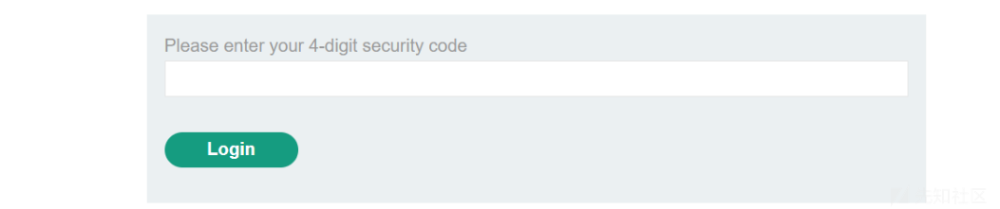](https://xzfile.aliyuncs.com/media/upload/picture/20240121192610-e0d416f0-b84f-1.png)

而我们的邮箱客户端会收到一个验证码：  
[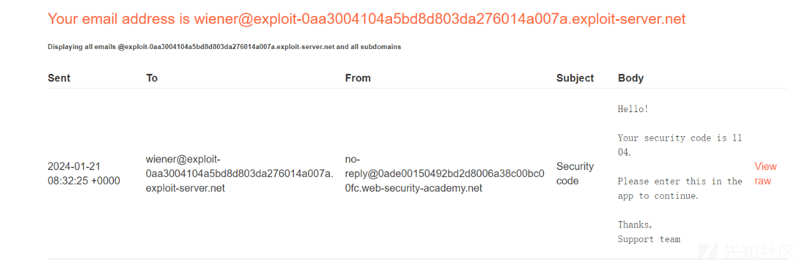](https://xzfile.aliyuncs.com/media/upload/picture/20240121192621-e6f9444c-b84f-1.png)  
随后我们记录下我们的URL  
[https://0ade00150492bd2d8006a38c00bc00fc.web-security-academy.net/my-account?id=wiener](https://0ade00150492bd2d8006a38c00bc00fc.web-security-academy.net/my-account?id=wiener)

[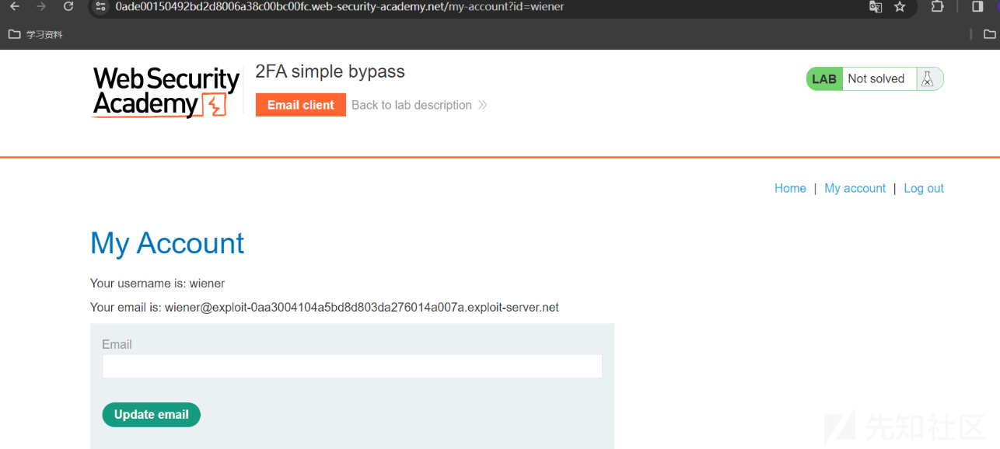](https://xzfile.aliyuncs.com/media/upload/picture/20240121192633-ee1e4e7a-b84f-1.png)  
然后退出我们自己的用户，并使用另外一个用户carlos:montoya进行登录操作  
[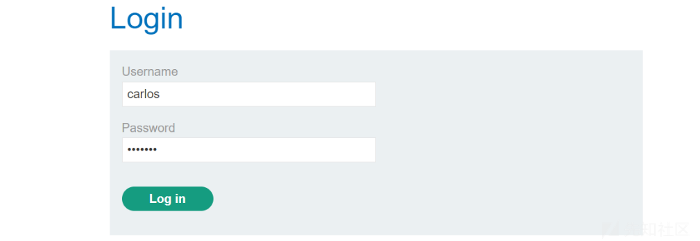](https://xzfile.aliyuncs.com/media/upload/picture/20240121192642-f395419c-b84f-1.png)  
然后在我们的第二步的因子验证中我们直接构造URL跳过验证，完成对多因子认证的绕过  
[https://0ade00150492bd2d8006a38c00bc00fc.web-security-academy.net/my-account?id=carlos](https://0ade00150492bd2d8006a38c00bc00fc.web-security-academy.net/my-account?id=carlos)  
[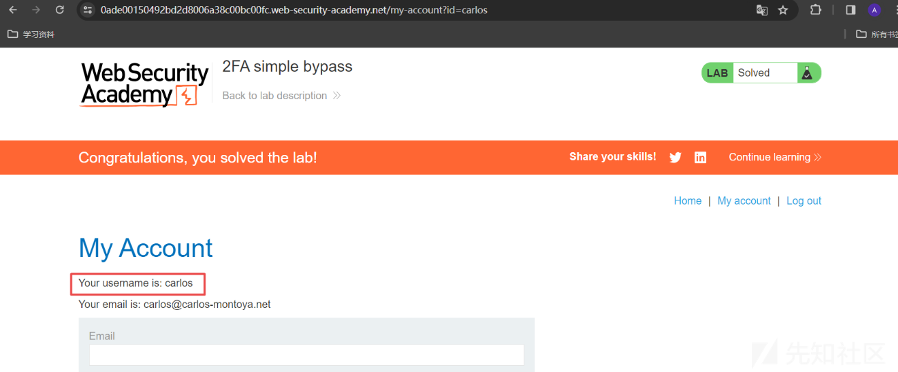](https://xzfile.aliyuncs.com/media/upload/picture/20240121192653-fa5ef3d8-b84f-1.png)

### 逻辑缺陷

在一些情况下我们可能会遇到在用户完成初始登录步骤后，网站无法充分验证同一用户是否正在完成第二步，例如：用户在第一步中使用其正常凭据登录

```plain
POST /login-steps/first HTTP/1.1
Host: vulnerable-website.com
...
username=carlos&password=qwerty
```

在进入登录过程的第二步之前他们将被分配一个与其帐户相关的cookie

```plain
HTTP/1.1 200 OK
Set-Cookie: account=carlos
```

提交验证码时请求使用此cookie来确定用户试图访问的帐户

```plain
POST /login-steps/second HTTP/1.1
Host: vulnerable-website.com
Cookie: account=carlos
...
verification-code=123456
```

在这种情况下攻击者可以使用自己的凭据登录，但在提交验证码时会将帐户cookie的值更改为任意用户名，如果攻击者能够强行使用验证码，这将是极其危险的，因为这将允许他们完全基于用户名登录任意用户的帐户，他们甚至不需要知道用户的密码

```plain
POST /login-steps/second HTTP/1.1
Host: vulnerable-website.com
Cookie: account=victim-user
...
verification-code=123456
```

下面我们通过一个示例进行演示说明：  
首先登录自己的账户熟悉2FA的验证过程，可以看到"POST /login2"请求中的verify参数用于确定正在访问哪个用户的帐户  
[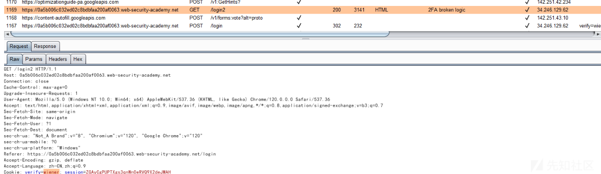](https://xzfile.aliyuncs.com/media/upload/picture/20240121192801-22e9d674-b850-1.png)  
随后我们将上述请求发送到repeat模块并将verify参数更改为carlos后发送请求，发现可以为Carlos生成临时2FA代码  
[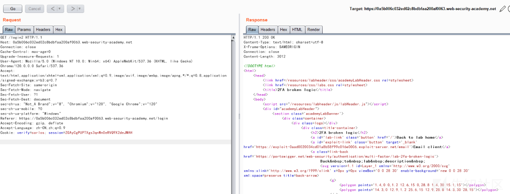](https://xzfile.aliyuncs.com/media/upload/picture/20240121192811-28eba3a4-b850-1.png)  
随后我们使用自己的账户登录并输错一次验证码诱导重新发送验证码  
[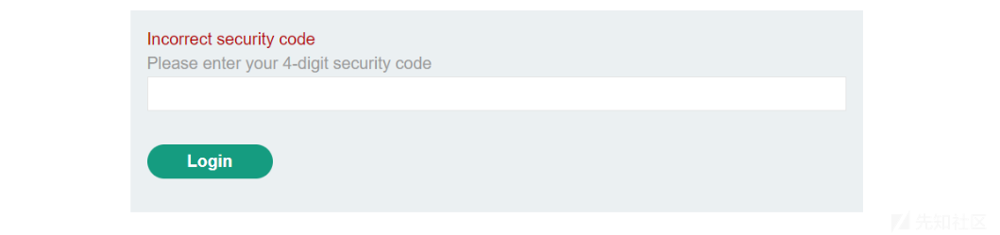](https://xzfile.aliyuncs.com/media/upload/picture/20240121192821-2e74b1d0-b850-1.png)

随后在burpsuite中捕获到数据报文，然后发送到Intruder模块，更改用户名为carlos并对验证码进行猜解  
[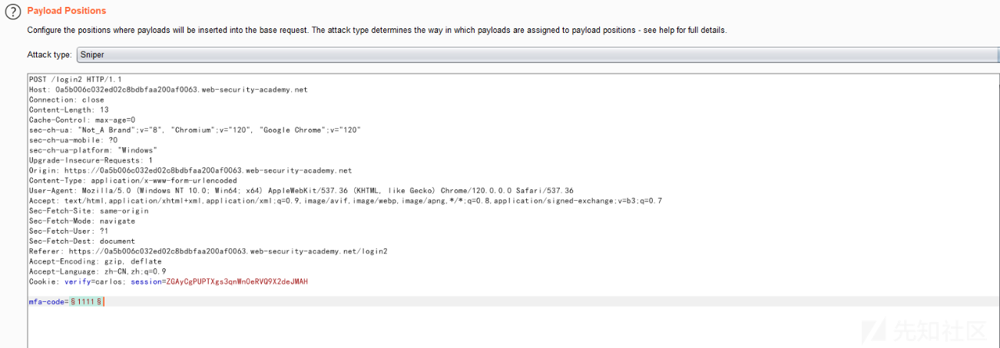](https://xzfile.aliyuncs.com/media/upload/picture/20240121192830-3446f1b8-b850-1.png)  
随后我们留意302的status即可，然后再浏览器中打开实现登录操作  
[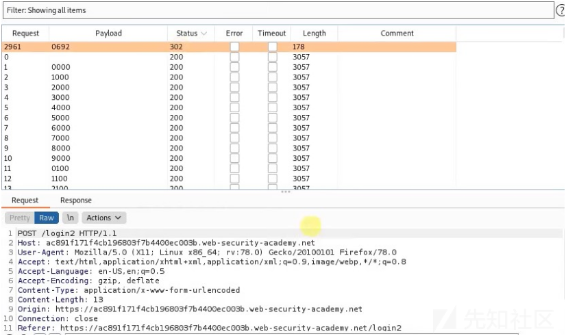](https://xzfile.aliyuncs.com/media/upload/picture/20240121192843-3baa3f5a-b850-1.png)  
随后完成对密码的验证绕过，直接接管账户  
[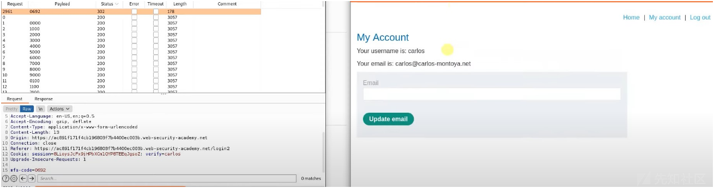](https://xzfile.aliyuncs.com/media/upload/picture/20240121192852-413e8cb4-b850-1.png)

### 暴力猜解(思路)

网站采取措施防止2FA验证码的暴力猜解很是重要，因为code通常是一个简单的4或6位数，如果没有足够的暴力保护，破解这样的代码是微不足道的，部分网站试图通过在用户输入一定数量的错误验证码时自动将其注销来防止这种情况的发生，这在实践中是无效的，因为高级攻击者甚至可以通过为Burp Intruder创建macros来自动执行这一多步骤过程，Turbo Intruder扩展也可用于此目的

首先使用carlos账户登录，此时来到第二步，如果我们输入两次错误的代码，您将再次注销

[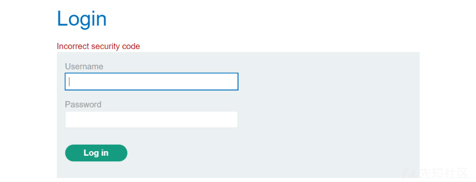](https://xzfile.aliyuncs.com/media/upload/picture/20240121192911-4c6f1a9a-b850-1.png)  
随后在Burpsuite中选择"Project options-session"中选择"Session handling rule editor"，勾选"include all URLS"

[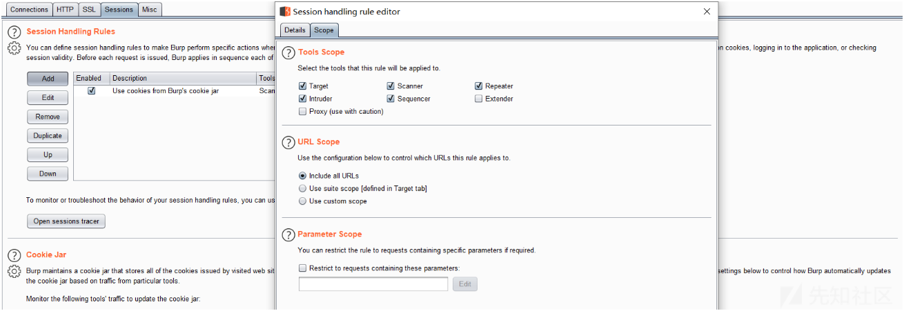](https://xzfile.aliyuncs.com/media/upload/picture/20240121192927-561c76aa-b850-1.png)  
随后创建一个宏，勾选这里的首次登录和第二步的验证以及第二步的重新验证请求报文

[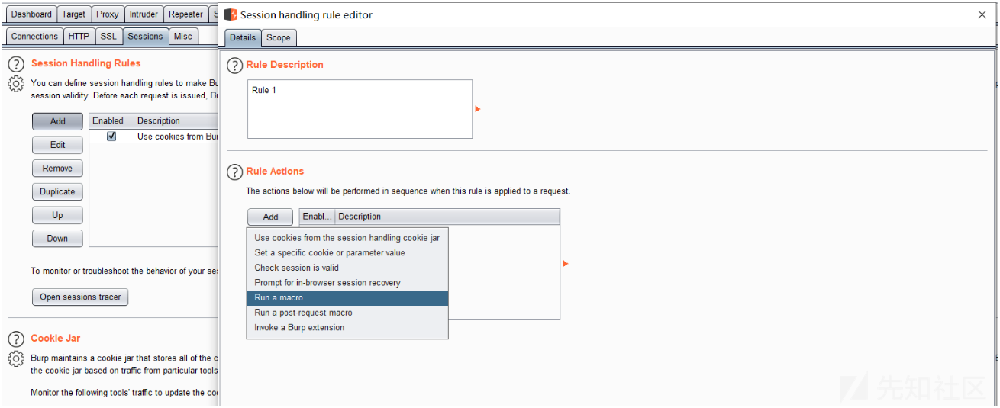](https://xzfile.aliyuncs.com/media/upload/picture/20240121192937-5be68cc4-b850-1.png)

[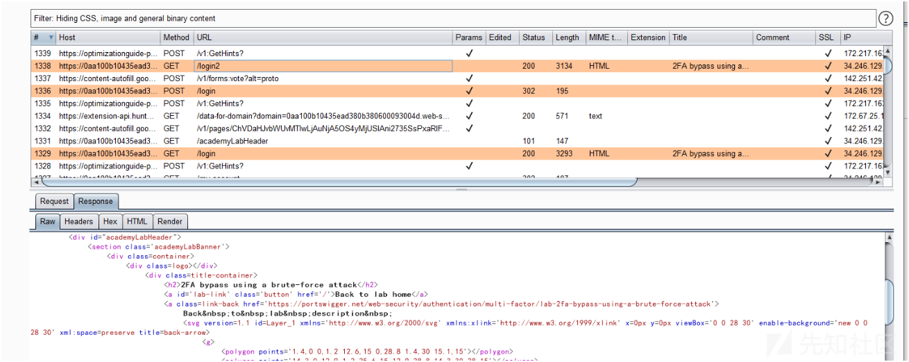](https://xzfile.aliyuncs.com/media/upload/picture/20240121192944-6058c150-b850-1.png)  
随后进行一个简单的测试  
[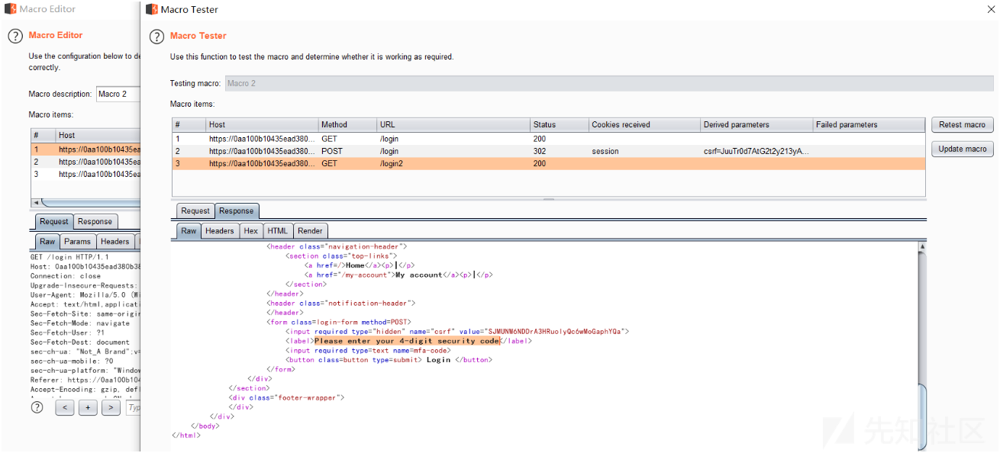](https://xzfile.aliyuncs.com/media/upload/picture/20240121192956-673c082e-b850-1.png)  
随后将第三个login2的报文发送到intruder模块中去，设置mfa-code为变量  
[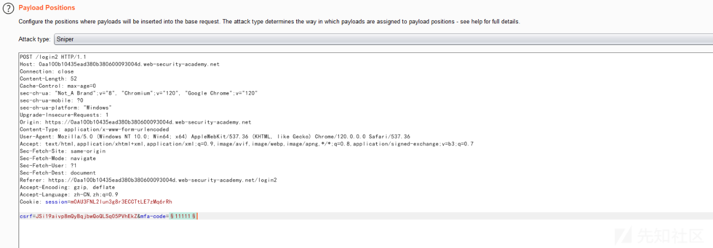](https://xzfile.aliyuncs.com/media/upload/picture/20240121193007-6df67474-b850-1.png)  
设置变量  
[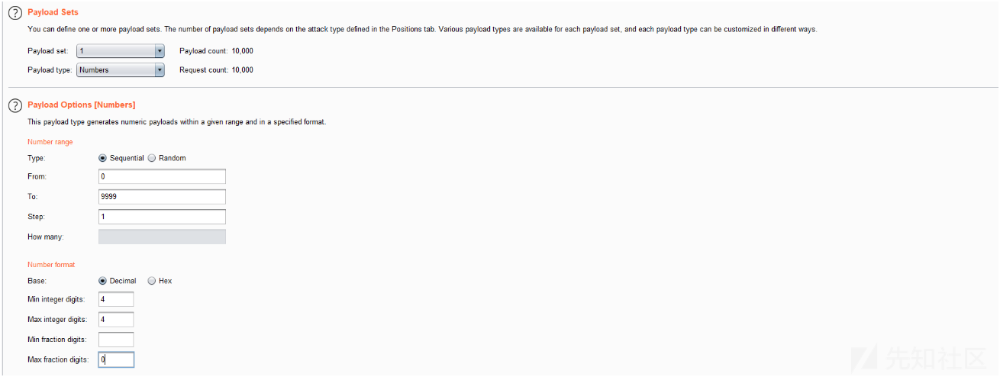](https://xzfile.aliyuncs.com/media/upload/picture/20240121193017-741beba4-b850-1.png)  
核心的一个点是需要设置为单线程，随后开始跑，经过长时间的跑之后我们会得到一个302的跳转  
[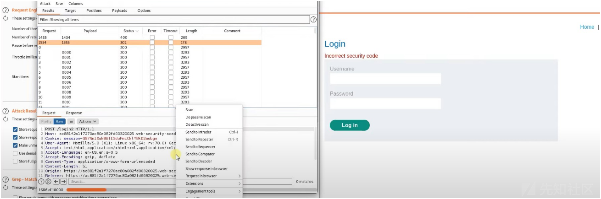](https://xzfile.aliyuncs.com/media/upload/picture/20240121193029-7adad8c4-b850-1.png)  
随后在浏览器中直接打开即可以carlob身份登录  
[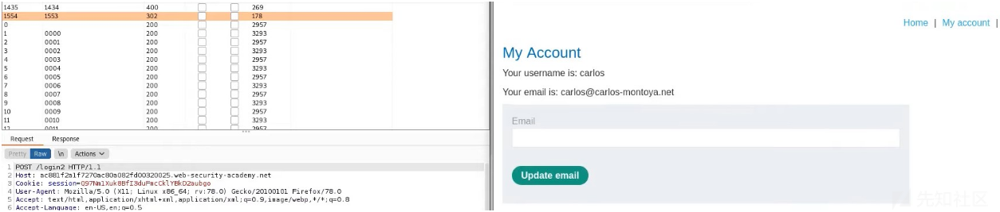](https://xzfile.aliyuncs.com/media/upload/picture/20240121193044-842ded80-b850-1.png)

## 其他缺陷

### 会话保持

在一些网站中有一个比较常见的功能就是"Remember Me"或者"Keep me logged in"的功能，这使得用户即使在关闭浏览器会话后也可以选择保持登录状态，此功能通常通过生成某种"RememberMe"的Token来实现，然后将其存储在持久cookie中，由于拥有这个cookie可以有效地绕过整个登录过程，因此最好的做法是让这个cookie随机，然而一些网站基于静态值(例如:用户名和时间戳)的可预测串联生成此cookie，有些人甚至将密码作为cookie的一部分，如果攻击者可以自行创建自己的帐户，那么便可以对生成的Cookie进行深入研究并可能推断出它是如何生成的，一旦计算出了公式就可以强行使用其他用户的cookie来访问对应用户的帐户，下面我们通过一个示例进行简单介绍  
登录账户并使用burpsutie抓包，可以看到数据包中有一个"stay-logged-in"参数字段  
[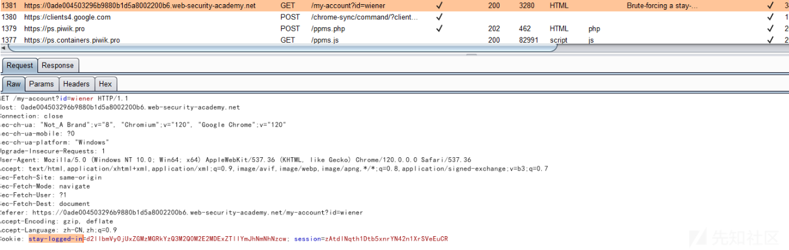](https://xzfile.aliyuncs.com/media/upload/picture/20240121193105-908479be-b850-1.png)  
通过简易尝试发现是使用的base64编码的，解密之后格式为

```plain
用户名：密码(MD5后的)
```

[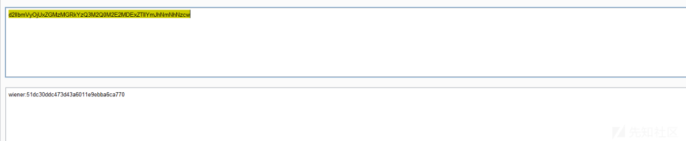](https://xzfile.aliyuncs.com/media/upload/picture/20240121193123-9b2726b4-b850-1.png)

[](https://xzfile.aliyuncs.com/media/upload/picture/20240121193130-9f3c2466-b850-1.png)

知道了规则之后我们就可以对其进行构造爆破猜解了，我们只需要按照下面的格式构造cookie即可

```plain
base64(username:md5(passwd))
```

[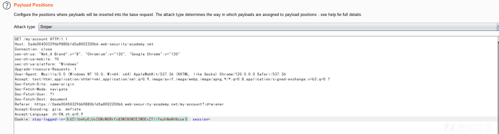](https://xzfile.aliyuncs.com/media/upload/picture/20240121193210-b7693768-b850-1.png)  
[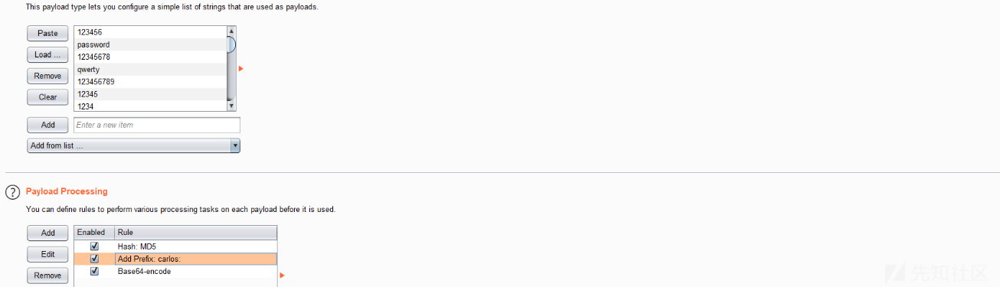](https://xzfile.aliyuncs.com/media/upload/picture/20240121193217-bb64a4f6-b850-1.png)  
随后成功猜解到凭据

[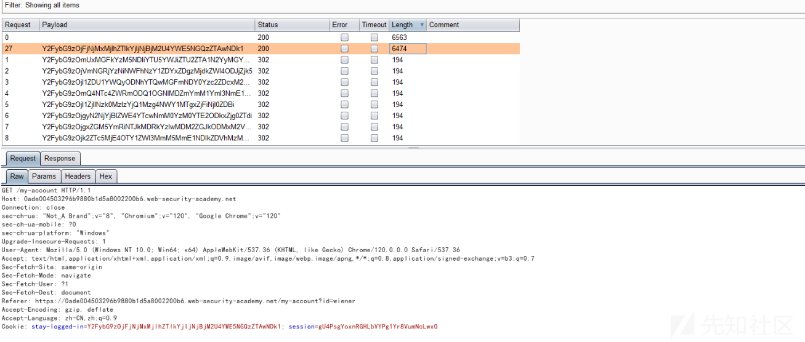](https://xzfile.aliyuncs.com/media/upload/picture/20240121193231-c388e476-b850-1.png)  
直接登录：

[](https://xzfile.aliyuncs.com/media/upload/picture/20240121193253-d0db104a-b850-1.png)

上面我们是基于攻击者可以创建自己的账户，随后根据自己的账户密码以及对应的cookie的特征进行分析得出的构造过程，其实即使攻击者无法创建自己的帐户，他们仍然有可能利用此漏洞进行攻击，他们可以通过使用XSS等常用技术窃取另一个用户的"Remember Me"的Cookie并由此推断出cookie是如何构建的，如果网站是使用开源框架构建的，cookie构建的关键细节甚至可能会被公开记录，在某些罕见的情况下可能会从cookie中以明文形式获得用户的实际密码，即使它是经过哈希处理的，众所周知的密码列表的哈希版本可以在线获得，因此如果用户的密码出现在其中一个列表中，那么解密哈希有时会像将哈希粘贴到搜索引擎中一样微不足道，这也证明了salt在有效加密中的重要性

### 密码重置

Web应用系统在提供给用户保持登录的功能的同时也提供了密码重置功能，在用户忘记密码的情况下，基于密码的身份验证显然是不可能的，网站必须依靠其他方法来确保真正的用户正在重置自己的密码，常见的有通过邮箱进行密码重置和短信重置、URL重置等方法，下面我们通过一个重置示例进行漏洞的演示：  
网站登陆时提供了密码重置业务逻辑设计，我们通过填写用户名的方式以邮件方式重置用户密码

[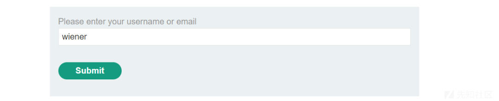](https://xzfile.aliyuncs.com/media/upload/picture/20240121193310-db326fc0-b850-1.png)

邮箱中收到的重置密码连接如下所示：  
[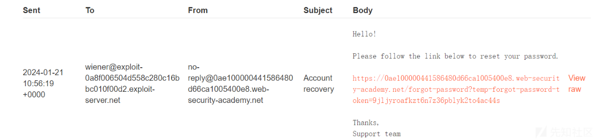](https://xzfile.aliyuncs.com/media/upload/picture/20240121193320-e1029c9a-b850-1.png)  
点击之后来到一个重置密码的操作界面，只需要输入新的密码完成重置并进行登录  
[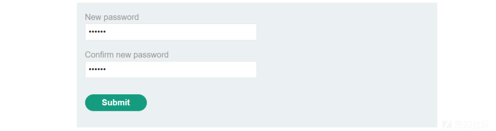](https://xzfile.aliyuncs.com/media/upload/picture/20240121193332-e8418f48-b850-1.png)  
[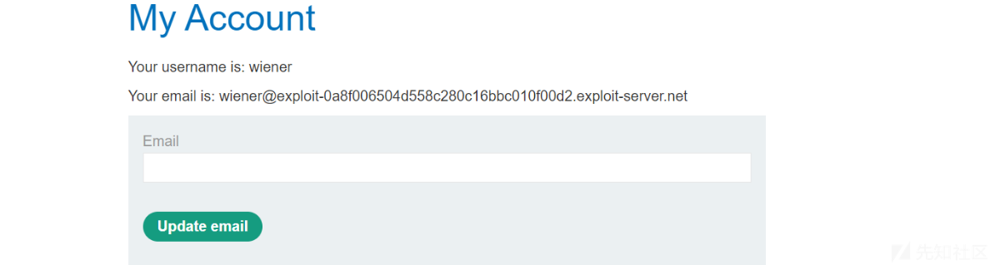](https://xzfile.aliyuncs.com/media/upload/picture/20240121193337-eada03d4-b850-1.png)  
在burpsuite中我们发现在重置的时候并没有对Token进行校验，没有校验，没有校验，这是很关键的一个点，更加关键的点是用户名可控

[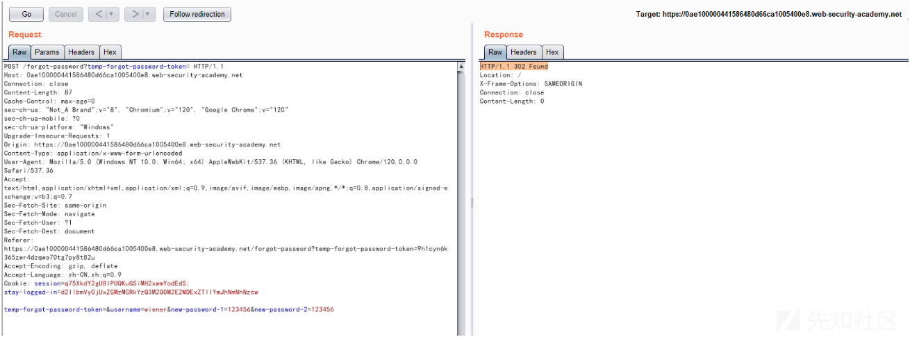](https://xzfile.aliyuncs.com/media/upload/picture/20240121193347-f10aac5e-b850-1.png)  
于是乎我们可以实现对任意用户的密码重置操作

[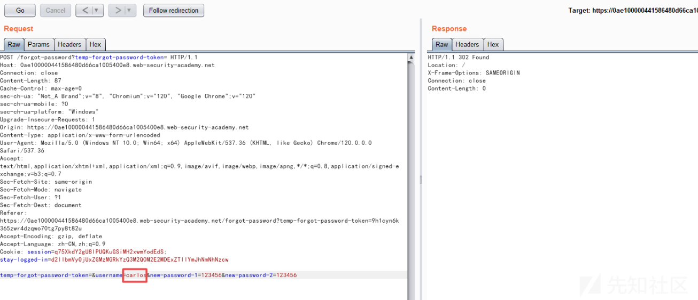](https://xzfile.aliyuncs.com/media/upload/picture/20240121193358-f7687996-b850-1.png)

[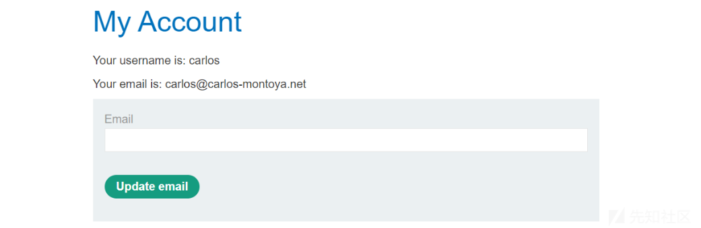](https://xzfile.aliyuncs.com/media/upload/picture/20240121193403-fa761242-b850-1.png)

## 文末小结

本篇文章我们通过前面的单因子身份认证(基于密码的身份认证)引出了核心内容双因子身份认证，随后对双因子身份认证的流程、技术、实现等内容进行介绍，期间穿插了不少新的思路以及利用方式，随后通过几个示例对双因子身份认证中存在的安全风险点进行了刨析，同时对身份认证中的几个共同点(会话保持、密码重置)等内容进行了简易的扩充

## 参考连接

[https://portswigger.net/web-security/authentication/multi-factor](https://portswigger.net/web-security/authentication/multi-factor)  
[https://portswigger.net/web-security/authentication/password-based](https://portswigger.net/web-security/authentication/password-based)  
[https://baike.baidu.com/item/%E5%8F%8C%E9%87%8D%E8%AE%A4%E8%AF%81/23316068?fr=aladdin](https://baike.baidu.com/item/%E5%8F%8C%E9%87%8D%E8%AE%A4%E8%AF%81/23316068?fr=aladdin)
