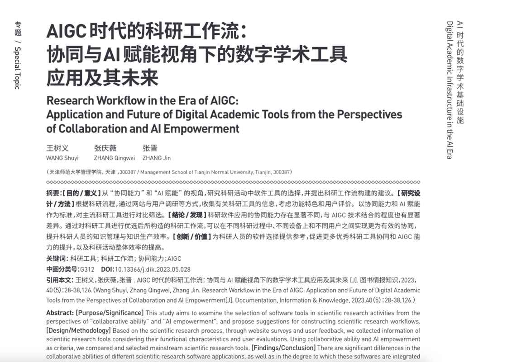
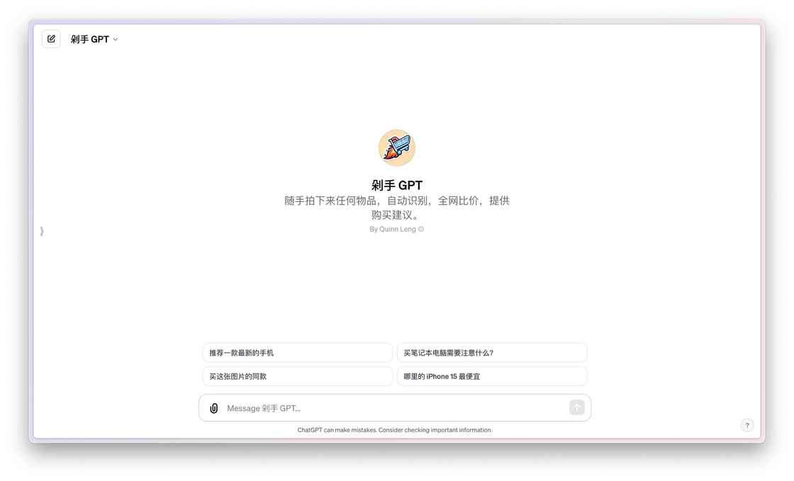

# 哪些 GPTs 应用让我眼前一亮？你又该如何找到它们？ - 少数派

你都用到了哪些惊艳的 GPTs 应用呢？

## **浪潮**

OpenAI 开发者大会后，你不难发现创建定制化 GPTs 应用变得非常简单，致使众多创新者纷纷进入这一领域。我使用 DALL・E3 技术，在 ChatGPT 中绘制了一幅图，描绘这一场景。

机器人们在劈风斩浪，众多人类作壁上观，你觉得这种形容是否贴切呢？

我自己也开发了两款 GPTs 应用。[一款基础查询工具](https://sspai.com/post/84325) Article Assistant 用于《玉树芝兰》已发布公众号文章搜索，接着我开发了 [一个升级版 Note Insighter。](https://mp.weixin.qq.com/s/l9wMEbFh2Y1HHJeP5CanZA)

这款改进型应用增添了跳转对应文章链接功能，并融合了我在「知识星球」上的文章内容。

关于这两款应用，我分别撰写了介绍文章，你可以参考我的 [公众号](https://sspai.com/post/84325) 和 [知识星球](https://sspai.com/link?target=https%3A%2F%2Farticles.zsxq.com%2Fid_cqd7c4saidwc.html)。如果你喜好视觉学习，也可以 [参考这个视频](https://www.bilibili.com/video/BV1z94y137Ph/?spm_id_from=333.999.0.0)。

今天，咱们把视野放得更加宏大一些。我将为你介绍四种类别的 GPTs 应用：学习、科研、购物以及…… 至于第四种嘛，将在稍后揭晓。

## **学习**

首先，让我们来看看学习方面的应用。

我给你推荐一个称作「Universal Primer」的工具。直译成中文，可能叫做「通用引物」吧。它可以协助你学习各类知识。这款工具是由网友 Gilgamesh 推荐给我的。

我要求它介绍一下 ChatGPT 的训练原理。

Universal Primer 会迅速回应，详细解释包括神经网络基础、大量数据输入、自我学习过程、优化调整以及特定任务训练的全过程。

最吸引人的是，Universal Primer 不仅提供答案，还会询问：「在我们继续深入之前，我想了解一下您对神经网络和自然语言处理的了解程度。您对这些领域了解多少？这将帮助我调整后续的解释，以便更好地适应您的知识水平。」

这种以学习者为中心的服务理念，使学习过程变得更加亲切和个性化。否则如果只是机械地讲解，不顾接受方的知识基础，学习者可能很快就会失去兴趣。通过询问用户的知识水平提供定制化的解释，才能做到**有的放矢和个性化教学**。

我告诉它，请将我视为初学者。Universal Primer 回答：「我会使用简单的语言和类比来解释，从神经网络和自然语言处理的基础开始。」

果然 Universal Primer 用了一些生动的类比，比如邮局和音量旋钮等，使复杂的概念变得易于理解。

它接着通过类比介绍了自然语言处理的基础。

然后是 ChatGPT 的训练过程，也有详细而形象的介绍。

每一步的介绍，Universal Primer 都用形象的类比来阐述。我暗道，随着这东西今后不断改进增强，可能真的会成为学生们不可或缺的私人助教了。

## **科研**

在科研领域，GPT 应用的多样性令人咂舌。我的感受如同刘姥姥初入大观园一般。

你看这个 GPTs 应用清单，列出了 21 种不同类型的工具，并且做了介绍。一下子引起我兴趣的是第四个 —— Academic Research Reviewer —— 它能对研究论文进行全面审查并提出改进建议。假设你是个研究生，需要把论文提交导师之前，进一步完善论文草稿，那它至少能帮助你拓展思路，提出改进方案。

我尝试使用 Academic Research Reviewer，上传了我 10 月份发表的论文《[AIGC 时代的科研工作流：协同与 AI 赋能视角下的数字学术工具应用及其未来](https://sspai.com/link?target=https%3A%2F%2Fkns.cnki.net%2Fkcms2%2Farticle%2Fabstract%3Fv%3DPk5Eu7LuuI7uwzWbwMaASHtb0rSBJNbDTOZyNsEUVaK1OwuOdYvRZN1KWMZnPv-0QLS8bwA7x-6OPFZSvjFx8T7iG2bBORaHkaw3XwKrcxNmXemaa3Qity26mbwLWDHuOVZF_vC86w8%253D%26uniplatform%3DNZKPT%26language%3DCHS)》。

我询问它如何改进我的文献回顾部分，Academic Research Reviewer 果然很快提出了一些建议。

例如，Academic Research Reviewer 指出我的文献回顾主要集中在单一或特定类型的科研工具上，而对这些工具之间的协同能力和互动性讨论相对缺乏。它建议在文献回顾中加入对协同作用和集成应用的探讨。

这个建议非常有启发性。我又浏览了剩余部分的建议，虽然不是每个都极为新颖实用，但确实能激发作者一些新的思考，改进现有的文献回顾方式。这还只是文献回顾部分的建议，对于方法论介绍、数据汇报和讨论部分，同样可以通过 Academic Research Reviewer 快速获得有益的反馈和建议。建议你可以先拿已经发表的论文试试看。

咱们也不能光顾着学习和科研啊。接下来，让我们转向一个相对轻松的话题：购物。

## **购物**

这方面，我的朋友「[不说话的白菜](https://sspai.com/link?target=https%3A%2F%2Ftwitter.com%2Fquinn_leng)」开发了一个 GPTs 应用，名为「剁手 GPT」。你只需随手拍下任何物品，应用就能自动识别并在全网比价，提供购买建议。

我选择拍摄了我的 iPad mini。

上传照片后，「剁手 GPT」 应用开始识别。

「剁手 GPT」 准确地识别出平板电脑是 iPad，还识别出了 Touch ID，指出这通常是某些 iPad 型号的特点。它还提到配有一支触控笔，这通常适用于 iPad Pro 或 iPad Air 型号。很好嘛。

然后，「剁手 GPT」 询问我接下来想要做什么。我回答说我想购买同款产品。于是它开始搜索，先是进行普通搜索，然后进入了一些专业网站。

「剁手 GPT」 给了我一个详细的产品列表，但我注意到一个问题：它搜索到的是 iPad Pro 型号。

看来它没意识到我想要买的 iPad 实际上是 mini 版本。这意味着，它并没能通过笔与屏幕的相对尺寸判断出正确型号，这一点确实还有待改进提升。

我查看了他提供的 3 个链接，确实包含了多个零售商的信息，如官方网站、Best Buy 和亚马逊。

点击链接后，你可以直接访问亚马逊的购物页面。

这下问题来了，看好了商品找到了链接你就能卖吗？如果你是单身，这或许没问题。但如果家庭的财政大权不在你的手中，恐怕看好商品以后，你需要跟家人「商量」。

有的 GPTs 开发者充分考虑到了这一点，创建了一个名为「不想上楼」的应用。这个应用假设的情境是 —— 一个中年男性需要向妻子解释购物理由。你输入商品，GPTs 把建议说的话告诉你。

例如你问：

> 为什么我们家需要一台 12.9 寸 iPad Pro，加上一支 Apple Pencil 二代触控笔？

「不想上楼」这样帮你措辞:

假若你因此壮起胆量，试图购买更贵的东西呢？

> 为什么我们家需要一台高配 M3 Max Macbook Pro ？

你看看，出发点明明都是自己想要，但是阐述理由的时候句句不离家人的「切实需求」。古人说「世事洞明皆学问，人情练达皆文章」。其实，何止是文章啊，做应用「人情练达」，才能有这样的创意。不是吗？

创意归创意，你要是用这番说辞试图说服家人购物…… 后果别说是我，恐怕是应用开发者也不敢给你打包票吧？😜

## **查询**

面对市场上众多的 GPTs 应用，我们如何才能查找筛选出符合自己需求，也真正有用的来呢？实际上，细心的你可能已经发现，在我之前提到的科研类应用时列出过一个清单，对吧？

这就是我要给你介绍的第四类应用 —— 查询 GPTs 的 GPTs 。听起来像俄罗斯套娃，哈哈。

这类应用也有很多，其中我自己正在用的这个名为「GPTs 查找」，工具做得非常出色。

你看，当我提出「帮我找翻译类的 GPT」时，它列出了 13 个与翻译相关的 GPT，而且每个都有特色介绍和直达链接。

而当我问「帮我找英语教学的 GPT」时，结果更加令人兴奋 ——「GPTs 查找」直接找到了 24 个。

仅仅一周时间，就有这么多独具特色的英语教学 GPTs 出现，真是令人振奋。我不由慨叹：

> 学英语真的是刚需啊！

## **小结**

GPTs 的涌现让我们目不暇接，但我们不必急于追随每一个新潮流。稍作等待，观察市场反馈，不失为一种明智的策略。我相信不久的将来，会有基于官方或第三方的评分机制出现，为我们提供关于这些应用的口碑和评价。到那时，你就更有可能把有限的时间花在真正值得的 GPT 应用上，而不必惧怕「踩坑」了。

如果你发现了特别好用的 GPTs 应用，也欢迎在留言区分享。让我们一起探讨交流，找出那些真正值得尝试的 GPTs 工具。

祝 GPTs 应用使用愉快！

如果你觉得本文有用，请**充电**。

如果本文可能对你的朋友有帮助，请**转发**给他们。

欢迎**关注** [我的专栏「科研利器」](https://sspai.com/column/245)，以便及时收到后续的更新内容。

[点击这个链接加入少数派会员](https://sspai.com/prime/subscription?referral=314606736)，立享 9 折优惠！获得专属会员内容、会员播客以及会员定制周边。在更多的领域和方向帮你打开脑洞，找到新的兴趣点，与少数派一起洞悉当下，探索新知。

经验卷轴：入门学术论文写作

用二十余年的科研经验带你入门学术写作

¥59.00

去购买

## **延伸阅读**

-   [如何用 GPTs 构建自己的知识分身？（进阶篇）](https://mp.weixin.qq.com/s/l9wMEbFh2Y1HHJeP5CanZA)
-   [如何用自然语言 5 分钟构建个人知识库应用？我的 GPTs builder 尝试](https://sspai.com/post/84325)
-   [如何用 ChatGPT 一句话生成 Web 应用？](https://sspai.com/post/80135)
-   [如何用 GPT-4 全模式（All Tools）帮你高效学习和工作？](https://sspai.com/post/84137)
-   [AI 真要成精了？ChatGPT 上手体验](https://sspai.com/post/77081)

\> 下载少数派 [客户端](https://sspai.com/page/client)、关注 [少数派小红书](https://sspai.com/link?target=https%3A%2F%2Fwww.xiaohongshu.com%2Fuser%2Fprofile%2F63f5d65d000000001001d8d4)，感受精彩数字生活 🍃

\> 实用、好用的 [正版软件](https://sspai.com/mall)，少数派为你呈现 🚀
