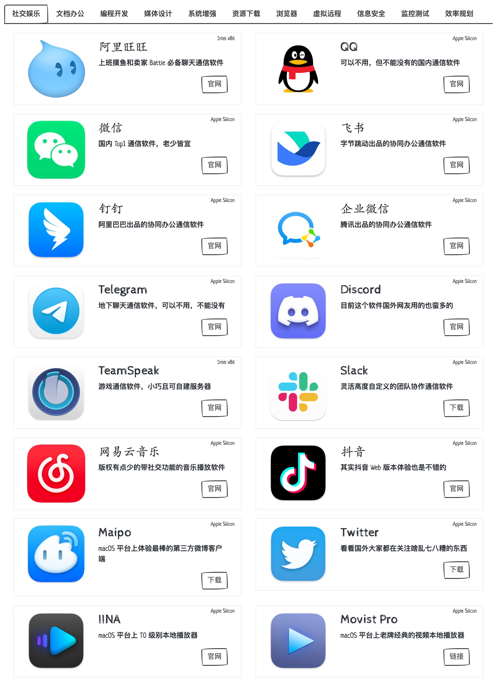
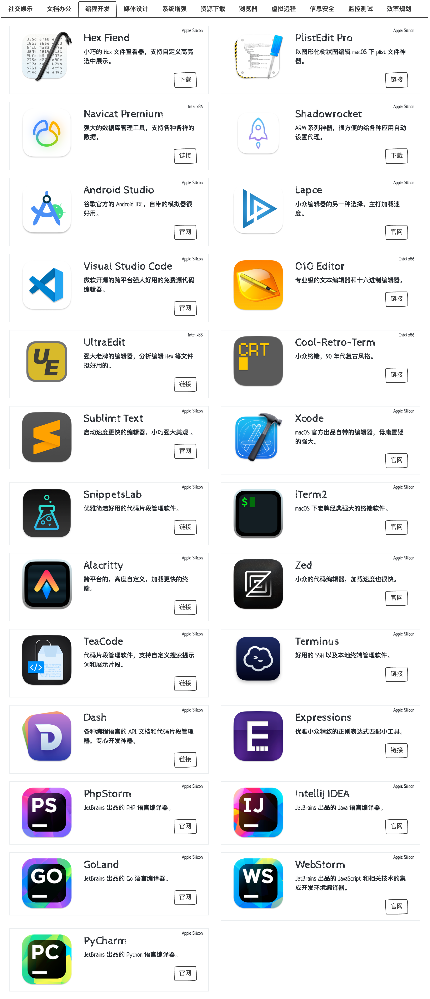
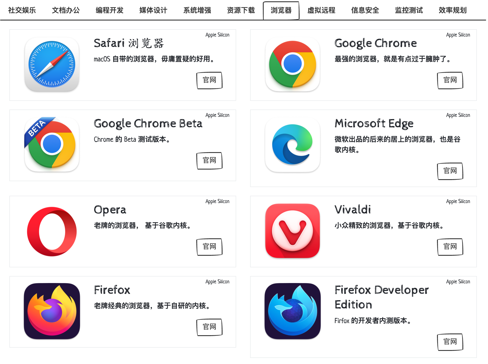
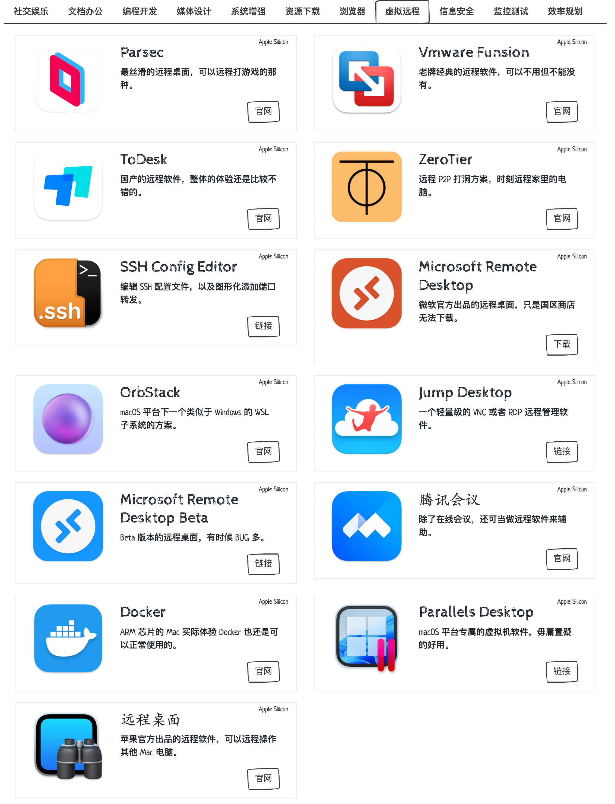
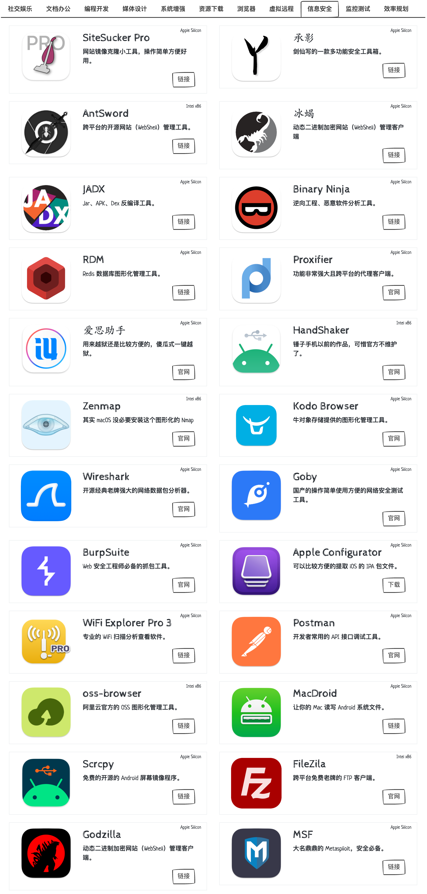

# 国光的 macOS Ventura 13 软件清单

磨刀不误砍柴工，工欲善其事必先利其器，正好最近国光我换了 M1 Pro 的 14 寸的 Macbook Pro 监管机了，真香呀！新的电脑到了又得安装一堆软件，最后为了自己也为了方便大家快速查看，国光我还单独写了个前端页面。

# 背景介绍

本次前端页面还是一如既往的国光的界面设计风格，经典的 Boostrap 框架写的：

[https://www.sqlsec.com/macsoft.html](https://www.sqlsec.com/macsoft.html)

# 软件架构

Apple Silicon 是 Apple 计算机芯片内部使用的处理器架构。M1 和 M2 处理器之类的处理器都使用 Apple Silicon，这标志着与 Apple 使用英特尔 CPU 的背道而驰。

传统的 MacBook 和 iMac 设备以前使用 intel 的 x86 处理器架构，但苹果现在的 Apple Silicon 则是 Arm 架构，这意味搭载 Apple Silicon 的芯片将会有更高的能效比，续航更久，发热更低。

所以我们使用 Apple Silicon 芯片的产品的时候，尽量也要使用 Arm 架构编译优化的软件，能少用 Rosetta 转编译就少用一点，对自己的 MacBook 好一点！

为了方便我们查看软件的架构，这里推荐一个 [Silicon Info](https://apps.apple.com/us/app/silicon-info/id1542271266?mt=12) 软件：

# 社交娱乐

主要是一些上班摸鱼类的软件，IM 通讯、社交、冲浪、音乐、视频类软件。

# 文档办公

主要是日常文档办公用到的软件，可以不用，但不能没有：

# 编程开发

国光不是一个专业的 Coder，所以这块软件并不是很多：

# 媒体设计

国光我不是一个设计师，日常也就录制视频，简单修修图，轻度剪辑视频一下：

# 系统增强

下面是一些国光经常使用的系统增强软件，整体都比较好用方便：

# 资源下载

妈妈再也不用担心我资源下载比较慢了：

# 浏览器

浏览器多用起来就是爽，每天换着用都用不完呀：

# 虚拟远程

主要是一些虚拟机、Docker 还有一些远程软件：

# 信息安全

下面是国光安装的一些安全工具，当然有些安全工具不适合做成应用程序，下面仅供大家参考一下吧：

# 监控测试

平时测试测试一下硬盘速度、看看 CPU 占用，瞅一瞅风扇转速、顺便跑个分：

# 效率规划

磨刀不误砍柴工，工欲善其事必先利其器，这些是国光认为比较提高效率的软件：

