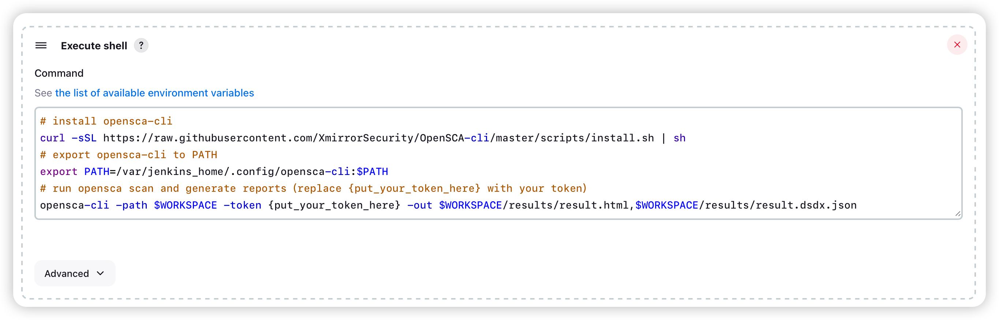
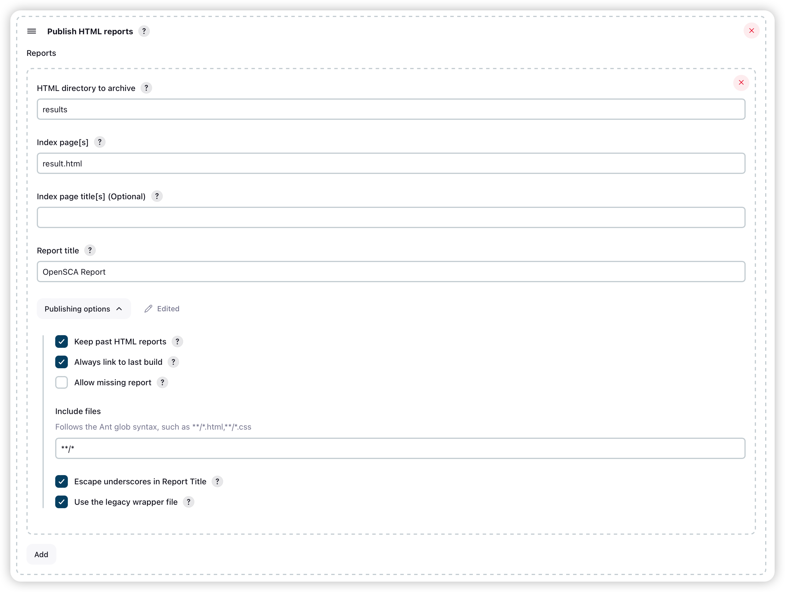
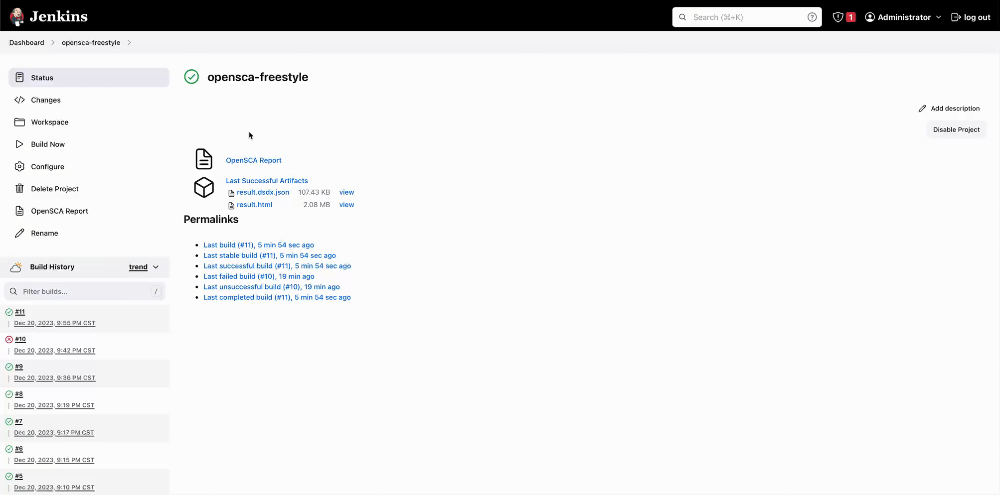

# 在Jenkins及GitlabCI中集成OpenSCA，轻松实现CI/CD开源风险治理 - 先知社区

在Jenkins及GitlabCI中集成OpenSCA，轻松实现CI/CD开源风险治理

- - -

插播：  
OpenSCA-cli 现支持通过 homebrew 以及 winget 安装：

Mac/Linux

```plain
brew install opensca-cli
```

Windows

```plain
winget install opensca-cli
```

总有小伙伴问起如何在CI/CD中集成OpenSCA，文档它这不就来啦~

若您解锁了其他OpenSCA的用法，也欢迎向项目组来稿，将经验分享给社区的小伙伴们~

# Jenkins

在 Jenkins 中集成 OpenSCA，需要在 Jenkins 构建机器中安装 OpenSCA-cli。OpenSCA-cli 支持主流的操作系统，包括 Windows、Linux、MacOS，亦可通过 Docker 镜像运行。

## Freestyle Project

对于自由风格的项目，可以通过在构建步骤中添加 Execute shell 或 Execute Windows batch command 来执行 OpenSCA-cli。

以 Execute shell 为例：  
[](https://ucc.alicdn.com/pic/developer-ecology/xzpskzbwya5ck_b7a180cf5926454cadcbf4279c7ff24d.png)

```plain
# install opensca-cli
curl -sSL https://raw.githubusercontent.com/XmirrorSecurity/OpenSCA-cli/master/scripts/install.sh | sh
# export opensca-cli to PATH
export PATH=/var/jenkins_home/.config/opensca-cli:$PATH
# run opensca scan and generate reports(replace {put_your_token_here} with your token)
opensca-cli -path $WORKSPACE -token {put_your_token_here} -out $WORKSPACE/results/result.html,$WORKSPACE/results/result.dsdx.json
```

-   install.sh 会默认将 OpenSCA 安装在用户家目录 .config 目录下，请根据实际情况调整 PATH 环境变量或使用绝对路径。

## Pipeline Project

对于流水线项目，可以通过在流水线脚本中添加 sh 或 bat 来执行 OpenSCA-cli。以 sh 为例

```plain
pipeline {
    agent any

    stages {

        stage('Build') {
            steps {
                // Get some code from a GitHub repository
                // build it, test it, and archive the binaries.
            }
        }

        stage('Security Scan') {
            steps {
                // install opensca-cli
                sh "curl -sSL https://raw.githubusercontent.com/XmirrorSecurity/OpenSCA-cli/master/scripts/install.sh | sh"
                // run opensca scan and generate reports(replace {put_your_token_here} with your token)
                sh "/var/jenkins_home/.config/opensca-cli/opensca-cli -path $WORKSPACE -token {put_your_token_here} -out $WORKSPACE/results/result.html,$WORKSPACE/results/result.dsdx.json"
            }
        }
    }

    post {
        always {
            // do something post build
        }
    }
}
```

## (可选) 添加构建后动作

在 Jenkins 中，可以通过 Post-build Actions 来实现保存制品、报告等操作，例如可以通过 Publish HTML reports 插件来保存并展示 OpenSCA-cli 生成的 HTML 报告。  
\*请注意，OpenSCA 生成的 HTML 报告需启用 JavaScript 才能正常显示。这需要修改 Jenkins 的安全策略，具体操作请参考 Jenkins 官方文档。这可能会导致 Jenkins 的安全性降低，因此请谨慎操作。

### 修改 Jenkins CSP

在 Jenkins 的 Manage Jenkins -> Script Console 中执行以下脚本：

```plain
System.setProperty("hudson.model.DirectoryBrowserSupport.CSP", "sandbox allow-scripts; default-src 'self'; img-src 'self' data:; style-src 'self' 'unsafe-inline'; script-src 'self' 'unsafe-inline' 'unsafe-eval';")
```

执行完成后，需重启 Jenkins 服务。

确保您已经安装了 Publish HTML reports 插件，然后在 Jenkins 项目的 Post-build Actions 中添加 Publish HTML reports：  
[](https://ucc.alicdn.com/pic/developer-ecology/xzpskzbwya5ck_6d3ef19452f14ee4842f5bd89f055ef7.png)

成功构建后，在 Jenkins Job 的 Dashboard 中，即可看到 OpenSCA-cli 生成的 HTML 报告  
[](https://xzfile.aliyuncs.com/media/upload/picture/20231229163109-9dd27cf8-a624-1.gif)

### Pipeline Script 示例

```plain
post {
    always {
        // do something post build
        publishHTML(
            [
                allowMissing: false,
                alwaysLinkToLastBuild: true,
                keepAll: true,
                reportDir: 'results',
                reportFiles: 'result.html',
                reportName: 'OpenSCA Report',
                reportTitles: 'OpenSCA Report',
                useWrapperFileDirectly: true
            ]
        )
    }
}
```

# GitLab CI

在 GitLab CI 中集成 OpenSCA，需要在 GitLab Runner 中安装 OpenSCA-cli。OpenSCA-cli 支持主流的操作系统，包括 Windows、Linux、MacOS，亦可通过 Docker 镜像运行。

```plain
security-test-job:
    stage: test
    script:
        - echo "do opensca scan..."
        - curl -sSL https://raw.githubusercontent.com/XmirrorSecurity/OpenSCA-cli/master/scripts/install.sh | sh
        - /root/.config/opensca-cli/opensca-cli -path $CI_PROJECT_DIR -token {put_your_token_here} -out $CI_PROJECT_DIR/results/result.html,$CI_PROJECT_DIR/results/result.dsdx.json
    artifacts:
      paths:
        - results/
      untracked: false
      when: on_success
      expire_in: 30 days
```

**完整示例**

```plain
stages:
  - build
  - test
  - deploy

build-job:
  stage: build
  script:
    - echo "Compiling the code..."
    - echo "Compile complete."

unit-test-job:
  stage: test
  script:
    - echo "do unit test..."
    - sleep 10
    - echo "Code coverage is 90%"

lint-test-job:
  stage: test
  script:
    - echo "do lint test..."
    - sleep 10
    - echo "No lint issues found."

security-test-job:
    stage: test
    script:
        - echo "do opensca scan..."
        - curl -sSL https://raw.githubusercontent.com/XmirrorSecurity/OpenSCA-cli/master/scripts/install.sh | sh
        - /root/.config/opensca-cli/opensca-cli -path $CI_PROJECT_DIR -token {put_your_token_here} -out $CI_PROJECT_DIR/results/result.html,$CI_PROJECT_DIR/results/result.dsdx.json
    artifacts:
      paths:
        - results/
      untracked: false
      when: on_success
      expire_in: 30 days

deploy-job:
  stage: deploy
  environment: production
  script:
    - echo "Deploying application..."
    - echo "Application successfully deployed."
```
