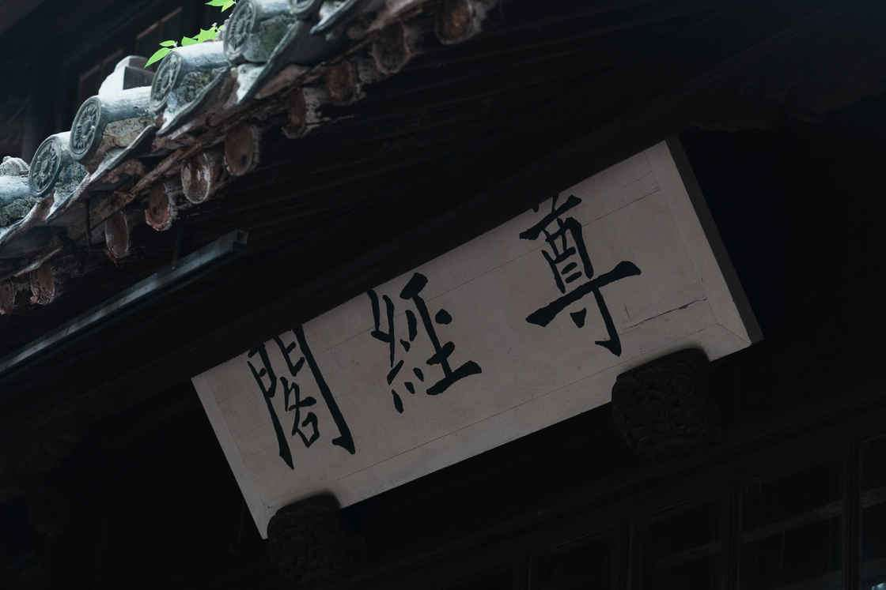
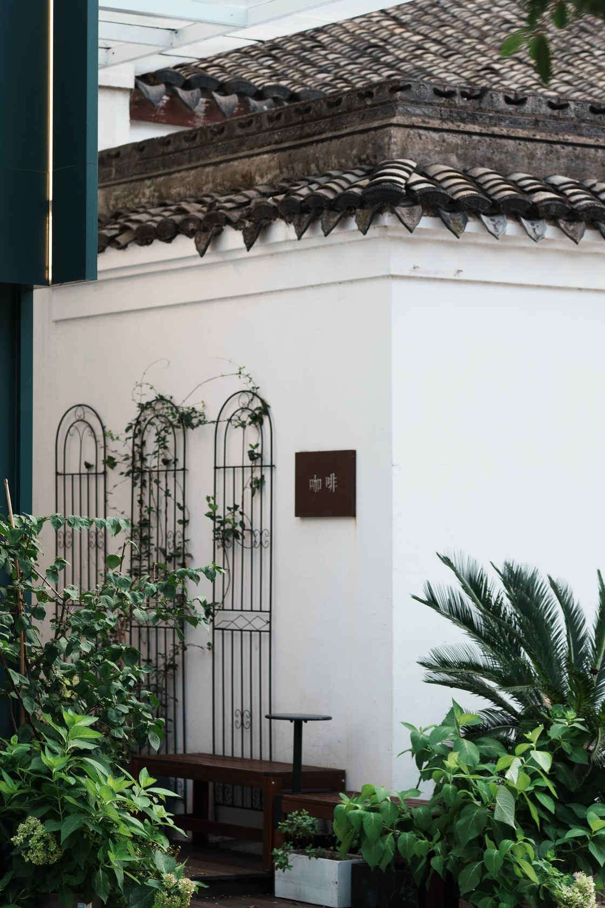
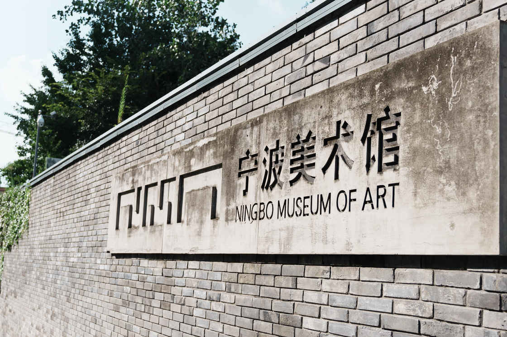
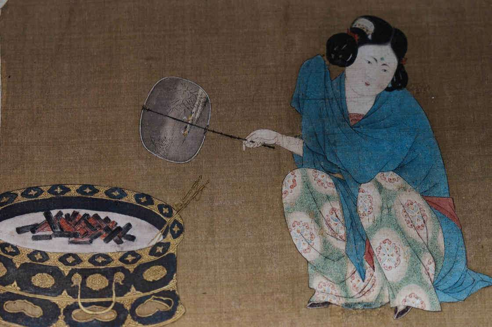
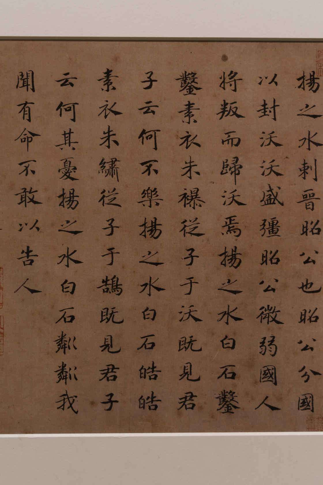
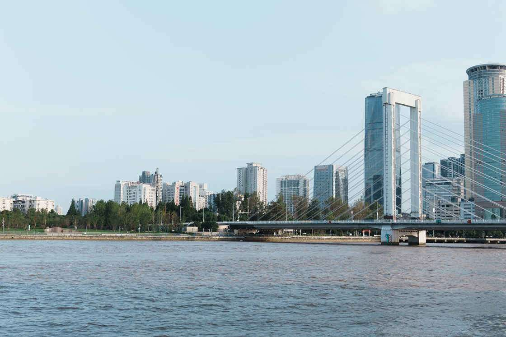

# 城市漫步指南：宁波，用桂花香开启一整个秋天 - 少数派

最初开始计划国庆节假期的时候，已经是 8 月份。对于这个长假期，心里其实一直是有点矛盾的，一方面觉得这个假期这么长不出去玩似乎有些可惜，但另一方面全国游客都开始出动让整个旅行体验充满拥堵。出国是个不错的选择，可是在 8 月份这个节点上计划又显得稍晚了一些。留在北京似乎也是一个不错的选择，毕竟北京的秋天这么短，在这个长假期去享受一下也是极为奢侈的事。不过按照往年的经验，国庆的北京人流量还是很大的，恐怕体验也不是那么的好。于是我们只好采用了一个折中的方案，那就是尽可能去找一个「冷门」一点的旅行地。在这样的方针指引下，我们选择了浙江宁波。

其实宁波这座城市很难说是在我的任何一个旅行列表中的城市，甚至是我如果不去主动调用一些记忆就很难想起的一个城市。为了消弭掉选错旅行地带来的风险，我还特意添加了台州和舟山两个地点作为行程的一部分，正所谓鸡蛋不要放在同一个篮子里，在不确定自己决定正确性的时候，这种方式也许是避免风险的最有效方式。但是，出乎所料的是，宁波给我带来的惊喜似乎远远超过我对它的期待。

## **有一个好的计划就是好的开始**

老实说，经历了三年的疫情之后，感觉自己对于旅行计划这件事不如以前来的那么得心应手了。这其中也许还有心态的原因，自己也好像变成了一个愿意遵循一种固定生活节奏的人 。还好，有队友能够和我一起分担，让我不至于一个人沉溺于拖延的漩涡之中。就像我以前写过[那篇](https://sspai.com/post/39964)一样，在计划旅行时，我这些年似乎没有多大的长进，还是习惯用苹果的 Notes 作为共享文件和队友一起编辑。

旅行计划部分展示

其实有的时候最艰难的一步就是开始，等到把出行日期列好之后，剩下的就都变成了填空题，一步步写上去就好。因为这次旅行秉承的大原则是「错峰」，所以，我们把去程和返程都定在了假期中间，这样就有足够的时间在头和尾进行一些休整和能量储备。

## 城市印象

### 桂花香

在从这趟旅行回来之后，在即刻上看到有人问说：有没有上海的朋友告诉我，十月的桂花到底是什么味道？我当时想到的第一反应就是，就像在桂花拿铁里游泳。那浓郁的香气确实是是我这个北方孩子不曾体会过的一种幸福感。可惜的是相机不能够捕捉气味，否则这座城市拍出来该有多浓郁啊！

尝试用相机捕捉一些桂花

天一阁的桂花标注

### 慢节奏

本来我并没有对宁波这座城市抱有更多的期待，但是事情往往就是这样，在宁波的这一天，出乎意料的非常 chill。早上起了个大早在一个巷子里的早餐店吃了一顿非常本地的早餐。唯一让我感到不适应的是，宁波似乎不是一个咖啡友好城市，在周围看了一圈，发现基本上咖啡店都是十点半甚至十一点以后才开门，这对于我这个一天要靠早上要喝一杯唤醒的人来说简直是太痛苦了。不过这也从侧面反映出这座城市的「慢节奏」。

宁波小巷一瞥

### 天一阁

> 天一阁名甲海内，为全祖望、黄黎洲诸名儒旧游之所，小子心仪数十年矣。今得登临，想象先辈风范，瞻仰四明文教，诚慰平生之愿。

金庸题词 1994

来到天一阁，终于能够体会金庸先生这段题词的含义了。其实在旅行的时候，作为一个普通人，我们对于自然风光的感知远比人文景观要来的更震撼一点，因为人文景观要求我们要有一些「前情提要」作为和这个地方能够情感上建立连接的点，而自然风光是我们能够本能感知到的见到新鲜事物的振奋。

天一阁的角角落落

南国屋檐和竹林

尊经阁

### 咖啡馆

因为早饭后没有找到开门的咖啡馆，从天一阁出来就迫不及待的踏上了寻找咖啡馆的道路。所幸，在附近的迎凤街有几家小店（虽然也还没有全开）。在有限的开门几家里面选择了一家看起来还算惬意的，进去之后发现或许是一家「日咖夜酒」的店。

一家黑色系的惬意小店

终于喝到了咖啡

这样的小店，也许出片率很高，但是咖啡的味道并不会让我有超出星巴克或者瑞幸的体验。也许只能说是我和宁波的咖啡店缘分不够，希望下次来能够找到一个开门较早的好喝的店，能够让我晒着早晨还不算炽热的太阳，安静的读完一本书。

一些未进的咖啡馆

当然在去觅食的路上也经过了一些看起来或者还不错的咖啡馆，无奈没有缘分只能下次去的时候再去探寻了。

### 美术馆

其实现在在做旅行计划的时候，已经很少把美术馆列入计划内了。但是这次出行队友做攻略专门为我安排了这一个美术馆，本着看看又何妨的心情进去逛了逛，结果还是很让人惊喜的。

美术馆大门

首先要提的是，这座建筑本身，座落在宁波老外滩区域的甬江边，整体建筑风格属于让人感觉很舒服的灰暖色调。据说这个建筑的前身是宁波的码头航运大楼，而后来改建的时候，这座楼的整体空间也被这样保留了下来。

美术馆入口长廊

我们去参观的时候刚好赶上了[盛世修典——「中国历代绘画大系」成果展-宁波特展](https://sspai.com/link?target=https%3A%2F%2Fwww.nma.org.cn%2Fexhibition%2Fshow%2F1011.html)的尾巴，不知不觉就在里面消耗了一下午的时光。

一张能看懂的画

一些喜欢的字

### 老外滩

从美术馆出来之后直接就可以走到老外滩，虽然名字听起来有「雷同」之嫌，不过确实名副其实的有着自己悠久历史的一个港口。从唐朝开始就作为中国的四大港口之一，成为了鉴真东渡的起点。在近代，也是「南京条约」里面约定的五口通商口岸之一。尽管历史上的名号听起来略显沉重，不过实际走在老外滩，给人的感觉还是相对轻松的。

老外滩

老外滩

老外滩

## 如果说哪里可以做的更好的话...

那我希望我是带着一个更好的精神状态来探索这座城市。今年发生了很多的事情，从而导致整个人一直处在一种弦被拉得很紧的状态，忙忙碌碌一眨眼就来到了秋天。写下文章的此刻，北方的寒意甚至已经开始召唤秋裤了。在这样的状态下，这样的一趟旅行，少了很多主观的想要去探索的欲望，而更多的时候换个地方换个心情能够给自己充一充电。宁波，惊喜的用它咸湿的风和浓郁的桂花香治愈了疲惫的我的一部分。所以，有机会的话，希望下次能够带着更加饱满的自己再去宁波的大街小巷走走。
