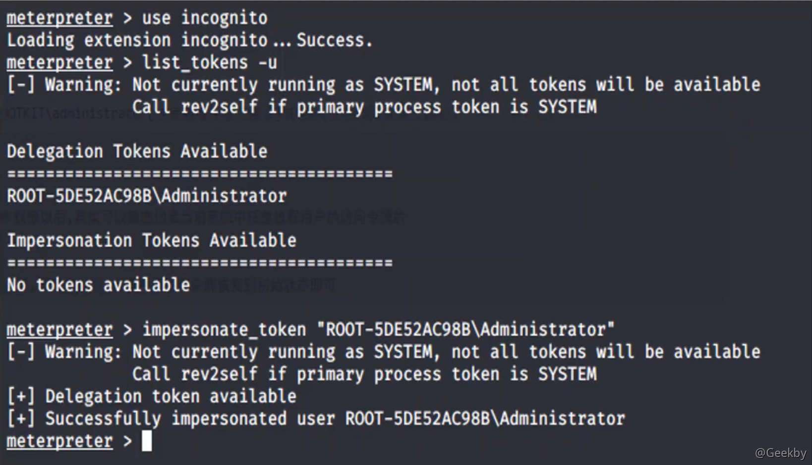
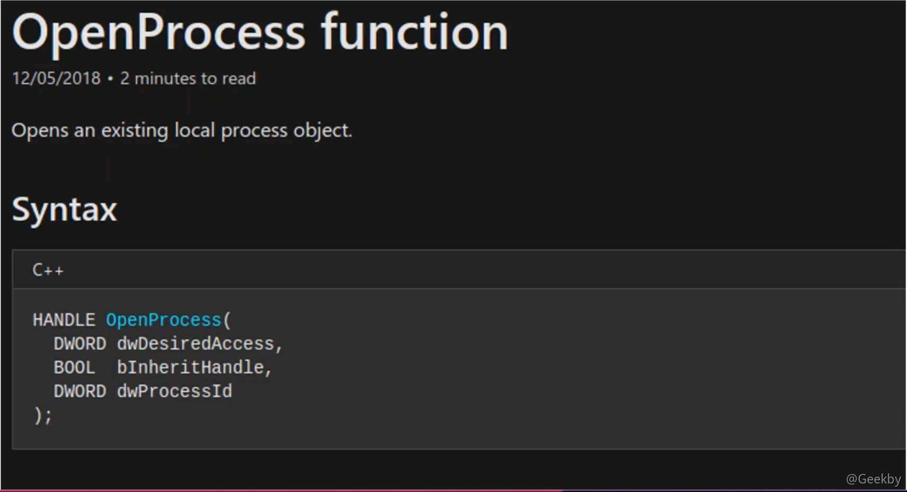
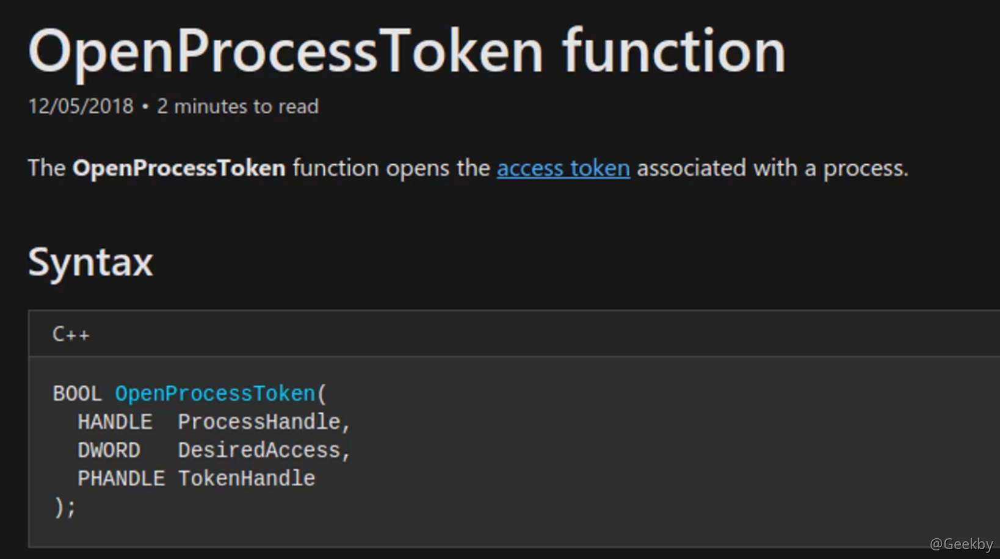
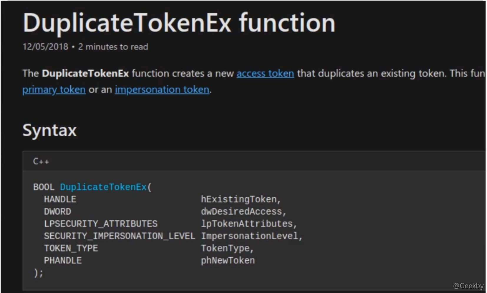

# [](#%E5%9F%9F%E6%B8%97%E9%80%8F%E4%B9%8B-windows-access-token-%E6%94%BB%E5%87%BB)域渗透之 Windows Access Token 攻击

## [](#windows-access-token-%E7%AE%80%E4%BB%8B)Windows Access Token 简介

### [](#windows-access-token-%E6%A6%82%E5%BF%B5)Windows Access Token 概念

微软官方的定义如下：

> An access token is an object that describes the security context of a process or thread.The information in token includes the identity and privileges of the user account associatedwith the process or thread.

Windows Access Token(访问令牌)，它是一个描述进程或者线程安全上下文的一个对象。不同的用户登录计算机后，都会生成一个 Access Token，这个 Token 在用户创建进程或者线程时会被使用，不断的拷贝，这也就解释了 A 用户创建一个进程而该进程没有 B 用户的权限。当用户注销后，系统将会使主令牌切换为模拟令牌，不会将令牌清除，只有在重启机器后才会清除。

Access Token 分为两种(主令牌、模拟令牌)

### [](#windows-access-token-%E5%88%86%E7%B1%BB)Windows Access Token 分类

1、primary token 这种令牌通常用于本地及远程 RDP 登录

2、impersonation token 这种则通常用于各种非交互式的登录，比如，netuse，wmi，winrm等等

#### [](#%E7%99%BB%E5%BD%95%E6%96%B9%E5%BC%8F)登录方式

-   交互式登录
    -   console login (type 2)
    -   rdp login (type 10)
    -   psexec (type 2)
-   网络登录
    -   wmi (type 3)
    -   winrm (type 3)

### [](#windows-access-token-%E7%BB%84%E6%88%90)Windows Access Token 组成

-   用户帐户的安全标识符(SID)
-   用户所属的组的 SID
-   用于标识当前登录会话的登录 SID
-   用户或用户组所拥有的权限列表
-   所有者 SID
-   主要组的 SID
-   访问控制列表
-   访问令牌的来源
-   令牌是主要令牌还是模拟令牌
-   限制 SID 的可选列表
-   目前的模拟等级
-   其他统计数据

### [](#%E5%85%B3%E4%BA%8E-sid)关于 SID

安全标识符(Security identifiers)，简称为 SID，分别是 `OwnerSid` 和 `GroupSid`。所谓 SID 就是每次当我们创建一个用户或一个组的时候，系统会分配给该用户或组一个唯一 SID，当你重新安装系统后，也会得到一个唯一的 SID。SID 是唯一的，不随用户的删除而分配到另外的用户使用。请记住，SID 永远都是唯一的。SIF 是由计算机名、当前时间、当前用户态线程的 CPU 耗费时间的总和三个参数决定以保证它的唯一性。

例：S-1-5-21-1763234323-321265751-1234321321-500(whoami/user)

### [](#windows-access-token-%E4%BA%A7%E7%94%9F%E8%BF%87%E7%A8%8B)Windows Access Token 产生过程

用户使用凭据(用户密码)进行认证 –> 登录 session 创建 –> windows 返回用户的 sid 和用户所在组的 sid –> LSA 创建一个 Access token —> 使用凭据成功认证 –> 登录 session —> token —> 进程、线程


## [](#%E5%90%8E%E6%B8%97%E9%80%8F%E4%B8%AD%E7%9A%84%E4%BB%A4%E7%89%8C%E6%A8%A1%E6%8B%9F)后渗透中的令牌模拟

### [](#cobalt-strike-%E6%A8%A1%E6%8B%9F%E4%BB%A4%E7%89%8C)cobalt strike 模拟令牌

使用 `steal_token` 模拟令牌，`rev2self` 恢复令牌


### [](#metasploit-%E6%A8%A1%E6%8B%9F%E4%BB%A4%E7%89%8C)metasploit 模拟令牌

`incognito` 模块，同样 `rev2self` 恢复令牌



## [](#%E8%8E%B7%E5%8F%96%E4%BB%BB%E6%84%8F%E8%BF%9B%E7%A8%8B%E7%9A%84%E4%BB%A4%E7%89%8C%E6%9D%83%E9%99%90)获取任意进程的令牌权限

### [](#%E6%89%8B%E5%8A%A8%E4%BB%A4%E7%89%8C%E6%A8%A1%E6%8B%9F)手动令牌模拟

模拟过程：

openprocess() –> openprocesstoken() –> impersonateloggedonuser() –> duplicatetokenex() –> createprocesswithtokenw()

#### [](#openprocess)openprocess



#### [](#openprocesstoken)openprocesstoken



#### [](#impersonateloggedonuser)impersonateloggedonuser


#### [](#duplicatetokenex)duplicatetokenex



#### [](#createprocesswithtokenw)createprocesswithtokenw


### [](#bypass-protect-process)Bypass Protect Process

并不是所有的进程都是可以被操作的


只获取 system 权限的进程:

|     |     |     |
| --- | --- | --- |
| ```plain<br>1<br>``` | ```powershell<br>get-token where-object {$_.username-eq 'NT AUTHORITY\SYSTEM' -and $_ownername -ne 'NT AUTHORITY\SYSTEM'} \| select-object processname, processsid \| format-table<br>``` |

然后经过测试发现像 csrss、 service、 wininit、smss 等 token 获取失败。


## [](#%E4%BD%BF%E7%94%A8-access-token-%E8%BF%9B%E8%A1%8C-bypassuac)使用 Access Token 进行 BypassUAC

Fuzzy Security 利用 Windows 令牌实现 UAC 绕过

[https://github.com/fuzzysecurity/powershell-suit/blob/master/UAC-TokenMagic.ps1](https://github.com/fuzzysecurity/powershell-suit/blob/master/UAC-TokenMagic.ps1)


