# 域渗透之用户会话收集分析 - 先知社区

域渗透之用户会话收集分析

- - -

## 查询远程计算机当前登录的用户

查询远程计算机当前登录的用户情况，可以通过以下几种API

-   [RegistryKey](https://learn.microsoft.com/en-us/dotnet/api/microsoft.win32.registrykey?view=net-7.0)
-   [NetWkstaUserEnum](https://learn.microsoft.com/zh-cn/windows/win32/api/lmwksta/nf-lmwksta-netwkstauserenum)

### RegistryKey

1、介绍

Windows注册表，HKU记录了计算机当前登录的用户SID

[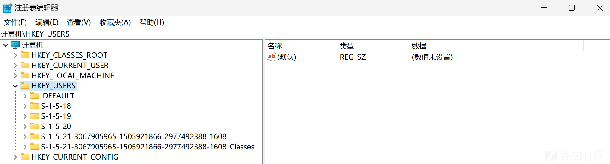](https://xzfile.aliyuncs.com/media/upload/picture/20231125173821-5f2352fc-8b76-1.png)

HKU SID下Volatile Environment的属性USERNAME包含实际用户名

[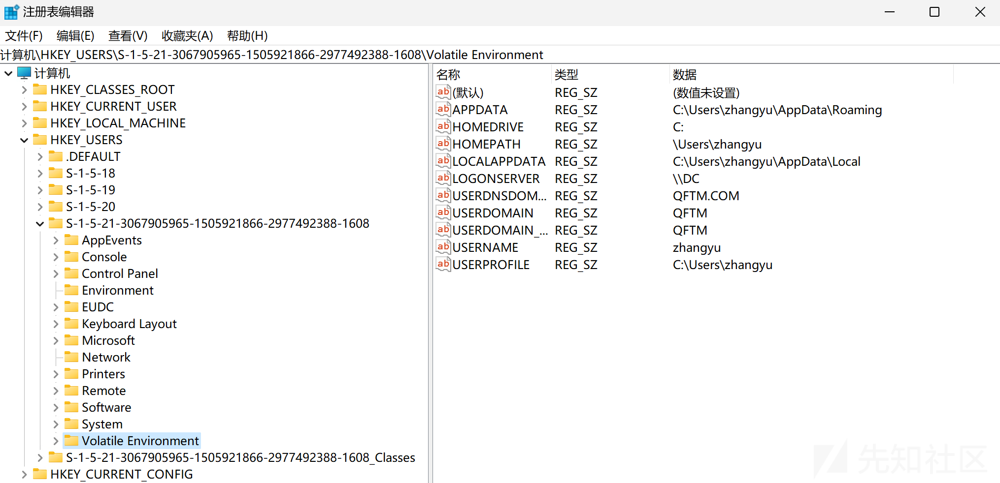](https://xzfile.aliyuncs.com/media/upload/picture/20231125173831-657224bc-8b76-1.png)

由于Windows存在远程注册表服务，可以远程访问注册表，所以可以通过该功能进行读取远程计算机当前登录的用户，从而定位用户登录的计算机

2、服务情况

Windows的Remote Registry Service服务默认启动类型，如下所示

-   客户端默认关闭，启动类型-Disabled
-   服务器默认开启，启动类型-Automatic

查看 Windows 10 Remote Registry Service，默认启动类型为禁用

[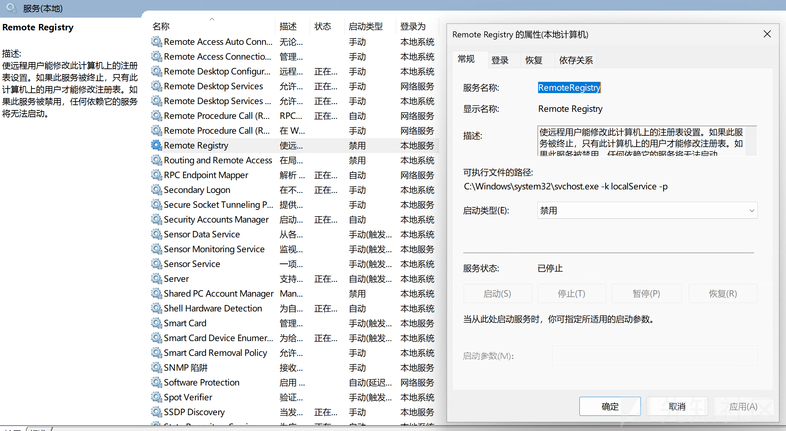](https://xzfile.aliyuncs.com/media/upload/picture/20231125173848-6f26feba-8b76-1.png)

查看 Windows Server 2012 R2 Remote Registry Service，默认启动类型为Automatic

[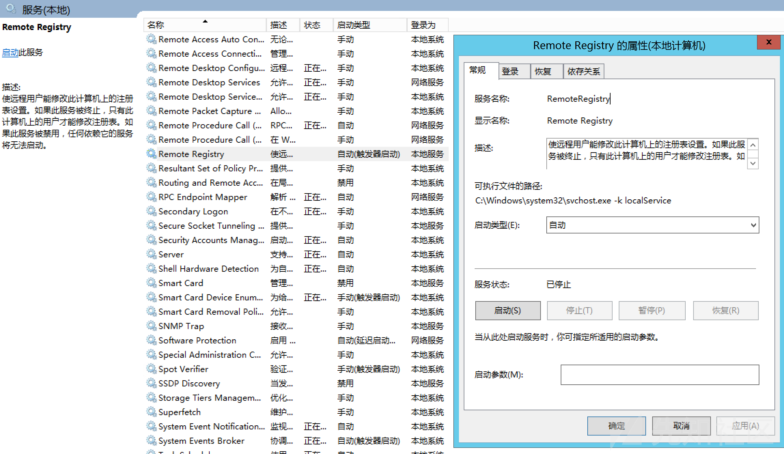](https://xzfile.aliyuncs.com/media/upload/picture/20231125173859-75a23700-8b76-1.png)

Remote Registry Service启动类型Automatic对应的服务状态变化由以下注册表配置决定，默认DisableIdleStop为0

```plain
HKEY_LOCAL_MACHINE\SOFTWARE\Microsoft\Windows NT\CurrentVersion\RemoteRegistry
    REG_DWORD DisableIdleStop
        0=>空闲10min后停止
        1=>空闲时间不停止
```

[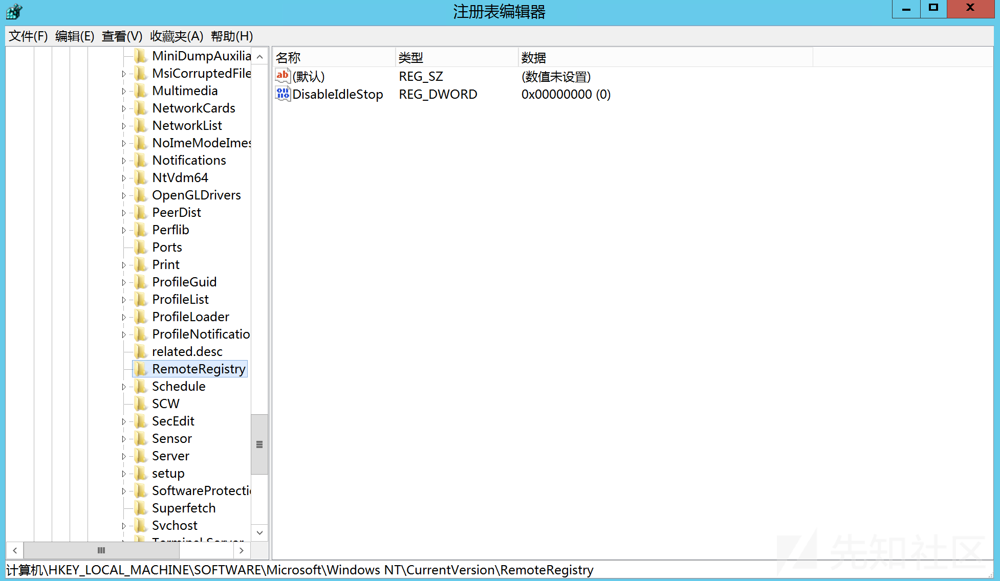](https://xzfile.aliyuncs.com/media/upload/picture/20231125173909-7c074270-8b76-1.png)

由于Remote Registry Service服务由触发器自动启动，所以查看相关触发器

```plain
PS C:\Users> sc.exe qtriggerinfo RemoteRegistry
[SC] QueryServiceConfig2 SUCCESS

SERVICE_NAME: RemoteRegistry

   START SERVICE
      NETWORK EVENT             : 1f81d131-3fac-4537-9e0c-7e7b0c2f4b55 [NAMED PIPE EVENT]
               DATA             : winreg
PS C:\Users>
```

该触发器为winreg命名管道，命名管道相关信息如下

```plain
> sc.exe triggerinfo
[CUT]
        start/namedpipe/pipename        <当请求到达指定的命名管道时启动服务。
                                        不包含管道名称的 "\\.\pipe\" 部分>
```

3、接口权限

通过上面介绍可知，根据注册表的`HKEY_USERS`和`HKEY_USERS\<SID>\Volatile Environment`可以得到计算机当前登录的用户信息，那么查看该键的ACL

`HKEY_USERS`，DACL存在一个ACE为Everyone的可读权限

[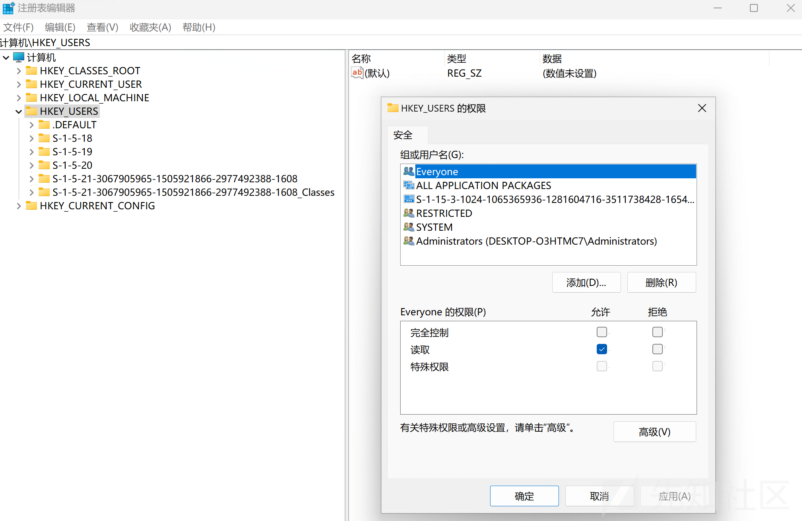](https://xzfile.aliyuncs.com/media/upload/picture/20231125173927-86ba9fbe-8b76-1.png)

`HKEY_USERS\<SID>\Volatile Environment`，DACL中不存在ACE为Everyone的可读权限

[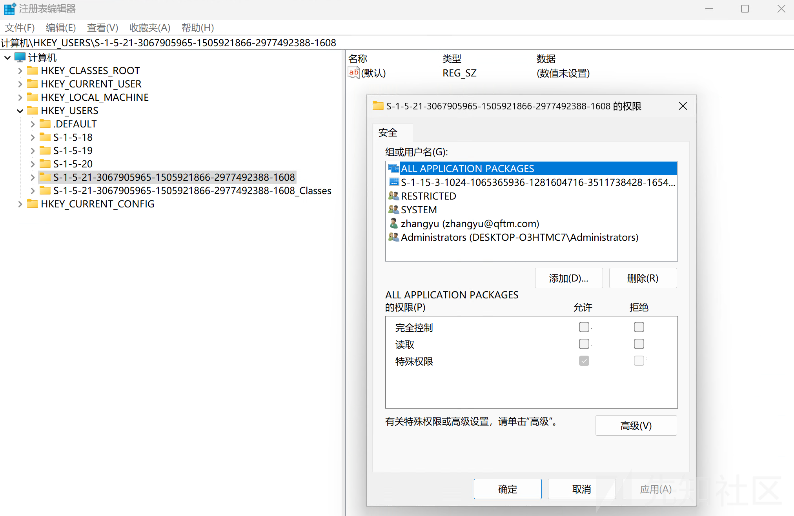](https://xzfile.aliyuncs.com/media/upload/picture/20231125173945-911fc074-8b76-1.png)

由于Windows Server默认开启远程注册表服务，且注册表项`HKEY_USERS`访问权限为Everyone可读，所以可以使用任意域账号访问域内Windows Server注册表，读取域内Windows Server计算机当前登录的用户SID，通过SID可以向域控查找SID对应的具体Object信息，从而得到目标Server当前登录的用户。

关于SID只需要关注`S-1-5-21`开头的即可，因为域内用户SID默认都是以`S-1-5-21`格式开头。

4、远程连接

下面使用不同的工具进行访问远程注册表

（1）regedit.exe

点击File=>Connect Network Registry，输入远程计算机地址

[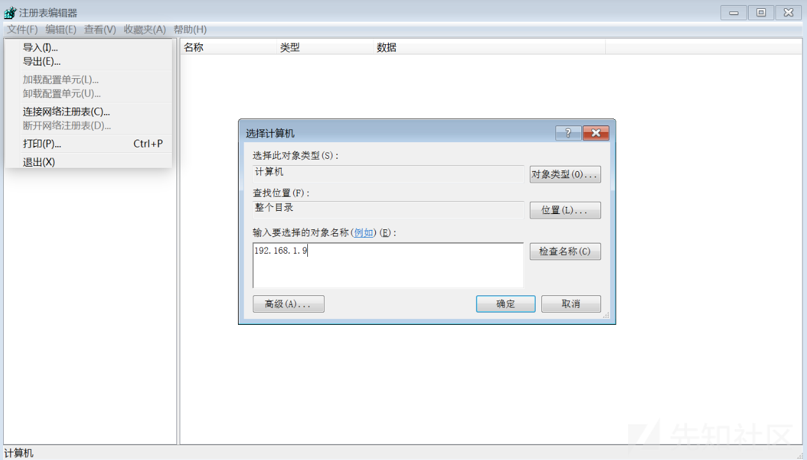](https://xzfile.aliyuncs.com/media/upload/picture/20231125174001-9afcc8a8-8b76-1.png)

远程连接后会显示HKU和HKLM，HKU中可以看到目标计算机当前登录的用户SID

[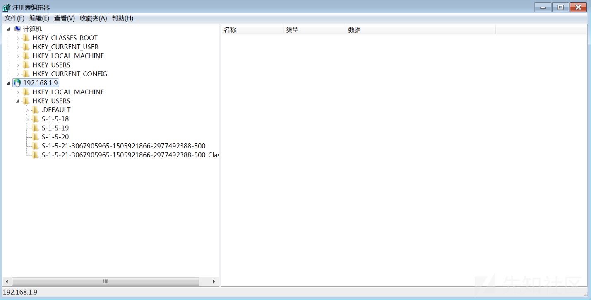](https://xzfile.aliyuncs.com/media/upload/picture/20231125174014-a2dd18d4-8b76-1.png)

点击`HKEY_USERS\SID`会被拒绝访问，因为上面提到默认该键普通用户没有访问权限

[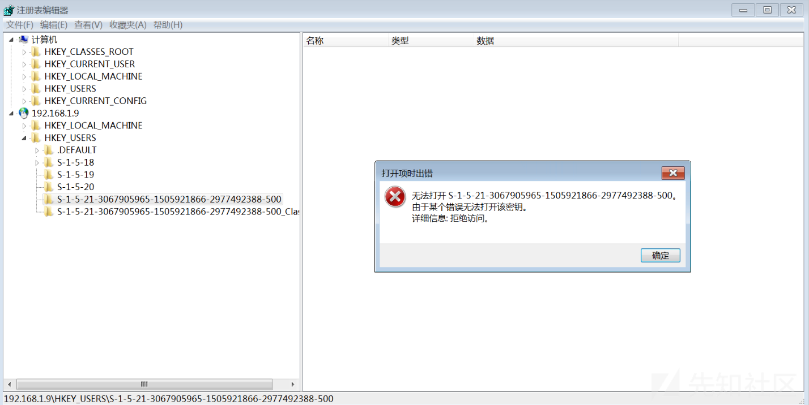](https://xzfile.aliyuncs.com/media/upload/picture/20231125174025-a915f432-8b76-1.png)

通过SID S-1-5-21-3067905965-1505921866-2977492388-500查找域内该用户对象对应的samAccountName属性信息可知登录的用户

```plain
➜ python3 ldapsearch.py -l 192.168.1.9 -d qftm.com -u lihua -p 1234567 -t search -s '(&(objectCategory=person)(objectClass=user)(objectsid=S-1-5-21-3067905965-1505921866-2977492388-500))' samaccountname objectsid
## Result of "search" command ###
[+] |__ objectSid = S-1-5-21-3067905965-1505921866-2977492388-500
[+] |__ sAMAccountName = Administrator
➜
```

（2）powershell

使用powershell调用win32 api [RegistryKey](https://learn.microsoft.com/en-us/dotnet/api/microsoft.win32.registrykey?view=net-7.0)，查询远程注册表项

```plain
# HKU:\
powershell -c "[Microsoft.Win32.RegistryKey]::OpenRemoteBaseKey([Microsoft.Win32.RegistryHive]::Users,'192.168.1.9').OpenSubKey('').GetSubKeyNames()"

# HKLM:\System\CurrentControlSet
powershell -c "[Microsoft.Win32.RegistryKey]::OpenRemoteBaseKey([Microsoft.Win32.RegistryHive]::Users,'192.168.1.9').OpenSubKey('\System\CurrentControlSet').GetSubKeyNames()"
```

测试查看远程目标计算机注册表项：`HKU:\`

```plain
PS Z:\Sec> [Microsoft.Win32.RegistryKey]::OpenRemoteBaseKey([Microsoft.Win32.RegistryHive]::Users,'192.168.1.9').OpenSub
Key('').GetSubKeyNames()
.DEFAULT
S-1-5-19
S-1-5-20
S-1-5-21-3067905965-1505921866-2977492388-500
S-1-5-21-3067905965-1505921866-2977492388-500_Classes
S-1-5-18
PS Z:\Sec>
```

（3）编写Python脚本

核心代码

[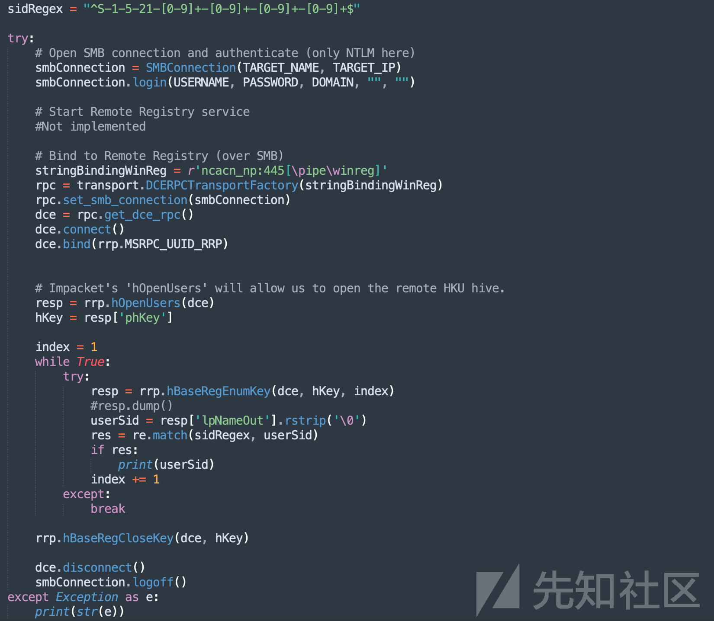](https://xzfile.aliyuncs.com/media/upload/picture/20231125174045-b554a00e-8b76-1.png)

效果

[](https://xzfile.aliyuncs.com/media/upload/picture/20231125174058-bc936062-8b76-1.png)

5、流量分析

通过Wireshark捕获相关流量：客户端远程访问目标主机注册表

```plain
# Wireshark filter
((smb) || (smb2) || (winreg)|| (dcerpc))
```

[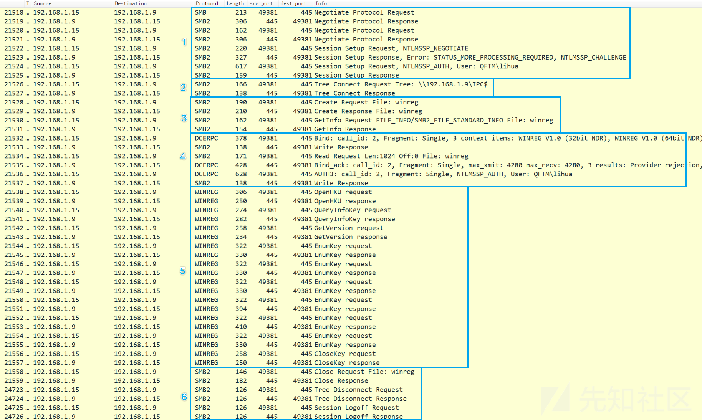](https://xzfile.aliyuncs.com/media/upload/picture/20231125174128-ced62d2c-8b76-1.png)

分析流量，主要包含6个阶段

-   客户端与服务端建立SMB会话（Remote IP：Default NTLM authentication、Remote Hostname：Default Kerberos authentication）
-   客户端连接服务端 `IPC$` 共享
-   打开服务端`winreg`命名管道
-   绑定`winreg`接口
-   使用 [Windows Remote Registry Protocol](https://docs.microsoft.com/en-us/openspecs/windows_protocols/ms-rrp/1dde6845-fca8-49d2-8bc2-199e9a164ac5) 进行交互通信（RPC Method Call）
-   关闭`winreg`命名管道、 `IPC$` 共享连接、SMB会话

这里的[WINREG](https://wiki.wireshark.org/WINREG.md)协议是在`DCE/RPC`协议传输之上，从 `IPC$` 上的 `\PIPE\winreg` 命名管道访问此协议。

TCP=>NetBIOS=>SMB=>DCERPC=>WINREG

[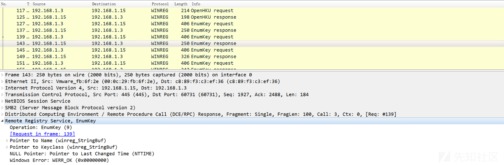](https://xzfile.aliyuncs.com/media/upload/picture/20231125174149-db53ceb0-8b76-1.png)

WINREG协议实现了以下功能，通过RPC进行调用

```plain
winreg_OpenHKCR
winreg_OpenHKCU
winreg_OpenHKLM
winreg_OpenHKPD
winreg_OpenHKU
winreg_CloseKey
winreg_CreateKey
winreg_DeleteKey
winreg_DeleteValue
winreg_EnumKey
winreg_EnumValue
winreg_FlushKey
winreg_GetKeySecurity
winreg_LoadKey
winreg_NotifyChangeKeyValue
winreg_OpenKey
winreg_QueryInfoKey
winreg_QueryValue
winreg_ReplaceKey
winreg_RestoreKey
winreg_SaveKey
winreg_SetKeySecurity
winreg_SetValue
winreg_UnLoadKey
winreg_InitiateSystemShutdown
winreg_AbortSystemShutdown
winreg_GetVersion
winreg_OpenHKCC
winreg_OpenHKDD
winreg_QueryMultipleValues
winreg_InitiateSystemShutdownEx
winreg_SaveKeyEx
winreg_OpenHKPT
winreg_OpenHKPN
winreg_QueryMultipleValues2
```

[DCE/RPC](https://wiki.wireshark.org/DCE/RPC) 协议可以在多种协议上运行，这里是运行在SMB之上

-   TCP：port 135，call ncacn\_ip\_tcp
-   UDP：port 135，call ncacn\_ip\_udp
-   SMB：port 445，SMB auth namedPipe，call ncacn\_np
-   SMB2：port 445，SMB auth namedPipe，call ncacn\_np

6、总结

| API Call | OS version | Admin needed | User status | SMB share | Port | Protocol | Protocol | Name pipe | RPC Interface UUID | RPC Method Call |
| --- | --- | --- | --- | --- | --- | --- | --- | --- | --- | --- |
| [RegistryKey](https://learn.microsoft.com/en-us/dotnet/api/microsoft.win32.registrykey?view=net-7.0) | Windows Server | No  | LoggedOn | IPC$ | 445 | SMB/DCERPC/WINREG | \[MS-RRP\]:[Windows Remote Registry Protocol](https://learn.microsoft.com/en-us/openspecs/windows_protocols/ms-rrp/0fa3191d-bb79-490a-81bd-54c2601b7a78) | \\pipe\\winreg | 338cd001-2244-31f1-aaaa-900038001003 | OpenRemoteBaseKey  <br>OpenSubKey  <br>GetSubKeyNames |

### NetWkstaUserEnum

1、介绍

[NetWkstaUserEnum](https://learn.microsoft.com/zh-cn/windows/win32/api/lmwksta/nf-lmwksta-netwkstauserenum) API可以查询当前登录到该工作站的所有用户的信息，包括交互式登录、服务和批处理登录。

函数结构如下，需要目标主机的管理权限

```plain
NET_API_STATUS NET_API_FUNCTION NetWkstaUserEnum(
  [in]      LMSTR   servername,
  [in]      DWORD   level,
  [out]     LPBYTE  *bufptr,
  [in]      DWORD   prefmaxlen,
  [out]     LPDWORD entriesread,
  [out]     LPDWORD totalentries,
  [in, out] LPDWORD resumehandle
);
```

主要参数

-   servername：指向字符串的指针，该字符串指定要在其中执行函数的远程服务器的 DNS 或 NetBIOS 名称。 如果此参数为 NULL，则使用本地计算机。
    
-   level：指定数据的信息级别。 此参数的取值可为下列值之一：
    

| 值   | 含义  |
| --- | --- |
| 0   | 返回当前登录到工作站的用户的名称。 *bufptr* 参数指向[WKSTA\_USER\_INFO\_0](https://learn.microsoft.com/zh-cn/windows/desktop/api/lmwksta/ns-lmwksta-wksta_user_info_0)结构的数组。 |
| 1   | 返回工作站访问的当前用户和域的名称。 *bufptr* 参数指向[WKSTA\_USER\_INFO\_1](https://learn.microsoft.com/zh-cn/windows/desktop/api/lmwksta/ns-lmwksta-wksta_user_info_1)结构的数组。 |

-   bufptr：指向接收数据的缓冲区的指针。此数据的格式取决于 level 参数的值。此缓冲区由系统分配，必须使用 NetApiBufferFree 函数释放 。请注意，即使函数因 ERROR\_MORE\_DATA 而失败，也必须释放缓冲区。

2、接口权限

如 Microsoft 所述 [https://docs.microsoft.com/en-us/windows/win32/api/lmwksta/nf-lmwksta-netwkstauserenum，只有目标计算机管理员才能成功使用](https://docs.microsoft.com/en-us/windows/win32/api/lmwksta/nf-lmwksta-netwkstauserenum%EF%BC%8C%E5%8F%AA%E6%9C%89%E7%9B%AE%E6%A0%87%E8%AE%A1%E7%AE%97%E6%9C%BA%E7%AE%A1%E7%90%86%E5%91%98%E6%89%8D%E8%83%BD%E6%88%90%E5%8A%9F%E4%BD%BF%E7%94%A8) NetWkstaUserEnum 函数

> Members of the Administrators, and the Server, System and Print Operator local groups can also view information

3、远程查询

编写Python脚本，核心代码如下

[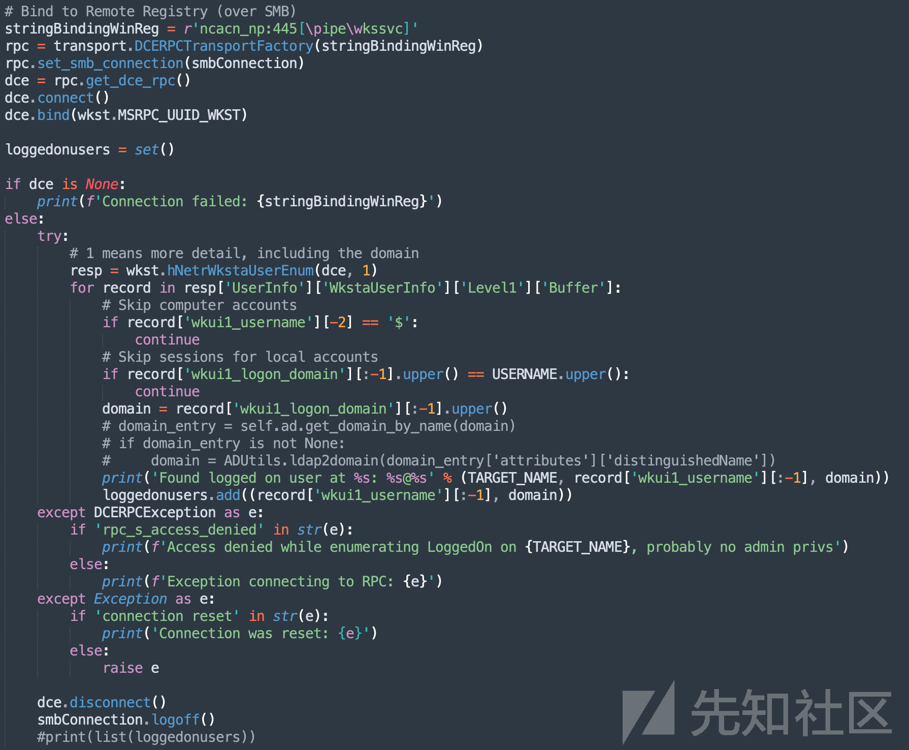](https://xzfile.aliyuncs.com/media/upload/picture/20231125174233-f543c73a-8b76-1.png)

效果

```plain
➜ python3 remote_netWkstaUserEnum.py qftm/lihua:1234567@192.168.1.15
Found logged on user at 192.168.1.15: lihua@QFTM
Found logged on user at 192.168.1.15: dadmin@QFTM
➜ 
➜ python3 remote_netWkstaUserEnum.py qftm/lihua:1234567@192.168.1.9
Access denied while enumerating LoggedOn on 192.168.1.9, probably no admin privs
➜
```

运行结果中一些是没有用的，可以忽略

-   Local user accounts
-   Empty usernames and computer sessions
-   Entries without a logon domain
-   Any logon domain containing a whitespace (to ignore “NT Authority” and similar)

4、流量分析

通过Wireshark捕获相关流量

```plain
# Wireshark filter
((smb) || (smb2) || (wkssvc)|| (dcerpc))
```

[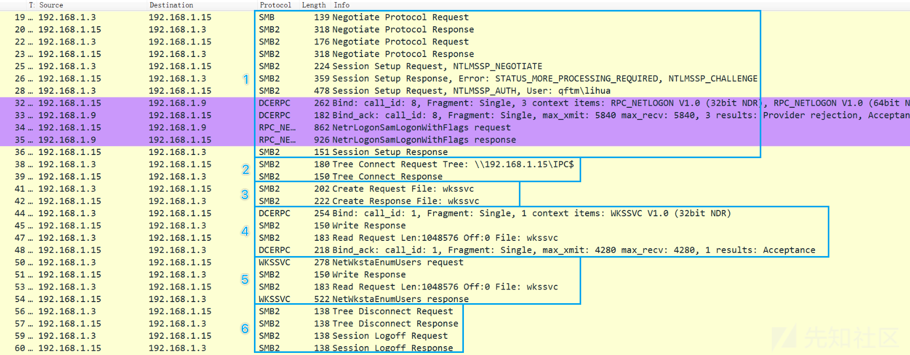](https://xzfile.aliyuncs.com/media/upload/picture/20231125174252-00a7c54a-8b77-1.png)

分析流量，主要包含6个阶段

-   客户端与服务端建立SMB会话（Remote IP：Default NTLM authentication、Remote Hostname：Default Kerberos authentication）
-   客户端连接服务端 `IPC$` 共享
-   打开服务端`wkssvc`命名管道
-   绑定`wkssvc`接口
-   使用 [Workstation Service Remote Protocol](https://learn.microsoft.com/en-us/openspecs/windows_protocols/ms-wkst/5bb08058-bc36-4d3c-abeb-b132228281b7) 进行交互通信（RPC Method Call）
-   关闭`wkssvc`命名管道、 `IPC$` 共享连接、SMB会话

这里的 [WKSSVC](https://learn.microsoft.com/en-us/openspecs/windows_protocols/ms-wkst/5bb08058-bc36-4d3c-abeb-b132228281b7) 协议是在`DCE/RPC`协议传输之上，从 `IPC$` 上的 `\PIPE\wkssvc` 命名管道访问此协议。

TCP=>NetBIOS=>SMB=>DCERPC=>WKSSVC

[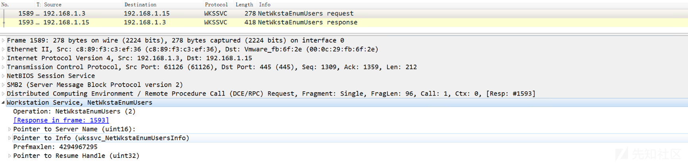](https://xzfile.aliyuncs.com/media/upload/picture/20231125174307-09aed1ec-8b77-1.png)

5、总结

| API Call | OS version | Admin needed | User status | SMB share | Port | Protocol | Protocol | Name pipe | RPC Interface UUID | RPC Method Call |
| --- | --- | --- | --- | --- | --- | --- | --- | --- | --- | --- |
| [NetWkstaUserEnum](https://learn.microsoft.com/zh-cn/windows/win32/api/lmwksta/nf-lmwksta-netwkstauserenum) | ALL | Yes | LoggedOn | IPC$ | 445 | SMB/DCERPC/WKSSVC | \[MS-WKST\]:[Workstation Service Remote Protocol](https://learn.microsoft.com/en-us/openspecs/windows_protocols/ms-wkst/5bb08058-bc36-4d3c-abeb-b132228281b7) | \\pipe\\wkssvc | 6BFFD098-A112-3610-9833-46C3F87E345A | NetrWkstaUserEnum |

## 查询远程计算机当前用户网络会话

查询远程计算机当前网络资源被访问时创建的用户会话，可以通过以下几种API

-   [NetSessionEnum](https://learn.microsoft.com/en-us/windows/win32/api/lmshare/nf-lmshare-netsessionenum)

### NetSessionEnum

1、介绍

[NetSessionEnum](https://learn.microsoft.com/en-us/windows/win32/api/lmshare/nf-lmshare-netsessionenum) API 可以查询访问这台远程主机的网络资源（例如文件共享）时所创建的网络会话，从获得的网络会话中可以看到来自那个域用户及IP等信息。

实际查询远程计算机时，一般选取域控或文件共享服务器等，因为其它服务器基本不会存在用户去访问其网络资源，也就不存在建立的网络会话。

函数结构如下

```plain
NET_API_STATUS NET_API_FUNCTION NetSessionEnum(
  [in]      LMSTR   servername,
  [in]      LMSTR   UncClientName,
  [in]      LMSTR   username,
  [in]      DWORD   level,
  [out]     LPBYTE  *bufptr,
  [in]      DWORD   prefmaxlen,
  [out]     LPDWORD entriesread,
  [out]     LPDWORD totalentries,
  [in, out] LPDWORD resume_handle
);
```

主要参数：

-   servername：指向字符串的指针，该字符串指定要在其中执行函数的远程服务器的 DNS 或 NetBIOS 名称。 如果此参数为 NULL，则使用本地计算机。
-   UncClientName：指向字符串的指针，该字符串指定要为其返回信息的计算机会话的名称。 如果此参数为 NULL， NetSessionEnum 将返回服务器上所有计算机会话的信息。
-   username：指向一个字符串的指针，该字符串指定要为其返回信息的用户的名称。 如果此参数为 NULL， NetSessionEnum 将返回所有用户的信息。
-   level：指定数据的信息级别。
-   bufptr：指向接收数据的缓冲区的指针。此数据的格式取决于 level 参数的值。此缓冲区由系统分配，必须使用 NetApiBufferFree 函数释放 。请注意，即使函数因 ERROR\_MORE\_DATA 而失败，也必须释放缓冲区。

2、接口权限

NetSessionEnum 接口权限在注册表`HKEY_LOCAL_MACHINE\SYSTEM\CurrentControlSet\Services\LanmanServer\DefaultSecurity`的 SrvsvcSessionInfo 中定义

早期一些系统不需要远程主机的管理员权限，通过域认证的用户（Authenticated Users）即可，但是后面的系统需要远程主机管理员权限

```plain
# 早期
- Administrators
- Server Operators
- Power Users
- Authenticated Users

# 后期
- Administrators
- Server Operators
- Power Users
- Interactive
- Service
- Batch
```

根据@compass-security的测试数据如下

| OS version | Patch level after installation | Authenticated users allowed? | Impact of promotion to DC? | Patch level after updates | Impact of security updates? |
| --- | --- | --- | --- | --- | --- |
| Windows 10 1607 | 14393.0 | Yes | –   | 14393.2214 | No  |
| Windows 10 1703 | 15063.0 | Yes | –   | 15063.1418 | No  |
| Windows 10 1709 | 16299.15 | No  | –   | 16299.2166 | No  |
| Windows 10 21H1 | 19043.1165 | No  | –   | 19043.1288 | No  |
| Windows Server 2016 (1607) | 14393.693 | Yes | No  | 14393.4704 | No  |
| Windows Server 2019 (1809) | 17763.737 | No  | No  | 17763.2237 | No  |
| Windows Server 2022 (21H2) | 20348.169 | No  | No  | 20348.288 | No  |

3、等级权限

从 [Microsoft NetSessionEnum Document](https://docs.microsoft.com/de-ch/windows/win32/api/lmshare/nf-lmshare-netsessionenum) 中，可以知道函数接受一个名为 level 的参数，该参数决定应返回哪些信息

| Wert | Bedeutung |
| --- | --- |
| 0   | Geben Sie den Namen des Computers zurück, auf dem die Sitzung eingerichtet wurde. Der *Bufptr-Parameter* verweist auf ein Array von [SESSION\_INFO\_0](https://learn.microsoft.com/de-de/windows/desktop/api/lmshare/ns-lmshare-session_info_0) Strukturen. |
| 1   | Geben Sie den Namen des Computers, den Namen des Benutzers zurück, und öffnen Sie Dateien, Rohre und Geräte auf dem Computer. Der *Bufptr-Parameter* verweist auf ein Array von [SESSION\_INFO\_1](https://learn.microsoft.com/de-de/windows/desktop/api/lmshare/ns-lmshare-session_info_1) Strukturen. |
| 2   | Geben Sie zusätzlich zu den informationen, die für Ebene 1 angegeben sind, den Clienttyp und die Art der Einrichtung der Sitzung zurück. Der *Bufptr-Parameter* verweist auf ein Array von [SESSION\_INFO\_2](https://learn.microsoft.com/de-de/windows/desktop/api/lmshare/ns-lmshare-session_info_2) Strukturen. |
| 10  | Geben Sie den Namen des Computers, den Namen des Benutzers und aktive und leerlaufzeiten für die Sitzung zurück. Der *Bufptr-Parameter* verweist auf ein Array von [SESSION\_INFO\_10](https://learn.microsoft.com/de-de/windows/desktop/api/lmshare/ns-lmshare-session_info_10) Strukturen. |
| 502 | Geben Sie den Namen des Computers zurück; Name des Benutzers; Öffnen sie Dateien, Rohre und Geräte auf dem Computer; und der Name des Transports, den der Client verwendet. Der *Bufptr-Parameter* verweist auf ein Array von [SESSION\_INFO\_502](https://learn.microsoft.com/de-de/windows/desktop/api/lmshare/ns-lmshare-session_info_502) Strukturen. |

实际上，调用该API的用户所需的权限也取决于level，从以下官方描述中可以得知

[https://learn.microsoft.com/en-us/windows/win32/api/lmshare/nf-lmshare-netsessiongetinfo#remarks](https://learn.microsoft.com/en-us/windows/win32/api/lmshare/nf-lmshare-netsessiongetinfo#remarks)

-   level 0 or 10 不需要管理员权限

> Only members of the Administrators or Server Operators local group can successfully execute the **NetSessionGetInfo** function at level 1 or level 2. No special group membership is required for level 0 or level 10 calls.

502 级需要更高的权限，而 Microsoft 文档中并未提及这一点。服务器服务远程协议[Server Service Remote Protocol](https://docs.microsoft.com/en-us/openspecs/windows_protocols/ms-srvs/a7aaab59-390b-4923-934d-6de0da4fc99e) 的技术实现指南给出了502级别权限的解释：

> The server SHOULD[<51>](https://docs.microsoft.com/en-us/openspecs/windows_protocols/ms-srvs/ebb74ff2-abb1-4e1b-a76a-563a5cbbea9a#Appendix_A_51) enforce the security measures to verify that the caller has the required permissions to execute this routine. If the caller does not have the required credentials, the server SHOULD[<52>](https://docs.microsoft.com/en-us/openspecs/windows_protocols/ms-srvs/ebb74ff2-abb1-4e1b-a76a-563a5cbbea9a#Appendix_A_52) fail the call.
> 
> Following the reference <52> leads to the answer:
> 
> [<52> Section 3.1.4.5](https://docs.microsoft.com/en-us/openspecs/windows_protocols/ms-srvs/02b1f559-fda2-4ba3-94c2-806eb2777183#Appendix_A_Target_52): If the caller is not a member of the Administrator or Server Operator local group, Windows-based servers fail the call with the error code ERROR\_ACCESS\_DENIED.

4、远程查询

测试环境

```plain
aHost
    Windows Server 2012R2
    IP 192.168.1.9
    User Administrator
bHost
    Windows 7
    IP 192.168.1.15
    User lihua
cHost 
    Windows 11
    lihua 192.168.1.16
    User zhangyu
```

在cHost主机上与bHost的IPC共享建立连接

```plain
PS > net use \\192.168.1.15\ipc$
命令成功完成。

PS > net use
会记录新的网络连接。

状态         本地       远程                       网络
-------------------------------------------------------------------------------
OK                     \\192.168.1.15\ipc$       Microsoft Windows Network
命令成功完成。

PS >
```

在aHost主机上查询bHost的网络会话

```plain
Z:\Sec>NetSess.exe 192.168.1.15

NetSess V02.00.00cpp Joe Richards (joe@joeware.net) January 2004

Enumerating Host: 192.168.1.15
Client                 User Name                Time       Idle Time
-------------------------------------------------------------------------
\\\\192.168.1.16       zhangyu                  000:04:07  000:04:07
\\\\192.168.1.9        Administrator            000:00:00  000:00:00

Total of 2 entries enumerated

Z:\Sec>
```

分析结果：由于目标主机系统win7 NetSessionEnum API具有Authenticated Users访问权限，且Level为0或1，满足远程计算机用户网络会话查询条件

-   第一条网络会话为cHost与bHost的IPC共享建立的连接会话
-   第二条网络会话为aHost进行查询bHost时，与bHost的IPC共享建立的连接会话（可以忽略）（有些工具会进行过滤如BloodHound的SharpHound Session收集）

**注意**：NetSessionEnum API 几乎不会返回远程主机上登录系统的帐户，因为实际上他们没有需求与自己开放的网络资源如共享建立连接会话。

在aHost主机上查询cHost的网络会话

```plain
Z:\Sec>NetSess.exe 192.168.1.16

NetSess V02.00.00cpp Joe Richards (joe@joeware.net) January 2004

Enumerating Host: 192.168.1.16
Client                 User Name                Time       Idle Time
-------------------------------------------------------------------------

Error: NetSessionEnum (5) 拒绝访问。

Total of 0 entries enumerated

Z:\Sec>
```

分析结果：由于目标主机系统win11 NetSessionEnum API不具有Authenticated Users访问权限，导致远程计算机用户网络会话查询时显示拒绝访问

PS：除了使用NetSess.exe，也可以编写python脚本调用查询

[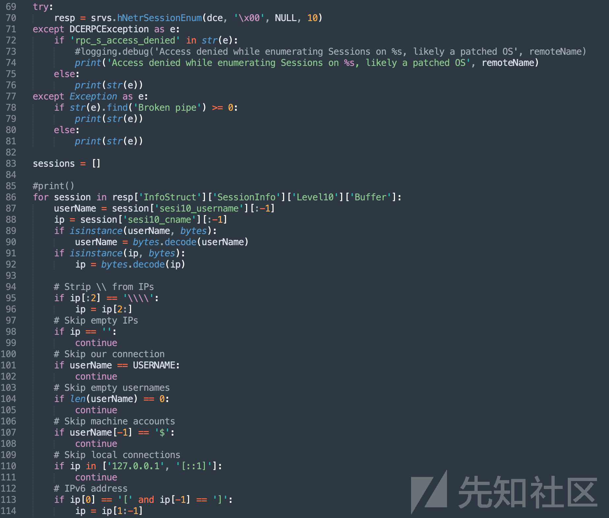](https://xzfile.aliyuncs.com/media/upload/picture/20231125174457-4b14f90e-8b77-1.png)

效果

[](https://xzfile.aliyuncs.com/media/upload/picture/20231125174447-453a08ee-8b77-1.png)

5、流量分析

通过Wireshark捕获相关流量

```plain
# Wireshark filter
((smb) || (smb2) || (srvsvc)|| (dcerpc))
```

[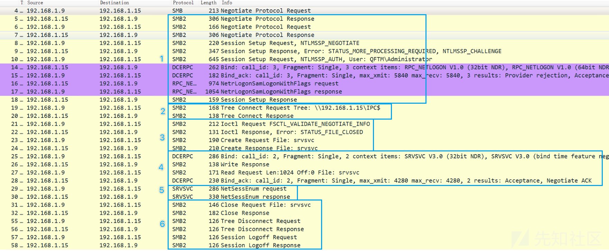](https://xzfile.aliyuncs.com/media/upload/picture/20231125174434-3d8e1dd8-8b77-1.png)

分析流量，主要包含6个阶段

-   客户端与服务端建立SMB会话（Remote IP：Default NTLM authentication、Remote Hostname：Default Kerberos authentication）
-   客户端连接服务端 `IPC$` 共享
-   打开服务端`srvsvc`命名管道
-   绑定`srvsvc`接口
-   使用 [Server Service Remote Protocol](https://docs.microsoft.com/en-us/openspecs/windows_protocols/ms-srvs/a7aaab59-390b-4923-934d-6de0da4fc99e) 进行交互通信（RPC Method Call）
-   关闭`srvsvc`命名管道、 `IPC$` 共享连接、SMB会话

这里的 [SRVSVC](https://docs.microsoft.com/en-us/openspecs/windows_protocols/ms-srvs/a7aaab59-390b-4923-934d-6de0da4fc99e) 协议是在`DCE/RPC`协议传输之上，从 `IPC$` 上的 `\PIPE\srvsvc` 命名管道访问此协议。

TCP=>NetBIOS=>SMB=>DCERPC=>SRVSVC

[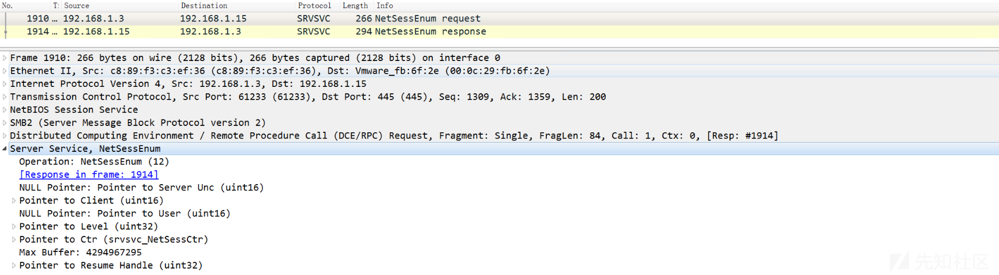](https://xzfile.aliyuncs.com/media/upload/picture/20231125174418-33d65ea4-8b77-1.png)

6、总结

| API Call | OS version | Admin needed | User status | SMB share | Port | Protocol | Protocol | Name pipe | RPC Interface UUID | RPC Method Call |
| --- | --- | --- | --- | --- | --- | --- | --- | --- | --- | --- |
| [NetSessionEnum](https://learn.microsoft.com/en-us/windows/win32/api/lmshare/nf-lmshare-netsessionenum) | Windows 10 1709+ Windows Server 2019 1809+ | Yes | Net Session | IPC$ | 445 | SMB/DCERPC/SRVSVC | \[MS-SRVS\]:[Server Service Remote Protocol](https://docs.microsoft.com/en-us/openspecs/windows_protocols/ms-srvs/a7aaab59-390b-4923-934d-6de0da4fc99e) | \\pipe\\srvsvc | 4B324FC8-1670-01D3-1278-5A47BF6EE188 | NetrSessionEnum |

## 常见用户会话收集工具

### SharpHound

[SharpHound](https://github.com/BloodHoundAD/SharpHound) 的功能解析图（来自@SadProcessor）

[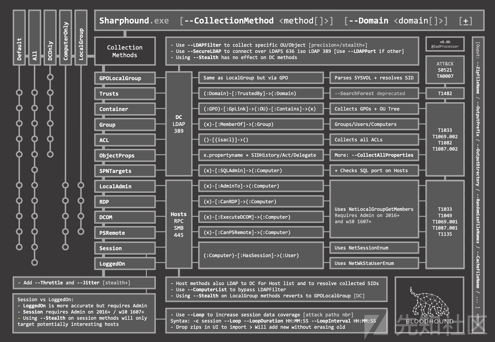](https://xzfile.aliyuncs.com/media/upload/picture/20231125174403-2af84c7a-8b77-1.png)

BloodHound导入SharpHound收集的信息后，在BloodHound Edge中会看到HasSession，代表了XX用户在YY计算机上存在用户会话

[](https://xzfile.aliyuncs.com/media/upload/picture/20231125174646-8c513108-8b77-1.png)

SharpHound 获取HasSession数据的方法有以下三种：

-   RegistryKey
    -   使用WINREG协议，查询远程计算机注册表-HKU（记录了当前登录的用户SID）
-   NetWkstaUserEnum
    -   使用WKSSVC协议，查询远程计算机当前登录的用户（交互式、服务、批处理）
-   NetSessionEnum
    -   使用SRVSVC协议，查询远程计算机网络资源访问时建立的会话

不同收集方法使用的命令如下

```plain
# NetSessionEnum
SharpHound.exe -c session

# NetWkstaUserEnum、RegistryKey
SharpHound.exe -c loggedon

# NetSessionEnum、NetWkstaUserEnum、RegistryKey
SharpHound.exe -c session,loggedon
```

不同方式的对比分析如下

| Method | OS version | Admin needed | Collection method | BloodHound edge | Local users |
| --- | --- | --- | --- | --- | --- |
| NetWkstaUserEnum | All | Yes | LoggedOn | HasSession | No  |
| NetSessionEnum | Windows 10 1709+ Windows Server 2019 1809+ | Yes | Session | HasSession | No  |
| RegistryKey | Windows Server | No  | LoggedOn | HasSession | Yes |

测试：session收集方法，对应NetSessionEnum

```plain
C:\Users\zhangyu\Desktop\SharpHound-v2.0.0>SharpHound.exe -c session
2023-08-21T09:35:08.2313247+08:00|INFORMATION|This version of SharpHound is compatible with the 4.3.1 Release of BloodHound
2023-08-21T09:35:08.7024585+08:00|INFORMATION|Resolved Collection Methods: Session
2023-08-21T09:35:08.8312096+08:00|INFORMATION|Initializing SharpHound at 9:35 on 2023/8/21
2023-08-21T09:35:09.3922491+08:00|INFORMATION|[CommonLib LDAPUtils]Found usable Domain Controller for qftm.com : DC.qftm.com
2023-08-21T09:35:10.0820451+08:00|INFORMATION|Loaded cache with stats: 13 ID to type mappings.
 12 name to SID mappings.
 3 machine sid mappings.
 2 sid to domain mappings.
 0 global catalog mappings.
2023-08-21T09:35:10.1347693+08:00|INFORMATION|Flags: Session
2023-08-21T09:35:10.9551922+08:00|INFORMATION|Beginning LDAP search for Sharphound.EnumerationDomain
2023-08-21T09:35:10.9551922+08:00|INFORMATION|Testing ldap connection to qftm.com
2023-08-21T09:35:11.0065544+08:00|INFORMATION|Producer has finished, closing LDAP channel
2023-08-21T09:35:11.0265604+08:00|INFORMATION|LDAP channel closed, waiting for consumers
2023-08-21T09:35:11.3440596+08:00|INFORMATION|Consumers finished, closing output channel
Closing writers
2023-08-21T09:35:11.3981869+08:00|INFORMATION|Output channel closed, waiting for output task to complete
2023-08-21T09:35:11.6011452+08:00|INFORMATION|Status: 5 objects finished (+5 Infinity)/s -- Using 59 MB RAM
2023-08-21T09:35:11.6021459+08:00|INFORMATION|Enumeration finished in 00:00:00.6571518
2023-08-21T09:35:11.7650004+08:00|INFORMATION|Saving cache with stats: 13 ID to type mappings.
 12 name to SID mappings.
 3 machine sid mappings.
 2 sid to domain mappings.
 0 global catalog mappings.
2023-08-21T09:35:11.7813243+08:00|INFORMATION|SharpHound Enumeration Completed at 9:35 on 2023/8/21! Happy Graphing!

C:\Users\zhangyu\Desktop\SharpHound-v2.0.0>
```

测试：loggedon收集方法，对应NetWkstaUserEnum、RegistryKey

```plain
C:\Users\zhangyu\Desktop\SharpHound-v2.0.0>SharpHound.exe -c loggedon
2023-08-21T09:38:32.3780222+08:00|INFORMATION|This version of SharpHound is compatible with the 4.3.1 Release of BloodHound
2023-08-21T09:38:32.6678878+08:00|INFORMATION|Resolved Collection Methods: LoggedOn
2023-08-21T09:38:32.8050018+08:00|INFORMATION|Initializing SharpHound at 9:38 on 2023/8/21
2023-08-21T09:38:33.1657669+08:00|INFORMATION|[CommonLib LDAPUtils]Found usable Domain Controller for qftm.com : DC.qftm.com
2023-08-21T09:38:33.6692205+08:00|INFORMATION|Loaded cache with stats: 13 ID to type mappings.
 12 name to SID mappings.
 3 machine sid mappings.
 2 sid to domain mappings.
 0 global catalog mappings.
2023-08-21T09:38:33.7058015+08:00|INFORMATION|Flags: LoggedOn
2023-08-21T09:38:34.1216393+08:00|INFORMATION|Beginning LDAP search for Sharphound.EnumerationDomain
2023-08-21T09:38:34.1226403+08:00|INFORMATION|Testing ldap connection to qftm.com
2023-08-21T09:38:34.1780325+08:00|INFORMATION|Producer has finished, closing LDAP channel
2023-08-21T09:38:34.2190308+08:00|INFORMATION|LDAP channel closed, waiting for consumers
2023-08-21T09:38:37.0319695+08:00|INFORMATION|Consumers finished, closing output channel
2023-08-21T09:38:37.0992017+08:00|INFORMATION|Output channel closed, waiting for output task to complete
Closing writers
2023-08-21T09:38:37.3248349+08:00|INFORMATION|Status: 5 objects finished (+5 1.666667)/s -- Using 60 MB RAM
2023-08-21T09:38:37.3268295+08:00|INFORMATION|Enumeration finished in 00:00:03.2144953
2023-08-21T09:38:37.4508237+08:00|INFORMATION|Saving cache with stats: 14 ID to type mappings.
 13 name to SID mappings.
 3 machine sid mappings.
 2 sid to domain mappings.
 0 global catalog mappings.
2023-08-21T09:38:37.4638220+08:00|INFORMATION|SharpHound Enumeration Completed at 9:38 on 2023/8/21! Happy Graphing!

C:\Users\zhangyu\Desktop\SharpHound-v2.0.0>
```

### PsLoggedOn

[PsLoggedOn](https://docs.microsoft.com/en-us/sysinternals/downloads/psloggedon) 利用到以下方法

-   RegistryKey
    -   使用WINREG协议，查询远程计算机注册表-HKU（记录了当前登录的用户SID）
-   NetSessionEnum
    -   使用SRVSVC协议，查询远程计算机网络资源访问时建立的会话

参数介绍

```plain
psloggedon [-] [-l] [-x] [\\Computername|Username]

-:  显示支持的选项和用于输出值的单位。
-l: 仅显示本地登录，不显示本地和网络资源登录。
-x: 不显示登录时间。
\\Computername: 指定要列出登录信息的计算机的名称。
Username:       指定用户名，在网络中搜索该用户登录的计算机。 # 受Computer Browser服务影响
```

使用方式

```plain
# 查询本机登录的用户
PsLoggedon.exe /accepteula 

# 查询指定远程主机登录的用户
PsLoggedon.exe /accepteula \\dc
PsLoggedon.exe /accepteula \\192.168.1.9

# 查询域内用户在哪些机器上登陆 
psloggedon.exe /accepteula administrator
```

测试

-   Users logged on locally：远程计算机当前登录的用户信息
-   Users logged on via resource shares：远程计算机当前用户网络会话信息

```plain
Z:\Sec>PSTools\PsLoggedon.exe /accepteula \\dc

PsLoggedon v1.35 - See who's logged on
Copyright (C) 2000-2016 Mark Russinovich
Sysinternals - www.sysinternals.com

Users logged on locally: 
     <unknown time>             QFTM\Administrator

Users logged on via resource shares:
     2023/8/22 14:40:54         QFTM\lihua
     2023/8/22 14:40:38         \\dc\DESKTOP-O3HTMC7$

Z:\Sec>
```

### PVEFindADUser

[PVEFindADUser](https://github.com/chrisdee/Tools/tree/master/AD/ADFindUsersLoggedOn) 利用到以下方法

-   RegistryKey
    -   使用WINREG协议，查询远程计算机注册表-HKU（记录了当前登录的用户SID）

参数介绍（运行该工具的计算机需要具有.NET Framework 2.0）

```plain
PVEFindADUser.exe <参数>

-h: 显示帮助。
-u: 检查是否有更新版本的实用程序。
-v: 显示详细信息
-current [username]: 如果仅指定了-current 参数，将获取所有目标计算机上当前登录的所有用户。如果指定了用户名(DOMAIN\Username)，则显示该用户登录的计算机。
-last [username]: 如果仅指定了-last 参数，将获取目标计算机上的最后一个登录用户。如果指定了用户名(DOMAIN\Username)，则显示具有此用户账户作为上次登录的计算机.根据网络的策略，可能会隐藏最后一个登录用户名，且该工具可能无法得到该用户名。
-noping: 阻止该工具在尝试获取用户登录信息之前对目标计算机执行 ping 命令。
-target: 可选参数，用于指定要查询的主机。如果未指定此参数，将查询当前域中的所有主机。如果指定此参数，则后跟一个由逗号分隔的主机名列表。
-os: 将目标机器的操作系统信息写入csv文件。如果是直接查询计算机，此选项不输出任何信息
-stopfound: 在找到第一个匹配项时停止搜索。
```

使用方法

```plain
# 查询域中所有机器当前登录的用户
PVEFindADUser.exe -current

# 查询远程主机当前登录的用户，不通过ping检测目标计算机是否开启
PVEFindADUser.exe -current -target dc -noping
PVEFindADUser.exe -current -target dc,win7-01 -noping
PVEFindADUser.exe -current -target 192.168.1.15 -noping

# 查询指定用户当前登录的主机，不通过ping检测目标计算机是否开启
PVEFindADUser.exe -current qftm\dadmin -noping
# 查询指定用户当前登录的主机，不通过ping检测目标计算机是否开启，找到一个即停止寻找
PVEFindADUser.exe -current qftm\dadmin -noping -stopfound
```

测试

```plain
C:\Tools>PVEFindADUser.exe -current -target dc -noping
 -----------------------------------------
  PVE Find AD Users
  Peter Van Eeckhoutte
  (c) 2009 - http://www.corelan.be:8800
  Version : 1.0.0.12
 -----------------------------------------
 [+] Finding currently logged on users ? true
 [+] Finding last logged on users ? false

     [+] Processing host : dc ()
         - Logged on user : qftm\administrator
 [+] Report written to report.csv

C:\Tools>
```

### Netsess

[Netsess](http://www.joeware.net/freetools/tools/netsess/) 利用到以下方法

-   NetSessionEnum
    -   使用SRVSVC协议，查询远程计算机网络资源访问时建立的会话

参数介绍

```plain
Z:\Sec>NetSess.exe /?
NetSess V02.00.00cpp Joe Richards (joe@joeware.net) January 2004
Usage:
 NetSess [ServerName] [ClientName] [switches]
   ServerName     Server to query session info from
   ClientName     Client to query info for

  Switches: (designated by - or /)
   -full          Full session info (requires admin)
   -h servername  Alternate method to specify server
   -u username    Username to filter for
   -c client name Alternate method to specify client name

  Ex1:
    netsess
      Display session info for local machines
  Ex2:
    netsess servername
      Display session info for servername
  Ex3:
    netsess servername /full
      Display FULL session info for servername

 This software is Freeware. Use it as you wish at your own risk.
 If you have improvement ideas, bugs, or just wish to say Hi, I
 receive email 24x7 and read it in a semi-regular timeframe.
 You can usually find me at joe@joeware.net
Z:\Sec>
```

使用方法

```plain
# 查询指定远程主机当前用户网络会话
NetSess.exe 192.168.1.15

# 查询指定远程主机当前用户网络会话，并过滤指定用户
NetSess.exe 192.168.1.15 -u lihua
```

测试

```plain
Z:\Sec>NetSess.exe 192.168.1.15

NetSess V02.00.00cpp Joe Richards (joe@joeware.net) January 2004

Enumerating Host: 192.168.1.15
Client                 User Name                Time       Idle Time
-------------------------------------------------------------------------
\\\\192.168.1.16       zhangyu                  000:04:07  000:04:07
\\\\192.168.1.9        Administrator            000:00:00  000:00:00

Total of 2 entries enumerated

Z:\Sec>
```
