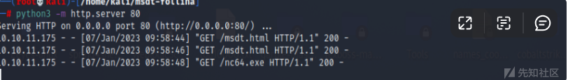
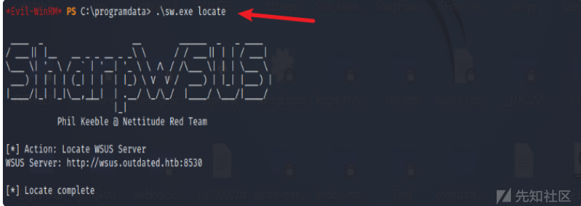

# 域渗透实战之Outdated - 先知社区

域渗透实战之Outdated

- - -

# 信息收集

## 端口扫描

使用nmap进行端口探测，发现开放了大量端口。

通过扫描结果中提到的一些服务是25/SMTP、53/DNS、389/LDAP、445/SMB和5985/WinRM。这些服务的存在表明这台机器可能是一个 Active Directory 域控制器。

nmapmail.outdated.htb还在TCP 25 和dc.outdated.htbLDAPoutdated.htb端口（636、3268、3269）上认证的 TLS 上 识别了主机名。

## SMB枚举

使用crackmapexec确定其操作系统  
crackmapexec将操作系统显示为 Windows 10：

可以列出共享文件/share

使用smbclient也可以证明：

## 读取shares文件

发现一个pdf文件，将其下载到本地。

打开这个pdf，经过翻译之后，发现里面一堆cve漏洞。估计是提示吧。

## 获取漏洞提示

第一个暗示是他们正在寻找人们将 Web 应用程序的链接发送到itsupport@outdated.htb. 这很有用，并表明有人会点击这些链接。  
还有一个 CVE 列表：  
● CVE-2022-30190 - 这是 2022 年 5 月底出现的大型 MSDT（也称为 Folina）漏洞。我会回过头来讨论这个问题。  
● CVE-2022-30129 - 此漏洞利用 VSCode。很多信息都基于这个演示，我认为它试图通过打开浏览器访问 PornHub 来展示 RCE。实际问题在这里描述得很好，涉及vscode://url。  
● CVE-2022-30138 - Windows Print Spooler 中的漏洞，但仅限于本地权限提升。  
● CVE-2022-29130 - LDAP 中的 RCE。在发布时，我找不到任何关于此漏洞利用的 POC。  
● CVE-2022-29110 - Excel 中的 RCE。在发布时，我找不到任何关于此漏洞利用的 POC，也没有迹象表明盒子上安装了 Excel。

# 漏洞利用：

Follina命令执行漏洞

## 漏洞简介

Follina是一个远程代码执行漏洞，当用户或应用程序使用 MSDT URL 协议打开恶意链接时，可以利用该漏洞。由于我们之前下载的文档表明此漏洞未被修补，因此值得我们花时间进行调查。

## 利用条件

为了成功利用此机器，必须满足一些条件。

1.  必须访问我们通过电子邮件提交的 URL
2.  机器必须容易受到 CVE-2022-30190 的攻击  
    检查可利用性  
    我们可以通过设置网络服务器并将 URL 发送到 来验证 url 是否打开itsupport@outdated.htb。为此，我们可以使用名为swaks的 CLI 工具。  
    \`\`\`  
    $ php -S "$lhost:80"

$ for i in {1..3}  
do swaks \\  
\--server "$rhost" \\  
\--to "itsupport@outdated.htb" \\  
\--from "email@mail.com" \\  
\--body "[http://$lhost/](http://$lhost/)"  
done  
\`\`\`  
在我们发送了几封电子邮件并等待几分钟后，我们收到了来自目标的对 Web 服务器的请求。

## 漏洞利用

利用方式  
我将向itsupport@outdated.htb笔记中注明的电子邮件地址发送一封电子邮件，其中包含指向 Folina 漏洞利用的链接。通常，Folina 被打包在一个 word 文档中，以真正解决弹出窗口等问题。为了解决 Outdated，我只需要使用一个使用 JavaScript 重定向到msdt://URL 的 HTML 页面。

## 生成paylaod

下载地址：[https://github.com/JohnHammond/msdt-follina](https://github.com/JohnHammond/msdt-follina)  
利用poc文件，生成payload。

然后开启http服务。

使用nc今天监听反弹shell的443端口。

## 触发漏洞

然后利用swaks去发送邮件，去触发漏洞。

## 获取shell

在等待三分钟左右的时候后，获取到了shell。

# 域信息收集

然后接着对其进行收集域内信息。发现其hostname和ip信息。

## Bloodhound

上传工具  
将SharpHound.exe上传到目标机器当中。

使用-c all进行运行它。

它会生成包含结果的 Zip 存档。  
我将通过 SMB 将其导出，首先在我的主机上开始共享：

将zip文件下载到本地。

## Bloodhound分析

打开 Bloodhound，清除数据库，然后上传 Zip 文件。我将搜索 btables 并将它们标记为已拥有。仔细观察btables，他们在“出站控制权”下有一个“Group Delegated Object Control”：

单击它将它放在图表上：

## Get sflowers NTLM

针对 Active Directory 中的用户和计算机对象的基于 DACL 的攻击技术已经建立多年。如果我们破坏了一个对用户帐户具有委派权限的帐户，我们可以简单地重置他们的密码，或者，如果我们想要减少干扰，我们可以设置一个 SPN 或禁用 Kerberos 预身份验证并尝试烘烤该帐户。对于计算机帐户，它有点复杂，但RBCD 可以完成工作。  
这些技术有其缺点：  
● 重置用户密码具有破坏性，可能会被举报，并且根据交战规则 (ROE) 可能不允许。  
● 烘焙非常耗时，并且取决于具有弱密码的目标，而实际情况可能并非如此。  
● RBCD 很难理解，因为有人（我）没能就它写一篇清晰简洁的文章。  
● RBCD 需要控制具有 SPN 的帐户，创建新的计算机帐户来满足该要求可能会导致检测，并且在实现权限升级之前无法清除。

## Whisker工具使用

Whisker 是一个 C# 工具，用于通过操纵 Active Directory 用户和计算机帐户的msDS-KeyCredentialLink属性来接管它们，有效地将“Shadow Credentials”添加到目标帐户。  
此工具基于Michael Grafnetter ( @MGrafnetter )的DSInternals代码。  
为使此攻击成功，环境必须至少运行 Windows Server 2016 的域控制器，并且域控制器必须具有服务器身份验证证书以允许 PKINIT Kerberos 身份验证。  
有关更多详细信息，请参阅影子凭证：滥用密钥信任帐户映射以进行接管。  
工具地址：[https://github.com/eladshamir/Whisker](https://github.com/eladshamir/Whisker)

## 编译whisker.exe

使用 Visual Studio 2022进行编译，编译之后，然后上传到目标机器当中。  
  
运行它，然后收集 sflowers的信息

## 获取ntlm-hash

上传Rubeus.exe  
然后接着上传Rubeus.exe，并运行它。

生成 sflowers 的 NTLM 哈希，我可以将其用作身份验证。

## WinRM使用

sflowers 是 Remove Management Users 组的一部分，如 Bloodhound 中所示：

## 获取user.txt

# DC

## 横向移动

查找文档  
通过谷歌搜索“enumerate exploit WSUS”，获取到了一些帮助。

## sharpwsus工具使用

SharpWSUS 是一个 CSharp 工具，用于通过 WSUS 进行横向移动。有一个相应的博客 ( [https://labs.nettitude.com/blog/introducing-sharpwsus/](https://labs.nettitude.com/blog/introducing-sharpwsus/) )，其中包含有关工具、用例和检测的更多详细信息。  
[https://labs.nettitude.com/blog/introducing-sharpwsus/](https://labs.nettitude.com/blog/introducing-sharpwsus/)  
它还有一个指向带有该工具的Github 存储库的链接，我将像上面的 Whisker 一样在 Visual Studio 中构建它，并上传到 DC：

## 识别 WSUS

注册表项HKLM:\\software\\policies\\microsoft\\windows\\WindowsUpdate将显示正在使用的 WSUS 服务器。

## 来自 DC：

使用工具进行locate。

从客户端，ping将显示它与 DC 是同一主机。

## WSUS 信息

SharpWSUS.exe还将提供有关使用 WSUS 的客户端的信息：

## 上传psexec工具

创建/批准更新  
使用SharpWSUS.exe. 我将使用nc64.exe. 对于PsExec/args，它不会弹出框并等待单击、作为系统运行并立即返回。

我需要使用输出中给出的语法来更新：  
.\\sw.exe approve /updateid:f41b3a2e-eaf6-4c13-bb43-d9e2c38e8412/computername:dc.outdated.htb /groupname:"CriticalPatches"

成功提权到系统权限

## 获取root.txt

然后查询到root.txt

总结  
通过一步步信息收集，然后根据提示进行漏洞利用，获取shell之后，然后上传一些工具进行获取域内信息，通过影子凭证：滥用关键信托账户映射进行账户接管。然后利用whisker工具获取ntlm-hash，然后进入dc进行横向移动，最后成功获取root权限。
