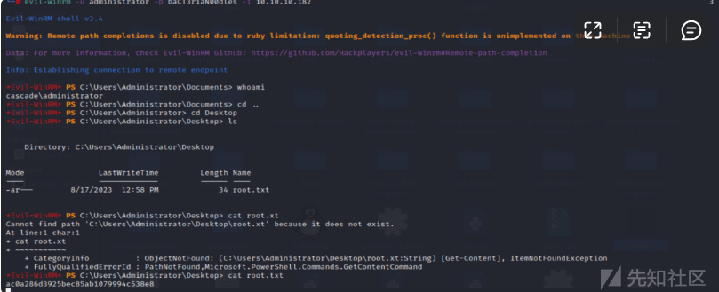

# 域渗透实战之cascade - 先知社区

域渗透实战之cascade

- - -

# 信息收集

## 端口扫描

使用nmap进行端口扫描，发现存在大量端口。  
发现是winserver2008主机。

## SMB未授权访问

SMB似乎允许匿名登录，但随后显示没有共享：

查看smbclient

## RPC-445未授权访问

通过rpcclient空密码连接并收集信息。

## Ldap匿名访问

发现可以匿名访问。

## 枚举 LDAP来收集有用信息。

## 发现dc名

发现一个账号的疑似密码通过base64加密。

## 解密获得一个密码。

尝试通过 WinRM 连接，但没有成功。

# 信息收集

然后接着继续去通过smb，和获取到的密码，获取更多的共享文件

## 枚举共享文件

看到文件列表find：

Meeting\_Notes\_June\_2018.html在 Firefox 中查看时就像电子邮件一样：

在VNC Install.reg里面翻到了一个password

## 破解 VNC 密码

使用msf来破解这个vnc密码  
参考该链接：[https://github.com/frizb/PasswordDecrypts](https://github.com/frizb/PasswordDecrypts)  
成功解出密码。

使用crackmapexec测试，发现可通过 WinRM 获得 shell：

# s.smith -> arksvc

## WinRM获取shell

使用 Evil-WinRM 来获取 shell：

## 获取user.txt

# 内网信息收集

## 查询s.smith 是群组的成员Audit Share：

发现s.smith 是该组中唯一的用户，有一个c:\\shares\\，但无权列出其中的目录：

通过本地访问来读取该共享文件。

将所有文件复制到本地虚拟机。

## 审计数据库

发现一个 SQLite3 数据库。

然后进行连接。

转存了三个表中的所有数据：

## 枚举用户名和密码

然后寻找用户名和密码。

发现RunAudit.bat显示CascAudit.exe以 db 文件作为参数运行：

## net代码审计

根据分析可知CascAudit.exe对某个用户的PWD也就是password进行了AES的CBC模式加密。

我们现在有了VI、KEY、还差Base64的密码。重新下载好数据库后设置一个断点在PWD处运行即可获得我们需要的数据。  
先在要断点的语句前面点一下添加断点。

打开与作为参数传递的数据库的 SQLite 连接，从 LDAP 表中读取数据，并解密密码。  
我决定通过调试恢复明文密码。

## 看到解密的密码：

## WinRM登录

继续使用WinRM来获取shell。

通过 Evil-WinRM 作为 arksvc 获取 shell：

# arksvc -> administrator

查看用户更多信息时发现了AD Recycle Bin。

AD Recycle Bin是一个著名的Windows小组。Active Directory 对象恢复（或回收站）是 Server 2008 中添加的一项功能，允许管理员恢复已删除的项目，就像回收站恢复文件一样。链接的文章提供了一个 PowerShell 命令来查询域中所有已删除的对象：

具体细节可以看这篇文章:  
[https://blog.netwrix.com/2021/11/30/active-directory-object-recovery-recycle-bin/](https://blog.netwrix.com/2021/11/30/active-directory-object-recovery-recycle-bin/)  
接着继续恢复临时管理帐户的密码。

获得该帐户的所有详细信息

## base64解密

接着使用winrm进行连接，获取shell

## 获取root.txt

# 总结：

首先，我们通过nmap扫描发现目标主机是Windows Server 2008 R2 SP1，域名是cascade.local。接着，我们发现Ldap可以匿名访问，并找到了r.thompson@cascade.local的信息。通过对其进行base64解密，我们成功拿到了该用户的密码。

我们可以使用Bloodhound等工具对目标主机的域环境进行分析，发现r.thompson用户属于IT组，但不在远程登录组中。同时，我们还发现IT组总共有3个用户，只有r.thompson用户不在远程登录组中，而S.SMITH@CASCADE.LOCAL和ARKSVC@CASCADE.LOCAL都在远程登录组中。我们可以使用smbmap检查r.thompson用户权限，同时对其进行内网信息收集，一步一步地收集有用的信息。

在Data\\IT\\Temp目录下，我们发现了s.smith目录，并找到了一个VNC文件。将该文件下载到本地后，我们发现里面存在加密的password信息。通过使用VNC解密工具解密，我们成功拿到了s.smith账号权限，并通过smbmap发现该用户可以访问Audit目录。在Audit目录下，我们发现了一个Audit.db文件，它是一个SQLite3数据库文件。

接着，我们发现了arksvc账号信息，并使用dnspy分析同级目录下的CascAudit.exe文件和CascCrypto.dll。通过分析解密逻辑，我们成功拿到了arksvc密码。由于之前的Bloodhound分析已经发现arksvc拥有AD Recycle Bin权限，因此我们可以使用该权限滥用还原TempAdmin账号信息，并进行base64解密，拿到明文密码。

最后，我们根据用户名称TempAdmin推测可能是之前域管的密码，使用密码重用攻击成功登录到administrator域管账号，并使用wmiexec登录域控拿到system权限。  
原文链接：  
[https://blog.netwrix.com/2021/11/30/active-directory-object-recovery-recycle-bin/](https://blog.netwrix.com/2021/11/30/active-directory-object-recovery-recycle-bin/)  
AD Recycle Bin技术  
使用 AD 回收站恢复 Active Directory 对象  
如果启用了AD回收站，当对象被删除时，其大部分属性会保留一段时间，以便在需要时恢复对象。在此期间，对象处于已 删除对象 状态。（此时间段在 msDS-DeletedObjectLifetime 属性中定义。默认情况下，其值是 tombstoneLifetime 属性的值。如果 msDS-deletedObjectLifetime 属性的值为 null 或该属性根本不存在，则解释其值为 tombstoneLifetime 属性的值。如果也没有 tombstoneLifetime 值，则这两个值都默认为 60 天。）  
一旦对象处于已删除对象状态的时间结束，该对象就成为 回收对象。回收的对象看起来可疑地像一个带有 isRecycled 属性并设置为 TRUE 的墓碑。与逻辑删除一样，它的大部分属性都会被删除，并且会在 tombstoneLifetime 属性指定的时间内保留在 Active Directory 中。然后它会被 Active Directory 的垃圾收集清理掉。  
启用回收站后删除的对象的生命周期如下所示：

对象进入回收站后如何变化  
虽然回收站比逻辑删除保存了更多的对象属性，但恢复的对象与原始对象并不相同。让我们看看如何。 这是我计划删除的用户帐户：

这是回收站中处于已删除对象状态的对象：

虽然保留了对象的大部分属性，但存在一些重要的区别：  
● 对象已被移动。 该对象已移至分区的“已删除对象”容器中。  
● 该对象已被重命名。 对象的名称已使用 Common-Name DEL：Object-Guid 进行更新。  
● 该对象拥有一些新属性。 isDeleted 属性的值为 TRUE，并且 填充了lastKnownParent 属性。新属性 msDS-LastKnownRDN填充了对象最后已知的相对可分辨名称（此属性允许回收站在恢复期间正确重置对象的 RDN，即使对象的重命名导致原始 RDN 的截断）。  
● 两个属性已被删除。 删除对象时，始终会从对象中删除两个属性： objectCategory 和 sAMAccountType 。如果恢复对象，objectCategory 值将自动设置为对象的objectClass属性中最具体的值， 并且 sAMAccountType 值根据userAccountControl （对于用户对象）或 groupType 属性（对于组对象） 的值计算 。  
敏锐的读者可能还会注意到， 我的屏幕截图中也缺少manager 和 memberOf属性。他们其实只是躲起来了。这两个属性都是链接值的（即，它们包含对其他对象的引用），并且我使用的工具（LDP）不会返回停用的链接，除非已设置巧妙命名的“返回停用链接”控件。如果我启用了该控件，那么属性及其值将在我的屏幕截图中可见，但我会错过这个教学时刻。  
如何从 AD 回收站恢复对象  
在 Windows Server 2012 之前，从 AD 回收站还原对象需要使用 LDAP 工具或 PowerShell 列出所有已删除的对象，筛选长列表以找到所需的对象，然后使用另一个 PowerShell 命令来还原它。AD 回收站如此有用是一件好事，因为它用起来并不那么有趣！  
现在，Active Directory 管理中心提供了回收站功能：

如您所见，您可以使用搜索过滤器快速找到您感兴趣的已删除对象。  
要恢复对象，只需单击 窗口右侧任务列表中的恢复 即可。恢复后的对象如下所示：

Active Directory 回收站的缺点  
虽然回收站极大地简化了对象恢复，但我们也看到了一些限制：对象仅保留相当短的时间，并且它们的一些属性会丢失。回收站还有一些额外的缺点：  
● 启用 Active Directory 回收站涉及架构更改。 因此，一旦打开回收站，如果没有完整的林恢复，就无法将其关闭。  
● Active Directory 将会变得更大一些。 启用 AD 回收站后，已删除的对象将保留更多的属性，并且比逻辑删除的持续时间更长。因此，Active Directory 可能会比以前使用更多的空间。  
● 启用回收站会删除所有逻辑删除。 启用回收站最有影响的后果是森林中的所有墓碑对象将立即不复存在。许多管理员经历了惨痛的教训才认识到这一后果。  
然而，这些问题并没有超过启用 AD 回收站的好处。  
无需 AD 回收站的 Active Directory 对象恢复  
为了说明启用 AD 回收站的价值，让我们回顾一下在未启用 AD 回收站时恢复 AD 对象所涉及的内容。  
在未启用 AD 回收站的域中，当删除 Active Directory 对象时，它会成为逻辑删除。该对象（去除了其大部分属性）将在域的tombstoneLifetime中指定的时间段内保留在分区的“已删除对象”容器中 。在此期间，该对象在技术上是可以恢复的，但其丢失的属性一般可以认为是不可恢复的。一旦 达到tombstoneLifetime值，该对象就会被垃圾回收，直至不存在。该生命周期如下图所示：

让我们看看如何使用 LDP 实用程序的修改功能来恢复此逻辑删除：

1.  右键单击墓碑并选择“修改”选项。
2.  在编辑条目部分中，在属性字段中输入值“isDeleted” ，选择操作下的删除单选按钮，然后单击Enter按钮将条目添加到条目列表中。
3.  在“编辑条目”部分中，在“属性”字段中输入值“distinguishedName” ，在“值”字段中输入删除之前对象的可分辨名称，选择“操作”下的“替换”单选按钮，然后单击“ Enter”按钮将条目添加到参赛名单。还记得我提到过 lastKnownParent 属性最终可能会有用吗？好吧，如果您不知道对象删除之前的 dn 是什么，您可以尝试以下技巧：获取当前 dn 并替换 NULL 终止字符（“A”）及其右侧的所有内容，并将其替换为 lastKnownParent 的当前值属性。

1.  选择面板左下角的扩展选项。
2.  单击运行按钮。  
    然后我们可以再次找到复活的对象，看看它是什么样子：

如您所见，我们从技术上恢复了已删除的用户对象。然而，它丢失了删除之前所拥有的大部分信息。  
您（理论上）可以通过定期拍摄 Active Directory 的 VSS 快照来解决此问题。然后，如果您需要恢复已删除的对象，您可以“仅”找到删除该对象之前进行的备份，使用 NTDSUTIL 挂载快照，使用 LDAP 实用程序连接到已挂载的快照，找到该对象，然后将其导出……没关系。  
但等等，情况会变得更糟。  
“已删除对象”容器并不是永远存在的东西。CN=Directory Service、CN=Windows NT、CN-Services、CN=Configuration、ForestDistinguishedName对象上恰当命名的tombstoneLifetime属性 定义了从 Active Directory 中永久删除已删除对象之前的天数。  
tombstoneLifetime的值 基于创建域林时涉及的 Windows Server 版本。在使用 2003 年以上的 Windows Server 版本创建的林中，默认设置为 180 天（Microsoft 当前推荐的设置）。较早的实现默认为 60 天。tombstoneLifetime属性的行为 实际上值得关注，而且很酷。如果该值存在，则逻辑删除生存期为指定的值。除非该值小于2；那么逻辑删除生存期默认为 60 天（Windows 2000 Server 到 Windows Server 2008）或 2 天（Windows Server 2008 R2 或更高版本）。如果未指定值，则该值为 60 天。  
如果您对环境中tombstoneLifetime的值感到好奇 ，此 PowerShell 脚本将为您返回它（它需要 AD DS 和 AD LDS 工具）：  
(Get-ADObject -Identity "CN=目录服务,CN=Windows NT,CN=服务,$((Get-ADRootDSE).configurationNamingContext)" -Properties \*).tombstoneLifetime  
一旦某个对象在“已删除对象”容器中度过了逻辑删除生命周期，Active Directory 的垃圾收集逻辑上就会将其删除。到那时，它就消失了，再也不会回来了。
